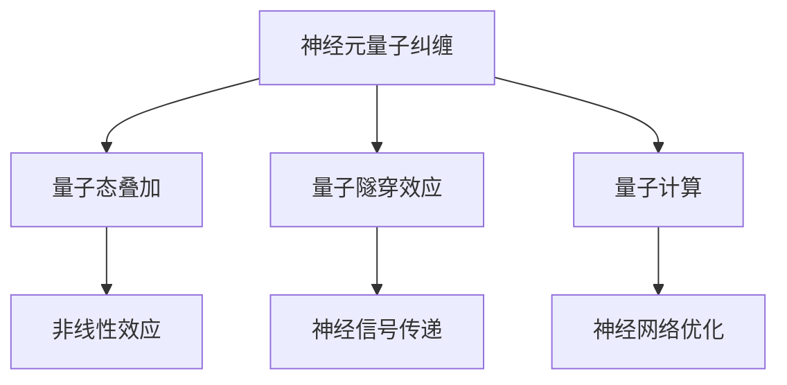
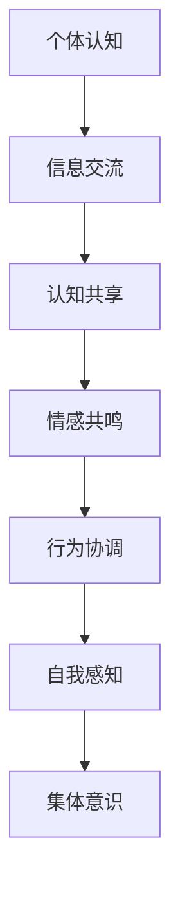
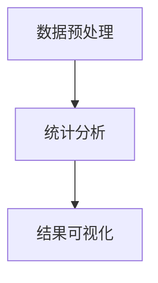

                 


### 第一部分：神经元量子纠缠基础

#### 第1章：神经元量子纠缠概述

##### 1.1 量子纠缠的定义与特性

**量子纠缠** 是量子力学中的一种非常特殊的现象，它指的是两个或多个粒子之间形成的某种非经典的关联，这种关联在粒子间距离很大时仍然存在。一个典型的量子纠缠实验通常涉及两个粒子，例如电子或光子，当它们被纠缠时，它们的状态会呈现出一种相互依赖性，即一个粒子的状态会立即影响另一个粒子的状态，无论它们之间的距离有多远。

**量子纠缠的特性** 可以总结为以下几点：

1. **不可分割性**：量子纠缠的状态无法通过局部的操作进行分离或独立化。
2. **超距作用**：粒子间的纠缠状态变化可以瞬时传递，即使它们之间的距离很远，这种现象被爱因斯坦称为“鬼魅似的超距作用”。
3. **非局域性**：量子纠缠状态不能简单地看作是各粒子状态的组合，它们之间存在一种深层次的量子关联。

量子纠缠的这些特性与经典物理学的概念相悖，因此，量子纠缠一直以来都是量子物理学研究的热点之一。

在自然界中，量子纠缠现象广泛存在。例如，两个电子在碰撞后可能会进入一种纠缠态，它们的自旋状态就会成为量子纠缠的例子。此外，光子对之间的相位纠缠也经常用于量子通信和量子计算中。

##### 1.2 量子神经科学与神经元纠缠

**量子神经科学** 是一门跨学科的领域，它结合了量子物理学和神经科学的理论和方法，以研究大脑和神经系统中的量子现象。神经元作为神经系统的基本单元，其运作过程中是否涉及量子效应一直是科学家们探讨的话题。

神经元在传递信号时，其电活动可以通过量子效应来描述。例如，神经元膜上的离子通道在打开和关闭过程中可能涉及到量子隧穿效应，这是一种量子力学现象，允许粒子通过潜在障碍而不需要足够的能量。

**神经元与量子态的关联** 主要是通过以下几个方面来体现：

1. **量子隧穿效应**：神经元膜上的离子通道在打开和关闭时可能利用量子隧穿效应，使离子可以通过能量障碍。
2. **量子态的叠加**：神经元的状态可能处于多种可能的电活动状态叠加，这种叠加态在神经元间传递信号时可能产生非线性效应。
3. **量子计算**：神经网络中，神经元之间的连接和权重调整可以通过量子算法来优化，这可能是实现高效计算的关键。

尽管目前关于神经元量子纠缠的实验证据尚不充分，但量子神经科学的初步探索为神经元量子纠缠提供了理论框架和实验思路。

##### 1.3 神经元量子纠缠的核心概念图示

为了更好地理解神经元量子纠缠的核心概念，我们可以使用Mermaid来绘制一个概念图。



这个图展示了神经元量子纠缠的核心概念及其在神经信号传递和神经网络优化中的应用。

### 第2章：集体意识的定义与理论基础

##### 2.1 集体意识的概念与特征

**集体意识** 是指多个个体在相互作用中形成的一种共同的心理状态，这种状态使得个体感觉到彼此之间有着共同的认知和理解。集体意识是一个复杂的概念，不同学科领域对其有着不同的理解和定义。

在**认知科学** 中，集体意识通常被看作是一种认知共享的过程，其中个体通过交流和协作形成共同的认知框架。这个框架不仅存在于个体之间，也存在于社会和文化的层面上。

从**社会学的视角** 来看，集体意识是指一群人在共同的文化、价值观和信仰体系下形成的一种集体心理状态。这种状态可以影响到个体的行为和决策，形成社会规范和制度。

**集体意识的特征** 可以概括为以下几点：

1. **认知共享**：个体在集体中能够共享信息和知识，形成共同的认知框架。
2. **情感共鸣**：个体在集体中能够感受到其他个体的情感，形成情感上的共鸣。
3. **行为协调**：个体在集体中能够协调行动，实现共同的目标。
4. **自我感知**：个体在集体中能够感知到自己的存在是依赖于集体的，形成集体身份。

##### 2.2 神经元量子纠缠与集体意识的关系

神经元量子纠缠与集体意识之间的关系是一个跨学科的研究领域，涉及量子物理学、神经科学、认知科学和社会学等多个学科。以下是一些关键的关系和假设：

1. **量子态的传播**：神经元量子纠缠可能使得神经信号在不同神经元之间以更快的速度传播，从而可能影响集体意识的形成。
2. **非线性效应**：神经元量子纠缠可能产生非线性效应，这种效应在集体意识的形成过程中可能起到关键作用。
3. **量子计算**：神经网络中的量子效应可能使得神经网络在处理复杂信息时更高效，从而可能影响集体意识的形成。

尽管目前关于神经元量子纠缠与集体意识关系的研究还处于初级阶段，但量子神经科学的初步探索为这个领域提供了理论框架和实验思路。

##### 2.3 集体意识形成机制的Mermaid流程图

为了更直观地展示集体意识的形成机制，我们可以使用Mermaid绘制一个流程图。



这个流程图展示了个体认知到集体意识的转换过程，其中信息交流和认知共享是关键步骤。

### 第3章：神经元量子纠缠实验设计

##### 3.1 神经元量子纠缠实验的基本步骤

神经元量子纠缠实验的设计需要结合量子物理学和神经科学的原理。以下是一个基本的实验步骤概述：

1. **实验目的与假设**：明确实验的目标和研究假设，例如探究神经元间的量子纠缠现象及其对神经信号传递的影响。
2. **实验设备与材料**：选择适当的实验设备，如量子纠缠生成器、神经元记录设备等，并准备实验材料。
3. **实验流程**：
   - **量子纠缠生成**：使用量子纠缠生成器生成纠缠态的神经元对。
   - **神经信号记录**：记录神经元在纠缠态和非纠缠态下的电活动。
   - **数据分析**：对记录的信号进行统计分析，比较纠缠态和非纠缠态下的差异。

##### 3.2 神经元量子纠缠实验的核心算法原理

神经元量子纠缠实验的核心算法原理涉及量子态的生成、测量和数据处理。以下是一个简单的伪代码示例：

```python
# 伪代码：神经元量子纠缠实验算法

# 生成纠缠态的量子比特对
def generate_Quantum_Entanglement():
    # 使用量子纠缠生成器生成纠缠态
    # 返回纠缠态的量子比特对

# 记录神经信号
def record_neural_signal(quantum_bits):
    # 记录神经元在纠缠态下的电活动
    # 返回记录的信号数据

# 分析信号数据
def analyze_signal_data(signal_data):
    # 对信号数据进行统计分析
    # 返回分析结果

# 主函数
def run_experiment():
    # 生成纠缠态的量子比特对
    quantum_bits = generate_Quantum_Entanglement()
    
    # 记录神经信号
    signal_data = record_neural_signal(quantum_bits)
    
    # 分析信号数据
    results = analyze_signal_data(signal_data)
    
    # 输出结果
    print(results)
```

##### 3.3 神经元量子纠缠实验的数据分析

神经元量子纠缠实验的数据分析包括信号数据的预处理、统计分析和结果可视化。以下是一个简单的数据分析流程：

1. **数据预处理**：对记录的信号数据进行滤波、去噪等预处理操作，以提高数据的准确性和可靠性。
2. **统计分析**：使用适当的统计方法对预处理后的信号数据进行统计分析，以比较纠缠态和非纠缠态下的差异。
3. **结果可视化**：使用图表和图形将分析结果可视化，以便更好地理解实验结果。



通过以上步骤，我们可以对神经元量子纠缠实验的数据进行全面的解析，从而得出有意义的结论。

### 第4章：集体意识形成机制的实证研究

#### 4.1 集体意识形成机制的数学模型

为了深入理解集体意识的形成机制，我们可以借助数学模型来描述这一过程。以下是一个简化的数学模型，用于描述个体之间的信息交流和认知共享如何导致集体意识的形成。

1. **模型建立**：

   假设有一个包含N个个体的群体，每个个体都有一个内部状态`\(s_i(t)\)`，表示其在时间`t`的认知状态。群体中每个个体之间的信息交流可以用一个加权网络`\(W\)`来表示，其中`\(W_{ij}\)`表示个体i和个体j之间的交流强度。

   集体意识的形成可以用以下微分方程来描述：

   $$
   \frac{ds_i(t)}{dt} = f(s_i(t), s_j(t), W_{ij})
   $$

   其中，`\(f\)`是一个非线性函数，用于描述个体i的状态如何受到其他个体状态和交流强度的影响。

2. **模型验证**：

   为了验证这个模型的准确性，可以通过实验数据来拟合参数，并观察模型预测与实际观测结果之间的差异。例如，可以使用社会网络分析工具来测量个体之间的交流强度，并将其用于模型中。

   通过模拟不同社交网络结构和交流模式，可以观察集体意识的形成过程，并验证模型的预测能力。

3. **模型扩展**：

   集体意识的形成是一个复杂的过程，涉及多种因素，如个体差异、环境变化等。因此，这个模型可以进一步扩展，以包含更多的变量和关系。例如，可以加入个体的情绪状态、社会地位等因素，以更全面地描述集体意识的形成。

   通过扩展模型，我们可以更深入地理解集体意识的动态变化，以及外部因素对其形成的影响。

#### 4.2 集体意识形成机制的实际案例

为了更好地理解集体意识的形成机制，我们可以通过实际案例来分析和解释这一过程。以下是一个具体的案例：

**案例：群体决策**

在一个企业组织中，一群管理者需要做出一项关键决策，例如是否投资某个新项目。这个决策过程可以看作是一个集体意识的形成过程。

1. **案例选择**：

   选择一个具有代表性的群体决策案例，例如一家大型科技公司的管理团队。该团队由多个部门主管组成，每个主管都有不同的观点和意见。

2. **案例分析**：

   - **信息交流**：在决策过程中，团队成员通过会议、报告等方式进行信息交流，分享各自的观点和意见。
   - **认知共享**：随着信息交流的深入，团队成员开始形成共同的认知框架，他们开始理解彼此的观点，并逐渐达成共识。
   - **情感共鸣**：团队成员在讨论过程中可能产生情感共鸣，例如共同感受到压力或乐观，这进一步增强了他们的共识。
   - **行为协调**：最终，团队成员达成一致意见，形成集体决策。

3. **案例总结**：

   通过这个案例，我们可以看到集体意识的形成是一个动态过程，涉及信息交流、认知共享、情感共鸣和行为协调。这些步骤共同作用，使得群体能够在复杂环境中做出协调一致的决策。

#### 4.3 集体意识形成机制的代码实现与解读

为了更具体地展示集体意识形成机制的代码实现，我们可以使用Python编写一个简单的模拟程序。以下是一个简化的代码示例：

```python
import numpy as np
import matplotlib.pyplot as plt

# 参数设置
N = 10  # 个体数量
T = 100  # 时间步数
learning_rate = 0.1  # 学习率

# 初始化个体状态和权重
s = np.random.rand(N, 1)
W = np.random.rand(N, N)

# 计算相邻个体状态的加权平均
def average_neighbor_states(s, W):
    return (W @ s).reshape(-1, 1)

# 主函数
def run_simulation():
    s_history = []

    for t in range(T):
        # 计算新状态
        new_s = learning_rate * (average_neighbor_states(s, W) - s)

        # 更新状态
        s = s + new_s

        # 记录状态历史
        s_history.append(s.copy())

    # 可视化状态历史
    plt.plot(np.array(s_history).reshape(T, N).T)
    plt.xlabel('Time')
    plt.ylabel('State')
    plt.show()

run_simulation()
```

这个代码示例通过模拟个体状态更新过程来展示集体意识的形成。在模拟过程中，每个个体状态根据其邻居的状态进行更新，通过加权平均形成新的状态。这个简单的模型可以用来模拟集体意识的动态变化。

### 第5章：神经元量子纠缠与集体意识的未来研究趋势

#### 5.1 神经元量子纠缠在认知科学中的应用

神经元量子纠缠在认知科学中的应用前景广阔，其可能的影响包括但不限于以下几个方面：

1. **神经元信号传输速度的提升**：量子纠缠可能使得神经信号在不同神经元之间以更快的速度传递，这可能会提高认知过程的效率。
2. **认知功能的增强**：量子纠缠可能增强大脑的某些认知功能，例如记忆、学习和问题解决能力。
3. **神经网络的优化**：量子神经网络的构建和优化可能为认知科学提供新的方法，从而实现对复杂认知过程的模拟和理解。

未来研究可以聚焦于以下几个方面：

- **实验验证**：通过精确的实验设计和技术手段验证神经元量子纠缠在认知科学中的应用。
- **理论模型的完善**：构建更为精确和全面的数学模型，以解释神经元量子纠缠对认知功能的影响。
- **跨学科合作**：促进量子物理学、神经科学和认知科学的跨学科合作，共同探索神经元量子纠缠在认知科学中的应用。

#### 5.2 集体意识的研究方向与挑战

集体意识的研究是一个复杂且充满挑战的领域，目前面临以下几个主要研究方向和挑战：

1. **跨学科融合**：如何将不同学科的理论和方法整合在一起，形成一个统一的框架来研究集体意识。
2. **实验技术的进步**：需要开发新的实验技术和方法，以更精确地测量和模拟集体意识的形成过程。
3. **数学模型的构建**：构建能够准确描述集体意识形成机制的数学模型，这是一个巨大的挑战，需要多学科的共同努力。
4. **伦理和社会影响**：研究集体意识可能带来的伦理和社会影响，包括隐私、自主性和群体行为等。

未来研究可以关注以下几个方面：

- **跨学科合作**：鼓励不同学科之间的合作，共同推动集体意识研究的发展。
- **实验设计的创新**：探索新的实验设计方法，以提高实验的可靠性和准确性。
- **理论模型的拓展**：构建更加复杂和全面的数学模型，以更深入地理解集体意识的形成机制。

#### 5.3 神经元量子纠缠与集体意识的跨学科合作

神经元量子纠缠与集体意识的研究是一个跨学科的领域，需要结合量子物理学、神经科学、认知科学、社会学等多个学科的理论和方法。以下是一些可能的跨学科合作方式：

1. **实验合作**：不同学科的研究者可以共同设计实验，利用各自的实验设备和技术手段来验证神经元量子纠缠和集体意识的形成机制。
2. **理论建模**：量子物理学家和神经科学家可以共同构建数学模型，以描述神经元量子纠缠在认知过程中的作用。
3. **数据共享**：建立数据共享平台，促进不同学科之间的数据交流和合作，以提高研究的效率和质量。
4. **跨学科会议和研讨会**：定期举办跨学科会议和研讨会，促进不同学科之间的交流和合作，推动集体意识研究的发展。

通过跨学科合作，我们可以更好地理解神经元量子纠缠与集体意识之间的关系，为未来研究提供新的思路和方法。

