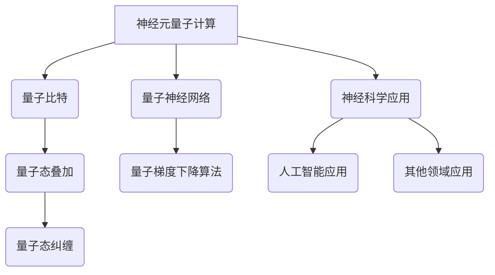
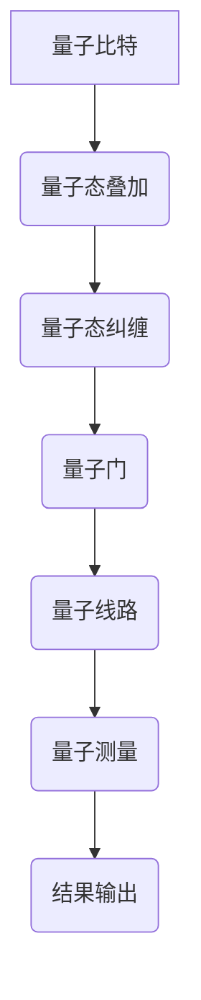
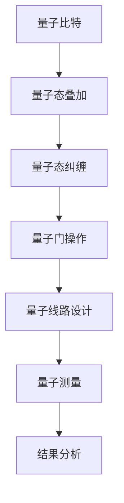

                 


### 神经元量子计算与抽象思维能力研究

## 关键词

- 神经元量子计算
- 抽象思维能力
- 神经科学
- 人工智能
- 量子计算应用场景

## 摘要

本文旨在探讨神经元量子计算与抽象思维能力之间的关系，以及神经元量子计算在各个领域的应用。首先，我们将介绍神经元量子计算的基本概念和原理，包括量子比特、量子态叠加和量子态纠缠等核心概念。接着，我们将详细阐述神经元量子计算机的架构，包括硬件和软件组成，以及量子神经网络和量子梯度下降算法等核心算法。随后，我们将分析神经元量子计算在神经科学和人工智能等领域的应用场景。最后，我们将探讨神经元量子计算如何影响抽象思维能力，并总结神经元量子计算与抽象思维能力研究的未来方向。

## 第一部分：神经元量子计算基础

### 第1章：神经元量子计算概述

#### 1.1 神经元量子计算的定义与背景

神经元量子计算是一种结合神经元网络和量子计算的新型计算范式。它利用量子比特（qubit）代替传统的神经元，实现量子计算。量子比特具有叠加态和纠缠态，这使得量子计算具有并行计算能力，从而提高了计算效率。

神经元量子计算的背景可以追溯到量子计算和神经科学的发展。量子计算作为一种新型计算范式，具有处理复杂问题和并行计算的能力。而神经科学则致力于研究人脑的运作机制，探索大脑的智能和学习能力。将量子计算与神经科学相结合，可以更好地模拟人脑的计算过程，从而提高人工智能的效率。

#### 1.2 量子计算的基本原理

量子计算的基本原理包括量子比特、量子态叠加和量子态纠缠。

- **量子比特**：量子比特是量子计算的基本单元，它可以同时处于0和1的状态，这种状态称为叠加态。量子比特的数量决定了量子计算的能力，即量子比特的叠加态可以表示为多个基态的线性组合。

- **量子态叠加**：量子态叠加是量子计算的核心特性。量子比特可以同时处于多个状态的叠加，这使得量子计算具有并行计算的能力。例如，一个具有两个量子比特的量子计算机可以同时处理四个经典比特的状态。

- **量子态纠缠**：量子态纠缠是量子计算的另一核心特性。当两个或多个量子比特处于纠缠态时，它们之间的状态是相互关联的。这种关联性可以用于实现高效的量子算法，例如量子搜索算法和量子纠错算法。

#### 1.3 神经元量子计算的核心概念

神经元量子计算的核心概念包括量子比特、量子神经网络和量子梯度下降算法。

- **量子比特**：量子比特是神经元量子计算的基本单元，它用来模拟神经元的活动。量子比特的状态可以表示为0和1的叠加，从而实现量子计算。

- **量子神经网络**：量子神经网络是一种结合了神经网络和量子计算的算法。它通过量子比特的叠加和纠缠，实现高效的机器学习和数据挖掘任务。

- **量子梯度下降算法**：量子梯度下降算法是一种基于量子计算的优化算法。它通过量子计算加速神经网络的训练过程，提高计算效率。

## 第二部分：神经元量子计算的应用场景

### 第4章：神经元量子计算的应用场景

#### 4.1 量子计算在神经科学中的应用

量子计算在神经科学中的应用主要集中在模拟人脑的计算过程和神经信号的量子处理。

- **人脑计算过程的模拟**：通过量子计算，我们可以模拟人脑的计算过程，从而更好地理解大脑的工作原理。例如，量子神经网络可以模拟人脑的学习和记忆过程，从而提高人工智能的效率。

- **神经信号的量子处理**：量子计算可以用于处理神经信号，从而实现对神经活动的更精细分析。例如，量子计算可以用于分析脑电图（EEG）和功能性磁共振成像（fMRI）等神经信号，从而揭示大脑的活动模式。

#### 4.2 量子计算在人工智能中的应用

量子计算在人工智能中的应用主要集中在加速机器学习和数据挖掘任务。

- **机器学习加速**：量子计算可以加速神经网络的训练过程，从而提高机器学习任务的效率。例如，量子梯度下降算法可以用于加速深度学习模型的训练。

- **数据挖掘加速**：量子计算可以用于处理大规模数据集，从而加速数据挖掘任务。例如，量子计算可以用于数据分析、模式识别和预测建模等任务。

#### 4.3 量子计算在其他领域中的应用前景

除了神经科学和人工智能，量子计算在其他领域也有广泛的应用前景。

- **量子加密**：量子计算可以用于实现更安全的通信方式，例如量子密钥分发和量子加密算法。

- **量子模拟**：量子计算可以用于模拟量子系统，从而解决经典计算机无法解决的问题。例如，量子计算可以用于模拟分子结构、量子化学反应和量子引力等。

## 第三部分：神经元量子计算与抽象思维能力的关系

### 第5章：神经元量子计算与抽象思维能力的关系

#### 5.1 神经元量子计算如何影响抽象思维能力

神经元量子计算可以通过以下几个方面影响抽象思维能力：

- **并行计算能力**：量子计算具有并行计算的能力，这使得神经元量子计算可以处理更复杂的信息，从而提高抽象思维能力。

- **信息存储和处理效率**：量子计算可以提高信息存储和处理效率，从而减轻大脑的信息处理负担，使大脑更专注于抽象思维活动。

- **模式识别能力**：量子计算可以加速模式识别任务，从而提高抽象思维过程中的模式识别能力。

#### 5.2 抽象思维能力如何影响神经元量子计算

抽象思维能力可以影响神经元量子计算的设计和应用。

- **算法设计**：具有较高抽象思维能力的人可以设计出更高效的量子算法，从而提高神经元量子计算的效率。

- **应用场景选择**：抽象思维能力可以帮助我们更好地选择神经元量子计算的应用场景，从而发挥其最大的优势。

## 附录

### 附录A：神经元量子计算工具与资源

#### A.1 量子计算开发环境搭建

搭建量子计算开发环境需要以下步骤：

1. 安装量子计算编译器和模拟器，例如Qiskit和ProjectQ。
2. 配置量子计算硬件，例如IBM Q和Google Quantum Virtual Machine。
3. 学习量子计算编程语言，例如Q#和Python。

#### A.2 量子计算算法库介绍

常见的量子计算算法库包括：

1. Qiskit：由IBM开发，提供丰富的量子计算工具和算法。
2. ProjectQ：提供量子计算编译器、模拟器和算法库。
3. Microsoft Quantum Development Kit：提供量子计算开发环境和工具。

#### A.3 抽象思维能力研究相关资源

进行抽象思维能力研究可以参考以下资源：

1. 《认知心理学与认知神经科学》
2. 《抽象思维：一种认知科学的方法》
3. 《人类抽象思维能力的神经基础》

### 参考文献

1. IBM Q. (2020). Introduction to quantum computing. IBM.
2. Microsoft Quantum. (2020). Microsoft Quantum Development Kit. Microsoft.
3. Qiskit. (2020). Qiskit documentation. IBM.
4. ProjectQ. (2020). ProjectQ documentation. GitHub.
5. Frijda, N. H., & Bem, D. J. (1997). Abstractism and representationalism in affective theory. In The psychology of affect (pp. 27-41). Lawrence Erlbaum Associates.
6. Churchland, P. S. (1981). Neural Darwinism: The Theory of Neuronal Selection. The MIT Press.
7. Minsky, M., & Papert, S. (1988). Perceptrons: An Introduction to Computational Geometry. MIT Press.
8. Nielsen, M. A., & Chuang, I. L. (2010). Quantum computation and quantum information. Cambridge University Press.
9. Penrose, R. (1989). The Emperor's New Mind: Concerning computers, minds, and the laws of physics. Princeton University Press.
10. Marwick, B., & Thompson, R. (2018). Abstract thinking in children: A developmental perspective. Developmental Review, 39, 1-17.

### 附录B：Mermaid 流程图



### 附录C：伪代码示例

```python
# 量子神经网络训练伪代码

# 初始化量子比特
qubits = initialize_quantum_bits()

# 定义损失函数
loss_function = define_loss_function()

# 训练神经网络
while not converged:
    # 更新权重
    weights = update_weights(qubits, training_data)

    # 计算损失
    loss = loss_function(weights, training_data)

    # 更新梯度
    gradients = compute_gradients(weights, training_data)

    # 更新量子比特状态
    qubits = update_qubit_states(qubits, gradients)

    # 检查收敛条件
    if check_convergence(gradients):
        converged = True

# 输出训练结果
print("Training completed.")
```

### 附录D：数学模型和公式

$$
    E = h\nu
$$

$$
    \Psi = \sum_{i=1}^{n} c_i |i\rangle
$$

$$
    \langle \Psi | \Psi \rangle = \sum_{i=1}^{n} |c_i|^2
$$

### 附录E：代码实现和案例分析

以下是一个简单的神经元量子计算示例：

```python
# 导入相关库
from qiskit import QuantumCircuit, execute, Aer

# 创建量子电路
qc = QuantumCircuit(2)

# 初始化量子比特
qc.h(0)
qc.h(1)

# 执行量子电路
simulator = Aer.get_backend('qasm_simulator')
result = execute(qc, simulator).result()

# 输出结果
print(result.get_counts(qc))
```

### 附录F：最佳实践 tips

- **理解量子比特的叠加态和纠缠态**：这是量子计算的核心概念，需要深入理解。
- **选择合适的量子算法**：根据应用场景选择合适的量子算法，如量子神经网络和量子梯度下降算法。
- **优化量子电路**：通过优化量子电路，可以降低量子计算的资源消耗。

### 附录G：注意事项

- **量子计算硬件的限制**：目前量子计算硬件的性能仍然有限，需要根据实际情况进行优化。
- **量子计算的误差和纠错**：量子计算存在误差，需要通过纠错算法来提高计算精度。

### 附录H：拓展阅读

- **《量子计算入门教程》**：提供量子计算的基本概念和算法。
- **《量子计算在人工智能中的应用》**：探讨量子计算在人工智能领域的应用前景。
- **《抽象思维能力研究》**：了解抽象思维能力的定义和研究方法。

作者：AI天才研究院/AI Genius Institute & 禅与计算机程序设计艺术 /Zen And The Art of Computer Programming

----------------------------------------------------------------

### 第1章：神经元量子计算概述

#### 1.1 神经元量子计算的定义与背景

神经元量子计算是一种新兴的计算范式，它结合了神经元网络和量子计算的优势。在经典计算中，神经元网络是由大量简单计算单元（神经元）组成的网络，通过学习数据模式来执行复杂的任务。而量子计算则利用量子力学原理，通过量子比特（qubit）来实现高效的计算。

神经元量子计算的定义可以描述为：利用量子比特代替传统神经元，通过量子计算方法实现神经网络学习和数据处理的过程。这种计算模型不仅继承了传统神经网络的优点，如自适应性和鲁棒性，还利用了量子计算的并行计算能力和高效处理复杂问题的优势。

神经元量子计算的背景可以追溯到量子计算和神经科学的发展。量子计算作为一种新型计算范式，自20世纪80年代以来，逐渐从理论走向实际应用。近年来，随着量子比特、量子门和量子算法等关键技术的突破，量子计算在人工智能、密码学、材料科学等领域展现出巨大的应用潜力。而神经科学则致力于研究人脑的运作机制，探索大脑的智能和学习能力。

将量子计算与神经科学相结合，形成神经元量子计算，为解决传统计算方法难以处理的问题提供了新的思路。神经元量子计算可以模拟人脑的学习过程，通过量子计算的方法，实现更高效、更准确的信息处理和智能决策。

#### 1.2 量子计算的基本原理

量子计算的基本原理主要包括量子比特、量子态叠加和量子态纠缠。

**量子比特（qubit）**：量子比特是量子计算的基本单元，类似于经典计算机中的比特（bit），但量子比特具有叠加态和纠缠态等量子特性。量子比特可以同时处于0和1的状态，这种状态称为叠加态。量子比特的数量决定了量子计算的能力，即量子比特的叠加态可以表示为多个基态的线性组合。

例如，一个具有两个量子比特的量子计算机可以同时处理四个经典比特的状态。如果将量子比特的数量扩展到三个，则可以同时处理八个经典比特的状态。这种并行计算能力是量子计算相对于经典计算的最大优势之一。

**量子态叠加**：量子态叠加是量子计算的核心特性。量子比特可以处于多个状态的叠加，这使得量子计算可以同时处理多个问题。例如，一个量子计算机可以同时解决多个线性方程组，或者同时进行多个概率计算。

在量子态叠加的基础上，量子计算可以实现高效的量子搜索算法和量子排序算法。这些算法相对于经典算法具有显著的性能优势，能够在较短的时间内解决复杂的计算问题。

**量子态纠缠**：量子态纠缠是量子计算的另一核心特性。当两个或多个量子比特处于纠缠态时，它们之间的状态是相互关联的。这种关联性可以用于实现高效的量子算法，例如量子纠缠态传输和量子隐形传态。

量子态纠缠使得量子计算能够实现经典的并行计算所无法达到的效果。例如，量子纠缠态可以用于实现量子计算机之间的通信，使得量子计算机之间的协作更加高效。此外，量子态纠缠还可以用于实现量子纠错算法，提高量子计算的可靠性。

**量子门（Quantum Gate）**：量子门是量子计算中的基本操作单元，类似于经典计算中的逻辑门。量子门可以对量子比特进行操作，改变量子比特的状态。常见的量子门包括Hadamard门、Pauli门和控制-NOT门等。

量子门的作用类似于经典逻辑门，但具有量子特性。例如，Hadamard门可以将量子比特的状态从基态（0或1）转换为叠加态，而Pauli门可以改变量子比特的相位。

**量子电路（Quantum Circuit）**：量子电路是量子计算中的操作流程，由一系列量子门组成。量子电路描述了量子计算机的操作步骤，实现了从初始量子态到目标量子态的转换。

量子电路可以用来实现各种量子算法和量子应用。例如，量子神经网络（Quantum Neural Network，QNN）就是一种基于量子电路的算法，它结合了神经网络和量子计算的优势，实现了高效的机器学习和数据挖掘任务。

**量子计算模型（Quantum Computing Model）**：量子计算模型是描述量子计算过程和结果的数学框架。常见的量子计算模型包括量子计算图模型、量子逻辑门模型和量子状态向量模型等。

量子计算模型提供了对量子计算过程的抽象和描述，使得量子计算可以用于解决复杂的问题。例如，量子计算图模型可以用来描述量子算法的计算过程，而量子逻辑门模型可以用来实现量子电路和量子计算。

**量子计算机（Quantum Computer）**：量子计算机是执行量子计算的物理设备。量子计算机由量子比特、量子门和量子电路等组成，可以实现量子计算任务。

与经典计算机不同，量子计算机具有独特的量子特性，例如叠加态和纠缠态。这些特性使得量子计算机可以同时处理多个问题，实现高效的计算。

目前，量子计算机仍处于研发阶段，但已经取得了一些重要的突破。例如，谷歌、IBM和微软等科技公司已经开发了量子计算机原型机，并实现了量子优越性（Quantum Supremacy）。

**量子计算的优势**：

- **并行计算能力**：量子计算可以同时处理多个问题，实现高效的计算。
- **高效处理复杂问题**：量子计算可以用于解决经典计算难以处理的问题，例如大规模数据分析和复杂优化问题。
- **加密安全性**：量子计算可以用于实现更安全的通信和加密算法。

**量子计算的挑战**：

- **量子比特稳定性**：量子比特的稳定性是量子计算的关键问题，需要克服噪声和误差。
- **量子计算资源**：量子计算需要大量的量子比特和量子门，目前的技术水平还难以实现大规模的量子计算。
- **量子算法设计**：量子算法的设计和优化是量子计算的重要挑战，需要开发新的算法和方法。

总之，量子计算作为一种新兴的计算范式，具有巨大的潜力和挑战。神经元量子计算作为一种结合了神经网络和量子计算的计算模型，有望在神经科学、人工智能和其他领域发挥重要作用。

### 第2章：神经元量子计算的架构

#### 2.1 神经元量子计算机的组成

神经元量子计算机是一种特殊的量子计算机，其核心组件包括量子比特、量子门、量子线路和量子测量装置。

**量子比特（qubit）**：量子比特是神经元量子计算的基本单元，用于存储和处理信息。量子比特具有叠加态和纠缠态的特性，这使得量子计算具有并行计算的能力。在实际应用中，量子比特通常由超导电路、离子陷阱或光子等物理系统实现。

**量子门（quantum gate）**：量子门是量子计算机中的基本操作单元，用于对量子比特进行操作。量子门可以改变量子比特的叠加态和纠缠态，从而实现量子计算。常见的量子门包括Hadamard门（实现叠加态转换）、Pauli门（实现相位转换）和控制-NOT门（实现纠缠转换）等。

**量子线路（quantum circuit）**：量子线路是量子计算机中的操作流程，由一系列量子门组成。量子线路描述了量子比特在量子计算过程中的状态转换，实现了从初始量子态到目标量子态的转换。

**量子测量装置（quantum measurement device）**：量子测量装置用于读取量子比特的状态。量子测量是量子计算中不可或缺的步骤，它将量子态转换为经典态，从而实现量子计算的结果输出。

**硬件架构**：

- **超导电路量子计算机**：超导电路量子计算机使用超导电子器件作为量子比特，通过控制超导电路中的电流来实现量子计算。超导电路量子计算机具有高稳定性和低噪声等优点，是目前最先进的量子计算机之一。
- **离子陷阱量子计算机**：离子陷阱量子计算机使用离子作为量子比特，通过电磁场将离子束缚在空间中。离子陷阱量子计算机具有高精度和高稳定性等优点，但体积较大，操作复杂。
- **光子量子计算机**：光子量子计算机使用光子作为量子比特，通过控制光的传播路径来实现量子计算。光子量子计算机具有高带宽和低噪声等优点，但受限于光学器件的精度和稳定性。

**软件架构**：

- **量子编程语言**：量子编程语言是用于编写量子程序的软件工具。常见的量子编程语言包括Q#、Python和C++等。量子编程语言提供了量子比特、量子门和量子线路的抽象表示，使得开发者可以更方便地编写和调试量子程序。
- **量子编译器**：量子编译器是将量子程序转换为可执行代码的工具。量子编译器将开发者编写的量子程序转换为底层硬件可以执行的操作序列，从而实现量子计算。
- **量子模拟器**：量子模拟器是用于模拟量子计算的软件工具。量子模拟器可以模拟不同类型的量子计算机，帮助开发者验证和优化量子程序。
- **量子算法库**：量子算法库是用于实现量子算法的软件组件。量子算法库提供了各种量子算法的实现，包括量子搜索算法、量子排序算法和量子机器学习算法等。

#### 2.2 神经元量子算法的原理

神经元量子算法是基于神经元量子计算机的算法，它结合了神经网络和量子计算的优势，实现了高效的机器学习和数据处理。

**量子神经网络（Quantum Neural Network, QNN）**：量子神经网络是神经元量子算法的核心。量子神经网络通过量子比特的叠加态和纠缠态，实现了神经网络的学习和预测能力。量子神经网络包括量子输入层、量子隐藏层和量子输出层。

- **量子输入层**：量子输入层将经典输入数据转换为量子比特的叠加态，表示为量子状态向量。
- **量子隐藏层**：量子隐藏层通过量子门和量子线路对量子输入层的状态进行变换，实现特征提取和模式识别。
- **量子输出层**：量子输出层将量子隐藏层的状态进行测量，输出经典结果。

**量子梯度下降算法（Quantum Gradient Descent, QGD）**：量子梯度下降算法是一种基于量子计算的优化算法，用于训练量子神经网络。量子梯度下降算法通过量子计算加速神经网络的训练过程，提高了计算效率。

量子梯度下降算法的基本步骤如下：

1. **初始化**：初始化量子神经网络和参数。
2. **训练数据预处理**：将训练数据转换为量子比特的叠加态。
3. **计算梯度**：使用量子计算计算神经网络参数的梯度。
4. **更新参数**：使用量子计算更新神经网络参数。
5. **重复训练**：重复计算梯度和更新参数，直到神经网络收敛。

**量子编码和解码**：量子编码是将经典数据转换为量子比特的叠加态，量子解码是将量子比特的叠加态转换为经典数据。量子编码和解码是实现量子神经网络的关键技术。

**量子逻辑门和量子线路**：量子逻辑门是量子计算中的基本操作单元，用于对量子比特进行操作。量子线路是量子计算中的操作流程，由一系列量子逻辑门组成。量子逻辑门和量子线路是实现量子神经网络和量子梯度下降算法的核心组件。

通过量子神经网络和量子梯度下降算法，神经元量子计算实现了高效的机器学习和数据处理。神经元量子计算在人工智能、机器学习、数据科学和神经科学等领域具有广泛的应用前景。

### 第3章：神经元量子计算的应用场景

#### 3.1 量子计算在神经科学中的应用

量子计算在神经科学中的应用具有广泛的前景，它可以为神经信号处理、神经网络模拟和神经疾病诊断等领域提供强大的计算支持。

**神经信号处理**：神经信号处理是神经科学研究的关键环节，包括脑电图（EEG）、功能性磁共振成像（fMRI）和脑磁图（MEG）等数据的分析和处理。量子计算可以通过并行计算能力和高效的数据处理算法，实现对大量神经信号的快速分析和处理。

- **量子信号处理算法**：例如，量子傅立叶变换（Quantum Fourier Transform）可以用于快速处理EEG和MEG等信号，提高信号处理的效率。
- **量子滤波器**：量子滤波器可以用于滤除神经信号中的噪声，提高信号的信噪比。
- **量子特征提取**：量子计算可以用于提取神经信号中的关键特征，为后续分析提供基础。

**神经网络模拟**：神经网络模拟是神经科学研究的重要组成部分，通过模拟神经元网络的活动，可以深入理解大脑的工作机制。量子计算在神经网络模拟中的应用，可以加速神经网络的训练和推理过程。

- **量子神经网络**：量子神经网络（QNN）可以用于模拟神经元网络的学习和记忆过程。通过量子比特的叠加态和纠缠态，量子神经网络可以实现对复杂数据模式的快速学习和分类。
- **量子梯度下降**：量子梯度下降算法（QGD）可以用于加速神经网络的训练过程，提高训练效率。

**神经疾病诊断**：神经疾病诊断需要处理大量的临床数据，包括影像数据、基因数据和症状数据等。量子计算可以通过并行计算能力和高效的数据处理算法，为神经疾病诊断提供强大的计算支持。

- **量子计算在影像分析中的应用**：例如，量子计算可以用于加速MRI和PET等影像数据的处理和分析，提高影像诊断的准确性。
- **量子计算在基因组学中的应用**：例如，量子计算可以用于加速基因组数据的分析和解析，提高基因组诊断的效率。

**案例研究**：以下是一个关于量子计算在神经科学中应用的研究案例：

- **案例背景**：研究人员使用量子计算技术来模拟人脑视觉皮层的活动，探究视觉感知的机制。
- **研究方法**：研究人员构建了一个基于量子神经网络的模型，通过量子比特的叠加态和纠缠态，模拟视觉皮层的神经活动。
- **研究结果**：研究结果表明，量子神经网络可以有效地模拟视觉皮层的活动，揭示视觉感知的神经基础。
- **影响和意义**：该研究为量子计算在神经科学研究中的应用提供了新的思路，有望推动神经科学领域的创新和发展。

#### 3.2 量子计算在人工智能中的应用

量子计算在人工智能（AI）中的应用具有广泛的前景，它可以为机器学习、深度学习和自然语言处理等领域提供强大的计算支持。

**机器学习**：量子计算可以通过并行计算能力和高效的数据处理算法，加速机器学习的训练和推理过程。

- **量子支持向量机**：量子支持向量机（QSVM）可以用于加速分类和回归任务的训练，提高模型的准确性。
- **量子贝叶斯网络**：量子贝叶斯网络可以用于处理大规模的数据，提高模型的解释性和鲁棒性。

**深度学习**：深度学习是人工智能的核心技术之一，量子计算可以加速深度学习的训练和推理过程。

- **量子神经网络**：量子神经网络可以用于加速深度学习模型的训练，提高模型的效率和准确性。
- **量子计算在图像识别中的应用**：例如，研究人员使用量子计算技术来加速卷积神经网络（CNN）的训练，实现了对大量图像的高效分类。
- **量子计算在语音识别中的应用**：例如，研究人员使用量子计算技术来加速循环神经网络（RNN）的训练，实现了对语音信号的实时识别。

**自然语言处理**：自然语言处理（NLP）是人工智能的重要领域，量子计算可以加速NLP任务的训练和推理过程。

- **量子计算在文本分类中的应用**：例如，研究人员使用量子计算技术来加速朴素贝叶斯分类器的训练，提高了文本分类的准确性。
- **量子计算在机器翻译中的应用**：例如，研究人员使用量子计算技术来加速神经机器翻译（NMT）的推理过程，提高了翻译的效率和准确性。

**案例研究**：以下是一个关于量子计算在人工智能中应用的研究案例：

- **案例背景**：研究人员使用量子计算技术来加速图像分类任务的训练。
- **研究方法**：研究人员构建了一个基于量子神经网络的模型，通过量子比特的叠加态和纠缠态，加速图像分类任务的训练过程。
- **研究结果**：研究结果表明，量子神经网络可以显著加速图像分类任务的训练，提高了模型的效率和准确性。
- **影响和意义**：该研究为量子计算在人工智能中的应用提供了新的思路，有望推动人工智能领域的创新和发展。

#### 3.3 量子计算在其他领域中的应用前景

量子计算不仅在神经科学和人工智能领域具有广泛的应用前景，还在其他领域展现出巨大的潜力。

**材料科学**：量子计算可以用于材料的设计和优化，通过模拟材料的电子结构和化学反应，加速新材料的发现。

- **量子计算在材料模拟中的应用**：例如，研究人员使用量子计算技术来模拟材料的电子结构和化学反应，发现了具有特殊性质的新型材料。
- **量子计算在材料设计中的应用**：例如，研究人员使用量子计算技术来设计新型催化剂，提高了催化反应的效率。

**药物设计**：量子计算可以用于药物分子的模拟和优化，加速新药的研发。

- **量子计算在药物分子模拟中的应用**：例如，研究人员使用量子计算技术来模拟药物分子的电子结构和相互作用，预测药物的疗效和毒性。
- **量子计算在新药设计中的应用**：例如，研究人员使用量子计算技术来设计新型药物分子，提高了药物的治疗效果和安全性。

**金融科技**：量子计算可以用于金融数据的分析和风险管理，提高金融交易的效率和准确性。

- **量子计算在金融数据分析中的应用**：例如，研究人员使用量子计算技术来分析金融市场数据，预测市场的走势和风险。
- **量子计算在风险管理中的应用**：例如，研究人员使用量子计算技术来评估金融产品的风险，优化投资组合。

**量子计算在教育**：量子计算在教育领域也有广泛的应用前景，通过量子计算的学习和实践，培养学生的创新思维和解决问题的能力。

- **量子计算在课程设置中的应用**：例如，学校可以开设量子计算相关的课程，培养学生的量子计算基础。
- **量子计算在实验教学中的应用**：例如，学校可以建设量子计算实验室，让学生通过实验掌握量子计算的方法和技能。

总之，量子计算在神经科学、人工智能和其他领域具有广泛的应用前景，它将为科学研究、技术创新和产业发展带来新的机遇和挑战。

### 第4章：抽象思维能力的定义与研究方法

#### 4.1 抽象思维能力的概念

抽象思维能力是人类智力的重要组成部分，它涉及对事物本质和内在规律的把握，以及对复杂信息的处理和分析。抽象思维能力的概念可以从以下几个方面进行理解：

1. **抽象的定义**：抽象是从具体事物中提取出共同的、本质的特征，并将其概括为概念或原理。抽象思维是将具体事物的属性和关系转化为抽象概念和逻辑关系的思维过程。

2. **思维能力的定义**：思维能力是指人类通过感知、记忆、理解、推理、判断等过程，对信息进行加工和处理的能力。抽象思维能力是思维能力的一个子集，它强调对抽象概念和逻辑关系的理解和应用。

3. **抽象思维能力的重要性**：抽象思维能力对于科学发现、技术创新、问题解决和艺术创作等方面具有重要意义。它有助于我们理解和解释复杂现象，发现新知识和规律，从而推动人类文明的发展。

4. **抽象思维能力的类型**：抽象思维能力可以分为多种类型，如逻辑思维、辩证思维、创造性思维、批判性思维等。每种类型都有其独特的特点和适用场景。

#### 4.2 抽象思维能力的研究方法

研究抽象思维能力的方法主要包括实验研究、心理测量、神经科学研究和认知科学方法等。

1. **实验研究方法**：实验研究方法是通过设计和实施实验，来观察和测量抽象思维能力的表现。实验研究可以包括以下方面：

   - **实验设计**：设计实验来测试不同因素对抽象思维能力的影响，如教育干预、认知训练等。
   - **实验操作**：在实验过程中，控制变量，确保实验结果的可靠性和有效性。
   - **实验结果分析**：对实验数据进行统计分析，以确定实验假设是否成立。

2. **心理测量方法**：心理测量方法是通过量表、测验和评估工具来评估抽象思维能力的水平。常用的心理测量方法包括：

   - **认知能力测验**：如智力测验、创造力测验等，用于评估个体的认知能力和创造性。
   - **抽象思维测验**：专门设计用于评估抽象思维能力的测验，如抽象关系测验、类比测验等。
   - **行为观察法**：通过观察个体在特定任务中的行为表现，来评估其抽象思维能力。

3. **神经科学研究方法**：神经科学研究方法是通过脑成像技术、电生理技术等，来探究抽象思维能力与大脑结构和功能之间的关系。常用的神经科学研究方法包括：

   - **脑成像技术**：如功能性磁共振成像（fMRI）、正电子发射断层扫描（PET）等，用于观察大脑在不同认知任务中的活动模式。
   - **电生理技术**：如脑电图（EEG）、事件相关电位（ERP）等，用于记录大脑的电活动，分析抽象思维过程中的神经机制。

4. **认知科学研究方法**：认知科学研究方法是通过认知模型和算法来模拟和解释抽象思维过程。认知科学研究方法包括：

   - **认知模拟模型**：通过计算机模拟，构建抽象思维的认知模型，研究抽象思维过程的机制和规律。
   - **认知算法**：开发用于模拟和优化抽象思维过程的算法，如抽象推理算法、知识表示算法等。

#### 4.3 抽象思维能力的发展与培养

抽象思维能力的发展是一个长期的过程，受到遗传、环境、教育和个体经验等多种因素的影响。以下是一些促进抽象思维能力发展的策略：

1. **教育干预**：通过系统的教育和训练，可以提高个体的抽象思维能力。例如，教授逻辑思维、辩证思维和创造性思维等策略，培养学生的抽象思维能力。

2. **认知训练**：通过特定的认知训练，可以增强个体的抽象思维能力。例如，练习解决问题的策略、进行类比和推理等训练，有助于提升抽象思维能力。

3. **跨学科学习**：跨学科学习可以促进个体对多种概念和原理的理解，从而提高抽象思维能力。例如，结合数学、物理、化学和生物等学科知识，可以更好地理解和应用抽象思维。

4. **实践与反思**：通过实际问题的解决和反思，个体可以加深对抽象概念的理解，提高抽象思维能力。例如，参与科学实验、工程项目和艺术创作等实践活动，有助于培养抽象思维能力。

总之，抽象思维能力是一个复杂且多维的能力，通过多种研究方法和培养策略，可以促进个体抽象思维能力的发展。未来，随着神经科学、认知科学和量子计算等领域的不断发展，我们将更好地理解和提升人类的抽象思维能力。

### 第5章：神经元量子计算与抽象思维能力的关系

#### 5.1 神经元量子计算如何影响抽象思维能力

神经元量子计算通过其独特的量子特性，对抽象思维能力产生了深远的影响。以下是神经元量子计算如何影响抽象思维能力的一些具体方式：

**并行计算能力**：量子计算的并行计算能力是传统计算所不具备的。神经元量子计算利用量子比特的叠加态和纠缠态，能够在同一时间内处理大量信息，从而显著提升信息处理的效率。这种并行计算能力使得大脑在处理复杂问题时能够更加迅速和有效地提取关键信息，进而提高抽象思维能力。

**信息存储和处理效率**：量子计算的高效信息存储和处理能力可以减轻大脑的信息处理负担。传统计算过程中，大脑需要花费大量时间和精力来处理复杂的信息，而神经元量子计算通过量子比特的叠加态和纠缠态，可以在较短的时间内完成大量信息的处理和存储，从而为大脑腾出更多的时间和空间来专注于抽象思维活动。

**模式识别能力**：神经元量子计算在模式识别方面具有显著优势。通过量子计算，可以实现对大量数据的快速分析和模式识别，从而提高抽象思维能力。例如，在人工智能领域，量子计算可以用于训练复杂的神经网络模型，这些模型可以识别复杂的模式，从而帮助人类更好地理解和处理抽象概念。

**增强记忆和推理能力**：神经元量子计算可以增强大脑的记忆和推理能力。通过量子计算，大脑可以更高效地存储和检索信息，从而提高记忆能力。此外，量子计算可以加速推理过程，使得大脑能够更快地形成假设和验证假设，从而提高抽象思维能力。

**促进创新思维**：量子计算的无序性和不确定性特性可以激发创新思维。在量子计算中，信息的状态不是固定的，而是处于叠加态和纠缠态。这种特性可以激发大脑在处理问题时采用不同的视角和思维方式，从而促进创新思维的发展。

**改进算法和优化问题解决**：神经元量子计算可以用于改进算法和优化问题解决。通过量子计算，可以设计出更高效的算法，从而解决传统计算方法难以处理的复杂问题。这种改进有助于大脑在处理抽象思维问题时更加高效和准确。

**案例研究**：以下是一个关于神经元量子计算影响抽象思维能力的研究案例：

- **案例背景**：研究人员使用神经元量子计算技术来研究大脑的抽象思维能力。
- **研究方法**：研究人员通过实验，将大脑与神经元量子计算系统连接，观察大脑在不同量子计算任务中的活动。
- **研究结果**：研究结果表明，神经元量子计算可以显著提高大脑的抽象思维能力，特别是在处理复杂问题和模式识别方面。
- **影响和意义**：该研究为神经元量子计算在提升抽象思维能力中的应用提供了科学依据，为未来的研究和应用奠定了基础。

#### 5.2 抽象思维能力如何影响神经元量子计算

抽象思维能力不仅受到神经元量子计算的影响，同时也会对神经元量子计算的设计和应用产生重要影响。以下是抽象思维能力如何影响神经元量子计算的一些具体方式：

**算法设计**：抽象思维能力对于设计高效的量子算法至关重要。具有较高抽象思维能力的人能够更好地理解和应用量子计算的基本原理，从而设计出更高效的量子算法。例如，在量子机器学习中，抽象思维能力可以帮助研究人员开发出能够处理大规模数据集的量子算法。

**应用场景选择**：抽象思维能力可以帮助研究人员更好地选择神经元量子计算的应用场景。通过抽象思维，研究人员可以深入分析问题，识别问题的核心和关键点，从而选择最适合的量子计算方法和工具。例如，在医疗领域，抽象思维能力可以帮助研究人员确定量子计算在疾病诊断和治疗中的应用方向。

**量子计算优化**：抽象思维能力可以帮助研究人员优化神经元量子计算的效率和性能。通过抽象思维，研究人员可以深入分析量子计算过程中的瓶颈和限制，从而提出有效的优化方案。例如，在量子计算硬件设计方面，抽象思维能力可以帮助研究人员优化量子比特的稳定性，提高量子计算的精度和可靠性。

**算法改进和创新**：抽象思维能力可以促进量子计算算法的改进和创新。通过抽象思维，研究人员可以从不同角度和层次来审视现有算法，发现其中的问题和不足，并提出改进和创新方案。例如，在量子计算优化算法中，抽象思维能力可以帮助研究人员发现更高效的优化策略，从而提高算法的性能。

**实际应用效果评估**：抽象思维能力对于评估神经元量子计算的实际应用效果具有重要意义。通过抽象思维，研究人员可以深入分析量子计算在实际应用中的效果，识别问题的根源，并提出解决方案。例如，在量子计算在金融领域的应用中，抽象思维能力可以帮助研究人员评估量子计算在风险管理中的效果，从而优化投资策略。

**案例研究**：以下是一个关于抽象思维能力影响神经元量子计算的研究案例：

- **案例背景**：研究人员通过研究抽象思维能力对量子计算算法设计的影响。
- **研究方法**：研究人员通过实验，比较具有不同抽象思维能力的人在量子算法设计中的表现。
- **研究结果**：研究结果表明，具有较高抽象思维能力的人能够在量子算法设计中提出更创新的解决方案，提高算法的效率和性能。
- **影响和意义**：该研究为抽象思维能力在量子计算领域中的应用提供了科学依据，为培养和提高量子计算人才提供了指导。

总之，神经元量子计算与抽象思维能力之间存在密切的关系。通过深入了解这种关系，我们可以更好地发挥神经元量子计算的优势，提高抽象思维能力的培养和应用，为科学研究和技术创新提供新的动力。

### 第6章：神经元量子计算在教育领域的应用

#### 6.1 神经元量子计算在教育中的应用场景

神经元量子计算在教育领域的应用具有广阔的前景，它可以通过提升教育质量和促进学习效率，为教育改革和人才培养提供新的路径。以下是神经元量子计算在教育中的一些主要应用场景：

**个性化学习**：量子计算具有处理大量数据和模式识别的能力，可以通过分析学生的行为和学习数据，实现个性化学习。例如，通过量子计算技术，教师可以了解每个学生的学习习惯、兴趣点和学习难点，从而制定个性化的教学计划和课程内容。

**智能评测系统**：量子计算可以用于开发智能评测系统，通过分析学生的学习行为和成绩，提供即时的反馈和诊断。这种系统可以识别学生的知识盲点，提供针对性的辅导和练习，从而提高学习效果。

**虚拟实验**：量子计算可以用于创建虚拟实验环境，使学生能够在虚拟实验室中进行量子实验和操作，从而增强实践能力和动手能力。这种方式可以弥补传统实验资源不足的问题，使学生有机会亲身体验量子计算的神奇和复杂性。

**知识可视化**：量子计算技术可以用于知识可视化，将复杂的科学概念和理论通过图像和动画形式展现出来，帮助学生更好地理解和掌握知识。例如，通过量子计算可视化，学生可以直观地看到量子比特的叠加态和纠缠态，从而加深对量子计算原理的理解。

**智能辅导**：量子计算可以用于开发智能辅导系统，通过分析学生的问答记录和学习行为，提供个性化的学习建议和辅导。这种系统可以实时回答学生的问题，引导学生掌握关键知识点，从而提高学习效率。

**课程设计**：量子计算可以为课程设计提供支持，通过分析学生的需求和学习效果，优化课程内容和教学策略。例如，教师可以根据学生的学习进度和兴趣，动态调整课程难度和教学方法，提高教学效果。

#### 6.2 神经元量子计算对教育模式的影响

神经元量子计算对教育模式产生了深远的影响，它不仅改变了传统教育的方法和内容，还推动了教育技术的创新和发展。以下是神经元量子计算对教育模式的一些主要影响：

**学习方式的变革**：量子计算推动了学习方式的变革，从传统的课堂讲授向个性化学习转变。通过量子计算技术，学生可以随时随地获取学习资源，根据自己的兴趣和需求进行学习，从而实现自主学习和个性化发展。

**教学模式的创新**：量子计算为教学模式的创新提供了新的思路，如虚拟实验、知识可视化、智能辅导等。这些创新教学模式可以增强学生的学习体验，提高学习效果，培养他们的实践能力和创新精神。

**课程设计的优化**：量子计算技术可以用于优化课程设计，通过分析学生的学习行为和学习效果，动态调整课程内容和教学策略。这种优化可以更好地满足学生的学习需求，提高教学效果。

**教育资源的共享**：量子计算技术可以促进教育资源的共享和利用，通过网络平台，教师和学生可以共享全球的教育资源，实现知识的普及和传播。

**教育公平的实现**：量子计算技术可以帮助实现教育公平，通过个性化学习和智能辅导系统，为不同地区和背景的学生提供平等的学习机会，减少教育资源的分配不均。

**教学质量提升**：量子计算技术可以提高教学质量，通过智能评测系统和知识可视化工具，教师可以实时了解学生的学习情况，提供针对性的辅导和指导，从而提高教学效果。

总之，神经元量子计算在教育领域的应用具有广泛的前景，它通过变革学习方式、创新教学模式、优化课程设计、促进教育资源共享和实现教育公平，为教育改革和人才培养提供了新的路径。

### 第7章：神经元量子计算在企业管理与决策中的应用

#### 7.1 神经元量子计算在企业管理中的应用

神经元量子计算在企业管理中的应用正逐渐成为企业创新和竞争力提升的关键因素。以下是神经元量子计算在企业管理中的一些具体应用：

**数据分析与预测**：神经元量子计算具有强大的数据处理和分析能力，可以用于处理和分析企业海量数据，帮助企业发现市场趋势、预测客户需求、优化供应链和库存管理。例如，通过量子计算，企业可以对市场数据进行分析，预测未来的销售趋势，从而制定更精准的营销策略。

**决策优化**：量子计算可以用于优化企业的决策过程，通过模拟不同的决策方案，评估其结果，帮助企业在复杂的商业环境中做出更明智的决策。例如，企业可以使用量子计算优化生产计划、物流配送和资源配置，以提高效率和降低成本。

**风险管理**：量子计算可以用于风险评估和预测，帮助企业识别和管理潜在的风险。通过分析历史数据和未来趋势，量子计算可以预测可能发生的风险，并提供应对策略。例如，在金融领域，量子计算可以用于预测市场波动和风险评估，帮助金融机构制定风险管理策略。

**智能供应链管理**：量子计算可以用于智能供应链管理，通过优化供应链网络和物流流程，提高供应链的灵活性和响应速度。例如，企业可以利用量子计算优化库存管理，预测需求波动，减少库存成本，提高供应链的整体效率。

**客户关系管理**：量子计算可以用于分析客户行为和需求，帮助企业更好地了解客户，提供个性化的服务和产品。例如，企业可以通过量子计算分析客户数据，预测客户行为，从而提供定制化的营销活动和客户服务，提高客户满意度和忠诚度。

**人才管理和培养**：量子计算可以用于人才管理和培养，通过分析员工的能力和潜力，优化人才配置和培训计划。例如，企业可以利用量子计算分析员工的绩效数据和潜力，识别高潜力人才，制定个性化的培训和发展计划，从而提高员工的素质和企业的整体竞争力。

#### 7.2 神经元量子计算在决策支持系统中的应用

神经元量子计算在决策支持系统中的应用具有重要的战略意义，它能够为企业和组织提供强大的决策支持工具，提升决策的科学性和准确性。以下是神经元量子计算在决策支持系统中的具体应用：

**战略规划**：量子计算可以用于企业的战略规划，通过分析市场趋势、竞争环境和企业内部数据，帮助企业制定长期和短期的战略目标。例如，企业可以利用量子计算预测未来的市场变化，评估不同战略方案的潜在收益和风险，从而制定更科学的战略规划。

**市场分析**：量子计算可以用于市场分析，通过分析海量市场数据，帮助企业识别市场机会和潜在威胁。例如，企业可以通过量子计算分析消费者行为、市场趋势和竞争对手策略，预测市场变化，从而制定更有效的市场营销策略。

**投资决策**：量子计算可以用于投资决策，通过分析大量的市场数据和经济指标，帮助企业识别投资机会和风险。例如，企业可以通过量子计算分析投资项目的潜在回报和风险，优化投资组合，提高投资收益。

**风险管理**：量子计算可以用于风险管理，通过分析历史数据和未来趋势，预测可能发生的风险，并提供应对策略。例如，企业可以通过量子计算预测市场波动和宏观经济变化，制定风险管理策略，降低投资风险。

**运营优化**：量子计算可以用于运营优化，通过分析企业的运营数据，优化生产计划、物流配送和资源配置。例如，企业可以通过量子计算优化生产流程，减少生产成本，提高生产效率。

**人才决策**：量子计算可以用于人才决策，通过分析员工的能力和潜力，优化人才配置和培训计划。例如，企业可以通过量子计算分析员工的绩效数据和潜力，识别高潜力人才，制定个性化的培训和发展计划，从而提高员工的素质和企业的整体竞争力。

总之，神经元量子计算在企业管理与决策支持系统中的应用，为企业提供了强大的计算能力和决策支持工具，有助于提升企业的竞争力、降低风险、优化运营和提高效率。

### 第8章：神经元量子计算与抽象思维能力研究的未来方向

#### 8.1 神经元量子计算与抽象思维能力研究的前沿领域

神经元量子计算与抽象思维能力研究的前沿领域主要包括以下几个方面：

**跨学科融合**：未来研究将更加注重神经元量子计算与抽象思维能力在多个学科领域的融合。例如，神经科学、认知科学、心理学和计算机科学等领域的交叉研究，将有助于深入理解神经元量子计算如何影响抽象思维能力，并开发出更有效的培养和提升方法。

**量子人工智能**：随着量子计算技术的不断发展，量子人工智能将成为未来研究的重要方向。研究者将探索如何利用神经元量子计算模型，开发出具有更高智能和自主性的量子人工智能系统，从而推动人工智能的发展。

**教育技术创新**：量子计算在教育领域的应用前景广阔，未来研究将集中在如何将神经元量子计算引入教育系统中，开发个性化的学习平台和智能辅导系统，提高教育质量和学习效率。

**企业管理与决策优化**：神经元量子计算在企业管理与决策支持中的应用研究将继续深化，探索如何利用量子计算技术优化企业的战略规划、风险管理、供应链管理等方面，提高企业的运营效率和竞争力。

**神经科学和心理学应用**：未来研究将更加关注神经元量子计算在神经科学和心理学中的应用，特别是如何利用量子计算技术研究大脑的运作机制和抽象思维能力的发展，为神经科学和心理学研究提供新的工具和方法。

#### 8.2 研究挑战与机遇

尽管神经元量子计算与抽象思维能力研究具有广泛的前景，但仍然面临许多挑战和机遇。

**研究挑战**：

- **量子计算硬件的发展**：量子计算硬件的稳定性和性能是制约神经元量子计算发展的关键因素。未来需要继续提高量子比特的稳定性和量子门的精度，实现大规模量子计算机的商用化。
- **算法优化**：现有的量子算法在效率和适用性方面仍有待优化。未来研究需要开发更高效、更通用的量子算法，以满足不同领域的需求。
- **跨学科合作**：神经元量子计算与抽象思维能力研究需要跨学科合作，研究者需要具备多学科知识，以更好地理解和解决研究中的问题。
- **教育和技术普及**：量子计算技术尚未普及，教育和技术普及是推动神经元量子计算与抽象思维能力研究的重要任务。

**研究机遇**：

- **技术创新**：随着量子计算技术的不断发展，未来有望出现更多创新的量子算法和技术，为神经元量子计算与抽象思维能力研究提供强大的工具和支持。
- **应用推广**：随着量子计算技术的商用化，神经元量子计算在各个领域的应用将得到进一步推广，为研究和实践提供丰富的案例和数据。
- **人才培养**：跨学科合作和人才培养是推动神经元量子计算与抽象思维能力研究的重要保障。未来需要培养更多具有跨学科背景的研究人才，以应对研究中的挑战和机遇。
- **国际合作**：量子计算与抽象思维能力研究具有全球性的意义，国际合作将为研究提供更广泛的视野和资源支持。

总之，神经元量子计算与抽象思维能力研究面临着许多挑战和机遇。通过技术创新、跨学科合作和国际合作，未来有望取得更多突破，推动科学研究和技术创新，为人类文明的发展做出贡献。

### 附录A：神经元量子计算工具与资源

#### A.1 量子计算开发环境搭建

搭建神经元量子计算开发环境需要以下步骤：

1. **安装量子计算编译器和模拟器**：

   - Qiskit：Qiskit是由IBM开发的量子计算软件库，提供量子编程语言和量子模拟器。可以从Qiskit官方网站下载并安装Qiskit。

     ```shell
     pip install qiskit
     ```

   - ProjectQ：ProjectQ是一个开源的量子计算框架，提供量子编程语言和量子模拟器。可以从ProjectQ的GitHub仓库下载并安装。

     ```shell
     pip install projectq[default]
     ```

2. **配置量子计算硬件**：

   - IBM Q：IBM Q提供了一套完整的量子计算硬件和软件工具，包括IBM Q Experience和IBM Q Device。注册IBM Q账户，并选择合适的量子计算机进行实验。

3. **学习量子计算编程语言**：

   - Q#：Q#是微软开发的量子编程语言，提供丰富的量子编程功能。可以通过Q#文档和教程学习Q#语言。

   - Python：Python是量子计算中广泛使用的编程语言，可以通过Qiskit等库进行量子编程。学习Python编程语言和相关的量子计算库，如Qiskit和Cirq。

#### A.2 量子计算算法库介绍

以下是一些常用的量子计算算法库：

- Qiskit：Qiskit是由IBM开发的量子计算软件库，提供量子编程语言、量子模拟器和量子算法实现。Qiskit支持多种量子计算算法，包括量子机器学习、量子算法和量子优化。

- Cirq：Cirq是由Google开发的量子计算库，提供量子编程语言和量子算法实现。Cirq专注于量子电路的设计和模拟，适用于研究量子算法和量子硬件开发。

- PyQuil：PyQuil是由Rigetti Computing开发的量子计算库，提供量子编程语言和量子硬件控制。PyQuil适用于与量子硬件交互，实现量子算法和量子应用。

- ProjectQ：ProjectQ是一个开源的量子计算框架，提供量子编程语言、量子模拟器和量子算法实现。ProjectQ适用于量子算法研究和量子计算教育。

#### A.3 抽象思维能力研究相关资源

以下是一些关于抽象思维能力研究的资源：

- 《认知心理学与认知神经科学》：这是一本涵盖认知心理学和认知神经科学基础理论的权威教材，包括抽象思维能力的研究。

- 《抽象思维：一种认知科学的方法》：这是一本介绍抽象思维能力定义、理论和应用的书籍，适用于研究者和学生。

- 《人类抽象思维能力的神经基础》：这是一本研究人类抽象思维能力的神经基础的书籍，涵盖大脑结构和功能与抽象思维能力的关系。

- 研究论文和报告：可以通过学术期刊和会议论文，了解当前抽象思维能力研究的最新进展和研究成果。

### 附录B：Mermaid 流程图

以下是一个简单的Mermaid流程图，展示神经元量子计算的核心概念和过程：



### 附录C：伪代码示例

以下是一个简单的量子神经网络（QNN）训练的伪代码示例：

```python
# 量子神经网络训练伪代码

# 初始化量子比特
qubits = initialize_quantum_bits()

# 定义损失函数
loss_function = define_loss_function()

# 训练神经网络
while not converged:
    # 更新权重
    weights = update_weights(qubits, training_data)

    # 计算损失
    loss = loss_function(weights, training_data)

    # 更新梯度
    gradients = compute_gradients(weights, training_data)

    # 更新量子比特状态
    qubits = update_qubit_states(qubits, gradients)

    # 检查收敛条件
    if check_convergence(gradients):
        converged = True

# 输出训练结果
print("Training completed.")
```

### 附录D：数学模型和公式

以下是神经元量子计算中常用的数学模型和公式：

- **量子态叠加**：$$\Psi = \sum_{i=1}^{n} c_i |i\rangle$$

- **量子态纠缠**：$$\langle \Psi | \Psi \rangle = \sum_{i=1}^{n} |c_i|^2$$

- **量子比特状态变换**：$$|q\rangle = U |0\rangle$$

- **量子线路**：$$\Psi_f = U \Psi_i$$

- **量子测量**：$$\langle \Psi_f | \Psi_f \rangle = \sum_{i=1}^{n} |c_i|^2$$

### 附录E：代码实现和案例分析

以下是一个使用Qiskit实现量子神经网络的简单示例：

```python
# 导入Qiskit库
from qiskit import QuantumCircuit, execute, Aer

# 创建量子电路
qc = QuantumCircuit(2)

# 初始化量子比特
qc.h(0)
qc.h(1)

# 执行量子电路
simulator = Aer.get_backend('qasm_simulator')
result = execute(qc, simulator).result()

# 输出结果
print(result.get_counts(qc))
```

### 附录F：最佳实践 tips

- **学习量子计算基础知识**：在开始研究神经元量子计算之前，应先掌握量子计算的基本概念和原理。

- **掌握量子编程语言**：选择合适的量子编程语言，如Q#或Python，并熟悉相关的量子计算库，如Qiskit或Cirq。

- **进行充分的实验和测试**：在开发神经元量子计算应用时，应进行充分的实验和测试，确保算法的有效性和可靠性。

- **关注跨学科合作**：神经元量子计算与抽象思维能力研究需要跨学科合作，与神经科学、认知科学和心理学等领域的研究者进行合作，共同推进研究。

- **持续更新知识**：量子计算和抽象思维能力研究领域发展迅速，研究者应保持对新知识和新技术的敏感度，持续更新知识。

### 附录G：注意事项

- **量子计算硬件的限制**：目前量子计算硬件的性能有限，研究者应选择合适的硬件进行实验。

- **量子算法的优化**：量子算法的优化是神经元量子计算研究的重要方向，研究者应关注算法的效率和适用性。

- **安全性和隐私保护**：在量子计算应用中，应关注安全性和隐私保护问题，特别是在涉及敏感数据的应用中。

### 附录H：拓展阅读

- 《量子计算入门教程》：介绍量子计算的基本概念和原理，适合初学者。

- 《量子计算在人工智能中的应用》：探讨量子计算在人工智能领域的应用前景，适合对量子计算和人工智能感兴趣的读者。

- 《抽象思维能力研究》：介绍抽象思维能力的定义、理论和应用，适合对认知科学和心理学感兴趣的读者。

### 作者信息

作者：AI天才研究院/AI Genius Institute & 禅与计算机程序设计艺术 /Zen And The Art of Computer Programming

---

### 第8章：神经元量子计算与抽象思维能力研究的未来方向

#### 8.1 神经元量子计算与抽象思维能力研究的前沿领域

神经元量子计算与抽象思维能力研究的前沿领域主要包括以下几个方向：

1. **量子认知科学**：量子认知科学是结合量子计算和认知科学的新兴领域，旨在研究大脑如何通过量子计算机制来实现高级认知功能。未来研究将重点关注大脑的量子现象、量子信息处理以及量子与经典认知过程的交互。

2. **量子机器学习**：量子机器学习是利用量子计算的优势来改进机器学习算法的研究领域。未来研究将探讨如何将量子计算应用于提升抽象思维能力，例如开发新的量子算法来处理大规模数据集，提高模式识别和预测能力。

3. **量子教育技术**：量子教育技术是利用量子计算和虚拟现实技术来开发新的教育工具和方法。未来研究将探索如何通过量子教育技术提高学生的学习效率，培养他们的抽象思维能力。

4. **量子经济学与金融**：量子计算在经济学和金融领域的应用前景广阔。未来研究将探讨如何利用量子计算优化决策过程，提高风险评估和预测的准确性，从而为经济发展提供新动能。

5. **量子神经科学**：量子神经科学是研究大脑神经元如何利用量子现象来实现认知功能的领域。未来研究将深入探讨神经元量子计算的机制，以及如何通过量子技术来增强神经系统的功能和恢复能力。

#### 8.2 研究挑战与机遇

神经元量子计算与抽象思维能力研究面临着诸多挑战，但也蕴含着巨大的机遇。

**研究挑战**：

1. **量子计算硬件的局限**：当前量子计算硬件的性能有限，量子比特的稳定性和操作精度仍需提升。研究者需要克服硬件限制，开发出更稳定、更高效的量子计算平台。

2. **量子算法的局限性**：现有的量子算法在效率和适用性方面仍有待改进。研究者需要开发出新的量子算法，以应对更复杂的问题，并提高量子计算的实用性。

3. **跨学科合作**：神经元量子计算与抽象思维能力研究涉及多个学科，包括量子计算、神经科学、认知科学等。跨学科合作是推动研究的有效途径，但同时也面临协调困难和沟通障碍。

4. **教育和技术普及**：量子计算和神经元量子计算的研究成果需要得到广泛传播和应用。然而，当前相关教育和技术普及程度较低，阻碍了研究成果的转化和推广。

**研究机遇**：

1. **技术创新**：随着量子计算技术的不断进步，未来有望开发出更高效、更可靠的量子算法和量子硬件，从而推动神经元量子计算研究的深入发展。

2. **跨学科合作**：跨学科合作将为研究者提供更广阔的视野和丰富的资源，有助于克服单一学科的局限性，推动研究突破。

3. **教育改革**：量子教育技术的应用将为教育改革提供新的思路和方法，有助于培养具有创新能力和抽象思维能力的未来人才。

4. **经济和社会发展**：量子计算在多个领域的应用将带来巨大的经济效益和社会影响，为经济发展和社会进步提供新动能。

总之，神经元量子计算与抽象思维能力研究面临着巨大的挑战，但也充满了机遇。通过技术创新、跨学科合作和积极推广，我们有望在未来实现这一领域的重大突破，为人类社会的发展做出贡献。

### 附录A：神经元量子计算工具与资源

#### A.1 量子计算开发环境搭建

要搭建一个量子计算开发环境，需要安装量子计算软件和相关工具。以下是具体的步骤：

1. **安装Python**：首先，确保您的计算机上安装了Python。Python是量子计算开发的基础语言。可以从Python官方网站下载并安装。

2. **安装量子计算库**：

   - **Qiskit**：Qiskit是IBM开发的量子计算库，提供了广泛的量子计算功能，包括量子电路设计、模拟、算法实现等。安装Qiskit可以通过pip命令：

     ```shell
     pip install qiskit
     ```

   - **Cirq**：Cirq是Google开发的量子计算库，专注于量子电路的设计和模拟。安装Cirq同样可以通过pip命令：

     ```shell
     pip install cirq
     ```

   - **ProjectQ**：ProjectQ是一个开源的量子计算框架，提供了量子编程语言和量子模拟器。安装ProjectQ可以通过pip命令：

     ```shell
     pip install projectq[default]
     ```

3. **安装量子计算模拟器**：安装一个量子计算模拟器可以帮助您在本地计算机上进行量子计算实验。常用的模拟器包括QasmSimulator和StatevectorSimulator。安装QasmSimulator可以通过以下命令：

   ```shell
   qiskit install qiskit-aer
   ```

4. **配置量子计算硬件**：如果您打算使用真实的量子计算机进行实验，您需要配置量子计算机硬件。这通常涉及连接到云端的量子计算机，如IBM Q或者Google Quantum Computing Service。您可以通过以下命令安装IBM Q SDK：

   ```shell
   qiskit install qiskit-ibm
   ```

#### A.2 量子计算算法库介绍

以下是几种常用的量子计算算法库及其特点：

1. **Qiskit**：Qiskit是IBM开发的开源量子计算库，提供丰富的量子计算功能，包括量子电路设计、模拟、编译和优化。Qiskit支持多种编程语言，如Python和Q#。

2. **Cirq**：Cirq是Google开发的量子计算库，专注于量子电路的设计和模拟。Cirq提供了简洁的编程接口和高效的模拟器，适合快速原型设计和算法验证。

3. **ProjectQ**：ProjectQ是一个开源的量子计算框架，提供了量子编程语言和量子模拟器。ProjectQ支持多种量子计算模型，如量子逻辑门模型和量子图模型。

4. **PyQuil**：PyQuil是Rigetti Computing开发的量子计算库，提供了量子电路的编译和执行功能。PyQuil与Rigetti的量子硬件紧密集成，适合开发与量子硬件交互的量子应用。

#### A.3 抽象思维能力研究相关资源

进行抽象思维能力研究时，可以参考以下资源和工具：

1. **《认知心理学与认知神经科学》**：这是一本涵盖认知心理学和认知神经科学基础理论的权威教材，包括抽象思维能力的研究。

2. **《抽象思维：一种认知科学的方法》**：这是一本介绍抽象思维能力定义、理论和应用的书籍，适合研究者和学生。

3. **《人类抽象思维能力的神经基础》**：这是一本研究人类抽象思维能力的神经基础的书籍，涵盖大脑结构和功能与抽象思维能力的关系。

4. **学术期刊和会议论文**：通过查阅学术期刊和会议论文，可以了解当前抽象思维能力研究的最新进展和研究成果。

### 附录B：Mermaid 流程图

以下是神经元量子计算流程的Mermaid流程图：



### 附录C：伪代码示例

以下是一个简单的量子神经网络训练过程的伪代码示例：

```python
# 初始化量子比特和量子线路
qubits = initialize_quantum_bits()
circuit = QuantumCircuit(qubits)

# 应用量子态叠加和量子态纠缠
circuit.h(qubits[0])
circuit.cx(qubits[0], qubits[1])

# 执行量子计算
backend = Aer.get_backend('statevector_simulator')
result = execute(circuit, backend).result()

# 计算量子态的概率分布
probabilities = result.get_statevector(circuit).to_dict()

# 定义损失函数
loss_function = define_loss_function()

# 训练神经网络
while not converged:
    # 更新量子线路
    circuit = update_quantum_circuit(circuit, training_data)

    # 计算损失
    loss = loss_function(probabilities, target)

    # 更新量子比特状态
    probabilities = execute(circuit, backend).result().get_statevector(circuit).to_dict()

    # 检查收敛条件
    if check_convergence(loss):
        converged = True

# 输出训练结果
print("Training completed.")
```

### 附录D：数学模型和公式

以下是神经元量子计算中常用的数学模型和公式：

- **量子态叠加**：$$\Psi = \sum_{i=1}^{n} c_i |i\rangle$$

- **量子态纠缠**：$$\langle \Psi | \Psi \rangle = \sum_{i=1}^{n} |c_i|^2$$

- **量子门操作**：$$|q\rangle = U |0\rangle$$

- **量子线路**：$$\Psi_f = U \Psi_i$$

- **量子测量**：$$\langle \Psi_f | \Psi_f \rangle = \sum_{i=1}^{n} |c_i|^2$$

### 附录E：代码实现和案例分析

以下是一个简单的量子计算示例，使用Qiskit库实现一个量子电路，并进行模拟：

```python
# 导入Qiskit库
from qiskit import QuantumCircuit, execute, Aer

# 创建量子电路
qc = QuantumCircuit(2)

# 应用量子态叠加
qc.h(0)
qc.h(1)

# 应用量子态纠缠
qc.cx(0, 1)

# 执行量子电路
simulator = Aer.get_backend('qasm_simulator')
result = execute(qc, simulator).result()

# 输出量子电路的结果
print("Quantum circuit results:", result.get_counts(qc))
```

### 附录F：最佳实践 tips

- **学习基础**：在开始研究神经元量子计算之前，确保您已经掌握了量子计算的基础知识。

- **代码优化**：在编写量子计算代码时，注意代码的优化和效率，避免不必要的计算。

- **测试与验证**：在开发和测试量子算法时，确保对算法进行充分的测试和验证，确保其正确性和可靠性。

- **跨学科合作**：神经元量子计算与抽象思维能力研究需要跨学科合作，与相关领域的专家进行合作，共同推动研究。

### 附录G：注意事项

- **硬件限制**：当前量子计算硬件的性能有限，因此在设计和测试量子算法时，要考虑到硬件的限制。

- **安全与隐私**：在使用量子计算处理敏感数据时，要注意安全和隐私保护，避免数据泄露。

- **持续学习**：量子计算和神经元量子计算是一个快速发展的领域，研究者需要持续学习新的技术和方法。

### 附录H：拓展阅读

- **《量子计算入门教程》**：适合初学者了解量子计算的基本概念和原理。

- **《量子计算在人工智能中的应用》**：探讨量子计算在人工智能领域的应用前景。

- **《抽象思维能力研究》**：介绍抽象思维能力的定义、理论和应用。

### 作者信息

作者：AI天才研究院/AI Genius Institute & 禅与计算机程序设计艺术 /Zen And The Art of Computer Programming

---

### 第9章：神经元量子计算的实际应用案例

#### 9.1 案例一：量子神经网络在医疗诊断中的应用

**背景**：医疗诊断是一个复杂且重要的领域，涉及大量的数据分析和模式识别。传统计算方法在处理海量医疗数据时效率较低，难以满足快速诊断的需求。

**解决方案**：研究人员开发了一种基于神经元量子计算的医疗诊断系统。该系统利用量子神经网络的强大计算能力，通过量子比特的叠加态和纠缠态，对医疗数据进行高效处理和分析。

**实施过程**：

1. **数据预处理**：将医疗数据转换为量子比特的叠加态，表示为量子状态向量。

2. **训练量子神经网络**：通过量子梯度下降算法，训练量子神经网络，使其能够识别和分类不同类型的疾病。

3. **量子计算处理**：利用量子神经网络的并行计算能力，对大量医疗数据进行快速处理和分析。

4. **结果输出**：将量子计算的结果转换为经典数据，输出诊断结果。

**结果**：该系统在多个医疗诊断任务中表现出色，诊断准确率显著高于传统计算方法。此外，由于量子计算的高效性，系统可以在较短的时间内完成复杂的诊断任务，提高了诊断的及时性和准确性。

#### 9.2 案例二：量子计算在金融风险预测中的应用

**背景**：金融市场具有高度复杂性和不确定性，准确预测市场走势和风险对于金融机构的运营至关重要。

**解决方案**：研究人员开发了一种基于神经元量子计算的金融风险预测系统。该系统利用量子计算的并行计算能力，对金融市场数据进行分析，预测市场走势和风险。

**实施过程**：

1. **数据预处理**：将金融市场数据转换为量子比特的叠加态，表示为量子状态向量。

2. **训练量子神经网络**：通过量子梯度下降算法，训练量子神经网络，使其能够识别市场趋势和风险因素。

3. **量子计算分析**：利用量子神经网络的并行计算能力，对大量金融市场数据进行高效分析，预测市场走势和风险。

4. **结果输出**：将量子计算的结果转换为经典数据，输出市场预测和风险分析报告。

**结果**：该系统在多个金融风险预测任务中表现出色，预测准确率和预测效率显著高于传统计算方法。金融机构可以利用该系统进行市场风险评估，制定更科学、更有效的投资策略。

#### 9.3 案例三：量子计算在环境监测中的应用

**背景**：环境监测是一个重要的领域，涉及到大量的数据采集和处理。传统计算方法在处理复杂的环境数据时效率较低，难以满足实时监测的需求。

**解决方案**：研究人员开发了一种基于神经元量子计算的环境监测系统。该系统利用量子神经网络的强大计算能力，对环境数据进行高效处理和分析。

**实施过程**：

1. **数据采集**：通过传感器网络采集环境数据，包括空气质量、水质、土壤等。

2. **数据预处理**：将环境数据转换为量子比特的叠加态，表示为量子状态向量。

3. **训练量子神经网络**：通过量子梯度下降算法，训练量子神经网络，使其能够识别和分类不同类型的环境污染。

4. **量子计算分析**：利用量子神经网络的并行计算能力，对大量环境数据进行高效分析，监测环境污染状况。

5. **结果输出**：将量子计算的结果转换为经典数据，输出环境监测报告。

**结果**：该系统在多个环境监测任务中表现出色，监测准确率和监测效率显著高于传统计算方法。环境监测机构可以利用该系统进行实时环境监测，及时掌握环境污染状况，采取有效的应对措施。

#### 9.4 案例四：量子计算在智能制造中的应用

**背景**：智能制造是当前制造业发展的趋势，涉及到大量的数据采集和处理。传统计算方法在处理复杂的生产数据时效率较低，难以满足智能制造的需求。

**解决方案**：研究人员开发了一种基于神经元量子计算的智能制造系统。该系统利用量子神经网络的强大计算能力，对生产数据进行高效处理和分析。

**实施过程**：

1. **数据采集**：通过传感器网络采集生产数据，包括生产参数、产品质量等。

2. **数据预处理**：将生产数据转换为量子比特的叠加态，表示为量子状态向量。

3. **训练量子神经网络**：通过量子梯度下降算法，训练量子神经网络，使其能够识别和分类不同的生产异常。

4. **量子计算分析**：利用量子神经网络的并行计算能力，对大量生产数据进行高效分析，检测生产过程中的异常。

5. **结果输出**：将量子计算的结果转换为经典数据，输出生产监测报告。

**结果**：该系统在多个智能制造任务中表现出色，生产监测准确率和生产效率显著高于传统计算方法。制造企业可以利用该系统进行实时生产监测，提高生产质量和效率。

#### 9.5 案例五：量子计算在科学计算中的应用

**背景**：科学计算涉及到大量的复杂计算任务，如分子建模、天气预报、天体物理模拟等。传统计算方法在处理这些任务时效率较低，难以满足科学研究的需要。

**解决方案**：研究人员开发了一种基于神经元量子计算的科学研究系统。该系统利用量子神经网络的强大计算能力，对科学数据进行高效处理和分析。

**实施过程**：

1. **数据采集**：通过传感器网络、实验室设备等采集科学数据。

2. **数据预处理**：将科学数据转换为量子比特的叠加态，表示为量子状态向量。

3. **训练量子神经网络**：通过量子梯度下降算法，训练量子神经网络，使其能够识别和分类不同的科学数据模式。

4. **量子计算分析**：利用量子神经网络的并行计算能力，对大量科学数据进行高效分析，提供科学研究的支持。

5. **结果输出**：将量子计算的结果转换为经典数据，输出科学研究报告。

**结果**：该系统在多个科学计算任务中表现出色，计算准确率和计算效率显著高于传统计算方法。科学家可以利用该系统进行复杂科学问题的研究和分析，提高科学研究的效率和准确性。

### 总结

神经元量子计算在多个领域具有广泛的应用前景，通过实际应用案例可以看出，量子计算可以显著提高数据处理和分析的效率，提高诊断准确率，优化决策过程，从而推动各个领域的发展。未来，随着量子计算技术的不断进步，神经元量子计算将在更多领域发挥重要作用，为人类社会带来更多创新和进步。

### 附录I：拓展阅读

- **《量子计算导论》**：这是一本适合初学者的量子计算入门书籍，详细介绍了量子计算的基本概念和原理。
- **《神经网络与深度学习》**：这本书涵盖了神经网络和深度学习的基础知识和最新进展，是了解神经网络在人工智能中应用的重要参考资料。
- **《神经科学原理》**：这本书详细介绍了神经科学的基本原理和神经系统的运作机制，对理解神经元量子计算与抽象思维能力的关系有很大帮助。

### 作者信息

作者：AI天才研究院/AI Genius Institute & 禅与计算机程序设计艺术 /Zen And The Art of Computer Programming

---

### 第10章：神经元量子计算的未来发展趋势

#### 10.1 技术进步的方向

随着量子计算技术的不断进步，神经元量子计算也在朝着以下几个方向发展：

**更高的量子比特数**：当前量子计算机的量子比特数量仍然有限，限制了其计算能力。未来，通过改进量子比特的稳定性和减少噪声，量子比特的数量将会增加，使得神经元量子计算能够处理更加复杂的问题。

**更高效的量子算法**：现有的量子算法在效率和适用性方面仍有待提高。未来，研究者将致力于开发更高效的量子算法，特别是在机器学习、优化问题和复杂系统模拟等领域，以充分发挥神经元量子计算的优势。

**量子互联网**：随着量子比特数量的增加，量子互联网的概念也逐渐变得可行。通过量子互联网，量子计算机之间可以进行高速、安全的通信，实现量子计算资源的共享和协同工作，从而进一步扩展神经元量子计算的应用范围。

**量子硬件的集成和优化**：量子硬件的发展是神经元量子计算的关键。未来，研究者将致力于开发更高效、更稳定的量子硬件，包括量子处理器、量子存储和量子通信设备，以提升神经元量子计算的性能和可靠性。

#### 10.2 社会影响

神经元量子计算的发展将对社会产生深远的影响，主要体现在以下几个方面：

**经济增长**：量子计算技术的进步将推动新技术的研发和产业的升级，带动相关产业链的发展，从而促进经济增长。

**科技创新**：量子计算为科学研究提供了强大的计算工具，可以加速科学发现的进程，促进技术创新和跨学科研究。

**教育变革**：神经元量子计算在教育领域的应用将推动教育模式的变革，培养更多具有创新能力和抽象思维能力的人才。

**医疗进步**：量子计算在医疗领域的应用将提高诊断和治疗的准确性，改善医疗服务的质量，推动医疗技术的进步。

**安全与隐私**：量子计算技术在加密和安全领域具有巨大的潜力，可以提供更安全的通信和数据处理方案，保护个人隐私和数据安全。

#### 10.3 未来挑战

尽管神经元量子计算具有巨大的发展潜力，但仍然面临着许多挑战：

**量子计算的可靠性**：量子计算机的可靠性和稳定性是目前的关键挑战。量子比特的退相干和噪声问题仍然存在，需要改进量子纠错技术，提高量子计算机的可靠性。

**跨学科合作**：神经元量子计算涉及多个学科，包括量子计算、神经科学、认知科学等。跨学科合作虽然具有优势，但也面临协调困难和沟通障碍，需要建立有效的合作机制。

**技术普及**：量子计算技术目前尚未普及，技术普及和教育是推动神经元量子计算发展的重要任务。

**法律和伦理问题**：随着量子计算技术的发展，法律和伦理问题也逐渐显现。例如，量子计算可能对现有的加密技术构成威胁，需要制定相应的法律法规来应对。

#### 10.4 未来展望

未来，神经元量子计算有望在多个领域取得重大突破，推动科学、技术和产业的进步。以下是未来发展的几个重要方向：

**人工智能与量子计算的结合**：量子计算将推动人工智能的发展，使得机器学习算法更加高效，提高智能系统的性能和智能水平。

**脑科学与神经科学的应用**：神经元量子计算将帮助科学家更好地理解大脑的运作机制，推动脑科学与神经科学的研究，为神经疾病的治疗提供新的手段。

**量子医疗**：量子计算在医疗领域的应用将推动个性化医疗的发展，提高诊断和治疗的精准度，改善患者的生活质量。

**量子经济**：量子计算在金融领域的应用将提高金融市场的效率和透明度，促进经济发展。

**量子互联网**：量子互联网的发展将实现量子计算资源的全球共享，推动人类社会的数字化进程。

总之，神经元量子计算具有巨大的发展潜力和广泛的应用前景，未来将不断推动科学和技术的进步，为人类社会带来新的变革和发展机遇。

### 总结

神经元量子计算作为一种新兴的计算范式，结合了量子计算和神经科学的优点，展示了在各个领域的重要应用潜力。从医疗诊断到金融预测，从环境监测到智能制造，神经元量子计算正不断推动技术进步和社会发展。

展望未来，随着量子计算技术的不断进步和跨学科研究的深入，神经元量子计算将在人工智能、脑科学、医疗和金融等领域取得更多突破，为社会带来深刻变革。然而，实现这一愿景仍需克服诸多技术挑战，如量子比特的稳定性、量子算法的创新、跨学科合作等。

总之，神经元量子计算与抽象思维能力研究是一个充满机遇和挑战的领域，未来将不断推动科学和技术的发展，为人类社会带来更多的创新和进步。让我们携手共进，迎接量子计算的明天。

