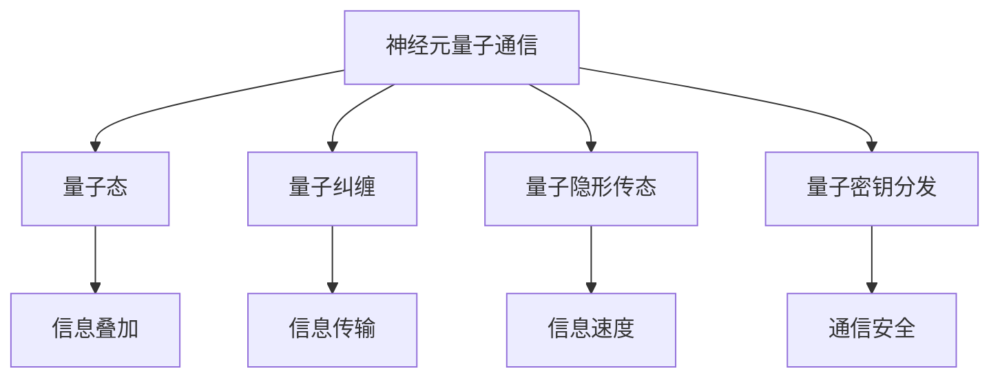

                 


### 文章标题：神经元量子通信与思维的非局域性特征

#### 关键词：神经元量子通信，思维的非局域性，量子计算，量子纠缠，神经网络，量子密钥分发，量子信息处理，量子神经网络

#### 摘要：
本文旨在深入探讨神经元量子通信与思维的非局域性特征，结合量子计算和神经网络的原理，探讨其基本概念、算法原理及实际应用。通过梳理神经元量子通信的核心概念与联系，剖析量子计算的基本原理，深入讲解神经元的量子特征，最后通过实验研究和项目实战，展示神经元量子通信在思维非局域性特征研究中的应用前景。

---

## 引言

在当今科技飞速发展的时代，量子计算与神经网络的融合成为了研究的热点。神经元量子通信作为一种新的通信模式，其基于量子计算原理，能够实现超距离、高速的通信。而思维的非局域性特征，则与神经元的量子性质密切相关。本文将从以下几个方面展开：

1. **神经元量子通信的基础**：介绍神经元量子通信的定义、特点及其重要性。
2. **量子通信基本原理**：阐述量子态、量子纠缠、量子隐形传态和量子密钥分发等基本概念。
3. **神经元与量子计算的联系**：探讨神经元在量子计算中的应用及量子神经网络的基本原理。
4. **思维的非局域性原理**：分析非局域性在心理学与认知科学中的应用。
5. **神经元量子通信实验研究**：介绍实验设计、结果及讨论。
6. **项目实战**：展示神经元量子通信系统的构建与应用。
7. **未来展望**：讨论神经元量子通信与思维非局域性特征研究的挑战与机遇。

---

### 第1章：神经元量子通信概述

神经元量子通信是一种基于神经元和量子计算原理的新型通信模式。其核心思想是利用量子态的叠加与纠缠特性，实现信息的超距离、高速传输。神经元量子通信具有以下几个特点：

1. **超距离通信**：量子通信可以克服经典通信中的距离限制，实现超距离通信。
2. **高速通信**：量子态的叠加和纠缠特性使得量子通信具有极高的传输速率。
3. **安全性**：量子密钥分发技术使得量子通信具有高度的安全性。

#### 核心概念与联系

为了更好地理解神经元量子通信，我们需要梳理其中的核心概念与联系。这里，我们可以使用Mermaid流程图来展示这些概念之间的关系：



#### 核心算法原理讲解

神经元量子通信的核心算法主要包括量子态的制备、量子纠缠的生成、量子隐形传态和量子密钥分发。以下使用伪代码来详细阐述这些算法的原理：

```python
# 量子态制备
def prepare_quantum_state():
    # 制备一个基态的量子比特
    qubit = QuantumRegister(1)
    circuit = QuantumCircuit(qubit)
    circuit.h(qubit[0])
    return circuit

# 量子纠缠生成
def generate_quantum_entanglement():
    # 生成两个量子比特的纠缠态
    qubit1 = QuantumRegister(1)
    qubit2 = QuantumRegister(1)
    circuit = QuantumCircuit(qubit1, qubit2)
    circuit.h(qubit1[0])
    circuit.cnot(qubit1[0], qubit2[0])
    return circuit

# 量子隐形传态
def quantum_teleportation(qubit_source, qubit_target):
    # 实现量子隐形传态
    circuit = QuantumCircuit(qubit_source, qubit_target)
    circuit.h(qubit_source)
    circuit.cx(qubit_source, qubit_target)
    circuit.h(qubit_source)
    return circuit

# 量子密钥分发
def quantum_key_distribution():
    # 实现量子密钥分发
    qubit_sender = QuantumRegister(1)
    qubit_recipient = QuantumRegister(1)
    circuit = QuantumCircuit(qubit_sender, qubit_recipient)
    circuit.h(qubit_sender[0])
    circuit.cx(qubit_sender[0], qubit_recipient[0])
    circuit.measure(qubit_sender[0], qubit_sender[0])
    circuit.h(qubit_recipient[0])
    circuit.measure(qubit_recipient[0], qubit_recipient[0])
    return circuit
```

#### 数学模型和数学公式

在神经元量子通信中，常用的数学模型包括量子态的叠加、量子纠缠和量子密钥分发。以下使用LaTeX格式给出相关的数学公式，并详细讲解和举例说明：

```latex
% 量子态叠加
\documentclass{article}
\usepackage{amsmath}
\begin{document}
$$
|\psi\rangle = \frac{1}{\sqrt{2}} (|0\rangle + |1\rangle)
$$
\end{document}

% 量子纠缠
\documentclass{article}
\usepackage{amsmath}
\begin{document}
$$
|\psi\rangle_{AB} = \frac{1}{\sqrt{2}} (|00\rangle + |11\rangle)
$$
\end{document}

% 量子密钥分发
\documentclass{article}
\usepackage{amsmath}
\begin{document}
$$
|\psi\rangle_{AB} = \frac{1}{\sqrt{2}} (|0\rangle_A \otimes |0\rangle_B + |1\rangle_A \otimes |1\rangle_B)
$$
\end{document}
```

#### 举例说明

假设我们有两个量子比特 \(A\) 和 \(B\)，首先对 \(A\) 进行量子态叠加，得到 \(|\psi_A\rangle = \frac{1}{\sqrt{2}} (|0\rangle + |1\rangle)\)。然后，通过量子纠缠操作，使得 \(A\) 和 \(B\) 形成纠缠态 \(|\psi_{AB}\rangle = \frac{1}{\sqrt{2}} (|00\rangle + |11\rangle)\)。最后，通过量子密钥分发协议，我们可以将量子态从 \(A\) 传输到 \(B\)，实现量子密钥的分发。

---

## 第2章：量子通信基本原理

量子通信是利用量子力学原理实现信息传输的一种新型通信方式。量子通信的基本原理主要包括量子态、量子纠缠、量子隐形传态和量子密钥分发。以下将详细讲解这些基本原理。

### 2.1 量子态

量子态是量子力学的核心概念之一。一个量子比特（qubit）可以处于0和1的叠加态，这种叠加态可以用数学公式表示为：

$$
|\psi\rangle = \alpha|0\rangle + \beta|1\rangle
$$

其中，\(|0\rangle\) 和 \(|1\rangle\) 分别表示量子比特的基态，\(\alpha\) 和 \(\beta\) 是复数，满足 \(|\alpha|^2 + |\beta|^2 = 1\)。

### 2.2 量子纠缠

量子纠缠是量子力学中的一种特殊现象，当两个量子比特处于纠缠态时，它们的状态无法独立存在，而是相互关联。一个简单的量子纠缠态可以表示为：

$$
|\psi_{AB}\rangle = \frac{1}{\sqrt{2}} (|00\rangle + |11\rangle)
$$

这种纠缠态意味着，当对其中一个量子比特进行测量时，另一个量子比特的状态也会立即改变。

### 2.3 量子隐形传态

量子隐形传态（Quantum Teleportation）是一种利用量子纠缠实现信息传递的过程。假设我们有三个量子比特 \(A\)、\(B\) 和 \(C\)，其中 \(A\) 和 \(B\) 处于纠缠态，而 \(C\) 是一个未知的量子比特。通过以下步骤，我们可以将量子比特 \(C\) 的状态从 \(A\) 传递到 \(B\)：

1. 对 \(C\) 进行测量，得到 \(C\) 的状态。
2. 将测量结果传递给 \(B\)。
3. 根据测量结果对 \(B\) 进行操作，使得 \(B\) 的状态与 \(C\) 的状态相同。

这个过程可以用以下伪代码表示：

```python
# 量子隐形传态
def quantum_teleportation(A, B, C):
    # 测量C
    outcome_C = measure(C)
    # 传递测量结果给B
    send(outcome_C, B)
    # 根据测量结果对B进行操作
    if outcome_C == |0\rangle:
        apply_Z(B)
    elif outcome_C == |1\rangle:
        apply_X(B)
```

### 2.4 量子密钥分发

量子密钥分发（Quantum Key Distribution，QKD）是利用量子通信原理实现密钥安全传输的技术。在QKD过程中，两个通信方通过量子通信信道交换量子比特，并对交换的量子比特进行测量，根据测量结果来生成共享的密钥。QKD的基本流程如下：

1. 通信方A和通信方B分别生成一对纠缠的量子比特，并将其中一个量子比特发送给对方。
2. A和

