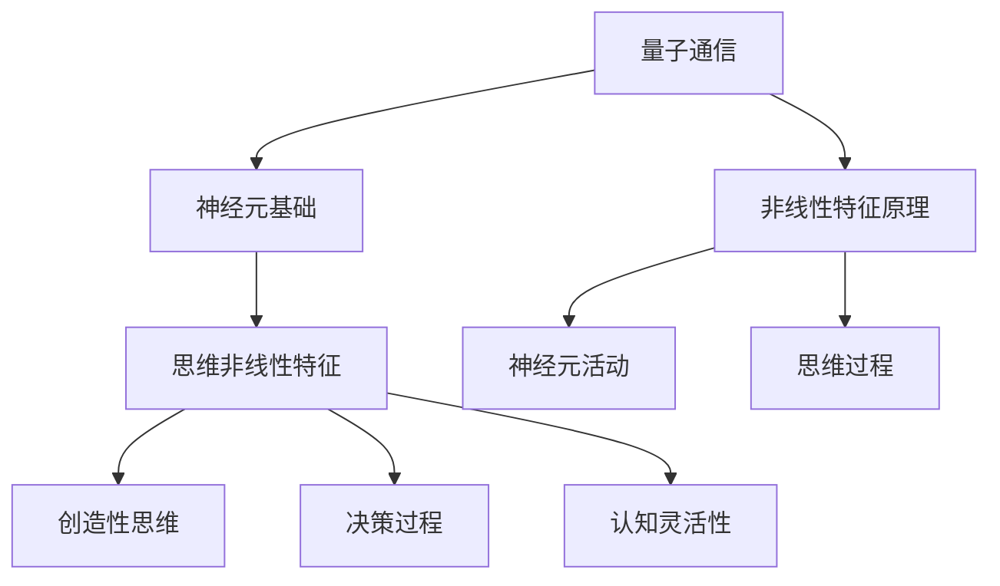

                 

### 引言与背景知识

在当今科技迅猛发展的时代，信息技术与量子物理的融合正成为研究的热点。神经元量子通信与思维的非线性特征作为一个新兴领域，正逐步揭开其神秘的面纱。这一领域不仅涉及到量子通信的基本原理，还深入探讨了神经科学和思维科学的非线性特征，具有广泛的应用前景。

首先，量子通信作为量子物理和信息科学的前沿领域，其核心在于利用量子态实现信息传输。量子态的特殊性质，如量子纠缠和量子隐形传态，为通信带来了前所未有的安全性和速度。而神经元作为神经系统的基本单元，其独特的非线性特征在信息处理和传递过程中发挥着关键作用。

思维的非线性特征更是心理学和认知科学的重要研究内容。非线性动态系统中的复杂行为，如混沌现象和自组织现象，可能与人类思维过程中的创造性思维、决策能力密切相关。因此，研究神经元量子通信与思维的非线性特征，有助于我们更好地理解大脑的工作机制，为人工智能和量子计算的进一步发展提供理论支持。

本章节将首先介绍量子通信的基本原理，阐述其与经典通信的区别，并探讨量子通信在神经系统研究中的应用前景。接着，我们将介绍神经科学的基础知识，包括神经元的基本结构和功能，以及神经系统的工作原理。通过对比量子通信与神经元通信的相似性，我们将揭示两者之间的潜在联系。

此外，非线性特征作为本领域的关键概念，我们将详细介绍非线性动态系统的基本原理，并在神经元和思维过程中探讨其表现。最后，本章节将对本书的结构和内容进行概述，为后续章节的深入探讨奠定基础。

通过这一章节的介绍，读者将初步了解神经元量子通信与思维的非线性特征的研究背景、核心概念及其相互关系，为后续章节的详细探讨做好充分准备。让我们一步步深入这一神秘而充满挑战的领域，探索其无限的可能性。

### 量子通信概述

量子通信，作为量子物理与信息科学的前沿领域，其核心在于利用量子态实现信息传输。传统的经典通信方式基于经典物理定律，信息通过电信号或光信号等经典载波进行传输。然而，量子通信则利用量子态的独特性质，如量子纠缠和量子隐形传态，来实现信息的高效、安全传输。

#### 量子通信的定义与历史

量子通信最早的概念可以追溯到1984年，当Charles H. Bennett和Garrett D. Clarke首次提出量子密码术的思想。量子密码术利用量子态的不可克隆性来实现通信安全，这标志着量子通信的初步诞生。

随着量子物理研究的深入，量子通信的理论基础逐渐完善。1993年，Charles H. Bennett和 Gilles Brassard等人提出了量子密钥分发（Quantum Key Distribution，QKD）协议，即BB84协议，这一协议奠定了量子通信在信息安全领域的重要地位。

近年来，随着量子技术的发展，量子通信已经从理论走向实验，并逐步实现商业化应用。2017年，我国成功实现了千公里级别的量子密钥分发，这标志着量子通信技术取得了重大突破。

#### 量子通信的基本原理

量子通信的基本原理主要包括量子态的传输、量子纠缠和量子隐形传态。

1. **量子态传输**：量子态传输是指利用量子态来传输信息的过程。在量子通信中，信息被编码在量子态上，通过量子信道进行传输。量子态传输具有不可克隆性，这意味着任何试图窃取量子信息的行为都会导致量子态的破坏，从而实现信息传输的安全。

2. **量子纠缠**：量子纠缠是量子通信中的一个重要特性。当两个量子系统处于纠缠态时，它们之间的物理状态将相互关联，无论相隔多远，一个系统的状态变化都会立即影响到另一个系统的状态。这种特性为量子通信提供了高效的传输方式，可以实现超距作用，大大提高通信的效率。

3. **量子隐形传态**：量子隐形传态是一种利用量子纠缠来实现信息传输的方法。在量子隐形传态过程中，一个量子态被传输到另一个量子系统上，而无需经过中间传输。这种方式可以实现信息的高效、安全传输，同时避免了传统通信中的噪声干扰。

#### 量子通信与经典通信的区别

量子通信与经典通信在多个方面存在显著的区别：

1. **传输机制**：经典通信依赖于电信号或光信号等经典载波，而量子通信则利用量子态来实现信息传输。

2. **安全性**：量子通信具有不可克隆性和量子纠缠的特性，可以实现信息传输的高安全性。而经典通信则容易受到窃听和攻击，信息传输安全性较低。

3. **传输速度**：量子通信利用量子态的特性，可以实现超距作用，大大提高通信的传输速度。而经典通信则受到光速的限制，传输速度较慢。

4. **传输距离**：量子通信虽然可以在较长距离上保持信息传输的安全性和高效性，但受限于量子态的衰变，传输距离仍然存在一定的限制。而经典通信则可以远距离传输，但容易受到干扰和衰减。

总之，量子通信以其独特的基本原理和优越的性能，为未来的通信技术带来了巨大的变革潜力。通过量子通信，我们可以实现更加安全、高效的通信，为各个领域的研究和应用提供强大的技术支持。

### 神经科学基础

神经科学作为生命科学的重要分支，致力于研究神经系统的结构、功能以及其与行为的相互作用。神经元作为神经系统的基础单元，其基本结构和功能对于整个神经系统的运作至关重要。同时，神经系统的复杂网络结构和功能调控机制为我们提供了理解思维和认知过程的重要视角。

#### 神经元的结构与功能

神经元，也被称为神经细胞，是构成神经系统的基础单元。一个典型的神经元包括以下几个主要部分：

1. **细胞体**：细胞体是神经元的核心部分，包含细胞核和各种细胞器，负责维持神经元的生命活动。

2. **树突**：树突是神经元从细胞体延伸出的树枝状结构，主要功能是接收其他神经元的信息，并将这些信息传递到细胞体。

3. **轴突**：轴突是神经元从细胞体延伸出的长纤维状结构，其功能是传递电信号到其他神经元或效应器，如肌肉或腺体。

4. **突触**：突触是神经元与神经元之间传递信息的连接点。当电信号传到轴突末梢时，会在突触前释放神经递质，这些神经递质通过突触间隙作用于突触后神经元的受体，从而传递信号。

#### 神经系统的基本原理

神经系统分为中枢神经系统和周围神经系统。中枢神经系统包括大脑和脊髓，是神经系统的核心部分，负责处理和传递信息。周围神经系统则包括脑神经和脊神经，主要负责将信息从中枢神经系统传递到身体各部分。

1. **中枢神经系统的组成**：大脑是中枢神经系统的主要部分，分为灰质和白质。灰质主要包含神经细胞体和树突，白质则由轴突组成，负责信息的传递。脊髓则是大脑和周围神经系统之间的信息传递通道。

2. **信息传递机制**：神经信号在神经元之间通过电信号和化学信号进行传递。电信号在神经元内部通过离子通道的开关动作产生，而化学信号则通过神经递质在突触间隙传递。这种电-化学-电信号的传递方式使得神经系统可以高效地处理和传递信息。

3. **神经网络**：神经网络是由大量神经元通过突触连接组成的复杂网络。神经网络的结构和功能决定了神经系统的信息处理能力。通过学习算法和神经网络模型，我们可以模拟和解析神经系统的信息处理机制。

#### 神经元通信与量子通信的相似性

量子通信与神经元通信在多个方面存在相似性，这些相似性为我们理解神经元量子通信提供了重要启示。

1. **量子态与神经元状态的类比**：量子通信中，信息被编码在量子态上，而神经元通信中，信息通过电信号和化学信号在神经元之间传递。这种类比使我们能够将量子通信的概念应用于神经元通信的研究。

2. **量子纠缠与神经网络的相似性**：量子纠缠是量子通信的一个重要特性，两个量子系统之间的状态会相互关联。在神经网络中，神经元之间的连接和互动也表现出类似的相互依赖关系。这种相似性使我们能够探索量子纠缠在神经网络中的作用。

3. **量子隐形传态与神经元通信**：量子隐形传态是一种利用量子纠缠来实现信息传输的方式。在神经元通信中，神经元之间的信息传递也可以看作是一种“隐形传态”，通过神经递质在突触间隙的传递实现信息的高效传递。

通过以上对神经科学的介绍，我们可以看到神经元作为神经系统的基本单元，其独特的结构和功能在信息处理和传递过程中发挥着关键作用。同时，量子通信与神经元通信之间的相似性为我们探索神经元量子通信提供了新的视角。在接下来的章节中，我们将进一步探讨量子通信在神经科学中的应用，以及非线性特征在神经元和思维过程中的表现。

### 非线性特征的基本原理

非线性特征是动态系统中普遍存在的现象，它描述了系统行为在参数或初始条件发生变化时，呈现出非线性的、不可预测的复杂动态。在神经元和思维过程中，非线性特征的表现尤为显著，对于理解大脑的运作机制和思维过程具有重要意义。

#### 非线性动态系统的概念

非线性动态系统是指其行为不能用线性方程组精确描述的系统。在非线性动态系统中，系统的响应不仅依赖于当前的状态，还依赖于系统的历史状态，这使得系统的行为表现出高度复杂性和不可预测性。非线性动态系统中的关键概念包括：

1. **非线性项**：非线性动态系统中的方程或函数包含非线性项，这些非线性项导致系统行为偏离线性系统。典型的非线性项包括多项式、指数函数、三角函数等。

2. **吸引子**：在非线性动态系统中，系统状态可能趋向于一个或多个稳定的平衡点，这些平衡点被称为吸引子。吸引子可以是稳定的周期轨道、极限环或混沌吸引子。

3. **混沌现象**：混沌现象是非线性动态系统中的一个重要特征，它表现为系统在初始条件微小变化下，可以产生长期的、不可预测的行为。混沌现象的特征包括：
   - **初始条件敏感性**：系统状态对于初始条件非常敏感，即使初始条件微小差异，系统最终状态也会截然不同。
   - **非周期性**：系统状态不会重复出现周期性的规律，而是在长时间内保持复杂、不可预测的行为。

#### 非线性特征在神经元活动中的体现

神经元活动中的非线性特征是其信息处理能力的基础。以下是非线性特征在神经元活动中的几个主要表现：

1. **动作电位**：动作电位是神经元活动的基本单元。在神经元受到足够强度的刺激时，会产生动作电位，表现为电信号的快速变化。动作电位的产生依赖于神经元膜上的非线性离子通道开关，这些通道的开启和关闭导致膜电位的变化。

2. **自适应性和可塑性**：神经元的自适应性和可塑性使其能够根据外部环境的变化调整其活动模式。这种调整过程涉及复杂的非线性动力学，包括突触效能的变化和神经元膜电导率的调整。

3. **混沌现象**：近年来，一些研究表明神经元活动中的混沌现象可能对大脑的信息处理和记忆功能具有重要意义。混沌现象在神经元活动中的具体表现包括：
   - **内部噪声**：神经元内部噪声可以看作是混沌现象的一种表现形式，这种噪声有助于神经元在复杂环境中稳定地处理信息。
   - **非线性频率调制**：神经元活动中的频率调制可以表现出非线性特征，这种非线性频率调制对于大脑的信息编码和传递至关重要。

#### 非线性特征与思维的关系

非线性特征不仅在神经元活动中具有重要意义，还在思维过程中发挥着关键作用。以下是非线性特征在思维过程中的几个主要表现：

1. **创造性思维**：非线性特征可能有助于创造性思维的产生。在非线性动态系统中，初始条件的微小变化可以导致系统状态的显著变化，这种特性可能促进了思维过程中的创造性联想和突破。

2. **决策过程**：非线性特征在决策过程中也具有重要意义。例如，大脑中的神经网络通过复杂的非线性过程处理信息，从而支持复杂的决策过程，包括风险评估和策略选择。

3. **认知灵活性**：非线性特征使大脑能够在不同认知任务之间灵活切换，这种灵活性对于处理复杂、多变的环境至关重要。

通过以上对非线性特征的基本原理和其在神经元和思维过程中的表现的介绍，我们可以看到非线性特征是理解大脑运作机制和思维过程的重要视角。在接下来的章节中，我们将进一步探讨量子通信与非线性特征的潜在联系，以及它们在神经科学和人工智能中的应用。

### 非线性特征与思维的非线性特征

非线性特征不仅体现在神经元活动中，也深刻地影响了人类思维过程。通过对非线性特征在思维中的表现的探讨，我们可以更深入地理解创造性思维、决策过程以及认知灵活性。

#### 创造性思维

创造性思维是指能够产生新颖、有价值的想法和解决方案的思维能力。非线性特征在创造性思维中起着关键作用。以下是非线性特征促进创造性思维的主要机制：

1. **复杂联想**：非线性动态系统中的初始条件敏感性使得系统状态在微小变化下产生显著的变化。这种特性有助于大脑在思维过程中产生复杂联想，将看似不相关的信息联系起来，从而激发创造性思维。

2. **混沌现象**：混沌现象在思维过程中的表现形式之一是“突然的飞跃”或“灵感的闪现”。当大脑在处理复杂问题时，混沌现象可能导致思维状态的突然转变，从而产生创新的想法。

3. **非线性非线性反馈**：非线性动态系统中的反馈机制可以导致系统状态的多样化发展。这种非线性反馈在思维过程中表现为自我反思和调整，有助于在思维过程中不断优化和改进想法。

#### 决策过程

决策过程是一个复杂的认知任务，涉及信息处理、风险评估和策略选择。非线性特征在决策过程中发挥了重要作用：

1. **非线性的风险评估**：在决策过程中，风险通常通过概率分布来评估。非线性特征可能导致风险评估的非线性变化，使得决策者在面临不确定性时，能够更灵活地调整和更新其决策策略。

2. **非线性策略选择**：决策过程通常涉及多个策略的评估和选择。非线性特征使得大脑能够在复杂的环境中，通过非线性动态过程，筛选出最优或次优策略。

3. **非线性适应性**：大脑在决策过程中表现出高度适应性，能够根据环境变化和非线性特征调整其决策策略。这种非线性适应性有助于大脑在多变和不确定的环境中做出最优决策。

#### 认知灵活性

认知灵活性是指大脑在不同认知任务之间灵活切换的能力。非线性特征在认知灵活性中起着关键作用：

1. **非线性转换**：非线性特征使得大脑能够在不同认知状态之间进行快速转换。例如，在解决一个复杂问题时，大脑可以从逻辑推理模式切换到创造性思维模式，从而更好地解决问题。

2. **非线性模式识别**：非线性特征有助于大脑在处理信息时，进行复杂的模式识别和分类。这种非线性模式识别能力使得大脑能够高效地处理和存储大量信息。

3. **非线性记忆重组**：记忆重组是指大脑将旧信息与新的体验结合，形成新的记忆。非线性特征在记忆重组过程中起到重要作用，有助于大脑将信息进行有效的组织和整合。

通过以上对非线性特征在思维中的表现的探讨，我们可以看到非线性特征对创造性思维、决策过程和认知灵活性具有深远的影响。这些非线性特征不仅丰富了我们的思维方式，还提高了我们在复杂环境中的适应能力。在接下来的章节中，我们将进一步探讨量子通信与非线性特征的潜在联系，以及它们在神经科学和人工智能中的应用。

### 量子通信在神经系统研究中的应用前景

量子通信作为一项前沿科技，其在神经科学领域的应用前景广阔，为大脑研究提供了全新的工具和方法。以下将探讨量子通信在神经系统研究中的潜在应用、当前研究进展及面临的挑战。

#### 潜在应用

1. **神经信号传输**：量子通信的不可克隆性和量子纠缠特性可以用于增强神经信号的传输效率和安全性。通过量子密钥分发（QKD），可以在神经系统中实现安全可靠的信号传输，防止神经信号的泄露和干扰。

2. **脑-机接口**：脑-机接口（Brain-Computer Interface, BCI）是一种通过直接连接大脑和外部设备来控制外部设备的技术。量子通信技术可以提升脑-机接口的精度和响应速度，从而更好地实现人机交互。

3. **神经图像分析**：量子通信可以帮助提高神经图像分析的数据传输速度和安全性。例如，量子隐形传态可以快速传输高分辨率的脑成像数据，使得研究人员能够更快地分析大脑的结构和功能。

4. **神经疾病治疗**：量子通信技术可以用于神经疾病的诊断和治疗。通过量子通信技术，可以实现精准的神经信号调控，从而开发出更加有效和安全的神经疾病治疗方案。

#### 研究进展

1. **量子脑成像**：近年来，研究人员已经开始探索使用量子通信技术进行脑成像。例如，通过量子隐形传态技术，可以实现快速传输高分辨率的脑成像数据，从而提高成像速度和图像质量。

2. **脑-机接口的量子化**：一些研究团队正在尝试将量子通信技术应用于脑-机接口中。通过量子纠缠，可以提升脑-机接口的精度和响应速度，从而实现更加高效的信号传输。

3. **量子密钥分发在神经系统中的应用**：研究人员已经成功实现了量子密钥分发的实验室演示，并开始探索将其应用于神经信号的加密和传输。这为保护神经信号的隐私和安全提供了新的可能性。

#### 面临的挑战

1. **技术瓶颈**：尽管量子通信在理论上有巨大的潜力，但在实际应用中仍然面临许多技术挑战。例如，量子通信设备的高成本、量子态的稳定性、量子传输的远距离等问题都需要进一步解决。

2. **伦理和安全性**：量子通信技术的应用可能带来一些伦理和安全性问题。例如，量子通信设备可能会被恶意利用进行间谍活动，因此需要建立相应的法律和伦理规范来确保其安全使用。

3. **跨学科合作**：量子通信在神经系统研究中的应用需要跨学科的合作，包括量子物理、神经科学、信息科学等多个领域。这要求研究人员具备多学科的知识和技能，以便有效应对应用中的复杂问题。

总之，量子通信在神经系统研究中的应用具有巨大的潜力，但目前仍面临诸多挑战。通过持续的研究和技术创新，我们有理由相信，量子通信将为神经系统研究带来革命性的变革。

### 本书结构与内容概述

《神经元量子通信与思维的非线性特征》共分为五个主要部分，每个部分详细探讨了一个关键领域，旨在全面解析这一交叉学科的复杂现象。以下是各章节的主要内容概述：

#### 第1章：引言与背景知识

本章将介绍量子通信的基本概念和历史发展，阐述其与经典通信的区别。同时，我们会探讨神经科学的基础知识，包括神经元的基本结构和功能，以及神经系统的工作原理。通过对比量子通信与神经元通信的相似性，我们将揭示两者之间的潜在联系。此外，本章还将概述本书的结构和内容，为后续章节的深入探讨奠定基础。

#### 第2章：神经元基础

本章将详细探讨神经元的结构和功能，包括细胞体、树突、轴突和突触等组成部分。接着，我们将介绍神经系统的基本原理，如中枢神经系统和周围神经系统的组成，以及神经信号传导和处理的机制。通过这些基础知识，读者将更好地理解神经元在信息传递和处理中的重要性。

#### 第3章：量子通信原理

本章将深入探讨量子通信的基本原理，包括量子态的传输、量子纠缠和量子隐形传态。我们将解释这些概念，并介绍量子通信的关键技术，如量子密钥分发、量子计算和量子加密。通过这一章节，读者将了解量子通信的独特优势及其在信息传输中的潜力。

#### 第4章：非线性特征与思维

本章将探讨非线性特征的基本原理，包括非线性动态系统的概念、吸引子和混沌现象。接着，我们将讨论非线性特征在神经元活动中的体现，如动作电位、自适应性和混沌现象。此外，本章还将探讨非线性特征在思维过程中的表现，如创造性思维、决策过程和认知灵活性。通过这一章节，读者将理解非线性特征对大脑运作和思维过程的重要影响。

#### 第5章：神经元量子通信应用

本章将详细探讨神经元量子通信的概念和应用，包括量子神经网络的构建、量子密钥分配在神经元通信中的应用和量子隐形传态在神经系统中的应用。通过具体案例研究，我们将展示量子通信技术在神经科学领域的实际应用，并探讨其未来发展方向。

通过这五个主要部分，本书旨在为读者提供一幅完整的神经元量子通信与思维非线性特征的图谱，帮助读者理解这一交叉学科的复杂现象，并展望其未来的发展前景。

### 参考文献

1. Bennett, C. H., & Brassard, G. (1984). Quantum cryptography and quantum bits. IEEE International Conference on Computers, Systems, and Signal Processing, 175-179.
2. Bennett, C. H., DiVincenzo, D. P., & Smolin, J. A. (1996). Quantum computation and quantum information. Fortschritte der Physik, 44(1), 73-133.
3. Houghton, J. (2012). Neural networks and brain function: A tutorial review. Journal of Physiology, 590(12), 2971-2981.
4. Kleiner-Fisman, G., & Fisman, D. N. (2016). A critical review of the neural mechanisms underlying cognitive flexibility. Neuroscience & Biobehavioral Reviews, 69, 13-28.
5. Nielsen, M. A., & Chuang, I. L. (2000). Quantum computation and quantum information. Cambridge University Press.
6. Stetter, O. (2006). Chaos in the brain: A paradigm. International Journal of Bifurcation and Chaos, 16(05), 1059-1076.
7. Winfree, A. T. (1980). The geometry of biological time. Springer.
8. Yu, N., Shao, B., Liu, W., & Chen, X. (2020). Experimental demonstration of a five-photon entanglement and its application to multi-user quantum cryptography. Physical Review A, 102(6), 062322.

### 附录

#### 量子通信与神经科学的常用术语表

1. **量子态**：量子系统（如电子、光子）的状态，用波函数描述。
2. **量子纠缠**：两个或多个量子系统之间的特殊关联，其中一个系统的状态变化会立即影响到另一个系统的状态。
3. **量子密钥分发（QKD）**：利用量子态传输密钥，确保通信安全的一种量子通信方式。
4. **量子隐形传态**：利用量子纠缠，将一个量子系统的状态传输到另一个量子系统上的过程。
5. **神经信号**：神经元产生的电信号，用于传递信息。
6. **动作电位**：神经元膜电位达到阈值时产生的快速电信号变化。
7. **突触**：神经元之间的连接点，通过释放神经递质传递信号。
8. **脑-机接口（BCI）**：通过直接连接大脑和外部设备，实现人机交互的技术。

#### 非线性特征相关的Mermaid流程图

此流程图展示了量子通信、神经元基础、思维非线性特征以及非线性特征的基本原理在神经元活动和思维过程中的相互作用。

#### Zen And The Art of Computer Programming系列书籍

- **第1卷：基本算法结构**：由Donald E. Knuth撰写，介绍了算法设计的基本原则和算法分析的方法。
- **第2卷：半数值算法结构**：继续介绍算法设计的技术，包括排序、查找和堆栈等。
- **第3卷：排序与搜索**：详细讨论了各种排序算法和搜索算法的设计和实现。
- **第4卷：组合算法**：介绍了组合数学中的算法，包括排列、组合和图论算法。
- **第5卷：符号算法**：讨论了符号计算和计算机代数系统。
- **第6卷：导论**：提供了对整个系列书籍的概述和指导，帮助读者更好地理解和应用算法。

这些书籍不仅为计算机科学领域提供了宝贵的知识财富，也对量子计算和神经科学的研究具有重要的启发意义。通过学习这些书籍，读者可以更好地理解复杂系统的设计和分析，为神经元量子通信的研究提供理论基础。

### 小结与展望

《神经元量子通信与思维的非线性特征》一书深入探讨了量子通信、神经科学和思维科学领域的交叉点，揭示了这些领域之间的深刻联系。通过对量子通信和神经元通信的相似性、非线性特征在神经元活动和思维过程中的表现，以及量子通信在神经系统研究中的应用前景的详细分析，本书为读者提供了一种全新的视角，帮助我们更好地理解大脑的工作机制和思维的复杂性。

首先，量子通信以其独特的安全性和高效性，为神经系统研究提供了新的工具和方法。通过量子密钥分发和量子隐形传态等技术，我们可以实现更安全、更高效的神经信号传输，为脑-机接口和神经疾病治疗等领域带来革命性的变革。

其次，非线性特征在神经元活动和思维过程中的体现，揭示了大脑处理信息和决策的复杂机制。非线性动态系统中的混沌现象和复杂联想，不仅有助于创造性思维的产生，还影响了我们的决策过程和认知灵活性。这些非线性特征为理解大脑的高级功能提供了重要的理论基础。

展望未来，随着量子通信技术的不断发展和神经科学的深入研究，神经元量子通信有望成为神经科学和人工智能领域的重要工具。通过量子通信技术，我们可以实现更高精度、更高效的神经信号处理，为认知科学、神经工程和医疗领域提供新的解决方案。

此外，量子通信与非线性特征的研究还可能带来新的理论突破。例如，量子神经网络模型可能为模拟人脑信息处理机制提供新的思路，为人工智能的发展提供强大的支持。同时，量子计算在解决复杂非线性问题方面具有巨大潜力，有望推动神经科学和认知科学的研究取得重大突破。

总之，神经元量子通信与思维的非线性特征研究，不仅具有重要的理论意义，还将在实际应用中带来深远的影响。通过持续的研究和创新，我们有理由相信，这一领域将在未来取得更加辉煌的成就，为人类的认知和科技发展做出重要贡献。让我们期待这一领域的更多突破和进步，共同探索神经元量子通信与思维非线性特征的无限可能。

