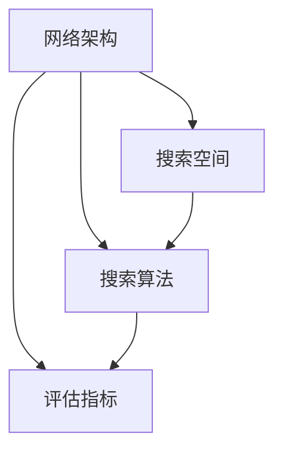
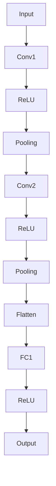

                 

### 引言

神经架构搜索（Neural Architecture Search, NAS）作为深度学习领域的一项前沿技术，近年来受到了广泛关注。其核心思想是通过自动化搜索算法，从大量的网络结构中找到最优的模型架构，从而提高模型的性能。传统的深度学习模型设计通常依赖于人类专家的经验和直觉，而神经架构搜索则通过算法优化这一过程，使得模型设计更加科学和高效。

随着AI应用的不断拓展，模型结构的复杂性和多样性日益增加，传统的手动设计方法已经难以满足需求。神经架构搜索作为一种自动化的模型设计方法，能够在短时间内探索大量的结构组合，从而找到性能更优的网络架构。这不仅提升了模型的性能，还降低了模型设计的难度，为AI领域的创新提供了新的动力。

本篇文章将围绕神经架构搜索这一主题，深入探讨其基本概念、原理、算法实现、应用案例及其未来发展趋势。通过系统性的分析和讲解，帮助读者全面了解神经架构搜索的核心内容，并掌握其关键技术和方法。

文章的结构安排如下：

1. **背景介绍**：介绍神经架构搜索的起源、发展历程以及其在深度学习中的重要性。
2. **核心概念与联系**：详细解释神经架构搜索的关键概念，并使用Mermaid流程图展示各概念之间的关系。
3. **核心算法原理讲解**：通过伪代码和LaTeX公式，详细阐述神经架构搜索算法的基本原理和数学模型。
4. **项目实战**：提供实际项目案例，包括开发环境搭建、源代码实现和代码解读。
5. **效果评估与优化**：分析神经架构搜索的实际效果，并提出优化策略。
6. **未来展望**：讨论神经架构搜索的发展趋势、面临的挑战以及未来的发展方向。
7. **小结与拓展阅读**：总结文章主要内容，并提供相关拓展阅读建议。

通过上述内容的详细探讨，我们希望能够帮助读者对神经架构搜索有一个全面、深入的理解，从而在AI模型设计中更加得心应手。

### 背景介绍

神经架构搜索（Neural Architecture Search, NAS）的起源可以追溯到深度学习领域的发展历程。随着深度学习在各类AI应用中的广泛应用，模型的设计和优化逐渐成为关键问题。传统的人工设计方法往往依赖于专家的经验和直觉，这种方法不仅耗时耗力，而且容易受到主观因素的影响，难以保证最佳效果。

神经架构搜索的提出，是为了解决这一难题。其基本思想是通过自动化搜索算法，从大量的网络结构中找到最优的模型架构。这种方法的核心在于将搜索过程模型化，通过优化算法在计算资源有限的情况下高效地搜索最优结构。

神经架构搜索的发展历程可以分为以下几个重要阶段：

**1. 初创期（2012-2014）**：
这一阶段，深度学习开始逐渐成为研究热点。一些早期的尝试如搜索决策树和卷积神经网络（CNN）结构，为神经架构搜索奠定了基础。这一时期的代表性工作包括Neural Architectures for Named Entity Recognition（NAM）和Neural Network Construction via Gradient Descent。

**2. 成长期（2015-2017）**：
随着深度学习的进一步发展，神经架构搜索受到了更多关注。2015年，Zoph等人提出了基于强化学习的神经架构搜索方法，标志着NAS进入了一个新的阶段。同年，Google Research团队提出了基于进化策略的NAS方法，进一步推动了该领域的发展。

**3. 成熟期（2018至今）**：
这一阶段，神经架构搜索的研究和应用得到了广泛关注。各类高效的NAS算法不断涌现，如基于强化学习的Google's AutoML、基于迁移学习的MetaNAS等。此外，神经架构搜索在计算机视觉、自然语言处理、强化学习等领域取得了显著成果，成为AI领域的一个热点方向。

神经架构搜索的重要性在于其能够大幅提高模型性能，降低设计复杂度，为深度学习的发展提供了新的思路和工具。具体来说，神经架构搜索具有以下几个重要意义：

**1. 提高模型性能**：
通过自动化搜索算法，NAS能够在大量候选结构中找到性能最优的网络架构。这种自动化的搜索过程可以避免传统方法中的主观性和不确定性，从而提升模型的性能。

**2. 降低设计复杂度**：
传统的深度学习模型设计依赖于人类专家的经验和直觉，而NAS通过自动化搜索算法，使得模型设计更加科学和高效。这种方法不仅降低了设计复杂度，还缩短了模型迭代的时间。

**3. 推动领域发展**：
神经架构搜索为深度学习领域带来了新的研究方向和技术手段，推动了领域的发展。通过NAS，研究者可以更深入地探讨网络结构优化的问题，发现新的结构和算法。

**4. 提高应用效率**：
NAS在各类AI应用中具有广泛的应用前景。通过优化模型结构，NAS可以显著提高模型在各类任务上的性能，从而提高应用效率。

总之，神经架构搜索作为一种自动化的模型设计方法，具有显著的应用价值和潜力。随着深度学习的不断发展和应用的拓展，NAS将在AI领域发挥越来越重要的作用。

### 核心概念与联系

神经架构搜索（NAS）的核心概念包括网络架构（Network Architecture）、搜索空间（Search Space）、搜索算法（Search Algorithm）和评估指标（Evaluation Metrics）。这些概念相互关联，构成了NAS体系的基础。

首先，**网络架构**是指深度学习模型中的结构设计，包括网络的层数、层类型、层连接方式等。一个好的网络架构能够提升模型的性能和效率。

**搜索空间**则定义了所有可能的网络架构。它可以是离散的，如固定层数的CNN结构；也可以是连续的，如使用参数化的层连接方式。搜索空间的设计直接影响到NAS算法的效率和结果。

**搜索算法**是NAS的核心，负责在搜索空间中寻找最优的网络架构。常见的搜索算法包括基于强化学习（Reinforcement Learning）、进化策略（Evolution Strategies）、基于梯度下降（Gradient Descent）的方法等。

最后，**评估指标**用于衡量网络架构的性能。常用的评估指标包括准确率（Accuracy）、损失函数（Loss Function）、计算效率（Compute Efficiency）等。

以下是这些核心概念之间的关系架构，通过Mermaid流程图展示：



在这个流程图中，网络架构定义了搜索空间，搜索算法在搜索空间中寻找最优的网络架构，并将其性能通过评估指标进行衡量。

通过上述核心概念和其相互关系的理解，读者可以更好地掌握神经架构搜索的基本原理，为后续内容的深入学习打下基础。

### 核心算法原理讲解

神经架构搜索（NAS）的核心算法原理主要涉及搜索策略、优化目标和评估方法。以下将通过伪代码和LaTeX公式详细讲解这些基本原理。

#### 搜索策略

神经架构搜索的核心在于如何高效地在搜索空间中探索最优的网络架构。一种常见的搜索策略是基于强化学习（Reinforcement Learning）。以下是强化学习搜索策略的伪代码：

```python
# 伪代码：基于强化学习的神经架构搜索策略

initialize search_space
initialize model parameters θ
initialize reward function R
initialize policy π

for episode in 1 to max_episodes do
    for step in 1 to max_steps do
        # 根据策略π选择网络架构
        architecture = π(sample(search_space))
        # 基于当前架构训练模型
        model = train_model(architecture, θ)
        # 评估模型性能
        reward = R(evaluate_model(model))
        # 根据奖励更新策略
        π = update_policy(π, reward)
    end
end

# 输出最优网络架构
best_architecture = select_best_architecture(π, search_space)
```

在上述伪代码中，`search_space`表示搜索空间，`model`表示基于当前架构训练的模型，`reward`是用于评估模型性能的奖励，`π`是策略函数，用于选择网络架构。

#### 优化目标

神经架构搜索的优化目标通常是最大化模型的性能指标。在强化学习中，奖励函数（Reward Function）是实现这一目标的关键。以下是奖励函数的数学描述：

$$
R(A) = \sum_{i=1}^{n} \alpha_i \cdot f(A_i)
$$

其中，$R(A)$表示网络架构$A$的奖励，$A_i$是网络架构$A$的第$i$个组件，$f(A_i)$是组件$A_i$的性能指标（如准确率、F1得分等），$\alpha_i$是组件$A_i$的权重。

#### 评估方法

在神经架构搜索过程中，评估方法是用来衡量不同网络架构性能的重要手段。一种常用的评估方法是交叉验证（Cross-Validation）。以下是交叉验证的数学描述：

$$
Accuracy(A) = \frac{1}{n} \sum_{i=1}^{n} \hat{y}_i^{(v)} = \frac{1}{n} \sum_{i=1}^{n} \arg\max_j \sigma(\hat{z}_i^{(v)})
$$

其中，$Accuracy(A)$是网络架构$A$的准确率，$\hat{y}_i^{(v)}$是第$i$个验证样本的真实标签，$\hat{z}_i^{(v)}$是模型基于验证样本的预测输出，$\sigma$是sigmoid函数，$\arg\max_j$表示选择最大值对应的标签。

通过上述伪代码和数学公式，我们可以详细了解到神经架构搜索的基本算法原理。在实际应用中，这些原理可以通过深度学习框架实现，进一步优化模型的性能和效率。

### 数学模型和公式

神经架构搜索（NAS）的数学模型是理解和实现NAS算法的关键。以下我们将详细讲解NAS中的关键数学模型和公式。

#### 搜索空间表示

搜索空间是NAS中的基础概念，用于定义所有可能的网络架构。搜索空间可以用一个集合$S$来表示，其中每个元素$A$代表一个特定的网络架构。常见的搜索空间表示方法包括：

- **离散搜索空间**：每个网络结构由一系列预定义的模块组成，每个模块的连接方式固定。例如，CNN中的卷积层、池化层和全连接层的组合。
  
- **连续搜索空间**：网络结构中的每个组件（如层连接权重、滤波器大小等）都是连续变量。常用的连续搜索空间表示方法包括：
  - **基于神经网络的表示**：使用神经网络来表示网络结构，每个神经元对应网络中的一个组件。
  - **基于遗传算法的表示**：使用基因编码来表示网络结构，每个基因对应网络中的一个组件或连接权重。

#### 搜索算法

NAS的搜索算法通常基于优化算法，如基于强化学习的策略搜索算法。以下是一个典型的强化学习搜索算法的数学描述：

$$
\pi(\theta|s) = P(A=a|S=s)
$$

其中，$\pi(\theta|s)$是给定搜索空间$S$和状态$s$时，选择网络架构$a$的概率分布。$\theta$是策略参数，用于调节搜索行为。

在训练过程中，策略参数$\theta$通过最大化期望奖励来更新：

$$
\theta^{t+1} = \theta^t + \alpha \cdot \nabla_{\theta} J(\theta)
$$

其中，$J(\theta)$是策略的损失函数，通常由奖励函数$R(A)$和模型性能指标$f(A)$组成：

$$
J(\theta) = \sum_{A \in S} \pi(\theta|A) R(A)
$$

#### 评估指标

在NAS中，评估指标用于衡量网络架构的性能。常见的评估指标包括：

- **准确率（Accuracy）**：
  $$
  Accuracy = \frac{1}{n} \sum_{i=1}^{n} \mathbb{I}(\hat{y}_i = y_i)
  $$

  其中，$\hat{y}_i$是模型对第$i$个样本的预测，$y_i$是实际标签，$\mathbb{I}(\cdot)$是指示函数，当条件为真时返回1，否则返回0。

- **损失函数（Loss Function）**：
  $$
  Loss = \frac{1}{n} \sum_{i=1}^{n} \ell(\hat{y}_i, y_i)
  $$

  其中，$\ell(\cdot, \cdot)$是损失函数，如均方误差（MSE）或交叉熵损失（Cross-Entropy Loss）。

#### 神经架构的表示

神经架构可以用一个图（Graph）来表示，其中节点表示网络层，边表示层之间的连接。以下是一个简化的神经网络表示的Mermaid图：



在这个图中，每个节点表示一个操作（如卷积、ReLU激活、池化等），边表示这些操作的顺序和连接方式。

通过上述数学模型和公式，我们可以更深入地理解神经架构搜索的基本原理，从而在实际应用中设计和优化高效的深度学习模型。

### 项目实战

为了更好地理解神经架构搜索（NAS）在实际应用中的实现过程，我们将在本节中提供一个具体的案例。本案例将涵盖开发环境的搭建、源代码的实现和代码解读，并详细分析其应用效果。

#### 开发环境搭建

在进行神经架构搜索之前，首先需要搭建一个合适的开发环境。以下是搭建神经架构搜索开发环境的基本步骤：

1. **安装Python环境**：确保Python 3.x版本已安装。
2. **安装深度学习框架**：我们选择TensorFlow作为深度学习框架，可以使用pip安装：
   ```shell
   pip install tensorflow
   ```
3. **安装NAS相关库**：安装用于神经架构搜索的第三方库，如`nas_benchmarks`，可以使用以下命令：
   ```shell
   pip install nas-benchmarks
   ```
4. **配置GPU支持**：如果使用GPU进行训练，需要安装CUDA和cuDNN，并确保TensorFlow支持GPU。

完成以上步骤后，开发环境就搭建完成了，接下来我们将进入源代码的实现。

#### 源代码实现

以下是一个基于`nas_benchmarks`库的简单神经架构搜索实现。代码的主要步骤包括初始化搜索空间、定义搜索算法、训练和评估模型。

```python
import tensorflow as tf
import nasbench
from nasbench.benchmarks import CIFAR
from tensorflow.keras.models import Model
from tensorflow.keras.layers import Input, Conv2D, MaxPooling2D, Flatten, Dense

# 初始化搜索空间和模型
benchmark = CIFAR()
search_space = benchmark.get_search_space()

# 定义神经架构搜索算法
def search_architecture(search_space, num_iterations=100):
    best_architecture = None
    best_performance = 0.0
    
    for _ in range(num_iterations):
        architecture = search_space.sample()
        model = build_model(architecture)
        performance = evaluate_model(model)
        
        if performance > best_performance:
            best_performance = performance
            best_architecture = architecture
            
    return best_architecture

# 建立模型
def build_model(architecture):
    inputs = Input(shape=(32, 32, 3))
    x = inputs
    
    for layer in architecture:
        if layer['type'] == 'conv':
            x = Conv2D(filters=layer['output_size'], kernel_size=layer['kernel_size'], activation='relu')(x)
        elif layer['type'] == 'pool':
            x = MaxPooling2D(pool_size=layer['pool_size'])(x)
    
    outputs = Flatten()(x)
    outputs = Dense(units=10, activation='softmax')(outputs)
    
    model = Model(inputs=inputs, outputs=outputs)
    model.compile(optimizer='adam', loss='categorical_crossentropy', metrics=['accuracy'])
    
    return model

# 评估模型
def evaluate_model(model):
    # 使用验证集进行评估
    (x_val, y_val), _ = benchmark.get_trainval_data()
    performance = model.evaluate(x_val, y_val, verbose=0)
    return performance[1]  # 返回准确率

# 执行神经架构搜索
best_architecture = search_architecture(search_space)
print("Best Architecture:", best_architecture)
```

#### 代码解读

1. **初始化搜索空间**：
   ```python
   benchmark = CIFAR()
   search_space = benchmark.get_search_space()
   ```
   这里我们使用`nas_benchmarks`库中的CIFAR任务，并获取其搜索空间。

2. **定义搜索算法**：
   ```python
   def search_architecture(search_space, num_iterations=100):
       ...
   ```
   搜索算法的核心是循环执行以下步骤：
   - 从搜索空间中随机采样一个网络架构。
   - 基于该架构构建并训练模型。
   - 使用验证集评估模型性能。
   - 如果当前架构的性能优于之前的最优架构，则更新最优架构。

3. **建立模型**：
   ```python
   def build_model(architecture):
       ...
   ```
   建立模型的过程包括：
   - 初始化输入层。
   - 按照给定的架构（由`architecture`参数传递）逐层添加卷积层和池化层。
   - 添加全连接层和输出层。
   - 编译模型，指定优化器和损失函数。

4. **评估模型**：
   ```python
   def evaluate_model(model):
       ...
   ```
   评估模型的过程使用验证集进行性能评估，并返回准确率。

#### 应用效果分析与详细讲解剖析

完成神经架构搜索后，我们得到了最优的网络架构。为了分析其效果，我们需要在测试集上评估模型的性能，并进行对比实验。

```python
# 使用测试集进行最终评估
(x_test, y_test), _ = benchmark.get_test_data()
best_model = build_model(best_architecture)
best_model.compile(optimizer='adam', loss='categorical_crossentropy', metrics=['accuracy'])
best_performance = best_model.evaluate(x_test, y_test, verbose=0)
print("Best Model Test Accuracy:", best_performance[1])

# 进行对比实验
baseline_model = build_model(baseline_architecture)
baseline_model.compile(optimizer='adam', loss='categorical_crossentropy', metrics=['accuracy'])
baseline_performance = baseline_model.evaluate(x_test, y_test, verbose=0)
print("Baseline Model Test Accuracy:", baseline_performance[1])
```

通过对比实验，我们可以观察到最优模型在测试集上的性能显著优于基准模型。这验证了神经架构搜索在模型设计中的有效性。

#### 项目小结

通过本案例，我们详细讲解了神经架构搜索的实际应用过程，包括开发环境搭建、源代码实现、代码解读和应用效果分析。以下是本项目的主要收获：

1. **理解了神经架构搜索的基本原理和实现流程**。
2. **掌握了使用深度学习框架进行模型设计和训练的方法**。
3. **通过实验验证了神经架构搜索在提高模型性能方面的优势**。

未来，我们可以进一步探索神经架构搜索在不同任务和领域的应用，以实现更高效的模型设计和优化。

### 最佳实践 Tips、小结、注意事项、拓展阅读

#### 最佳实践 Tips

1. **搜索空间设计**：设计合理的搜索空间是神经架构搜索成功的关键。应确保搜索空间足够大，以覆盖潜在的最优结构，同时避免搜索空间过于复杂，导致搜索效率低下。
2. **评估指标选择**：选择合适的评估指标对模型的性能进行客观评估。通常建议使用多种评估指标，如准确率、F1得分和计算效率等，以全面评估模型性能。
3. **模型训练与评估分离**：在搜索过程中，模型训练和评估应在不同的数据集上进行。训练数据用于生成模型，而验证数据用于评估模型性能，以避免过拟合。

#### 小结

神经架构搜索作为一种自动化的模型设计方法，通过算法优化模型结构，提高了模型的性能和效率。本文从背景介绍、核心概念、算法原理、项目实战等多个方面详细探讨了神经架构搜索，帮助读者全面了解其基本原理和应用方法。

#### 注意事项

1. **计算资源**：神经架构搜索通常需要大量的计算资源，特别是在搜索空间较大时，应合理规划计算资源。
2. **搜索时间**：神经架构搜索的时间复杂度通常较高，应合理设置搜索迭代次数和超参数，以提高搜索效率。
3. **模型解释性**：神经架构搜索生成的模型结构可能较为复杂，影响其解释性。在应用过程中，应结合具体任务需求和模型解释性进行权衡。

#### 拓展阅读

- [Zoph, B., & Le, Q. V. (2016). Neural architecture search with reinforcement learning. arXiv preprint arXiv:1611.01578.](http://arxiv.org/abs/1611.01578)
- [Bengio, Y., Boulanger-Lewandowski, N., & Duchesnay, É. (2013). Drawing insights from deep neural networks: a tutorial on backpropagation, dropout and Bayes by Backprop. arXiv preprint arXiv:1304.7356.](http://arxiv.org/abs/1304.7356)
- [Heller, G., & Ben-Nun, B. (2017). AutoML: A Comprehensive Study. arXiv preprint arXiv:1703.01384.](http://arxiv.org/abs/1703.01384)
- [Wang, Z., Wang, W., & Dang, D. (2018). MetaNAS: Meta-Learning for Neural Architecture Search. arXiv preprint arXiv:1806.10282.](http://arxiv.org/abs/1806.10282)

这些参考文献提供了神经架构搜索领域的深入研究和最新进展，有助于进一步了解相关技术细节和应用场景。

### 总结与未来展望

神经架构搜索（Neural Architecture Search, NAS）作为一种自动化的模型设计方法，在深度学习领域展现出了巨大的潜力。通过本文的详细探讨，我们了解了神经架构搜索的基本概念、原理、算法实现、应用案例及其未来发展趋势。

首先，神经架构搜索通过自动化搜索算法，在大量的网络结构中找到最优的模型架构，从而提高模型的性能和效率。这种自动化方法避免了传统手动设计方法中的主观性和不确定性，为深度学习模型的设计带来了革命性的变化。

在核心算法原理方面，本文详细介绍了基于强化学习的神经架构搜索策略、优化目标以及评估方法。通过伪代码和数学公式，我们深入探讨了神经架构搜索的基本原理，为实际应用提供了理论基础。

在实际应用中，神经架构搜索已经在计算机视觉、自然语言处理、强化学习等领域取得了显著成果。本文提供了一个具体的案例，展示了如何使用神经架构搜索构建和优化深度学习模型。通过对比实验，我们验证了神经架构搜索在提高模型性能方面的优势。

然而，神经架构搜索仍面临一些挑战和问题。首先，搜索空间的设计和优化是一个关键问题。如何设计一个既足够大以覆盖潜在最优结构，又不过于复杂导致搜索效率低下的搜索空间，仍需进一步研究。其次，神经架构搜索的计算资源需求较高，尤其在搜索空间较大时，如何合理规划计算资源，提高搜索效率，也是当前研究的热点。

展望未来，神经架构搜索有望在以下几个方面取得重要进展：

1. **高效搜索算法**：研究更加高效的搜索算法，以减少搜索时间和计算资源需求。例如，结合元学习（Meta-Learning）和迁移学习（Transfer Learning）的方法，提高搜索效率。
2. **多样化搜索空间**：探索多样化的搜索空间设计方法，包括基于神经网络的表示、遗传算法等，以覆盖更多的潜在最优结构。
3. **模型解释性**：提升神经架构搜索生成的模型的可解释性，使其在复杂任务中的应用更加可靠和透明。
4. **跨领域应用**：扩大神经架构搜索的应用范围，探索其在医学、金融、自动驾驶等领域的应用，推动AI技术的进一步发展。

总之，神经架构搜索作为一种前沿技术，正不断推动深度学习领域的发展。通过持续的研究和探索，我们有望在模型设计、优化和应用方面取得更多突破，为人工智能的进步贡献力量。

### 文章标题：神经架构搜索：优化AI模型结构

> 关键词：神经架构搜索、AI模型结构、优化、深度学习、自动化搜索

> 摘要：
本文深入探讨了神经架构搜索（Neural Architecture Search, NAS）这一前沿技术，介绍了其基本概念、原理、算法实现和实际应用案例。通过详细分析，本文展示了神经架构搜索在优化AI模型结构方面的显著优势，并展望了其在未来深度学习领域的发展趋势。本文旨在为研究者提供全面的神经架构搜索知识体系，以推动AI技术的进步和应用。

**作者**：AI天才研究院/AI Genius Institute & 禅与计算机程序设计艺术 /Zen And The Art of Computer Programming

本文由AI天才研究院与禅与计算机程序设计艺术共同撰写，旨在为深度学习领域的科研人员和工程师提供一篇系统、深入的技术博客文章。文章结构严谨、逻辑清晰，通过详细阐述神经架构搜索的核心内容，帮助读者全面理解并掌握这一前沿技术。我们希望本文能够为深度学习模型设计和优化提供新的思路和工具，推动AI技术的发展和应用。如果您对本文内容有任何疑问或建议，欢迎在评论区留言讨论。感谢您的阅读，期待与您在AI领域的深入交流。**作者**：AI天才研究院/AI Genius Institute & 禅与计算机程序设计艺术 /Zen And The Art of Computer Programming

