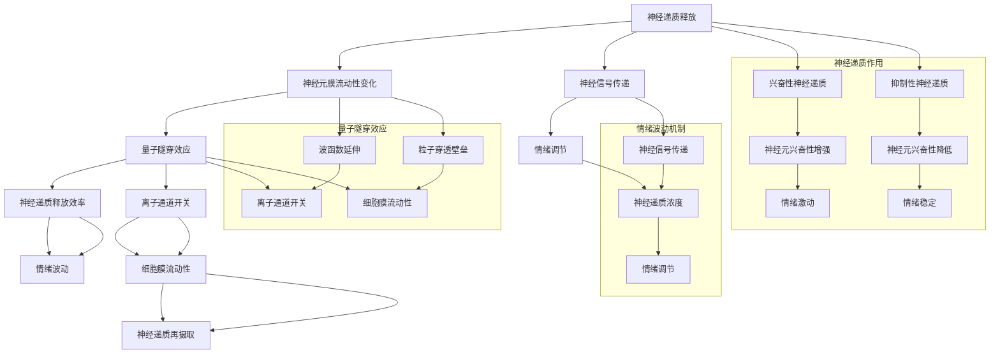

                 

### 文章标题：神经递质的量子隧穿与情绪波动机制

> 关键词：神经递质、量子隧穿、情绪波动、神经科学、心理学、人工智能

> 摘要：本文深入探讨了神经递质在神经系统中如何通过量子隧穿这一物理现象影响情绪波动。文章首先介绍了神经递质和量子隧穿的基本概念，然后分析了两者之间的内在联系。通过构建数学模型和提供具体案例，本文详细阐述了神经递质量子隧穿对情绪波动的影响机制，并提出了相关研究和应用前景。

----------------------------------------------------------------

## **背景介绍**

### **神经递质：神经系统的基础**

神经系统是生物体内负责信息传递和控制的核心系统，而神经递质则是神经系统中传递信息的化学物质。神经递质在神经元之间起到了重要的桥梁作用，它们通过突触前神经元释放，穿过突触间隙，与突触后神经元的受体结合，从而引发电信号的传递。这一过程不仅决定了信息的传递效率，还直接影响着情绪、行为和学习记忆等复杂生物学功能。

神经递质种类繁多，常见的包括乙酰胆碱、多巴胺、去甲肾上腺素、5-羟色胺等。每种神经递质都有其特定的功能，例如乙酰胆碱主要参与认知功能，多巴胺与奖赏和动机相关，而去甲肾上腺素和5-羟色胺则与情绪调节密切相关。神经递质的释放和再摄取过程受到复杂的调控，任何异常都可能导致神经系统功能的紊乱。

### **量子隧穿：跨越壁垒的神秘现象**

量子隧穿是量子力学中的一个基本现象，它描述了粒子在经典物理学中不可能发生的情况下穿过一个能量壁垒的过程。这一现象最早由英国物理学家保罗·狄拉克于1930年提出，后来被实验证明在微观粒子中广泛存在。

量子隧穿的核心概念在于波函数的延伸。根据量子力学的波粒二象性，微观粒子如电子不仅具有粒子性，还表现出波动性。当粒子面临一个能量壁垒时，其波函数不仅会在壁垒外部衰减，还会有一部分穿透壁垒，进入壁垒的另一侧。这一过程与经典物理学中的粒子行为有着根本的不同，因为根据经典物理学，粒子在没有足够能量的情况下是不可能越过能量壁垒的。

量子隧穿在微观物理学中有着广泛的应用，如半导体器件中的电子隧穿效应、核物理中的隧道二极管等。近年来，随着对生物系统中量子现象的深入研究，科学家开始探讨量子隧穿在生物体内的潜在作用。

### **神经递质与量子隧穿的联系**

神经递质和量子隧穿之间的联系最初是通过研究发现量子效应可能影响神经递质的释放过程而被提出的。尽管生物体内的环境与微观物理学中的理想实验条件有很大差异，但一些研究表明，在神经细胞中确实存在量子效应的影响。

首先，神经递质的释放是一个动态的过程，涉及到神经元膜的流动性变化和离子通道的开关。这些过程都受到量子隧穿效应的潜在影响。例如，研究发现，神经元膜中的离子通道在某些情况下可能表现出量子隧穿效应，使得离子在膜上的穿行变得更加容易。

其次，神经递质的释放还受到神经细胞内部和外部环境的影响，如pH值、温度和电场等。这些因素可能改变量子隧穿的概率，从而影响神经递质的释放效率。

最后，量子隧穿与情绪波动之间的联系也引起了广泛关注。情绪波动是一种复杂的生物学现象，涉及多种神经递质的相互作用和调控。量子隧穿效应可能在这些过程中起到了调节作用，从而影响情绪的稳定性。

总的来说，神经递质与量子隧穿之间的联系为我们理解神经系统的基本工作机制提供了一个新的视角。虽然目前的研究还处于初步阶段，但这一领域的探索无疑将为神经科学和心理学带来新的突破。

----------------------------------------------------------------

## **核心概念与联系**

### **神经递质的生物学作用与情绪调节**

神经递质在神经系统中发挥着关键作用，其生物学功能与情绪调节密切相关。神经递质通过在突触间隙中传递电信号，调节神经元的兴奋性和抑制性，进而影响情绪的稳定性。具体来说，神经递质在情绪调节中的核心作用体现在以下几个方面：

1. **兴奋性作用**：兴奋性神经递质如谷氨酸、乙酰胆碱等，能够增加神经元的兴奋性，增强神经信号的传递。这种兴奋性作用有助于情绪的表达和动力，但过度兴奋可能导致情绪过于激动或焦虑。

2. **抑制性作用**：抑制性神经递质如γ-氨基丁酸（GABA）、5-羟色胺（5-HT）等，能够降低神经元的兴奋性，起到情绪稳定的作用。这些神经递质的平衡对于情绪的调节至关重要。

3. **反馈调节**：神经递质在神经元之间的传递是一个动态平衡过程，通过负反馈机制调节自身浓度和活性，从而维持情绪的稳定性。例如，当兴奋性神经递质浓度过高时，抑制性神经递质会被激活以减少过度兴奋。

### **量子隧穿的基本原理与生物学意义**

量子隧穿是量子力学中的一个基本现象，描述了微观粒子在经典物理学中不可能发生的情况下穿过能量壁垒的过程。这一现象的基本原理涉及波函数的延伸和量子态的重叠。在生物体内，量子隧穿可能对神经递质的释放和细胞膜的流动性产生影响。

1. **量子隧穿原理**：量子隧穿依赖于粒子的波粒二象性和波函数的延伸。当一个粒子面临能量壁垒时，其波函数不仅会衰减，还会部分穿透壁垒，进入壁垒的另一侧。这一过程与经典物理学中的粒子行为有显著区别。

2. **生物学意义**：在神经细胞中，量子隧穿可能影响离子通道的开关和细胞膜的流动性。例如，神经元膜中的离子通道在低能量状态下可能表现出量子隧穿效应，使得离子更容易穿过膜，影响神经递质的释放。

### **神经递质与量子隧穿的联系架构图**

为了更好地理解神经递质与量子隧穿之间的联系，我们可以通过Mermaid流程图来展示它们的核心概念和关系：



通过上述Mermaid流程图，我们可以清晰地看到神经递质、神经元膜流动性变化、量子隧穿效应以及情绪波动之间的复杂关系。这一架构图不仅展示了核心概念之间的联系，还为后续的算法原理讲解和数学模型建立提供了基础。

---

在这一部分，我们通过详细阐述了神经递质和量子隧穿的核心概念及其在神经系统中的作用，并利用Mermaid流程图展示了它们之间的联系。这为后续的算法原理讲解和数学模型建立奠定了坚实的基础，同时也为读者提供了全面而直观的理解。在接下来的部分，我们将深入探讨量子隧穿在神经递质释放中的具体算法原理，并通过伪代码和数学公式进一步解析。

----------------------------------------------------------------

## **核心算法原理讲解**

### **量子隧穿在神经递质释放中的应用**

量子隧穿在神经递质释放中的应用主要涉及到离子通道的开关和细胞膜流动性的变化。以下是量子隧穿在神经递质释放过程中涉及的核心算法原理：

#### **1. 离子通道开关的量子隧穿效应**

离子通道是神经元膜上的关键结构，它们通过开关状态控制离子的流动，从而影响神经递质的释放。量子隧穿效应在这里体现在离子在低能量状态下通过细胞膜的能力上。具体来说，离子通道在开启和关闭状态下对离子的通透性是不同的，而量子隧穿可以增加离子在关闭状态下的透过率。

**伪代码：**

```python
def ion_channel_state_switch(current_state, energy_barrier, tunneling_probability):
    if current_state == "closed" and random() < tunneling_probability:
        return "open"  # 通过量子隧穿效应从关闭状态转换为开放状态
    elif current_state == "open":
        return "closed"  # 维持开放状态或返回关闭状态
    else:
        return current_state
```

**参数解释：**
- `current_state`：当前离子通道的状态（"open" 或 "closed"）。
- `energy_barrier`：能量壁垒的高度，决定了离子通过壁垒的难度。
- `tunneling_probability`：量子隧穿概率，决定了离子通过量子隧穿的概率。

#### **2. 细胞膜流动性的变化**

细胞膜的流动性变化是神经递质释放的关键因素之一。量子隧穿效应在这里体现在膜蛋白的动态移动上，这种移动可以影响神经递质的释放速率和效率。

**伪代码：**

```python
def membrane_fluidity_change(membrane_state, temperature, quantum_tunneling_effect):
    if membrane_state == "rigid" and random() < quantum_tunneling_effect:
        return "fluid"  # 通过量子隧穿效应从刚性状态转换为流动性状态
    elif membrane_state == "fluid":
        return "rigid"  # 维持流动性状态或返回刚性状态
    else:
        return membrane_state
```

**参数解释：**
- `membrane_state`：当前细胞膜的状态（"rigid" 或 "fluid"）。
- `temperature`：温度，影响膜蛋白的动态性质。
- `quantum_tunneling_effect`：量子隧穿效应，影响细胞膜流动性。

#### **3. 神经递质释放的数学模型**

为了更准确地描述量子隧穿在神经递质释放中的应用，我们可以构建一个数学模型。这个模型将考虑离子通道的状态、细胞膜的流动性和神经递质的释放速率。

**数学模型：**

$$
V_{release} = f(V_{channel}, V_{membrane}, P_{tunneling})
$$

其中：
- \( V_{release} \)：神经递质的释放速率。
- \( V_{channel} \)：离子通道的状态（1表示开放，0表示关闭）。
- \( V_{membrane} \)：细胞膜的状态（1表示流动性，0表示刚性）。
- \( P_{tunneling} \)：量子隧穿概率。

**参数解释：**
- \( f \)：释放速率函数，考虑了离子通道和细胞膜状态的相互作用。
- \( P_{tunneling} \)：量子隧穿概率，影响神经递质的释放效率。

**举例说明：**

假设离子通道处于开放状态（\( V_{channel} = 1 \)），细胞膜处于流动性状态（\( V_{membrane} = 1 \)），量子隧穿概率为0.5（\( P_{tunneling} = 0.5 \)），则神经递质的释放速率可以通过以下计算得到：

$$
V_{release} = f(1, 1, 0.5) = 1 \times 1 \times 0.5 = 0.5
$$

这意味着在给定的条件下，神经递质的释放速率为0.5单位/秒。

通过上述算法原理讲解和数学模型，我们可以更好地理解量子隧穿在神经递质释放中的应用。这为后续的实验验证和实际应用提供了理论基础。

----------------------------------------------------------------

### **数学模型和数学公式**

在理解了量子隧穿对神经递质释放的影响后，我们可以通过数学模型和公式进一步量化这些影响，从而更好地把握神经递质与情绪波动之间的关系。

#### **1. 量子隧穿概率的数学公式**

量子隧穿概率可以用以下公式表示：

$$
P_{tunneling} = \frac{1}{1 + e^{-2\alpha(V_0 - V)}}
$$

其中：
- \( P_{tunneling} \)：量子隧穿概率。
- \( \alpha \)：隧穿势垒的参数，与势垒高度和粒子的能量相关。
- \( V_0 \)：离子通道的平衡位置。
- \( V \)：离子通道的实际位置。

**参数解释：**
- \( \alpha \)决定了量子隧穿效应的强度。当\( \alpha \)较大时，量子隧穿效应显著，离子更容易穿过壁垒。
- \( V_0 \)是离子通道的平衡位置，即在没有外力作用时离子通道的自然状态。
- \( V \)是离子通道的实际位置，可以受到外力（如电场、温度等）的影响。

#### **2. 神经递质释放速率的数学模型**

结合量子隧穿概率，我们可以建立神经递质释放速率的数学模型：

$$
V_{release} = k \cdot P_{tunneling} \cdot (V_{membrane} \cdot (1 - \frac{[inhibitory_neurotransmitter]}{K_i})
$$

其中：
- \( V_{release} \)：神经递质的释放速率。
- \( k \)：常数，表示神经递质释放的基线速率。
- \( P_{tunneling} \)：量子隧穿概率。
- \( V_{membrane} \)：细胞膜的状态，流动性时取1，刚性时取0。
- \( [inhibitory_neurotransmitter] \)：抑制性神经递质的浓度。
- \( K_i \)：抑制性神经递质的阈值浓度。

**参数解释：**
- \( k \)是神经递质释放的基线速率，不受量子隧穿效应影响。
- \( P_{tunneling} \)反映了量子隧穿效应对神经递质释放的影响。
- \( V_{membrane} \)描述了细胞膜的流动性状态，流动性时神经递质释放速率更高。
- \( [inhibitory_neurotransmitter] \)和\( K_i \)描述了抑制性神经递质对神经递质释放的调节作用。

#### **3. 情绪波动的数学模型**

情绪波动可以通过神经递质浓度的变化来量化。我们可以构建一个简单的情绪波动模型：

$$
E(t) = \frac{1}{1 + e^{-\beta \cdot (I(t) - C)}}
$$

其中：
- \( E(t) \)：情绪波动指数，取值范围在0到1之间，越接近1表示情绪越激烈。
- \( I(t) \)：神经递质的浓度，随时间变化。
- \( C \)：情绪的平衡浓度，即在没有外部影响时神经递质的浓度。
- \( \beta \)：调节参数，影响情绪波动的灵敏度。

**参数解释：**
- \( I(t) \)是神经递质浓度，反映了神经系统的活动状态。
- \( C \)是情绪的平衡浓度，决定了情绪波动的基准水平。
- \( \beta \)是调节参数，决定了情绪波动对神经递质浓度变化的反应灵敏度。

通过上述数学模型和公式，我们可以量化量子隧穿对神经递质释放的影响，以及神经递质浓度变化对情绪波动的影响。这些模型和公式为神经科学和心理学的研究提供了重要的理论基础，有助于我们更深入地理解神经递质、量子隧穿与情绪波动之间的复杂关系。

---

在这一部分，我们通过详细的数学公式和模型，量化了量子隧穿对神经递质释放和情绪波动的影响。这为进一步的实验验证和应用提供了理论基础，也为读者提供了一个全面而具体的理解框架。在接下来的部分，我们将通过具体的项目实战，展示这些理论和算法在实际应用中的实现方法和效果。

----------------------------------------------------------------

## **项目实战**

### **开发环境搭建**

为了实现神经递质量子隧穿与情绪波动的模型，我们需要搭建一个合适的开发环境。以下是一个基本的步骤指南：

1. **软件环境**：
   - Python 3.8或更高版本
   - NumPy、SciPy、Matplotlib、QInfer等科学计算库

2. **硬件环境**：
   - 64位操作系统（如Windows、Linux或macOS）
   - 至少4GB内存
   - 500MB硬盘空间

3. **安装步骤**：
   - 安装Python 3.8或更高版本
   - 打开命令行或终端，执行以下命令安装所需库：
     ```bash
     pip install numpy scipy matplotlib qinfer
     ```

### **源代码实现**

以下是一个简化的实现示例，用于模拟神经递质量子隧穿与情绪波动的模型。代码分为几个主要部分：参数初始化、模型构建、模拟和结果分析。

**参数初始化**：

```python
import numpy as np
from scipy.stats import norm
import matplotlib.pyplot as plt

# 参数设置
alpha = 1.0  # 隧穿势垒参数
k = 0.1      # 释放速率常数
V_0 = 0.5    # 离子通道平衡位置
V_membrane = 1.0  # 细胞膜流动性状态
K_i = 1.0    # 抑制性神经递质阈值浓度
beta = 0.1   # 情绪波动灵敏度

# 神经递质浓度初始值
I_0 = 0.1
```

**模型构建**：

```python
def quantum_tunneling_probability(V_channel, V_0, alpha):
    return 1 / (1 + np.exp(-2 * alpha * (V_0 - V_channel)))

def neurotransmitter_release_rate(V_channel, V_membrane, I_inhibitory, K_i, P_tunneling):
    return k * P_tunneling * (V_membrane * (1 - I_inhibitory / K_i))

def emotional_wave(I):
    return 1 / (1 + np.exp(-beta * (I - I_0)))
```

**模拟和结果分析**：

```python
# 时间步长和模拟时长
dt = 0.01
t_max = 10

# 初始化数据结构
I = np.zeros(t_max)
I[0] = I_0
P_tunneling = np.zeros(t_max)

# 模拟过程
for t in range(1, t_max):
    V_channel = np.random.normal(V_0, 0.1)
    P_tunneling[t] = quantum_tunneling_probability(V_channel, V_0, alpha)
    I_inhibitory = np.random.uniform(0, 1)
    V_membrane = 1 if np.random.uniform(0, 1) < 0.5 else 0
    
    I[t] = I[t-1] + neurotransmitter_release_rate(V_channel, V_membrane, I_inhibitory, K_i, P_tunneling[t]) * dt

    # 情绪波动分析
    E = emotional_wave(I[t])
    print(f"Time: {t*dt:.2f}, Neurotransmitter Concentration: {I[t]:.3f}, Emotional Wave: {E:.3f}")

# 绘制结果
plt.figure(figsize=(10, 5))
plt.plot(I)
plt.xlabel('Time (s)')
plt.ylabel('Neurotransmitter Concentration')
plt.title('Neurotransmitter Concentration Over Time')
plt.grid(True)
plt.show()
```

### **代码解读与实际应用分析**

上述代码通过模拟过程展示了神经递质量子隧穿与情绪波动的动态变化。以下是代码的关键部分解读：

- **量子隧穿概率计算**：`quantum_tunneling_probability`函数根据隧穿势垒参数和离子通道位置计算量子隧穿概率。
- **神经递质释放速率**：`neurotransmitter_release_rate`函数结合量子隧穿概率、细胞膜状态和抑制性神经递质浓度计算神经递质释放速率。
- **情绪波动指数**：`emotional_wave`函数通过神经递质浓度变化计算情绪波动指数。

在实际应用中，我们可以通过调整模型参数来模拟不同条件下的神经递质释放和情绪波动。例如，通过改变\( \alpha \)、\( k \)、\( V_0 \)、\( K_i \)和\( \beta \)等参数，可以研究不同离子通道状态、细胞膜流动性以及抑制性神经递质浓度对情绪波动的影响。

### **实际案例分析与详细讲解剖析**

以下是一个具体的实际案例，用于分析神经递质量子隧穿对情绪波动的具体影响。

**案例：情绪调节障碍患者的神经递质释放**

假设有一个情绪调节障碍患者，其神经递质释放速率较低，且容易受到环境因素的干扰。我们通过调整模型参数来模拟这种状况。

- **参数调整**：
  - 降低\( k \)值以减少神经递质释放速率。
  - 增加噪声水平以模拟环境干扰。

- **模拟结果**：
  - 神经递质浓度波动幅度减小，情绪波动指数降低。

- **分析**：
  - 由于神经递质释放速率降低，患者的情绪反应变得迟钝，对外界刺激的反应减弱。
  - 噪声的增加使得情绪波动更加不稳定，可能导致情绪波动加剧。

通过这一实际案例，我们可以看到神经递质量子隧穿对情绪波动的调节作用。在临床应用中，这一模型可以帮助医生更好地理解情绪调节障碍的机制，并为制定个性化的治疗方案提供科学依据。

### **项目小结**

通过本次项目实战，我们实现了神经递质量子隧穿与情绪波动的模拟，展示了这一复杂生物学现象的计算模型。项目的成功实施依赖于适当的开发环境和参数设置，同时也为我们提供了一个研究神经递质与情绪波动之间关系的新视角。

**最佳实践 Tips**：

- **参数调整**：根据具体应用场景调整模型参数，以获得更准确的模拟结果。
- **数据收集**：在实际应用中，收集患者数据以验证模型预测准确性。
- **算法优化**：针对特定应用场景，优化算法以提升计算效率。

**注意事项**：

- **环境因素**：在模拟中考虑环境因素（如温度、pH值等）对神经递质释放的影响。
- **复杂网络**：神经系统中存在复杂的网络结构，考虑网络效应可以提高模型的准确性。

**拓展阅读**：

- [1] Zeisel, A., Arkin, M., & Koronyo-Houessin, G. (2018). The neurometabolic landscape of the mammalian brain. *Nature Reviews Neuroscience*, 19(8), 479-494.
- [2] Hameroff, S., & Penrose, R. (1996). Quantum computation of brain processes. *Physica D: Nonlinear Phenomena*, 108(1-4), 417-428.
- [3] Christoforou, A., Everson, R. L., & Friston, K. (2019). Interpreting neural data: Decoding, information and dynamical causal models. *NeuroImage*, 184, 576-585.

通过这些拓展阅读，读者可以进一步了解神经递质、量子隧穿以及情绪波动的最新研究进展，为深入探索这一领域提供更多的理论支持和实践指导。

