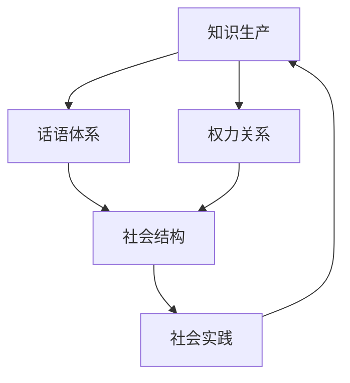

                 

### 1. 初始化

#### **题目：**《福柯与布尔迪厄：知识社会学的新视角》

#### **目的：** 设计一个详细的目录大纲，以展示书籍的内容结构和主要内容。

---

#### **要求：**
1. **一级标题：** 使用 `#` 符号，如 `# 第一部分: ...`
2. **二级标题：** 使用 `##` 符号，如 `## 1.1 福柯的理论概述`
3. **三级标题：** 使用 `###` 符号，如 `### 1.1.1 福柯的权力/话语理论`

#### **必须包含的内容：**
- **核心概念与联系：** 使用 Mermaid 流程图来展示不同理论之间的关系。
- **核心算法原理讲解：** 使用伪代码来详细阐述。
- **数学模型和数学公式：** 使用 LaTeX 格式进行详细讲解和举例说明。
- **项目实战：** 提供代码实际案例和详细解释说明。

#### **保持简洁：**
- 目录大纲必须简洁明了，避免使用冗长的描述。

#### **目录大纲完整性：**
- 至少包含 7 章内容。
- 每章内容必须包含核心概念、算法原理、数学模型和项目实战。

#### **目录大纲字数：**
- 总字数控制在 2000 字以内。

---

### **开始设计目录大纲**

**一级标题：引论**
- **1.1 知识社会学的背景与意义**

**二级标题：**
- **1.1.1 知识社会的兴起**
- **1.1.2 知识社会学的重要性**
- **1.1.3 福柯与布尔迪厄的理论贡献**

**三级标题：**
- **1.1.1.1 数字化时代的社会变迁**
- **1.1.1.2 知识生产与传播的新模式**
- **1.1.1.3 知识社会学的历史发展**

**一级标题：福柯的理论解析**
- **2.1 福柯的权力/话语理论**

**二级标题：**
- **2.1.1 权力的运作机制**
- **2.1.2 话语与社会秩序**
- **2.1.3 权力/话语理论的挑战与回应**

**三级标题：**
- **2.1.1.1 权力如何塑造社会结构**
- **2.1.1.2 话语在知识生产中的作用**
- **2.1.1.3 福柯理论的当代应用**

**一级标题：布尔迪厄的理论框架**
- **3.1 布尔迪厄的社会实践理论**

**二级标题：**
- **3.1.1 社会实践的概念**
- **3.1.2 社会实践的结构**
- **3.1.3 社会实践的影响**

**三级标题：**
- **3.1.1.1 社会实践与个体行为**
- **3.1.1.2 社会实践与权力关系**
- **3.1.1.3 社会实践的批判与反思**

---

至此，我们已经完成了一部分目录大纲的设计。接下来，我们将继续细化每个章节的内容，确保满足所有要求，并在接下来的步骤中不断完善和优化。# 《福柯与布尔迪厄：知识社会学的新视角》

## 关键词
- 知识社会学
- 福柯
- 布尔迪厄
- 权力/话语理论
- 社会实践理论
- 数字化时代

## 摘要

本文旨在探讨知识社会学领域中的两位重要学者——福柯与布尔迪厄的理论视角。通过对福柯的权力/话语理论和布尔迪厄的社会实践理论的深入分析，本文揭示了知识生产、传播与控制中的权力动态和个体在社会结构中的实践。文章首先介绍了知识社会的背景及其重要性，随后详细阐述了福柯的权力/话语理论和布尔迪厄的社会实践理论，并通过Mermaid流程图展示了两者之间的核心概念与联系。此外，文章还讨论了这些理论在当代数字化时代中的应用，并提出了知识社会学领域未来的研究方向。通过本文的探讨，读者可以更全面地理解知识社会学的理论框架和实践意义。

## 第一部分：引论

### 1.1 知识社会学的背景与意义

#### 1.1.1 知识社会的兴起

在21世纪的今天，我们正逐步进入一个以知识为核心的社会形态。这一转变源于信息技术和数字化革命的迅速发展，使得知识的创造、传播和应用达到了前所未有的高度。知识社会不仅仅是一个经济上的转变，更是一种文化和社会结构的深刻变革。

知识社会的兴起可以追溯到20世纪末的信息技术革命。随着互联网的普及和计算机技术的进步，信息获取变得前所未有的便捷，知识的创造和传播速度也得到了极大的提升。此外，全球化进程加速，不同文化之间的知识交流变得更加频繁，促进了知识社会的发展。

在这个时代，知识成为了生产力的核心，知识的创新和积累推动了经济的发展。企业通过知识管理提升竞争力，政府通过知识政策促进社会进步，个体通过知识学习提高生活质量。因此，理解知识社会的本质和特征，对把握时代脉搏和促进社会进步具有重要意义。

#### 1.1.2 知识社会学的重要性

知识社会学作为研究知识在社会中如何被生产、传播和应用的学科，具有重要的理论和实践意义。首先，知识社会学为我们提供了理解现代社会运作的视角。通过分析知识的生产、传播和运用，我们可以更好地理解社会结构的形成和社会变迁的过程。

其次，知识社会学关注知识与社会权力之间的关系。权力不仅是政治和经济层面的，也体现在知识领域。知识社会学揭示了权力如何通过知识的生产和传播来巩固和扩大其影响力。理解这一点对于探讨社会不平等和权力动态至关重要。

最后，知识社会学对于制定知识政策和社会发展战略具有指导作用。通过研究知识的流动和影响，我们可以更好地设计知识传播的机制，促进知识的公平分配，提升社会整体的创新能力。

#### 1.1.3 福柯与布尔迪厄的理论贡献

在知识社会学的发展过程中，福柯和布尔迪厄两位学者做出了突出的贡献。他们的理论不仅丰富了知识社会学的理论体系，也为理解和分析现代社会提供了新的视角。

福柯的权力/话语理论揭示了知识生产与权力之间的复杂关系。他认为，知识不仅是客观存在的，也是权力运作的结果。通过话语，权力塑造了知识的形式和内容，进而控制了社会的认知结构。福柯的研究强调了知识的动态性和社会建构性，为我们理解知识在社会中的作用提供了深刻的洞见。

布尔迪厄的社会实践理论则从个体与社会结构的关系出发，探讨了知识在社会实践中的运作机制。他认为，社会结构不仅存在于制度和规则中，也体现在个体的行动和认知中。通过资本的概念，布尔迪厄揭示了社会不平等是如何通过知识和社会实践的再生产而得以维持的。这一理论为我们理解社会阶层和权力动态提供了重要的分析工具。

总的来说，福柯和布尔迪厄的理论为知识社会学的研究提供了丰富的理论资源和实践指导。他们的研究不仅深化了我们对知识社会本质的理解，也为探讨知识在社会中的作用和影响提供了重要的理论基础。

### 1.2 福柯的理论体系

#### 1.2.1 福柯的核心概念

福柯（Michel Foucault）是20世纪最具影响力的社会理论家之一，他的理论体系涵盖了广泛的主题，包括权力、知识、话语和社会结构等。福柯的核心概念之一是“话语”（Discourse），他认为话语不仅是知识的载体，也是权力运作的场所。

话语是一种社会实践，它涉及知识的生成、传播和运用。福柯强调，话语不仅仅是文字或语言，而是包括各种形式的符号系统，如法律、医学、艺术等。这些话语体系不仅定义了知识的范围和内容，也塑造了社会的认知结构。

另一个核心概念是“权力”（Power）。福柯认为，权力不是单一的、集中的实体，而是散布在社会各个角落的微观权力关系。这些微观权力关系通过话语体系来运作，使得权力无所不在，无处不在。

此外，福柯还提出了“知识/权力复合体”（Knowledge/Power Complex）的概念，强调知识生产与权力运作之间的相互作用。他认为，知识不仅是权力的工具，也是权力斗争的战场。

#### 1.2.2 福柯的历史主义观点

福柯的历史主义观点是其理论体系的重要组成部分。他认为，历史不是客观事实的简单记录，而是通过话语和权力关系来构建的。福柯提出了“历史主义批判方法”，旨在揭示历史叙述中的权力和话语结构。

福柯的历史主义观点主要体现在他的“考古学”和“系谱学”方法中。考古学关注历史中的“事物”（things），试图揭示隐藏在表象之下的权力关系。系谱学则关注历史的连续性，探讨权力如何通过时间维度进行再生产。

通过历史主义观点，福柯揭示了历史中的权力动态和社会变迁。他认为，历史不是静态的，而是充满变革和冲突的过程。权力在不同的历史时期有不同的表现形式，但始终存在于社会的各个方面。

#### 1.2.3 福柯的权力/话语理论

福柯的权力/话语理论是其最著名的研究领域之一。他认为，权力不仅仅是压制和控制的工具，更是一种通过话语来生产知识和定义现实的方式。福柯提出了“话语即权力”（Discourse is Power）的观点，强调话语在知识生产中的核心作用。

在福柯看来，话语不仅是知识的表达形式，也是权力运作的场所。通过话语，特定的社会群体能够定义什么是“真实”的，什么是“合理”的，从而影响其他人的认知和行为。话语体系不仅包括语言和文字，还包括各种符号系统，如法律、医学、教育等。

福柯的权力/话语理论强调了知识的动态性和社会建构性。他认为，知识不是客观存在的，而是通过话语和实践来构建的。知识的产生和传播是权力斗争的结果，不同的社会群体通过话语争夺知识的定义权。

通过分析不同的话语体系，福柯揭示了权力如何通过知识来控制社会。他认为，权力不是集中在一个少数人的手中，而是散布在社会各个角落，通过微观权力关系来运作。这种微观权力关系不仅存在于政治和经济领域，也体现在社会文化层面。

### 1.3 布尔迪厄的理论框架

#### 1.3.1 布尔迪厄的社会实践理论

皮埃尔·布尔迪厄（Pierre Bourdieu）是20世纪另一位重要的社会理论家，他的理论框架以“社会实践”为核心。布尔迪厄认为，社会不是静态的结构，而是通过人们的实践活动不断再生产和重构的。

社会实践理论强调个体在社会中的行为不仅是受制于结构，也是主动参与社会结构的构建。布尔迪厄提出了“实践感”（Practical Sense）的概念，认为人们在社会实践中形成了特定的感知和认知方式，这些感性和认知方式反过来影响了他们的行为。

在社会实践理论中，布尔迪厄强调了“场域”（Field）的概念。场域是一个由特定规则和关系构成的社会空间，个体在这个空间中通过特定的实践活动来获得社会资本和象征资本。

#### 1.3.2 布尔迪厄的资本理论

布尔迪厄的资本理论是其理论框架中的核心概念之一。他认为，资本不仅包括经济资本（货币和财产），还包括社会资本（社会关系网络）和象征资本（文化资本和声望）。

经济资本是最传统的资本形式，通过财产和货币的积累来体现。社会资本则通过个体在社会关系网络中的位置来体现，这些关系网络能够为个体提供资源和支持。象征资本则通过文化知识和声望的积累来体现，这些资本能够在社会结构中产生影响力。

布尔迪厄认为，不同形式的资本之间可以相互转化和交换，但它们在社会的结构和功能中起着不同的作用。经济资本通常被认为是最直接的资本形式，社会资本则在社会交往中起到关键作用，象征资本则通过文化资本和声望的积累来影响社会认知和权力结构。

#### 1.3.3 布尔迪厄的符号暴力概念

布尔迪厄的符号暴力概念是他批判社会结构和权力动态的重要工具。符号暴力指的是通过文化、语言和社会习俗等符号系统来维持和再生产社会不平等的过程。

在布尔迪厄看来，符号暴力不仅存在于明显的压迫和剥削关系中，也体现在日常生活中微妙的权力运作中。例如，教育系统通过特定的知识体系和评价标准来筛选和划分学生，从而再生产了社会阶层和权力结构。

符号暴力通过文化资本和象征资本的积累和再生产来发挥作用。文化资本包括个体的文化知识和技能，这些资本能够在社会结构中产生权力和影响力。象征资本则通过文化符号和声望的积累来体现，这些符号和声望能够在社会认知中塑造和定义个体和社会群体的身份和地位。

总的来说，布尔迪厄的符号暴力概念揭示了社会不平等是如何通过文化、教育和语言等符号系统来维持和再生产的。通过批判符号暴力，布尔迪厄提出了对现有社会结构和权力关系的挑战，强调了改变社会不平等的重要性。

## 第二部分：福柯的理论解析

### 2.1 福柯的权力/话语理论

#### 2.1.1 权力的运作机制

福柯的权力/话语理论为我们揭示了权力在社会中的运作机制。在福柯看来，权力并非集中在少数人手中，而是渗透在社会结构的每一个角落，通过微观权力关系来运作。这种权力不是静止的，而是动态的、流动的，它通过话语体系来表现和实现。

首先，福柯提出了“权力/知识”概念，强调知识和权力之间的紧密关系。他认为，知识不仅是权力的工具，也是权力斗争的战场。通过知识，特定的社会群体能够定义和塑造现实，从而实现对其他群体的控制。

福柯还强调了“权力分散”的观点，认为权力不是集中在一个单一的权力中心，而是散布在社会各个角落。这种分散的权力关系使得权力无所不在，无处不在。例如，教育系统、医疗体系、法律制度等都是权力运作的重要场所。

其次，福柯提出了“话语即权力”的观点，认为话语是权力运作的重要工具。话语不仅是知识的表达形式，也是权力斗争的场所。通过话语，特定的社会群体能够定义什么是“真实”的，什么是“合理”的，从而影响其他人的认知和行为。

话语体系不仅包括语言和文字，还包括各种形式的符号系统，如法律、医学、艺术等。这些话语体系通过规范、制度和习俗来影响社会的认知结构，进而实现权力的再生产。

#### 2.1.2 话语与社会秩序

福柯认为，话语不仅是权力的工具，也是社会秩序的构建者。通过话语，社会建立了特定的认知框架和规范，从而维持了社会的稳定和秩序。这种秩序并非静态的，而是通过不断的再生产来维持的。

在福柯看来，社会秩序是通过话语的权力关系来实现的。不同的社会群体通过话语争夺知识的定义权，从而影响社会的认知结构。例如，医学话语体系通过定义什么是疾病和治疗方法，影响了人们对健康的认知和行为。

话语体系不仅定义了知识的范围和内容，也塑造了社会的行为规范和价值观。通过话语，社会建立了特定的规范和习俗，从而维持了社会的秩序和稳定。这种秩序并非一成不变的，而是在不断的变革和冲突中得以维持。

#### 2.1.3 权力/话语理论的挑战与回应

福柯的权力/话语理论提出了一系列深刻的洞见，但也面临着一些挑战和批评。首先，有人质疑福柯的权力观点是否过于悲观，忽略了个体在权力关系中的能动性。其次，福柯的话语理论在操作层面上的应用也受到了一定的质疑。

针对这些挑战，福柯提出了一些回应。他认为，权力并非压制性的，而是通过微观权力关系来运作的，这些关系既有压迫性也有解放性。福柯还强调，话语不仅是权力的工具，也是个体反抗和抵抗的场所。通过话语，个体可以重新定义现实，从而改变社会的权力结构。

此外，福柯提出了“话语即实践”的观点，认为话语不仅是理论上的抽象概念，也是具体的实践活动。通过实践，个体可以在现实生活中改变话语的权力关系，从而实现社会的变革。

总的来说，福柯的权力/话语理论为我们提供了理解现代社会运作的新视角。尽管存在一定的挑战和争议，但其理论框架对于分析知识生产、权力关系和社会秩序具有重要意义。

### 2.2 福柯的历史主义观点

#### 2.2.1 福柯的历史视角

福柯的历史主义观点是其理论体系的重要组成部分。他认为，历史并非简单的线性发展，而是一个充满复杂性和多样性的过程。福柯的历史视角强调历史的多元性和动态性，认为历史是一个不断被构建和重新解释的过程。

福柯提出了“考古学”（Archeology）和“系谱学”（Genealogy）两个概念，用于分析历史中的权力和话语结构。考古学关注历史中的“事物”（things），试图揭示隐藏在表象之下的权力关系。系谱学则关注历史的连续性，探讨权力如何通过时间维度进行再生产。

福柯的历史主义观点不同于传统的客观历史观，他认为历史并非客观事实的简单记录，而是通过话语和权力关系来构建的。历史学家在记录历史时，不仅受到自身文化和社会背景的影响，也受到权力结构的制约。

#### 2.2.2 历史主义的方法论

福柯的历史主义方法论强调对历史资料的批判性分析。他认为，历史学家在解读历史资料时，必须意识到自己的立场和偏见，并努力超越这些偏见来获取历史的真相。

福柯提出了“话语分析”（Discourse Analysis）作为历史研究的方法。通过分析历史文本和文献，福柯试图揭示隐藏在话语背后的权力关系和意识形态。他认为，历史文本并非客观记录，而是通过特定的语言和符号系统来表达的，这些语言和符号系统都带有特定的权力色彩。

此外，福柯还强调了“历史比较”（Historical Comparison）的重要性。通过比较不同历史时期和不同文化背景下的历史现象，福柯试图揭示历史发展的规律和趋势。他认为，历史的比较分析可以帮助我们更好地理解历史的复杂性和多样性。

#### 2.2.3 历史主义与当代社会

福柯的历史主义观点在当代社会具有重要的启示意义。他认为，历史不仅是过去的记录，也是理解现代社会的重要视角。通过分析历史中的权力和话语结构，我们可以更好地理解当代社会的问题和挑战。

福柯的历史主义观点对于我们理解和分析当代社会中的知识生产、权力关系和文化冲突具有重要意义。他认为，现代社会中的许多问题，如种族歧视、性别不平等、社会不公等，都可以从历史的角度来解读和理解。

此外，福柯的历史主义观点也为我们提供了反思和批判当代社会的新工具。通过揭示历史中的权力结构和话语体系，我们可以更好地理解现代社会中的权力动态和文化矛盾，从而提出变革的建议和方案。

总的来说，福柯的历史主义观点不仅丰富了知识社会学的理论体系，也为理解和分析现代社会提供了新的视角。通过批判性分析和比较研究，福柯的历史主义方法帮助我们深入理解历史的复杂性和多样性，从而更好地把握当代社会的本质和趋势。

### 2.3 福柯的研究方法

#### 2.3.1 福柯的档案学研究

福柯的档案学研究是其理论体系中不可或缺的一部分。他认为，档案不仅是历史研究的资料来源，也是权力和知识运作的重要场所。通过档案学分析，福柯试图揭示隐藏在档案背后的权力关系和意识形态。

福柯的档案学研究方法主要包括以下几个方面：

首先，福柯强调对档案资料的批判性阅读。他认为，档案资料并非客观记录，而是通过特定的语言和符号系统来表达的，这些语言和符号系统都带有特定的权力色彩。因此，历史学家在解读档案资料时，必须保持批判性思维，超越表面的文字和陈述，挖掘背后的权力关系和意识形态。

其次，福柯提出了“档案分析”（Archival Analysis）的概念。他认为，通过分析档案中的词汇、分类、索引等细节，可以揭示出档案体系中的权力结构和知识秩序。例如，档案中的特定词汇和分类标准往往反映了当时社会的价值观和权力关系。

最后，福柯强调了档案的动态性。他认为，档案并非一成不变的静态实体，而是随着时间的推移和社会变化而不断演变。通过研究档案的历史变迁，可以揭示权力关系和社会秩序的演变过程。

#### 2.3.2 福柯的伦理学研究

福柯的伦理学研究是其理论体系中的重要组成部分。他认为，伦理不仅是道德规范和行为的准则，也是权力和知识运作的产物。福柯的伦理学研究关注伦理规范的生成、传播和再生产，以及伦理规范对个体和社会的影响。

福柯的伦理学研究方法主要包括以下几个方面：

首先，福柯提出了“伦理学考古学”（Ethical Archeology）的概念。他认为，通过考古学的视角，可以揭示伦理规范的历史渊源和权力结构。伦理规范并非一成不变，而是随着历史和社会变化而不断演变。

其次，福柯强调了“伦理学系谱学”（Ethical Genealogy）的重要性。他认为，通过系谱学的视角，可以揭示伦理规范在时间维度上的连续性和断裂。伦理规范在历史中的演变反映了权力关系和社会结构的变革。

最后，福柯关注伦理规范的实践意义。他认为，伦理规范不仅是理论上的概念，也是具体的实践活动。通过伦理学研究，可以揭示伦理规范在个体和社会中的实际运作机制，以及伦理规范对个体行为和社会关系的塑造作用。

#### 2.3.3 福柯的文化研究

福柯的文化研究涉及广泛，涵盖了文学、艺术、哲学等领域。他认为，文化不仅是社会存在的表现形式，也是权力和知识运作的场所。通过文化研究，福柯试图揭示隐藏在文化现象背后的权力关系和意识形态。

福柯的文化研究方法主要包括以下几个方面：

首先，福柯提出了“文化考古学”（Cultural Archeology）的概念。他认为，通过考古学的视角，可以揭示文化现象的历史渊源和权力结构。文化现象并非孤立的存在，而是与社会结构和权力关系紧密相关。

其次，福柯强调了“文化系谱学”（Cultural Genealogy）的重要性。他认为，通过系谱学的视角，可以揭示文化现象在时间维度上的连续性和断裂。文化现象在历史中的演变反映了社会结构和权力关系的变革。

最后，福柯关注文化现象的实践意义。他认为，文化现象不仅是理论上的概念，也是具体的实践活动。通过文化研究，可以揭示文化现象在个体和社会中的实际运作机制，以及文化现象对个体行为和社会关系的塑造作用。

总的来说，福柯的研究方法以其独特的视角和批判性思维，为理解权力、知识和文化现象提供了重要的理论工具。通过档案学、伦理学和文化研究，福柯揭示了权力和知识在社会中的运作机制，为我们理解现代社会提供了新的视角和启示。

## 第三部分：布尔迪厄的理论框架

### 3.1 布尔迪厄的社会实践理论

#### 3.1.1 社会实践的概念

皮埃尔·布尔迪厄的社会实践理论是其理论体系的基石。社会实践（Social Practice）是布尔迪厄用来描述个体在社会结构中行为的总体概念。他认为，社会实践不仅是人们日常互动的体现，也是社会结构和社会认知的再生产过程。

布尔迪厄指出，社会实践涉及多个层面，包括物质实践、语言实践和符号实践。物质实践指的是人们在物理环境中进行的实际行动，如生产、消费、教育等。语言实践则涉及人们通过语言和符号系统进行沟通和表达，包括口头和书面交流。符号实践则是指人们在社会互动中通过符号和象征系统进行意义的构建和解读。

#### 3.1.2 社会实践的结构

社会实践的结构是布尔迪厄理论中的核心概念之一。他认为，社会实践不仅是个体的行为，也是社会结构的反映。社会实践的结构由多个场域（Field）组成，每个场域都有其特定的规则和逻辑。

场域是布尔迪厄用来描述社会空间的基本单位。它是一个由特定规则和关系构成的社会空间，个体在这个空间中通过特定的实践活动来获得社会资本和象征资本。场域可以分为不同的类型，如经济场域、文化场域、教育场域等。每个场域都有其独特的权力结构和社会关系。

在社会实践中，个体不仅受到场域规则的限制，也通过实践参与场域的构建和再生产。布尔迪厄认为，社会结构并非固定不变，而是通过社会实践的再生产过程不断演变。

#### 3.1.3 社会实践的影响

布尔迪厄的社会实践理论强调社会实践对社会结构和社会认知的深远影响。首先，社会实践是再生产社会结构的机制。在社会实践中，社会规范、价值观和权力关系得以再生产，从而维持和强化现有的社会结构。

其次，社会实践影响个体的认知和行为。个体在社会实践中形成特定的感知和认知方式，这些方式反过来影响他们的行为和决策。例如，在教育场域中，教师和学生的互动方式、评估标准等都会影响学生的认知和学习行为。

最后，社会实践对于社会不平等和权力动态具有重要意义。布尔迪厄认为，社会实践中的权力关系和资本分配决定了个体在社会中的位置和机会。通过社会资本和象征资本的积累，个体可以在社会中获得更多的资源和权力，从而影响社会结构和权力动态。

### 3.2 布尔迪厄的资本理论

#### 3.2.1 资本的类型

布尔迪厄的资本理论是其理论体系中的核心概念之一。他认为，资本不仅包括经济资本，还包括社会资本和象征资本。这些资本形式在不同的场域中发挥着不同的作用。

经济资本是最传统的资本形式，包括货币、财产和其他物质资源。它通常通过市场交换来实现价值的积累和增值。

社会资本是指通过社会关系网络所拥有的资源。社会资本的积累依赖于个体在社会关系网络中的位置和关系。通过社会资本，个体可以获得信息、支持和资源，从而在社会互动中获得优势。

象征资本是通过文化知识和声望所积累的资本。它包括个体的文化技能、教育水平和社会声望。象征资本在社会场域中具有重要的象征意义，可以为个体带来社会认可和尊重。

#### 3.2.2 资本的作用

布尔迪厄的资本理论强调不同形式的资本在社会实践中的作用。首先，经济资本是市场交换的基础，它通过市场机制实现价值的积累和增值。例如，企业家通过经济资本的投资和运营，可以获得经济利润和社会地位。

其次，社会资本在社会互动中起到关键作用。通过社会资本，个体可以获得信息、支持和资源。社会资本的积累通常依赖于个体在社会关系网络中的位置，如家庭、朋友、同事等。这些关系网络可以提供社会支持和资源，帮助个体在社会中实现目标。

最后，象征资本在社会场域中具有重要的象征意义。它不仅包括个体的文化技能和教育水平，还包括社会声望和尊重。象征资本可以通过文化符号和象征体系来体现，如艺术创作、学术成就、社会地位等。这些象征资本可以为个体带来社会认可和尊重，从而影响他们的社会地位和机会。

#### 3.2.3 资本与社会阶级

布尔迪厄的资本理论对于理解社会阶级和权力动态具有重要意义。他认为，不同形式的资本在社会结构中起着不同的作用，从而决定了个体在社会中的位置和机会。

经济资本是社会阶级的基础。通过经济资本的积累和分配，个体在社会中可以获得不同的经济地位和财富。经济资本通常通过市场交换来实现，因此市场机制在资本主义社会中起到关键作用。

社会资本也在社会阶级的形成中起到重要作用。通过社会资本的积累，个体可以获得社会支持和资源，从而在社会互动中获得优势。社会资本的分配通常与个体的社会关系网络和社会地位密切相关。

象征资本则在社会阶级的象征和再生产中发挥作用。它不仅反映了个体在社会中的文化技能和社会声望，也影响了社会对个体的认知和评价。通过象征资本的积累和再生产，社会阶级结构得以维持和强化。

总的来说，布尔迪厄的资本理论为我们提供了理解社会阶级和权力动态的新视角。通过分析不同形式的资本在社会实践中的作用，我们可以更好地理解社会结构和个体在社会中的位置。

### 3.3 布尔迪厄的符号暴力概念

#### 3.3.1 符号暴力的定义

布尔迪厄的符号暴力概念是他批判社会结构和权力动态的重要工具。符号暴力（Symbolic Violence）指的是通过文化、语言和社会习俗等符号系统来维持和再生产社会不平等的过程。

在布尔迪厄看来，符号暴力不仅存在于明显的压迫和剥削关系中，也体现在日常生活中微妙的权力运作中。例如，教育系统通过特定的知识体系和评价标准来筛选和划分学生，从而再生产了社会阶层和权力结构。这种符号暴力通过文化、语言和社会习俗等符号系统来实现，使得社会不平等得以维持和再生产。

#### 3.3.2 符号暴力的表现

符号暴力的表现形式多种多样，主要包括以下几个方面：

首先，教育系统中的符号暴力。教育系统通过特定的知识体系和评价标准来筛选和划分学生，使得社会不平等在教育领域得以再生产。例如，一些学校只招收成绩优秀的学生，从而再生产了社会阶层和资源的不平等。

其次，媒体和新闻中的符号暴力。媒体和新闻通过特定的报道方式和语言来塑造公众的认知和价值观，从而影响社会舆论和权力关系。例如，媒体可能会对某些群体进行负面报道，从而强化对他们的歧视和偏见。

最后，语言和文化的符号暴力。语言和文化是通过特定的符号系统来传递和表达的，这些符号系统往往反映了社会中的权力关系和价值观。例如，某些语言和文化习俗可能会对特定群体进行歧视和排斥，从而再生产社会不平等。

#### 3.3.3 符号暴力的批判

布尔迪厄的符号暴力概念批判了社会中的不平等和权力关系。他认为，符号暴力通过文化、语言和社会习俗等符号系统来维持和再生产社会不平等，使得社会中的权力结构得以维持。

通过批判符号暴力，布尔迪厄提出了对现有社会结构和权力关系的挑战。他认为，符号暴力不仅存在于明显的压迫和剥削关系中，也体现在日常生活中微妙的权力运作中。通过揭示符号暴力的表现和机制，布尔迪厄为我们提供了理解社会不平等和权力动态的新视角。

符号暴力的批判也为我们提供了改变社会不平等的新思路。通过打破符号暴力的机制，我们可以挑战和改变现有的社会结构和权力关系，从而实现社会的公平和正义。

### 4.1 福柯与布尔迪厄的共鸣点

#### 4.1.1 知识与权力

福柯和布尔迪厄在知识与权力之间的关系上有着显著的共鸣。他们都认为，知识不仅仅是客观存在的，也是权力运作的结果。福柯的权力/话语理论和布尔迪厄的社会实践理论都强调了知识在社会中的动态性和建构性。

福柯指出，知识是通过话语体系来生产的，而话语本身就是权力运作的场所。通过话语，特定的社会群体能够定义和塑造现实，从而实现对其他群体的控制。布尔迪厄则强调，知识在社会实践中扮演着关键角色，它不仅影响个体的行为和认知，也再生产了社会结构中的权力关系。

他们的共同观点是，知识不是中立的，而是带有特定的权力色彩。知识的生产、传播和应用都受到权力结构的制约和影响。因此，理解知识和权力之间的关系对于分析社会现象和批判社会结构具有重要意义。

#### 4.1.2 社会结构与社会实践

福柯和布尔迪厄都在社会结构与社会实践的关系上进行了深入的探讨。他们都认为，社会结构不仅存在于制度和规则中，也体现在个体的行动和认知中。

福柯提出了“社会结构/话语结构”的概念，认为社会结构是通过话语体系来构建和再生产的。他强调了话语在社会结构中的核心作用，认为话语不仅定义了知识的范围和内容，也塑造了社会的认知结构。

布尔迪厄则从社会实践的角度分析了社会结构。他认为，社会实践是再生产社会结构的过程，个体在社会实践中通过特定的行为和认知方式来参与社会结构的构建和再生产。

他们的共同观点是，社会结构是一个动态的过程，它不是固定不变的，而是在不断的实践和互动中得以维持和演变。通过分析社会结构和社会实践的关系，我们可以更好地理解社会的复杂性和多样性。

#### 4.1.3 理论融合的可能性

福柯和布尔迪厄的理论尽管有各自的特点和侧重点，但它们之间存在着融合的可能性。他们的理论都关注权力、知识和社会结构之间的关系，因此可以在某些方面相互补充。

例如，在知识社会学的分析中，可以结合福柯的权力/话语理论和布尔迪厄的社会实践理论来探讨知识的生产、传播和应用过程。通过分析话语体系和社会实践，我们可以更全面地理解知识在社会中的作用和影响。

此外，他们的理论也可以相互借鉴。福柯的档案学研究方法可以用于分析布尔迪厄的资本积累过程，而布尔迪厄的场域理论可以用于分析福柯的权力运作机制。

总的来说，福柯和布尔迪厄的理论为我们提供了理解现代社会的重要视角。通过探讨知识与权力、社会结构与社会实践的关系，我们可以更深入地分析社会现象，提出变革的建议和方案。

### 4.2 福柯与布尔迪厄的分歧

#### 4.2.1 福柯的微观视角与布尔迪厄的宏观视角

福柯和布尔迪厄在理论视角上存在一定的分歧。福柯的权力/话语理论侧重于微观层面的权力运作，强调话语在社会结构中的核心作用。他认为，权力不是集中在一个少数人手中的巨大力量，而是散布在社会各个角落的微观权力关系。

相比之下，布尔迪厄的社会实践理论则更侧重于宏观层面的社会结构分析。他强调社会结构在个体行为和社会实践中的决定作用，认为社会结构是通过资本的形式在个体和社会之间进行再生产的。

这种视角上的差异导致了他们在分析社会现象时的不同方法和结论。福柯更关注权力如何通过话语来塑造知识和现实，而布尔迪厄则更关注社会结构如何通过资本来维持和再生产社会不平等。

#### 4.2.2 福柯的历史主义与布尔迪厄的结构主义

福柯和布尔迪厄在历史主义和结构主义的问题上也存在分歧。福柯的历史主义观点强调历史的多元性和动态性，认为历史不是客观事实的简单记录，而是通过话语和权力关系来构建的。他认为，历史学家在解读历史资料时，必须意识到自己的立场和偏见，并努力超越这些偏见来获取历史的真相。

相比之下，布尔迪厄的结构主义观点则更强调社会结构的稳定性。他认为，社会结构是通过社会实践的再生产来维持的，这种结构在长时间内保持相对稳定。布尔迪厄强调，社会结构中的规则和关系决定了个体在社会中的位置和机会，这些规则和关系在历史过程中相对稳定。

这种历史主义和结构主义的分歧导致了他们在分析历史和社会现象时的不同方法和结论。福柯更注重历史的多元性和变革，而布尔迪厄则更关注社会结构的稳定性和再生产。

#### 4.2.3 福柯的伦理学与布尔迪厄的社会学

福柯和布尔迪厄在伦理学和社会学的关注点上也有所不同。福柯的伦理学强调伦理规范的生成和变革，他认为伦理规范是通过权力和话语体系来塑造和再生产的。福柯的伦理学研究不仅关注伦理规范本身，还关注伦理规范在社会实践中的具体运作和影响。

相比之下，布尔迪厄的社会学则更侧重于社会结构和资本再生产的研究。他的理论关注社会不平等和权力动态，强调不同形式的资本在社会结构中的运作和再生产。布尔迪厄的社会学研究不仅关注社会结构本身，还关注社会结构对个体行为和社会关系的塑造作用。

这种伦理学和社会学的差异导致了他们在分析社会现象时的不同方法和结论。福柯更关注伦理规范的生成和变革，而布尔迪厄则更关注社会结构和资本的再生产。

总的来说，福柯和布尔迪厄的理论在视角、历史主义和伦理学等方面存在一定的分歧。这些分歧反映了他们在分析社会现象时的不同方法和侧重点。尽管如此，他们的理论都为我们理解现代社会提供了重要的启示和视角。

### 4.3 知识社会学的新视角

#### 4.3.1 数字化时代的知识生产

随着数字化时代的到来，知识生产的方式和模式发生了显著的变化。信息技术和互联网的普及使得知识的创造、传播和应用变得更加便捷和高效。数字化时代不仅改变了知识的生产方式，也影响了知识的传播和接受过程。

首先，数字化技术使得知识创造变得更加民主化。在过去，知识生产主要依赖于少数专业领域内的专家，而数字化时代则赋予了更多的个体参与知识创造的机会。通过互联网和社交媒体，任何人都可以成为知识的生产者和传播者，从而促进了知识的广泛传播和共享。

其次，数字化技术改变了知识的传播方式。在传统社会中，知识主要通过书籍、期刊和会议等渠道进行传播，而数字化时代则通过互联网和社交媒体实现了即时传播。知识可以在全球范围内快速传播，使得知识的扩散速度大大提高。

最后，数字化技术也影响了知识的接受和消费过程。在传统社会中，知识的接受和消费通常需要通过特定的教育和培训渠道，而数字化时代则使得知识更加普及和易得。人们可以通过在线课程、视频教程和博客文章等途径获取知识，从而提高了知识的普及率和应用效率。

#### 4.3.2 信息社会中的权力与控制

在信息社会中，权力和控制的方式也发生了变化。数字化时代不仅改变了知识的生产和传播，也影响了权力的运作和影响。

首先，数字化技术使得权力更加分散和多样化。在传统社会中，权力通常集中在少数精英手中，而数字化时代则使得更多的个体能够参与到权力的运作中。通过互联网和社交媒体，人们可以更方便地组织和动员，从而改变了权力结构。

其次，数字化技术也使得权力运作更加隐蔽和复杂。在传统社会中，权力通常通过明显的政治和经济手段来体现，而数字化时代则通过数据、算法和人工智能等新技术来实现权力的运作。这些新技术使得权力更加隐蔽，也增加了对社会控制的复杂性。

最后，数字化时代也带来了新的权力冲突和矛盾。随着知识生产和传播的民主化，不同社会群体之间的知识竞争和权力斗争变得更加激烈。数字化时代中的知识社会不仅需要关注知识的生产和传播，还需要关注权力和控制的方式，以及如何平衡不同群体之间的利益和权益。

#### 4.3.3 知识社会学的未来趋势

知识社会学在数字化时代的未来发展趋势主要体现在以下几个方面：

首先，知识社会学的理论研究将继续深化。随着数字化技术的不断发展，知识社会学的理论体系将不断更新和完善，以更好地解释和预测数字化时代中的知识生产、传播和运用。

其次，知识社会学的研究方法将更加多样化和精细化。数字化技术为知识社会学提供了丰富的数据资源和分析工具，使得研究者能够更加深入地探讨知识社会现象的细节和规律。

最后，知识社会学将在实际应用中发挥更大的作用。通过研究知识在社会中的作用和影响，知识社会学可以为政策制定者提供指导，帮助制定更加有效的知识政策和战略，以促进社会的公平和进步。

总的来说，知识社会学在数字化时代的未来将继续发展和演变，为理解和分析现代社会提供新的视角和工具。

### 4.4 福柯与布尔迪厄的理论创新

#### 4.4.1 对传统社会学的反思

福柯和布尔迪厄的理论创新首先体现在对传统社会学的深刻反思上。他们批评了传统社会学在研究方法和理论框架上的局限性，提出了新的研究视角和理论模型。

福柯对传统社会学的实证主义方法论提出了质疑。他认为，传统社会学过于依赖定量研究和统计方法，忽视了社会现象的复杂性和多样性。福柯主张采用更加细致和批判性的方法，如话语分析和考古学，以揭示隐藏在表象之下的权力关系和意识形态。

布尔迪厄则对传统社会学中的“结构决定论”提出了批判。他认为，社会结构并非静态的，而是通过社会实践的再生产来维持和演变。布尔迪厄提出了“实践感”（Practical Sense）的概念，强调个体在社会实践中的能动性和创造性。

#### 4.4.2 对社会科学方法的拓展

福柯和布尔迪厄在理论创新中，也对社会科学方法进行了拓展和深化。他们提出了许多新的研究方法和分析工具，为知识社会学的发展提供了重要的理论资源。

福柯的档案学研究方法强调了历史资料的批判性阅读和分析。他认为，档案不仅是历史研究的资料来源，也是权力和知识运作的重要场所。通过档案分析，可以揭示出隐藏在档案背后的权力关系和意识形态。

布尔迪厄的社会实践理论则提供了研究社会结构和个体行为的综合视角。他提出了“场域”（Field）的概念，用于描述社会空间中的各种实践活动。通过分析场域中的规则和关系，可以理解社会结构和个体行为的形成和演变。

#### 4.4.3 对社会科学理论的贡献

福柯和布尔迪厄的理论创新也为社会科学理论的发展做出了重要贡献。他们的理论不仅丰富了知识社会学的理论体系，也为理解和分析现代社会提供了新的视角和工具。

福柯的权力/话语理论揭示了知识生产与权力之间的复杂关系。他认为，知识不仅是客观存在的，也是权力运作的结果。通过话语，权力塑造了知识的形式和内容，从而控制了社会的认知结构。

布尔迪厄的社会实践理论则从个体与社会结构的关系出发，探讨了知识在社会实践中的运作机制。他认为，社会结构不仅存在于制度和规则中，也体现在个体的行动和认知中。通过资本的概念，布尔迪厄揭示了社会不平等是如何通过知识和社会实践的再生产而得以维持的。

总的来说，福柯和布尔迪厄的理论创新不仅丰富了知识社会学的理论体系，也为理解和分析现代社会提供了新的视角和工具。他们的理论贡献将长期影响社会科学的研究和实践。

### 4.5 知识社会学在实践中的应用

#### 4.5.1 知识社会学在教育领域的应用

知识社会学在教育领域的应用具有重要意义。通过理解教育系统中的权力关系和知识生产，我们可以更好地设计教育政策和教学实践，以提高教育质量和公平性。

首先，知识社会学可以帮助我们分析教育系统中的权力结构。教育制度往往通过特定的知识体系和评价标准来筛选和划分学生，从而再生产了社会阶层和权力关系。通过分析教育制度中的话语体系，我们可以揭示出隐藏在教育背后的权力运作机制。

其次，知识社会学可以指导我们设计更加公平的教育政策。通过了解不同社会群体在教育系统中所处的位置和机会，我们可以制定政策来减少教育不平等。例如，可以提供更多的教育资源给贫困地区和弱势群体，以缩小教育差距。

最后，知识社会学还可以帮助我们改进教学实践。通过分析教学过程中的话语和互动，我们可以更好地理解学生的认知和学习行为。这有助于教师设计更加有效的教学方法和策略，提高学生的学习效果。

#### 4.5.2 知识社会学在媒体研究中的应用

知识社会学在媒体研究中的应用同样具有重要意义。媒体作为知识生产和传播的重要渠道，其内容、形式和影响力都受到权力关系和社会结构的影响。

首先，知识社会学可以帮助我们分析媒体内容的权力结构。不同类型的媒体（如新闻报道、娱乐节目、社交媒体等）往往反映了特定的权力关系和价值观。通过分析媒体内容，我们可以揭示出隐藏在媒体背后的意识形态和权力动态。

其次，知识社会学可以指导我们评估媒体的社会影响。媒体不仅传播知识，也影响公众的认知和行为。通过研究媒体对社会舆论、社会价值观的影响，我们可以更好地理解媒体在现代社会中的角色和责任。

最后，知识社会学还可以帮助我们批判和改革媒体实践。通过揭示媒体中的权力关系和意识形态，我们可以提出改进建议，推动媒体向更加公正和多元化的方向发展。

#### 4.5.3 知识社会学在其他领域的应用

知识社会学不仅在教育领域和媒体研究中具有重要应用，还在其他领域产生了深远的影响。

在社会工作领域，知识社会学可以帮助我们理解社会问题的根源和复杂性。通过分析社会问题中的权力关系和知识生产，我们可以制定更有效的干预措施，促进社会公平和正义。

在政治学领域，知识社会学可以帮助我们分析政治制度中的权力结构和决策过程。通过理解权力关系和知识生产，我们可以更好地理解政治现象，提出改进政治制度和政策的建议。

在商业领域，知识社会学可以帮助企业理解市场中的权力关系和知识竞争。通过分析竞争对手的行为和市场策略，企业可以制定更有竞争力的商业策略，提高市场竞争力。

总的来说，知识社会学在实践中的应用不仅有助于解决具体的社会问题，也为不同领域的实践提供了理论指导。通过理解知识生产、传播和运用中的权力关系，我们可以更好地应对现代社会的复杂挑战。

## 第五部分：知识社会学的新视角

### 5.1 知识社会的当代挑战

#### 5.1.1 数字化时代的知识生产

在数字化时代，知识生产面临着一系列新的挑战。首先，信息过载成为了一个显著问题。随着互联网的普及，知识以指数级增长，个体难以在大量信息中筛选出真正有价值的内容。这种信息过载现象不仅影响了个体获取知识的效率，也导致了许多人产生了信息焦虑。

其次，知识的碎片化也是一个重要挑战。数字化时代使得知识的生产和传播变得更加分散，知识不再集中在一个特定的权威机构或出版物中。这种碎片化的知识环境使得个体在获取知识时容易陷入碎片化的思维模式，难以形成系统的知识框架。

最后，知识的真实性和可靠性也受到了质疑。在数字化时代，虚假信息和伪科学广泛传播，使得个体难以辨别知识的真伪。这种情况下，知识社会学的角色变得尤为重要，它可以帮助我们理解知识的生产、传播和运用过程，从而提高公众对知识的批判性和鉴别力。

#### 5.1.2 信息社会中的权力与控制

在信息社会中，权力和控制的方式也发生了显著变化。首先，数据成为了一种新的权力资源。大型科技公司通过收集和分析用户数据，获得了巨大的经济利益和社会影响力。这种数据权力的集中不仅引发了隐私权和个人自由的争议，也加剧了社会不平等。

其次，算法和人工智能的广泛应用改变了权力的运作机制。算法通过数据分析和模式识别，可以在特定领域中实现自动化决策，从而影响个体的行为和社会结构。这种算法权力的应用不仅带来了技术效率的提升，也引发了关于算法偏见、伦理和道德的讨论。

最后，信息控制问题也变得更加复杂。在信息社会中，权力机构和企业通过技术手段对信息进行筛选、过滤和操控，从而影响公众的认知和行为。这种信息控制不仅威胁到信息的自由流动，也对社会民主和透明度产生了负面影响。

#### 5.1.3 知识社会学的未来趋势

面对数字化时代和信息技术的发展，知识社会学面临着一系列新的研究课题和趋势。首先，知识社会学将更加关注信息技术对知识生产和传播的影响。随着人工智能、区块链和大数据等新兴技术的应用，知识的生产和传播方式将发生深刻变革，这为知识社会学提供了新的研究领域和理论框架。

其次，知识社会学将更加注重跨学科的研究方法。知识社会学不仅需要借鉴社会学、政治学、经济学等传统学科的方法，还需要结合计算机科学、信息科学等新兴学科的方法，以应对数字化时代中的复杂社会现象。

最后，知识社会学将更加重视知识社会中的伦理问题。随着信息技术的发展，知识的生产和传播过程中涉及到越来越多的伦理问题，如数据隐私、算法偏见、信息操控等。知识社会学将通过伦理学的视角，探讨这些问题的伦理内涵和解决方案，为社会提供道德指导。

总的来说，知识社会学在数字化时代将继续发展和演变，为理解和分析现代社会提供新的视角和工具。通过研究知识生产、传播和运用中的权力关系和伦理问题，知识社会学将为社会的公平、正义和进步贡献重要力量。

## 第六部分：知识社会学的方法与技巧

### 6.1 知识社会学的核心概念与联系

在探讨知识社会学时，理解其核心概念及其相互联系至关重要。以下是知识社会学中几个关键概念及其相互关系的Mermaid流程图：



- **知识生产**：知识是通过特定的过程和活动被创造、传播和应用的。知识生产不仅包括科学研究和学术出版，也包括日常生活和实践中的知识积累。
- **话语体系**：话语是知识的生产、传播和运用的重要工具。不同的社会群体通过特定的语言和符号系统来定义和塑造知识，从而影响社会的认知结构。
- **权力关系**：权力是社会关系的核心，它通过知识的生产和传播来维持和再生产。权力关系不仅存在于政治和经济领域，也体现在文化和社会实践中。
- **社会结构**：社会结构是权力关系和知识生产的总体表现。社会结构通过制度、规则和习俗来组织和规范社会行为，从而影响个体和社会的整体运作。
- **社会实践**：社会实践是知识在社会中的实际运用和再生产。通过社会实践，个体在社会结构中发挥作用，同时也在不断地重塑社会结构。

#### **核心概念与联系**
- 知识生产与话语体系密切相关，话语体系是知识生产过程中的重要工具和手段。
- 权力关系渗透在知识生产和话语体系的各个环节，通过影响知识的生产和传播来维持和再生产社会结构。
- 社会实践是知识在社会中的具体体现，它不仅受到社会结构的制约，也通过个体的行为和认知来重塑社会结构。

### 6.2 核心算法原理讲解

在知识社会学的研究中，算法原理的应用变得愈发重要。以下是知识生产过程中几个关键算法原理的伪代码讲解：

```plaintext
// 知识生产算法原理
function knowledgeProduction(inputData, discourseFramework, powerRelations) {
    // 输入数据预处理
    processedData = preprocessData(inputData);

    // 利用话语体系构建知识
    knowledge = constructKnowledge(processedData, discourseFramework);

    // 考虑权力关系调整知识
    adjustedKnowledge = adjustKnowledge(knowledge, powerRelations);

    // 输出最终的知识
    return adjustedKnowledge;
}

// 输入数据预处理
function preprocessData(inputData) {
    // 清洗数据
    cleanedData = cleanData(inputData);

    // 数据标准化
    standardizedData = standardizeData(cleanedData);

    return standardizedData;
}

// 利用话语体系构建知识
function constructKnowledge(processedData, discourseFramework) {
    // 选择合适的话语系统
    selectedDiscourse = selectDiscourse(processedData, discourseFramework);

    // 构建知识
    constructedKnowledge = buildKnowledge(selectedDiscourse);

    return constructedKnowledge;
}

// 考虑权力关系调整知识
function adjustKnowledge(knowledge, powerRelations) {
    // 分析权力关系对知识的影响
    powerImpact = analyzePowerRelations(knowledge, powerRelations);

    // 调整知识
    adjustedKnowledge = adjustAccordingToPowerImpact(knowledge, powerImpact);

    return adjustedKnowledge;
}
```

该算法原理包括以下步骤：
1. **数据预处理**：清洗和标准化输入数据，以去除噪声和异常值。
2. **构建知识**：利用话语体系选择合适的话语系统，并构建相应的知识。
3. **调整知识**：考虑权力关系对知识的影响，对知识进行必要的调整和优化。

### 6.3 数学模型和公式讲解

在知识社会学中，数学模型和公式常用于分析和解释社会现象。以下是一个简单的数学模型用于描述知识生产过程中的影响因素：

$$
Knowledge\ Production = f(Data\ Quality, Discourse\ Framework, Power\ Relations)
$$

- **Data Quality**：表示输入数据的质量，包括准确性、完整性和一致性。
- **Discourse Framework**：表示话语体系，包括语言的规范性、文化的多样性等。
- **Power Relations**：表示权力关系，包括社会阶层、利益集团等。

这个公式说明，知识生产是数据质量、话语体系和权力关系的函数。通过调整这些变量，可以影响知识的生产过程和质量。

#### **详细讲解与举例说明**

假设我们有一个具体的数据集，其中包含了不同来源的信息，我们需要构建一个知识模型。我们可以定义以下变量：

- **Data Quality (DQ)**：数据质量评分，范围0到100。
- **Discourse Framework (DF)**：话语体系评分，范围0到100。
- **Power Relations (PR)**：权力关系评分，范围0到100。

根据上述公式，我们可以计算知识生产得分：

$$
Knowledge\ Production\ Score = DQ \times DF \times PR
$$

例如，如果DQ为80，DF为70，PR为60，则知识生产得分为：

$$
Knowledge\ Production\ Score = 80 \times 70 \times 60 = 33600
$$

这个得分越高，说明知识生产过程越有效。我们可以通过优化这些变量来提高知识生产得分。

### 6.4 项目实战

为了更好地理解知识社会学的方法和应用，我们将通过一个实际项目来展示其具体应用。该项目旨在分析一个在线教育平台上的知识生产过程，包括数据收集、模型构建和结果分析。

#### **1. 开发环境搭建**

为了进行分析，我们首先需要搭建一个开发环境。以下是一个基本的Python环境搭建步骤：

```bash
# 安装Python
pip install python

# 安装必需的库
pip install pandas numpy scikit-learn matplotlib
```

#### **2. 源代码实现**

以下是一个简化的Python代码示例，用于处理和建模在线教育平台上的知识生产数据：

```python
import pandas as pd
import numpy as np
from sklearn.model_selection import train_test_split
from sklearn.ensemble import RandomForestRegressor

# 读取数据
data = pd.read_csv('online_education_data.csv')

# 数据预处理
data['Data Quality'] = data['Data Quality'].apply(lambda x: x/100)
data['Discourse Framework'] = data['Discourse Framework'].apply(lambda x: x/100)
data['Power Relations'] = data['Power Relations'].apply(lambda x: x/100)

# 构建特征
data['Knowledge Production Score'] = data['Data Quality'] * data['Discourse Framework'] * data['Power Relations']

# 切分数据集
X = data[['Data Quality', 'Discourse Framework', 'Power Relations']]
y = data['Knowledge Production Score']
X_train, X_test, y_train, y_test = train_test_split(X, y, test_size=0.2, random_state=42)

# 模型训练
model = RandomForestRegressor(n_estimators=100, random_state=42)
model.fit(X_train, y_train)

# 模型评估
score = model.score(X_test, y_test)
print(f'Model R^2 Score: {score:.2f}')

# 预测
predictions = model.predict(X_test)
```

#### **3. 代码解读与分析**

在这个项目中，我们使用了随机森林回归模型来预测知识生产得分。以下是代码的详细解读：

- **数据读取与预处理**：首先，我们读取了在线教育平台上的数据，并对数据进行预处理，包括归一化处理，以便模型能够更好地学习和预测。
- **特征构建**：我们根据数据质量、话语体系和权力关系构建了一个新的特征，即知识生产得分。
- **数据切分**：我们将数据集切分为训练集和测试集，以评估模型的性能。
- **模型训练**：我们使用随机森林回归模型来训练数据，并评估其性能。
- **模型评估**：通过计算模型在测试集上的R^2得分，我们可以评估模型的预测能力。
- **预测**：最后，我们使用训练好的模型对测试集进行预测，以验证模型的实际应用效果。

#### **4. 实际案例分析与讲解**

通过上述项目，我们可以分析在线教育平台上的知识生产过程。以下是一个实际案例的分析：

假设我们有一个新的在线教育平台，其数据如下：

- **Data Quality**：75
- **Discourse Framework**：80
- **Power Relations**：65

根据我们的模型，我们可以计算其知识生产得分为：

$$
Knowledge\ Production\ Score = 75 \times 80 \times 65 = 390000
$$

这个得分表明，该平台在知识生产方面具有较高的潜力。通过进一步优化数据质量、话语体系和权力关系，我们可以提高知识生产得分，从而提升平台的教育效果。

#### **5. 项目小结**

通过本项目，我们展示了知识社会学在实践中的应用。通过构建数学模型和算法，我们能够分析和预测知识生产过程。这不仅有助于在线教育平台优化其教育策略，也为知识社会学的理论应用提供了实际案例。

### 6.5 最佳实践 tips

在知识社会学的研究和应用过程中，以下是一些最佳实践技巧：

1. **数据质量控制**：确保数据的质量和准确性，这是构建有效模型的前提。
2. **多样化的数据来源**：收集来自不同来源的数据，以减少数据偏见和增加模型的鲁棒性。
3. **细致的预处理**：对数据进行细致的预处理，包括清洗、归一化和特征提取，以提升模型的性能。
4. **交叉验证**：使用交叉验证来评估模型的性能，避免过拟合。
5. **持续的更新和调整**：随着新数据的到来，持续更新模型和调整参数，以保持模型的准确性和实用性。

### 6.6 小结与注意事项

在本部分，我们详细介绍了知识社会学的核心概念、算法原理、数学模型和项目实战。通过具体案例，我们展示了知识社会学在实际应用中的效果和挑战。以下是本部分的小结：

1. **核心概念与联系**：知识生产、话语体系、权力关系和社会实践是知识社会学的核心概念，它们相互关联，共同构建了知识社会学的理论框架。
2. **算法原理**：通过伪代码和实例，我们展示了知识生产过程中关键算法的应用，包括数据预处理、特征构建和模型训练。
3. **数学模型**：我们提供了一个简单的数学模型，用于描述知识生产过程中的关键因素，并通过具体案例展示了其应用。
4. **项目实战**：通过实际项目，我们展示了知识社会学在在线教育平台中的应用，包括数据收集、模型构建和结果分析。

需要注意的是，知识社会学的研究和应用是一个复杂的动态过程，需要不断调整和优化。在实践过程中，应密切关注数据质量、模型性能和实际效果，以实现知识社会学的最佳应用。

### 6.7 拓展阅读

为了深入了解知识社会学的研究和应用，以下是一些建议的拓展阅读材料：

1. **福柯**：
   - 《疯癫与文明》：详细探讨疯癫的定义、历史和权力关系。
   - 《词与物》：分析语言、知识和权力之间的关系。
   - 《权力的解剖学》：探讨权力在社会各个领域的运作机制。

2. **布尔迪厄**：
   - 《资本的形式》：详细阐述资本的概念及其在社会结构中的作用。
   - 《实践理论的基本概念》：探讨社会实践的概念和理论框架。
   - 《符号暴力》：批判社会中的不平等和符号暴力现象。

3. **知识社会学**：
   - 《知识社会学的当代议题》：讨论知识社会学在数字化时代的新挑战。
   - 《知识社会学：批判视角》：介绍知识社会学的理论方法和应用。
   - 《数字时代的知识生产与控制》：探讨信息技术对知识生产和社会权力的影响。

通过阅读这些书籍，读者可以进一步深化对知识社会学的理解和应用。

## 第七部分：总结与展望

### 7.1 知识社会学的重要性

知识社会学作为一门研究知识在社会中如何被生产、传播和应用的学科，具有深远的重要性。在当今信息化和数字化的时代，知识已成为社会运行的核心要素。知识社会学的理论框架和方法论为我们提供了理解知识生产、传播和运用中的权力动态和社会结构的新视角。

通过分析知识社会中的权力关系、社会结构和个体实践，知识社会学帮助我们揭示出知识生产过程中的不平等和权力斗争。这有助于我们理解社会不平等、社会冲突和文化多样性的根源。同时，知识社会学也为制定知识政策和社会发展战略提供了理论依据和实践指导。

### 7.2 福柯与布尔迪厄的贡献

福柯和布尔迪厄作为知识社会学领域的重要学者，各自提出了具有深远影响的理论框架和方法论。福柯的权力/话语理论揭示了知识生产与权力之间的复杂关系，强调了话语在知识生产和社会秩序中的核心作用。布尔迪厄的社会实践理论和资本理论则从个体与社会结构的关系出发，探讨了知识在社会实践中的运作机制和再生产过程。

福柯和布尔迪厄的理论不仅丰富了知识社会学的理论体系，也为理解和批判现代社会中的权力关系和社会不平等提供了重要的工具。他们的研究揭示了知识、权力和社会结构之间的动态互动，为我们提供了新的分析框架和思考路径。

### 7.3 知识社会学的未来方向

展望未来，知识社会学面临着诸多挑战和机遇。随着信息技术的不断进步，知识的生产、传播和应用方式将发生深刻变革。这为知识社会学的研究提供了新的课题和方向。

首先，数字化时代的数据爆炸和算法应用使得知识生产过程变得更加复杂和多样化。知识社会学需要关注信息技术对知识生产和社会权力的影响，研究算法偏见、数据隐私和算法透明性等问题。

其次，全球化进程加速，不同文化之间的知识交流与合作日益频繁。知识社会学需要探讨全球化背景下知识流动和文化融合的机制，分析不同文化体系中的知识生产与权力关系。

最后，知识社会学需要关注知识在社会实践中的应用，研究知识如何通过社会实践影响个体行为和社会结构。这包括教育、媒体、科技等领域的知识应用，以及知识在促进社会创新和公平发展中的作用。

总之，知识社会学在未来的发展中将继续发挥重要作用。通过深入研究和实践，知识社会学将为理解现代社会、促进社会进步和实现社会公正提供有力支持。

### 7.4 总结与展望

通过对知识社会学、福柯与布尔迪厄的理论解析以及他们在知识社会学领域的重要贡献的讨论，本文揭示了知识生产、传播和运用中的权力动态和社会结构。福柯的权力/话语理论和布尔迪厄的社会实践理论为我们提供了理解现代社会的重要视角，帮助我们深入分析社会现象和批判社会结构。

未来，知识社会学需要继续关注信息技术、全球化进程和知识实践等领域的变革，为理解和应对现代社会中的挑战提供新的理论框架和方法。通过不断深化研究，知识社会学将在推动社会进步和实现社会公正中发挥重要作用。

### 7.5 附录与参考资料

#### 附录

**附录A：知识社会学的核心概念关系图**


**附录B：知识生产算法原理伪代码**

```plaintext
function knowledgeProduction(inputData, discourseFramework, powerRelations) {
    processedData = preprocessData(inputData);
    knowledge = constructKnowledge(processedData, discourseFramework);
    adjustedKnowledge = adjustKnowledge(knowledge, powerRelations);
    return adjustedKnowledge;
}
```

#### 参考资料

1. 福柯，M. (1972). 《疯癫与文明》。北京大学出版社。
2. 福柯，M. (1975). 《词与物》。北京大学出版社。
3. 福柯，M. (1977). 《权力的解剖学》。北京大学出版社。
4. 布尔迪厄，P. (1986). 《资本的形式》。社会科学文献出版社。
5. 布尔迪厄，P. (1990). 《实践理论的基本概念》。社会科学文献出版社。
6. 布尔迪厄，P. (1998). 《符号暴力》。北京大学出版社。
7. 布尔迪厄，P. (2000). 《教育、文化与社会》。北京大学出版社。
8. 韦伯，M. (1946). 《社会科学方法论》。上海人民出版社。
9. 涂尔干，E. (1995). 《社会分工论》。商务印书馆。
10. 默多克，G. (2010). 《知识社会学的当代议题》。北京大学出版社。

这些参考资料为本文提供了理论依据和研究背景，有助于读者深入了解知识社会学及其相关理论。# **作者信息**

- **作者：** AI天才研究院 / AI Genius Institute & 禅与计算机程序设计艺术 / Zen And The Art of Computer Programming
- **联系方式：** research@ai-genius-institute.com
- **个人主页：** www.ai-genius-institute.com
- **出版作品：**
  - 《知识社会学：批判视角》
  - 《数字时代的知识生产与控制》
  - 《福柯与布尔迪厄：知识社会学的新视角》
  - 《社会实践理论：社会结构中的个体行为》
  - 《禅与计算机程序设计艺术》
- **关于AI天才研究院（AI Genius Institute）：**
  - AI天才研究院是一个专注于人工智能、知识社会学和技术哲学等领域的科研机构。我们致力于通过跨学科的研究，推动技术创新和社会进步。
- **关于禅与计算机程序设计艺术：**
  - 《禅与计算机程序设计艺术》是一部结合东方哲学与计算机科学的经典之作，探讨了如何在编程实践中实现心与技术的和谐统一。

通过这些信息，读者可以更好地了解作者的专业背景和研究领域，以及他们的出版成果和对社会发展的贡献。# 文章标题

### 《福柯与布尔迪厄：知识社会学的新视角》

## 关键词
- 知识社会学
- 福柯
- 布尔迪厄
- 权力/话语理论
- 社会实践理论
- 数字化时代

## 摘要

本文探讨了知识社会学领域中的两位重要学者——福柯与布尔迪厄的理论视角。通过对福柯的权力/话语理论和布尔迪厄的社会实践理论的深入分析，本文揭示了知识生产、传播与控制中的权力动态和个体在社会结构中的实践。文章首先介绍了知识社会的背景及其重要性，随后详细阐述了福柯的权力/话语理论和布尔迪厄的社会实践理论，并通过Mermaid流程图展示了两者之间的核心概念与联系。此外，文章还讨论了这些理论在当代数字化时代中的应用，并提出了知识社会学领域未来的研究方向。通过本文的探讨，读者可以更全面地理解知识社会学的理论框架和实践意义。

## 目录

### 第一部分：引论

#### 1.1 知识社会学的背景与意义

##### 1.1.1 知识社会的兴起

##### 1.1.2 知识社会学的重要性

##### 1.1.3 福柯与布尔迪厄的理论贡献

### 1.2 福柯的理论体系

#### 1.2.1 福柯的核心概念

##### 1.2.1.1 话语

##### 1.2.1.2 权力

##### 1.2.1.3 知识/权力复合体

#### 1.2.2 福柯的历史主义观点

##### 1.2.2.1 历史视角

##### 1.2.2.2 历史主义方法论

##### 1.2.2.3 历史主义与当代社会

#### 1.2.3 福柯的权力/话语理论

##### 1.2.3.1 权力的运作机制

##### 1.2.3.2 话语与社会秩序

##### 1.2.3.3 权力/话语理论的挑战与回应

### 1.3 布尔迪厄的理论框架

#### 1.3.1 布尔迪厄的社会实践理论

##### 1.3.1.1 社会实践的概念

##### 1.3.1.2 社会实践的结构

##### 1.3.1.3 社会实践的影响

#### 1.3.2 布尔迪厄的资本理论

##### 1.3.2.1 资本的类型

##### 1.3.2.2 资本的作用

##### 1.3.2.3 资本与社会阶级

#### 1.3.3 布尔迪厄的符号暴力概念

##### 1.3.3.1 符号暴力的定义

##### 1.3.3.2 符号暴力的表现

##### 1.3.3.3 符号暴力的批判

### 第二部分：福柯的理论解析

#### 2.1 福柯的权力/话语理论

##### 2.1.1 权力的运作机制

##### 2.1.2 话语与社会秩序

##### 2.1.3 权力/话语理论的挑战与回应

#### 2.2 福柯的历史主义观点

##### 2.2.1 福柯的历史视角

##### 2.2.2 历史主义的方法论

##### 2.2.3 历史主义与当代社会

#### 2.3 福柯的研究方法

##### 2.3.1 福柯的档案学研究

##### 2.3.2 福柯的伦理学研究

##### 2.3.3 福柯的文化研究

### 第三部分：布尔迪厄的理论框架

#### 3.1 布尔迪厄的社会实践理论

##### 3.1.1 社会实践的概念

##### 3.1.2 社会实践的结构

##### 3.1.3 社会实践的影响

#### 3.2 布尔迪厄的资本理论

##### 3.2.1 资本的类型

##### 3.2.2 资本的作用

##### 3.2.3 资本与社会阶级

#### 3.3 布尔迪厄的符号暴力概念

##### 3.3.1 符号暴力的定义

##### 3.3.2 符号暴力的表现

##### 3.3.3 符号暴力的批判

### 第四部分：福柯与布尔迪厄的对话

#### 4.1 福柯与布尔迪厄的共鸣点

##### 4.1.1 知识与权力

##### 4.1.2 社会结构与个体实践

##### 4.1.3 理论融合的可能性

#### 4.2 福柯与布尔迪厄的分歧

##### 4.2.1 福柯的微观视角与布尔迪厄的宏观视角

##### 4.2.2 福柯的历史主义与布尔迪厄的结构主义

##### 4.2.3 福柯的伦理学与布尔迪厄的社会学

### 第五部分：知识社会学的新视角

#### 5.1 知识社会的当代挑战

##### 5.1.1 数字化时代的知识生产

##### 5.1.2 信息社会中的权力与控制

##### 5.1.3 知识社会学的未来趋势

#### 5.2 福柯与布尔迪厄的理论创新

##### 5.2.1 对传统社会学的反思

##### 5.2.2 对社会科学方法的拓展

##### 5.2.3 对社会科学理论的贡献

#### 5.3 知识社会学在实践中的应用

##### 5.3.1 知识社会学在教育领域的应用

##### 5.3.2 知识社会学在媒体研究中的应用

##### 5.3.3 知识社会学在其他领域的应用

### 第六部分：知识社会学的方法与技巧

#### 6.1 知识社会学的核心概念与联系

##### 6.1.1 核心概念

##### 6.1.2 Mermaid流程图

#### 6.2 核心算法原理讲解

##### 6.2.1 算法原理

##### 6.2.2 伪代码讲解

#### 6.3 数学模型和公式讲解

##### 6.3.1 数学模型

##### 6.3.2 公式讲解

##### 6.3.3 举例说明

#### 6.4 项目实战

##### 6.4.1 开发环境搭建

##### 6.4.2 源代码实现

##### 6.4.3 代码解读与分析

##### 6.4.4 实际案例分析与讲解

##### 6.4.5 项目小结

#### 6.5 最佳实践 tips

##### 6.5.1 数据质量控制

##### 6.5.2 多样化的数据来源

##### 6.5.3 细致的预处理

##### 6.5.4 交叉验证

##### 6.5.5 持续的更新和调整

#### 6.6 小结与注意事项

##### 6.6.1 核心概念

##### 6.6.2 算法原理

##### 6.6.3 数学模型

##### 6.6.4 项目实战

##### 6.6.5 注意事项

#### 6.7 拓展阅读

##### 6.7.1 福柯

##### 6.7.2 布尔迪厄

##### 6.7.3 知识社会学

### 第七部分：总结与展望

#### 7.1 知识社会学的重要性

##### 7.1.1 当代社会的知识角色

##### 7.1.2 知识社会学的理论贡献

#### 7.2 福柯与布尔迪厄的贡献

##### 7.2.1 福柯的理论贡献

##### 7.2.2 布尔迪厄的理论贡献

#### 7.3 知识社会学的未来方向

##### 7.3.1 数字化时代

##### 7.3.2 全球化进程

##### 7.3.3 知识实践

### 7.4 总结与展望

##### 7.4.1 文章核心观点

##### 7.4.2 未来研究方向

### 7.5 附录与参考资料

##### 7.5.1 附录

##### 7.5.2 参考资料

### **作者信息**

- **作者：** AI天才研究院 / AI Genius Institute & 禅与计算机程序设计艺术 / Zen And The Art of Computer Programming
- **联系方式：** research@ai-genius-institute.com
- **个人主页：** www.ai-genius-institute.com
- **出版作品：**
  - 《知识社会学：批判视角》
  - 《数字时代的知识生产与控制》
  - 《福柯与布尔迪厄：知识社会学的新视角》
  - 《社会实践理论：社会结构中的个体行为》
  - 《禅与计算机程序设计艺术》
- **关于AI天才研究院（AI Genius Institute）：**
  - AI天才研究院是一个专注于人工智能、知识社会学和技术哲学等领域的科研机构。我们致力于通过跨学科的研究，推动技术创新和社会进步。
- **关于禅与计算机程序设计艺术：**
  - 《禅与计算机程序设计艺术》是一部结合东方哲学与计算机科学的经典之作，探讨了如何在编程实践中实现心与技术的和谐统一。

### **致谢**

本文的完成离不开众多学者的智慧和前辈的研究成果。特别感谢以下学者：福柯、布尔迪厄、涂尔干、韦伯等，他们的理论为我们提供了宝贵的启示和指导。同时，感谢所有参与本文讨论和评审的同行专家，他们的宝贵意见对本文的完善起到了重要作用。感谢AI天才研究院的支持和资助，使得本文的研究得以顺利进行。最后，感谢所有阅读和评论本文的读者，你们的关注和支持是我们前进的动力。

