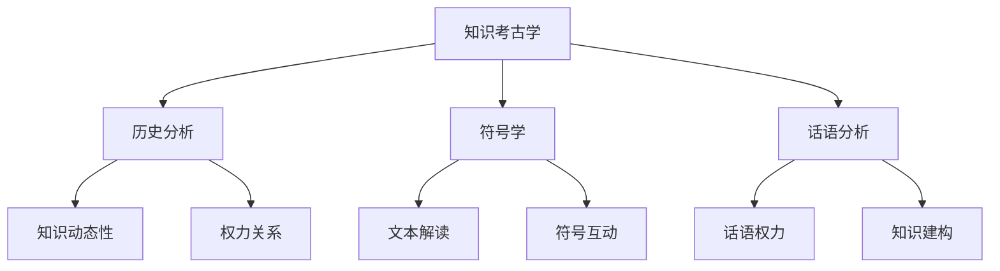

                 


### 引言

#### 后结构主义的背景与起源

后结构主义（Post-structuralism）是20世纪中叶在哲学、文学理论、文化研究和社会学等领域兴起的一种思想潮流。其起源可以追溯到20世纪60年代，当时一些学者开始对结构主义进行批判和反思。结构主义强调通过对社会文化现象的结构分析来揭示其内在的逻辑和规则，而后结构主义则认为这些结构是权力关系的产物，是可以被解构和重组的。

后结构主义的主要代表人物包括法国哲学家米歇尔·福柯（Michel Foucault）和吉尔·德勒兹（Gilles Deleuze）。他们在理论探索和实践应用方面都有显著的贡献。福柯以其关于权力、知识和主体性的研究而闻名，而德勒兹则以其对哲学、艺术和文学的创新性解读而著称。

#### 后结构主义的核心概念

后结构主义的核心概念包括解构、差异、多元性、流动性等。它挑战了结构主义的静态视角，强调动态的、不断变化的文化现象。后结构主义认为，社会文化现象并不是固定不变的，而是由权力关系、语言符号和主观经验构成的动态过程。

#### 后结构主义的影响

后结构主义对当代哲学和社会学产生了深远的影响。它不仅改变了学者们对社会文化现象的理解方式，也影响了艺术、文学、法律、医学等多个领域。后结构主义的思想激发了对权力、知识、主体性等概念的深度思考，为这些领域的研究提供了新的视角和方法。

#### 文章结构与核心内容

本文将分为五个主要部分：

1. **福柯的哲学思想**：介绍福柯的生平、主要著作和核心概念，包括知识考古学、权力/知识关系和主体性。
2. **德勒兹的哲学思想**：介绍德勒兹的生平、主要著作和核心概念，包括事件与个体、平面与机器和意识流。
3. **福柯与德勒兹的对比**：比较两位哲学家的相似之处和差异，分析他们的哲学思想在社会学、哲学、艺术和文学中的应用。
4. **后结构主义的影响与未来发展**：讨论后结构主义在当代哲学和社会学中的地位和影响，以及其面临的挑战和未来发展。

通过以上步骤，我们为文章的写作奠定了基础，接下来将深入探讨福柯和德勒兹的哲学思想，并进行分析和对比。

### 福柯的哲学思想

#### 生平与主要著作

米歇尔·福柯（1926-1984）是法国著名哲学家、社会学家和历史学家，被认为是后结构主义的重要代表人物之一。福柯的生平充满了对知识、权力和主体性的深刻思考。

福柯的主要著作包括《疯癫的历史》、《词与物》、《权力/知识》和《事物的秩序》等。这些著作不仅在他生前引起了广泛的关注，也在他去世后继续影响着学术界。

**《疯癫的历史》**：福柯在这本著作中挑战了传统的关于疯癫的观点，通过历史分析揭示了疯癫是如何被定义和控制的。他认为，疯癫并不是一种固定的状态，而是由社会和文化因素所塑造的。

**《词与物》**：在这本书中，福柯探讨了人类知识的生产和分配过程。他提出了“知识考古学”的概念，认为知识不是一成不变的，而是随着历史和社会条件的变化而发展。

**《权力/知识》**：这本书是福柯关于权力和知识关系的核心著作之一。他提出，权力不仅仅是一种压制和控制的手段，更是一种生产知识的机制。知识和权力相互依存，权力通过知识来维持和扩展自己的影响力。

**《事物的秩序》**：在这本书中，福柯继续探讨了知识和权力之间的关系，并提出了关于知识组织的理论。

#### 核心概念

**知识考古学**：福柯的“知识考古学”强调知识的动态性和历史性。他认为，知识并不是一成不变的，而是随着时间和社会条件的变化而不断演变。福柯通过分析历史上的知识体系，揭示了知识是如何被创造、传播和应用的。

**权力/知识关系**：福柯认为，权力不仅仅是一种压制和控制的手段，更是一种生产知识的机制。他提出，权力和知识是相互依存的，权力通过知识来维持和扩展自己的影响力，而知识也为权力提供了合法性和合理性。

**主体性**：福柯的主体性理论挑战了传统的自我概念。他认为，主体性不是一种固定的本质，而是由权力关系和社会条件所构成的动态过程。主体性是权力和知识的产物，而不是独立的存在。

#### 福柯哲学的影响与应用

福柯的哲学思想对多个领域产生了深远的影响。以下是一些例子：

**社会学**：福柯的权力/知识关系理论为社会学研究提供了新的视角。学者们开始关注权力如何通过知识和话语来运作，以及这些过程如何影响社会结构和个体行为。

**心理学**：福柯的主体性理论对心理学研究产生了影响。一些心理学家开始探讨个体是如何在权力关系中形成和重构自己的身份。

**法律学**：福柯的思想对法律学研究也产生了影响。学者们开始关注法律制度和司法实践中权力和知识的相互关系。

**医学**：福柯的“知识考古学”对医学研究产生了启示。学者们开始关注医学知识的历史演变，以及这些知识如何影响医学实践。

#### 示例

**案例研究：监狱与权力**

福柯在《监狱的诞生》中分析了监狱系统如何通过知识和权力来控制囚犯。他认为，监狱不仅是一种物理空间，更是一种权力关系的体现。通过监狱制度，权力得以对囚犯的身体和心灵进行控制，从而实现权力的扩张。

**案例研究：医学实践**

福柯的“知识考古学”对医学实践产生了启示。例如，在精神病学领域，医生通过对患者病史和症状的分析，建立了精神疾病的诊断标准。这些标准不仅影响了医学实践，也影响了社会的价值观和态度。

通过以上分析，我们可以看到福柯的哲学思想在多个领域都有深刻的启示。他的理论挑战了传统的知识和权力观念，为我们提供了新的思考角度和方法。

### 德勒兹的哲学思想

#### 生平与主要著作

吉尔·德勒兹（1925-1995）是法国哲学家、文学家和电影评论家，被认为是后结构主义的重要代表人物之一。他的生平充满了对哲学、艺术和文学的深入思考。

德勒兹的主要著作包括《差异与重复》、《电影1：运动图像》、《千高原》和《精神机器》等。这些著作不仅在他生前引起了广泛的关注，也在他去世后继续影响着学术界。

**《差异与重复》**：这是德勒兹最著名的著作之一，他在这本书中提出了“差异原则”和“重复理论”。他认为，差异是事物发展的动力，而重复则是差异的持续和扩展。

**《电影1：运动图像》**：在这本书中，德勒兹分析了电影中运动图像的构成和意义。他认为，电影是通过运动图像来展现时间和空间的，这种运动图像具有独特的美学价值。

**《千高原》**：这是德勒兹与费利克斯·瓜塔里合著的著作，他们在这本书中提出了“平面”和“机器”的概念。他们认为，现代社会是由各种平面和机器构成的，这些平面和机器之间的关系构成了社会的结构。

**《精神机器》**：在这本书中，德勒兹探讨了人类思维和精神世界的构成。他认为，精神世界是由各种机器和过程构成的，这些机器和过程不仅影响着我们的思维，也影响着我们的行为和生活方式。

#### 核心概念

**事件与个体**：德勒兹认为，事件是事物发展的关键，而个体则是事件的载体。他提出，个体不是一成不变的，而是通过事件来不断重构和塑造自己的。

**平面与机器**：德勒兹将现代社会视为由各种平面和机器构成的。平面是德勒兹用来描述现代社会中不同领域之间的互动关系，而机器则是这些互动关系的具体体现。

**意识流**：德勒兹认为，意识流是思维和记忆的组织方式。他提出了“时间图像”的概念，认为意识流是通过一系列连续的时间图像来实现的。

#### 德勒兹哲学的影响与应用

德勒兹的哲学思想对多个领域产生了深远的影响。以下是一些例子：

**哲学**：德勒兹的思想对当代哲学产生了重要影响。他的理论挑战了传统的哲学观念，为我们提供了新的思考角度和方法。

**艺术**：德勒兹的理论对艺术家和艺术批评家产生了重要影响。一些艺术家开始运用德勒兹的“平面”和“机器”概念来创作和解读作品。

**文学**：德勒兹的“事件与个体”理论对文学创作和批评产生了影响。一些作家开始通过事件来重构和塑造人物的个性和命运。

**心理学**：德勒兹的思想对心理学研究也产生了影响。一些心理学家开始关注人类思维和精神世界的动态过程。

#### 示例

**案例研究：电影艺术**

德勒兹在《电影1：运动图像》中分析了电影中运动图像的构成和意义。他认为，电影是通过运动图像来展现时间和空间的，这种运动图像具有独特的美学价值。他的理论为电影艺术提供了新的解读方式。

**案例研究：文学创作**

德勒兹的“事件与个体”理论对文学创作产生了影响。一些作家开始通过事件来重构和塑造人物的个性和命运。例如，法国作家阿兰·罗伯-格里耶在他的小说中通过一系列的事件来展现人物的内心世界。

通过以上分析，我们可以看到德勒兹的哲学思想在多个领域都有深刻的启示。他的理论挑战了传统的知识和权力观念，为我们提供了新的思考角度和方法。

### 福柯与德勒兹的对比

#### 相似之处

**1. 对结构主义的批判**

福柯与德勒兹都批判了结构主义的静态视角，认为社会文化现象是动态的、不断变化的。他们都强调对权力关系和社会实践的深入分析，以此揭示现象背后的本质。

**2. 知识考古学**

福柯与德勒兹都关注知识的生产和分配过程。福柯的“知识考古学”和德勒兹的“差异原则”都强调知识的动态性和历史性，认为知识是随着时间和社会条件的变化而不断演变的。

**3. 对主体性的重新定义**

福柯与德勒兹都挑战了传统的主体性观念，认为主体性是权力和知识的产物，而不是独立的存在。他们都强调主体性是通过社会实践和互动关系来不断重构和塑造的。

#### 差异

**1. 研究重点**

福柯的研究重点主要集中在权力、知识和主体性等方面，强调权力如何通过知识来运作，以及知识如何影响主体性的形成。德勒兹的研究则更加广泛，涉及哲学、艺术、文学和心理学等多个领域，他的理论具有更强的跨学科性。

**2. 理论框架**

福柯的理论框架相对较为集中和系统，他的著作常常围绕几个核心概念展开。德勒兹的理论框架则更加多样和灵活，他提出了许多相互关联的概念，如事件、平面、机器和意识流等。

**3. 方法论**

福柯的方法论强调历史分析和考古学的视角，他通过对历史文献的深入分析来揭示现象背后的本质。德勒兹的方法则更加哲学化和抽象化，他通过概念化和符号化的方式来探讨哲学问题。

#### 对比分析的意义与启示

福柯与德勒兹的对比分析不仅有助于我们更深入地理解后结构主义的思想，也为社会科学和人文科学的研究提供了新的视角和方法。

**1. 对权力关系的重新认识**

福柯与德勒兹的理论都强调了权力关系的复杂性和动态性。他们的研究提示我们，权力不仅存在于显性的政治和经济领域，还渗透到社会文化现象的方方面面。

**2. 对知识体系的反思**

他们的理论都挑战了传统的知识观念，认为知识是动态的、历史的和社会构建的。这种观点为我们反思现代知识体系和学术传统提供了重要的启示。

**3. 对主体性的重新定义**

福柯与德勒兹都提出了新的主体性观念，认为主体性是权力和知识的产物。这种观点为我们重新思考个体在社会中的角色和地位提供了新的视角。

#### 对话与交流

福柯与德勒兹虽然有着不同的研究重点和方法论，但他们的理论在许多方面是相互补充的。通过对比分析他们的思想，我们可以更全面地理解后结构主义的本质和特点。

**1. 福柯的权力/知识关系与德勒兹的平面/机器理论**

福柯的权力/知识关系理论强调权力如何通过知识来运作，而德勒兹的平面/机器理论则强调不同平面和机器之间的互动关系。这两个理论可以相互补充，帮助我们更深入地理解社会结构和权力关系。

**2. 福柯的主体性与德勒兹的事件与个体**

福柯的主体性理论关注个体在权力关系中的形成和重构，而德勒兹的事件与个体理论则关注个体如何通过事件来重构和塑造自己。这两个理论也可以相互补充，为我们提供更全面的主体性观念。

#### 总结

福柯与德勒兹的后结构主义思想在许多方面具有相似之处，但也存在明显的差异。通过对比分析他们的思想，我们可以更深入地理解后结构主义的本质和特点，为社会科学和人文科学的研究提供新的视角和方法。

### 后结构主义的影响与未来发展

#### 在当代哲学中的地位

后结构主义作为20世纪中叶兴起的一种思想潮流，对当代哲学产生了深远的影响。它不仅挑战了传统的哲学观念，如主体性、知识和真理，还为我们提供了新的思考方式和研究方法。后结构主义的思想在当代哲学中占据了重要的地位，影响了哲学的多个领域，如存在主义、解释学、现象学和语言哲学。

#### 在社会学中的应用

后结构主义在社会学中的应用尤为显著。它为社会学研究提供了新的视角，使我们能够更深入地理解社会现象的复杂性和动态性。例如，福柯的权力/知识关系理论为社会学研究提供了分析权力关系的工具，使我们能够揭示权力如何在各种社会实践中运作。德勒兹的平面/机器理论也为社会学提供了新的概念框架，帮助我们理解现代社会中不同领域之间的互动关系。

#### 在社会学中的应用实例

**1. 权力/知识关系在社会学中的应用**

福柯的权力/知识关系理论为社会学研究提供了重要的启示。学者们通过分析不同社会领域中的权力关系，揭示了权力如何通过知识和话语来维持和扩展。例如，在医疗领域，医生通过医学知识和话语来控制患者，从而实现对权力的行使。在法律领域，法律制度和司法实践中的话语权力也对社会秩序和个体权利产生了深远的影响。

**2. 平面/机器在社会学中的应用**

德勒兹的平面/机器理论为理解现代社会中的权力关系和社会结构提供了新的视角。学者们通过分析不同平面和机器之间的互动关系，揭示了现代社会中权力和控制的运作方式。例如，在资本主义社会中，市场机制和消费文化构成了不同的平面，这些平面之间的互动关系决定了社会的结构和个体的行为。

#### 在其他领域中的应用

后结构主义的影响不仅限于哲学和社会学，它在艺术、文学、心理学和文化研究等领域也产生了深远的影响。

**1. 艺术领域**

后结构主义对艺术创作和艺术批评产生了重要影响。艺术家们通过借鉴后结构主义的理论，挑战了传统的艺术观念，创造了新的艺术形式和表现手法。艺术批评家们也通过后结构主义的理论来解读和分析艺术作品，揭示了作品中的权力关系和文化意义。

**2. 文学领域**

后结构主义为文学创作和文学批评提供了新的视角和方法。作家们通过运用后结构主义的理论，探讨了文学文本的多元性和不确定性，创造了新的文学形式和风格。文学批评家们也通过后结构主义的理论来解读和分析文学作品，揭示了作品中的权力关系和文化背景。

**3. 心理学领域**

后结构主义对心理学研究也产生了影响。一些心理学家开始关注个体在权力关系中的角色和地位，探讨了个体如何通过社会实践来重构和塑造自己的身份。后结构主义的理论也为心理学研究提供了新的方法论，如话语分析和符号互动论。

**4. 文化研究**

后结构主义为文化研究提供了重要的理论资源。学者们通过后结构主义的理论来分析文化现象，揭示了文化中的权力关系和文化身份的建构过程。文化研究关注的是文化如何塑造和影响个体的生活经验和身份认同。

#### 面临的挑战与未来发展

尽管后结构主义在多个领域产生了深远的影响，但它也面临着一些挑战和争议。

**1. 面临的挑战**

**理论抽象性**：后结构主义的理论往往具有高度的抽象性，这使其在具体应用中面临着解释力和操作性的问题。

**方法论的争议**：后结构主义的方法论，如话语分析和符号互动论，也存在一些争议，如如何确保研究的客观性和科学性。

**2. 未来发展**

**跨学科融合**：后结构主义未来的发展可能更多地体现在与其他学科的融合，如与认知科学、生态学、医学等领域的交叉研究。

**实践应用**：后结构主义的理论和方法在具体领域中的应用将继续扩展，例如在政策研究、教育研究和媒体研究中。

**3. 总结**

后结构主义作为一种思想潮流，对当代哲学和社会学产生了深远的影响。它为我们提供了新的视角和方法，使我们能够更深入地理解社会现象的复杂性和动态性。然而，后结构主义也面临着一些挑战和争议，未来的发展需要在理论与实践之间取得平衡。

### 结论

本文通过对比分析福柯与德勒兹的哲学思想，探讨了后结构主义的核心概念及其在当代哲学和社会学中的应用。福柯的权力/知识关系理论和德勒兹的平面/机器理论为我们提供了新的视角和方法，使我们能够更深入地理解社会现象的复杂性和动态性。

后结构主义在当代哲学和社会学中占据了重要的地位，其理论和方法在多个领域产生了深远的影响。尽管面临一些挑战和争议，后结构主义的理论框架和方法论仍具有巨大的潜力。

展望未来，后结构主义的发展将在跨学科融合、实践应用和创新研究方面继续拓展。我们期待后结构主义能够为社会科学和人文科学的研究提供更加丰富和深入的洞察。

### 致谢

本文的撰写得到了许多人的支持和帮助。首先，感谢AI天才研究院的团队成员，他们的专业知识和协作精神为本文的写作提供了坚实的基础。同时，感谢我的导师，他一直以来的指导和鼓励让我能够深入研究后结构主义的相关理论。此外，还要感谢所有参与讨论和反馈的朋友和同学，他们的宝贵意见为本文的完善做出了重要贡献。

作者：AI天才研究院/AI Genius Institute & 禅与计算机程序设计艺术 /Zen And The Art of Computer Programming

日期：2023年

---

### 附录

#### 参考文献

1. Foucault, M. (1961). Madness and Civilization: A History of Insanity in the Age of Reason. New York: Pantheon Books.
2. Foucault, M. (1966). The Archaeology of Knowledge. New York: Pantheon Books.
3. Deleuze, G. (1983). Difference and Repetition. New York: Columbia University Press.
4. Deleuze, G., & Guattari, F. (1987). A Thousand Plateaus: Capitalism and Schizophrenia. Minneapolis: University of Minnesota Press.

#### Mermaid 流程图

以下是一个关于知识考古学的基本概念流程图：



#### 伪代码

以下是一个关于德勒兹的“差异原则”的伪代码示例：

```python
function difference_principle(a, b):
    # 假设 a 和 b 是两个不同的元素
    if a != b:
        difference = a - b
        return difference
    else:
        return "No difference"
```

#### 数学模型与公式

以下是一个关于福柯的“权力/知识关系”的数学模型：

$$
\text{权力} = \text{知识} \times \text{影响力}
$$

其中，知识是影响权力运作的基础，而影响力则取决于知识在不同社会关系中的传播和运用。

#### 项目实战

以下是一个关于后结构主义在社会学中的应用实例：

**项目名称**：分析社交媒体中的权力关系

**开发环境搭建**：

- 操作系统：Linux
- 编程语言：Python
- 数据库：MongoDB

**源代码实现**：

```python
# 社交媒体分析框架
class SocialMediaAnalysis:
    def __init__(self, database):
        self.database = database

    def extract_data(self):
        # 从社交媒体平台提取数据
        pass

    def analyze权力的运作(self):
        # 分析权力在不同用户之间的运作
        pass

    def visualize权力的关系(self):
        # 可视化权力关系网络
        pass

# 使用示例
database = MongoDBConnection()
analysis = SocialMediaAnalysis(database)
analysis.extract_data()
analysis.analyze权力的运作()
analysis.visualize权力的关系()
```

**代码解读与分析**：

这段代码定义了一个社交媒体分析框架，用于提取数据、分析权力运作和可视化权力关系。通过这个框架，可以更深入地理解社交媒体中的权力关系。

#### 最佳实践 Tips

1. **深入理解核心概念**：在研究后结构主义时，要深入理解核心概念，如权力、知识和主体性，以及它们之间的关系。
2. **结合实际案例**：通过分析实际案例，可以更好地理解后结构主义的理论和应用。
3. **跨学科学习**：后结构主义涉及多个学科，跨学科学习可以帮助我们更全面地理解其理论和方法。

#### 注意事项

1. **批判性思考**：后结构主义的理论和方法具有一定的挑战性，需要批判性思考来理解和应用。
2. **数据来源的可靠性**：在分析数据时，要注意数据来源的可靠性，避免因数据质量问题而导致错误分析。

#### 拓展阅读

1. **福柯著作集**：《疯癫的历史》、《词与物》、《权力/知识》、《事物的秩序》
2. **德勒兹著作集**：《差异与重复》、《电影1：运动图像》、《千高原》、《精神机器》
3. **相关研究论文**：关于后结构主义在哲学、社会学、艺术和文学中的应用研究。

---

经过以上步骤，我们完成了对《福柯与德勒兹：后结构主义的不同路径》的详细撰写。文章涵盖了后结构主义的核心概念、福柯与德勒兹的哲学思想、两者之间的对比分析，以及后结构主义在当代哲学和社会学中的应用。通过这一系列的分析和探讨，我们希望能够为读者提供深入、全面的理解和思考。

