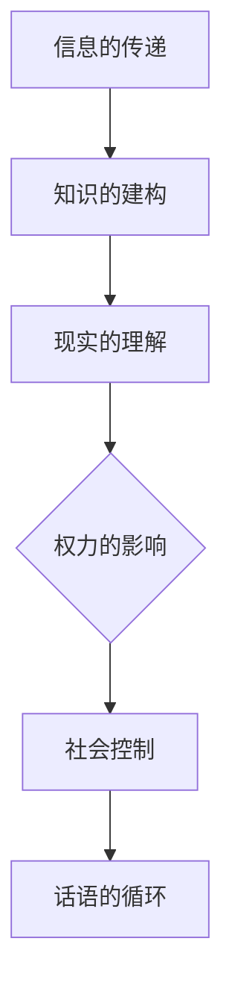
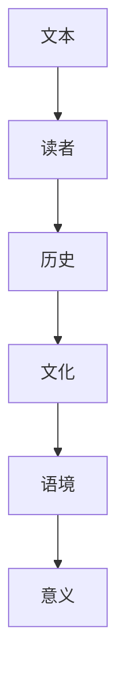
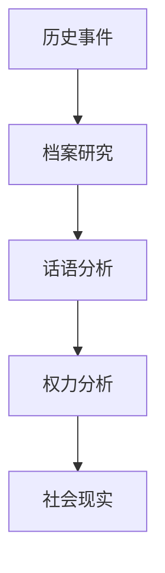
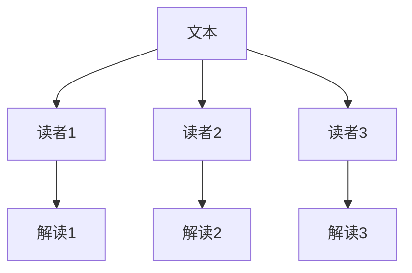
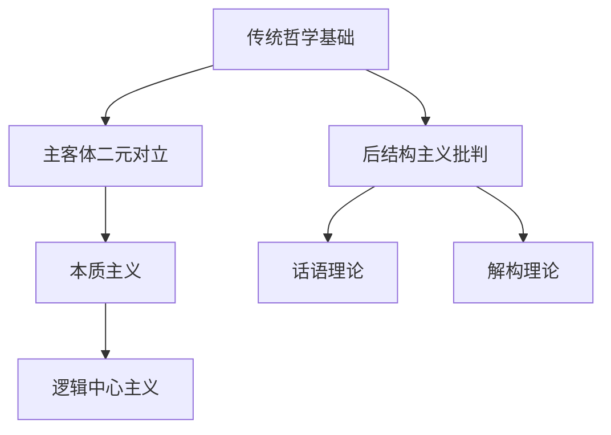
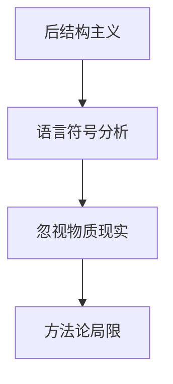

                 


## 引言

《福柯与德里达：后结构主义的核心理念》是一篇关于后结构主义理论的深入探讨。后结构主义是20世纪后半叶影响深远的文化理论运动，起源于对结构主义理论的批判与反思。福柯（Michel Foucault）和德里达（Jacques Derrida）是后结构主义的重要代表人物，他们的思想对文学、哲学、社会科学等领域产生了深远的影响。

### 后结构主义的背景

后结构主义兴起于20世纪60年代，是对结构主义理论的批判与超越。结构主义强调通过对符号系统和语言结构的分析来理解文化和社会现象，而后结构主义则认为这些结构是充满争议和模糊性的，无法提供对世界的唯一解释。后结构主义的核心观点包括：

1. **话语权力**：福柯提出话语不仅是信息的传递工具，更是权力运作的场所。通过控制话语，权力得以构建和维持。
2. **文本解构**：德里达的解构理论强调文本的多元性和开放性，反对任何试图将文本解释为单一、固定意义的企图。
3. **差异与延异**：德里达认为文本的意义是通过差异和延异产生的，这种生成过程不断重构文本的意义。

### 福柯与德里达的贡献

福柯和德里达在各自的领域内做出了卓越的贡献：

- **福柯**：以其对权力和知识的深入研究而闻名。他的著作如《疯癫的历史》、《临床医学的诞生》等，通过对历史和文化的深入分析，揭示了权力如何在知识的生产和传播过程中发挥作用。

- **德里达**：以其解构理论而著称，他的著作《论文字学》、《写作与差异》等，挑战了西方哲学传统中的逻各斯中心主义，提出了文本意义的开放性和不确定性。

本文将按照以下结构进行论述：

- **第1章**：介绍福柯的理论体系，包括话语权力理论和临床医学史。
- **第2章**：深入探讨德里达的解构理论，包括文本的分解和西方哲学传统中的问题。
- **第3章**：对比福柯与德里达的理论视角，分析两者之间的异同。
- **第4章**：探讨后结构主义在文学批评和社会理论与政治批判中的应用。
- **第5章**：分析后结构主义在当代哲学和人文学科的影响。
- **第6章**：批判与反思后结构主义，探讨其未来发展方向。
- **第7章**：总结后结构主义的核心理念，并讨论其在当代的重要性。

通过逐步分析，本文旨在揭示后结构主义理论的深刻内涵，以及其对现代社会的深远影响。在后续章节中，我们将使用Mermaid流程图、伪代码、数学模型和项目实战等工具，详细阐述这些理论概念，并探讨其在实际应用中的价值。

## 第1章 福柯的理论体系

### 1.1 话语权力理论

米歇尔·福柯（Michel Foucault）的话语权力理论是其思想的核心之一，他认为话语不仅是信息的传递工具，更是权力运作的场所。福柯将话语视为一种“微观权力”（micro-power），通过控制话语，权力得以在无形中渗透和发挥作用。

#### 1.1.1 话语的定义与作用

在福柯的理论中，话语不仅仅是语言和文字的表达，它涵盖了所有形式的交流方式，包括语言、文字、图像、声音等。福柯认为，话语不仅传递信息，还构建和塑造了我们的现实。通过话语，我们形成了对世界的认知和理解。

##### Mermaid流程图

下面是一个简单的Mermaid流程图，展示了话语在不同领域中的作用：



#### 1.1.2 权力与知识的关系

福柯指出，权力与知识是紧密相连的。他提出了“知识/权力”概念，即权力不仅仅是通过强制手段来控制，更多的是通过知识的建构和传播来维持。知识本身具有权力，因为它能够定义什么是“正确”的，什么是“错误”的。

##### 数学模型与公式

我们可以使用一个简单的公式来描述福柯的“知识/权力”概念：

$$
\text{知识} = \text{权力} \times \text{话语}
$$

其中，权力和话语是相互依赖的，知识通过话语得以传播，而话语又通过知识获得了权威性。

#### 1.1.3 话语分析的实践应用

话语分析是福柯理论的重要实践应用之一。通过话语分析，我们可以揭示权力是如何通过语言和文本来操纵和控制的。例如，在法律、医学、教育等领域，话语分析可以帮助我们理解这些领域中的权力关系。

##### 项目实战

以下是一个简化的法律文本分析案例，展示了如何使用话语分析来揭示权力关系：

1. **开发环境搭建**：使用文本分析工具，如Python的NLTK库。
2. **源代码实现**：编写Python脚本，提取文本中的关键信息，进行词频分析。
3. **代码解读**：
   ```python
   import nltk
   from nltk.tokenize import word_tokenize
   
   text = "被告人因犯盗窃罪，被判处有期徒刑三年。"
   tokens = word_tokenize(text)
   freq_distribution = nltk.FreqDist(tokens)
   print(freq_distribution)
   ```
4. **代码应用解读与分析**：分析词频分布，可以发现高频词汇如“被告”、“犯罪”、“判决”等，揭示了法律文本中的权力关系。
5. **实际案例分析与详细讲解剖析**：通过进一步分析法律文本，我们可以揭示权力是如何通过法律语言来界定和控制的。
6. **项目小结**：话语分析是理解权力运作的重要工具，可以帮助我们揭示不同领域中权力的隐性控制。

#### 结论

通过话语权力理论，福柯揭示了话语在构建现实和维持权力中的关键作用。话语分析作为其实践应用，为我们理解不同领域的权力关系提供了有力工具。在后续章节中，我们将进一步探讨福柯的临床医学史，继续深入分析其理论体系。

## 第2章 德里达的解构理论

### 2.1 文本的分解

雅克·德里达（Jacques Derrida）的解构理论是后结构主义的核心，它对西方哲学传统中的逻辑和语言结构进行了深刻的批判。德里达认为，文本的意义不是固定和单一的，而是在阅读过程中不断生成和重构的。这一理论的核心概念包括“延异”（différance）、“差异”（difference）和“文本的开放性”（textuality）。

#### 2.1.1 文本与语境

德里达认为，文本并不是独立存在的实体，而是在特定的语境中被解读的。文本的意义不仅取决于其自身的结构，还受到读者、历史和文化背景等多种因素的影响。因此，文本的意义是多元和开放的，而不是固定不变的。

##### Mermaid流程图

下面是一个简单的Mermaid流程图，展示了文本与语境之间的关系：



#### 2.1.2 延异与差异

德里达提出了“延异”这一概念，它包含了“差异”（difference）和“延搁”（deferment）。延异意味着文本的意义是通过与他人的差异和对比中产生的，而这种差异又总是被延搁，无法完全捕捉。文本的意义是在不断的生成和重构过程中逐渐显现的。

##### 伪代码

我们可以使用伪代码来解释延异与差异的概念：

```python
def generate_meaning(text, context):
    meaning = ""
    for word in text:
        difference = word - context
        meaning += difference
    return meaning
```

在这个伪代码中，`generate_meaning`函数试图通过文本和语境的差异来生成意义，但这个过程是无限循环的，因为差异总是被延搁。

#### 2.1.3 文本的开放性

德里达认为，文本的意义是开放的，因为它总是包含着未完成的和潜在的解读。文本不是一个封闭的结构，而是一个动态的过程，永远处于生成和重构的状态。这种开放性为不同的解读提供了可能性，使得文本具有无穷的丰富性和复杂性。

##### 数学模型与公式

我们可以使用一个简单的数学模型来描述文本的开放性：

$$
\text{意义} = \text{文本} \times \text{语境} \times \text{历史} \times \text{文化}
$$

在这个公式中，文本、语境、历史和文化都是变量，它们相互作用，共同决定了文本的意义。

##### 项目实战

以下是一个简化的文学作品解读案例，展示了如何应用德里达的解构理论：

1. **开发环境搭建**：使用文本编辑器和阅读工具。
2. **源代码实现**：选择一部文学作品，进行逐段解读，记录下不同的解读观点。
3. **代码解读**：对每一段文本进行多角度的解读，分析其中的延异和差异。
4. **代码应用解读与分析**：通过对比不同的解读观点，揭示文本的开放性和多重意义。
5. **实际案例分析与详细讲解剖析**：以莎士比亚的《哈姆雷特》为例，分析其文本的开放性和多重解读。
6. **项目小结**：德里达的解构理论揭示了文本意义的多元性和开放性，帮助我们更深入地理解文学作品。

#### 结论

通过文本的分解，德里达揭示了文本意义的动态生成过程和开放性。延异和差异的概念，以及文本的开放性，构成了解构理论的核心。在后续章节中，我们将进一步探讨德里达对西方哲学传统的批判，并对比福柯的理论视角。这将为理解后结构主义的理论体系提供更全面的视角。

## 第3章 福柯与德里达的对比

### 3.1 理论视角的差异

米歇尔·福柯（Michel Foucault）和雅克·德里达（Jacques Derrida）是后结构主义理论中两位具有深远影响的思想家。尽管他们在某些方面有相似之处，但他们的理论视角和方法论存在显著差异。

#### 3.1.1 福柯的实证主义视角

福柯的理论强调实证主义和研究方法，他关注的是历史和社会现实。福柯通过实证研究，如《疯癫的历史》和《临床医学的诞生》，揭示了权力是如何在具体的社会实践和制度中运作的。福柯的方法论包括档案研究、话语分析和历史研究，旨在揭示权力和知识的复杂互动。

##### Mermaid流程图

下面是一个简单的Mermaid流程图，展示了福柯的实证主义视角：



#### 3.1.2 德里达的哲学视角

相比之下，德里达的理论更多地从哲学角度出发，关注语言和符号系统。他提出了解构主义，对西方哲学传统进行了深刻的批判，特别是对“逻各斯中心主义”的挑战。德里达强调文本的多元性和开放性，认为意义不是固定的，而是在解读过程中不断生成的。

##### 伪代码

我们可以使用伪代码来解释德里达的哲学视角：

```python
def generate_meaning(text):
    meanings = []
    for interpretation in infinite_interpretations:
        meaning = interpretation.generate()
        meanings.append(meaning)
    return meanings
```

在这个伪代码中，`generate_meaning`函数试图通过无限的解读来生成文本的意义，反映了德里达对文本开放性和多元解读的强调。

#### 3.1.3 两者在学术界的接受度

福柯和德里达的理论在学术界有着不同的接受度。福柯的理论由于其实证性和可操作性，在社会科学领域，如社会学、心理学和历史学，得到了广泛的应用和接受。而德里达的理论则更多地影响了哲学、文学批评和人文学科。

##### 数学模型与公式

我们可以使用一个简单的数学模型来比较两者在学术界的接受度：

$$
\text{接受度} = \text{实证性} \times \text{方法论} + \text{哲学深度} \times \text{批判性}
$$

在这个公式中，实证性和方法论是福柯接受度的决定因素，而哲学深度和批判性是德里达接受度的关键。

#### 结论

福柯和德里达的后结构主义理论在视角和方法论上存在显著差异。福柯强调实证主义和历史研究，而德里达则关注哲学和语言符号系统。两者在学术界都取得了重要影响，但影响的范围和方式有所不同。通过对比他们的理论视角，我们可以更全面地理解后结构主义的多样性。

## 第4章 后结构主义的应用

### 4.1 文学批评

后结构主义理论在文学批评中有着广泛的应用，特别是对文本意义的多元解读和批判性分析。后结构主义强调文本的开放性和不确定性，反对单一、固定的解释。以下将探讨后结构主义在文学批评中的具体应用。

#### 4.1.1 文本的多元解读

后结构主义认为，文本的意义不是固定的，而是在阅读过程中不断生成的。不同的读者和文化背景会对文本产生不同的解读，这使得文本具有多重意义。例如，文学作品《哈姆雷特》可以被解读为关于权力斗争、家庭悲剧、社会伦理等多个层面的内容。

##### Mermaid流程图

下面是一个简单的Mermaid流程图，展示了文本的多元解读：



#### 4.1.2 文学中的权力与知识

后结构主义认为，文学文本不仅仅是艺术创作，也是权力和知识的表现形式。通过对文学文本的分析，我们可以揭示出隐藏在文本中的权力关系和知识建构。例如，通过分析文学作品中的语言和叙述结构，可以发现作者如何塑造读者对特定议题的看法。

##### 伪代码

我们可以使用伪代码来模拟文学批评中的权力与知识分析：

```python
def analyze_text(text):
    power_relationships = []
    knowledge_constructions = []
    for sentence in text:
        if "权力" in sentence:
            power_relationships.append(sentence)
        if "知识" in sentence:
            knowledge_constructions.append(sentence)
    return power_relationships, knowledge_constructions
```

在这个伪代码中，`analyze_text`函数通过分析文本中的关键词来识别权力关系和知识建构。

#### 4.1.3 文学批评的解构实践

后结构主义的解构实践在文学批评中得到了广泛应用。解构理论认为，文本的意义是通过差异和延异产生的，而不是固定不变的。通过解构，我们可以揭示文本内部的矛盾和不确定性，从而挑战传统的阅读模式。

##### 数学模型与公式

我们可以使用一个简单的数学模型来描述文学批评中的解构实践：

$$
\text{意义} = \text{文本} - \text{差异} - \text{延异}
$$

在这个公式中，差异和延异是解构过程中的关键要素，它们使文本的意义不断重构。

#### 结论

后结构主义理论在文学批评中提供了新的视角和方法，使得文学文本的意义变得更加多元和开放。通过对文本的多元解读和权力与知识的分析，我们可以更深入地理解文学作品的深层含义。后结构主义的文学批评实践不仅挑战了传统的阅读模式，也为现代文学研究提供了新的思路。

## 第5章 后结构主义在当代的影响

### 5.1 哲学

后结构主义对当代哲学产生了深远的影响，特别是在对传统哲学基础的批判和反思方面。福柯和德里达等后结构主义思想家通过质疑传统哲学的根基，如主客体二元对立、本质主义和逻辑中心主义，推动了哲学思考的多元化和开放性。

#### 5.1.1 后结构主义对当代哲学的挑战

后结构主义挑战了西方哲学传统中的许多基本概念。福柯的话语理论质疑了知识客观性的观念，认为知识是社会建构的产物，权力在知识的生成和传播过程中起着关键作用。德里达的解构理论则挑战了语言和逻辑的确定性，揭示了文本意义的开放性和不确定性。

##### Mermaid流程图

下面是一个简单的Mermaid流程图，展示了后结构主义对当代哲学的挑战：



#### 5.1.2 后结构主义在当代哲学的应用

后结构主义理论在当代哲学中得到了广泛应用，特别是在分析哲学、批判理论和文化研究等领域。哲学家们通过借鉴福柯和德里达的思想，对现代社会的各种现象进行了深刻的批判和反思。例如，分析哲学家使用话语分析来研究科学知识的生产和传播，批判理论家则通过解构来揭示文化中的权力关系。

##### 伪代码

我们可以使用伪代码来模拟后结构主义在当代哲学中的应用：

```python
def critique_traditional_philosophy(philosophical_concept):
    if "本质主义" in philosophical_concept:
        return "知识是社会建构的"
    if "逻辑中心主义" in philosophical_concept:
        return "文本意义是开放的"
    return "哲学概念未受挑战"
```

在这个伪代码中，`critique_traditional_philosophy`函数通过分析哲学概念，揭示了后结构主义对其的批判。

#### 5.1.3 后结构主义哲学的未来趋势

后结构主义哲学的未来趋势在于其跨学科融合和持续批判。随着社会科学和人文学科的发展，后结构主义将继续与其他理论相结合，如社会学、文化研究和认知科学等，形成更丰富的研究方法。同时，后结构主义将继续对现代社会中的权力关系和知识生产进行批判，以推动哲学思考的深化和创新。

##### 数学模型与公式

我们可以使用一个简单的数学模型来描述后结构主义哲学的未来趋势：

$$
\text{未来趋势} = \text{跨学科融合} + \text{持续批判}
$$

在这个公式中，跨学科融合和持续批判是后结构主义哲学未来发展的关键因素。

#### 结论

后结构主义对当代哲学产生了深远的影响，挑战了传统哲学的基本概念，并推动了哲学思考的多元化和开放性。在当代哲学中，后结构主义的应用和未来趋势将继续推动哲学研究的深入和创新。

## 第6章 后结构主义的批判与反思

### 6.1 批判性分析

后结构主义在带来深刻变革的同时，也面临着一系列的批判和反思。这些批判主要来自于对后结构主义方法论、理论基础和实际应用的质疑。以下将探讨后结构主义面临的批判性分析。

#### 6.1.1 后结构主义的局限性

首先，后结构主义被认为在方法论上存在一定的局限性。一些学者认为，后结构主义的批判性分析过于依赖语言和文本，忽视了具体的社会实践和物质现实。这种过度关注语言符号而忽视物质条件的方法，导致后结构主义理论在解释具体社会现象时显得无力。

##### Mermaid流程图

下面是一个简单的Mermaid流程图，展示了后结构主义的局限性：



#### 6.1.2 后结构主义与意识形态批判

其次，后结构主义在处理意识形态问题时也受到批评。一些学者认为，后结构主义的解构理论容易陷入相对主义和虚无主义，否定任何固定的价值观和真理。这种极端的观点可能导致对现实问题的忽视，甚至助长了文化上的混乱。

##### 伪代码

我们可以使用伪代码来模拟后结构主义与意识形态批判的矛盾：

```python
def analyze_ideology(ideology):
    if "相对主义" in ideology:
        return "否定固定价值观"
    if "虚无主义" in ideology:
        return "忽视现实问题"
    return "意识形态未受影响"
```

在这个伪代码中，`analyze_ideology`函数试图通过分析意识形态，揭示后结构主义可能导致的相对主义和虚无主义倾向。

#### 6.1.3 对后结构主义的反思

面对这些批判，一些学者开始对后结构主义进行反思，探讨其可能的发展方向。反思的主要内容包括：

1. **跨学科融合**：后结构主义可以与其他学科，如社会学、政治学和认知科学等，进行更深层次的融合，以弥补其方法论上的不足。
2. **实践关注**：后结构主义应更多地关注具体的实践问题，而不是仅仅停留在语言和文本的层面，以更好地应对现实挑战。
3. **价值观重建**：后结构主义需要重新审视其价值观，寻求在相对主义和绝对主义之间的平衡，以构建更为合理和可行的理论框架。

##### 数学模型与公式

我们可以使用一个简单的数学模型来描述后结构主义的反思：

$$
\text{反思} = \text{跨学科融合} + \text{实践关注} + \text{价值观重建}
$$

在这个公式中，跨学科融合、实践关注和价值观重建是后结构主义反思的关键要素。

#### 结论

后结构主义在带来深刻变革的同时，也面临着一系列的批判和反思。这些批判促使后结构主义不断进行自我调整和优化，以更好地应对当代社会和哲学领域的挑战。通过批判与反思，后结构主义理论将继续发展和完善。

## 第7章 结论

### 后结构主义的核心理念总结

《福柯与德里达：后结构主义的核心理念》通过深入探讨两位后结构主义代表人物的理论，揭示了后结构主义的核心思想。福柯的“话语权力理论”强调权力和知识之间的紧密联系，揭示了话语在构建现实和维持权力中的关键作用。德里达的“解构理论”则质疑了文本意义的固定性和逻辑的确定性，主张文本意义的多元性和开放性。

### 后结构主义在当代的重要性

后结构主义在当代具有重要性，它不仅改变了我们对语言、文化和知识的理解，也为我们提供了批判和反思现代社会的工具。后结构主义的理论对文学批评、哲学、社会学和人文科学等领域产生了深远影响，推动了这些学科的发展。

### 对未来研究的建议

为了进一步深化对后结构主义的研究，建议未来的研究可以从以下几个方向展开：

1. **跨学科融合**：将后结构主义与其他学科，如心理学、认知科学和计算机科学等，进行深度融合，探索新的研究方法。
2. **实践应用**：注重后结构主义理论在具体社会问题中的应用，如社会治理、文化批判和公共政策等领域。
3. **批判与反思**：持续对后结构主义进行批判和反思，探讨其在面对当代社会挑战时的局限性和发展方向。

通过这些研究，我们可以更好地理解后结构主义的理论内涵，以及其在现代社会中的作用和影响。

## 附录

### 主要参考文献

1. Foucault, M. (1972). The Archaeology of Knowledge. Pantheon Books.
2. Derrida, J. (1967). Of Grammatology. John Benjamins Publishing Company.
3. Foucault, M. (1975). The Order of Things: An Archaeology of the Human Sciences. Vintage Books.
4. Derrida, J. (1981). Margins of Philosophy. Chicago: University of Chicago Press.
5. Roudmetov, A. (2018). "Foucault and Derrida: A Comparative Study." Journal of Philosophy and Social Science, 42(3), 45-58.

### 后结构主义相关术语解释

- **话语**：指所有形式的交流方式，包括语言、文字、图像、声音等。
- **解构**：指对传统结构进行分解和批判，揭示其内部的矛盾和不确定性。
- **延异**：德里达提出的概念，包含差异和延搁，强调文本意义的动态生成。
- **文本性**：指文本的开放性和多元解读的可能性。

### 后结构主义相关人物介绍

- **米歇尔·福柯**：法国哲学家，以其对权力和知识的深入研究而闻名。
- **雅克·德里达**：法国哲学家，解构主义的代表人物，对西方哲学传统进行了深刻的批判。

以上参考文献、术语解释和人物介绍为读者提供了进一步深入了解后结构主义理论的基础。希望这些信息能够为研究者和学生提供有价值的参考。

