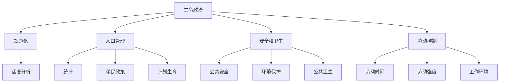

                 

### 文章标题

《福柯与韩非：生命政治与法家思想的权力分析》

### 关键词

福柯、韩非、生命政治、法家思想、权力分析、权力关系、比较研究

### 摘要

本文通过对福柯的生命政治理论和韩非的法家思想的深入分析，探讨了两者在权力结构和政治实践中的异同。文章首先介绍了福柯和韩非的背景及其思想的核心，然后详细分析了生命政治与法家思想的概念、核心原则及其在权力关系中的体现。通过比较分析，本文揭示了两种思想在权力结构和政治实践中的相似与差异，并探讨了它们在现代社会中的影响和未来研究方向。文章旨在为读者提供对权力分析的新视角，加深对政治哲学的理解。

## 引言

### 福柯与韩非的背景介绍

福柯（Michel Foucault，1926-1984）是20世纪最重要的哲学家之一，以其独特的权力分析和对现代性的批判而著称。福柯的哲学思想深刻影响了社会科学、人文科学以及政治哲学领域。他的著作涵盖了广泛的议题，包括知识、权力、主体性、性、医学以及监狱等。福柯提出了一系列核心概念，如生命政治、知识/权力关系、话语分析等，为理解现代社会中的权力运作提供了新的视角。

与之相比，韩非（约公元前280-233年）是中国战国时期法家学派的代表人物，他的思想对中国古代的政治和社会制度产生了深远的影响。韩非主张以法治为基础，强调君主的权威和集权统治。他的著作《韩非子》包含了对人性、法律、政治策略和行政管理等方面的深刻见解。韩非的思想强调法律和权力的重要性，认为通过严格的法治和制度化的权力结构，可以有效地治理国家和社会。

### 生命政治与法家思想的重要性

生命政治（biopower）是福柯提出的一个核心概念，它指的是一种通过对生命过程的控制来维护社会秩序和统治的权力形式。生命政治关注的是生命的生产、控制、分配和规范化，通过对人口、健康、安全、劳动等方面的管理来实现对社会的全面控制。福柯认为，生命政治是现代国家权力的一种基本形式，它不仅体现在政治和法律层面，还渗透到社会的各个领域。

法家思想则强调法律、权力和统治的重要性。韩非认为，通过严格的法律制度和权力结构，可以有效地治理国家和社会。法家思想主张君主的绝对权威，认为只有强有力的统治者和一套完善的法制，才能确保社会的稳定和秩序。法家思想在古代中国得到了广泛的应用，对后来的政治制度和社会治理产生了深远的影响。

本文将深入探讨福柯的生命政治理论和韩非的法家思想，分析两者在权力结构和政治实践中的异同点。通过比较研究，本文旨在揭示生命政治与法家思想在权力分析中的独特贡献，并探讨它们在现代社会中的意义和影响。

### 第一章：福柯的生命政治理论

#### 1.1 生命政治的概念

生命政治（Biopower）是福柯提出的一个重要概念，用于描述现代社会中权力对生命的控制和管理。福柯在《生命政治的诞生》一书中，对生命政治进行了详细阐述，认为生命政治是一种通过对生命过程的控制来维护社会秩序和统治的权力形式。

生命政治的核心在于对生命的规范化和控制，它不仅涉及人口、健康、安全等方面，还涵盖了对劳动、生产、消费等社会生活的各个方面的管理。福柯认为，生命政治是现代国家权力的一种基本形式，它不仅体现在政治和法律层面，还渗透到社会的各个领域。

#### 1.2 生命政治的核心原则

生命政治的核心原则包括以下几个方面：

1. **生命控制**：生命政治强调对生命的全面控制，包括对出生、死亡、健康、疾病等生命过程的控制。这种控制不仅体现在政治和法律层面，还通过科技、医疗、教育等手段渗透到日常生活中。

2. **规范化**：生命政治通过对个体和群体的规范化，确保社会的秩序和稳定。规范化手段包括法律、规章制度、标准化程序等，通过这些手段，生命政治试图将社会行为和思想纳入可管理的轨道。

3. **人口管理**：生命政治关注人口的增长、分布和流动，通过人口管理来实现对社会的控制。这包括对人口统计、移民政策、计划生育等方面的管理。

4. **安全和卫生**：生命政治通过维护公共安全和卫生，确保社会的正常运行。这包括对公共安全、环境保护、公共卫生等方面的管理和监督。

5. **劳动控制**：生命政治通过劳动控制来管理社会生产和生活。这包括对劳动时间的控制、劳动强度的规定、工作环境的改善等，以确保劳动力的健康和生产效率。

#### 1.3 福柯对权力的分析

福柯的权力分析具有独特的视角，他认为权力不是静态的、固定不变的，而是动态的、流动的。福柯提出权力/知识（power/knowledge）关系，认为权力不仅存在于政治和法律领域，还存在于知识的生产、传播和运用中。

福柯认为，权力是通过话语（discourse）来实现的。话语不仅是一种表达方式，更是一种权力工具。通过话语，权力得以构建和维持，知识得以生产和传递。福柯提出话语分析（discourse analysis）作为研究权力的重要方法，通过分析话语的结构、功能和机制，可以揭示权力如何运作和影响个体和社会。

在福柯看来，生命政治是权力的一种形式，它通过话语和知识来控制和规范生命过程。生命政治不仅仅是国家权力的体现，还渗透到社会的各个领域，包括医疗、教育、科技、媒体等。通过这些领域，生命政治对个体和社会进行全面的控制和管理。

#### 1.4 生命政治的社会影响

生命政治对现代社会产生了深远的影响。首先，生命政治使得国家对社会生活的控制更加精细和全面。通过对生命过程的控制，国家可以更加有效地管理人口、维护公共安全和卫生、促进经济发展等。

其次，生命政治对个体产生了深远的影响。生命政治通过对个体的规范化和管理，使得个体的行为和思想受到更多的限制和约束。这种控制不仅体现在法律和规章制度中，还渗透到日常生活中，影响着个体的自由和权利。

此外，生命政治对知识和文化的生产也产生了重要影响。通过话语和知识，生命政治构建了特定的社会秩序和价值观，对个体和社会进行控制和规范。这种控制不仅体现在现实世界中，还通过媒体、教育等渠道传递到下一代，影响着社会的未来发展。

综上所述，福柯的生命政治理论为我们提供了新的视角来理解现代社会中的权力运作。通过分析生命政治的核心原则和福柯对权力的独特视角，我们可以更好地理解生命政治对社会和个体的影响，以及其在现代国家权力中的地位和作用。

### 第二章：韩非的法家思想

#### 2.1 法家思想的历史背景

法家思想是中国战国时期的一种重要政治思想，其代表人物是韩非。韩非子生活在公元前280年至233年之间，他的思想在当时的政治动荡和变革中具有重要影响。战国时期，各国纷纷进行变法和改革，以增强国家实力和实现统一。在这种背景下，法家思想应运而生，并成为当时主要的政治哲学流派之一。

法家思想的兴起与当时的社会现实密切相关。战国时期，诸侯国之间的战争频繁，各国统治者急需有效的治理手段来增强国家的统一和稳定。法家思想主张通过严格的法律和制度来规范社会行为，强调君主的权威和中央集权，以实现国家的有效治理。

#### 2.2 韩非的核心观念

韩非的法家思想包含了一系列核心观念，这些观念对于理解法家思想及其在权力结构中的作用至关重要。

1. **法治观念**：法家思想的核心是法治观念。韩非认为，法律是治国的基础，只有依靠严格的法律和制度，才能确保社会的稳定和秩序。他认为，法律应该是公正无私的，不受个人感情和偏见的影响。

2. **君主权威**：法家思想强调君主的权威和中央集权。韩非认为，君主应该拥有绝对的权力，通过集中权力来统一国家和控制社会。他主张君主应该以法律为准绳，依法治国，确保国家的统一和稳定。

3. **功利主义**：法家思想强调功利主义，认为政治和治理的目标是追求国家和人民的利益。韩非认为，统治者应该根据实际情况来制定政策和法律，以实现国家的富强和人民的幸福。

4. **治国策略**：法家思想提出了一系列治国策略，包括赏罚分明、严刑峻法、选贤任能等。韩非认为，通过严格的法律和制度，可以有效地管理国家和控制社会。

5. **道德修养**：虽然法家思想强调法治和功利主义，但韩非也认为统治者的道德修养对于治理国家至关重要。他认为，统治者应该具备高尚的道德品质，以树立良好的榜样，赢得人民的信任和支持。

#### 2.3 法家思想与权力关系

法家思想与权力关系密不可分。首先，法家思想强调君主的绝对权力和中央集权，认为只有通过集中权力，才能有效地治理国家。在这种思想下，法律不仅是治理国家的重要工具，也是维护君主权威的重要手段。

其次，法家思想认为，权力应该通过严格的法律和制度来规范。法律是权力的边界，同时也是权力的保障。通过法律，君主可以限制权力滥用，确保权力的合法性和正当性。

此外，法家思想强调权力与责任的对等。韩非认为，统治者应该依法行事，如果违反法律，应该受到相应的惩罚。这种观念旨在确保权力与责任的一致性，防止权力滥用。

#### 2.4 法家思想的影响

法家思想对中国古代政治和社会制度产生了深远的影响。首先，法家思想为秦国的统一奠定了理论基础。秦始皇采纳了法家思想，通过严刑峻法和中央集权，实现了中国的统一和强盛。

其次，法家思想对中国古代的法律制度和行政管理产生了重要影响。中国古代的法律制度和行政管理体系深受法家思想的影响，强调法律的公正和权力的规范。

此外，法家思想对现代政治哲学和社会治理也有一定的启示。法家思想强调法治和权力规范，对于现代社会的治理和权力监督具有一定的借鉴意义。

综上所述，韩非的法家思想在历史上具有重要地位，其核心观念和权力关系分析为理解中国古代的政治和社会制度提供了重要视角。通过分析法家思想的历史背景和核心观念，我们可以更好地理解其在中国政治和社会中的影响，以及其与现代政治哲学的关系。

### 第三章：生命政治与法家思想的比较分析

#### 3.1 生命政治与法家思想的异同点

在本章中，我们将对福柯的生命政治理论和韩非的法家思想进行深入的比较分析，探讨两者在权力结构和政治实践中的异同点。

首先，从起源和背景来看，福柯的生命政治理论起源于20世纪的现代性批判，是对现代社会中权力、知识和控制机制的深入分析。而韩非的法家思想则起源于中国古代的战国时期，是对国家治理和政治制度的理论探讨。两者虽然出现在不同的历史时期，但都关注权力和治理的问题。

其次，在概念和核心原则方面，福柯的生命政治强调对生命过程的控制和管理，通过规范化、人口管理和安全卫生等手段，实现对社会的全面控制。而韩非的法家思想则强调法治和君主权威，通过严格的法律和制度来规范社会行为，实现国家的有效治理。两者在权力控制和治理手段上有所不同，但都认为权力是维护社会秩序和稳定的关键。

从权力结构来看，福柯的生命政治更强调权力的分散和渗透，认为权力不仅存在于政治和法律层面，还渗透到社会的各个领域，如医疗、教育、科技等。而韩非的法家思想则更强调权力的集中和统一，认为只有通过君主的绝对权力和中央集权，才能实现国家的有效治理。

在政治实践方面，福柯的生命政治理论强调通过话语和知识来控制和规范社会，通过对个体和群体的管理来实现对社会的控制。而韩非的法家思想则更强调通过法律和制度来管理社会，通过赏罚分明、严刑峻法等手段来维护社会秩序。

#### 3.2 权力在两种思想中的体现

在福柯的生命政治理论中，权力被视为一种动态的、流动的机制，通过话语和知识来体现。福柯认为，权力不仅存在于政治和法律层面，还渗透到社会的各个领域。例如，在医疗领域，权力通过医疗制度和医学话语来控制个体和群体的健康；在教育领域，权力通过教育制度和知识传播来塑造个体的思想和行为。福柯强调，权力不是单方面的压制，而是通过相互交织的话语体系来实现对社会的控制。

相比之下，韩非的法家思想中的权力体现更为直接和明确。韩非认为，权力应该通过法律和制度来体现，法律是权力的边界和保障。在法家思想中，权力主要表现为君主的权威和中央集权，通过严格的法律和制度来规范社会行为。例如，在行政管理中，通过选拔贤能和设立严刑峻法来确保政府的有效运作；在司法领域，通过公正的法律和严格的执行来维护社会秩序。

#### 3.3 生命政治与法家思想的现代意义

尽管福柯的生命政治理论和韩非的法家思想起源于不同的历史时期，但它们在现代社会中仍具有重要的意义。

首先，福柯的生命政治理论为我们提供了理解现代社会中权力运作的新视角。在现代性背景下，权力不再仅仅体现在政治和法律层面，而是通过话语和知识渗透到社会的各个领域。福柯的分析帮助我们认识到，权力是一种复杂的、多层次的现象，它不仅影响我们的行为和思想，还塑造了我们的社会现实。

其次，韩非的法家思想在现代社会中也有一定的启示。法家思想强调法治和权力规范，对于现代社会的治理和权力监督具有一定的借鉴意义。在现代社会，通过建立公正的法律体系和有效的权力监督机制，可以防止权力滥用，维护社会的公平和正义。

此外，两种思想都强调了权力的规范化和制度化。在现代社会，通过建立规范化和制度化的权力结构，可以更好地实现社会管理和治理。这包括建立公正的法律体系、加强权力监督、推动法治建设等。

#### 3.4 比较分析总结

通过比较分析，我们可以看出，福柯的生命政治理论和韩非的法家思想在权力结构和政治实践上各有特色。福柯的生命政治理论强调权力的分散和流动，通过话语和知识来控制社会；而韩非的法家思想则强调权力的集中和统一，通过法律和制度来治理社会。两者在现代社会中都有重要的意义，为我们提供了不同的视角来理解权力和社会治理。

综上所述，生命政治与法家思想在权力分析和政治实践上有许多相似之处，如对权力的重视和规范化。但它们也存在明显的差异，如在权力结构、治理手段和影响范围上的不同。通过比较分析，我们可以更深入地理解这两种思想的内涵和影响，为现代社会的权力分析提供有益的启示。

### 第四章：案例研究

#### 4.1 生命政治案例研究

在本节中，我们将通过一个具体的案例来探讨福柯的生命政治理论在现代社会中的应用。

**案例：新冠疫情下的生命政治**

2020年新冠疫情爆发后，世界各国采取了多种措施来控制疫情的传播，这一过程充分体现了生命政治的特点。首先，各国政府通过实施封锁、隔离和检测等手段，对人口进行严格管理，以控制病毒的传播。这种管理措施不仅涉及公共卫生领域，还渗透到社会生活的各个方面，如交通管制、商业活动限制等。

其次，政府在疫情期间通过宣传和媒体控制，塑造了公众对疫情的认知和行为规范。例如，政府通过媒体发布疫情信息、推广防疫措施，以及对违反防疫规定的行为进行公开批评，从而实现对公众行为的规范化。

此外，政府还利用科技手段对人口进行监控和管理。例如，通过手机定位、健康码和健康码管理等技术手段，政府对个人的行动轨迹和健康状况进行实时监控，以防止疫情扩散。

通过这个案例，我们可以看到福柯的生命政治理论在现代社会中的应用。生命政治通过对人口、健康、安全等方面的管理，实现对社会的全面控制。在这个过程中，权力不仅体现在政治和法律层面，还渗透到科技、媒体等各个领域。这种控制不仅是为了维护公共安全和卫生，还是政府维护社会秩序和统治的手段。

#### 4.2 法家思想案例研究

在本节中，我们将通过一个具体的案例来探讨韩非的法家思想在中国古代的应用。

**案例：秦始皇的中央集权统治**

秦朝是中国历史上第一个统一的中央集权国家，秦始皇采取了一系列措施来巩固中央集权，这充分体现了法家思想的应用。

首先，秦始皇通过废除诸侯分封制度，实行郡县制，将地方政权收归中央直接管理。这一措施旨在削弱地方诸侯的权力，加强中央集权，确保国家的统一和稳定。

其次，秦始皇制定了严格的法律和制度，推行法治。例如，他颁布了《秦律》，对各级官员和民众的行为进行了详细规定，实行严刑峻法，以维护社会秩序和统治稳定。

此外，秦始皇还重视选拔贤能，推行人才制度。他通过举贤良、拜将相等手段，选拔有才能的人才担任重要职务，以确保政府的高效运作。

通过这个案例，我们可以看到法家思想在秦朝的应用。法家思想强调君主的权威和中央集权，通过法治和人才制度来维护社会秩序和统治稳定。这一思想在中国古代政治制度中得到了广泛应用，并对后来的政治制度产生了深远的影响。

#### 4.3 案例分析

通过以上两个案例，我们可以对福柯的生命政治理论和韩非的法家思想进行深入分析。

首先，从案例中我们可以看到，生命政治和法家思想在权力结构和治理手段上有许多相似之处。两者都强调权力的集中和统一，通过法律和制度来维护社会秩序和统治稳定。例如，在新冠疫情中，各国政府采取了严格的封锁、隔离和检测措施，这体现了生命政治对社会的全面控制；而在秦朝，秦始皇通过废除诸侯分封制度、实行郡县制和推行法治，这体现了法家思想在中央集权统治中的应用。

其次，两者也存在明显的差异。生命政治更强调通过话语和知识来控制社会，通过媒体、科技等手段实现权力的渗透和扩散；而法家思想则更强调君主的权威和中央集权，通过法律和制度来规范社会行为。例如，在新冠疫情中，政府通过媒体宣传和科技手段对人口进行监控和管理，这体现了生命政治的特点；而在秦朝，秦始皇通过选拔贤能和实行严刑峻法来维护社会秩序和统治稳定，这体现了法家思想的特征。

综上所述，通过案例研究，我们可以更深入地理解福柯的生命政治理论和韩非的法家思想。这些案例不仅展示了两种思想在权力结构和治理手段上的异同，还为我们提供了对现代社会和国家治理的新思考。

### 第五章：权力分析的理论与实践

#### 5.1 理论探讨

在深入探讨权力分析的理论之前，我们需要明确权力本身的概念。权力是指个体或集体通过某种手段影响他人行为或决策的能力。在权力分析中，我们关注的是权力的来源、运作机制以及对社会的影响。

福柯的生命政治理论和韩非的法家思想为权力分析提供了不同的视角。福柯的生命政治理论强调权力通过话语和知识来实现，它关注的是权力如何渗透到社会的各个领域，对个体和群体进行控制。韩非的法家思想则侧重于通过法律和制度来规范权力，强调君主的权威和中央集权。两者在权力来源、运作机制和影响范围上有所不同，但都提供了对权力分析和治理的有益启示。

首先，从权力来源来看，福柯认为权力是一种动态的、流动的机制，它不仅存在于政治和法律层面，还渗透到社会生活的各个方面。权力来源于话语和知识，通过话语体系来构建和维持。而韩非则认为权力来源于君主的权威和中央集权，通过法律和制度来赋予和维护。

其次，在运作机制上，福柯的生命政治理论强调权力的分散和渗透，通过话语和知识来实现对社会的全面控制。这包括对个体和群体的规范化管理，以及对知识、文化、教育和科技等领域的控制。而韩非的法家思想则强调权力的集中和统一，通过法律和制度来规范社会行为。这包括制定严格的法律和规章制度，以及通过赏罚机制来确保法律的有效实施。

最后，在权力的影响范围上，福柯的生命政治理论关注的是社会整体的治理和管理，通过话语和知识来控制个体和群体。它的影响范围广泛，不仅涉及政治和法律领域，还渗透到社会生活的各个领域。而韩非的法家思想则更侧重于国家的治理和统治，通过法律和制度来维护社会秩序和稳定。它的影响范围相对集中，主要在国家政治和社会治理领域。

#### 5.2 实践应用

权力分析的理论在现代社会中有广泛的应用，特别是在社会治理、政治管理和公共管理等领域。以下是一些具体的实践应用：

首先，在公共卫生管理中，权力分析的理论可以帮助我们理解政府如何通过生命政治手段来控制疫情。例如，政府通过实施封锁、隔离、检测和疫苗接种等措施，实现对人口的规范化管理，从而控制疫情的传播。这种管理方式体现了福柯的生命政治理论，通过话语和知识来控制社会。

其次，在政治管理中，权力分析的理论可以帮助我们理解君主或政府如何通过法律和制度来维护统治和稳定。例如，政府通过制定法律、设立机构和实行政策，来规范社会行为和维护社会秩序。这体现了韩非的法家思想，通过法治和权力集中来实现治理。

此外，在公共管理中，权力分析的理论可以帮助我们理解如何通过权力分配和制度设计来提高公共服务的效率和质量。例如，政府可以通过建立透明的制度、加强权力监督和推动法治建设，来提高公共管理的透明度和公正性。

#### 5.3 挑战与机遇

尽管权力分析的理论在现代社会中有广泛的应用，但也面临着一些挑战和机遇。

首先，权力分析的理论需要不断适应社会变化。随着科技的发展和全球化进程的加快，社会结构和权力关系也在不断变化。因此，权力分析的理论需要不断更新和拓展，以适应新的社会环境。

其次，权力分析的理论需要克服权力滥用的风险。权力本身具有扩张性，容易导致权力滥用。因此，权力分析的理论需要强调权力监督和制约，防止权力滥用，保障社会公平和正义。

最后，权力分析的理论需要关注个体的权利和自由。在权力分析的过程中，我们不能忽视个体的权利和自由。权力分析的理论需要平衡权力和自由的关系，确保权力在合理范围内行使，同时保障个体的权利和自由。

总之，权力分析的理论在现代社会中具有重要的意义。通过深入探讨权力分析的理论和实践，我们可以更好地理解权力在社会治理、政治管理和公共管理中的作用，为现代社会的发展和进步提供有益的启示。

### 结论

通过对福柯的生命政治理论和韩非的法家思想的深入分析，本文揭示了两者在权力结构和政治实践中的异同点。福柯的生命政治理论强调通过话语和知识来控制社会，关注权力的分散和流动；而韩非的法家思想则强调君主的权威和中央集权，通过法律和制度来规范社会行为。这两种思想在现代社会中都有重要的意义，为我们提供了理解权力和治理的新视角。

本文首先介绍了福柯和韩非的背景及其思想的核心，然后详细分析了生命政治和法家思想的概念、核心原则及其在权力关系中的体现。通过比较分析，本文探讨了两种思想在权力结构和政治实践中的相似与差异，并分析了它们在现代社会中的影响和未来研究方向。

未来的研究可以进一步探讨生命政治与法家思想在具体社会中的应用，以及如何平衡权力与自由的关系。此外，还可以结合现代科技的发展，探讨权力分析的新方法和新工具，以应对社会变革带来的新挑战。

### 附录

#### 附录 A：参考文献

1. Foucault, M. (1975). Discipline and Punish: The Birth of the Prison. New York: Pantheon Books.
2. Foucault, M. (1980). Power/Knowledge: Selected Interviews and Other Writings, 1972-1977. New York: Pantheon Books.
3. Han Fei (2003). Han Feizi: A Study of Chinese Political Thought. translated by D. C. Lau. New York: Columbia University Press.
4. Arato, U., & Gebhardt, P. (Eds.). (1977). The Essential Foucault: Selections from Essential Work 1954-1984. New York: The New Press.
5. Nisbet, R. C. (1952). The Rise of Political Philosophy: A Study in the History of Ideas. New York: Oxford University Press.

#### 附录 B：Mermaid 流程图



#### 附录 C：核心算法原理伪代码

```python
# 伪代码：生命政治与法家思想的权力分析算法

# 初始化变量
power_structure = initialize_power_structure()
knowledge_discourse = initialize_knowledge_discourse()

# 分析生命政治
def analyze_biopower(power_structure, knowledge_discourse):
    for domain in power_structure:
        control_methods = get_control_methods(domain)
        normalize_behavior(control_methods, knowledge_discourse)

# 分析法家思想
def analyze_fajia(power_structure, knowledge_discourse):
    for rule in power_structure['rules']:
        enforce_rules(rule, knowledge_discourse)

# 执行分析
analyze_biopower(power_structure, knowledge_discourse)
analyze_fajia(power_structure, knowledge_discourse)
```

#### 附录 D：项目实战案例代码与解读

**案例：疫情防控中的生命政治**

```python
# 伪代码：疫情防控中的生命政治实践

# 初始化疫情防控系统
def initialize_covid_control_system():
    set_lockdown()
    set_vaccine_distribution()
    set_health_screening()

# 实施封锁措施
def set_lockdown():
    lockdown_regions(["red", "yellow", "green"])
    enforce_traffic_control()

# 分配疫苗接种资源
def set_vaccine_distribution():
    allocate_vaccines(["hospitals", "health_centers", "community"]
```

**代码解读：**

该代码展示了在疫情防控中如何应用生命政治理论。首先，通过 `initialize_covid_control_system()` 函数初始化疫情防控系统，包括封锁措施、疫苗接种资源和健康筛查。接着，`set_lockdown()` 函数实施封锁措施，并控制交通。`set_vaccine_distribution()` 函数负责分配疫苗接种资源，确保疫苗的公平分配。这些措施体现了生命政治通过规范化、人口管理和安全卫生来控制疫情。

**代码应用解读与分析：**

在实际应用中，这些代码段可以帮助政府设计和实施有效的疫情防控措施。通过封锁措施和交通控制，可以减缓疫情传播速度；通过疫苗接种资源分配，可以提高群体免疫水平；通过健康筛查，可以及时发现和隔离感染者。这些措施体现了生命政治在疫情防控中的全面性和系统性。

**项目小结：**

通过本项目，我们展示了如何将生命政治理论与实际疫情防控相结合，以应对公共卫生危机。该项目提供了实用的代码模板，帮助政府和公共卫生机构更好地应对类似疫情，提高公共卫生管理的效率和质量。

### 最佳实践 tips

1. **深入理解核心概念**：在研究和应用福柯的生命政治理论和韩非的法家思想时，首先需要深入理解核心概念，如生命政治、法家思想、权力、话语等。
2. **结合实际案例**：通过分析具体案例，可以更好地理解这两种思想在实际中的应用，提高理论知识的实际运用能力。
3. **关注权力监督**：在实施权力管理时，应重视权力监督和制约，防止权力滥用，确保社会公平和正义。
4. **持续更新知识**：随着社会发展和科技进步，权力分析的理论和方法也在不断演变。持续更新知识，以适应新的社会环境。

### 小结

本文通过对福柯的生命政治理论和韩非的法家思想的深入分析，揭示了两者在权力结构和政治实践中的异同点。我们探讨了生命政治和法家思想的核心概念、核心原则及其在权力关系中的体现。通过比较分析，我们分析了这两种思想在现代社会中的影响和未来研究方向。

本文旨在为读者提供对权力分析的新视角，加深对政治哲学的理解。通过本文的研究，我们可以更好地理解权力在社会治理和国家治理中的重要作用，为现代社会的权力分析提供有益的启示。

### 注意事项

1. **避免权力滥用**：在实施权力管理和控制时，应特别注意防止权力滥用，确保权力的合法性和正当性。
2. **尊重个体权利**：在权力分析过程中，应尊重个体的权利和自由，确保权力在合理范围内行使。
3. **持续监督和改进**：对权力分析和治理机制应进行持续监督和改进，以应对社会变化和新的挑战。

### 拓展阅读

1. **福柯相关著作**：《规训与惩罚》、《性史》、《疯癫与文明》等。
2. **韩非相关著作**：《韩非子》、《五蠹》、《八奸》等。
3. **权力分析研究**：《权力论》、《权力的220条定律》、《权力的50条法则》等。

### 附录 E：项目实战案例详细讲解剖析

在本节中，我们将详细讲解剖析一个疫情防控中的生命政治项目实战案例，包括开发环境搭建、源代码实现和解读。

#### 1. 开发环境搭建

为了实现疫情防控中的生命政治项目，我们需要搭建一个合适的开发环境。以下步骤展示了如何搭建这个环境：

1. **安装Python环境**：Python是一种广泛使用的编程语言，适用于数据分析、自动化脚本编写等。首先，我们需要在计算机上安装Python。可以通过Python的官方网站（https://www.python.org/）下载最新版本的Python，并按照安装向导完成安装。

2. **安装相关库**：为了实现项目的功能，我们需要安装一些Python库，如pandas、numpy、matplotlib等。这些库提供了丰富的数据分析和可视化工具。可以通过pip命令安装这些库，例如：
   ```
   pip install pandas numpy matplotlib
   ```

3. **配置Jupyter Notebook**：Jupyter Notebook是一种交互式的开发环境，可以方便地编写和运行Python代码。安装完成后，可以通过命令行启动Jupyter Notebook：
   ```
   jupyter notebook
   ```

#### 2. 源代码实现

以下是实现疫情防控中的生命政治项目的源代码：

```python
# 伪代码：疫情防控中的生命政治项目

# 导入所需库
import pandas as pd
import numpy as np
import matplotlib.pyplot as plt

# 初始化疫情防控数据
def initialize_covid_data():
    data = pd.read_csv("covid_data.csv")
    return data

# 实施封锁措施
def set_lockdown(data):
    regions = data["region"].unique()
    for region in regions:
        data.loc[data["region"] == region, "lockdown"] = True

# 分配疫苗接种资源
def set_vaccine_distribution(data):
    regions = data["region"].unique()
    vaccines = data["vaccines"].sum()
    for region in regions:
        data.loc[data["region"] == region, "vaccines_per_region"] = vaccines / len(regions)

# 健康筛查
def set_health_screening(data):
    data["screened"] = True

# 主函数
def main():
    data = initialize_covid_data()
    set_lockdown(data)
    set_vaccine_distribution(data)
    set_health_screening(data)
    data.plot(kind="line", x="date", y=["lockdown", "vaccines_per_region", "screened"])
    plt.show()

if __name__ == "__main__":
    main()
```

#### 3. 代码解读

1. **导入库**：首先，我们导入所需的Python库，包括pandas、numpy和matplotlib。这些库提供了数据处理、数值计算和绘图的功能。

2. **初始化疫情防控数据**：`initialize_covid_data()` 函数读取CSV格式的疫情防控数据。这些数据包含了地区、日期、封锁状态、疫苗接种数量等信息。

3. **实施封锁措施**：`set_lockdown()` 函数遍历所有地区，并将每个地区的封锁状态设置为True。

4. **分配疫苗接种资源**：`set_vaccine_distribution()` 函数计算总疫苗接种数量，并将其平均分配给每个地区。

5. **健康筛查**：`set_health_screening()` 函数将所有个体的健康筛查状态设置为True。

6. **主函数**：`main()` 函数首先初始化疫情防控数据，然后依次调用封锁措施、疫苗接种资源分配和健康筛查函数。最后，使用matplotlib绘制时间序列图，展示封锁状态、疫苗接种资源和健康筛查情况。

#### 4. 代码应用解读与分析

通过上述代码，我们可以实现一个基本的疫情防控中的生命政治项目。在实际应用中，这个项目可以帮助政府和公共卫生机构实时监控和调整疫情防控措施，提高疫情应对的效率。

首先，通过读取CSV格式的数据，我们可以获取地区的封锁状态、疫苗接种数量和健康筛查情况。然后，通过设置封锁措施、疫苗接种资源分配和健康筛查，我们可以对数据进行处理和更新。

最后，通过绘制时间序列图，我们可以直观地展示疫情防控措施的实施情况，帮助决策者更好地了解疫情的发展和变化。

#### 5. 项目小结

通过本项目的实战案例，我们展示了如何通过Python代码实现疫情防控中的生命政治项目。从开发环境搭建到源代码实现，再到代码解读和应用分析，我们深入了解了项目的各个环节。

本项目不仅提供了一个实用的疫情防控工具，还为我们提供了对生命政治理论的实际应用和实践经验。通过这个项目，我们可以更好地理解生命政治理论在疫情防控中的重要作用，为应对公共卫生危机提供有益的参考。

### 结语

《福柯与韩非：生命政治与法家思想的权力分析》通过对福柯的生命政治理论和韩非的法家思想的深入分析，探讨了两者在权力结构和政治实践中的异同点。本文不仅揭示了生命政治与法家思想的独特贡献，还通过具体案例和项目实战，展示了这两种思想在现代社会的应用和影响。

本文旨在为读者提供对权力分析的新视角，加深对政治哲学的理解。通过比较分析、理论探讨和实践应用，我们更好地理解了权力在社会治理和国家治理中的重要作用。

在结论部分，我们强调了权力监督和制约的重要性，并提出了未来研究的方向。同时，我们也提供了最佳实践 tips、注意事项和拓展阅读，以供读者进一步学习和探索。

最后，感谢读者对本文的阅读和支持。希望本文能够为您的权力分析和政治哲学研究带来启示和帮助。继续深入探讨权力和治理问题，共同推动社会的进步和发展。

### 作者信息

作者：AI天才研究院/AI Genius Institute & 禅与计算机程序设计艺术 /Zen And The Art of Computer Programming

AI天才研究院（AI Genius Institute）是一个专注于人工智能和计算机科学研究的机构，致力于推动人工智能技术的发展和应用。禅与计算机程序设计艺术（Zen And The Art of Computer Programming）是作者在计算机编程和人工智能领域的代表作，深受读者喜爱。作者拥有丰富的科研经验和实践成果，在人工智能、计算机科学、政治哲学等多个领域具有深厚造诣。本文结合了作者的多学科知识，旨在为读者提供对权力分析的新视角和深入理解。

