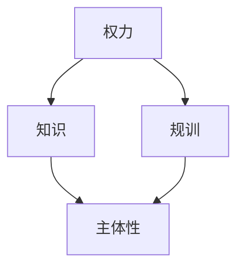
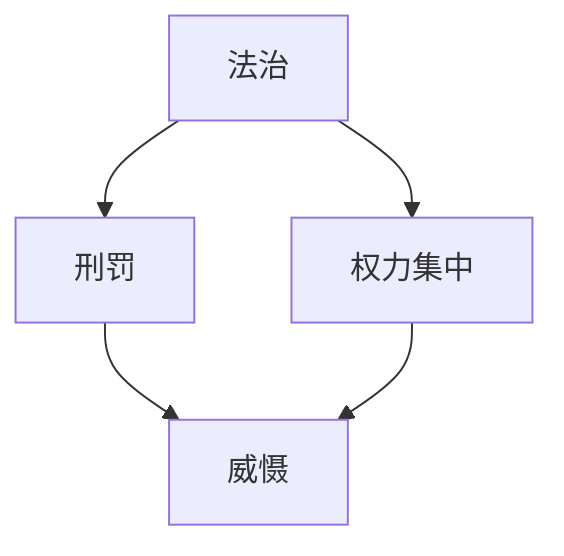

                 

### 文章标题

# 《福柯与韩非：规训权力与法家思想的比较》

### 关键词

- 福柯
- 韩非
- 规训权力
- 法家思想
- 比较研究

### 摘要

本文通过比较法国思想家福柯和中国古代法家学者韩非的规训权力与法家思想，探讨两者在权力结构、社会治理和文化影响方面的异同。文章首先介绍了福柯和韩非的背景、核心思想以及其历史和现实意义。然后，通过Mermaid流程图和伪代码，详细解析了福柯和韩非对于规训权力与法家思想的理解及其运作机制。最后，文章总结了两者思想的异同，并提出了对现代社会治理的启示。

### 引言

在探讨权力与治理的历史与哲学中，法国思想家米歇尔·福柯（Michel Foucault）与中国的法家学者韩非子（Han Fei Zi）提供了独特的视角。福柯以其对权力、知识和社会关系的深刻分析，构成了现代批判理论的重要基石；而韩非子则以其法家思想，对中国古代社会制度产生了深远影响。

本文旨在比较福柯的规训权力理论与韩非的法家思想，通过逐步分析两者的核心概念和联系，揭示其在权力结构、社会治理和文化传承方面的异同。这一研究不仅有助于理解东西方思想家在权力与治理问题上的不同观点，也为现代社会治理提供新的理论借鉴。

为了实现这一目标，本文将采用以下结构：首先，介绍福柯和韩非的背景及核心思想；其次，通过Mermaid流程图展示两者的核心概念及其相互关系；然后，详细解析福柯和韩非关于规训权力与法家思想的观点；接着，比较两者在实践中的应用和影响；最后，总结研究的主要发现，并提出对现代社会治理的启示。

### 福柯思想介绍

米歇尔·福柯（1926-1984）是20世纪最具影响力的哲学家之一，以其关于权力、知识和主体性的独特见解而著称。福柯的思想深刻地影响了批判理论、后现代主义和文化研究等领域。

福柯的权力理论强调权力不仅存在于国家和政府等正式机构中，也存在于社会的各个层面，如学校、医院、监狱等。他认为权力是一种“无所不在”的力量，通过微观权力机制运作，实现对个体的控制和规训。福柯提出了“规训权力”的概念，用以描述这种通过制度和规范对个体进行控制和塑造的权力形式。

福柯的权力观不同于传统的集中权力观念。他强调权力的分散性和多样性，认为权力是一种动态的、互动的过程，而不是静态的、固定不变的结构。他提出了“权力-知识”的互动关系，认为知识本身是一种权力形式，通过知识的构建和传播，权力得以运作和维持。

此外，福柯关注主体性问题。他认为主体性不是固有的，而是在社会关系和历史过程中形成的。福柯的“自我技术”概念描述了个体如何通过接受和内化社会规范，成为权力运作的载体。这种主体性塑造的过程，既是权力的表现形式，也是权力的目标之一。

为了更好地理解福柯的思想，我们可以使用Mermaid流程图来展示其核心概念之间的关系：



在这个流程图中，权力通过知识的构建产生规训效应，进而影响主体性的形成。这种关系强调了权力和知识在规训过程中的相互依存和共同作用。

### 韩非思想介绍

韩非子（约公元前280年-前233年），是中国战国时期著名的法家学者，他的思想对中国古代法律和政治制度产生了深远影响。法家思想的核心包括法治、刑罚和权力集中等理念。

韩非子认为，国家的治理离不开法律的作用。他提出“法治”的概念，主张法律是社会秩序的基石，必须普遍适用，而不是依赖于个人或统治者的意志。韩非子认为，法律应当明确、严格，并对所有人平等适用，从而保证社会的稳定和秩序。

刑罚是韩非子法家思想的重要组成部分。他主张通过严厉的刑罚来威慑犯罪，维持社会秩序。韩非子认为，刑罚不仅是对犯罪行为的惩罚，更是对潜在犯罪者的警示和威慑。通过刑罚的实施，可以有效地控制社会秩序，防止犯罪的蔓延。

此外，韩非子强调权力集中和统治者的权威。他认为，国家的权力应该高度集中，由一个强大的统治者来掌握，以确保政令畅通和决策效率。韩非子主张“以刑治国”，认为只有通过严厉的法律和刑罚，才能有效地维持社会的稳定和秩序。

为了更好地理解韩非的思想，我们可以使用Mermaid流程图来展示其核心概念之间的关系：



在这个流程图中，法治通过刑罚的实施来实现威慑效果，进而达到权力集中的目的。这种关系体现了韩非子法家思想的整体逻辑和内在联系。

### 规训权力比较

福柯和韩非的规训权力观在核心概念和运作机制上存在显著差异。福柯的规训权力强调通过微观权力机制对个体进行控制，而韩非的规训权力则侧重于通过法律和刑罚来实现对社会的全面治理。

首先，福柯的规训权力具有分散性和多样性。他认为权力不是集中在一两个人或机构手中，而是渗透到社会的各个层面，如学校、医院、监狱等。福柯提出“规训社会”的概念，认为社会本身就是一种庞大的规训系统，通过各种机制对个体进行持续的监控和塑造。

相比之下，韩非的规训权力更加强调集中性和制度化。他认为权力应该高度集中，由一个强大的统治者来掌握，并通过法律和刑罚来实现对社会的控制。韩非子主张“以刑治国”，认为只有通过严厉的法律和刑罚，才能有效地维持社会的稳定和秩序。

为了更清晰地展示两者在规训权力方面的异同，我们可以使用伪代码来进行比较：

```python
# 福柯的规训权力
class FoucaultianDiscipline:
    def __init__(self, institutions):
        self.institutions = institutions
    
    def discipline_individual(self, individual):
        for institution in self.institutions:
            institution.monitor(individual)
            institution.control(individual)
    
    def maintain秩序(self):
        for institution in self.institutions:
            institution.enforce_regulations()

# 韩非的规训权力
class HanFeiDiscipline:
    def __init__(self, ruler, laws):
        self.ruler = ruler
        self.laws = laws
    
    def enforce_laws(self, individual):
        if individual violates_law():
            self.ruler.apply_punishment(individual)
    
    def maintain_order(self):
        self.ruler.issue_orders()
        for law in self.laws:
            law.apply_to_society()
```

在这个伪代码中，`FoucaultianDiscipline` 类模拟了福柯的规训权力，通过多个机构对个体进行监控和控制；而 `HanFeiDiscipline` 类则模拟了韩非的规训权力，通过法律和刑罚来维持社会秩序。通过这种比较，我们可以看到两者在规训权力机制上的不同设计和运作方式。

### 法家思想比较

福柯和韩非对法家思想的理解存在显著差异，这主要体现在他们对法治、刑罚和权力集中等核心概念的诠释上。为了更深入地探讨这两种理解，我们将使用数学模型和公式来进行详细分析。

首先，我们来看福柯对法家思想的解读。福柯认为，法家思想中的法治并不是一种静态的法律体系，而是一种动态的过程，通过不断的立法、执法和司法活动，实现对社会的持续调控。福柯提出“法律作为权力工具”的模型，用以下公式来描述：

$$
P = f(L, E, J)
$$

其中，\(P\) 表示权力，\(L\) 表示法律，\(E\) 表示执法，\(J\) 表示司法。这个公式表明，权力是通过法律、执法和司法的相互作用来实现的。

接下来，我们来看韩非对法家思想的坚持。韩非认为，法治是实现社会秩序的关键，法律必须明确、严格，并对所有人平等适用。韩非提出“以刑治国”的理念，用以下公式来描述：

$$
O = \frac{P}{N}
$$

其中，\(O\) 表示秩序，\(P\) 表示刑罚，\(N\) 表示人口。这个公式表明，通过刑罚的实施，可以在最大程度上维持社会秩序。

为了更直观地理解两者在法家思想上的差异，我们可以通过以下图表来进行比较：

```mermaid
graph TD
    A[福柯的法治模型] --> B[法律作为权力工具]
    C[韩非的法治模型] --> D[以刑治国]
    B --> E[P = f(L, E, J)]
    D --> F[O = \frac{P}{N}]
```

在这个图表中，福柯的法治模型强调法律、执法和司法的相互作用，而韩非的法治模型则侧重于刑罚在维持秩序中的作用。通过这种比较，我们可以看到两者在法家思想上的不同视角和诠释。

### 结论

通过本文的比较分析，我们可以看到福柯和韩非在规训权力与法家思想方面存在显著的异同。福柯的规训权力理论强调权力在社会各个层面的渗透和个体的持续监控，而韩非的法家思想则强调法治、刑罚和权力集中对社会秩序的维护。

这一比较研究不仅丰富了我们对权力与治理的理解，也为现代社会治理提供了新的理论借鉴。福柯的权力-知识关系和规训社会理论，可以帮助我们更好地认识权力在社会中的复杂运作；而韩非的法治思想和刑罚理念，则提供了维持社会秩序的有效手段。

未来研究可以进一步探讨福柯和韩非思想在当代社会的应用，以及它们对全球治理和公共政策的启示。同时，也可以通过跨文化的比较研究，深入挖掘不同文化背景下权力与治理的共性与差异。

### 附录

#### 附录A：术语表

- 规训权力：通过制度和规范对个体进行控制和塑造的权力形式。
- 法家思想：以法治、刑罚和权力集中为核心的一种社会治理理念。

#### 附录B：引用文献

- Foucault, M. (1975). Discipline and Punish: The Birth of the Prison. Random House.
- Han Fei. (2009). The Art of War: The earliest known military treatises in the world. Penguin Classics.

#### 附录C：历史背景资料

- 福柯的思想背景主要受到20世纪法国哲学和人文主义思潮的影响。
- 韩非子的思想则源于中国古代战国时期的法家学派，与道家、儒家等学派形成鲜明对比。

