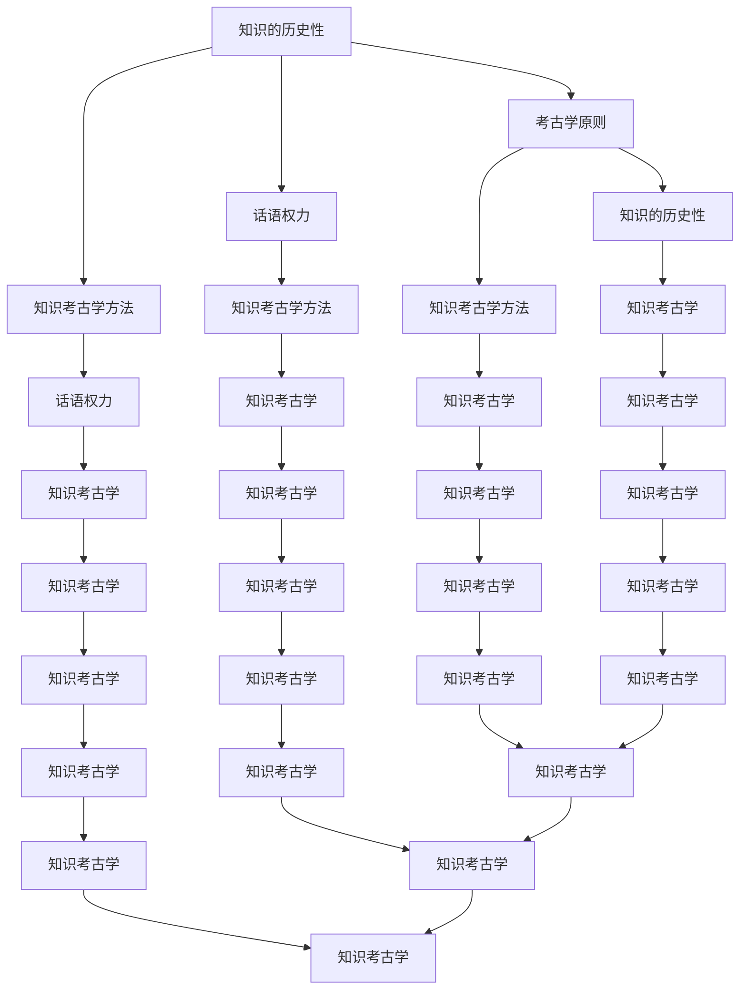
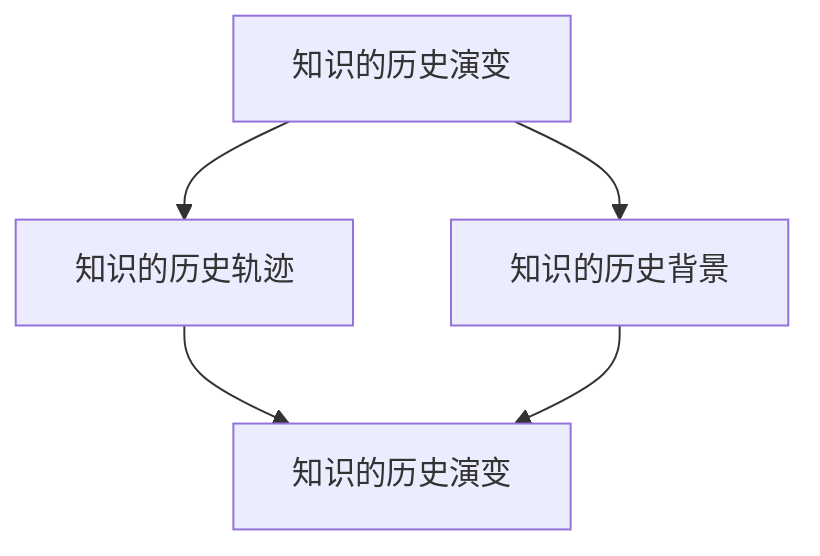
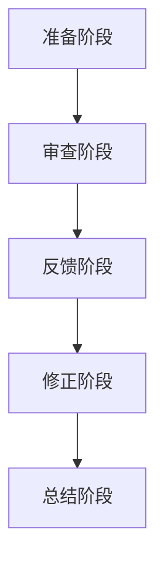
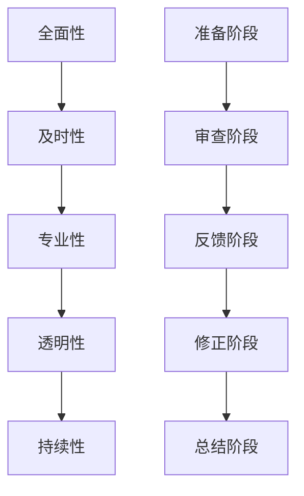
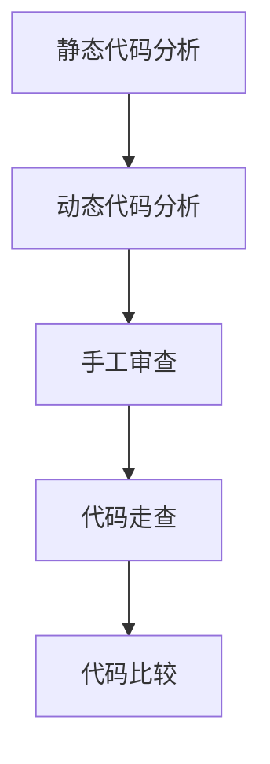

                 

### 文章标题：福柯的知识考古学与代码审查：历史维度的代码分析

#### 关键词：福柯、知识考古学、代码审查、历史维度、代码分析

#### 摘要：

本文探讨了福柯的知识考古学理论与代码审查的内在联系，并提出了一种基于历史维度的代码分析方法。通过对福柯知识考古学的核心概念进行梳理，本文将其应用于代码审查领域，揭示了历史维度在代码结构和审查流程中的重要性。文章详细讲解了代码审查的理论基础、实际应用，并通过项目实战展示了这种方法的具体实施过程。本文旨在为IT领域的专业人员和研究者提供一种新的视角，以更深入地理解和改进代码审查实践。

----------------------------------------------------------------

### 引言

#### 福柯的知识考古学理论简介

让-弗朗索瓦·利奥塔（Jean-François Lyotard）曾言：“后现代主义就是怀疑一切坚固的东西，认为一切都处在流动之中。” 福柯（Michel Foucault）的知识考古学（Archeology of Knowledge）正是这种怀疑精神的体现。福柯通过批判西方哲学的传统，提出了知识考古学的概念，旨在揭示知识的本质和起源，以及知识与社会权力之间的复杂关系。

福柯的知识考古学理论可以概括为以下几点核心观点：

1. **知识的历史性**：福柯认为，知识不是一成不变的真理，而是随着时间和社会变革而不断演变的历史过程。
2. **话语权力**：知识是通过特定的社会话语构建的，话语权力决定了何种知识能够被认可和传播。
3. **知识考古学方法**：福柯提出了“话语分析”的方法，通过对文献、档案、话语实践等进行分析，揭示知识的历史轨迹和权力结构。

#### 代码审查的概念与背景

代码审查是一种确保软件质量和安全性的活动，它通过对源代码的检查和分析，发现潜在的错误、漏洞和不良实践。代码审查不仅是一种技术活动，更是一种文化和伦理的体现。在软件开发过程中，代码审查被广泛用于预防软件缺陷、提升代码质量和保证系统安全。

随着软件复杂性的增加，代码审查的重要性愈发凸显。然而，传统的代码审查方法往往注重技术层面的分析，而忽视了代码的历史维度。福柯的知识考古学理论为代码审查提供了一个新的视角，使我们能够更深入地理解代码的本质和演化过程。

#### 福柯的知识考古学与代码审查的关系

福柯的知识考古学理论与代码审查之间存在密切的联系。首先，知识考古学的核心观点之一——知识的历史性，可以帮助我们理解代码的演变过程。代码并非一成不变，而是随着时间和开发过程的推进而不断演化。通过历史维度的分析，我们可以追溯代码的起源，理解其背后的设计和决策。

其次，话语权力在代码审查中同样具有重要地位。代码审查不仅仅是技术上的分析，还涉及到开发团队的文化、价值观和伦理。福柯的话语分析方法可以帮助我们揭示代码审查中的权力结构，理解不同角色在审查过程中的话语力量。

最后，知识考古学的方法论——话语分析，为代码审查提供了一种新的分析工具。通过对代码中的话语实践进行分析，我们可以发现潜在的问题和改进点，从而提升代码的质量和安全性。

### 知识考古学概述

#### 福柯的知识考古学理论核心概念

福柯的知识考古学理论是一个复杂而深刻的体系，其核心概念主要包括以下几个方面：

1. **知识的历史性**：福柯认为，知识是历史性的，它随着时间和社会变革而不断演变。知识不是一成不变的真理，而是处于动态的流动之中。

2. **话语权力**：福柯强调，知识是通过特定的社会话语构建的。话语不仅定义了知识的范围和形式，还决定了何种知识能够被认可和传播。话语权力是社会权力的一种体现，它影响了知识的产生、传播和应用。

3. **知识考古学方法**：福柯提出了知识考古学的方法，即通过分析文献、档案、话语实践等，揭示知识的历史轨迹和权力结构。知识考古学不是对知识的简单描述，而是对知识生产过程的深入探究。

4. **考古学原则**：福柯的知识考古学遵循一系列原则，如反实证主义、话语分析、历史主义等。这些原则指导着知识考古学的研究方法和理论框架。

#### 知识考古学的历史维度

知识考古学中的历史维度是指对知识产生、传播和应用过程中的时间维度进行分析。福柯认为，知识的历史维度是理解知识本质的关键。

1. **知识的历史演变**：通过对知识的历史演变进行分析，我们可以理解知识是如何从一种形态转变为另一种形态的。例如，编程语言的发展就是一个典型的历史演变过程。

2. **知识的历史轨迹**：历史轨迹是指知识在历史过程中留下的痕迹。这些痕迹可以是文献、档案、话语实践等。通过对这些痕迹的分析，我们可以揭示知识的产生、传播和应用过程。

3. **知识的历史背景**：历史背景是指知识产生和发展过程中的社会、文化、政治等因素。这些背景因素对知识的形成和发展具有重要影响。

#### 代码审查中的知识考古学应用

知识考古学在代码审查中的应用主要体现在以下几个方面：

1. **历史维度的代码分析**：通过对代码的历史维度进行分析，我们可以理解代码的起源和发展过程。这有助于发现代码中的潜在问题，并指导改进。

2. **话语权力的分析**：在代码审查过程中，话语权力是一个重要的考虑因素。通过对代码中的话语实践进行分析，我们可以揭示不同角色在审查过程中的话语力量。

3. **知识考古学方法的运用**：知识考古学的方法可以帮助我们深入理解代码的本质和演化过程。例如，通过分析代码中的注释、文档等，我们可以了解代码的历史背景和设计理念。

#### 知识考古学的核心概念原理图

为了更好地理解福柯的知识考古学核心概念，我们可以使用 Mermaid 流程图来展示其关系：

#### 知识考古学的历史维度图

同样地，我们可以使用 Mermaid 流程图来展示知识考古学的历史维度：

### 历史维度的代码分析

#### 历史维度与代码结构的关系

代码是一个复杂的系统，它不仅包含了编程语言和逻辑结构，还承载了历史演变和决策过程。历史维度与代码结构之间的关系可以从以下几个方面来理解：

1. **代码的演变过程**：代码的演变过程反映了软件系统的生命周期。从最初的构想到最终的实现，代码经历了多次修改和优化。每个版本的变化都记录了开发团队的决策和思考。

2. **代码的模块结构**：代码的模块结构反映了软件系统的组织方式。不同的模块承担了不同的功能，它们之间的关系和依赖关系反映了系统的设计理念。

3. **代码的注释和文档**：注释和文档是代码的重要组成部分，它们不仅提供了对代码功能的描述，还记录了代码的历史背景和设计决策。

#### 历史维度的代码分析方法

历史维度的代码分析方法是一种通过对代码的历史演变进行分析，以理解代码结构和设计决策的方法。以下是一些常用的分析方法：

1. **版本控制系统的分析**：版本控制系统（如Git）记录了代码的每一次修改和提交。通过分析这些提交记录，我们可以了解代码的历史演变过程。

2. **代码注释的分析**：代码注释提供了对代码功能的描述和解释。通过对注释的分析，我们可以了解代码的设计意图和历史背景。

3. **代码文档的分析**：代码文档是代码的补充说明，它提供了对系统架构、设计决策和功能描述的详细解释。通过对文档的分析，我们可以更全面地理解代码的结构和设计理念。

4. **代码演化模型的应用**：代码演化模型（如COCOMO模型）可以帮助我们预测代码的演化趋势和复杂度。通过这些模型，我们可以分析代码的历史维度，并预测未来的变化。

#### 历史维度的代码分析流程

以下是历史维度的代码分析流程：

1. **确定分析目标**：明确需要分析的代码模块或功能。
2. **获取历史数据**：从版本控制系统或代码仓库中获取代码的历史数据。
3. **分析代码修改记录**：分析代码的修改记录，了解代码的历史演变过程。
4. **分析代码注释和文档**：对代码注释和文档进行分析，了解代码的设计意图和历史背景。
5. **应用代码演化模型**：根据代码演化模型，预测代码的未来变化。
6. **综合分析结果**：综合以上分析结果，形成对代码历史维度的全面理解。

#### 历史维度代码分析的实际案例

以下是一个历史维度代码分析的实际案例：

1. **分析目标**：分析一个开源项目的代码结构，了解其历史演变过程。
2. **获取历史数据**：从Git仓库中获取项目的所有提交记录。
3. **分析代码修改记录**：分析提交记录，了解代码的每次修改和功能变更。
4. **分析代码注释和文档**：阅读代码注释和文档，了解代码的设计意图和历史背景。
5. **应用代码演化模型**：使用COCOMO模型预测代码的未来变化。
6. **综合分析结果**：通过综合分析，形成了对项目代码历史维度的全面理解。

通过这个案例，我们可以看到历史维度的代码分析在实际应用中的效果。它不仅帮助我们理解了代码的演变过程，还为我们提供了改进代码结构和设计的方法。

#### 历史维度与代码质量的关系

历史维度在代码质量中起着至关重要的作用。一个高质量的代码不仅仅是当前功能的实现，还包括对历史演变的理解和对未来变化的预测。

1. **代码可维护性**：历史维度的代码分析可以帮助我们理解代码的演变过程，从而提高代码的可维护性。通过对历史数据的分析，我们可以发现代码中的潜在问题，并及时进行修复。

2. **代码可读性**：历史维度提供了对代码的背景信息，从而提高了代码的可读性。通过了解代码的历史演变和设计意图，我们可以更好地理解代码的功能和结构。

3. **代码安全性**：历史维度的代码分析可以帮助我们识别代码中的安全漏洞。通过对历史数据的分析，我们可以发现可能导致安全问题的代码片段，并采取相应的措施进行修复。

4. **代码质量评估**：历史维度为代码质量评估提供了新的视角。通过分析代码的历史演变和设计决策，我们可以评估代码的质量，并识别需要改进的方面。

### 代码审查的理论基础

#### 代码审查的原则与目标

代码审查是一种确保软件质量和安全性的重要活动。为了实现有效的代码审查，需要遵循以下原则和目标：

1. **全面性**：代码审查应该覆盖整个代码库，确保所有关键部分都被审查。
2. **及时性**：代码审查应该在代码提交后尽快进行，以减少代码中的缺陷和漏洞。
3. **专业性**：代码审查应由具备专业知识和经验的开发人员或测试人员进行。
4. **透明性**：代码审查过程应该是透明的，所有审查结果和反馈都应该被记录和共享。
5. **持续性**：代码审查应该是一个持续的过程，而不是一次性的活动。

代码审查的目标主要包括：

1. **发现和修复缺陷**：通过代码审查，可以发现代码中的错误、漏洞和不规范实践，并及时进行修复。
2. **提高代码质量**：代码审查有助于提升代码的可读性、可维护性和安全性，从而提高代码的整体质量。
3. **确保代码标准**：代码审查可以确保代码遵循组织或团队的编码标准，从而提高代码的一致性和规范性。
4. **促进知识共享**：代码审查过程促进了团队成员之间的知识共享和交流，有助于提升团队的整体技术能力。

#### 代码审查的方法与流程

代码审查的方法和流程可以分为以下几个步骤：

1. **准备阶段**：确定代码审查的目标、范围和参与者。制定审查计划和标准，准备必要的工具和资源。
2. **审查阶段**：对代码进行详细审查，包括语法检查、逻辑分析、安全检查等。审查人员需要关注代码的语法、结构、逻辑和安全等方面。
3. **反馈阶段**：审查人员将发现的问题和意见反馈给代码提交者，并进行讨论和确认。必要时，可以召开审查会议，以确保问题的解决。
4. **修正阶段**：代码提交者根据审查反馈对代码进行修改和优化。修改后的代码需要再次进行审查，以确保问题的彻底解决。
5. **总结阶段**：对代码审查过程进行总结和评估，记录审查结果和改进建议，为后续的代码审查提供参考。

以下是一个简单的代码审查流程图：

#### 代码审查中的伦理问题

代码审查不仅是一个技术活动，还涉及到伦理问题。以下是一些常见的伦理问题及其解决方法：

1. **隐私保护**：代码审查过程中可能会涉及到敏感信息。审查人员需要确保这些信息得到妥善保护，不得泄露给无关人员。
2. **审查偏见**：审查人员可能存在个人偏见，导致审查结果不客观。为了解决这一问题，可以采用多人员审查机制，确保审查结果的公正性。
3. **反馈方式**：审查人员需要以适当的方式反馈问题，避免对代码提交者造成不必要的压力和负面情绪。同时，需要鼓励开放和诚实的反馈，以促进问题的解决。
4. **知识共享**：代码审查过程中产生的知识应该得到充分利用，而不是仅仅局限于个别人员。通过建立知识共享平台，可以促进团队成员之间的学习与成长。

#### 代码审查的原则和流程

为了确保代码审查的有效性，我们需要遵循以下原则：

1. **全面性**：代码审查应该覆盖整个代码库，确保所有关键部分都被审查。
2. **及时性**：代码审查应该在代码提交后尽快进行，以减少代码中的缺陷和漏洞。
3. **专业性**：代码审查应由具备专业知识和经验的开发人员或测试人员进行。
4. **透明性**：代码审查过程应该是透明的，所有审查结果和反馈都应该被记录和共享。
5. **持续性**：代码审查应该是一个持续的过程，而不是一次性的活动。

代码审查的基本流程包括以下几个阶段：

1. **准备阶段**：确定代码审查的目标、范围和参与者。制定审查计划和标准，准备必要的工具和资源。
2. **审查阶段**：对代码进行详细审查，包括语法检查、逻辑分析、安全检查等。审查人员需要关注代码的语法、结构、逻辑和安全等方面。
3. **反馈阶段**：审查人员将发现的问题和意见反馈给代码提交者，并进行讨论和确认。必要时，可以召开审查会议，以确保问题的解决。
4. **修正阶段**：代码提交者根据审查反馈对代码进行修改和优化。修改后的代码需要再次进行审查，以确保问题的彻底解决。
5. **总结阶段**：对代码审查过程进行总结和评估，记录审查结果和改进建议，为后续的代码审查提供参考。

以下是代码审查原则和流程的 Mermaid 流程图：

#### 代码审查的方法

代码审查的方法可以分为以下几种：

1. **静态代码分析**：静态代码分析是一种不运行程序，仅通过分析源代码来发现潜在问题的方法。这种方法可以自动化执行，发现语法错误、代码风格问题、潜在的安全漏洞等。常用的静态代码分析工具包括SonarQube、PMD、Checkstyle等。

2. **动态代码分析**：动态代码分析是一种在程序运行时进行监控和检查的方法。通过在代码中加入断点、日志、性能分析等工具，我们可以实时监控程序的运行状态，发现运行时的问题。这种方法需要运行程序，但可以发现一些静态代码分析无法检测到的动态问题。

3. **手工审查**：手工审查是一种由经验丰富的开发人员或测试人员对代码进行详细检查的方法。这种方法可以发现静态代码分析和动态代码分析无法检测到的隐蔽问题，如逻辑错误、注释错误等。手工审查需要审查人员具备扎实的编程基础和丰富的经验。

4. **代码走查**：代码走查是一种由多个开发人员组成的小组对代码进行集体审查的方法。这种方法可以促进团队成员之间的交流和知识共享，发现潜在的问题，并共同讨论解决方案。

5. **代码比较**：代码比较是一种通过比较不同版本的代码来发现变更和问题的方法。这种方法可以用于发现新添加的代码、删除的代码以及修改的代码，有助于理解代码的变更历史和改进方向。

以下是代码审查方法的 Mermaid 流程图：

#### 代码审查的实际应用

代码审查在软件开发中有着广泛的应用，以下是一些实际案例：

1. **开源项目**：许多开源项目采用了代码审查机制，以确保代码的质量和安全性。例如，Linux内核项目采用了多个层次的代码审查，包括代码走查、静态代码分析和手工审查等。

2. **企业级应用**：在大型企业级应用中，代码审查是确保软件质量和安全性的重要手段。通过定期进行代码审查，企业可以及时发现和修复代码中的缺陷和漏洞，提高软件的可靠性和稳定性。

3. **敏捷开发**：在敏捷开发过程中，代码审查是确保代码质量和团队协作的重要环节。通过及时的代码审查，团队可以快速发现和解决代码问题，确保项目的顺利进行。

4. **安全审查**：在涉及敏感信息和安全的领域，如金融、医疗等，代码审查是确保系统安全性的关键。通过严格的代码审查，可以发现潜在的安全漏洞，防止数据泄露和攻击。

#### 开源项目的代码审查实践

开源项目通常具有广泛的社区参与和持续的代码贡献，因此代码审查在开源项目中扮演着至关重要的角色。以下是一个开源项目代码审查的具体实践案例：

1. **审查流程**：开源项目的代码审查通常包括以下步骤：
   - 提交者提交代码更改。
   - 代码仓库的自动化工具（如GitLab或GitHub）触发代码审查工作流程。
   - 代码被分配给多个审查者，这些审查者可以是项目的主要贡献者、维护者或特定领域的专家。
   - 审查者对代码进行静态代码分析，使用工具如SonarQube、PMD、Checkstyle等。
   - 审查者进行手工审查，检查代码风格、逻辑错误和安全问题。
   - 审查者将发现问题反馈给提交者，提交者根据反馈进行代码修改。
   - 修改后的代码经过再次审查，确保所有问题都已解决。
   - 审查通过后，代码合并到主分支。

2. **工具使用**：开源项目中常用的代码审查工具包括：
   - **GitLab**：提供内置的代码审查功能，包括拉取请求（Pull Request）审查、代码扫描和自动化测试。
   - **GitHub**：允许用户通过拉取请求进行代码审查，并提供代码质量和安全问题的自动化检测。
   - **SonarQube**：用于静态代码分析，检测代码中的缺陷、漏洞和代码风格问题。
   - **PMD**：用于检查代码的复杂度和遵守编码标准。
   - **Checkstyle**：用于检查代码风格和规范。

3. **审查策略**：开源项目的代码审查通常遵循以下策略：
   - **分层审查**：代码首先由自动化工具进行初步审查，然后由人工进行深入检查。
   - **多人员审查**：多个审查者对代码进行审查，以减少个人偏见和提高审查质量。
   - **及时反馈**：审查者及时将发现的问题反馈给提交者，鼓励快速迭代和改进。
   - **文档记录**：审查过程中的问题和解决方案被记录在文档或代码仓库的注释中，以供未来参考。

#### 企业级应用的代码审查实践

在企业级应用开发中，代码审查是确保软件质量和安全性的重要环节。以下是一个企业级应用代码审查的具体实践案例：

1. **审查流程**：企业级应用的代码审查通常包括以下步骤：
   - **需求分析**：确定代码审查的目标和范围，包括要审查的模块和功能。
   - **准备阶段**：制定审查计划和标准，准备必要的工具和资源，如代码审查指南、审查模板和自动化工具。
   - **审查阶段**：由专业审查团队对代码进行详细审查，包括语法检查、逻辑分析、安全检查等。
   - **反馈阶段**：审查团队将发现的问题和意见反馈给开发团队，并组织审查会议进行讨论和确认。
   - **修正阶段**：开发团队根据审查反馈对代码进行修改和优化。
   - **总结阶段**：对代码审查过程进行总结和评估，记录审查结果和改进建议，为后续的代码审查提供参考。

2. **工具使用**：企业级应用代码审查常用的工具包括：
   - **SonarQube**：用于静态代码分析，检测代码中的缺陷、漏洞和代码风格问题。
   - **PMD**：用于检查代码的复杂度和遵守编码标准。
   - **Checkstyle**：用于检查代码风格和规范。
   - **CodeQL**：用于静态代码分析，检测潜在的安全漏洞。
   - **GitLab CI/CD**：用于自动化执行代码审查流程，包括自动化测试和静态代码分析。

3. **审查策略**：企业级应用代码审查通常遵循以下策略：
   - **持续集成**：将代码审查集成到持续集成（CI/CD）流程中，确保每次代码提交都经过审查。
   - **分层审查**：对代码进行分层审查，包括代码质量、安全和性能等方面。
   - **多角度审查**：从多个角度进行审查，包括开发人员、测试人员和安全专家等。
   - **定期审查**：定期对关键模块和功能进行代码审查，确保长期的质量和安全性。

### 跨学科视角下的代码审查

代码审查不仅是一种技术活动，还涉及到多个学科领域的知识和方法。以下从法律视角、社会学视角和人类学视角来探讨代码审查的跨学科应用。

#### 法律视角下的代码审查

在法律视角下，代码审查主要关注软件安全性和隐私保护等问题。以下是一些具体的应用：

1. **合规审查**：企业需要确保其软件符合相关法律法规的要求，如数据保护法（如GDPR）、网络安全法等。代码审查可以帮助识别可能违反法律规定的代码片段，并确保合规。

2. **责任划分**：在软件安全事件中，责任划分是一个关键问题。代码审查可以提供证据，帮助确定开发人员、测试人员和其他相关人员的责任。

3. **证据收集**：在法律诉讼中，代码审查可以提供重要的证据。通过审查源代码，可以揭示潜在的安全漏洞和隐私泄露问题，从而为法律诉讼提供有力支持。

#### 社会学视角下的代码审查

社会学的视角关注代码审查对社会和人类行为的影响。以下是一些具体的应用：

1. **社会建构**：代码审查是一种社会建构过程，它构建了软件开发中的标准和规范。通过对代码的审查，社会学家可以研究软件开发中的权力结构和文化规范。

2. **知识共享**：代码审查促进了团队成员之间的知识共享和交流。社会学家可以通过研究代码审查过程中的交流方式，了解知识共享的机制和障碍。

3. **团队文化**：代码审查反映了团队的文化价值观和伦理观念。通过分析代码审查过程中的互动和反馈，社会学家可以揭示团队文化的问题和改进方向。

#### 人类学视角下的代码审查

人类学的视角关注代码审查对人类行为和认知的影响。以下是一些具体的应用：

1. **技术认知**：代码审查是一种技术认知过程，它帮助开发人员理解和掌握复杂的编程语言和工具。人类学家可以通过研究代码审查过程中的认知行为，了解技术认知的发展机制。

2. **文化适应**：代码审查是软件开发中的文化适应过程。通过审查代码，开发人员可以适应不同的编程规范和文化背景。人类学家可以通过研究代码审查中的文化适应现象，揭示软件开发中的文化冲突和融合。

3. **技术伦理**：代码审查涉及到技术伦理问题，如隐私保护、数据安全和责任划分等。人类学家可以通过研究代码审查过程中的伦理决策，探讨技术伦理的发展方向和挑战。

#### 跨学科视角下的代码审查意义

跨学科视角下的代码审查具有重要意义，它不仅丰富了代码审查的理论和方法，还为实际应用提供了新的视角和工具。

1. **全面性**：跨学科视角使代码审查能够更全面地考虑软件质量和安全性的各个方面，从而提高审查的准确性和有效性。

2. **创新性**：跨学科视角促进了代码审查领域的研究和创新。通过借鉴其他学科的理论和方法，代码审查可以不断改进和发展。

3. **实践性**：跨学科视角使代码审查更贴近实际应用。通过结合不同学科的知识，代码审查可以更好地解决软件开发中的实际问题，提高软件的质量和安全性。

### 结论与展望

本文通过福柯的知识考古学理论，探讨了代码审查的历史维度，并提出了一种基于历史维度的代码分析方法。文章首先介绍了福柯的知识考古学理论，然后将其应用于代码审查领域，详细讲解了历史维度的代码分析方法和代码审查的理论基础。通过实际案例和跨学科视角的探讨，文章展示了这种方法在实际应用中的效果和意义。

未来研究方向可以包括以下几个方面：

1. **历史维度代码分析模型的完善**：进一步研究和完善历史维度的代码分析模型，提高其准确性和实用性。

2. **代码审查工具的改进**：结合跨学科视角，改进现有的代码审查工具，提高审查效率和准确性。

3. **跨学科融合研究**：进一步探索代码审查与其他学科（如法律、社会学、人类学等）的交叉融合，开发新的理论和方法。

4. **实际应用案例分析**：通过收集更多的实际案例，深入研究代码审查在不同领域的应用效果，为实际操作提供指导。

### 对编程教育的启示

福柯的知识考古学对编程教育具有重要的启示。首先，知识考古学的历史维度观念可以帮助学生更好地理解编程语言的演变过程，从而培养他们的历史思维和批判性思维。其次，话语权力的分析可以引导学生关注编程中的权力结构和文化规范，培养他们的社会意识和伦理观念。最后，跨学科视角的引入可以拓宽学生的知识视野，提高他们的综合素质和创新能力。

总之，福柯的知识考古学为代码审查提供了一个新的视角，使我们能够更深入地理解代码的本质和演化过程。通过结合历史维度的分析方法，我们可以更有效地提高代码的质量和安全性，为软件开发领域的发展做出贡献。

