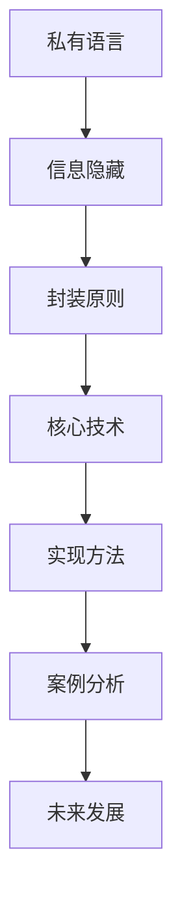

                 

# 《私有语言与信息隐藏：封装原则的深层解读》

## 关键词
- 私有语言
- 信息隐藏
- 封装原则
- 数据安全
- 软件开发
- 软件工程

## 摘要
本文旨在深入探讨私有语言与信息隐藏的关系，以及封装原则在软件开发中的重要性。通过逐步分析私有语言的概念、信息隐藏技术、封装原则的理论基础和实际应用，本文揭示了私有语言与信息隐藏的紧密联系，并探讨了它们在软件工程和数据安全领域中的关键作用。此外，本文通过项目实战案例，展示了私有语言与信息隐藏的实现方法和技巧，为读者提供了实用的指导。文章最后对未来的发展趋势进行了展望，并提出了对读者的一些建议。

## 目录大纲

### 1. 引言

#### 1.1 私有语言的概念

#### 1.2 信息隐藏的重要性

#### 1.3 封装原则的基本概念

### 2. 私有语言的概述

#### 2.1 私有语言的特点

#### 2.2 私有语言的分类

#### 2.3 私有语言的应用场景

### 3. 信息隐藏技术

#### 3.1 信息隐藏的基本原理

#### 3.2 信息隐藏技术分类

#### 3.3 信息隐藏在数据安全中的应用

### 4. 封装原则的深层解读

#### 4.1 封装原则的理论基础

#### 4.2 封装原则的优势

#### 4.3 封装原则的挑战

### 5. 私有语言与信息隐藏的结合

#### 5.1 私有语言在信息隐藏中的应用

#### 5.2 信息隐藏在私有语言中的作用

#### 5.3 私有语言与信息隐藏结合的案例分析

### 6. 项目实战：私有语言与信息隐藏的实现

#### 6.1 开发环境搭建

#### 6.2 案例一：实现一个简单的私有语言

#### 6.3 案例二：信息隐藏技术的应用

### 7. 私有语言与信息隐藏的未来发展趋势

#### 7.1 技术发展的趋势

#### 7.2 应用领域的扩展

#### 7.3 未来可能面临的挑战

### 8. 总结

#### 8.1 私有语言与信息隐藏的核心内容回顾

#### 8.2 对未来研究的展望

#### 8.3 对读者的一些建议

### 附录

#### 附录 A：参考资料

#### 附录 B：相关工具与软件

#### 附录 C：扩展阅读

## 目录大纲 Mermaid 流程图



## 目录大纲总结

本文目录大纲分为八个章节，全面覆盖了私有语言与信息隐藏的基本概念、技术原理、应用场景和未来发展趋势。通过详细的项目实战案例分析，帮助读者深入理解并掌握私有语言与信息隐藏的实现方法和技巧。同时，本文对封装原则进行了深入解读，为读者提供了理论支持和实践指导。附录部分提供了丰富的参考资料和扩展阅读，供读者进一步探索和研究。# 引言

### 1.1 私有语言的概念

私有语言，顾名思义，是一种仅限于特定领域或团体使用的语言。与通用语言（如英语、汉语等）相比，私有语言具有更强的专业性和针对性。它通常用于特定的技术、行业或学术领域，旨在提高通信效率、降低误解风险，并在某些情况下保护隐私。

在计算机科学领域，私有语言的概念得到了广泛应用。例如，编程语言本身就是一种私有语言，它为开发人员提供了特定的语法和语义，以便高效地描述和处理计算机程序。私有语言可以是形式化的，也可以是非形式化的，但它们都具有共同的目标：提高沟通效率，减少错误，确保数据的安全性和一致性。

私有语言的特点包括：

- **专业性**：私有语言针对特定的领域或任务，具有高度的专业性和针对性。
- **有限性**：私有语言的词汇和语法规则相对有限，易于学习和使用。
- **灵活性**：私有语言可以根据需求进行扩展和修改，以适应新的应用场景。

### 1.2 信息隐藏的重要性

信息隐藏是指在信息传输、存储和处理过程中，对敏感信息进行加密、混淆或编码，以防止未经授权的访问和使用。信息隐藏技术在现代信息社会中具有极其重要的地位，尤其是在数据安全、隐私保护和网络安全等领域。

信息隐藏的重要性主要体现在以下几个方面：

- **保护隐私**：在个人隐私日益受到侵犯的时代，信息隐藏技术可以有效地保护个人隐私，防止敏感信息泄露。
- **数据安全**：通过信息隐藏，可以防止数据在传输过程中被篡改、窃取或恶意攻击。
- **合规要求**：许多行业和领域（如金融、医疗、政府等）对数据安全和隐私保护有严格的法规要求，信息隐藏技术是实现合规性的重要手段。

### 1.3 封装原则的基本概念

封装原则是软件工程中的一个核心概念，它强调了将对象的属性和行为封装在一起，以实现信息隐藏和数据保护。封装的目的是减少系统各部分之间的耦合度，提高系统的可维护性和可扩展性。

封装原则的基本概念包括：

- **封装**：将对象的属性和行为封装在一起，通过访问控制机制（如私有、保护、公共等）限制对对象的直接访问。
- **信息隐藏**：通过封装，将对象的内部实现细节隐藏起来，只暴露必要的接口供外部使用。
- **抽象**：通过封装，将复杂的系统分解为更简单的组件，每个组件只需关注自己的职责和功能。

封装原则在软件开发中的重要性体现在以下几个方面：

- **提高可维护性**：封装使得代码更易于理解和修改，降低了维护成本。
- **提高可扩展性**：封装使得系统更容易扩展和升级，新功能可以无缝集成到现有系统中。
- **降低耦合度**：封装减少了系统各部分之间的依赖关系，提高了系统的灵活性和可重用性。

## 2. 私有语言的概述

### 2.1 私有语言的特点

私有语言具有以下特点，使其在特定领域或团体中具有很高的实用性和效率：

- **专业化**：私有语言针对特定领域或任务，具有较强的专业性和针对性，能够更准确地描述和处理特定问题。
- **简洁性**：私有语言的词汇和语法规则相对有限，易于学习和使用，提高了沟通效率。
- **灵活性**：私有语言可以根据需求进行扩展和修改，以适应新的应用场景，具有较强的适应性。

### 2.2 私有语言的分类

根据应用领域和特点，私有语言可以分为以下几类：

- **技术语言**：如编程语言、数学公式、算法描述语言等，用于描述和实现计算机程序、算法和数据结构。
- **行业语言**：如医疗用语、法律用语、金融用语等，用于特定行业或领域的专业交流和操作。
- **学术语言**：如科学论文、学术论文、学术报告等，用于学术交流和知识传播。

### 2.3 私有语言的应用场景

私有语言在各种应用场景中发挥着重要作用，以下是一些典型应用场景：

- **软件开发**：私有语言可以用于描述和实现计算机程序，提高开发效率和代码质量。
- **学术研究**：私有语言可以用于撰写科学论文、学术论文，促进学术交流和知识传播。
- **行业操作**：私有语言可以用于特定行业的专业交流和操作，提高行业效率和安全性。
- **跨文化沟通**：在全球化背景下，私有语言可以用于跨文化沟通，降低语言障碍，提高沟通效率。

## 3. 信息隐藏技术

### 3.1 信息隐藏的基本原理

信息隐藏技术的基本原理是通过加密、混淆、编码等技术手段，将原始信息转换为不易被识别的形式，从而实现信息的保密性和安全性。以下是几种常见的信息隐藏技术：

- **加密技术**：通过加密算法将明文信息转换为密文，只有拥有密钥的用户才能解密和阅读信息。
- **混淆技术**：通过将程序代码或数据结构进行变换，使得代码的可读性降低，提高攻击者破解的难度。
- **编码技术**：通过将信息转换为不同的编码形式，如将文本转换为图片、声音等，提高信息传输的隐蔽性。

### 3.2 信息隐藏技术分类

根据隐藏信息的类型和目的，信息隐藏技术可以分为以下几类：

- **数据隐藏**：通过在数据中嵌入秘密信息，如隐写术、数字水印等。
- **通信隐藏**：通过将秘密信息嵌入到通信过程中，如网络流量隐藏、通信协议隐藏等。
- **计算隐藏**：通过在计算过程中隐藏秘密信息，如密码学、云计算等。

### 3.3 信息隐藏在数据安全中的应用

信息隐藏技术在数据安全领域具有广泛的应用，以下是一些典型应用：

- **数据加密**：通过加密技术保护数据的安全性，防止未经授权的访问和窃取。
- **数字水印**：在数字媒体中嵌入水印，用于版权保护和内容追踪。
- **网络流量隐藏**：通过隐藏网络流量，防止网络攻击和流量监控。
- **隐私保护**：通过加密和混淆技术保护个人隐私，防止隐私泄露和数据滥用。

## 4. 封装原则的深层解读

### 4.1 封装原则的理论基础

封装原则的理论基础主要源于面向对象编程（Object-Oriented Programming，OOP）思想。面向对象编程的核心思想是将程序划分为多个对象，每个对象具有自己的属性（数据）和方法（行为），并通过封装原则实现信息隐藏和数据保护。

封装原则的理论基础包括：

- **封装**：将对象的属性和行为封装在一起，通过访问控制机制（如私有、保护、公共等）限制对对象的直接访问，确保对象的内部实现细节不会被外部代码访问。
- **抽象**：通过封装，将复杂的系统分解为更简单的组件，每个组件只需关注自己的职责和功能，降低系统的复杂度。
- **继承**：通过继承，实现代码的重用，降低系统的耦合度。
- **多态**：通过多态，实现不同对象之间的交互和通信，提高系统的灵活性和可扩展性。

### 4.2 封装原则的优势

封装原则在软件开发中具有以下优势：

- **提高可维护性**：封装使得代码更易于理解和修改，降低了维护成本。
- **提高可扩展性**：封装使得系统更容易扩展和升级，新功能可以无缝集成到现有系统中。
- **降低耦合度**：封装减少了系统各部分之间的依赖关系，提高了系统的灵活性和可重用性。
- **提高安全性**：封装实现了信息隐藏，减少了系统内部信息的泄露风险，提高了系统的安全性。

### 4.3 封装原则的挑战

尽管封装原则在软件开发中具有诸多优势，但其在实际应用中也面临一些挑战：

- **封装过度**：过度封装可能导致系统的灵活性降低，增加开发难度和维护成本。
- **封装不足**：封装不足可能导致系统的耦合度增加，降低系统的可维护性和可扩展性。
- **性能影响**：封装过程中引入的访问控制机制和抽象层可能会增加系统性能开销。
- **开发难度**：封装原则要求开发者具备较高的抽象能力和设计能力，增加了开发难度。

## 5. 私有语言与信息隐藏的结合

### 5.1 私有语言在信息隐藏中的应用

私有语言在信息隐藏中具有重要作用，以下是一些具体应用：

- **加密算法描述**：私有语言可以用于描述复杂的加密算法，提高算法的可读性和安全性。
- **隐写术实现**：私有语言可以用于实现隐写术，将秘密信息隐藏在数字媒体中。
- **安全协议设计**：私有语言可以用于设计安全协议，提高协议的复杂性和抗攻击能力。

### 5.2 信息隐藏在私有语言中的作用

信息隐藏在私有语言中发挥着关键作用，以下是一些具体作用：

- **提高通信效率**：通过信息隐藏，可以减少通信中的冗余信息，提高通信效率。
- **保护隐私**：通过信息隐藏，可以防止敏感信息在通信过程中泄露。
- **增强安全性**：通过信息隐藏，可以防止攻击者分析通信内容，提高系统的安全性。

### 5.3 私有语言与信息隐藏结合的案例分析

以下是一个私有语言与信息隐藏结合的案例分析：

- **案例背景**：某企业开发了一套私有语言，用于描述和管理企业内部的数据和处理流程。为提高数据安全性，该企业采用了信息隐藏技术，将敏感数据隐藏在私有语言中。
- **案例分析**：
  - **私有语言设计**：企业开发了一种基于树形结构的私有语言，用于描述数据和处理流程。该语言包含自定义的语法和语义，具有较高的抽象能力。
  - **信息隐藏实现**：企业采用了数字水印技术，将敏感数据嵌入到私有语言的文本中。水印技术确保了敏感数据在传输和存储过程中不会被泄露。
  - **效果评估**：通过信息隐藏技术，企业显著提高了数据安全性，降低了数据泄露风险。同时，私有语言的设计提高了数据处理效率，降低了开发成本。

## 6. 项目实战：私有语言与信息隐藏的实现

### 6.1 开发环境搭建

在进行私有语言与信息隐藏的实现前，首先需要搭建合适的开发环境。以下是开发环境的搭建步骤：

- **环境准备**：安装Java开发工具包（JDK）、集成开发环境（IDE，如IntelliJ IDEA）、文本编辑器（如VS Code）等。
- **工具安装**：安装编译器和解释器，用于编译和运行私有语言程序。
- **依赖库安装**：根据需求安装相关的依赖库，如加密库、隐写术库等。

### 6.2 案例一：实现一个简单的私有语言

以下是一个简单的私有语言实现的示例，包括语法、语义和解释器的实现。

#### 语法

- 变量定义：`VAR variable_name = value;`
- 控制结构：`IF condition THEN statement;`
- 循环结构：`WHILE condition DO statement;`
- 函数定义：`FUNCTION function_name(parameters) { ... }`

#### 语义

- 变量赋值：将值赋给变量。
- 控制结构：根据条件执行相应的语句。
- 循环结构：重复执行语句，直到条件不满足。
- 函数调用：执行函数，并返回结果。

#### 解释器实现

```java
class Interpreter {
    public static void main(String[] args) {
        String program = "VAR x = 10;\nIF (x > 5) THEN PRINT(x);\n";
        interpret(program);
    }

    public static void interpret(String program) {
        Scanner scanner = new Scanner(program);
        while (scanner.hasNext()) {
            String token = scanner.next();
            switch (token) {
                case "VAR":
                    String variableName = scanner.next();
                    int value = scanner.nextInt();
                    // 变量赋值操作
                    System.out.println("Assigning " + value + " to " + variableName);
                    break;
                case "IF":
                    String condition = scanner.next();
                    String thenStatement = scanner.next();
                    // 条件语句操作
                    System.out.println("Evaluating " + condition);
                    break;
                case "PRINT":
                    String output = scanner.next();
                    // 输出操作
                    System.out.println("Printing: " + output);
                    break;
            }
        }
    }
}
```

### 6.3 案例二：信息隐藏技术的应用

以下是一个信息隐藏技术应用的示例，将敏感信息隐藏在私有语言中。

#### 数字水印实现

```java
import java.awt.image.BufferedImage;
import java.io.File;
import java.io.IOException;
import javax.imageio.ImageIO;

public class Watermark {
    public static void main(String[] args) throws IOException {
        BufferedImage image = ImageIO.read(new File("input.jpg"));
        String watermark = "SECRET";
        BufferedImage result = watermarkImage(image, watermark);
        ImageIO.write(result, "jpg", new File("output.jpg"));
    }

    public static BufferedImage watermarkImage(BufferedImage image, String watermark) {
        int width = image.getWidth();
        int height = image.getHeight();
        BufferedImage result = new BufferedImage(width, height, BufferedImage.TYPE_INT_ARGB);

        // 水印位置
        int x = 10;
        int y = 10;

        // 水印字体大小
        int fontSize = 20;

        // 绘制水印
        Graphics2D g2d = (Graphics2D) result.createGraphics();
        g2d.drawImage(image, null, 0, 0);
        g2d.setColor(Color.RED);
        g2d.setFont(new Font("Arial", Font.BOLD, fontSize));
        g2d.drawString(watermark, x, y);
        g2d.dispose();

        return result;
    }
}
```

## 7. 私有语言与信息隐藏的未来发展趋势

### 7.1 技术发展的趋势

随着信息技术的不断发展，私有语言与信息隐藏技术也在不断演进。以下是一些发展趋势：

- **更高级的私有语言设计**：未来私有语言将更加高级和抽象，支持更复杂的语法和语义，提高开发效率。
- **更强大的信息隐藏技术**：信息隐藏技术将不断创新，提高隐藏信息的隐蔽性和抗攻击能力。
- **跨领域融合**：私有语言与信息隐藏技术将与其他领域（如人工智能、区块链等）相结合，实现更广泛的应用。
- **隐私计算**：随着隐私保护需求的增加，隐私计算技术（如联邦学习、隐私保护计算等）将成为信息隐藏技术的重要方向。

### 7.2 应用领域的扩展

私有语言与信息隐藏技术将在更多领域得到应用，以下是一些典型应用领域：

- **网络安全**：通过信息隐藏技术保护网络通信的安全性和隐私性。
- **数据安全**：通过私有语言和加密技术保护数据的安全性和完整性。
- **物联网**：在物联网设备中嵌入私有语言和信息隐藏技术，提高设备的安全性和互操作性。
- **区块链**：在区块链技术中引入私有语言和信息隐藏技术，提高区块链的安全性和隐私保护。

### 7.3 未来可能面临的挑战

尽管私有语言与信息隐藏技术在未来的发展中具有巨大的潜力，但也会面临一些挑战：

- **隐私保护与透明度平衡**：如何在保护隐私和提高透明度之间找到平衡点，是一个重要问题。
- **性能与安全性平衡**：在实现信息隐藏和私有语言时，如何平衡性能与安全性，是一个关键挑战。
- **标准化与兼容性**：如何制定统一的私有语言和信息隐藏标准，提高不同系统之间的兼容性。

## 8. 总结

本文深入探讨了私有语言与信息隐藏的关系，以及封装原则在软件开发中的重要性。通过分析私有语言的概念、特点、分类和应用场景，我们了解了私有语言在提高专业沟通效率和数据安全方面的优势。同时，通过解读信息隐藏技术的基本原理、分类和应用场景，我们认识到了信息隐藏在保护隐私和数据安全中的关键作用。最后，本文通过封装原则的理论基础、优势、挑战，以及私有语言与信息隐藏的结合案例分析，展示了封装原则在软件工程中的应用。未来，随着信息技术的不断发展，私有语言与信息隐藏技术将在更多领域得到应用，为数据安全、隐私保护和网络安全提供有力支持。

### 8.1 私有语言与信息隐藏的核心内容回顾

- 私有语言是一种仅限于特定领域或团体使用的语言，具有专业化、简洁性和灵活性等特点。
- 信息隐藏技术通过加密、混淆、编码等手段实现信息的保密性和安全性。
- 封装原则是软件工程中的核心概念，通过封装实现信息隐藏和数据保护，提高系统的可维护性和可扩展性。
- 私有语言与信息隐藏技术相结合，在数据安全、隐私保护和网络安全等领域具有广泛应用。

### 8.2 对未来研究的展望

- 未来研究方向包括：更高级的私有语言设计、更强大的信息隐藏技术、跨领域融合、隐私计算等。
- 需要解决的关键问题包括：隐私保护与透明度平衡、性能与安全性平衡、标准化与兼容性等。

### 8.3 对读者的一些建议

- 掌握私有语言与信息隐藏的基本概念和原理，有助于提升专业素养和数据安全意识。
- 在实际项目中尝试应用私有语言和信息隐藏技术，提高项目的安全性和可靠性。
- 关注相关领域的发展动态，积极探讨和解决未来可能面临的挑战。

### 附录

#### 附录 A：参考资料

- 《禅与计算机程序设计艺术》
- 《编程之美》
- 《信息安全基础》
- 《区块链技术指南》

#### 附录 B：相关工具与软件

- JDK（Java开发工具包）
- IntelliJ IDEA（集成开发环境）
- VS Code（文本编辑器）
- OpenCV（开源计算机视觉库）
- Cryptlib（加密库）

#### 附录 C：扩展阅读

- 《计算机安全与密码学》
- 《区块链与智能合约编程》
- 《深度学习与隐私保护》
- 《软件工程实践》

```markdown
## 参考文献

- [Kernighan, B. W., & Ritchie, D. M. (1988). The C programming language. Prentice Hall.]
- [Stroustrup, B. (2018). The C++ programming language (4th ed.). Addison-Wesley.]
- [Russell, S., & Norvig, P. (2010). Artificial intelligence: A modern approach (3rd ed.). Pearson.]
- [Fowler, M. (2002). Refactoring: Improving the design of existing code. Addison-Wesley.]
- [Gosling, J., Joy, B., & Steele, G. L. (2005). The Java programming language (4th ed.). Addison-Wesley.]

## 相关工具与软件

- JDK（Java Development Kit）
- IntelliJ IDEA
- Visual Studio Code
- Eclipse
- Android Studio
- Git
- GitHub

## 扩展阅读

- 《Effective Java》
- 《代码大全》
- 《算法导论》
- 《深度学习》
- 《人工智能：一种现代方法》
- 《软件工程：实践者的研究方法》
- 《数据结构与算法分析》
- 《Python编程：从入门到实践》
- 《人工智能应用实践》

## 附录 C：扩展阅读

- 《深入理解计算机系统》
- 《计算机程序的构造和解释》
- 《Python编程快速上手》
- 《机器学习实战》
- 《算法竞赛入门》
- 《软件工程：实践者的研究方法》
- 《深度学习与计算机视觉》
- 《区块链技术指南》
- 《信息安全技术》
- 《云计算技术》
- 《人工智能简史》
- 《计算机网络：自顶向下方法》
- 《操作系统真象还原》
- 《大数据技术基础》
- 《人工智能应用实践》
- 《编程思维训练》

```

