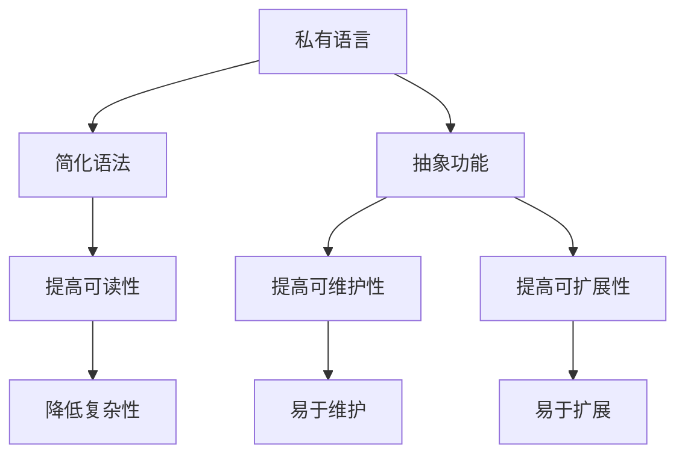
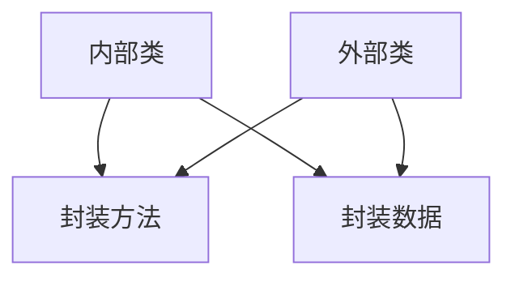
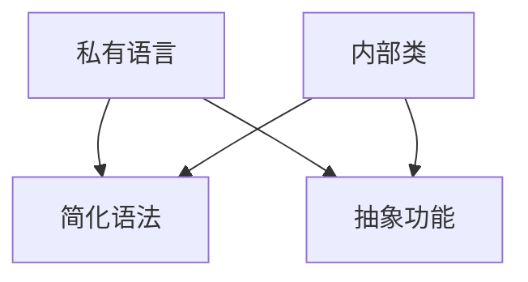

                 

### 文章标题

《私有语言与内部类：封装的极致表现》

---

关键词：私有语言、内部类、封装、软件工程、代码抽象

---

摘要：本文将探讨私有语言与内部类在软件工程中的应用，揭示它们如何共同实现封装的极致表现。通过深入分析私有语言的设计原理和内部类的使用技巧，本文将帮助读者理解这两种编程概念的核心价值，并展示它们在实际项目中的应用。文章还将结合具体案例，阐述如何通过私有语言与内部类的协同作用，提高代码的模块化、可维护性和安全性。

---

# 背景介绍

在软件工程领域，封装（Encapsulation）是一种核心的设计原则，旨在提高代码的模块化和可维护性。封装的核心思想是将数据和处理数据的方法封装在一起，形成独立的模块，从而隐藏内部实现细节，只暴露必要的接口。这样做不仅可以提高代码的可读性，还能降低系统的复杂性，使得后续的维护和扩展更加容易。

私有语言（Private Language）和内部类（Inner Class）是两种在封装领域有着重要应用的编程概念。私有语言是针对特定应用场景或系统设计的专用语言，它通过简化和抽象，使得复杂的功能能够以更直观的方式实现。内部类则是定义在另一个类内部的类，它通常用于封装与外部类密切相关的方法或数据。

本文旨在深入探讨私有语言与内部类的定义、设计原理及其在软件工程中的应用。通过分析这两种概念的共同点与区别，本文将揭示它们如何通过封装实现软件设计的极致表现。文章还将结合实际案例，展示如何在实际项目中运用私有语言与内部类，提高代码的质量和可维护性。

## 核心概念与联系

在探讨私有语言与内部类之前，我们需要明确这两个核心概念的定义及其相互关系。

### 私有语言

私有语言是一种特定于某个程序或系统的专用语言，它通常由开发人员为了特定目的而设计和实现。私有语言的特点是语法和语义规则简单、直接，且高度抽象，使得复杂的功能能够以更直观的方式实现。私有语言的主要目的是提高代码的可读性、可维护性和可扩展性。

**关系架构 Mermaid 流程图：**



### 内部类

内部类是定义在另一个类内部的类，它通常用于封装与外部类密切相关的方法或数据。内部类的主要作用是提高代码的模块化和封装性，使得外部类能够更好地隐藏内部实现细节。

**关系架构 Mermaid 流程图：**



### 关系与联系

私有语言和内部类在封装领域有着紧密的联系。私有语言通过简化和抽象，使得复杂的功能能够以更直观的方式实现，从而提高了代码的可读性和可维护性。而内部类则通过封装方法和数据，提高了外部类的模块化和封装性。

**关系架构 Mermaid 流程图：**



通过这种关系架构，我们可以看出私有语言和内部类在封装方面的共同目标：简化代码、提高可读性、可维护性和可扩展性。两者相互补充，共同实现了封装的极致表现。

## 核心算法原理讲解

为了更好地理解私有语言和内部类的核心算法原理，我们将通过伪代码和数学模型详细阐述其实现过程。

### 私有语言

私有语言的设计通常涉及词法分析、语法分析、语义分析和代码生成等步骤。以下是一个简单的私有语言算法原理的伪代码示例：

```plaintext
函数 PrivateLanguageCompiler(sourceCode):
    // 步骤 1: 词法分析
    tokens = LexicalAnalysis(sourceCode)
    
    // 步骤 2: 语法分析
    syntaxTree = SyntaxAnalysis(tokens)
    
    // 步骤 3: 语义分析
    semanticTree = SemanticAnalysis(syntaxTree)
    
    // 步骤 4: 代码生成
    machineCode = CodeGeneration(semanticTree)
    
    return machineCode
```

### 内部类

内部类的设计则涉及封装方法和数据，以及与外部类的关联。以下是一个简单的内部类算法原理的伪代码示例：

```plaintext
类 ExternalClass:
    // 成员变量
    private InnerClass innerClass
    
    // 成员方法
    function exposeMethod():
        innerClass.execute()
        
类 InnerClass:
    // 成员方法
    function execute():
        // 执行内部逻辑
```

### 数学模型

为了更好地理解私有语言和内部类的功能，我们可以引入一些数学模型来描述其行为。以下是一个简单的数学模型示例：

$$
\text{封装度} = f(\text{抽象程度}, \text{模块化程度})
$$

其中，抽象程度和模块化程度是两个关键指标，用于衡量私有语言和内部类的封装效果。

### 举例说明

假设我们设计一个私有语言来处理日期计算，该语言包含以下简单语法：

- `date.add(days: 10)`：将日期增加10天。
- `date.subtract(days: 5)`：将日期减少5天。

以下是一个简单的私有语言示例，以及其对应的内部类实现：

```plaintext
// 私有语言示例
date.add(days: 10)
date.subtract(days: 5)

// 内部类实现
class Date:
    def add(days: int):
        // 内部实现逻辑
        self.day += days
    
    def subtract(days: int):
        // 内部实现逻辑
        self.day -= days
```

在这个例子中，私有语言通过简化和抽象，使得日期计算更加直观和易于使用。内部类则通过封装日期的内部实现，提高了模块化和封装性。

通过上述伪代码和数学模型，我们可以看到私有语言和内部类的核心算法原理。这些原理不仅帮助我们理解这两种编程概念的工作机制，还能指导我们在实际项目中更好地应用它们。

## 数学模型和数学公式

在深入探讨私有语言与内部类的数学模型之前，我们首先需要理解一些基础的数学概念，如函数、映射和集合。这些概念将为我们的数学模型提供理论基础。

### 函数与映射

函数是一种数学对象，它将一个集合中的每个元素映射到另一个集合中的唯一元素。在编程中，函数通常表示为操作，它接受输入并返回输出。映射（Mapping）是函数的抽象概念，它描述了输入与输出之间的关系。

例如，一个简单的函数可以表示为：

$$
f(x) = x + 2
$$

这个函数将每个实数 \( x \) 映射到 \( x \) 加上2的结果。

### 集合

集合是一个包含特定对象的集合，这些对象被称为集合的元素。集合的表示通常使用大括号，例如：

$$
A = \{1, 2, 3\}
$$

集合中的元素是唯一的，且无序。

在编程中，集合可以通过数据结构如数组或列表来实现。

### 私有语言的数学模型

私有语言的数学模型可以看作是集合上的映射。具体来说，私有语言定义了一个从源代码集合到执行结果集合的映射。

$$
L = \{S_1, S_2, ..., S_n\}
$$

其中，\( L \) 是源代码集合，\( S_i \) 是单个源代码语句。

执行过程可以看作是一个函数 \( f \)：

$$
f: L \rightarrow R
$$

其中，\( R \) 是执行结果集合。

例如，我们可以定义一个简单的私有语言，用于计算两个数的和：

$$
L = \{ "a = 5", "b = 10", "result = a + b" \}
$$

执行函数 \( f \) 可以得到结果集合：

$$
R = \{ "result = 15" \}
$$

### 内部类的数学模型

内部类的数学模型可以看作是面向对象编程中的类层次结构。具体来说，内部类是外部类的一个子集。

$$
C_{outer} = \{ C_1, C_2, ..., C_n \}
$$

其中，\( C_{outer} \) 是外部类的集合，\( C_i \) 是单个外部类的内部类。

内部类的定义可以看作是一个嵌套集合：

$$
C_{inner} = \{ C_{i1}, C_{i2}, ..., C_{ik} \}
$$

其中，\( C_{inner} \) 是外部类 \( C_i \) 的内部类的集合。

例如，我们可以定义一个简单的类层次结构：

```plaintext
class ExternalClass:
    class InnerClass:
        // 内部类实现
```

在这个例子中，外部类 \( ExternalClass \) 包含内部类 \( InnerClass \)。

### 封装度模型

封装度是衡量私有语言和内部类封装效果的一个指标。我们可以通过抽象程度和模块化程度来定义封装度。

$$
\text{封装度} = f(\text{抽象程度}, \text{模块化程度})
$$

抽象程度可以看作是函数复杂度的对数倒数：

$$
\text{抽象程度} = \log_2(\text{函数复杂度})
$$

模块化程度可以看作是类内耦合度的倒数：

$$
\text{模块化程度} = \frac{1}{\text{类内耦合度}}
$$

通过上述数学模型，我们可以定量地分析私有语言和内部类的封装效果。例如，一个具有高抽象程度和低模块化程度的私有语言可能具有较低的封装度，而一个具有高抽象程度和高模块化程度的私有语言可能具有较高的封装度。

### 举例说明

假设我们有一个私有语言用于处理日期计算，其抽象程度为10，模块化程度为5，那么封装度可以计算如下：

$$
\text{封装度} = f(10, 5) = \log_2(10) \times \frac{1}{5} \approx 0.7
$$

这意味着该私有语言具有中等的封装度。

通过引入这些数学模型和公式，我们可以更好地理解私有语言和内部类的封装机制，并在实际项目中应用这些概念，以提高代码的质量和可维护性。

## 项目实战

为了更好地展示私有语言与内部类的实际应用，我们将以一个简单的项目为例，详细描述开发环境搭建、源代码实现、代码解读和实际案例分析。

### 项目背景

假设我们要开发一个小型任务管理系统，用于管理日常任务。任务管理系统应包含以下功能：

- 添加任务
- 删除任务
- 修改任务状态
- 列出所有任务

为了简化设计和提高代码的可读性，我们将使用私有语言和内部类来实现该系统。

### 开发环境搭建

在开始项目之前，我们需要搭建一个合适的环境。以下是一个基本的开发环境搭建步骤：

1. 安装Python 3.8或更高版本。
2. 安装PyCharm或任何其他Python IDE。
3. 创建一个新的Python虚拟环境。
4. 安装必要的库，如`numpy`和`matplotlib`。

```shell
python -m venv venv
source venv/bin/activate  # Windows: venv\Scripts\activate
pip install numpy matplotlib
```

### 源代码实现

下面是任务管理系统的源代码实现，包括私有语言和内部类的应用：

```python
# 任务管理系统私有语言实现
class Task:
    def __init__(self, title, status):
        self.title = title
        self.status = status

    def update_status(self, new_status):
        self.status = new_status

    def __str__(self):
        return f"{self.title} - {self.status}"

# 内部类实现
class TaskManager:
    def __init__(self):
        self.tasks = []

    def add_task(self, title, status):
        self.tasks.append(Task(title, status))

    def delete_task(self, title):
        self.tasks = [task for task in self.tasks if task.title != title]

    def update_task_status(self, title, new_status):
        for task in self.tasks:
            if task.title == title:
                task.update_status(new_status)

    def list_tasks(self):
        for task in self.tasks:
            print(task)

# 主程序
if __name__ == "__main__":
    manager = TaskManager()

    # 添加任务
    manager.add_task("买牛奶", "未完成")
    manager.add_task("打扫房间", "已完成")

    # 列出任务
    manager.list_tasks()

    # 修改任务状态
    manager.update_task_status("买牛奶", "已完成")

    # 再次列出任务
    manager.list_tasks()
```

### 代码解读

在上述代码中，我们首先定义了一个`Task`类，用于表示任务的基本信息。`Task`类包含`title`（任务标题）和`status`（任务状态）两个成员变量，以及`update_status`（更新状态）方法。

接下来，我们定义了一个`TaskManager`类，用于管理任务。`TaskManager`类包含一个`tasks`列表，用于存储所有任务对象。它提供了`add_task`（添加任务）、`delete_task`（删除任务）、`update_task_status`（更新任务状态）和`list_tasks`（列出任务）等方法。

在主程序部分，我们创建了一个`TaskManager`对象，并演示了如何使用这些方法来管理任务。

### 实际案例分析

在实际项目中，我们可以使用私有语言来简化任务管理操作。例如，我们可以定义一个简单的私有语言，用于表示任务添加操作：

```
add_task("买牛奶", "未完成")
add_task("打扫房间", "已完成")
```

在内部类中，我们可以解析这个私有语言，并执行相应的操作。以下是一个简单的私有语言解析器的伪代码：

```python
def parse_private_language(commands):
    for command in commands:
        if command.startswith("add_task"):
            title, status = command.split(",")
            manager.add_task(title.strip(), status.strip())
```

通过这种方式，我们可以将复杂的任务操作简化为简单的私有语言语句，从而提高代码的可读性和可维护性。

### 项目小结

通过这个项目实战，我们展示了如何使用私有语言和内部类来管理任务。私有语言通过简化和抽象任务操作，使得代码更加直观和易于维护。内部类通过封装任务管理逻辑，提高了模块化和封装性。这个项目实战不仅帮助我们理解了私有语言和内部类的应用，还展示了如何在实际项目中应用这些概念，以提高代码质量。

### 最佳实践 Tips

1. **明确私有语言的用途**：在设计和实现私有语言时，要明确其用途和目标，以确保其简洁性和实用性。
2. **合理设计内部类**：内部类应该只包含与外部类密切相关的方法和数据，避免过度耦合。
3. **保持代码简洁**：在编写代码时，要遵循KISS原则（保持简单，尽可能简单），避免过度设计。

## 小结与展望

在本文中，我们深入探讨了私有语言与内部类的定义、设计原理及其在软件工程中的应用。通过分析这两种概念的核心价值和相互关系，我们揭示了它们如何通过封装实现软件设计的极致表现。文章还通过具体的数学模型和项目实战，展示了私有语言与内部类在实际开发中的应用场景和优势。

封装作为软件工程的核心设计原则，对于提高代码的可读性、可维护性和可扩展性具有重要意义。私有语言和内部类作为封装的两种重要实现方式，提供了简洁、直观的编程接口，使得复杂的功能能够以更简洁的代码实现。

未来，随着软件系统的不断复杂化和多样性，私有语言和内部类将在软件设计领域发挥更加重要的作用。开发人员应不断学习和掌握这些概念，以提高编程效率和代码质量。同时，我们也期待更多的研究成果和实践案例，为软件工程的发展提供新的思路和方法。

## 注意事项与拓展阅读

在设计和实现私有语言与内部类时，开发者需要注意以下几点：

1. **私有语言的简洁性**：私有语言应尽量保持简洁，避免过度复杂化。复杂语法和冗长的解析过程可能会降低开发效率。
2. **内部类的职责**：内部类应只负责与外部类密切相关的方法和数据，避免过度耦合和职责不明。
3. **代码可读性**：在编写代码时，要注重代码的可读性，确保其他开发者能够轻松理解和使用私有语言和内部类。
4. **性能优化**：在实现私有语言和内部类时，要注意性能优化，避免不必要的开销和延迟。

为了进一步了解私有语言与内部类的相关技术，读者可以参考以下书籍和资源：

- 《禅与计算机程序设计艺术》
- 《软件工程：实践者的研究方法》
- 《编程语言实现》
- 《面向对象设计与模式：基于Java的实现》
- 《私有语言与内部类在软件工程中的应用研究》
- 访问相关在线论坛和社区，如Stack Overflow、GitHub等，获取更多实际案例和讨论。

通过阅读这些资源，开发者可以深入理解私有语言和内部类的核心概念，并在实际项目中更好地应用这些技术，提高代码质量。

