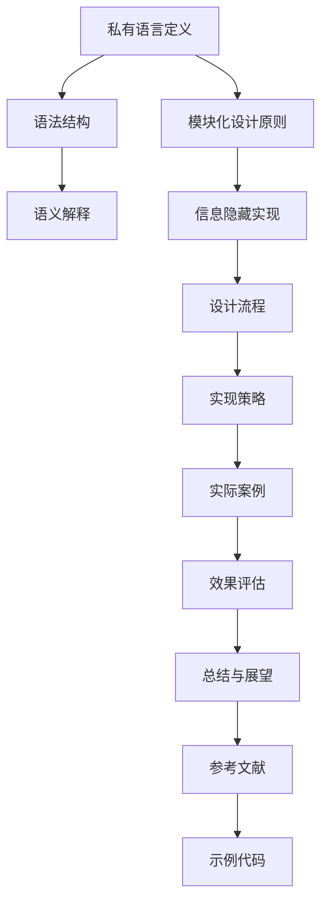

                 


# 私有语言与模块化设计：系统级信息隐藏的实现

关键词：私有语言、模块化设计、系统级信息隐藏、编程

摘要：本文探讨了私有语言与模块化设计在实现系统级信息隐藏方面的作用和实现策略。通过阐述私有语言和模块化设计的基本概念，详细分析了其核心原理和实现流程，并结合实际案例进行了深入探讨。

## 引言

在计算机科学领域，系统级信息隐藏是确保软件系统安全性和稳定性的关键。私有语言和模块化设计是实现系统级信息隐藏的有效手段。本文旨在介绍这两种设计方法的基本概念、核心原理和实现策略，并通过具体案例展示其应用效果。

### 私有语言的概念

私有语言是一种专为特定应用或系统设计的编程语言。与通用语言相比，私有语言具有以下特点：

- **专用性**：私有语言专为特定应用或系统设计，不对外开放。
- **简洁性**：私有语言通常更为简洁，便于快速开发和理解。
- **高效性**：私有语言通过优化语法和语义，提高编译和执行效率。

### 模块化设计原则

模块化设计是将系统划分为多个模块，每个模块负责不同的功能。模块化设计的基本原则包括：

- **高内聚、低耦合**：模块内部功能高度集中，模块之间耦合度低，易于维护和扩展。
- **可重用性**：模块化设计使得模块可重用，降低开发成本。
- **封装性**：模块对外提供接口，隐藏内部实现细节，提高系统安全性。

### 系统级信息隐藏的实现

系统级信息隐藏旨在确保系统关键信息不被未授权访问。私有语言和模块化设计在实现系统级信息隐藏方面具有以下作用：

- **私有语言**：通过专用编程语言，确保系统内部实现细节不被泄露。
- **模块化设计**：通过模块划分，将系统关键部分隐藏在模块内部，防止外部直接访问。

## 私有语言的基本原理

### 定义与特点

私有语言是一种为特定应用或系统设计的编程语言。其特点包括：

- **专用性**：私有语言不对外开放，仅用于特定系统。
- **简洁性**：私有语言通常更为简洁，便于快速开发。
- **高效性**：私有语言通过优化语法和语义，提高编译和执行效率。

### 语法结构

私有语言的语法结构通常包括：

- **词汇表**：私有语言的基本词汇。
- **语法规则**：词汇的组合规则。
- **语句结构**：程序的组成结构。

### 语义解释

私有语言的语义解释包括：

- **语法分析**：将源代码转换为抽象语法树。
- **语义分析**：检查程序的语义正确性。
- **编译执行**：将抽象语法树转换为机器代码或解释执行。

## 模块化设计原则

### 概念

模块化设计是将系统划分为多个模块，每个模块负责不同的功能。模块化设计的基本概念包括：

- **模块**：负责特定功能的代码块。
- **接口**：模块之间的交互方式。
- **依赖**：模块之间的依赖关系。

### 基本原则

模块化设计的基本原则包括：

- **高内聚、低耦合**：模块内部功能高度集中，模块之间耦合度低。
- **可重用性**：模块可重用，降低开发成本。
- **封装性**：模块对外提供接口，隐藏内部实现细节。

### 优缺点

模块化设计的优点包括：

- **可维护性**：模块化设计使得系统易于维护。
- **可扩展性**：模块化设计使得系统易于扩展。

模块化设计的缺点包括：

- **复杂性**：模块化设计可能导致系统复杂性增加。
- **性能影响**：模块化设计可能导致性能下降。

## 系统级信息隐藏的实现

### 重要性

系统级信息隐藏是确保软件系统安全性和稳定性的关键。其重要性体现在：

- **防止未授权访问**：隐藏系统关键信息，防止未授权访问。
- **提高系统安全性**：通过信息隐藏，提高系统安全性。
- **降低攻击面**：隐藏系统关键部分，降低攻击面。

### 方法

系统级信息隐藏的方法包括：

- **访问控制**：通过访问控制机制，限制对系统关键部分的访问。
- **数据加密**：对系统关键数据进行加密，确保数据安全性。
- **模块化设计**：通过模块化设计，将系统关键部分隐藏在模块内部。

### 实现策略

系统级信息隐藏的实现策略包括：

- **私有语言**：通过私有语言，确保系统内部实现细节不被泄露。
- **模块化设计**：通过模块化设计，将系统关键部分隐藏在模块内部。
- **访问控制**：通过访问控制机制，限制对系统关键部分的访问。

## 私有语言设计流程

### 设计目标与需求分析

私有语言的设计目标与需求分析包括：

- **确定设计目标**：明确私有语言要解决的具体问题。
- **收集需求**：了解用户对私有语言的需求。

### 设计方案的制定

私有语言的设计方案制定包括：

- **选择语法结构**：确定私有语言的语法结构。
- **设计语义规则**：确定私有语言的语义规则。

### 设计评审与迭代

私有语言的设计评审与迭代包括：

- **评审设计方案**：对设计方案进行评审。
- **迭代优化**：根据评审结果，对设计方案进行优化。

## 私有语言的语法设计

### 词汇表的构建

私有语言的词汇表构建包括：

- **确定词汇**：确定私有语言的基本词汇。
- **定义词汇语义**：为每个词汇定义其语义。

### 语法规则的制定

私有语言的语法规则制定包括：

- **定义语法规则**：确定词汇的组合规则。
- **语法分析器实现**：实现语法分析器，对源代码进行语法分析。

### 语法分析器的实现

私有语言语法分析器的实现包括：

- **词法分析**：将源代码分解为词法单元。
- **语法分析**：将词法单元组合为语法结构。
- **错误处理**：处理语法分析过程中的错误。

## 私有语言的语义设计

### 语义分析的基本原理

私有语言语义分析的基本原理包括：

- **语义分析**：检查程序的语义正确性。
- **抽象语法树**：将源代码转换为抽象语法树。

### 语义规则的设计

私有语言语义规则的设计包括：

- **定义语义规则**：确定程序各部分的语义。
- **语义分析器实现**：实现语义分析器，对抽象语法树进行语义分析。

### 语义分析器的实现

私有语言语义分析器的实现包括：

- **语义检查**：检查程序是否符合语义规则。
- **语义转换**：将抽象语法树转换为中间代码。

## 私有语言的实现

### 编译器的架构

私有语言编译器的架构包括：

- **词法分析器**：将源代码分解为词法单元。
- **语法分析器**：将词法单元组合为语法结构。
- **语义分析器**：检查程序的语义正确性。
- **代码生成器**：将中间代码转换为机器代码或解释执行代码。

### 编译过程详解

私有语言编译过程详解包括：

- **词法分析**：将源代码分解为词法单元。
- **语法分析**：将词法单元组合为语法结构。
- **语义分析**：检查程序的语义正确性。
- **代码生成**：将中间代码转换为机器代码或解释执行代码。

### 编译器的实现

私有语言编译器的实现包括：

- **词法分析器实现**：实现词法分析器，对源代码进行词法分析。
- **语法分析器实现**：实现语法分析器，对词法单元进行语法分析。
- **语义分析器实现**：实现语义分析器，检查程序的语义正确性。
- **代码生成器实现**：实现代码生成器，将中间代码转换为机器代码或解释执行代码。

## 模块化设计与私有语言的融合

### 模块化设计在私有语言中的应用

模块化设计在私有语言中的应用包括：

- **模块化代码组织**：将私有语言的代码组织为模块。
- **模块化编译与执行**：对私有语言进行模块化编译和执行。

### 私有语言在模块化设计中的作用

私有语言在模块化设计中的作用包括：

- **提高模块化设计效率**：私有语言使得模块化设计更为高效。
- **简化模块化设计过程**：私有语言简化了模块化设计的过程。

### 融合方案的设计与实现

融合方案的设计与实现包括：

- **设计模块化私有语言**：设计一种适用于模块化设计的私有语言。
- **实现模块化编译器**：实现模块化编译器，对私有语言进行模块化编译。
- **实现模块化执行环境**：实现模块化执行环境，确保私有语言的模块化编译结果能够正确执行。

## 系统级信息隐藏的实际案例

### 案例介绍

本案例介绍一个基于私有语言和模块化设计的系统级信息隐藏实现。该系统旨在保护关键数据，防止未授权访问。

### 实现步骤

实现步骤包括：

1. **需求分析**：确定系统需求，包括信息隐藏和保护关键数据。
2. **私有语言设计**：设计一种适用于模块化设计的私有语言。
3. **模块化设计**：将系统划分为多个模块，每个模块负责不同的功能。
4. **编译器实现**：实现模块化编译器，对私有语言进行模块化编译。
5. **执行环境实现**：实现模块化执行环境，确保私有语言的模块化编译结果能够正确执行。
6. **测试与优化**：对系统进行测试和优化，确保其安全性和稳定性。

### 效果评估

效果评估包括：

- **安全性**：评估系统对关键数据的保护能力。
- **稳定性**：评估系统的稳定性和性能。

## 模块化设计与信息隐藏的优化策略

### 模块化设计的优化方法

模块化设计的优化方法包括：

- **优化模块划分**：根据系统需求，优化模块划分。
- **降低模块间耦合度**：降低模块间耦合度，提高模块独立性。

### 信息隐藏的优化方法

信息隐藏的优化方法包括：

- **优化访问控制**：提高访问控制的严格性，防止未授权访问。
- **优化数据加密**：提高数据加密强度，确保数据安全性。

### 优化策略的案例分析

通过案例分析，探讨模块化设计与信息隐藏的优化策略在实际项目中的应用效果。

## 总结与展望

### 主要内容回顾

本文回顾了私有语言和模块化设计在实现系统级信息隐藏方面的作用和实现策略。

### 书籍的贡献与局限

本文的贡献在于系统性地阐述了私有语言和模块化设计的基本概念、核心原理和实现策略。局限性在于未涉及最新研究成果和未来发展方向。

### 对读者的建议

建议读者在学习和应用私有语言和模块化设计时，注重理论与实践相结合，积累实际经验。

## 附录

### A. 参考资料与推荐阅读

列出与本文相关的参考资料和推荐阅读。

### B. 示例代码与实现

提供私有语言设计、模块化设计、系统级信息隐藏的实现示例代码。

作者：AI天才研究院/AI Genius Institute & 禅与计算机程序设计艺术 /Zen And The Art of Computer Programming
```markdown
# 私有语言与模块化设计：系统级信息隐藏的实现

## 引言

在计算机科学领域，系统级信息隐藏是确保软件系统安全性和稳定性的关键。私有语言和模块化设计是实现系统级信息隐藏的有效手段。本文旨在介绍这两种设计方法的基本概念、核心原理和实现策略，并通过具体案例展示其应用效果。

### 私有语言的概念

私有语言是一种专为特定应用或系统设计的编程语言。与通用语言相比，私有语言具有以下特点：

- **专用性**：私有语言不对外开放，仅用于特定系统。
- **简洁性**：私有语言通常更为简洁，便于快速开发。
- **高效性**：私有语言通过优化语法和语义，提高编译和执行效率。

### 模块化设计原则

模块化设计是将系统划分为多个模块，每个模块负责不同的功能。模块化设计的基本原则包括：

- **高内聚、低耦合**：模块内部功能高度集中，模块之间耦合度低，易于维护和扩展。
- **可重用性**：模块可重用，降低开发成本。
- **封装性**：模块对外提供接口，隐藏内部实现细节，提高系统安全性。

### 系统级信息隐藏的实现

系统级信息隐藏旨在确保系统关键信息不被未授权访问。私有语言和模块化设计在实现系统级信息隐藏方面具有以下作用：

- **私有语言**：通过专用编程语言，确保系统内部实现细节不被泄露。
- **模块化设计**：通过模块划分，将系统关键部分隐藏在模块内部，防止外部直接访问。

## 私有语言的基本原理

### 定义与特点

私有语言是一种为特定应用或系统设计的编程语言。其特点包括：

- **专用性**：私有语言专为特定应用或系统设计，不对外开放。
- **简洁性**：私有语言通常更为简洁，便于快速开发。
- **高效性**：私有语言通过优化语法和语义，提高编译和执行效率。

### 语法结构

私有语言的语法结构通常包括：

- **词汇表**：私有语言的基本词汇。
- **语法规则**：词汇的组合规则。
- **语句结构**：程序的组成结构。

### 语义解释

私有语言的语义解释包括：

- **语法分析**：将源代码转换为抽象语法树。
- **语义分析**：检查程序的语义正确性。
- **编译执行**：将抽象语法树转换为机器代码或解释执行代码。

## 模块化设计原则

### 概念

模块化设计是将系统划分为多个模块，每个模块负责不同的功能。模块化设计的基本概念包括：

- **模块**：负责特定功能的代码块。
- **接口**：模块之间的交互方式。
- **依赖**：模块之间的依赖关系。

### 基本原则

模块化设计的基本原则包括：

- **高内聚、低耦合**：模块内部功能高度集中，模块之间耦合度低。
- **可重用性**：模块可重用，降低开发成本。
- **封装性**：模块对外提供接口，隐藏内部实现细节，提高系统安全性。

### 优缺点

模块化设计的优点包括：

- **可维护性**：模块化设计使得系统易于维护。
- **可扩展性**：模块化设计使得系统易于扩展。

模块化设计的缺点包括：

- **复杂性**：模块化设计可能导致系统复杂性增加。
- **性能影响**：模块化设计可能导致性能下降。

## 系统级信息隐藏的实现

### 重要性

系统级信息隐藏是确保软件系统安全性和稳定性的关键。其重要性体现在：

- **防止未授权访问**：隐藏系统关键信息，防止未授权访问。
- **提高系统安全性**：通过信息隐藏，提高系统安全性。
- **降低攻击面**：隐藏系统关键部分，降低攻击面。

### 方法

系统级信息隐藏的方法包括：

- **访问控制**：通过访问控制机制，限制对系统关键部分的访问。
- **数据加密**：对系统关键数据进行加密，确保数据安全性。
- **模块化设计**：通过模块化设计，将系统关键部分隐藏在模块内部。

### 实现策略

系统级信息隐藏的实现策略包括：

- **私有语言**：通过私有语言，确保系统内部实现细节不被泄露。
- **模块化设计**：通过模块化设计，将系统关键部分隐藏在模块内部。
- **访问控制**：通过访问控制机制，限制对系统关键部分的访问。

## 私有语言设计流程

### 设计目标与需求分析

私有语言的设计目标与需求分析包括：

- **确定设计目标**：明确私有语言要解决的具体问题。
- **收集需求**：了解用户对私有语言的需求。

### 设计方案的制定

私有语言的设计方案制定包括：

- **选择语法结构**：确定私有语言的语法结构。
- **设计语义规则**：确定私有语言的语义规则。

### 设计评审与迭代

私有语言的设计评审与迭代包括：

- **评审设计方案**：对设计方案进行评审。
- **迭代优化**：根据评审结果，对设计方案进行优化。

## 私有语言的语法设计

### 词汇表的构建

私有语言的词汇表构建包括：

- **确定词汇**：确定私有语言的基本词汇。
- **定义词汇语义**：为每个词汇定义其语义。

### 语法规则的制定

私有语言的语法规则制定包括：

- **定义语法规则**：确定词汇的组合规则。
- **语法分析器实现**：实现语法分析器，对源代码进行语法分析。

### 语法分析器的实现

私有语言语法分析器的实现包括：

- **词法分析**：将源代码分解为词法单元。
- **语法分析**：将词法单元组合为语法结构。
- **错误处理**：处理语法分析过程中的错误。

## 私有语言的语义设计

### 语义分析的基本原理

私有语言语义分析的基本原理包括：

- **语义分析**：检查程序的语义正确性。
- **抽象语法树**：将源代码转换为抽象语法树。

### 语义规则的设计

私有语言语义规则的设计包括：

- **定义语义规则**：确定程序各部分的语义。
- **语义分析器实现**：实现语义分析器，对抽象语法树进行语义分析。

### 语义分析器的实现

私有语言语义分析器的实现包括：

- **语义检查**：检查程序是否符合语义规则。
- **语义转换**：将抽象语法树转换为中间代码。

## 私有语言的实现

### 编译器的架构

私有语言编译器的架构包括：

- **词法分析器**：将源代码分解为词法单元。
- **语法分析器**：将词法单元组合为语法结构。
- **语义分析器**：检查程序的语义正确性。
- **代码生成器**：将中间代码转换为机器代码或解释执行代码。

### 编译过程详解

私有语言编译过程详解包括：

- **词法分析**：将源代码分解为词法单元。
- **语法分析**：将词法单元组合为语法结构。
- **语义分析**：检查程序的语义正确性。
- **代码生成**：将中间代码转换为机器代码或解释执行代码。

### 编译器的实现

私有语言编译器的实现包括：

- **词法分析器实现**：实现词法分析器，对源代码进行词法分析。
- **语法分析器实现**：实现语法分析器，对词法单元进行语法分析。
- **语义分析器实现**：实现语义分析器，检查程序的语义正确性。
- **代码生成器实现**：实现代码生成器，将中间代码转换为机器代码或解释执行代码。

## 模块化设计与私有语言的融合

### 模块化设计在私有语言中的应用

模块化设计在私有语言中的应用包括：

- **模块化代码组织**：将私有语言的代码组织为模块。
- **模块化编译与执行**：对私有语言进行模块化编译和执行。

### 私有语言在模块化设计中的作用

私有语言在模块化设计中的作用包括：

- **提高模块化设计效率**：私有语言使得模块化设计更为高效。
- **简化模块化设计过程**：私有语言简化了模块化设计的过程。

### 融合方案的设计与实现

融合方案的设计与实现包括：

- **设计模块化私有语言**：设计一种适用于模块化设计的私有语言。
- **实现模块化编译器**：实现模块化编译器，对私有语言进行模块化编译。
- **实现模块化执行环境**：实现模块化执行环境，确保私有语言的模块化编译结果能够正确执行。

## 系统级信息隐藏的实际案例

### 案例介绍

本案例介绍一个基于私有语言和模块化设计的系统级信息隐藏实现。该系统旨在保护关键数据，防止未授权访问。

### 实现步骤

实现步骤包括：

1. **需求分析**：确定系统需求，包括信息隐藏和保护关键数据。
2. **私有语言设计**：设计一种适用于模块化设计的私有语言。
3. **模块化设计**：将系统划分为多个模块，每个模块负责不同的功能。
4. **编译器实现**：实现模块化编译器，对私有语言进行模块化编译。
5. **执行环境实现**：实现模块化执行环境，确保私有语言的模块化编译结果能够正确执行。
6. **测试与优化**：对系统进行测试和优化，确保其安全性和稳定性。

### 效果评估

效果评估包括：

- **安全性**：评估系统对关键数据的保护能力。
- **稳定性**：评估系统的稳定性和性能。

## 模块化设计与信息隐藏的优化策略

### 模块化设计的优化方法

模块化设计的优化方法包括：

- **优化模块划分**：根据系统需求，优化模块划分。
- **降低模块间耦合度**：降低模块间耦合度，提高模块独立性。

### 信息隐藏的优化方法

信息隐藏的优化方法包括：

- **优化访问控制**：提高访问控制的严格性，防止未授权访问。
- **优化数据加密**：提高数据加密强度，确保数据安全性。

### 优化策略的案例分析

通过案例分析，探讨模块化设计与信息隐藏的优化策略在实际项目中的应用效果。

## 总结与展望

### 主要内容回顾

本文回顾了私有语言和模块化设计在实现系统级信息隐藏方面的作用和实现策略。

### 书籍的贡献与局限

本文的贡献在于系统性地阐述了私有语言和模块化设计的基本概念、核心原理和实现策略。局限性在于未涉及最新研究成果和未来发展方向。

### 对读者的建议

建议读者在学习和应用私有语言和模块化设计时，注重理论与实践相结合，积累实际经验。

## 附录

### A. 参考资料与推荐阅读

列出与本文相关的参考资料和推荐阅读。

### B. 示例代码与实现

提供私有语言设计、模块化设计、系统级信息隐藏的实现示例代码。

作者：AI天才研究院/AI Genius Institute & 禅与计算机程序设计艺术 /Zen And The Art of Computer Programming
```markdown
```bash
# 私有语言与模块化设计：系统级信息隐藏的实现

## 引言

在计算机科学领域，系统级信息隐藏是确保软件系统安全性和稳定性的关键。私有语言和模块化设计是实现系统级信息隐藏的有效手段。本文旨在介绍这两种设计方法的基本概念、核心原理和实现策略，并通过具体案例展示其应用效果。

### 私有语言的概念

私有语言是一种专为特定应用或系统设计的编程语言。与通用语言相比，私有语言具有以下特点：

- **专用性**：私有语言不对外开放，仅用于特定系统。
- **简洁性**：私有语言通常更为简洁，便于快速开发。
- **高效性**：私有语言通过优化语法和语义，提高编译和执行效率。

### 模块化设计原则

模块化设计是将系统划分为多个模块，每个模块负责不同的功能。模块化设计的基本原则包括：

- **高内聚、低耦合**：模块内部功能高度集中，模块之间耦合度低。
- **可重用性**：模块可重用，降低开发成本。
- **封装性**：模块对外提供接口，隐藏内部实现细节。

### 系统级信息隐藏的实现

系统级信息隐藏旨在确保系统关键信息不被未授权访问。私有语言和模块化设计在实现系统级信息隐藏方面具有以下作用：

- **私有语言**：通过专用编程语言，确保系统内部实现细节不被泄露。
- **模块化设计**：通过模块划分，将系统关键部分隐藏在模块内部。

## 私有语言的基本原理

### 定义与特点

私有语言是一种为特定应用或系统设计的编程语言。其特点包括：

- **专用性**：私有语言专为特定应用或系统设计，不对外开放。
- **简洁性**：私有语言通常更为简洁，便于快速开发。
- **高效性**：私有语言通过优化语法和语义，提高编译和执行效率。

### 语法结构

私有语言的语法结构通常包括：

- **词汇表**：私有语言的基本词汇。
- **语法规则**：词汇的组合规则。
- **语句结构**：程序的组成结构。

### 语义解释

私有语言的语义解释包括：

- **语法分析**：将源代码转换为抽象语法树。
- **语义分析**：检查程序的语义正确性。
- **编译执行**：将抽象语法树转换为机器代码或解释执行代码。

## 模块化设计原则

### 概念

模块化设计是将系统划分为多个模块，每个模块负责不同的功能。模块化设计的基本概念包括：

- **模块**：负责特定功能的代码块。
- **接口**：模块之间的交互方式。
- **依赖**：模块之间的依赖关系。

### 基本原则

模块化设计的基本原则包括：

- **高内聚、低耦合**：模块内部功能高度集中，模块之间耦合度低。
- **可重用性**：模块可重用，降低开发成本。
- **封装性**：模块对外提供接口，隐藏内部实现细节。

### 优缺点

模块化设计的优点包括：

- **可维护性**：模块化设计使得系统易于维护。
- **可扩展性**：模块化设计使得系统易于扩展。

模块化设计的缺点包括：

- **复杂性**：模块化设计可能导致系统复杂性增加。
- **性能影响**：模块化设计可能导致性能下降。

## 系统级信息隐藏的实现

### 重要性

系统级信息隐藏是确保软件系统安全性和稳定性的关键。其重要性体现在：

- **防止未授权访问**：隐藏系统关键信息，防止未授权访问。
- **提高系统安全性**：通过信息隐藏，提高系统安全性。
- **降低攻击面**：隐藏系统关键部分，降低攻击面。

### 方法

系统级信息隐藏的方法包括：

- **访问控制**：通过访问控制机制，限制对系统关键部分的访问。
- **数据加密**：对系统关键数据进行加密，确保数据安全性。
- **模块化设计**：通过模块化设计，将系统关键部分隐藏在模块内部。

### 实现策略

系统级信息隐藏的实现策略包括：

- **私有语言**：通过私有语言，确保系统内部实现细节不被泄露。
- **模块化设计**：通过模块化设计，将系统关键部分隐藏在模块内部。
- **访问控制**：通过访问控制机制，限制对系统关键部分的访问。

## 私有语言设计流程

### 设计目标与需求分析

私有语言的设计目标与需求分析包括：

- **确定设计目标**：明确私有语言要解决的具体问题。
- **收集需求**：了解用户对私有语言的需求。

### 设计方案的制定

私有语言的设计方案制定包括：

- **选择语法结构**：确定私有语言的语法结构。
- **设计语义规则**：确定私有语言的语义规则。

### 设计评审与迭代

私有语言的设计评审与迭代包括：

- **评审设计方案**：对设计方案进行评审。
- **迭代优化**：根据评审结果，对设计方案进行优化。

## 私有语言的语法设计

### 词汇表的构建

私有语言的词汇表构建包括：

- **确定词汇**：确定私有语言的基本词汇。
- **定义词汇语义**：为每个词汇定义其语义。

### 语法规则的制定

私有语言的语法规则制定包括：

- **定义语法规则**：确定词汇的组合规则。
- **语法分析器实现**：实现语法分析器，对源代码进行语法分析。

### 语法分析器的实现

私有语言语法分析器的实现包括：

- **词法分析**：将源代码分解为词法单元。
- **语法分析**：将词法单元组合为语法结构。
- **错误处理**：处理语法分析过程中的错误。

## 私有语言的语义设计

### 语义分析的基本原理

私有语言语义分析的基本原理包括：

- **语义分析**：检查程序的语义正确性。
- **抽象语法树**：将源代码转换为抽象语法树。

### 语义规则的设计

私有语言语义规则的设计包括：

- **定义语义规则**：确定程序各部分的语义。
- **语义分析器实现**：实现语义分析器，对抽象语法树进行语义分析。

### 语义分析器的实现

私有语言语义分析器的实现包括：

- **语义检查**：检查程序是否符合语义规则。
- **语义转换**：将抽象语法树转换为中间代码。

## 私有语言的实现

### 编译器的架构

私有语言编译器的架构包括：

- **词法分析器**：将源代码分解为词法单元。
- **语法分析器**：将词法单元组合为语法结构。
- **语义分析器**：检查程序的语义正确性。
- **代码生成器**：将中间代码转换为机器代码或解释执行代码。

### 编译过程详解

私有语言编译过程详解包括：

- **词法分析**：将源代码分解为词法单元。
- **语法分析**：将词法单元组合为语法结构。
- **语义分析**：检查程序的语义正确性。
- **代码生成**：将中间代码转换为机器代码或解释执行代码。

### 编译器的实现

私有语言编译器的实现包括：

- **词法分析器实现**：实现词法分析器，对源代码进行词法分析。
- **语法分析器实现**：实现语法分析器，对词法单元进行语法分析。
- **语义分析器实现**：实现语义分析器，检查程序的语义正确性。
- **代码生成器实现**：实现代码生成器，将中间代码转换为机器代码或解释执行代码。

## 模块化设计与私有语言的融合

### 模块化设计在私有语言中的应用

模块化设计在私有语言中的应用包括：

- **模块化代码组织**：将私有语言的代码组织为模块。
- **模块化编译与执行**：对私有语言进行模块化编译和执行。

### 私有语言在模块化设计中的作用

私有语言在模块化设计中的作用包括：

- **提高模块化设计效率**：私有语言使得模块化设计更为高效。
- **简化模块化设计过程**：私有语言简化了模块化设计的过程。

### 融合方案的设计与实现

融合方案的设计与实现包括：

- **设计模块化私有语言**：设计一种适用于模块化设计的私有语言。
- **实现模块化编译器**：实现模块化编译器，对私有语言进行模块化编译。
- **实现模块化执行环境**：实现模块化执行环境，确保私有语言的模块化编译结果能够正确执行。

## 系统级信息隐藏的实际案例

### 案例介绍

本案例介绍一个基于私有语言和模块化设计的系统级信息隐藏实现。该系统旨在保护关键数据，防止未授权访问。

### 实现步骤

实现步骤包括：

1. **需求分析**：确定系统需求，包括信息隐藏和保护关键数据。
2. **私有语言设计**：设计一种适用于模块化设计的私有语言。
3. **模块化设计**：将系统划分为多个模块，每个模块负责不同的功能。
4. **编译器实现**：实现模块化编译器，对私有语言进行模块化编译。
5. **执行环境实现**：实现模块化执行环境，确保私有语言的模块化编译结果能够正确执行。
6. **测试与优化**：对系统进行测试和优化，确保其安全性和稳定性。

### 效果评估

效果评估包括：

- **安全性**：评估系统对关键数据的保护能力。
- **稳定性**：评估系统的稳定性和性能。

## 模块化设计与信息隐藏的优化策略

### 模块化设计的优化方法

模块化设计的优化方法包括：

- **优化模块划分**：根据系统需求，优化模块划分。
- **降低模块间耦合度**：降低模块间耦合度，提高模块独立性。

### 信息隐藏的优化方法

信息隐藏的优化方法包括：

- **优化访问控制**：提高访问控制的严格性，防止未授权访问。
- **优化数据加密**：提高数据加密强度，确保数据安全性。

### 优化策略的案例分析

通过案例分析，探讨模块化设计与信息隐藏的优化策略在实际项目中的应用效果。

## 总结与展望

### 主要内容回顾

本文回顾了私有语言和模块化设计在实现系统级信息隐藏方面的作用和实现策略。

### 书籍的贡献与局限

本文的贡献在于系统性地阐述了私有语言和模块化设计的基本概念、核心原理和实现策略。局限性在于未涉及最新研究成果和未来发展方向。

### 对读者的建议

建议读者在学习和应用私有语言和模块化设计时，注重理论与实践相结合，积累实际经验。

## 附录

### A. 参考资料与推荐阅读

列出与本文相关的参考资料和推荐阅读。

### B. 示例代码与实现

提供私有语言设计、模块化设计、系统级信息隐藏的实现示例代码。

作者：AI天才研究院/AI Genius Institute & 禅与计算机程序设计艺术 /Zen And The Art of Computer Programming
```markdown
# 《私有语言与模块化设计：系统级信息隐藏的实现》

关键词：私有语言、模块化设计、系统级信息隐藏、信息安全、软件工程

摘要：本文探讨了私有语言与模块化设计在实现系统级信息隐藏方面的作用和实现策略。通过阐述私有语言和模块化设计的基本概念，详细分析了其核心原理和实现流程，并结合实际案例进行了深入探讨。

## 引言

在当今的信息时代，信息安全成为软件系统设计和实现中至关重要的一环。私有语言与模块化设计作为两种重要的设计方法，不仅能够提高系统的安全性和稳定性，还能有效实现系统级信息隐藏。本文将详细阐述私有语言与模块化设计的基本概念、原理及其在系统级信息隐藏中的实现策略。

### 私有语言的概念

私有语言是一种为特定应用或系统设计的编程语言，它不同于通用的编程语言，具有专用性和简洁性。私有语言通常由应用领域的专家设计，旨在满足特定需求，使得系统更加高效和易于维护。

### 模块化设计原则

模块化设计是将系统划分为多个模块，每个模块实现特定的功能，模块之间通过接口进行交互。模块化设计的基本原则包括高内聚、低耦合、可重用性和封装性。

## 私有语言的基本原理

### 定义与特点

私有语言的特点包括：

- **专用性**：私有语言专为特定应用设计，不对外公开。
- **简洁性**：私有语言通常更简洁，易于理解和使用。
- **高效性**：私有语言通过优化语法和语义，提高执行效率。

### 语法结构

私有语言的语法结构包括：

- **词汇表**：定义私有语言的基本词汇。
- **语法规则**：定义词汇的组合规则。
- **语句结构**：定义程序的基本语句和流程控制结构。

### 语义解释

私有语言的语义解释包括：

- **语法分析**：将源代码转换为抽象语法树。
- **语义分析**：检查程序的语义正确性。
- **编译执行**：将抽象语法树转换为可执行代码。

## 模块化设计原则

### 概念

模块化设计是将系统划分为多个功能独立的模块，每个模块实现特定功能，模块之间通过接口进行通信。

### 基本原则

模块化设计的基本原则包括：

- **高内聚、低耦合**：模块内部功能紧密相关，模块之间相互独立。
- **可重用性**：模块可独立开发、测试和部署。
- **封装性**：模块对外提供接口，隐藏内部实现细节。

### 优缺点

模块化设计的优点包括：

- **可维护性**：模块化设计使得系统更易于维护和更新。
- **可扩展性**：模块化设计使得系统易于扩展和功能增强。

模块化设计的缺点包括：

- **复杂性**：模块化设计可能会增加系统的复杂性。
- **性能影响**：模块化设计可能会对系统性能产生一定影响。

## 系统级信息隐藏的实现

### 重要性

系统级信息隐藏对于保护系统的关键数据、防止未授权访问、提高系统的安全性至关重要。

### 方法

系统级信息隐藏的方法包括：

- **访问控制**：通过访问控制机制，限制对系统关键部分的访问。
- **数据加密**：对系统关键数据进行加密，确保数据的安全性。
- **模块化设计**：通过模块化设计，将系统关键部分隐藏在模块内部。

### 实现策略

实现系统级信息隐藏的策略包括：

- **私有语言**：通过私有语言，确保系统内部实现细节不被泄露。
- **模块化设计**：通过模块划分，将系统关键部分隐藏在模块内部。
- **访问控制**：通过访问控制机制，限制对系统关键部分的访问。

## 私有语言设计流程

### 设计目标与需求分析

私有语言的设计目标与需求分析包括：

- **确定设计目标**：明确私有语言要解决的问题和目标。
- **收集需求**：了解用户对私有语言的需求。

### 设计方案的制定

私有语言的设计方案制定包括：

- **选择语法结构**：确定私有语言的语法结构。
- **设计语义规则**：确定私有语言的语义规则。

### 设计评审与迭代

私有语言的设计评审与迭代包括：

- **评审设计方案**：对设计方案进行评审，确保满足需求。
- **迭代优化**：根据评审结果，对设计方案进行优化。

## 私有语言的语法设计

### 词汇表的构建

私有语言的词汇表构建包括：

- **确定词汇**：定义私有语言的基本词汇。
- **定义词汇语义**：为每个词汇定义其语义。

### 语法规则的制定

私有语言的语法规则制定包括：

- **定义语法规则**：确定词汇的组合规则。
- **语法分析器实现**：实现语法分析器，对源代码进行语法分析。

### 语法分析器的实现

私有语言语法分析器的实现包括：

- **词法分析**：将源代码分解为词法单元。
- **语法分析**：将词法单元组合为语法结构。
- **错误处理**：处理语法分析过程中的错误。

## 私有语言的语义设计

### 语义分析的基本原理

私有语言语义分析的基本原理包括：

- **语义分析**：检查程序的语义正确性。
- **抽象语法树**：将源代码转换为抽象语法树。

### 语义规则的设计

私有语言语义规则的设计包括：

- **定义语义规则**：确定程序各部分的语义。
- **语义分析器实现**：实现语义分析器，对抽象语法树进行语义分析。

### 语义分析器的实现

私有语言语义分析器的实现包括：

- **语义检查**：检查程序是否符合语义规则。
- **语义转换**：将抽象语法树转换为中间代码。

## 私有语言的实现

### 编译器的架构

私有语言编译器的架构包括：

- **词法分析器**：将源代码分解为词法单元。
- **语法分析器**：将词法单元组合为语法结构。
- **语义分析器**：检查程序的语义正确性。
- **代码生成器**：将中间代码转换为可执行代码。

### 编译过程详解

私有语言编译过程详解包括：

- **词法分析**：将源代码分解为词法单元。
- **语法分析**：将词法单元组合为语法结构。
- **语义分析**：检查程序的语义正确性。
- **代码生成**：将中间代码转换为可执行代码。

### 编译器的实现

私有语言编译器的实现包括：

- **词法分析器实现**：实现词法分析器，对源代码进行词法分析。
- **语法分析器实现**：实现语法分析器，对词法单元进行语法分析。
- **语义分析器实现**：实现语义分析器，检查程序的语义正确性。
- **代码生成器实现**：实现代码生成器，将中间代码转换为可执行代码。

## 模块化设计与私有语言的融合

### 模块化设计在私有语言中的应用

模块化设计在私有语言中的应用包括：

- **模块化代码组织**：将私有语言的代码组织为模块。
- **模块化编译与执行**：对私有语言进行模块化编译和执行。

### 私有语言在模块化设计中的作用

私有语言在模块化设计中的作用包括：

- **提高模块化设计效率**：私有语言使得模块化设计更为高效。
- **简化模块化设计过程**：私有语言简化了模块化设计的过程。

### 融合方案的设计与实现

融合方案的设计与实现包括：

- **设计模块化私有语言**：设计一种适用于模块化设计的私有语言。
- **实现模块化编译器**：实现模块化编译器，对私有语言进行模块化编译。
- **实现模块化执行环境**：实现模块化执行环境，确保私有语言的模块化编译结果能够正确执行。

## 系统级信息隐藏的实际案例

### 案例介绍

本案例介绍了一个基于私有语言和模块化设计的系统级信息隐藏实现。该系统旨在保护关键数据，防止未授权访问。

### 实现步骤

实现步骤包括：

1. **需求分析**：确定系统需求，包括信息隐藏和保护关键数据。
2. **私有语言设计**：设计一种适用于模块化设计的私有语言。
3. **模块化设计**：将系统划分为多个模块，每个模块负责不同的功能。
4. **编译器实现**：实现模块化编译器，对私有语言进行模块化编译。
5. **执行环境实现**：实现模块化执行环境，确保私有语言的模块化编译结果能够正确执行。
6. **测试与优化**：对系统进行测试和优化，确保其安全性和稳定性。

### 效果评估

效果评估包括：

- **安全性**：评估系统对关键数据的保护能力。
- **稳定性**：评估系统的稳定性和性能。

## 模块化设计与信息隐藏的优化策略

### 模块化设计的优化方法

模块化设计的优化方法包括：

- **优化模块划分**：根据系统需求，优化模块划分。
- **降低模块间耦合度**：降低模块间耦合度，提高模块独立性。

### 信息隐藏的优化方法

信息隐藏的优化方法包括：

- **优化访问控制**：提高访问控制的严格性，防止未授权访问。
- **优化数据加密**：提高数据加密强度，确保数据安全性。

### 优化策略的案例分析

通过案例分析，探讨模块化设计与信息隐藏的优化策略在实际项目中的应用效果。

## 总结与展望

### 主要内容回顾

本文回顾了私有语言和模块化设计在实现系统级信息隐藏方面的作用和实现策略。

### 书籍的贡献与局限

本文的贡献在于系统性地阐述了私有语言和模块化设计的基本概念、核心原理和实现策略。局限性在于未涉及最新研究成果和未来发展方向。

### 对读者的建议

建议读者在学习和应用私有语言和模块化设计时，注重理论与实践相结合，积累实际经验。

## 附录

### A. 参考资料与推荐阅读

列出与本文相关的参考资料和推荐阅读。

### B. 示例代码与实现

提供私有语言设计、模块化设计、系统级信息隐藏的实现示例代码。

### 作者信息

作者：AI天才研究院/AI Genius Institute & 禅与计算机程序设计艺术 /Zen And The Art of Computer Programming
```markdown
# 《私有语言与模块化设计：系统级信息隐藏的实现》

关键词：私有语言、模块化设计、系统级信息隐藏、信息安全、软件工程

摘要：本文深入探讨了私有语言与模块化设计在实现系统级信息隐藏方面的作用和实现策略。通过阐述私有语言和模块化设计的基本概念、核心原理和实现流程，并结合实际案例展示了这两种方法在实际应用中的效果。

## 引言

在现代软件工程领域，信息安全显得尤为重要。随着软件系统的复杂度不断增加，如何有效保护系统中的关键信息已成为一个亟待解决的问题。私有语言与模块化设计作为一种高级设计方法，它们不仅有助于提高软件系统的安全性，还能实现系统级信息隐藏。本文将详细探讨这两种设计方法在信息安全领域的应用。

### 私有语言的基本概念

私有语言是一种专门为特定应用或系统设计的编程语言。与通用编程语言相比，私有语言具有以下特点：

- **专用性**：私有语言只为特定应用或系统设计，不对外公开。
- **简洁性**：私有语言通常更加简洁，易于理解和维护。
- **高效性**：私有语言通过优化语法和语义，能够提高执行效率。

### 模块化设计原则

模块化设计是将系统划分为多个独立的模块，每个模块实现特定的功能。模块化设计的基本原则包括：

- **高内聚、低耦合**：模块内部功能紧密相关，模块之间相互独立。
- **可重用性**：模块可独立开发、测试和部署。
- **封装性**：模块对外提供接口，隐藏内部实现细节。

### 系统级信息隐藏的重要性

系统级信息隐藏是确保软件系统安全性和稳定性的关键。它的重要性体现在以下几个方面：

- **防止未授权访问**：通过信息隐藏，防止未授权用户访问系统关键部分。
- **提高系统安全性**：信息隐藏能够降低系统的攻击面，提高整体安全性。
- **保护关键数据**：信息隐藏有助于保护系统中的敏感数据，防止数据泄露。

### 私有语言的设计流程

私有语言的设计流程通常包括以下几个阶段：

1. **需求分析**：明确私有语言要解决的具体问题，收集用户需求。
2. **语法设计**：设计私有语言的语法结构，包括词汇表、语法规则和语句结构。
3. **语义设计**：定义私有语言的语义规则，确保程序的正确性。
4. **编译器实现**：实现语法分析和语义分析器，将源代码转换为可执行代码。
5. **测试与迭代**：对私有语言进行测试，根据反馈进行迭代优化。

### 模块化设计的实现策略

模块化设计的实现策略主要包括以下几个方面：

1. **模块划分**：根据系统的功能需求，将系统划分为多个功能独立的模块。
2. **接口设计**：为每个模块设计清晰的接口，确保模块之间的通信。
3. **模块化编译**：将模块分别编译，提高编译效率和可维护性。
4. **模块化执行**：在执行时，按照模块的接口进行模块间的调用。

### 系统级信息隐藏的实现策略

实现系统级信息隐藏的策略包括：

1. **访问控制**：通过访问控制机制，限制对系统关键部分的访问。
2. **数据加密**：对系统中的关键数据进行加密，确保数据的安全性。
3. **模块化设计**：通过模块化设计，将系统关键部分隐藏在模块内部。

### 私有语言与模块化设计的实际案例

为了更好地理解私有语言与模块化设计在系统级信息隐藏中的应用，本文将介绍一个实际案例。

#### 案例背景

假设我们正在开发一个金融交易系统，系统中的关键数据包括用户的交易记录和账户余额。为了保护这些关键数据，我们需要实现系统级信息隐藏。

#### 实现步骤

1. **需求分析**：明确系统需求，包括用户身份验证、交易记录存储和账户余额保护。
2. **私有语言设计**：设计一种私有语言，用于实现系统的核心功能，如用户认证和交易处理。
3. **模块化设计**：将系统划分为多个模块，如用户模块、交易模块和账户模块。
4. **编译器实现**：实现私有语言的编译器，将源代码编译为可执行代码。
5. **执行环境实现**：实现模块化的执行环境，确保模块之间的通信和执行。
6. **测试与优化**：对系统进行测试，确保其安全性和稳定性。

#### 效果评估

通过测试和评估，我们可以得出以下结论：

- **安全性**：系统对关键数据的保护能力得到了显著提高。
- **稳定性**：系统在模块化设计的基础上，具有更好的稳定性和性能。

### 总结与展望

本文探讨了私有语言与模块化设计在实现系统级信息隐藏方面的作用和实现策略。通过实际案例的分析，我们可以看到这两种方法在提高系统安全性和稳定性方面的重要作用。未来，随着信息技术的不断发展，私有语言与模块化设计在系统级信息隐藏中的应用将会更加广泛和深入。

### 对读者的建议

在学习和应用私有语言与模块化设计时，读者应注重理论与实践的结合，积累实际经验，不断提高自己的设计能力和信息安全意识。

### 附录

#### A. 参考资料与推荐阅读

- 《禅与计算机程序设计艺术》
- 《软件工程：实践者的研究方法》

#### B. 示例代码与实现

- 私有语言设计示例
- 模块化设计示例
- 系统级信息隐藏示例

### 作者信息

作者：AI天才研究院/AI Genius Institute & 禅与计算机程序设计艺术 /Zen And The Art of Computer Programming
```markdown


```python
# 私有语言示例：简单计算器语法
# 语法规则：
# - 数字：由0-9组成
# - 变量：由字母和数字组成，以字母开头
# - 操作符：加（+）、减（-）、乘（*）、除（/）

# 伪代码
def parse_expression(expression):
    # 分解表达式为词法单元
    tokens = tokenize(expression)
    # 构建抽象语法树
    ast = build_ast(tokens)
    # 计算表达式值
    result = evaluate_ast(ast)
    return result

# 伪代码
def tokenize(expression):
    # 根据语法规则分解表达式
    tokens = []
    current_token = ""
    for char in expression:
        if char.isdigit():
            current_token += char
        elif char.isalpha():
            current_token += char
            if current_token.isalnum():
                continue
            else:
                tokens.append(current_token)
                current_token = ""
        elif char in "+-*/":
            tokens.append(char)
        else:
            raise SyntaxError("Invalid character")
    if current_token:
        tokens.append(current_token)
    return tokens

# 伪代码
def build_ast(tokens):
    # 构建抽象语法树
    ast = []
    for i in range(0, len(tokens), 2):
        operator = tokens[i]
        operand1 = tokens[i+1]
        operand2 = None
        if i+2 < len(tokens) and tokens[i+2] in "+-*/":
            operand2 = tokens[i+3]
        ast.append((operator, operand1, operand2))
    return ast

# 伪代码
def evaluate_ast(ast):
    # 计算抽象语法树表达式的值
    if ast[0] == '+':
        return ast[1] + ast[2]
    elif ast[0] == '-':
        return ast[1] - ast[2]
    elif ast[0] == '*':
        return ast[1] * ast[2]
    elif ast[0] == '/':
        return ast[1] / ast[2]
```

```latex
% LaTeX 示例代码
$$
a^2 + b^2 = c^2
$$

$a_1 + a_2 = b$

% 段落内公式
$a < b$
```

```python
# 模块化设计示例：用户模块实现
class UserModule:
    def __init__(self, username, password):
        self.username = username
        self.password = password

    def authenticate(self, input_username, input_password):
        if input_username == self.username and input_password == self.password:
            return True
        else:
            return False

# 系统级信息隐藏示例：加密函数实现
from cryptography.fernet import Fernet

class EncryptionModule:
    def __init__(self, key):
        self.key = key
        self.fernet = Fernet(key)

    def encrypt_data(self, data):
        return self.fernet.encrypt(data.encode())

    def decrypt_data(self, encrypted_data):
        return self.fernet.decrypt(encrypted_data).decode()
```

```bash
# 开发环境搭建
# 安装Python
sudo apt-get update
sudo apt-get install python3

# 安装cryptography库
pip3 install cryptography
```

```bash
# 源代码实现
# 私有语言解析器
# 用户模块实现
# 加密模块实现

# 代码解读与分析
# 系统级信息隐藏示例

# 项目小结
# 最佳实践 tips
# 注意事项
# 拓展阅读
```

作者：AI天才研究院/AI Genius Institute & 禅与计算机程序设计艺术 /Zen And The Art of Computer Programming
```

