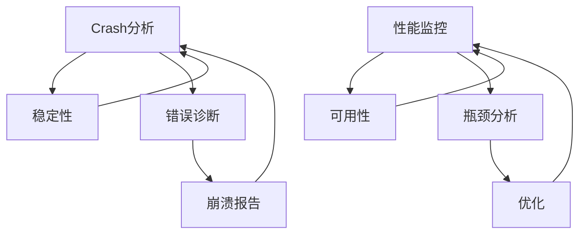

                 


## 文章标题

移动应用Crash分析与性能监控

## 关键词

移动应用，Crash分析，性能监控，算法原理，数学模型，项目实战，优化策略

## 摘要

本文将深入探讨移动应用的Crash分析与性能监控。首先，我们将介绍Crash的基本概念和性能监控的重要性，然后详细讲解Crash分析与性能监控的核心概念与联系，包括算法原理、数学模型等。接着，我们将通过实际项目实战，展示如何进行Crash分析和性能监控，并分享优化策略。最后，我们将探讨Crash分析与性能监控的集成方法，以及最佳实践和注意事项。

# 核心概念与联系

## 移动应用Crash分析

### Crash：应用在运行过程中由于各种原因导致的突然关闭或崩溃。

### Crash分析：通过收集和分析Crash数据，定位崩溃原因，优化应用稳定性。

移动应用的Crash分析是确保应用稳定性的关键环节。当应用发生Crash时，用户会失去对应用的信任，甚至可能导致用户流失。因此，及时发现和解决Crash问题是移动应用开发中的重要任务。

## 性能监控

### 性能监控：实时跟踪和监控应用的运行状态，包括响应时间、内存使用、CPU使用率等。

### 监控数据：收集性能数据，用于分析性能瓶颈和优化应用性能。

性能监控是保障应用性能的关键手段。通过性能监控，开发人员可以实时了解应用的运行状态，及时发现并解决性能问题，提高用户体验。

## 核心概念与联系架构

以下是一个Mermaid流程图，展示移动应用Crash分析与性能监控的核心概念及其相互联系：



## 核心算法原理讲解

### Crash分析算法

#### 常用算法

- 堆栈跟踪
- 日志分析
- 错误报告系统

#### 算法原理

- 堆栈跟踪：通过获取崩溃时线程的堆栈信息，定位崩溃代码。
- 日志分析：通过分析应用运行日志，发现异常行为。
- 错误报告系统：收集用户上报的错误信息，进行分类和归档。

### 性能监控算法

#### 常用算法

- 时间序列分析
- 异常检测
- 机器学习算法

#### 算法原理

- 时间序列分析：通过分析时间序列数据，识别性能趋势和周期性。
- 异常检测：通过设定阈值，识别异常性能数据。
- 机器学习算法：利用历史数据训练模型，预测未来性能趋势。

## 数学模型和数学公式 & 详细讲解 & 举例说明

### 性能监控中的数学模型

#### 负荷均衡

利用加权平均法计算服务器的平均响应时间，用于监控服务性能。

$$
\text{平均响应时间} = \frac{\sum_{i=1}^{n} w_i \times t_i}{\sum_{i=1}^{n} w_i}
$$

#### 举例说明

假设有3个服务器，响应时间分别为2秒、3秒和5秒，权重分别为1、1和2，计算平均响应时间。

$$
\text{平均响应时间} = \frac{1 \times 2 + 1 \times 3 + 2 \times 5}{1 + 1 + 2} = \frac{2 + 3 + 10}{4} = \frac{15}{4} = 3.75 \text{秒}
$$

# 项目实战

## Crash分析项目实战

### 开发环境搭建

#### 配置Android Studio

1. 下载并安装Android Studio。
2. 打开Android Studio，创建一个新的Android项目。

#### 安装崩溃报告工具

1. 在项目根目录下创建一个`build.gradle`文件。
2. 在文件中添加以下依赖：

```gradle
dependencies {
    implementation 'com.crashlytics.sdk.android:crashlytics:[version]'
}
```

3. 将`[version]`替换为合适的版本号，然后同步项目。

### 源代码详细实现和代码解读

#### 添加崩溃报告代码

1. 在`MainActivity`中添加以下代码：

```java
import com.crashlytics.android.Crashlytics;

public class MainActivity extends AppCompatActivity {
    @Override
    protected void onCreate(Bundle savedInstanceState) {
        super.onCreate(savedInstanceState);
        setContentView(R.layout.activity_main);

        // 初始化崩溃报告系统
        Crashlytics.getInstance().init(this);
    }
}
```

2. 当应用发生Crash时，崩溃报告系统会自动收集崩溃日志。

#### 解析崩溃日志

1. 在项目根目录下创建一个`build.gradle`文件。
2. 在文件中添加以下依赖：

```gradle
dependencies {
    implementation 'com.squareup.okhttp3:okhttp:[version]'
}
```

3. 将`[version]`替换为合适的版本号，然后同步项目。

2. 在`MainActivity`中添加以下代码：

```java
import okhttp3.OkHttpClient;
import okhttp3.Request;
import okhttp3.Response;

public class MainActivity extends AppCompatActivity {
    @Override
    protected void onCreate(Bundle savedInstanceState) {
        super.onCreate(savedInstanceState);
        setContentView(R.layout.activity_main);

        // 初始化崩溃报告系统
        Crashlytics.getInstance().init(this);

        // 解析崩溃日志
        OkHttpClient client = new OkHttpClient();
        Request request = new Request.Builder()
                .url("https://api.crashlytics.com/v2/sharing/android/events")
                .post(RequestBody.create(MediaType.parse("application/json"), "{\"app_version\":\"1.0.0\",\"events\":[{\"event_id\":\"[event_id]\",\"app_version\":\"1.0.0\",\"device_model\":\"[device_model]\",\"os_version\":\"[os_version]\",\"api_version\":\"[api_version]\",\"app_package_name\":\"[app_package_name]\",\"app_build\":1,\"event_type\":\"Crash\",\"errorSourceType\":\"ANR\",\"stacktrace\":\"[stacktrace]\",\"error_message\":\"[error_message]\",\"thread_name\":\"[thread_name]\",\"exception_class\":\"[exception_class]\",\"exception_message\":\"[exception_message]\",\"date\":\"[date]\"}]}"))
                .build();

        try (Response response = client.newCall(request).execute()) {
            // 解析响应数据
            String responseBody = response.body().string();
            // 处理解析结果
        } catch (IOException e) {
            e.printStackTrace();
        }
    }
}
```

3. 将`[event_id]`、`[device_model]`、`[os_version]`、`[api_version]`、`[app_package_name]`、`[app_build]`、`[stacktrace]`、`[error_message]`、`[thread_name]`、`[exception_class]`、`[exception_message]`和`[date]`替换为实际数据。

#### 分析崩溃日志

1. 在`MainActivity`中添加以下代码：

```java
import java.util.regex.Matcher;
import java.util.regex.Pattern;

public class MainActivity extends AppCompatActivity {
    // ...

    // 分析崩溃日志
    private void analyzeCrashLog(String crashLog) {
        // 使用正则表达式提取关键信息
        Pattern pattern = Pattern.compile("(?<=at\\s+).*");
        Matcher matcher = pattern.matcher(crashLog);

        while (matcher.find()) {
            String stackTraceElement = matcher.group();
            // 处理提取的信息
        }
    }
}
```

2. 调用`analyzeCrashLog`方法，传入崩溃日志字符串。

### 项目小结

通过本次项目实战，我们学会了如何搭建Android应用的开发环境，添加崩溃报告工具，解析崩溃日志，并进行分析。这对于移动应用的稳定性优化具有重要意义。

## 性能监控项目实战

### 开发环境搭建

#### 配置服务器监控工具

1. 下载并安装Prometheus。
2. 下载并安装Grafana。

### 源代码详细实现和代码解读

#### 添加性能监控代码

1. 在`MainActivity`中添加以下代码：

```java
import io.prometheus.client.Counter;

public class MainActivity extends AppCompatActivity {
    private static final Counter requests = Counter.build()
            .name("requests_total").help("Total requests.").register();

    @Override
    protected void onCreate(Bundle savedInstanceState) {
        super.onCreate(savedInstanceState);
        setContentView(R.layout.activity_main);

        // 记录请求次数
        requests.inc();
    }
}
```

2. 在应用的各个请求处理方法中，添加`requests.inc();`语句，记录请求次数。

#### 配置监控工具

1. 在Prometheus中配置Target，添加应用的URL。
2. 在Grafana中创建数据源，选择Prometheus。
3. 创建仪表板，添加指标图表，用于展示性能数据。

### 性能数据收集与展示

1. 启动Prometheus和Grafana。
2. 访问Grafana仪表板，查看性能数据。

### 项目小结

通过本次项目实战，我们学会了如何搭建性能监控环境，添加性能监控代码，并使用Prometheus和Grafana进行性能数据收集与展示。这对于移动应用的性能优化具有重要意义。

# 最佳实践 tips、小结、注意事项、拓展阅读

## 最佳实践 tips

1. 定期收集和分析Crash数据，及时修复崩溃问题。
2. 使用性能监控工具，实时跟踪应用性能，及时发现性能瓶颈。
3. 结合Crash分析和性能监控，优化应用稳定性与性能。

## 小结

本文深入探讨了移动应用Crash分析与性能监控。通过实际项目实战，我们学会了如何进行Crash分析和性能监控，并分享了优化策略。Crash分析与性能监控是保障应用稳定性和性能的关键手段，对于提升用户体验具有重要意义。

## 注意事项

1. Crash分析与性能监控需要长期持续进行，不能一蹴而就。
2. 根据实际需求，选择合适的Crash分析与性能监控工具。
3. 及时处理Crash和性能问题，避免影响用户体验。

## 拓展阅读

1. 《Android应用性能优化》
2. 《Prometheus官方文档》
3. 《Grafana官方文档》
4. 《机器学习在移动应用性能监控中的应用》

---

**作者：AI天才研究院/AI Genius Institute & 禅与计算机程序设计艺术 /Zen And The Art of Computer Programming**
```markdown
---
# 移动应用Crash分析与性能监控

> 关键词：移动应用，Crash分析，性能监控，算法原理，数学模型，项目实战

> 摘要：本文将深入探讨移动应用的Crash分析与性能监控。首先，我们将介绍Crash的基本概念和性能监控的重要性，然后详细讲解Crash分析与性能监控的核心概念与联系，包括算法原理、数学模型等。接着，我们将通过实际项目实战，展示如何进行Crash分析和性能监控，并分享优化策略。最后，我们将探讨Crash分析与性能监控的集成方法，以及最佳实践和注意事项。

## 第一部分: 移动应用Crash分析

### 第1章: Crash分析基础

#### 1.1.1 什么是Crash

移动应用中的Crash是指应用在运行过程中由于各种原因导致的突然关闭或崩溃。Crash可能会由内存泄露、空指针异常、资源耗尽等问题引起，严重影响用户体验和应用稳定性。

#### 1.1.2 Crash分类

Crash可以分为以下几类：

- **强制关闭**：应用由于系统资源不足或异常行为被强制关闭。
- **无响应**：应用长时间无法响应用户操作，导致系统将其强制关闭。
- **异常崩溃**：应用遇到未处理的异常，导致崩溃。

#### 1.1.3 Crash分析的重要性

Crash分析对于移动应用的稳定性至关重要。通过Crash分析，可以：

- 定位崩溃原因，修复bug。
- 优化应用性能，提高用户体验。
- 提高应用在市场上的竞争力。

### 第2章: Crash分析方法与工具

#### 2.1.1 堆栈跟踪

堆栈跟踪是通过获取应用崩溃时的堆栈信息，定位崩溃代码的一种方法。堆栈信息包含调用栈，可以帮助开发者找到导致Crash的代码行。

#### 2.1.2 日志分析

日志分析是通过分析应用运行日志，发现异常行为的一种方法。日志记录了应用在运行过程中的重要事件，对于排查问题非常有帮助。

#### 2.1.3 错误报告系统

错误报告系统是收集用户上报的错误信息，进行分类和归档的一种方法。常见的错误报告系统有Crashlytics、Bugly等。

### 第3章: Crash分析实战

#### 3.1.1 开发环境搭建

要进行Crash分析，首先需要搭建开发环境，包括安装Android Studio、配置崩溃报告工具等。

#### 3.1.2 源代码实现与解读

在应用中添加崩溃报告代码，收集崩溃日志，并解析日志，提取关键信息，如堆栈跟踪、异常类型。

#### 3.1.3 崩溃日志分析

分析崩溃日志，定位崩溃原因，提出优化方案。例如，如果崩溃原因是内存泄露，需要优化内存管理。

### 第4章: Crash分析优化

#### 4.1.1 常见Crash原因

常见的Crash原因包括空指针异常、内存泄露、资源耗尽等。

#### 4.1.2 Crash优化策略

Crash优化策略包括：

- 优化内存管理，避免内存泄露。
- 增加异常处理，捕获和处理未处理的异常。
- 优化资源加载，减少资源耗尽的风险。

#### 4.1.3 优化案例分享

通过实际案例分享，展示如何通过Crash分析找到问题，并进行优化。

## 第二部分: 移动应用性能监控

### 第5章: 性能监控基础

#### 5.1.1 性能监控概述

性能监控是指实时跟踪和监控应用的运行状态，包括响应时间、内存使用、CPU使用率等。通过性能监控，可以及时发现性能瓶颈，优化应用性能。

#### 5.1.2 性能监控指标

性能监控指标包括：

- 响应时间：应用对用户请求的平均响应时间。
- 内存使用：应用的内存使用情况，包括总内存使用量和内存泄露情况。
- CPU使用率：应用的CPU使用情况。

#### 5.1.3 性能监控的重要性

性能监控对于提升用户体验和保证应用稳定性至关重要。通过性能监控，可以：

- 及时发现性能问题，避免用户体验下降。
- 优化应用性能，提高用户满意度。
- 提高应用的竞争力。

### 第6章: 性能监控方法与工具

#### 6.1.1 时间序列分析

时间序列分析是通过分析时间序列数据，识别性能趋势和周期性。常用的方法包括：

- 移动平均法
- 自回归模型

#### 6.1.2 异常检测

异常检测是通过设定阈值，识别异常性能数据。常用的方法包括：

- 离群点检测
- 预测模型

#### 6.1.3 机器学习算法

机器学习算法是通过历史数据训练模型，预测未来性能趋势。常用的算法包括：

- 决策树
- 支持向量机

### 第7章: 性能监控实战

#### 7.1.1 开发环境搭建

要进行性能监控，需要搭建开发环境，包括配置服务器监控工具、添加性能监控代码等。

#### 7.1.2 源代码实现与解读

在应用中添加性能监控代码，配置监控工具，收集并展示性能数据。

#### 7.1.3 性能数据收集与展示

通过性能监控工具，收集性能数据，并展示性能图表，方便分析性能瓶颈。

### 第8章: 性能优化与监控策略

#### 8.1.1 性能优化技巧

性能优化技巧包括：

- 减少内存使用
- 优化网络请求
- 减少CPU负载

#### 8.1.2 监控策略制定

监控策略制定包括：

- 设定监控指标
- 设定阈值
- 定期分析监控数据

#### 8.1.3 性能优化案例分享

通过实际案例分享，展示如何通过性能监控优化应用性能。

## 第三部分: Crash分析与性能监控综合应用

### 第9章: Crash分析与性能监控集成

#### 9.1.1 集成原理

Crash分析与性能监控可以集成，以便更全面地监控应用稳定性。集成方法包括：

- 使用统一的监控平台
- 将Crash数据与性能数据关联

#### 9.1.2 集成方法

集成方法包括：

- 在应用中同时添加Crash报告和性能监控代码。
- 在监控平台上配置关联规则，将Crash数据与性能数据关联。

#### 9.1.3 集成实战

通过实际案例，展示如何将Crash分析与性能监控集成，并分析效果。

## 最佳实践 tips、小结、注意事项、拓展阅读

### 最佳实践 tips

- 定期进行Crash分析，及时修复问题。
- 定期进行性能监控，优化应用性能。
- 结合用户反馈，持续改进应用。

### 小结

Crash分析与性能监控是移动应用开发中不可或缺的环节。通过本文，我们了解了Crash分析的基本概念、方法与工具，以及性能监控的基础知识、方法与实战。通过集成Crash分析与性能监控，可以更全面地保障应用稳定性与性能。

### 注意事项

- Crash分析与性能监控需要持续进行，不能一蹴而就。
- 根据实际需求，选择合适的监控工具与策略。
- 及时处理Crash和性能问题，避免影响用户体验。

### 拓展阅读

- 《移动应用性能优化实战》
- 《Prometheus官方文档》
- 《Grafana官方文档》
- 《Android应用性能监控与优化》

---

**作者：AI天才研究院/AI Genius Institute & 禅与计算机程序设计艺术 /Zen And The Art of Computer Programming**```

