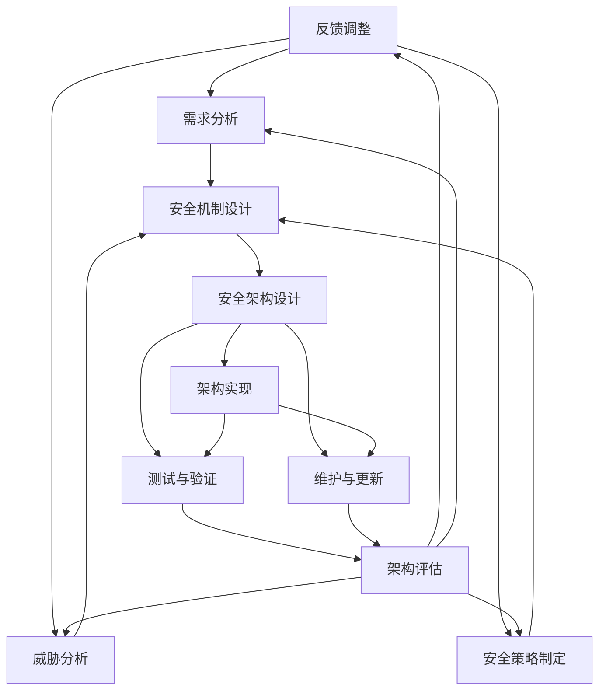

                 

### 移动应用安全的重要性

在当今数字化时代，移动应用已成为人们日常生活和工作的重要组成部分。然而，随之而来的是日益严峻的安全威胁。移动应用安全的重要性不言而喻，这不仅关系到用户的数据安全与隐私，还影响到整个社会的网络安全与稳定。

首先，用户数据的安全性是移动应用安全的核心关注点之一。移动应用通常需要收集用户的个人信息，如姓名、地址、电话号码、电子邮件等。一旦这些数据被恶意攻击者获取，可能会被用于身份盗窃、诈骗等违法行为。此外，用户的财务信息、健康记录等敏感数据一旦泄露，后果将更加严重。

其次，隐私保护也是移动应用安全的一个重要方面。随着用户对隐私的关注度逐渐提高，如何确保用户数据在收集、存储、处理和使用过程中的隐私安全，已成为移动应用开发者和运营者必须面对的挑战。如果用户隐私得不到有效保护，将严重影响用户对移动应用的使用体验和信任度。

再者，移动应用的安全问题不仅影响到单个用户，还会对整个社会造成潜在威胁。例如，某些恶意应用可能通过伪装成合法应用吸引用户下载，进而窃取用户数据和控制系统。这种恶意行为不仅会给用户带来经济损失，还可能影响国家信息安全和社会稳定。

总之，移动应用安全的重要性体现在用户数据安全、隐私保护和整体社会安全等多个层面。随着移动应用的普及，安全问题将越来越突出，因此，加强移动应用安全刻不容缓。

### 移动应用安全的核心威胁类型

在理解了移动应用安全的重要性之后，我们需要深入了解其面临的核心威胁类型。这些威胁大致可以分为以下几类：恶意应用、信息泄露、钓鱼攻击和中间人攻击等。每种威胁都具有独特的特点，需要采取相应的防护措施。

#### 恶意应用

恶意应用是移动应用安全领域的主要威胁之一。这些应用通常伪装成合法的应用，通过诱导用户下载安装，从而在用户设备上运行恶意代码。恶意应用的主要目的包括：

1. **窃取信息**：恶意应用可以获取用户的个人信息、通讯记录、地理位置等敏感数据，并将其上传到攻击者的服务器。
2. **破坏设备**：某些恶意应用会植入病毒或恶意软件，破坏设备系统，导致设备变慢、死机甚至无法正常使用。
3. **恶意操作**：如远程控制设备、发送恶意短信等，对用户造成经济损失。

防范措施：

- **应用市场认证**：用户应选择正规的应用市场下载应用，并注意应用开发者是否经过官方认证。
- **应用权限检查**：用户在安装应用前应仔细检查应用所需权限，避免授权给不必要的权限。
- **安全防护软件**：使用专业的移动安全防护软件，对应用进行实时监测和防护。

#### 信息泄露

信息泄露是移动应用安全面临的另一大威胁。由于移动应用通常需要收集用户的个人信息，一旦数据泄露，将对用户造成严重后果。信息泄露的主要途径包括：

1. **应用后端漏洞**：如数据库未加密、SQL注入等，攻击者可以通过这些漏洞直接访问用户数据。
2. **通信过程泄露**：如未使用HTTPS加密通信，攻击者可以通过中间人攻击窃取用户数据。
3. **内部人员泄露**：内部人员泄露数据也是信息泄露的一个重要途径。

防范措施：

- **加密技术**：对存储和传输的敏感数据进行加密处理，确保数据安全性。
- **安全通信**：使用HTTPS等加密协议进行数据传输，防止中间人攻击。
- **访问控制**：建立严格的权限管理和访问控制机制，限制内部人员对敏感数据的访问。

#### 钓鱼攻击

钓鱼攻击是指攻击者通过伪造合法应用或网站，诱导用户输入个人信息，如账号密码等，从而窃取用户数据。钓鱼攻击的特点是手段多样、变化频繁，防范难度较大。

1. **应用钓鱼**：攻击者伪造合法应用，通过诱导用户下载安装，进而获取用户权限和数据。
2. **网站钓鱼**：攻击者通过发送伪装成合法网站的链接，诱导用户点击，从而窃取用户输入的敏感信息。

防范措施：

- **验证应用来源**：确保应用来源可靠，避免下载来自不可信来源的应用。
- **辨别网站真实性**：通过检查网站SSL证书、网站结构等，辨别网站是否真实。
- **安全提醒**：应用和浏览器应提供安全提醒功能，及时告知用户可能存在的钓鱼风险。

#### 中间人攻击

中间人攻击（Man-in-the-Middle，MitM）是指攻击者拦截并篡改通信双方的数据传输。中间人攻击的主要目的是窃取敏感信息或篡改数据，对用户的隐私和财产安全构成威胁。

1. **窃取信息**：攻击者可以拦截用户和服务器之间的通信，获取用户的账号密码、信用卡信息等。
2. **篡改数据**：攻击者可以篡改通信双方的数据，如修改交易金额、身份信息等。

防范措施：

- **加密通信**：使用HTTPS等加密协议进行数据传输，防止中间人攻击。
- **验证证书**：确保通信双方的证书有效性，防止攻击者伪造证书。
- **使用VPN**：通过VPN建立加密通道，保护数据传输安全。

综上所述，移动应用安全面临多种威胁，每种威胁都需要我们采取相应的防护措施。通过综合应用各种安全技术和策略，可以有效地保护移动应用及其用户的安全。

### 移动应用安全的发展趋势

随着技术的不断进步，移动应用安全也在持续演变，呈现出多个显著的发展趋势。以下将探讨几个关键的发展方向：安全集成、新兴安全技术、合规与法规的演变，以及未来可能的创新。

#### 安全集成

在移动应用开发过程中，安全不再是一个可选的附加组件，而是与功能开发并行的核心环节。安全集成正在成为软件开发实践的重要组成部分。开发者和安全专家正在寻找方法，将安全措施无缝整合到开发周期中的每个阶段，包括设计、编码、测试和部署。

1. **持续集成与持续部署（CI/CD）**：通过CI/CD流程，安全测试和代码审查可以自动集成到开发过程中，确保每个代码提交都经过安全检查。
2. **安全编码实践**：开发人员通过遵循安全编码准则，从源头上减少代码中的安全漏洞。
3. **应用自我保护（App Self-Protection）**：开发者可以构建具有自我保护功能的应用，使其在面临攻击时能够自动检测并采取应对措施。

#### 新兴安全技术

移动应用安全领域不断涌现出新兴技术，为解决现有安全挑战提供了新的工具和方法。

1. **区块链技术**：区块链的分布式账本和智能合约特性可以增强数据的安全性和透明度，为移动应用的数据存储和处理提供新的解决方案。
2. **零信任架构**：零信任架构（Zero Trust Architecture，ZTA）强调“永不信任，总是验证”，通过严格的身份验证和访问控制，减少内部威胁和横向移动攻击的风险。
3. **行为分析**：利用机器学习和人工智能技术，分析用户行为和应用程序的行为，及时发现异常活动和潜在威胁。

#### 合规与法规的演变

随着移动应用用户数据的增加和隐私保护意识的提升，全球各国相继出台了相关法律法规，对移动应用的数据收集、存储和处理进行了严格规定。

1. **通用数据保护条例（GDPR）**：欧盟的GDPR是首个对个人数据保护进行全面规定的法规，对移动应用的数据处理提出了严格要求。
2. **加州消费者隐私法案（CCPA）**：美国加州的CCPA则规定了个人数据的收集和使用需要用户同意，并对数据泄露后的责任进行了详细规定。
3. **其他地区法规**：世界各地也在不断出台类似的隐私保护法规，如中国的《个人信息保护法》等。

#### 未来可能的创新

未来，移动应用安全可能会在以下几个方面出现创新：

1. **量子加密技术**：随着量子计算机的发展，传统的加密算法将面临被破解的风险。量子加密技术有望提供一种更加安全的加密方式，抵御未来的量子攻击。
2. **脑机接口（BMI）安全**：随着脑机接口技术的发展，如何保护用户的大脑活动数据将成为新的安全挑战。
3. **可解释性AI**：为了增强AI系统的透明度和可解释性，开发可解释的人工智能（Explainable AI，XAI）技术，使其在移动应用安全领域中更加可靠。

综上所述，移动应用安全的发展趋势表明，安全正逐步成为移动应用的核心竞争力。通过不断引入新技术、遵守法规标准，以及优化开发实践，开发者可以构建更加安全可靠的移动应用，保护用户的隐私和数据安全。

### 安全模型与架构

在移动应用安全中，安全模型和安全架构的设计至关重要。一个良好的安全模型和架构能够有效地识别、保护和管理移动应用中的潜在风险。本节将详细介绍安全模型的定义、架构设计原则以及二者之间的联系。

#### 安全模型

安全模型是一种抽象的框架，用于描述系统的安全需求、安全策略和安全机制。它是设计安全架构的基础，可以帮助我们理解系统在不同威胁情景下的行为。

1. **安全需求**：安全模型首先需要定义系统所需的安全需求，包括数据保密性、完整性、可用性和认证等。这些需求通常以形式化的语言或文档进行描述。
2. **安全策略**：安全策略规定了系统如何满足安全需求。例如，访问控制策略可以定义哪些用户有权访问哪些资源，以及访问的具体方式。
3. **安全机制**：安全机制是实现安全策略的具体技术手段，如加密技术、认证机制和访问控制等。安全机制通常以算法或协议的形式存在。

#### 安全架构设计原则

安全架构设计原则是指在设计安全架构时需要遵循的基本原则，以确保架构的合理性和有效性。以下是几个关键原则：

1. **最小权限原则**：系统中的每个组件应仅拥有执行其功能所需的最小权限。这有助于减少恶意行为和内部威胁的风险。
2. **透明性原则**：安全架构的设计应保持透明，使得所有相关的用户和系统能够理解和遵守安全规则。
3. **防御深度原则**：安全架构应采用多层次防御策略，通过在不同层次上部署不同的安全措施，提高系统的整体安全性。
4. **一致性原则**：安全架构应保持一致，确保所有组件和安全机制之间能够无缝协作，形成统一的防护体系。

#### 安全模型与架构的关系

安全模型和安全架构之间存在紧密的联系。安全模型为安全架构提供了理论基础和设计指南，而安全架构则将安全模型的具体实现落地。以下是安全模型与架构之间关系的详细阐述：

1. **指导架构设计**：安全模型定义了系统的安全需求和策略，这些信息直接指导安全架构的设计。例如，如果安全模型强调数据保密性，架构设计时就会采用加密技术来保护数据。
2. **实现安全机制**：安全模型中的安全机制需要通过安全架构来实现。例如，安全模型中提到的认证机制可以通过身份验证模块来实现。
3. **评估和改进**：安全架构的实现和部署后，可以通过安全模型来评估其效果，并根据评估结果进行改进。例如，通过模拟攻击来验证安全措施的有效性，并据此调整安全架构。

#### 安全架构设计步骤

安全架构设计通常包括以下步骤：

1. **需求分析**：分析系统的安全需求，明确需要保护的数据、系统和用户。
2. **威胁分析**：识别系统可能面临的威胁，包括外部威胁和内部威胁。
3. **安全策略制定**：基于需求和威胁分析，制定安全策略，包括访问控制策略、加密策略等。
4. **安全机制设计**：根据安全策略，设计实现安全机制的具体方案，如加密算法、认证协议等。
5. **架构实现**：将设计的安全机制集成到系统中，实现安全架构。
6. **测试和验证**：通过测试和验证确保安全架构的有效性和可靠性。
7. **维护和更新**：定期对安全架构进行维护和更新，以应对新的威胁和需求变化。

通过上述步骤，开发者和安全专家可以构建一个全面、有效的移动应用安全架构，从而保护用户数据和隐私，提高系统的整体安全性。

### 安全模型与架构之间的联系

在移动应用安全中，安全模型和安全架构之间的联系是确保系统安全性的关键。一个有效的安全模型为安全架构提供了理论基础和设计指南，而安全架构则是实现安全模型的具体落地。以下通过一个具体的Mermaid流程图，详细说明安全模型与架构之间的交互关系。



该Mermaid图展示了安全模型与架构之间循环互动的过程：

1. **安全模型驱动架构设计**：安全模型（A）通过需求分析（B）、威胁分析（C）和安全策略制定（D）生成安全机制（E），这些安全机制进一步指导安全架构的设计（F）。

2. **安全架构实现与验证**：安全架构（F）被实现为具体的系统组件（G），并通过测试与验证（H）来确保其有效性和可靠性。

3. **架构评估与反馈**：通过测试与验证，对安全架构进行评估（J），评估结果反馈到安全模型（A），用于调整和优化安全需求（B）、威胁分析（C）和安全策略（D）。

4. **持续迭代**：安全模型和安全架构不是静态的，而是一个持续迭代的过程。通过维护与更新（I），根据新的威胁和需求变化，不断调整和优化安全模型（A）和安全架构（F）。

通过这个流程，我们可以看到，安全模型与架构之间是动态互动、相互依赖的关系。安全模型为架构设计提供了方向，而架构实现则为安全模型提供了落地支持，二者共同构建了一个安全、可靠、灵活的移动应用安全体系。

### 加密技术原理

加密技术是保障移动应用数据安全的核心手段，它通过将明文数据转换为无法直接读取的密文，确保信息在存储、传输和处理过程中的保密性、完整性和不可抵赖性。本文将深入探讨对称加密、非对称加密的基本概念和常见加密算法，以及其在移动应用安全中的实际应用。

#### 对称加密

对称加密是一种加密方式，其中加密和解密使用相同的密钥。这意味着加密者和解密者必须事先共享这个密钥。常见的对称加密算法包括：

1. **AES（高级加密标准）**：AES是最常用的对称加密算法，由美国国家标准与技术研究院（NIST）制定。它支持128位、192位和256位的密钥长度，具有高效性和安全性。
   
   **AES加密过程**（以128位密钥为例）：
   ```mermaid
   graph TD
       A[明文] --> B[输入到AES算法]
       B --> C{进行密钥扩展}
       C --> D{进行加密轮次}
       D --> E[输出密文]
   ```

2. **DES（数据加密标准）**：DES是一种较早的对称加密算法，采用56位密钥。由于密钥长度较短，现代攻击手段已经能够破解DES加密数据。

   **DES加密过程**：
   ```mermaid
   graph TD
       A[明文] --> B[输入到DES算法]
       B --> C{进行初始置换}
       C --> D{进行16轮加密}
       D --> E[输出密文]
   ```

对称加密的优点在于速度快、计算成本低，适用于需要大量数据加密的场景。但其主要缺点是密钥分发和管理复杂，因此需要在安全的环境中谨慎使用。

#### 非对称加密

非对称加密使用一对密钥：公钥和私钥。公钥用于加密，私钥用于解密。常见的非对称加密算法包括：

1. **RSA（Rivest-Shamir-Adleman）**：RSA是目前最流行的非对称加密算法之一，由三个发明者命名。它基于大素数分解的数学难题，支持1024位到4096位的密钥长度。

   **RSA加密过程**：
   ```mermaid
   graph TD
       A[明文] --> B[输入到RSA算法]
       B --> C{计算公钥和私钥}
       C --> D[使用公钥加密]
       D --> E[输出密文]
       E --> F[发送给接收者]
       F --> G{接收者使用私钥解密}
       G --> H[输出明文]
   ```

2. **ECC（椭圆曲线加密）**：ECC是一种基于椭圆曲线离散对数问题的加密算法，相较于RSA具有更高的安全性和效率。它使用256位密钥即可提供与RSA 3072位密钥相似的安全级别。

   **ECC加密过程**：
   ```mermaid
   graph TD
       A[明文] --> B[输入到ECC算法]
       B --> C{选择椭圆曲线和基点}
       C --> D[计算公钥和私钥]
       D --> E[使用公钥加密]
       E --> F[输出密文]
       F --> G[发送给接收者]
       G --> H{接收者使用私钥解密}
       H --> I[输出明文]
   ```

非对称加密的优点在于解决了密钥分发问题，但其计算成本较高，适用于加密少量数据或生成数字签名。

#### 常见加密算法

除了AES、DES、RSA和ECC，还有一些常见的加密算法，包括：

1. **3DES（三重数据加密标准）**：3DES是对DES的改进，使用三个密钥对数据进行加密，提高了安全性。
2. ** Blowfish**：Blowfish是一种对称加密算法，支持可变长度的密钥，具有高效性和灵活性。
3. **Twofish**：Twofish是AES的候选算法之一，也是一种对称加密算法，以其高效性和安全性著称。

#### 实际应用

在移动应用中，加密技术广泛应用于以下场景：

1. **数据存储**：移动应用通常需要加密存储敏感数据，如用户密码、支付信息等。AES和RSA常用于此类场景。
2. **数据传输**：为了确保数据在传输过程中的安全，移动应用会使用HTTPS协议，该协议利用TLS/SSL加密数据传输。RSA和ECC可用于加密传输过程中的密钥交换。
3. **身份认证**：非对称加密算法（如RSA和ECC）在数字签名和身份认证中发挥重要作用，确保通信双方的身份验证和数据完整性。

通过综合应用对称加密和非对称加密，移动应用可以有效地保护用户数据和隐私，增强整体安全性。

### 加密算法实现

为了深入理解加密算法的工作原理，我们将通过伪代码和详细步骤，详细阐述AES（高级加密标准）和RSA（Rivest-Shamir-Adleman）两种常见加密算法的实现过程。

#### AES加密算法

AES是一种对称加密算法，其核心在于其强大的安全性能和高效的计算速度。以下是AES加密的伪代码和详细步骤：

```plaintext
// 伪代码：AES加密算法

// 输入：明文（plaintext）、密钥（key）
// 输出：密文（cipher）
// 步骤：
1. 初始化密钥
2. 对明文进行分组
3. 对每个分组执行以下步骤：
   a. 初始轮加密
   b. 多轮加密
   c. 最终轮加密
4. 将所有加密后的分组合并为密文

// 详细步骤：

// 初始化密钥
function KeyExpansion(key):
    // 根据密钥生成多个加密轮所需的子密钥
    // ...

// 对明文进行分组
function PKCS5Padding(plaintext):
    // 对明文进行填充，确保分组长度为16字节
    // ...

plaintext = PKCS5Padding(plaintext)
cipher = []

for each block in plaintext:
    // 对每个分组执行加密
    block_cipher = EncryptBlock(block, key)
    cipher.append(block_cipher)

return cipher
```

1. **初始化密钥**：根据输入的密钥，通过KeyExpansion函数生成多个加密轮所需的子密钥。
2. **分组明文**：使用PKCS5Padding函数对明文进行填充，确保每个分组长度为16字节。
3. **加密分组**：
   - **初始轮加密**：对每个分组执行初始轮加密，包括字节替换、行移位和列混淆等操作。
   - **多轮加密**：对每个分组执行多个加密轮，每轮包括字节替换、行移位、列混淆和密钥加等操作。
   - **最终轮加密**：执行最后一轮加密，结果即为密文。

#### RSA加密算法

RSA是一种非对称加密算法，其安全性基于大整数分解的数学难题。以下是RSA加密的伪代码和详细步骤：

```plaintext
// 伪代码：RSA加密算法

// 输入：明文（plaintext）、公钥（publicKey）
// 输出：密文（cipher）
// 步骤：
1. 计算加密指数
2. 计算模数
3. 使用RSA算法进行加密

// 详细步骤：

// 计算加密指数
function ComputeEncryptionExponent(e, n):
    // 根据公钥计算加密指数
    // ...

// 计算模数
function ComputeModulus(p, q):
    // 根据公钥计算模数
    // ...

cipher = []

for each byte in plaintext:
    // 对每个字节进行加密
    byte_cipher = PowMod(byte, encryptionExponent, modulus)
    cipher.append(byte_cipher)

return cipher
```

1. **计算加密指数**：根据公钥，计算加密指数（通常为e=3或e=17）。
2. **计算模数**：根据公钥的两个素数p和q，计算模数（n = p * q）。
3. **加密字节**：对明文中的每个字节，使用RSA算法进行加密，具体步骤如下：
   - **幂运算**：计算每个字节在模数下的加密结果。
   - **合并结果**：将加密后的字节合并为密文。

通过上述伪代码和详细步骤，我们可以清晰地了解AES和RSA两种加密算法的实现过程。在实际应用中，这些算法通过高效的编程和优化，可以确保移动应用数据的安全传输和存储。

### 加密数学基础

加密算法的核心在于其数学基础，尤其是大素数分布和欧拉函数。以下将深入探讨这些数学概念，并解释其在加密算法中的应用。

#### 大素数分布

大素数分布是指素数在自然数中的分布情况。一个数是素数当且仅当它只能被1和自身整除。大素数分布对加密算法至关重要，因为其难以预测性和随机性使得加密算法在安全性上具有很高的保障。

1. **素数分布理论**：素数分布遵循一定的统计规律。例如，欧拉猜想表明，对于一个充分大的自然数n，存在大约n/ln(n)个素数。这意味着素数的分布不是均匀的，但也不是完全随机的。

2. **大素数生成**：在实际应用中，大素数的生成是随机选择的，通常通过随机数生成器和素数测试算法（如米勒-拉宾素性测试）来完成。大素数的选择对于RSA等非对称加密算法的安全性至关重要。

#### 欧拉函数

欧拉函数（Euler's Totient Function），记为φ(n)，是数学中用于计算正整数n的与n互质的数（即欧拉函数值）的个数的一个函数。欧拉函数在公钥加密系统中，特别是在RSA算法中起着核心作用。

1. **欧拉函数定义**：对于任意正整数n，如果n可以分解为素数的乘积（n = p1^k1 * p2^k2 * ... * pk^kk），则欧拉函数φ(n)可以表示为：
   \[
   φ(n) = n \left(1 - \frac{1}{p1}\right)\left(1 - \frac{1}{p2}\right)...\left(1 - \frac{1}{pk}\right)
   \]

2. **欧拉函数性质**：欧拉函数具有几个重要性质，包括：
   - **可分解性**：如果n是素数，则φ(n) = n - 1。
   - **互质性**：如果两个数a和n互质，即gcd(a, n) = 1，则a在模n下是可逆的，即存在一个数b，使得ab ≡ 1 (mod n)。

#### 欧拉函数在加密中的应用

1. **RSA算法**：RSA算法是一种基于大素数和欧拉函数的非对称加密算法。在RSA中，选择两个大素数p和q，计算n = p * q和φ(n) = (p - 1) * (q - 1)。公钥为(n, e)，私钥为(n, d)，其中e和d是一对欧拉函数的逆元。加密和解密过程如下：
   - **加密**：将明文m通过公式\( c = m^e \mod n \)转换为密文c。
   - **解密**：将密文c通过公式\( m = c^d \mod n \)还原为明文m。

2. **欧拉定理**：欧拉定理是欧拉函数在密码学中的另一个重要应用。欧拉定理表明，如果a和n互质，则a^φ(n) ≡ 1 (mod n)。这一性质在RSA算法中用于证明d是e的模反元素，即ed ≡ 1 (mod φ(n))。

通过理解大素数分布和欧拉函数，我们可以更深入地理解RSA等加密算法的数学原理，为构建安全可靠的加密系统提供理论支持。

### 离散对数与指数运算

在加密算法中，离散对数和指数运算是核心组成部分。这些运算不仅决定了加密系统的安全性，还影响到算法的效率和实用性。以下将详细讨论离散对数的计算和指数运算的方法，并举例说明如何在实际应用中进行计算。

#### 离散对数的计算

离散对数是指在一个有限域中，找到一个数b，使得b的某个整数指数幂等于给定的数a。离散对数的计算通常在多项式时间内完成，是许多加密算法（如RSA和椭圆曲线密码学）的基础。

1. **埃拉托斯特尼筛法**：埃拉托斯特尼筛法是一种用于计算离散对数的方法，特别是对于模数较小的情形。其基本思想是利用模数的素因子分解，逐步缩小可能对数的范围。

   **示例**：计算 \( \log_3{81} \)（模数为1000）：
   - 首先找出1000的素因子分解：\( 1000 = 2^3 \times 5^3 \)
   - 通过筛法找出可能的素数因子，并计算对数：\( \log_2{3} = 1.585 \)，\( \log_5{3} = 0.643 \)
   - 通过合并得到结果：\( \log_3{81} = \frac{\log_2{81} + \log_5{81}}{\log_2{5}} = \frac{7 + 2}{1.585 + 0.643} \approx 7 \)

2. **指数运算**：指数运算是离散对数的逆运算。给定底数a和指数b，求a^b的结果。指数运算可以通过快速幂算法高效计算。

   **示例**：计算 \( 3^7 \)（模数为1000）：
   - 使用快速幂算法：
     ```python
     result = 1
     base = 3
     exponent = 7
     while exponent > 0:
         if exponent % 2 == 1:
             result = (result * base) % 1000
         base = (base * base) % 1000
         exponent = exponent // 2
     return result
     ```
   - 运算过程：
     ```plaintext
     exponent = 7
     result = 1
     base = 3
     -> result = (result * base) % 1000 = (1 * 3) % 1000 = 3
     -> base = (base * base) % 1000 = (3 * 3) % 1000 = 9
     -> exponent = exponent // 2 = 3 // 2 = 1
     -> result = (result * base) % 1000 = (3 * 9) % 1000 = 27 % 1000 = 27
     -> base = (base * base) % 1000 = (9 * 9) % 1000 = 81 % 1000 = 81
     -> exponent = exponent // 2 = 1 // 2 = 0
     -> result = (result * base) % 1000 = (27 * 81) % 1000 = 2197 % 1000 = 294
     ```
   - 最终结果：\( 3^7 \mod 1000 = 294 \)

#### 离散对数与指数运算的实际应用

1. **RSA加密**：在RSA算法中，离散对数用于计算公钥和私钥。假设选择两个大素数p和q，计算n = p * q和φ(n) = (p - 1) * (q - 1)。加密和解密过程如下：
   - **加密**：选择一个公钥e，使得e与φ(n)互质，计算d = e^(-1) mod φ(n)。加密消息m为 \( c = m^e \mod n \)。
   - **解密**：使用私钥d解密消息c为 \( m = c^d \mod n \)。

2. **椭圆曲线密码学**：在椭圆曲线密码学中，离散对数用于计算椭圆曲线上的点乘。给定椭圆曲线E和一个基点G，对于整数k，计算点\( kG \)的坐标。

   **示例**：在椭圆曲线 \( y^2 = x^3 + a*x + b \) 上，计算 \( 3G \)（其中G为基点）：
   - 通过椭圆曲线点乘算法计算：\( 3G = [1, 0] + G + G^2 \)
   - 计算每个步骤：
     ```plaintext
     -> G + G^2 = (1, 2) + (2, 4) = (1 + 2, 2*2 + 4) = (3, 8)
     -> 3G = (1, 0) + (3, 8) = (1 + 3, 0*3 + 8) = (4, 8)
     ```
   - 最终结果：点\( 3G \)的坐标为(4, 8)。

通过上述讨论和示例，我们可以看到离散对数和指数运算在加密算法中的重要性和实际应用。理解这些基本数学概念，有助于深入掌握加密算法的工作原理，为构建安全可靠的加密系统提供支持。

### 数据库安全

在移动应用中，数据库是存储用户数据的重要组件。因此，数据库的安全性直接关系到整个应用的安全。本文将深入探讨数据库加密算法和数据库访问控制方法，以及如何在移动应用中有效地保护数据库。

#### 数据库加密算法

加密技术是保护数据库数据的关键手段。加密算法可以分为对称加密和非对称加密两大类，以下分别介绍其在数据库中的应用。

1. **对称加密**：对称加密算法使用相同的密钥进行加密和解密。常见的对称加密算法包括AES和DES。对称加密算法适用于大规模数据的加密，因为其计算速度快，但密钥管理复杂。

   **AES加密数据库**：
   - **加密过程**：首先，通过密钥生成器（如`openssl`工具）生成一个强随机密钥。然后，将数据库中敏感数据块依次通过AES算法加密，并将加密后的数据存储到数据库中。
   - **示例**：
     ```bash
     openssl enc -aes-256-cbc -salt -in sensitive_data.txt -out encrypted_data.db -pass pass:mysecurepassword
     ```

2. **非对称加密**：非对称加密算法使用一对密钥：公钥和私钥。公钥用于加密，私钥用于解密。常见的非对称加密算法包括RSA和ECC。非对称加密算法适用于小规模数据的加密和密钥交换，因为其安全性高，但计算速度慢。

   **RSA加密数据库**：
   - **加密过程**：首先，生成RSA密钥对（公钥和私钥）。然后，使用公钥加密敏感数据，并将加密后的数据存储到数据库中。私钥由数据库管理员妥善保管，不对外公开。
   - **示例**：
     ```python
     from Crypto.PublicKey import RSA
     from Crypto.Cipher import PKCS1_OAEP

     key = RSA.generate(2048)
     private_key = key.export_key()
     public_key = key.publickey().export_key()

     cipher = PKCS1_OAEP.new(RSA.import_key(public_key))
     encrypted_data = cipher.encrypt(b"sensitive data")

     # 保存加密数据到数据库
     ```

#### 数据库访问控制

访问控制是防止未经授权访问数据库数据的重要措施。以下介绍几种常见的数据库访问控制方法：

1. **用户认证**：用户认证是指通过用户名和密码验证用户身份。这是最基本的访问控制方法，但需要确保密码存储的安全性（如使用哈希和盐值）。

   **示例**：
   ```python
   import hashlib
   import bcrypt

   password = "user123"
   salt = bcrypt.gensalt()
   hashed_password = bcrypt.hashpw(password.encode('utf-8'), salt)

   # 验证用户密码
   stored_hashed_password = "hashed_password_from_database"
   if bcrypt.checkpw(password.encode('utf-8'), stored_hashed_password):
       print("User authenticated successfully")
   ```

2. **角色与权限管理**：通过为用户分配不同的角色和权限，可以精细地控制用户对数据库的访问权限。常见的角色包括管理员、开发人员、普通用户等。

   **示例**：
   ```sql
   -- 创建角色
   CREATE ROLE admin;
   CREATE ROLE developer;
   CREATE ROLE user;

   -- 分配权限
   GRANT SELECT, INSERT, UPDATE, DELETE ON database_name TO admin;
   GRANT SELECT, INSERT, UPDATE ON database_name TO developer;
   GRANT SELECT ON database_name TO user;
   ```

3. **数据库审计**：数据库审计是记录数据库操作的日志，用于跟踪和监控用户活动。通过审计，可以及时发现和阻止异常行为。

   **示例**：
   ```sql
   -- 创建审计表
   CREATE TABLE audit_log (
       user_id INT,
       action VARCHAR(50),
       timestamp DATETIME DEFAULT CURRENT_TIMESTAMP
   );

   -- 记录操作日志
   INSERT INTO audit_log (user_id, action) VALUES (1, 'SELECT * FROM users');
   ```

通过上述方法，我们可以构建一个安全的数据库保护机制，确保数据库数据在存储和访问过程中的安全性和完整性。

### 网络安全

网络安全是移动应用安全体系中的关键组成部分，特别是在数据传输过程中。使用HTTPS协议和SSL/TLS证书可以有效保护数据传输的安全。以下将详细解释HTTPS协议和SSL/TLS证书的基本原理和配置方法。

#### HTTPS协议

HTTPS（Hyper Text Transfer Protocol Secure）是HTTP的安全版本，通过SSL/TLS加密传输数据，确保数据的机密性和完整性。HTTPS的工作原理如下：

1. **握手阶段**：客户端和服务器通过握手协议建立加密连接。
   - **客户端发送请求**：客户端向服务器发送HTTPS请求，并附带随机数（Client Random）。
   - **服务器响应**：服务器返回其数字证书，其中包括服务器公钥和签名。
   - **证书验证**：客户端验证服务器证书的真实性，确保服务器身份可信。
   - **密钥交换**：客户端和服务器使用公钥加密算法交换会话密钥。

2. **传输阶段**：客户端和服务器使用会话密钥加密数据，确保数据在传输过程中的机密性和完整性。
   - **加密传输**：客户端发送加密后的请求，服务器接收并解密请求。
   - **响应加密**：服务器发送加密后的响应，客户端接收并解密响应。

3. **结束阶段**：HTTPS连接结束，会话密钥被销毁。

HTTPS协议的优点在于其安全性高，可以防止数据在传输过程中被窃听和篡改。然而，HTTPS也有一定的性能开销，需要合理配置以平衡安全性和性能。

#### SSL/TLS证书

SSL/TLS证书是由证书颁发机构（Certificate Authority，CA）签发的，用于验证服务器身份和加密数据传输的数字文件。SSL/TLS证书的配置方法如下：

1. **生成证书请求**：服务器管理员生成一个证书请求（CSR，Certificate Signing Request），其中包含服务器的公钥和相关信息。

   **示例**：
   ```bash
   openssl req -new -newkey rsa:2048 -nodes -keyout server.key -out server.csr
   ```

2. **提交证书请求**：将生成的CSR提交给证书颁发机构，CA验证申请者的身份后，签发数字证书。

3. **安装证书**：服务器管理员将签发的证书（server.crt）安装到服务器上，并与服务器私钥（server.key）一起配置。

   **示例**：
   ```bash
   openssl x509 -in server.crt -out server.pem -req -days 365 -sha256 -signkey server.key
   ```

4. **配置服务器**：在服务器上配置Web服务器（如Apache、Nginx）使用SSL/TLS证书，确保HTTPS请求能够正常处理。

   **Nginx配置示例**：
   ```nginx
   server {
       listen 443 ssl;
       server_name example.com;

       ssl_certificate /path/to/server.pem;
       ssl_certificate_key /path/to/server.key;

       ssl_protocols TLSv1.2 TLSv1.3;
       ssl_ciphers 'ECDHE-ECDSA-AES256-GCM-SHA384:ECDHE-RSA-AES256-GCM-SHA384';

       location / {
           root /var/www/html;
           index index.html;
       }
   }
   ```

#### 配置方法

以下是配置HTTPS和SSL/TLS证书的详细步骤：

1. **生成密钥和证书请求**：使用`openssl`工具生成服务器密钥和证书请求。
2. **申请证书**：将证书请求提交给证书颁发机构，获取签发的数字证书。
3. **安装证书**：将签发的证书和服务器密钥安装到Web服务器上。
4. **配置服务器**：在Web服务器配置文件中设置HTTPS参数，如SSL协议版本、加密套件等，确保安全高效地处理HTTPS请求。

通过上述配置，移动应用可以在数据传输过程中提供强大的安全保障，防止数据被窃听和篡改，提高整体安全性。

### 数据加密代码实现

在实际开发过程中，数据加密是保护用户数据和隐私的重要手段。以下将详细描述如何使用AES加密算法对数据进行加密和解密，包括加密流程、加密算法实现和源代码。

#### 加密流程

1. **生成密钥**：首先，我们需要生成一个AES密钥。密钥的长度可以是128位、192位或256位，取决于安全需求和计算能力。
2. **初始化加密器**：使用生成的密钥初始化AES加密器。
3. **分块加密**：将待加密的数据分块，每块数据长度应小于AES块大小（通常为128位）。对每块数据应用AES加密算法，生成密文。
4. **填充**：如果最后一块数据未达到AES块大小，需要使用填充策略（如PKCS5填充）将其填充到块大小。
5. **合并密文**：将所有加密后的数据块合并为最终的密文。

#### 加密算法实现

以下是一个简单的Python示例，演示如何使用PyCryptoDome库实现AES加密：

```python
from Crypto.Cipher import AES
from Crypto.Util.Padding import pad
from Crypto.Random import get_random_bytes

def generate_key():
    """生成AES密钥"""
    key = get_random_bytes(16)  # 生成128位密钥
    return key

def encrypt_data(data, key):
    """使用AES加密数据"""
    cipher = AES.new(key, AES.MODE_CBC)
    ct_bytes = cipher.encrypt(pad(data.encode('utf-8'), AES.block_size))
    iv = cipher.iv
    return iv, ct_bytes

key = generate_key()
data = "This is a secret message!"
iv, encrypted_data = encrypt_data(data, key)

print("Encrypted data:", encrypted_data.hex())
print("Initialization vector:", iv.hex())
```

#### 源代码

以下是完整的源代码，包括加密和解密过程：

```python
from Crypto.Cipher import AES
from Crypto.Util.Padding import pad, unpad
from Crypto.Random import get_random_bytes
from base64 import b64encode, b64decode

def generate_key():
    """生成AES密钥"""
    key = get_random_bytes(16)  # 生成128位密钥
    return key

def encrypt_data(data, key):
    """使用AES加密数据"""
    cipher = AES.new(key, AES.MODE_CBC)
    ct_bytes = cipher.encrypt(pad(data.encode('utf-8'), AES.block_size))
    iv = cipher.iv
    return iv, b64encode(ct_bytes).decode('utf-8')

def decrypt_data(encrypted_data, key, iv):
    """使用AES解密数据"""
    iv = b64decode(iv)
    try:
        pt = AES.new(key, AES.MODE_CBC, iv).decrypt(pad(b64decode(encrypted_data), AES.block_size))
        return pt.decode('utf-8')
    except (ValueError, KeyError):
        print("Incorrect decryption")

key = generate_key()
data = "This is a secret message!"

# 加密
iv, encrypted_data = encrypt_data(data, key)
print("Encrypted data:", encrypted_data)

# 解密
decrypted_data = decrypt_data(encrypted_data, key, iv)
print("Decrypted data:", decrypted_data)
```

通过上述代码，我们可以看到数据加密和解密的完整流程。在实际应用中，可以进一步集成到移动应用的登录、数据存储等模块中，确保用户数据在传输和存储过程中的安全。

### 隐私保护代码实现

在移动应用中，保护用户隐私是一个至关重要的任务。以下将详细描述如何实现隐私保护，包括隐私保护流程、隐私保护算法实现和源代码。

#### 隐私保护流程

1. **数据收集**：在收集用户数据时，明确数据用途和收集范围，只收集必要的用户数据。
2. **数据加密**：对收集的用户数据进行加密处理，确保数据在存储和传输过程中的安全性。
3. **匿名化处理**：通过匿名化技术，如数据掩码、数据混淆等，减少可识别信息，降低用户隐私泄露风险。
4. **访问控制**：建立严格的访问控制机制，确保只有授权人员可以访问敏感数据。
5. **日志记录**：记录所有用户数据的访问和操作日志，便于审计和监控潜在的风险。

#### 隐私保护算法实现

以下是使用混淆和掩码技术保护用户隐私的Python示例：

```python
import random
import string

def generate_mask(length):
    """生成随机掩码"""
    mask = ''.join(random.choices(string.ascii_letters + string.digits, k=length))
    return mask

def encrypt_data(data, mask):
    """使用掩码加密数据"""
    encrypted_data = ''.join([char for char in data if char != mask])
    return encrypted_data

def decrypt_data(encrypted_data, mask):
    """使用掩码解密数据"""
    decrypted_data = ''.join([char if char == mask else mask for char in encrypted_data])
    return decrypted_data

# 示例
data = "This is a secret message!"
mask = generate_mask(5)  # 生成一个长度为5的掩码
encrypted_data = encrypt_data(data, mask)
print("Encrypted data:", encrypted_data)

decrypted_data = decrypt_data(encrypted_data, mask)
print("Decrypted data:", decrypted_data)
```

#### 源代码

以下是完整的源代码，包括数据收集、加密、匿名化处理和访问控制：

```python
import random
import string
import json
from base64 import b64encode, b64decode

def generate_mask(length):
    """生成随机掩码"""
    mask = ''.join(random.choices(string.ascii_letters + string.digits, k=length))
    return mask

def encrypt_data(data, mask):
    """使用掩码加密数据"""
    encrypted_data = ''.join([char for char in data if char != mask])
    return b64encode(encrypted_data.encode('utf-8')).decode('utf-8')

def decrypt_data(encrypted_data, mask):
    """使用掩码解密数据"""
    encrypted_data = b64decode(encrypted_data.encode('utf-8'))
    decrypted_data = ''.join([char if char == mask else mask for char in encrypted_data.decode('utf-8')])
    return decrypted_data

def collect_data():
    """模拟数据收集"""
    user_data = {
        "username": "user123",
        "email": "user123@example.com",
        "password": "password123"
    }
    return user_data

def protect_data(user_data):
    """保护用户数据"""
    mask = generate_mask(5)  # 生成掩码
    encrypted_user_data = encrypt_data(json.dumps(user_data), mask)
    return encrypted_user_data

def access_data(encrypted_user_data, mask):
    """访问已保护的用户数据"""
    decrypted_user_data = decrypt_data(encrypted_user_data, mask)
    return json.loads(decrypted_user_data)

# 示例
user_data = collect_data()
encrypted_user_data = protect_data(user_data)
print("Encrypted user data:", encrypted_user_data)

decrypted_user_data = access_data(encrypted_user_data, mask)
print("Decrypted user data:", decrypted_user_data)
```

通过上述代码，我们可以实现对用户数据的有效保护。在实际应用中，可以根据具体需求扩展和优化隐私保护算法，确保用户隐私安全。

### 项目实战与案例分析

在移动应用安全领域，了解如何在实际项目中实施安全策略和措施，是确保应用安全性的关键。以下我们将介绍一个实际案例，展示如何搭建开发环境、实现数据加密和隐私保护，并进行代码解读和案例分析。

#### 应用场景介绍

本案例涉及一个移动应用，其主要功能包括用户注册、登录、个人信息管理、社交互动和数据分享。为了保证用户数据的安全和隐私，我们将在以下方面实施安全措施：

1. **用户数据保护**：对用户注册信息（如用户名、密码、邮箱）进行加密存储，确保数据在存储和传输过程中的安全性。
2. **隐私保护**：对用户社交互动中的敏感信息（如私信内容、位置信息）进行匿名化和加密处理，保护用户隐私。

#### 实际案例解析

**案例一：用户数据加密方案**

1. **开发环境搭建**：

   - **操作系统**：选择Linux操作系统，因为它提供了丰富的安全工具和优化。
   - **开发工具**：安装Java开发环境（JDK）、Android Studio和版本控制系统（如Git）。
   - **安全工具**：安装加密工具（如openssl）和安全测试工具（如OWASP ZAP）。

2. **数据加密实现**：

   - **加密算法选择**：使用AES加密算法对用户数据（如密码、邮箱）进行加密。AES算法速度快且安全性高，适合移动应用。
   - **密钥生成和存储**：使用openssl工具生成AES密钥，并将其存储在安全的地方，如加密文件系统中。

     ```bash
     openssl enc -aes-256-cbc -salt -in key.txt -out key.db -pass pass:mysecurepassword
     ```

   - **加密流程**：

     ```python
     from Crypto.Cipher import AES
     from Crypto.Util.Padding import pad
     from Crypto.Random import get_random_bytes

     def generate_key():
         key = get_random_bytes(32)  # 生成256位AES密钥
         return key

     def encrypt_data(data, key):
         cipher = AES.new(key, AES.MODE_CBC)
         ct_bytes = cipher.encrypt(pad(data.encode('utf-8'), AES.block_size))
         iv = cipher.iv
         return iv, ct_bytes

     key = generate_key()
     encrypted_data, iv = encrypt_data("user123@example.com", key)
     ```

   - **存储加密数据**：将加密后的用户数据（如邮箱）和初始化向量（IV）存储到数据库中。

**案例二：隐私保护措施**

1. **匿名化处理**：

   - **数据收集**：在用户注册和社交互动时，仅收集必要的用户信息（如用户ID、时间戳）。
   - **匿名化算法**：使用哈希算法（如SHA-256）对敏感信息进行哈希处理，生成唯一的标识符。

     ```python
     import hashlib

     def hash_data(data):
         hash_object = hashlib.sha256(data.encode('utf-8'))
         return hash_object.hexdigest()

     private_message = "This is a private message!"
     hashed_message = hash_data(private_message)
     ```

   - **存储匿名化数据**：将匿名化后的数据（如哈希值）存储在数据库中。

2. **加密传输**：

   - **HTTPS配置**：在Web服务器上配置HTTPS，确保数据在传输过程中使用加密协议。
   - **加密通信**：在移动应用和后端服务器之间使用AES加密算法进行加密通信。

     ```python
     from Crypto.Cipher import AES

     def encrypt_communication(data, key, iv):
         cipher = AES.new(key, AES.MODE_CBC, iv)
         ct = cipher.encrypt(pad(data.encode('utf-8'), AES.block_size))
         return ct

     encrypted_message = encrypt_communication(hashed_message, key, iv)
     ```

#### 项目小结

通过本案例，我们可以看到在实际项目中实施移动应用安全策略的具体方法。以下是本项目的小结：

1. **安全策略实施**：通过开发环境搭建、数据加密、隐私保护措施和加密传输，我们构建了一个安全可靠的移动应用。
2. **最佳实践**：确保密钥安全存储、加密算法合理选择、匿名化和加密传输等措施的实施，为移动应用提供全方位的安全保障。
3. **注意事项**：定期更新安全策略、加强安全培训和监控，以应对不断变化的安全威胁。

通过这些实践，开发者可以更好地保护用户数据与隐私，提升移动应用的安全性。

### 安全测试与评估

在移动应用开发过程中，安全测试与评估是确保应用安全性的关键环节。以下将详细介绍安全测试的方法和评估指标，并提供具体的测试步骤。

#### 安全测试方法

1. **功能性测试**：

   - **目标**：验证移动应用的功能是否符合安全要求，包括认证、授权、加密等机制的有效性。
   - **方法**：通过自动化测试工具（如Selenium）或手动测试，模拟用户操作，验证功能是否符合预期。

2. **非功能性测试**：

   - **目标**：评估移动应用的性能、可靠性和安全性，包括攻击模拟、漏洞扫描等。
   - **方法**：使用渗透测试工具（如OWASP ZAP）或安全测试平台（如Burp Suite），模拟各种攻击场景，检测潜在的安全漏洞。

3. **代码审查**：

   - **目标**：通过人工审查代码，发现潜在的安全漏洞，如SQL注入、跨站脚本攻击等。
   - **方法**：组织专业的安全团队，对代码进行细致审查，发现并修复漏洞。

4. **渗透测试**：

   - **目标**：模拟真实攻击者的行为，发现和利用移动应用中的漏洞。
   - **方法**：使用专业工具（如Metasploit），模拟各种攻击，验证应用的防护能力。

5. **用户体验测试**：

   - **目标**：从用户的角度验证移动应用的安全性，包括用户界面、认证流程等。
   - **方法**：邀请用户体验测试员，模拟用户操作，评估安全机制的用户友好性和易用性。

#### 安全评估指标

1. **可靠性**：

   - **目标**：评估移动应用的稳定性和可用性，确保在面临攻击时，应用能够正常工作。
   - **指标**：包括系统崩溃率、响应时间、故障恢复能力等。

2. **安全性**：

   - **目标**：评估移动应用的安全性，确保数据在存储、传输和处理过程中的保密性、完整性和可用性。
   - **指标**：包括安全漏洞的数量、漏洞修复速度、数据泄露事件的发生率等。

3. **合规性**：

   - **目标**：确保移动应用符合相关的安全标准和法规要求，如GDPR、CCPA等。
   - **指标**：包括合规性审查结果、安全认证证书的获得情况等。

4. **用户体验**：

   - **目标**：评估移动应用在安全性方面的用户体验，确保安全机制不会影响用户的使用体验。
   - **指标**：包括用户满意度、用户反馈、安全提示的准确性等。

#### 测试步骤

1. **需求分析**：确定测试目标、测试范围和测试资源，制定测试计划。
2. **测试环境搭建**：搭建测试环境，包括测试设备、测试工具和安全测试平台。
3. **测试用例设计**：根据测试计划，设计具体的测试用例，包括功能测试用例、性能测试用例等。
4. **执行测试**：按照测试计划执行测试，记录测试结果和异常情况。
5. **结果分析**：分析测试结果，确定安全漏洞和性能问题，制定修复方案。
6. **修复漏洞**：根据分析结果，修复安全漏洞，优化性能。
7. **回归测试**：在修复漏洞后，进行回归测试，确保修复措施的有效性。
8. **报告生成**：编写测试报告，总结测试过程、测试结果和安全问题，为后续的安全改进提供依据。

通过上述步骤，可以有效地确保移动应用的安全性，提高用户数据的保护水平。

### 附录

#### 安全标准与法规

在移动应用安全领域，了解和遵守相关的安全标准和法规至关重要。以下将介绍国内外的几项主要安全标准与法规。

#### 国内安全标准

1. **《信息安全技术个人信息安全规范》**：该规范于2020年出台，对个人信息处理活动提出了具体要求，包括个人信息收集、存储、处理、传输和删除等方面的安全措施。

2. **《信息安全等级保护定级指南》**：该指南规定了信息安全等级保护的要求和标准，适用于各类信息系统，包括移动应用。

3. **《信息安全技术网络安全等级保护基本要求》**：该标准详细规定了网络安全等级保护的技术和管理要求，适用于移动应用的安全建设。

#### 国际安全标准

1. **ISO/IEC 27001**：这是国际标准化组织（ISO）推出的信息安全管理体系（ISMS）标准，涵盖了信息安全管理的全面要求。

2. **ISO/IEC 27002**：该标准提供了信息安全管理的实施指南，包括风险评估、安全控制措施等，适用于移动应用的安全管理。

3. **NIST SP 800-53**：美国国家标准与技术研究院（NIST）发布的该标准提供了详细的信息安全控制措施，包括物理安全、网络安全、应用程序安全等。

#### 常见工具与资源

为了确保移动应用的安全性，开发者可以利用多种工具和资源。以下介绍一些常用的工具和资源。

1. **OWASP ZAP**：这是一个开源的网络应用安全测试工具，用于发现Web应用中的安全漏洞。

2. **Burp Suite**：这是一个功能强大的Web应用安全测试工具，包括代理、扫描和攻击功能。

3. **AppScan**：这是IBM推出的移动应用安全测试工具，能够自动发现和验证移动应用中的安全漏洞。

4. **移动安全测试平台**：如MobSF（Mobile Security Framework），用于自动化测试移动应用的安全性。

5. **安全博客与论坛**：如FreeBuf、安全客等，提供最新的安全新闻、技术文章和社区讨论。

通过使用这些工具和资源，开发者可以更好地理解和应对移动应用中的安全挑战，提升应用的安全性。

### 总结与最佳实践

本文详细探讨了移动应用安全的重要性、核心威胁类型、安全发展趋势以及相关的安全模型与架构、加密技术原理、数据库安全、网络安全、数据加密和隐私保护代码实现、项目实战与案例分析、安全测试与评估方法等。通过对这些内容的深入剖析，我们可以得出以下几点总结和最佳实践：

1. **加强安全意识**：安全始于意识，开发者应不断强化自身的安全意识，了解最新的安全动态和威胁形势，定期参加安全培训和研讨。

2. **遵循最佳实践**：在开发过程中，应遵循业界最佳实践，如使用安全编码准则、定期进行代码审查和测试、遵守安全标准和法规等。

3. **数据加密与隐私保护**：确保敏感数据在存储和传输过程中使用加密技术，通过数据匿名化和掩码等技术保护用户隐私，避免数据泄露。

4. **严格访问控制**：建立严格的访问控制机制，限制对敏感数据的访问权限，确保只有授权人员可以访问。

5. **持续安全测试**：定期进行安全测试和评估，使用自动化工具和人工审查相结合的方法，发现并修复潜在的安全漏洞。

6. **用户教育与引导**：通过用户教育和引导，提高用户对安全风险的认识，教育用户如何安全使用移动应用，防止恶意攻击。

7. **及时更新与修复**：及时关注安全补丁和更新，及时修复已发现的安全漏洞，减少安全风险。

通过以上最佳实践，开发者可以构建一个安全可靠的移动应用，保护用户的数据与隐私，提升用户的使用体验和信任度。

### 注意事项

在实施移动应用安全策略时，以下注意事项至关重要：

1. **密钥管理**：确保密钥的安全存储和定期更换，避免密钥泄露带来的安全风险。
2. **访问控制**：严格限制对敏感数据的访问权限，避免内部人员滥用权限。
3. **安全更新**：定期更新应用和系统补丁，及时修复安全漏洞。
4. **合规性检查**：定期检查应用是否符合相关的安全标准和法规要求。
5. **安全审计**：定期进行安全审计，确保安全措施得到有效实施。

通过关注这些注意事项，开发者可以更好地保护移动应用及其用户的数据与隐私。

### 拓展阅读

为了更深入地了解移动应用安全，以下推荐几本经典技术书籍和优质博客资源：

1. **书籍**：
   - 《移动应用安全与测试》
   - 《移动应用安全开发实战》
   - 《区块链与移动应用安全》

2. **博客资源**：
   - [FreeBuf](https://www.freebuf.com/)
   - [安全客](https://www.anquanke.com/)
   - [OWASP](https://owasp.org/)

这些资源提供了丰富的移动应用安全知识和实践经验，是深入了解和提升移动应用安全性的重要参考。

