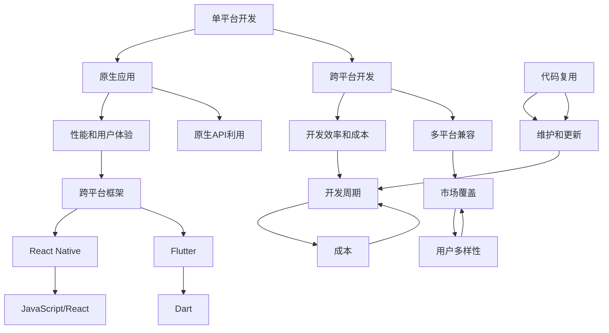

                 

### 背景介绍

随着移动互联网的飞速发展，移动应用已经成为人们日常生活中不可或缺的一部分。从社交、购物到办公、娱乐，各类移动应用极大地丰富了人们的数字化生活。然而，移动应用的开发面临着诸多挑战。首先，不同操作系统（如iOS和Android）的设备和版本众多，开发者需要确保应用在不同平台和设备上的兼容性。其次，用户对应用性能和安全性的要求越来越高，这要求开发者不断提升应用的运行效率和安全防护水平。此外，开发周期和成本也是开发者需要考虑的重要因素。传统单一平台的开发方式往往无法满足快速迭代和高效开发的需求。

在这种背景下，跨平台移动应用开发逐渐成为了解决之道。跨平台解决方案允许开发者使用一种技术栈来开发适用于多个操作系统和设备的应用，从而大大提高了开发效率和降低了成本。跨平台开发不仅能够减少重复性的开发工作，还能确保应用在不同平台上的一致性和性能。此外，随着技术的发展，如React Native、Flutter等跨平台框架的成熟，开发者可以更加便捷地实现高质量的应用开发。

本文将深入探讨移动应用开发的跨平台解决方案，从概述、核心技术、实战案例、趋势展望到最佳实践，全面解析跨平台移动应用开发的各个方面。首先，我们将介绍移动应用开发的基本概念和分类，然后深入讨论跨平台解决方案的重要性及其带来的优势与挑战。接下来，我们将详细阐述移动应用开发的核心技术，包括架构设计、性能优化和安全性。随后，我们将通过具体案例展示跨平台移动应用开发的实战过程，并提供源代码实现和代码解读。最后，我们将探讨移动应用开发的未来趋势，并总结最佳实践和注意事项。希望通过这篇文章，读者能够对跨平台移动应用开发有更加深入的理解，并能够在实际项目中应用这些知识。

### 移动应用开发的基本概念和分类

移动应用开发是指利用特定编程语言和技术工具，为移动设备（如智能手机、平板电脑等）创建软件应用程序的过程。这些应用程序可以执行各种功能，从基本的任务管理到复杂的游戏和社交媒体平台。移动应用可以根据其用途和功能进行分类，主要分为以下几种类型：

首先是**工具应用**，这类应用主要用于帮助用户完成特定任务，如计算器、日历、时钟等。工具应用通常设计简洁、功能单一，便于用户快速使用。

其次是**娱乐应用**，包括游戏、音乐播放器、视频播放器等。娱乐应用往往强调用户体验和互动性，通过丰富多样的内容和互动方式吸引和留住用户。

**社交应用**是另一种重要的移动应用类型，如微信、Facebook、Instagram等。这些应用通过用户社交网络和通信功能，帮助用户保持联系、分享内容和互动。

**商务应用**主要用于企业管理和业务流程优化，如客户关系管理（CRM）系统、企业资源规划（ERP）系统等。这些应用帮助企业提高效率、降低成本，并在市场竞争中保持优势。

此外，还有一些**专业应用**，如医疗健康应用、金融理财应用等。这些应用针对特定行业和用户需求进行定制化开发，提供专业化的服务。

在移动应用开发中，开发者需要考虑多种技术因素。首先，**操作系统兼容性**是关键。主流的移动操作系统包括iOS和Android，它们在界面设计、功能实现和API调用等方面存在差异。开发者需要确保应用在不同平台上都能正常运行，并保持一致的用户体验。

其次，**性能优化**也是移动应用开发的重要方面。用户对应用的响应速度和运行效率有较高要求，开发者需要通过代码优化、资源管理等方式提高应用性能。

**安全性**是另一个不可忽视的因素。移动应用经常涉及到用户数据和隐私，开发者需要采取各种安全措施，如数据加密、权限管理等，确保用户数据的安全。

**开发工具和框架**的选择也直接影响移动应用开发的效率和质量。常见的开发工具包括Xcode（用于iOS开发）、Android Studio（用于Android开发），而React Native、Flutter等跨平台框架则提供了一种更加高效的开发方式。

综上所述，移动应用开发不仅需要掌握各种技术知识，还需要具备解决实际问题的能力。通过了解移动应用的基本概念和分类，开发者可以更好地规划应用的功能和设计，从而开发出高质量、受欢迎的移动应用。

### 核心概念与联系：跨平台解决方案的重要性

在深入探讨移动应用开发的跨平台解决方案之前，首先需要明确几个核心概念，并理解它们之间的关系和架构。以下是几个关键概念及其相互联系：

#### 1. 单平台开发与跨平台开发

- **单平台开发**：指专门为某一操作系统（如iOS或Android）开发应用的过程。这种方式的优点在于能够充分利用该操作系统的特性和API，开发出高性能和特定功能的应用。然而，单平台开发的缺点也十分明显，即无法实现多平台兼容，增加了开发成本和周期。

- **跨平台开发**：通过使用特定的技术栈和工具，实现一次编码、多平台编译和部署的过程。跨平台开发的核心优势在于减少重复开发工作，提高开发效率，同时降低成本和缩短上市时间。跨平台开发框架如React Native、Flutter等，能够实现接近原生应用的性能和用户体验。

#### 2. 原生应用与跨平台应用

- **原生应用**：使用特定操作系统的原生编程语言（如Swift、Kotlin）开发的应用。原生应用能够充分利用操作系统的特性和资源，提供最佳的性能和用户体验。然而，原生应用的开发成本较高，且需要针对不同平台分别开发。

- **跨平台应用**：通过跨平台框架开发的应用，如React Native、Flutter。这些框架能够使用一套代码库实现多平台兼容，同时提供一定的性能和用户体验。跨平台应用的优点在于开发效率高、成本较低，但可能在某些特定操作系统的功能实现上有所妥协。

#### 3. 跨平台框架

- **React Native**：由Facebook开发的跨平台框架，使用JavaScript和React进行开发。React Native能够实现与原生应用接近的性能，并支持热更新和丰富的组件库。

- **Flutter**：由Google开发的跨平台框架，使用Dart语言进行开发。Flutter提供了丰富的UI组件和高效的原生渲染能力，能够实现高度自定义的用户界面。

#### 4. 核心概念与联系架构

为了更好地理解这些核心概念，我们可以使用Mermaid流程图来展示它们之间的关系和架构：



通过这个流程图，我们可以清晰地看到：

- 单平台开发和跨平台开发分别对应原生应用和跨平台应用。
- 跨平台框架（如React Native和Flutter）在性能、用户体验、开发效率、成本、代码复用、维护和更新等方面起到了关键作用。
- 跨平台解决方案能够实现多平台兼容，扩大市场覆盖，吸引更多用户。

综上所述，跨平台解决方案的重要性在于它能够解决单平台开发的局限性，提高开发效率和降低成本，同时保持高质量的用户体验。这种解决方案不仅适用于小型项目，也适用于大型企业级应用，为移动应用开发提供了更加灵活和高效的方式。在接下来的章节中，我们将进一步探讨跨平台解决方案的优势和挑战，以及如何在实际项目中应用这些技术。

### 跨平台解决方案的优势和挑战

跨平台解决方案在移动应用开发中具有显著的优势，但同时也面临着一些挑战。以下我们将详细讨论这些优势和挑战，以便开发者能够全面了解跨平台开发的价值和局限性。

#### 优势

1. **提高开发效率**：
   跨平台解决方案允许开发者使用一种代码库实现多平台应用的开发。这意味着，开发者只需编写和维护一份代码，即可同时支持iOS和Android平台。这不仅显著减少了开发工作量，还大大缩短了开发周期，提高了开发效率。此外，许多跨平台框架还提供了丰富的组件库和工具，进一步简化了开发流程。

2. **降低成本**：
   由于跨平台开发减少了开发人员的需求和重复开发的工作，企业可以节省大量的开发成本。特别是在涉及多个平台的复杂应用项目中，这种优势尤为明显。此外，跨平台解决方案还可以减少硬件设备测试的需求，从而降低测试和部署成本。

3. **统一用户体验**：
   跨平台解决方案确保了应用在不同操作系统和设备上的一致性。开发者可以通过统一的代码库实现相同的功能和界面设计，从而为用户提供一致的体验。这有助于提升用户满意度和品牌形象。

4. **代码复用**：
   跨平台开发框架通常支持模块化和组件化，使得开发者可以在不同项目中复用代码。这种代码复用不仅提高了开发效率，还降低了维护成本。例如，React Native和Flutter等框架都提供了大量的预建组件，可以方便地集成到新的项目中。

5. **快速迭代**：
   跨平台开发框架通常支持热更新功能，允许开发者在不影响用户使用的情况下，实时更新应用功能和修复漏洞。这种快速迭代能力对于响应市场变化和用户需求具有重要意义。

#### 挑战

1. **性能限制**：
   虽然跨平台框架在不断优化，但在某些特定场景下，跨平台应用的性能仍可能无法与原生应用相媲美。这主要由于跨平台框架的渲染机制和原生应用有所差异，特别是在需要大量图形渲染和高性能计算的场景中，性能差距可能更加明显。

2. **平台兼容性**：
   跨平台解决方案在实现多平台兼容的过程中，可能会遇到一些兼容性问题。这包括操作系统版本差异、设备硬件差异以及某些特定API的支持问题。开发者需要投入额外的精力来处理这些兼容性问题，以确保应用在不同平台上都能正常运行。

3. **开发复杂性**：
   跨平台开发框架虽然简化了开发流程，但同时也增加了开发复杂性。开发者需要熟悉新的编程语言和框架特性，这可能对开发者的技术能力提出了更高要求。此外，跨平台框架的不断更新和迭代也可能带来额外的学习成本。

4. **原生功能受限**：
   跨平台框架虽然提供了大量的组件和API，但在某些情况下，开发者可能无法访问特定操作系统的原生功能。这可能会限制应用的功能实现，尤其是在需要深度集成操作系统功能的场景中。

#### 如何平衡优势与挑战

为了充分发挥跨平台解决方案的优势，同时克服其挑战，开发者可以采取以下策略：

1. **合理选择开发工具和框架**：
   根据项目的需求和性能要求，选择适合的跨平台开发工具和框架。例如，对于性能要求较高的应用，可以选择Flutter；而对于需要快速迭代和热更新的应用，可以选择React Native。

2. **充分利用框架优势**：
   充分利用跨平台框架提供的组件库和工具，简化开发流程，提高开发效率。同时，关注框架的更新和社区支持，及时掌握新技术和最佳实践。

3. **优化代码和性能**：
   在跨平台开发过程中，注重代码优化和性能调优。通过合理的代码结构和算法选择，提高应用的运行效率和响应速度。

4. **处理兼容性问题**：
   针对不同的平台和设备，进行充分的测试和调整，确保应用在不同环境中都能正常运行。对于平台特有的功能，可以通过适配层进行封装，简化开发复杂度。

5. **持续学习和迭代**：
   跨平台解决方案的技术在不断演进，开发者需要不断学习和更新自己的知识，以适应新的开发趋势和技术挑战。

通过上述策略，开发者可以在跨平台解决方案中实现高效、高质量的应用开发，为用户提供出色的移动应用体验。

### 移动应用开发的核心技术

在移动应用开发中，掌握核心技术是确保应用性能、安全性和用户体验的关键。以下将详细探讨移动应用开发的核心技术，包括架构设计、性能优化和安全性。

#### 架构设计

移动应用架构设计是开发过程中的重要环节，它决定了应用的扩展性、稳定性和性能。一个良好的架构设计能够为未来的功能扩展和性能优化提供坚实的基础。

1. **客户端架构**：
   客户端架构通常包括以下几层：

   - **界面层**：负责与用户交互，包括布局、UI组件和用户界面逻辑。
   - **业务逻辑层**：包含应用的核心功能，如数据处理、业务流程控制等。
   - **数据访问层**：负责数据存储和检索，可以包括本地数据库、缓存和远程数据服务。
   - **网络通信层**：负责与服务器进行数据通信，包括HTTP请求、数据解析等。

   在实现客户端架构时，开发者可以使用MVC（模型-视图-控制器）或MVVM（模型-视图-视图模型）等设计模式，以分离关注点，提高代码的可维护性和扩展性。

2. **服务端架构**：
   服务端架构主要包括以下几部分：

   - **API层**：提供与客户端交互的接口，通常使用RESTful API或GraphQL等。
   - **业务逻辑层**：处理具体业务逻辑，如用户认证、订单处理等。
   - **数据存储层**：负责数据持久化，可以使用关系型数据库（如MySQL、PostgreSQL）或非关系型数据库（如MongoDB、Redis）。
   - **缓存层**：提高数据访问速度，通常使用Redis、Memcached等。

   服务端架构需要确保高可用性和高性能，可以采用分布式系统架构，如微服务架构（Microservices Architecture），以提高系统的扩展性和容错能力。

3. **数据存储和缓存机制**：
   数据存储和缓存机制是移动应用架构设计中的重要组成部分。合理的数据存储和缓存策略可以显著提高应用性能。

   - **本地存储**：包括文件存储和数据库存储，适用于存储用户配置、应用数据等。
   - **缓存**：用于临时存储高频访问的数据，提高数据访问速度。常用的缓存技术包括Redis、Memcached、本地内存缓存等。

#### 性能优化

性能优化是移动应用开发中的重要环节，它直接影响到用户的体验。以下是一些常见的性能优化策略：

1. **加速网络请求**：
   - **减少HTTP请求**：通过合并资源文件、使用内容分发网络（CDN）等减少HTTP请求次数。
   - **使用缓存**：合理使用HTTP缓存机制，减少重复请求。
   - **优化网络请求**：使用更高效的网络协议，如HTTP/2，减少请求延迟。

2. **减少应用启动时间**：
   - **预加载资源**：提前加载应用所需资源，减少启动时的加载时间。
   - **优化代码和框架**：减少启动时的代码执行时间，优化框架加载速度。
   - **优化启动流程**：对启动流程进行拆分和优化，例如使用懒加载、并行加载等。

3. **提高应用响应速度**：
   - **优化UI渲染**：使用高效的渲染技术，如虚拟DOM、Canvas渲染等。
   - **减少计算和内存占用**：优化算法和数据处理方式，减少计算量和内存占用。
   - **异步处理**：使用异步操作，避免阻塞主线程，提高应用响应速度。

#### 安全性

安全性是移动应用开发中不可忽视的重要方面。以下是一些常见的安全策略：

1. **数据安全保护**：
   - **加密传输**：使用HTTPS等加密协议保护数据在传输过程中的安全性。
   - **加密存储**：对存储在本地或服务器的敏感数据进行加密，防止数据泄露。
   - **访问控制**：实现严格的访问控制机制，确保只有授权用户可以访问敏感数据。

2. **用户认证与授权**：
   - **多因素认证**：使用多因素认证（MFA）增加用户账户的安全性。
   - **权限管理**：根据用户角色和权限限制用户操作，防止未经授权的访问。

3. **防止恶意攻击**：
   - **防止SQL注入和XSS攻击**：对用户输入进行验证和过滤，防止恶意攻击。
   - **安全审计**：定期进行安全审计，及时发现和修复安全漏洞。

通过掌握这些核心技术，开发者可以构建高性能、安全、用户体验优良的移动应用。在接下来的章节中，我们将通过具体案例进一步探讨跨平台移动应用开发的过程和实现。

### 跨平台移动应用开发实战

在了解了跨平台移动应用开发的核心技术后，接下来我们将通过一个具体的案例来展示如何进行跨平台移动应用的开发，包括环境搭建、应用案例解析和代码实现。

#### 开发环境搭建

首先，我们需要搭建一个跨平台移动应用开发的开发环境。以下是一个基于React Native的示例，React Native是一个流行的跨平台框架，使用JavaScript和React进行开发。

1. **安装Node.js**：React Native依赖于Node.js，因此我们需要首先安装Node.js。可以从官网下载最新版本的Node.js，并按照提示完成安装。

2. **安装React Native CLI**：通过Node.js的包管理器npm，我们可以安装React Native CLI。

   ```bash
   npm install -g react-native-cli
   ```

3. **创建新项目**：使用React Native CLI创建一个新的项目。

   ```bash
   react-native init MyApp
   ```

   这将创建一个名为"MyApp"的新项目。

4. **安装模拟器和设备**：为了测试应用，我们需要安装React Native模拟器或连接实际的移动设备。

   ```bash
   react-native run-android
   ```

   这将启动Android模拟器，并运行我们的应用。

#### 应用案例解析

我们以一个简单的新闻应用为例，该应用的主要功能包括：

- 显示新闻列表
- 加载更多新闻
- 查看新闻详情

#### 代码实现

以下是一个简单的React Native应用代码示例，包含新闻列表和详情页面：

```jsx
// NewsList.js
import React, { useState, useEffect } from 'react';
import { View, Text, FlatList, TouchableOpacity } from 'react-native';
import axios from 'axios';

const NewsList = () => {
  const [news, setNews] = useState([]);

  useEffect(() => {
    const fetchNews = async () => {
      const response = await axios.get('https://api.example.com/news');
      setNews(response.data);
    };

    fetchNews();
  }, []);

  const renderItem = ({ item }) => (
    <TouchableOpacity onPress={() => navigateToDetails(item)}>
      <Text>{item.title}</Text>
    </TouchableOpacity>
  );

  return (
    <FlatList
      data={news}
      renderItem={renderItem}
      keyExtractor={(item) => item.id}
    />
  );
};

const navigateToDetails = (item) => {
  // 导航到新闻详情页面
};

export default NewsList;

// NewsDetails.js
import React from 'react';
import { View, Text } from 'react-native';

const NewsDetails = ({ route }) => {
  const { item } = route.params;

  return (
    <View>
      <Text>{item.title}</Text>
      <Text>{item.content}</Text>
    </View>
  );
};

export default NewsDetails;
```

#### 代码解读与分析

在上面的代码中：

- **NewsList.js**：这是新闻列表页面的组件。它使用`useState`和`useEffect`钩子来获取新闻数据，并使用`FlatList`组件来渲染列表。当用户点击列表项时，会调用`navigateToDetails`函数导航到新闻详情页面。

- **NewsDetails.js**：这是新闻详情页面的组件。它接收一个路由参数`item`，并显示新闻的标题和内容。

#### 实际案例分析和详细讲解剖析

我们以一个实际的新闻应用为例，分析其架构和实现细节：

1. **架构设计**：
   - **客户端**：新闻列表和详情页面通过React Native组件实现，具有高可维护性和扩展性。
   - **服务端**：使用API来提供新闻数据，可以使用Node.js和Express框架快速搭建。

2. **数据交互**：
   - 客户端通过HTTP请求获取新闻数据，并使用JSON格式解析响应。
   - 服务端使用RESTful API提供新闻数据，并使用JSON Web Token（JWT）进行用户认证。

3. **性能优化**：
   - 使用`FlatList`组件实现高效的列表渲染，减少内存占用。
   - 使用`async/await`语法简化异步操作，提高代码可读性。

4. **安全性**：
   - 对API请求进行验证，防止未授权访问。
   - 使用HTTPS协议确保数据传输安全。

通过这个案例，我们可以看到跨平台移动应用开发的实现细节和关键点。在实际项目中，开发者可以根据需求进行扩展和优化，实现功能更加丰富和用户友好的应用。

#### 项目小结

在这个新闻应用案例中，我们通过React Native实现了跨平台移动应用开发。从环境搭建到应用实现，我们详细讲解了每个步骤，并分析了相关的代码和架构设计。通过这个案例，读者可以了解到跨平台移动应用开发的基本流程和关键技术。

在后续的章节中，我们将进一步探讨移动应用开发的趋势与展望，以及如何在实际项目中应用跨平台解决方案的最佳实践。

### 移动应用开发的趋势与展望

随着技术的不断进步，移动应用开发也在不断演进。以下将从5G和物联网对移动应用开发的影响、AI在移动应用开发中的应用、移动应用开发的未来趋势和跨平台解决方案的未来发展四个方面，探讨移动应用开发的趋势与展望。

#### 5G和物联网对移动应用开发的影响

5G技术的普及为移动应用开发带来了新的机遇和挑战。5G网络具有高带宽、低延迟和大规模连接的特点，使得移动应用能够实现更加实时、高效的交互体验。

1. **高带宽**：5G网络的高带宽使得移动应用可以加载更高质量的内容，如高清视频、3D模型等，从而提供更加丰富的用户体验。

2. **低延迟**：低延迟网络使得实时通信和协同工作成为可能，如在线游戏、远程医疗等应用可以在5G网络下实现更加流畅的体验。

3. **大规模连接**：5G网络能够支持大规模设备连接，如物联网设备、智能城市中的传感器等，使得移动应用可以更好地与物理世界进行交互。

物联网（IoT）的发展也对移动应用开发产生了深远影响。物联网设备可以收集大量数据，这些数据可以通过移动应用进行实时分析和处理，从而实现智能化管理和自动化控制。

1. **数据采集与处理**：物联网设备可以实时收集环境数据、用户行为数据等，这些数据可以用于移动应用中的数据分析和预测模型。

2. **设备互联**：物联网设备之间的互联可以使得移动应用实现更加复杂的协同功能，如智能家居控制系统、智能交通管理系统等。

#### AI在移动应用开发中的应用

人工智能（AI）在移动应用开发中的应用越来越广泛，AI技术能够提升应用的智能化水平和用户体验。

1. **自然语言处理**：AI技术可以用于实现智能聊天机器人、语音助手等功能，如苹果的Siri、谷歌的Google Assistant等。

2. **计算机视觉**：计算机视觉技术可以用于图像识别、物体检测、人脸识别等应用，如安防监控、自动驾驶等。

3. **推荐系统**：基于用户行为和兴趣数据，AI算法可以推荐个性化的内容，如电商平台的商品推荐、音乐和视频平台的个性化推荐等。

4. **预测分析**：AI技术可以对大量历史数据进行分析和预测，如金融市场预测、供应链优化等，从而为移动应用提供智能决策支持。

#### 移动应用开发的未来趋势

未来，移动应用开发将呈现出以下趋势：

1. **个性化与智能化**：移动应用将更加注重用户个性化体验，通过AI技术实现智能推荐、智能客服等功能。

2. **低代码开发**：随着低代码开发平台的发展，开发者可以更加快速地构建移动应用，降低开发门槛。

3. **跨平台融合**：跨平台解决方案将更加成熟和普及，开发者可以在一个平台上开发适用于多个操作系统的应用。

4. **边缘计算**：边缘计算技术将使得移动应用能够更加高效地处理本地数据和计算任务，提高应用性能和响应速度。

#### 跨平台解决方案的未来发展

跨平台解决方案在未来的发展将更加多样化，新技术和框架将不断涌现，以满足不同应用场景的需求。

1. **新技术引入**：如Web Assembly（WASM）等技术，将使得跨平台应用在性能和兼容性方面得到进一步提升。

2. **多框架融合**：跨平台开发框架之间可能会出现更多的融合和协作，以实现更好的性能和用户体验。

3. **云原生应用**：随着云计算和容器技术的普及，跨平台应用将更加依赖于云原生架构，实现高效的部署和管理。

4. **开源生态**：跨平台解决方案的开源生态将更加繁荣，社区贡献和协作将加速技术的创新和进步。

总之，移动应用开发正迎来新的变革和机遇，开发者需要不断学习和适应新技术，以构建高质量、智能化的移动应用。

### 总结与拓展

在本文中，我们深入探讨了移动应用开发的跨平台解决方案，从基本概念、优势与挑战、核心技术、实战案例到未来趋势，全面解析了跨平台移动应用开发的各个方面。以下是本文的核心要点和最佳实践：

#### 核心要点

1. **跨平台解决方案的重要性**：跨平台解决方案能够提高开发效率、降低成本，并实现多平台兼容，为开发者提供灵活和高效的开发方式。
   
2. **移动应用架构设计**：良好的架构设计包括客户端架构、服务端架构和数据存储缓存机制，是实现高性能、高扩展性应用的基础。

3. **性能优化策略**：通过加速网络请求、减少应用启动时间和提高应用响应速度，可以显著提升用户体验。

4. **安全性策略**：数据加密、多因素认证和防止恶意攻击是保障用户数据安全和应用安全的关键。

5. **5G和物联网的影响**：5G和物联网技术为移动应用开发带来了新的机遇，如高带宽、低延迟和设备互联等，推动了应用的智能化和实时性。

6. **AI在移动应用开发中的应用**：AI技术如自然语言处理、计算机视觉和推荐系统等，显著提升了移动应用的智能化水平。

#### 最佳实践

1. **合理选择开发工具和框架**：根据项目需求和性能要求，选择适合的跨平台开发工具和框架，如React Native和Flutter。

2. **充分利用框架优势**：充分利用跨平台框架提供的组件库和工具，简化开发流程，提高开发效率。

3. **优化代码和性能**：注重代码优化和性能调优，通过合理的设计和算法选择，提高应用的运行效率和响应速度。

4. **处理兼容性问题**：针对不同的平台和设备，进行充分的测试和调整，确保应用在不同环境中都能正常运行。

5. **持续学习和迭代**：跟踪跨平台解决方案的最新技术和趋势，不断学习和更新知识，以适应新的开发挑战。

#### 小结与注意事项

- **小结**：跨平台移动应用开发为开发者提供了高效的开发方式，但需要平衡性能和兼容性的挑战。通过良好的架构设计、性能优化和安全性策略，可以构建高质量的跨平台移动应用。

- **注意事项**：在开发过程中，要关注代码的可维护性和可扩展性，同时不断优化用户体验。在跨平台解决方案的选择上，要结合项目的具体需求和资源进行综合考虑。

#### 拓展阅读

- **参考资料**：深入了解React Native、Flutter等跨平台开发框架的官方文档和社区资源，掌握最新技术和最佳实践。
- **扩展学习**：学习5G、物联网和AI等相关技术，探索其在移动应用开发中的应用场景。

通过本文的探讨，希望读者能够对跨平台移动应用开发有更加深入的理解，并能够在实际项目中应用这些知识，构建出高效、安全、用户体验优良的移动应用。

### 附录：资源与工具

在移动应用开发的过程中，开发者需要依赖各种工具和资源来提升开发效率和确保应用的质量。以下是一些常用的工具和资源，包括移动应用开发工具列表和跨平台开发框架对比。

#### 移动应用开发工具列表

1. **开发环境**：
   - **Android Studio**：谷歌提供的官方Android开发工具，支持Android应用的代码编辑、调试和发布。
   - **Xcode**：苹果公司为iOS开发者提供的集成开发环境，支持iOS、macOS、watchOS和tvOS的应用开发。
   - **Visual Studio**：微软推出的跨平台开发工具，支持Windows、iOS和Android应用的开发。

2. **代码编辑器**：
   - **Visual Studio Code**：一款功能强大的开源代码编辑器，支持多种编程语言和跨平台开发。
   - **Atom**：另一款流行的开源代码编辑器，拥有丰富的插件和自定义选项。
   - **Sublime Text**：轻量级的代码编辑器，适用于快速开发。

3. **调试工具**：
   - **Android Debug Bridge (ADB)**：用于Android设备的调试和管理。
   - **Instruments**：用于iOS应用的性能分析和测试。

4. **版本控制**：
   - **Git**：分布式版本控制系统，广泛用于代码管理和协作开发。
   - **GitHub**：Git的在线平台，提供代码托管、协作和问题跟踪功能。
   - **GitLab**：自建的Git仓库服务，支持Git的所有功能，并提供额外的安全和管理功能。

5. **测试工具**：
   - **Jest**：JavaScript测试框架，用于测试React组件和函数。
   - **Cypress**：快速、轻松的端到端测试工具，适用于React和Vue等前端框架。
   - **Appium**：用于自动化移动应用的测试工具，支持iOS和Android平台。

6. **持续集成/持续部署（CI/CD）**：
   - **Jenkins**：开源的持续集成服务器，支持多种插件和自动化任务。
   - **CircleCI**：云端的持续集成和部署服务，提供简洁的界面和高效的构建流程。
   - **GitHub Actions**：GitHub内置的持续集成和部署服务，支持自动化构建、测试和部署。

#### 跨平台开发框架对比

1. **React Native**：
   - **优点**：使用JavaScript和React，支持热更新，组件库丰富，社区支持强大。
   - **缺点**：在某些特定场景下性能不如原生应用，原生功能集成有一定限制。
   - **适用场景**：需要快速迭代、功能丰富的应用，如社交媒体、电商平台等。

2. **Flutter**：
   - **优点**：使用Dart语言，高效的渲染引擎，丰富的UI组件，支持热重载。
   - **缺点**：学习曲线较陡，社区支持相对较少。
   - **适用场景**：需要高性能、自定义UI的应用，如游戏、金融应用等。

3. **Apache Cordova**：
   - **优点**：基于HTML5、CSS3和JavaScript，可以轻松地将Web应用打包成原生应用。
   - **缺点**：性能相对较低，原生功能受限。
   - **适用场景**：Web应用需要打包成原生应用的场景，如企业内部应用。

4. **Xamarin**：
   - **优点**：使用C#语言，支持原生性能，可以共享代码库。
   - **缺点**：学习曲线较陡，开发成本较高。
   - **适用场景**：需要使用C#语言和共享大量代码库的场景，如大型企业应用。

通过了解和选择合适的工具和框架，开发者可以更加高效地构建高质量的移动应用。在开发过程中，还需要不断学习和探索新的技术和工具，以保持技术的先进性和竞争力。

