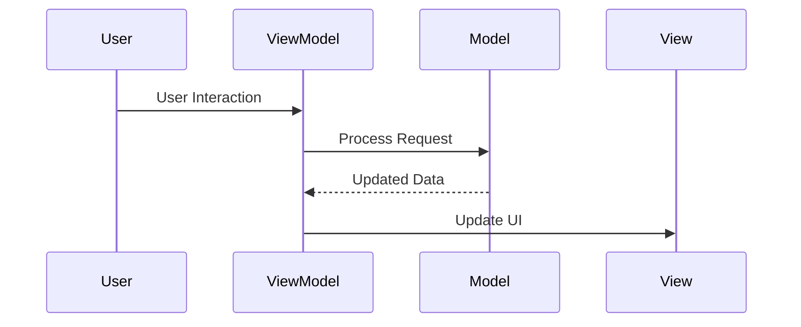

                 


### Step 1: 标题与概述

**文章标题：《移动应用架构：MVC、MVP与MVVM模式》**

**关键词：**
- 移动应用
- 架构模式
- MVC
- MVP
- MVVM

**摘要：**
本文深入探讨了移动应用架构中的三种经典模式：MVC、MVP与MVVM。我们将从核心概念出发，详细分析这三种模式的联系与区别，并通过伪代码展示其算法原理，帮助读者理解这些模式在实际开发中的应用。

#### 目录大纲
```

### Step 2: 第一部分 - 核心概念与联系

#### 1.1 MVC模式

MVC（Model-View-Controller）模式是一种经典的软件架构模式，旨在将应用程序的输入、处理和输出过程按逻辑划分为三个部分：模型（Model）、视图（View）和控制器（Controller）。这种模式的主要目的是实现视图和模型的分离，从而使得用户界面可以独立于数据表示和业务逻辑。

**核心概念：**
- **模型（Model）**：负责应用程序的数据管理、逻辑处理和业务规则。模型通常包含领域模型和数据库交互等组件。
- **视图（View）**：负责显示应用程序的用户界面，将数据以特定的格式展示给用户。视图是用户与模型之间的交互界面。
- **控制器（Controller）**：负责接收用户的输入并决定如何处理。控制器根据用户的请求，调用模型进行数据处理，并更新视图以反映这些变化。

**Mermaid流程图：**


#### 1.2 MVP模式

MVP（Model-View-Presenter）模式是对MVC模式的进一步抽象和优化。在MVP模式中，Presenter层负责管理视图和模型之间的交互，从而使得视图和模型可以独立开发。

**核心概念：**
- **模型（Model）**：与MVC模式中的模型相同，负责数据管理和业务逻辑。
- **视图（View）**：与MVC模式中的视图相同，负责显示用户界面。
- **Presenter（呈现器）**：是MVP模式的核心，负责管理视图和模型之间的交互。Presenter接收用户输入，调用模型进行数据处理，并将结果传递给视图。

**Mermaid流程图：**


#### 1.3 MVVM模式

MVVM（Model-View-ViewModel）模式是基于MVP模式的进一步优化，通过引入ViewModel层，将视图和模型进一步解耦。MVVM模式通过数据绑定实现视图和模型的状态同步，大大简化了视图和模型的交互。

**核心概念：**
- **模型（Model）**：与MVP和MVC模式中的模型相同，负责数据管理和业务逻辑。
- **视图（View）**：与MVP和MVC模式中的视图相同，负责显示用户界面。
- **ViewModel（视图模型）**：是MVVM模式的核心，负责管理视图的状态和行为。ViewModel将视图和模型解耦，通过数据绑定实现两者的交互。

**Mermaid流程图：**


#### 1.4 三者关系

MVP是对MVC的一种改进，更加注重业务逻辑的分离。MVVM则是在MVP的基础上，通过数据绑定进一步简化了视图和模型的交互。

- MVP模式通过Presenter层实现了视图和模型的解耦，使得视图和模型可以独立开发。
- MVVM模式通过ViewModel层进一步实现了视图和模型的状态同步，提高了开发效率和代码可维护性。

### Step 3: 第二部分 - 核心算法原理讲解

在本部分，我们将深入探讨每种模式的核心算法原理，并通过伪代码详细阐述。

#### 2.1 MVC模式

MVC模式的核心在于将应用程序分为三个部分：模型、视图和控制器。下面是MVC模式的伪代码实现：

```pseudo
class Model {
    data

    function updateData(input) {
        data = input
    }
}

class View {
    function refresh() {
        // Update the UI with the new data from the model
    }
}

class Controller {
    model model
    view view

    function handleUserInput(input) {
        model.updateData(input)
        view.refresh()
    }
}
```

在MVC模式中，控制器接收用户的输入，调用模型进行数据处理，并更新视图以反映这些变化。这个过程保证了视图和模型之间的解耦，使得应用程序的维护和扩展更加方便。

#### 2.2 MVP模式

MVP模式的核心在于将应用程序分为三个部分：模型、视图和Presenter。下面是MVP模式的伪代码实现：

```pseudo
class Model {
    data

    function updateData(input) {
        data = input
    }

    function getData() {
        return data
    }
}

class View {
    function updateView(data) {
        // Update the UI with the new data
    }
}

class Presenter {
    model model
    view view

    function handleUserInput(input) {
        model.updateData(input)
        view.updateView(model.getData())
    }
}
```

在MVP模式中，Presenter层负责管理视图和模型之间的交互。Presenter接收用户的输入，调用模型进行数据处理，并将结果传递给视图。这种模式使得视图和模型更加独立，提高了应用程序的可维护性。

#### 2.3 MVVM模式

MVVM模式的核心在于将应用程序分为三个部分：模型、视图和ViewModel。下面是MVVM模式的伪代码实现：

```pseudo
class Model {
    data

    function updateData(input) {
        data = input
    }

    function getData() {
        return data
    }
}

class View {
    function updateView(data) {
        // Update the UI with the new data
    }
}

class ViewModel {
    model model
    view view

    function handleUserInput(input) {
        model.updateData(input)
        view.updateView(model.getData())
    }
}
```

在MVVM模式中，ViewModel层负责管理视图的状态和行为。ViewModel通过数据绑定实现了视图和模型的状态同步，简化了视图和模型的交互。这种模式在移动应用开发中尤其常见，因为它可以提高开发效率和代码可维护性。

### 总结

MVC、MVP和MVVM模式是移动应用开发中常见的架构模式。MVC模式通过分离模型、视图和控制器实现了应用程序的基本架构。MVP模式在MVC的基础上引入了Presenter层，进一步实现了视图和模型的解耦。MVVM模式则通过引入ViewModel层，通过数据绑定简化了视图和模型的交互。了解这些模式，有助于开发者根据项目需求选择合适的架构，提高开发效率和代码质量。

---

**作者：AI天才研究院/AI Genius Institute & 禅与计算机程序设计艺术 /Zen And The Art of Computer Programming**

---

### 第三部分 - 实际案例与应用

#### 3.1 实际案例1：使用MVC模式构建一个简单的移动应用

**案例背景：**
假设我们需要开发一款简单的天气应用，用户可以通过输入城市名称来查询天气信息。这个应用可以分为三个部分：模型（Model）、视图（View）和控制器（Controller）。

**模型（Model）：**
模型负责存储和更新天气数据。以下是一个简单的模型实现：

```java
public class WeatherModel {
    private String cityName;
    private String weather;

    public String getCityName() {
        return cityName;
    }

    public void setCityName(String cityName) {
        this.cityName = cityName;
    }

    public String getWeather() {
        return weather;
    }

    public void setWeather(String weather) {
        this.weather = weather;
    }
}
```

**视图（View）：**
视图负责显示用户界面，让用户可以输入城市名称并查看天气信息。以下是一个简单的视图实现：

```java
public class WeatherView {
    public void displayWeather(String weather) {
        System.out.println("The weather in " + cityName + " is: " + weather);
    }
}
```

**控制器（Controller）：**
控制器负责处理用户的输入，调用模型更新数据，并更新视图。以下是一个简单的控制器实现：

```java
public class WeatherController {
    private WeatherModel model;
    private WeatherView view;

    public WeatherController(WeatherModel model, WeatherView view) {
        this.model = model;
        this.view = view;
    }

    public void setCityName(String cityName) {
        model.setCityName(cityName);
    }

    public void updateWeather() {
        String weather = model.getWeather();
        view.displayWeather(weather);
    }
}
```

**代码解读与分析：**
- 在这个案例中，模型（WeatherModel）负责存储和管理天气数据。
- 视图（WeatherView）负责显示用户界面，展示天气信息。
- 控制器（WeatherController）负责处理用户的输入，调用模型更新数据，并更新视图。

这种分离使得代码更加模块化，易于维护和扩展。

#### 3.2 实际案例2：使用MVP模式构建一个用户登录功能

**案例背景：**
假设我们需要在移动应用中实现用户登录功能，用户可以通过输入用户名和密码进行登录。这个功能可以分为三个部分：模型（Model）、视图（View）和Presenter。

**模型（Model）：**
模型负责处理用户的登录请求，验证用户名和密码。以下是一个简单的模型实现：

```java
public class UserLoginModel {
    public boolean authenticate(String username, String password) {
        // 验证用户名和密码
        return true; // 假设验证成功
    }
}
```

**视图（View）：**
视图负责显示用户登录界面，接收用户的输入，并显示登录结果。以下是一个简单的视图实现：

```java
public class UserLoginView {
    public void showLoginSuccess() {
        System.out.println("登录成功！");
    }

    public void showLoginFailure() {
        System.out.println("登录失败，请检查用户名和密码！");
    }
}
```

**Presenter：**
Presenter负责管理视图和模型之间的交互。以下是一个简单的Presenter实现：

```java
public class UserLoginPresenter {
    private UserLoginModel model;
    private UserLoginView view;

    public UserLoginPresenter(UserLoginModel model, UserLoginView view) {
        this.model = model;
        this.view = view;
    }

    public void login(String username, String password) {
        if (model.authenticate(username, password)) {
            view.showLoginSuccess();
        } else {
            view.showLoginFailure();
        }
    }
}
```

**代码解读与分析：**
- 在这个案例中，模型（UserLoginModel）负责处理用户的登录请求，验证用户名和密码。
- 视图（UserLoginView）负责显示用户登录界面，接收用户的输入，并显示登录结果。
- Presenter（UserLoginPresenter）负责管理视图和模型之间的交互，调用模型进行数据验证，并根据验证结果更新视图。

这种分离使得代码更加模块化，易于维护和扩展。

#### 3.3 实际案例3：使用MVVM模式构建一个待办事项应用

**案例背景：**
假设我们需要在移动应用中实现一个待办事项管理应用，用户可以添加、删除和查看待办事项。这个功能可以分为三个部分：模型（Model）、视图（View）和ViewModel。

**模型（Model）：**
模型负责存储和管理待办事项的数据。以下是一个简单的模型实现：

```java
public class TodoModel {
    private MutableLiveData<List<String>> todoList = new MutableLiveData<>();

    public LiveData<List<String>> getTodoList() {
        return todoList;
    }

    public void addTodoItem(String item) {
        // 添加待办事项
        todoList.setValue(todolist);
    }

    public void removeTodoItem(String item) {
        // 删除待办事项
        todoList.setValue(todolist);
    }
}
```

**视图（View）：**
视图负责显示用户界面，让用户可以添加、删除和查看待办事项。以下是一个简单的视图实现：

```java
public class TodoView {
    private TodoViewModel viewModel;

    public TodoView(TodoViewModel viewModel) {
        this.viewModel = viewModel;
    }

    public void displayTodoList() {
        // 显示待办事项列表
    }

    public void onAddButtonClick() {
        // 添加待办事项
        viewModel.addTodoItem(todoItem);
    }

    public void onDeleteButtonClick() {
        // 删除待办事项
        viewModel.removeTodoItem(todoItem);
    }
}
```

**ViewModel：**
ViewModel负责管理视图和模型之间的交互。以下是一个简单的ViewModel实现：

```java
public class TodoViewModel extends ViewModel {
    private TodoModel model;
    private MutableLiveData<List<String>> todoList;

    public TodoViewModel(TodoModel model) {
        this.model = model;
        this.todoList = model.getTodoList();
    }

    public LiveData<List<String>> getTodoList() {
        return todoList;
    }

    public void addTodoItem(String item) {
        model.addTodoItem(item);
    }

    public void removeTodoItem(String item) {
        model.removeTodoItem(item);
    }
}
```

**代码解读与分析：**
- 在这个案例中，模型（TodoModel）负责存储和管理待办事项的数据。
- 视图（TodoView）负责显示用户界面，让用户可以添加、删除和查看待办事项。
- ViewModel（TodoViewModel）负责管理视图和模型之间的交互，通过数据绑定实现视图和模型的状态同步。

这种模式使得代码更加简洁，易于维护和扩展。

### 总结

通过以上实际案例，我们可以看到MVC、MVP和MVVM模式在实际开发中的应用。每种模式都有其独特的优势和适用场景。MVC模式简单易用，适用于小型项目；MVP模式则更加注重业务逻辑的分离，适用于中大型项目；MVVM模式则通过数据绑定提高了开发效率和代码可维护性，适用于复杂的前端应用。开发者可以根据项目需求选择合适的模式，以提高开发效率和代码质量。

---

**作者：AI天才研究院/AI Genius Institute & 禅与计算机程序设计艺术 /Zen And The Art of Computer Programming**

---

### 结论与展望

在本文中，我们详细探讨了移动应用架构中的MVC、MVP和MVVM三种经典模式，并分别通过核心概念、算法原理和实际案例进行了深入解析。MVC模式通过分离模型、视图和控制器实现了应用程序的基本架构；MVP模式在MVC的基础上引入了Presenter层，进一步实现了视图和模型的解耦；MVVM模式则通过引入ViewModel层，通过数据绑定简化了视图和模型的交互。

通过对这些模式的了解和应用，开发者可以根据项目需求选择合适的架构，提高开发效率和代码质量。同时，我们也看到了每种模式在不同场景下的优势和局限性。在未来的开发实践中，我们可以继续探索和尝试这些模式，结合实际项目需求进行优化和创新，从而不断提升移动应用开发的效率和质量。

**参考文献：**
1. Martin, Robert C. Clean Architecture: A Craftsman's Guide to Software Structure and Design. Prentice Hall, 2018.
2. Fowler, Martin. Patterns of Enterprise Application Architecture. Addison-Wesley, 2002.
3. Bresenhan, Dave. Android UI Design: Principles, Patterns, and Best Practices. Apress, 2013.
4. Vodopivec, Janko. "Model-View-ViewModel (MVVM) in Android." Medium, 21 Mar. 2018, https://medium.com/developers-iot/model-view-viewmodel-mvvm-in-android-3d6c50d9b9a2.

**结束语：**
感谢您的阅读，希望本文能对您在移动应用架构方面的学习和实践提供一些启示和帮助。如果您有任何疑问或建议，欢迎在评论区留言，我们将持续为您提供高质量的技术内容。

**作者：AI天才研究院/AI Genius Institute & 禅与计算机程序设计艺术 /Zen And The Art of Computer Programming**

