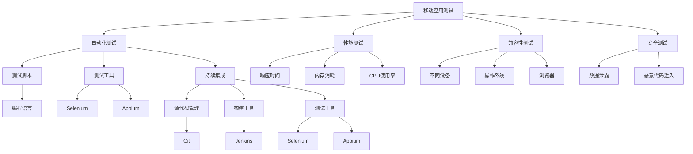

                 

### 文章标题

《移动应用测试：自动化测试与持续集成》

---

关键词：移动应用测试、自动化测试、持续集成、Appium、Selenium、测试工具

---

摘要：本文将深入探讨移动应用测试的关键领域，特别是自动化测试与持续集成（CI）的结合。我们将从基础概念开始，逐步介绍移动应用测试的重要性、自动化测试工具（如Selenium和Appium）的原理和算法，以及持续集成在移动应用测试中的应用。通过实际案例和最佳实践，我们将展示如何将自动化测试与持续集成有效结合，以提升移动应用的测试质量和效率。文章旨在为读者提供一个系统性的理解，帮助他们更好地应用这些技术，确保移动应用的稳定性和可靠性。

---

### 引言

随着移动设备的普及，移动应用的开发和测试成为了软件开发领域的一个重要分支。移动应用测试不仅关系到应用的用户体验，还直接影响到应用的市场表现和品牌形象。为了应对日益复杂的移动应用环境，传统的手动测试方法已经无法满足高效和高质量的要求。因此，自动化测试和持续集成技术逐渐成为移动应用测试的关键工具。

自动化测试通过编写脚本模拟用户操作，能够大幅度提高测试效率，减少重复劳动，并降低人为错误的风险。而持续集成（CI）则通过自动化构建和测试，确保代码库中的每一个更改都经过严格测试，从而提高代码质量和发布稳定性。

本文将围绕移动应用测试的自动化测试与持续集成展开讨论。首先，我们将介绍移动应用测试的基础概念，包括测试类型和重要性。接着，我们将详细探讨自动化测试工具（如Selenium和Appium）的原理和算法。然后，我们将介绍持续集成的概念及其在移动应用测试中的应用。最后，通过实际案例和最佳实践，我们将展示如何将自动化测试与持续集成结合使用，以提升移动应用的测试质量和效率。

### 核心概念与联系

在深入了解移动应用测试的自动化测试与持续集成之前，首先需要理解这些核心概念及其相互关系。

#### 移动应用测试

移动应用测试是指对移动应用程序进行验证和验证的过程，以确保应用在不同设备和操作系统上都能正常工作，并满足用户的需求。移动应用测试可以分为以下几种类型：

1. **功能测试**：验证应用的功能是否按预期工作。
2. **性能测试**：评估应用的响应时间、内存消耗、CPU使用率等性能指标。
3. **兼容性测试**：确保应用在不同的设备、操作系统和浏览器上都能正常运行。
4. **安全测试**：检测应用中可能的安全漏洞，如数据泄露、恶意代码注入等。

移动应用测试的重要性在于，它能够发现并修复潜在的问题，提高应用的质量和用户体验。随着移动设备种类的增多和用户期望的提升，移动应用测试变得越来越必要。

#### 自动化测试

自动化测试是通过编写脚本或使用自动化工具模拟用户操作，以自动化执行测试用例的过程。自动化测试的主要优点包括：

1. **提高测试效率**：自动化测试可以节省大量时间和资源，尤其是对于复杂的测试场景和重复性的测试任务。
2. **减少人为错误**：自动化测试可以减少由于人为操作不一致或疲劳引起的错误。
3. **测试覆盖率**：自动化测试能够覆盖更多的测试场景，提高测试的全面性。

自动化测试的核心在于测试工具和测试脚本。常见的自动化测试工具包括Selenium、Appium等。测试脚本则是通过编程语言（如Java、Python等）编写的，用于执行具体的测试任务。

#### 持续集成（CI）

持续集成（Continuous Integration，CI）是一种软件开发实践，旨在通过自动化构建和测试，确保代码库中的每一个更改都经过严格的测试。持续集成的主要目标包括：

1. **快速反馈**：通过自动化的构建和测试，开发者能够立即得知他们的更改是否影响了应用的稳定性。
2. **提高代码质量**：持续集成能够发现并修复潜在的问题，确保代码库中的每一个提交都是可测试和可发布的。
3. **减少集成风险**：持续集成通过频繁的小规模集成，降低了大规模集成时的风险。

持续集成通常涉及以下组件：

1. **源代码管理工具**：如Git，用于管理代码库。
2. **构建工具**：如Jenkins、Travis CI，用于自动化构建和测试。
3. **测试工具**：如Selenium、Appium，用于执行自动化测试。

#### 核心概念之间的关系架构

为了更好地理解这些概念之间的联系，我们可以使用Mermaid流程图来展示它们之间的关系。



通过这个流程图，我们可以清晰地看到移动应用测试、自动化测试和持续集成之间的相互关系。移动应用测试包括多种类型的测试，自动化测试通过测试脚本和测试工具来实现，而持续集成则通过构建和测试工具来实现自动化构建和测试。

#### 自动化测试与持续集成的结合

自动化测试与持续集成的结合使得移动应用测试更加高效和全面。通过持续集成，每个代码更改都可以立即触发自动化测试，从而快速发现和修复问题。这大大提高了代码质量和发布稳定性。同时，自动化测试也能够在持续集成过程中执行，确保每个提交都经过严格的测试。

总的来说，移动应用测试、自动化测试和持续集成相互关联，共同构成了一个完整的移动应用测试体系。理解这些核心概念及其相互关系，是进行高效移动应用测试的关键。

### 自动化测试工具的原理和算法

在移动应用测试中，自动化测试工具起到了至关重要的作用。这些工具通过模拟用户操作、执行测试用例，从而提高测试效率和可靠性。以下将详细介绍两个常用的自动化测试工具：Selenium和Appium。

#### Selenium

Selenium是一个开源的自动化测试工具，主要用于Web应用的自动化测试。它支持多种编程语言（如Java、Python、C#等），并提供了一个统一的API，使得测试脚本可以跨浏览器和操作系统运行。

**原理**

Selenium的核心原理是通过驱动程序（Driver）控制浏览器执行自动化操作。驱动程序与浏览器之间通过特定的通信协议进行交互。以下是Selenium自动化测试的基本流程：

1. **启动浏览器**：通过指定驱动程序，启动目标浏览器。
2. **执行操作**：编写测试脚本，模拟用户操作（如点击按钮、输入文本等）。
3. **验证结果**：检查测试预期结果，如页面元素是否正确显示、页面响应时间是否符合要求等。
4. **报告输出**：将测试结果记录到日志或报告文件中。

**算法**

以下是一个简单的Selenium测试脚本示例（Python语言）：

```python
from selenium import webdriver
from selenium.webdriver.common.keys import Keys

# 启动Chrome浏览器
driver = webdriver.Chrome(executable_path='chromedriver')

# 访问网站
driver.get("https://www.example.com")

# 查找搜索框并输入关键词
search_box = driver.find_element_by_name("q")
search_box.send_keys("Selenium")
search_box.send_keys(Keys.RETURN)

# 断言搜索结果页面包含特定关键词
assert "Selenium" in driver.title

# 关闭浏览器
driver.quit()
```

#### Appium

Appium是一个开源的移动应用自动化测试框架，支持iOS和Android平台。它通过模拟用户操作，实现对移动应用的自动化测试。Appium的核心优势在于，它不仅可以测试原生应用，还可以测试Web和Hybrid应用。

**原理**

Appium的工作原理与Selenium类似，也是通过驱动程序控制移动设备执行测试脚本。但Appium的实现更加复杂，因为它需要模拟真实的用户交互和操作系统级别的操作。以下是Appium自动化测试的基本流程：

1. **启动Appium服务器**：在测试开始前，需要启动Appium服务器，并与移动设备进行连接。
2. **编写测试脚本**：使用Java、Python、JavaScript等编程语言编写测试脚本，模拟用户操作。
3. **执行测试**：通过Appium服务器，将测试脚本发送到移动设备，执行具体的测试任务。
4. **收集结果**：收集测试结果，如通过/失败、错误日志等。
5. **报告输出**：将测试结果记录到日志或报告文件中。

**算法**

以下是一个简单的Appium测试脚本示例（Python语言，使用Appium-Python-Client库）：

```python
from appium import webdriver

# 设置Appium的远程会话
caps = {
    'platformName': 'Android',
    'platformVersion': '11',
    'deviceName': 'emulator-5554',
    'app': '/path/to/your/app.apk',
    'automationName': 'UiAutomator2'
}

# 启动移动设备上的应用
driver = webdriver.Remote('http://localhost:4723/wd/hub', caps)

# 执行操作，如点击按钮
element = driver.find_element_by_id('button_id')
element.click()

# 断言按钮点击后页面是否更新
assert 'Button Clicked' in driver.page_source

# 关闭应用和Appium服务器
driver.quit()
```

通过这两个示例，我们可以看到Selenium和Appium在自动化测试中的基本原理和算法。Selenium适用于Web应用测试，而Appium则更适用于移动应用测试。在实际项目中，根据测试需求和应用类型，可以选择合适的自动化测试工具。

### 数学模型和数学公式

在移动应用测试中，测试覆盖率和测试质量评估是两个重要的指标。以下将详细解释这两个概念，并提供相关的数学模型和数学公式。

#### 测试覆盖率

测试覆盖率是指测试用例对代码的覆盖程度。它反映了测试的全面性，是评估测试质量的一个重要指标。测试覆盖率可以分为以下几种类型：

1. **语句覆盖率**：测试用例执行了代码中的每一个语句。
2. **分支覆盖率**：测试用例执行了代码分支中的每一个分支。
3. **路径覆盖率**：测试用例执行了代码中的所有可能的路径。

**数学模型和公式**

假设代码中有n个语句，m个分支，p个路径。测试覆盖率可以用以下公式表示：

- **语句覆盖率**：\( Coverage_{stmt} = \frac{执行的语句数}{总的语句数} \)
- **分支覆盖率**：\( Coverage_{branch} = \frac{执行的分支数}{总的分支数} \)
- **路径覆盖率**：\( Coverage_{path} = \frac{执行的路径数}{总的路径数} \)

以下是一个具体的例子：

假设有一个简单的代码片段：

```java
if (x > 0) {
    y = x + 1;
} else {
    y = x - 1;
}
```

这个代码片段中有两个语句、两个分支和一个路径。如果测试用例能够覆盖所有的语句和分支，那么：

- 语句覆盖率：\( Coverage_{stmt} = \frac{2}{2} = 1 \)
- 分支覆盖率：\( Coverage_{branch} = \frac{2}{2} = 1 \)
- 路径覆盖率：\( Coverage_{path} = \frac{1}{1} = 1 \)

#### 测试质量评估

测试质量评估是另一个关键指标，用于衡量测试用例的有效性和可靠性。测试质量评估通常包括以下几个方面：

1. **测试用例设计**：测试用例是否涵盖了所有可能的输入和输出情况。
2. **测试执行**：测试用例是否正确执行，并产生预期的结果。
3. **测试覆盖率**：测试用例是否达到了预定的覆盖率目标。

**数学模型和公式**

测试质量评估可以用以下公式表示：

- **测试质量**：\( Quality_{test} = \frac{正确的测试用例数}{总的测试用例数} \)

以下是一个具体的例子：

假设有一个测试套件，包含10个测试用例，其中8个测试用例是正确的，2个测试用例是错误的。那么：

- 测试质量：\( Quality_{test} = \frac{8}{10} = 0.8 \)

通过测试覆盖率和测试质量评估，我们可以全面了解移动应用测试的质量和有效性。这两个指标不仅帮助我们识别潜在的问题，还为测试策略的优化提供了依据。

### 项目实战

在本文的最后，我们将通过一个实际项目来展示如何将自动化测试与持续集成结合起来，以提升移动应用的测试质量和效率。

#### 项目背景

假设我们正在开发一款移动购物应用，需要对其功能、性能和兼容性进行全面测试。为了确保应用的质量，我们决定使用自动化测试和持续集成技术。

#### 开发环境搭建

首先，我们需要搭建开发环境。以下是所需的工具和步骤：

1. **移动设备**：准备一台Android模拟器和一台iOS模拟器，以便进行跨平台测试。
2. **开发工具**：安装Android Studio和Xcode，以便开发应用程序和编写测试脚本。
3. **自动化测试工具**：安装Appium和Selenium，并配置相应的驱动程序。
4. **持续集成工具**：安装Jenkins，配置相应的插件，如Git和Appium。

#### 源代码管理

我们将使用Git进行源代码管理。以下是主要的步骤：

1. **初始化Git仓库**：在项目目录中执行 `git init` 初始化一个Git仓库。
2. **添加远程仓库**：将代码推送到远程仓库（如GitHub或GitLab）。
3. **配置SSH密钥**：确保Git能够通过SSH密钥认证访问远程仓库。

```bash
ssh-keygen -t rsa -b 4096 -C "your_email@example.com"
cat ~/.ssh/id_rsa.pub
```

4. **提交和推送代码**：将代码提交到本地仓库，并推送到远程仓库。

```bash
git add .
git commit -m "Initial commit"
git push -u origin master
```

#### 自动化测试脚本开发

接下来，我们将编写自动化测试脚本。以下是主要的步骤：

1. **编写测试用例**：根据应用的功能和需求，编写测试用例。
2. **配置Appium**：在测试脚本中配置Appium，指定应用的包名和Activity。
3. **执行测试脚本**：运行测试脚本，验证应用的功能和性能。

以下是一个简单的Appium测试脚本（Python语言）：

```python
from appium import webdriver

# 配置Appium
caps = {
    'platformName': 'Android',
    'platformVersion': '11',
    'deviceName': 'emulator-5554',
    'app': '/path/to/your/app.apk',
    'automationName': 'UiAutomator2'
}

# 启动移动设备上的应用
driver = webdriver.Remote('http://localhost:4723/wd/hub', caps)

# 执行测试用例
# ...

# 关闭应用和Appium服务器
driver.quit()
```

#### 持续集成流程搭建

最后，我们将搭建持续集成流程。以下是主要的步骤：

1. **配置Jenkins**：在Jenkins中创建一个新的项目，并配置源代码管理（如Git）和构建工具（如Maven）。
2. **集成Appium测试**：在Jenkins中配置Appium测试，将测试脚本添加到构建过程中。
3. **执行构建和测试**：每当代码库中有新的提交时，Jenkins将自动执行构建和测试过程。

以下是一个简单的Jenkins配置示例：

```xml
<project>
    <actions>
        <hudson.plugins.git.GitSCM_-SourceBranches>
            <branch>master</branch>
        </hudson.plugins.git.GitSCM_-SourceBranches>
    </actions>
    <description></description>
    <keepDependencies>false</keepDependencies>
    <properties/>
    <scm class="hudson.plugins.git.GitSCM" plugin="git@2.11">
        <userRemoteConfigs>
            <hudson.plugins.git.UserRemoteConfig>
                <name>origin</name>
            </hudson.plugins.git.UserRemoteConfig>
        </userRemoteConfigs>
        <configureModuleSearch>true</configureModuleSearch>
        <slaveAgentsCount>0</slaveAgentsCount>
        <branches>
            <hudson.plugins.git.BranchSpec>
                <name>master</name>
            </hudson.plugins.git.BranchSpec>
        </branches>
        <doGenerateSubmoduleConfigFiles>false</doGenerateSubmoduleConfigFiles>
    </scm>
    <canRoam>false</canRoam>
    <disabled>false</disabled>
    <blockBuildWhenValueIs.IsEmpty>false</blockBuildWhenValueIs.IsEmpty>
    <blockBuildWhenDownstreamBuilding>false</blockBuildWhenDownstreamBuilding>
    <blockBuildWhenUpstreamBuilding>false</blockBuildWhenUpstreamBuilding>
    <triggers>
        <hudson.triggers.SCMTrigger>
            <spec>Repo changes</spec>
        </hudson.triggers.SCMTrigger>
    </triggers>
    <concurrentBuild>false</concurrentBuild>
    <axes/>
    <rootBuild/>
    <irectoryMappings/>
    <buildNumberStrategy class="hudson.scm.SCMTagBuilder"/>
    <useCustomWorkspace>false</useCustomWorkspace>
    <chooseProjectAction class="hudson.scm.SCMTrigger$ChooseProjectAction"/>
    <ällt">#</ällt>
    <githubInstallationReference class="null"/>
    < Git Config>
        <consumerConfig class="hudson.plugins.git.GitConsumerConfig"/>
    </Git Config>
    <codeSearchsky>
        <hudson.plugins.cheetah.pipeline.CheetahCloudCodeSearchsky>
        </hudson.plugins.cheetah.pipeline.CheetahCloudCodeSearchsky>
    </codeSearchsky>
</project>
```

#### 代码解读

以上代码是Jenkins的一个配置文件，用于集成Git和Appium测试。该配置文件设置了以下关键参数：

1. **源代码管理**：使用Git进行源代码管理，并将`master`分支作为测试分支。
2. **触发器**：设置SCM触发器，当代码库中有新的提交时，触发构建和测试。
3. **构建工具**：使用Maven作为构建工具，以自动化执行构建过程。

通过这个配置，每当代码库中有新的提交时，Jenkins将自动执行以下步骤：

1. **从Git仓库检出代码**。
2. **使用Maven构建应用程序**。
3. **执行Appium测试脚本**。

#### 项目小结

通过本项目的实施，我们展示了如何将自动化测试与持续集成结合起来，以提高移动应用的测试质量和效率。以下是本项目的主要收获：

1. **环境搭建**：通过配置移动设备、开发工具、自动化测试工具和持续集成工具，搭建了完整的开发环境。
2. **源代码管理**：使用Git进行源代码管理，确保代码的一致性和可追溯性。
3. **自动化测试**：编写并执行自动化测试脚本，全面覆盖应用的功能和性能。
4. **持续集成**：通过Jenkins实现持续集成，自动化执行构建和测试过程，提高发布稳定性。

总之，通过结合自动化测试和持续集成，我们可以显著提升移动应用测试的质量和效率，为用户带来更好的体验。

### 最佳实践 Tips、小结、注意事项、拓展阅读

#### 最佳实践 Tips

1. **测试脚本设计**：编写简洁、可维护的测试脚本，避免过度依赖特定的设备和操作系统。
2. **测试用例覆盖**：确保测试用例覆盖所有功能和边界条件，提高测试的全面性。
3. **持续集成配置**：合理配置持续集成流程，包括构建工具、测试工具和触发器，确保流程的高效运行。
4. **测试报告**：生成详细的测试报告，包括测试结果、错误日志和性能分析，帮助团队快速定位和解决问题。

#### 小结

本文详细介绍了移动应用测试中的自动化测试和持续集成技术。通过理解核心概念、掌握自动化测试工具的原理、运用数学模型评估测试质量，以及结合实际项目进行实践，我们可以有效提升移动应用测试的质量和效率。

#### 注意事项

1. **设备兼容性**：在移动应用测试中，确保测试覆盖多种设备和操作系统，以全面评估应用的兼容性。
2. **测试环境管理**：定期更新测试环境中的设备和工具，确保测试的准确性和有效性。
3. **版本控制**：合理管理源代码和测试脚本，避免版本冲突和代码丢失。

#### 拓展阅读

1. **《移动应用测试实战》**：深入了解移动应用测试的方法和技巧。
2. **《持续集成之道》**：学习持续集成的原理和实践，提高软件开发的效率和质量。
3. **《Appium实战指南》**：详细讲解Appium的使用方法和最佳实践。

通过不断学习和实践，我们可以更好地应用自动化测试和持续集成技术，为移动应用测试提供有力支持。

### 作者信息

**作者：AI天才研究院/AI Genius Institute & 禅与计算机程序设计艺术 /Zen And The Art of Computer Programming**

