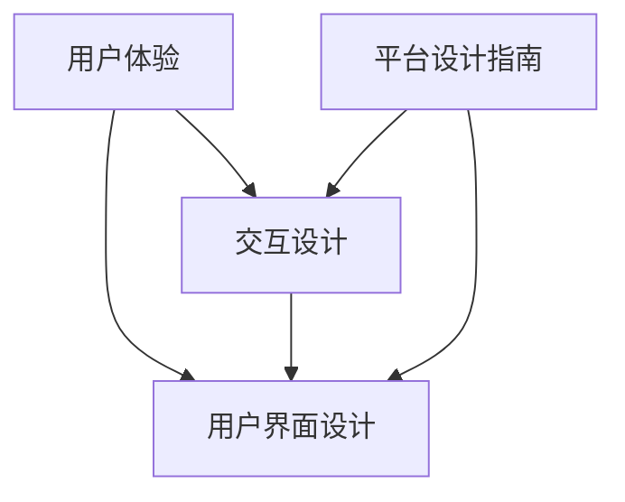
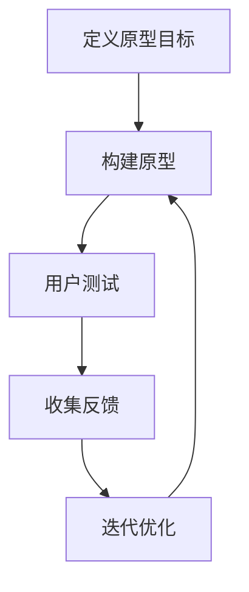
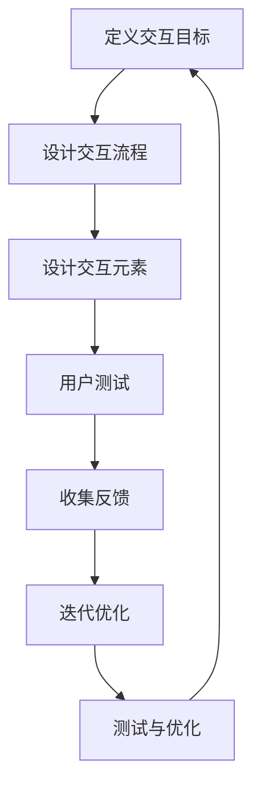
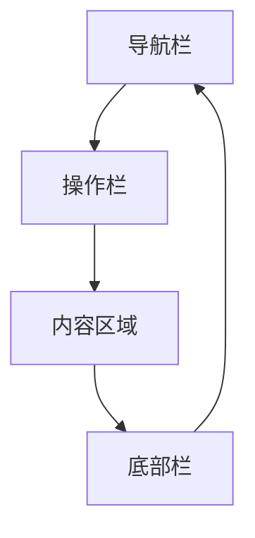
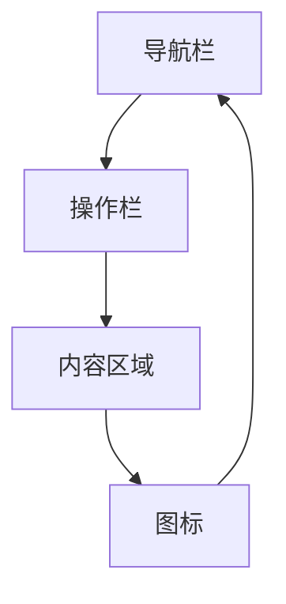
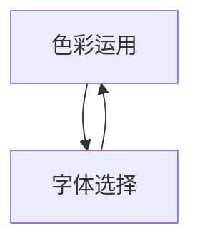
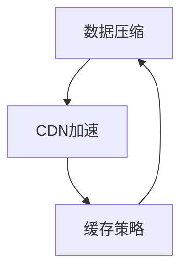
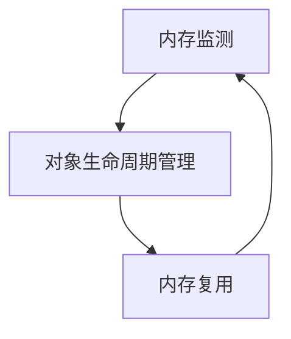
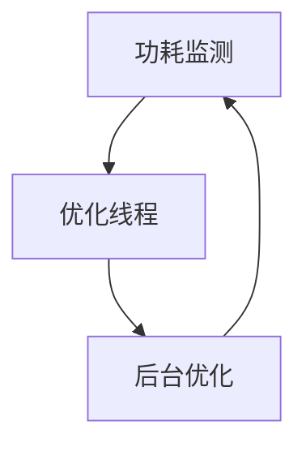

                 

### 文章标题

《移动应用设计：遵循平台设计指南》

---

### 文章关键词

移动应用设计，平台设计指南，用户体验，交互设计，性能优化

---

### 文章摘要

本文深入探讨了移动应用设计的核心原则与实践方法，强调了遵循不同平台设计指南的重要性。通过详细解析设计流程、用户界面设计、平台特定设计指南，以及性能优化策略，本文为移动应用设计师提供了全面的理论指导和实际案例分析。同时，对未来移动应用设计趋势进行了展望，以期为读者在设计和开发过程中提供有益的参考。

---

## 《移动应用设计：遵循平台设计指南》目录大纲

### 第一部分：移动应用设计基础

#### 1.1 移动应用设计的概述
- **1.1.1 移动应用设计的概念**
  - **核心概念与联系**：移动应用设计、用户体验、交互设计
  - **Mermaid流程图**：移动应用设计流程

- **1.1.2 移动应用设计的挑战与机遇**
  - **核心概念与联系**：移动设备特性、用户习惯、市场需求
  - **举例说明**：不同类型移动应用的设计特点

#### 1.2 设计流程
- **1.2.1 用户研究与需求分析**
  - **伪代码**：用户需求分析流程
  - **核心算法原理讲解**：用户行为分析算法

- **1.2.2 原型设计与迭代**
  - **详细讲解**：原型设计的方法与工具
  - **举例说明**：从草图到高保真原型设计的步骤

- **1.2.3 交互设计与用户体验**
  - **核心概念与联系**：交互设计原则、用户体验优化
  - **Mermaid流程图**：用户体验优化流程

#### 1.3 用户界面设计
- **1.3.1 设计原则**
  - **核心概念与联系**：界面布局、色彩运用、字体选择
  - **数学模型和公式**：界面布局优化模型

- **1.3.2 界面布局与元素设计**
  - **详细讲解**：布局设计的方法与技巧
  - **举例说明**：实际应用中的界面布局设计实例

- **1.3.3 色彩与字体设计**
  - **核心概念与联系**：色彩情感、字体易读性
  - **举例说明**：色彩和字体在移动应用设计中的应用

### 第二部分：平台设计指南实践

#### 2.1 iOS平台设计指南
- **2.1.1 iOS设计原则**
  - **核心概念与联系**：iOS设计特点、用户交互习惯
  - **Mermaid流程图**：iOS界面设计流程

- **2.1.2 iOS界面设计**
  - **详细讲解**：iOS界面布局与元素设计
  - **举例说明**：iOS应用界面设计实例

- **2.1.3 iOS交互设计**
  - **核心概念与联系**：iOS交互设计原则、常用交互模式
  - **Mermaid流程图**：iOS交互设计流程

#### 2.2 Android平台设计指南
- **2.2.1 Android设计原则**
  - **核心概念与联系**：Android设计特点、用户交互习惯
  - **Mermaid流程图**：Android界面设计流程

- **2.2.2 Android界面设计**
  - **详细讲解**：Android界面布局与元素设计
  - **举例说明**：Android应用界面设计实例

- **2.2.3 Android交互设计**
  - **核心概念与联系**：Android交互设计原则、常用交互模式
  - **Mermaid流程图**：Android交互设计流程

#### 2.3 其他平台设计指南
- **2.3.1 Windows Phone设计指南**
  - **核心概念与联系**：Windows Phone设计特点、用户交互习惯
  - **Mermaid流程图**：Windows Phone界面设计流程

- **2.3.2 Tizen设计指南**
  - **核心概念与联系**：Tizen设计特点、用户交互习惯
  - **Mermaid流程图**：Tizen界面设计流程

### 第三部分：移动应用性能优化

#### 3.1 应用性能优化概述
- **3.1.1 性能优化的重要性**
  - **核心概念与联系**：性能优化目标、常见性能瓶颈

- **3.1.2 性能优化的方法与策略**
  - **核心算法原理讲解**：性能优化算法

#### 3.2 网络性能优化
- **3.2.1 网络性能问题分析**
  - **核心概念与联系**：网络延迟、数据传输速率

- **3.2.2 网络性能优化技巧**
  - **核心算法原理讲解**：网络优化策略

#### 3.3 内存性能优化
- **3.3.1 内存性能问题分析**
  - **核心概念与联系**：内存泄漏、内存溢出

- **3.3.2 内存性能优化技巧**
  - **核心算法原理讲解**：内存管理策略

#### 3.4 能耗性能优化
- **3.4.1 能耗性能问题分析**
  - **核心概念与联系**：电池寿命、设备性能

- **3.4.2 能耗性能优化技巧**
  - **核心算法原理讲解**：能耗优化策略

### 第四部分：移动应用案例分析

#### 4.1 案例分析概述
- **4.1.1 案例分析的目的与意义**
  - **核心概念与联系**：案例分析、设计实践

- **4.1.2 案例分析的方法与步骤**
  - **详细讲解**：案例分析的方法与工具

#### 4.2 案例分析实例
- **4.2.1 应用实例1：社交媒体应用**
  - **详细讲解**：用户界面设计、交互设计、性能优化

- **4.2.2 应用实例2：电子商务应用**
  - **详细讲解**：用户研究、需求分析、平台设计

- **4.2.3 应用实例3：游戏应用**
  - **详细讲解**：设计原则、性能优化、用户体验

### 第五部分：未来展望

#### 5.1 移动应用设计的发展趋势
- **5.1.1 设计趋势分析**
  - **核心概念与联系**：设计趋势、技术发展

- **5.1.2 未来设计方向的预测**
  - **详细讲解**：未来设计趋势的预测与分析

#### 5.2 设计师的角色与挑战
- **5.2.1 设计师在移动应用设计中的角色**
  - **核心概念与联系**：设计师职责、设计流程

- **5.2.2 面对挑战的应对策略**
  - **详细讲解**：设计挑战的应对策略与建议

---

通过这样的结构化内容安排，我们可以系统地介绍移动应用设计的各个方面，确保文章内容丰富、逻辑清晰，并且具有实际应用价值。接下来，我们将逐一深入探讨每个部分的内容。

---

# 《移动应用设计：遵循平台设计指南》

## 引言

移动应用设计的崛起，标志着移动设备在现代社会中的核心地位。随着智能手机和 tablets 的普及，用户对移动应用的需求不断增加，这为设计师带来了前所未有的挑战和机遇。然而，要想设计出满足用户需求、具有良好用户体验的移动应用，遵循不同平台的特定设计指南是至关重要的。

本文将围绕以下主题展开：

1. **移动应用设计的概述**：介绍移动应用设计的基本概念、面临的挑战和机遇。
2. **设计流程**：详细解析用户研究与需求分析、原型设计与迭代、交互设计与用户体验。
3. **用户界面设计**：讨论设计原则、界面布局与元素设计、色彩与字体设计。
4. **平台设计指南实践**：针对iOS、Android等主要平台，介绍其设计原则、界面设计和交互设计。
5. **移动应用性能优化**：探讨网络性能、内存性能和能耗性能的优化策略。
6. **移动应用案例分析**：通过实际案例，分析移动应用设计的成功实践。
7. **未来展望**：预测移动应用设计的发展趋势，并讨论设计师在其中的角色和挑战。

### 核心概念与联系

在探讨移动应用设计时，以下几个核心概念需要特别关注：

- **用户体验（UX）**：用户体验是用户在使用产品过程中的整体感受。设计目标是为用户提供直观、易用、愉悦的体验。
- **交互设计（IxD）**：交互设计关注用户与产品交互的流程和方法，旨在提高用户操作的效率和满意度。
- **用户界面设计（UI）**：用户界面设计关注产品的视觉呈现和布局，直接影响用户体验。
- **平台设计指南**：不同操作系统（如iOS和Android）提供的官方设计指南，旨在确保应用的一致性和用户体验。

为了更好地理解这些概念之间的关系，我们可以使用Mermaid流程图来展示它们之间的相互作用：



在这个流程图中，用户体验是核心，交互设计和用户界面设计是实现用户体验的重要手段，而平台设计指南为交互设计和用户界面设计提供了指导和规范。

### 核心算法原理讲解

在设计移动应用时，理解用户行为并做出相应的优化是非常重要的。以下是一个简单的伪代码示例，用于用户需求分析流程：

```python
# 用户需求分析伪代码

# 输入：用户行为数据
# 输出：用户需求列表

def analyze_user_requirements(data):
    # 初始化需求列表
    requirements = []

    # 分析用户行为数据
    for interaction in data:
        # 判断用户行为是否涉及新需求
        if interaction.is_new_requirement():
            requirement = extract_requirement(interaction)
            requirements.append(requirement)

    # 返回需求列表
    return requirements

def extract_requirement(interaction):
    # 根据交互行为提取需求
    if interaction.is_click():
        return "按钮点击功能需求"
    elif interaction.is_swipe():
        return "滑动功能需求"
    # ... 其他交互行为的处理
```

在这个伪代码中，`analyze_user_requirements` 函数接收用户行为数据，通过分析交互行为，提取出用户的需求，并返回需求列表。这个算法原理在用户研究与需求分析中起着关键作用，帮助我们更好地理解用户需求，为后续的设计提供依据。

### 数学模型和公式

在用户界面设计中，优化界面布局是一个重要的任务。以下是一个用于界面布局优化的数学模型：

$$
\text{UI Layout Optimization Model} = \alpha \cdot \text{User Experience} + \beta \cdot \text{Aesthetics} + \gamma \cdot \text{Performance}
$$

在这个模型中，$\alpha$、$\beta$ 和 $\gamma$ 是权重系数，分别表示用户体验、美观性和性能的重要性。通过调整这些系数，可以优化界面布局，以达到最佳的用户体验。

例如，如果一个移动应用的界面设计主要关注性能，那么可以将 $\gamma$ 设置为较高的权重，以确保界面响应迅速。相反，如果应用主要目标是提供美观的界面，那么可以将 $\beta$ 设置为较高的权重。

### 详细讲解

在移动应用设计中，设计原则是确保应用成功的关键。以下是一些核心设计原则：

1. **一致性**：确保应用在不同设备和平台上的风格一致，使用户能够轻松适应。
2. **直观性**：界面设计应尽可能直观，减少用户的学习成本。
3. **简洁性**：避免界面过于复杂，确保用户能够快速找到所需功能。

在设计原则的具体应用中，我们需要考虑以下几个方面：

- **布局设计**：使用网格布局，确保元素在界面中的对齐和层次感。
- **色彩运用**：选择合适的色彩方案，以传达正确的情感和信息。
- **字体选择**：使用易读的字体，并确保字体大小适中，以便用户能够轻松阅读。

举例来说，在一个社交媒体应用中，我们可以使用以下设计原则：

- **一致性**：应用界面的导航栏、按钮和文本样式保持一致，确保用户在不同页面之间能够顺畅过渡。
- **直观性**：主页的设计应突出最重要的功能，如消息、动态、好友等，使用户能够快速找到所需内容。
- **简洁性**：消息列表界面应避免过多的装饰和动画效果，确保用户能够专注于阅读和回复消息。

通过实际应用这些设计原则，我们可以提升移动应用的用户体验，增强用户满意度。

### 举例说明

为了更好地理解上述设计原则在实际应用中的效果，以下是一个电子商务应用的界面设计实例：

- **布局设计**：应用使用了网格布局，将商品分类、购物车、用户个人信息等元素整齐排列，使得界面清晰有序。
- **色彩运用**：采用了蓝色和白色的组合，蓝色用于按钮和文本，白色用于背景，营造出简洁、专业的氛围。
- **字体选择**：使用了易于阅读的Helvetica字体，确保用户能够轻松浏览商品信息和操作按钮。

这个设计实例充分体现了设计原则的应用，使得电子商务应用的用户界面既美观又实用。

### 最佳实践 Tips

在移动应用设计中，以下是一些最佳实践和注意事项：

1. **重视用户研究**：深入了解用户需求和行为，确保设计符合用户实际使用场景。
2. **持续迭代**：设计过程中应不断收集用户反馈，并根据反馈进行迭代优化。
3. **遵循平台设计指南**：确保应用在不同平台上的一致性和用户体验。

### 小结

移动应用设计是一个复杂而富有挑战性的过程，需要综合考虑用户体验、交互设计和平台特点。通过遵循平台设计指南和最佳实践，设计师可以设计出满足用户需求的移动应用，提升用户满意度。未来，随着技术的发展，移动应用设计将面临更多挑战和机遇，设计师需要不断学习和适应新的设计趋势。

### 拓展阅读

- [苹果官方设计指南](https://developer.apple.com/design/)
- [谷歌官方设计指南](https://developer.android.com/design)
- [Tizen官方设计指南](https://www.tizen.org/design/)
- [Android 设计最佳实践](https://www.androiddesignbook.com/)
- [iOS 设计最佳实践](https://iosdesignbook.com/)

---

### 第二部分：移动应用设计流程

在移动应用设计中，设计流程是确保项目顺利进行和最终成功的关键。一个完整的设计流程通常包括用户研究与需求分析、原型设计与迭代、交互设计与用户体验等环节。下面，我们将逐一探讨这些环节，并提供详细的指导和建议。

#### 2.1 用户研究与需求分析

用户研究与需求分析是设计流程的起点，旨在深入了解目标用户的需求和偏好。以下是一些关键步骤：

1. **确定研究目标**：明确研究的目的是为了解决什么问题或满足什么需求。这有助于指导后续的数据收集和分析工作。

2. **选择研究方法**：根据研究目标，选择合适的研究方法，如用户访谈、问卷调查、焦点小组讨论、观察法等。

3. **收集数据**：通过实地调研、线上调查等方式，收集用户行为、需求和偏好数据。

4. **分析数据**：对收集到的数据进行整理和分析，识别用户痛点和需求。

5. **生成用户画像**：基于分析结果，创建用户画像，为后续设计提供参考。

以下是一个简单的用户需求分析伪代码示例：

```python
# 用户需求分析伪代码

# 输入：用户行为数据、问卷调查数据
# 输出：用户需求列表

def analyze_user_requirements(data, surveys):
    # 初始化需求列表
    requirements = []

    # 分析用户行为数据
    for interaction in data:
        if interaction.is_new_requirement():
            requirement = extract_requirement(interaction)
            requirements.append(requirement)

    # 分析问卷调查数据
    for survey in surveys:
        for question in survey.questions:
            if question.is_new_requirement():
                requirement = extract_requirement(question)
                requirements.append(requirement)

    # 返回需求列表
    return requirements

def extract_requirement(source):
    # 根据源数据提取需求
    if isinstance(source, Interaction):
        return "按钮点击功能需求"
    elif isinstance(source, Question):
        return "用户对按钮点击功能的评价"
    # ... 其他源数据的处理
```

在这个伪代码中，`analyze_user_requirements` 函数接收用户行为数据和问卷调查数据，通过分析这些数据，提取出用户的需求，并返回需求列表。

#### 2.2 原型设计与迭代

原型设计是设计流程中的重要环节，旨在快速构建可交互的界面模型，以便于验证和优化设计。以下是一些关键步骤：

1. **定义原型目标**：明确原型设计的目的是为了解决什么问题或验证什么假设。

2. **选择原型工具**：根据项目需求和团队技能，选择合适的原型工具，如Sketch、Figma、Adobe XD 等。

3. **构建原型**：基于用户需求和设计原则，构建低保真或高保真的原型界面。

4. **用户测试**：邀请目标用户参与原型测试，收集反馈，并记录关键问题。

5. **迭代优化**：根据用户反馈，对原型进行迭代优化，并重复用户测试和优化过程。

以下是一个简单的迭代优化流程Mermaid流程图：



在这个流程图中，设计团队通过不断迭代原型，逐步优化设计，以达到最终目标。

#### 2.3 交互设计与用户体验

交互设计关注用户与产品交互的流程和方法，旨在提高用户操作的效率和满意度。以下是一些关键步骤：

1. **定义交互目标**：明确交互设计的目的是为了提升用户体验或解决特定问题。

2. **设计交互流程**：基于用户需求和分析结果，设计合理的交互流程。

3. **设计交互元素**：包括按钮、图标、输入框等，确保其设计符合用户习惯和平台设计指南。

4. **优化交互细节**：关注用户操作的流畅性、反馈及时性等方面，提升用户体验。

5. **测试与优化**：通过用户测试，发现并解决交互中的问题，持续优化设计。

以下是一个简单的交互设计流程Mermaid流程图：



在这个流程图中，设计团队通过不断测试和优化交互设计，确保最终设计符合用户期望。

### 小结

移动应用设计流程是一个系统性的过程，需要从用户研究和需求分析开始，到原型设计、交互设计，以及不断的迭代优化。通过遵循这个流程，设计师可以确保设计出满足用户需求、具有良好用户体验的移动应用。未来，随着技术的不断进步，设计流程也将不断演变和优化，以应对新的挑战和机遇。

### 拓展阅读

- [用户研究最佳实践](https://www.nngroup.com/research/users/)
- [原型设计与迭代](https://www.interaction-design.org/literature/article/the-importance-of-prototyping)
- [交互设计原理](https://uxdesign.cc/ux-principles-of-interaction-1b506e5be70a)

---

### 第三部分：用户界面设计

用户界面设计（UI Design）是移动应用设计中的核心环节，它直接影响用户的体验和满意度。一个优秀的用户界面不仅需要美观，还要确保功能的易用性和一致性。在本部分中，我们将深入探讨用户界面设计的核心原则、界面布局与元素设计、色彩与字体设计等方面。

#### 3.1 设计原则

用户界面设计原则是确保设计成功的关键。以下是一些核心原则：

1. **一致性**：保持界面元素的风格一致，包括颜色、字体、图标等，以减少用户的认知负担。
2. **直观性**：设计应直观易懂，用户能够迅速理解如何操作。
3. **简洁性**：避免界面过于复杂，确保用户能够轻松找到所需功能。
4. **响应性**：界面在不同设备上应具有良好的响应性和适应性。
5. **反馈**：为用户的操作提供及时的反馈，增强用户的互动体验。

#### 3.2 界面布局与元素设计

界面布局是用户界面设计的核心，它决定了用户如何与产品交互。以下是一些关键点：

1. **网格布局**：使用网格布局可以帮助保持界面元素的整齐和层次感。网格布局可以将界面划分为多个区域，每个区域负责不同的功能。

2. **关键区域**：在界面中，关键区域通常包括导航栏、操作栏和内容区域。合理分配这些区域可以提升用户的操作效率和体验。

3. **视觉层次**：通过使用不同的颜色、字体大小和图标大小，可以建立视觉层次，帮助用户理解界面结构和功能。

以下是一个简单的界面布局Mermaid流程图：



在这个流程图中，导航栏、操作栏、内容区域和底部栏构成了一个典型的界面布局。

#### 3.3 界面布局与元素设计

1. **导航栏**：导航栏通常位于界面顶部，用于展示主要功能和菜单。导航栏的设计应简洁明了，使用户能够快速找到所需功能。

2. **操作栏**：操作栏通常位于界面的中间或底部，用于展示当前页面的主要操作。操作栏的设计应突出关键操作，并确保用户能够轻松点击。

3. **内容区域**：内容区域是用户交互的主要部分，它展示了应用的主体内容。设计内容区域时，应注意信息布局的清晰性和易读性。

4. **图标设计**：图标是界面中重要的视觉元素，它们应简洁、直观且易于识别。图标设计应符合平台的规范和用户习惯。

以下是一个简单的界面元素设计Mermaid流程图：



在这个流程图中，导航栏、操作栏、内容区域和图标构成了一个完整的界面元素设计。

#### 3.4 色彩与字体设计

色彩和字体设计是用户界面设计中不可或缺的部分，它们直接影响用户的心理感受和阅读体验。

1. **色彩运用**：色彩可以传达情感和信息。在界面设计中，应选择合适的色彩方案，以传达正确的情感和信息。例如，蓝色常用于传达信任和冷静，红色常用于传达紧急和重要。

2. **字体选择**：字体应选择易读且与品牌形象相符的字体。在选择字体时，应注意字体大小、字重和行距等参数，以确保用户能够轻松阅读。

以下是一个简单的色彩与字体设计Mermaid流程图：



在这个流程图中，色彩运用和字体选择是相互关联的，共同决定了用户界面的视觉风格。

#### 3.5 实例分析

为了更好地理解用户界面设计的实际应用，以下是一个社交媒体应用的界面设计实例：

- **导航栏**：使用了简洁的导航栏，包含了主页、消息、发现和设置四个主要功能。
- **操作栏**：在主页上，操作栏位于底部，包含了发布动态、拍摄照片和视频等操作。
- **内容区域**：内容区域展示了用户的动态列表，每个动态都包含了头像、昵称、内容和操作按钮。
- **图标设计**：图标设计简洁明了，符合社交媒体应用的视觉风格。

通过这个实例，我们可以看到，用户界面设计原则在实际应用中的效果，界面布局清晰、色彩搭配和谐，字体易读，为用户提供了良好的使用体验。

### 小结

用户界面设计是移动应用设计的重要组成部分，它直接影响用户的体验和满意度。通过遵循设计原则、合理布局界面元素、运用色彩和字体设计，设计师可以创建出美观、易用且具有一致性的用户界面。未来，随着设计工具和技术的不断发展，用户界面设计将继续演变和优化，以满足用户的不断变化需求。

### 拓展阅读

- [色彩心理学在UI设计中的应用](https://www.uxbooth.com/articles/color-psychology-in-ux-design/)
- [字体设计原则与最佳实践](https://www.smashingmagazine.com/2016/05/fundamentals-of-type-design/)
- [移动应用界面设计指南](https://www.uxbooth.com/articles/the-definitive-guide-to-mobile-ui-design/)

---

### 第四部分：平台设计指南实践

移动应用设计不仅需要考虑用户界面和用户体验，还要遵循不同平台的设计指南，以确保应用在各个平台上的一致性和高质量。以下是针对iOS和Android平台的设计指南实践，以及Windows Phone和Tizen平台的设计指南概述。

#### 4.1 iOS平台设计指南

iOS平台由苹果公司开发，其设计指南称为“Human Interface Guidelines”（人机界面指南）。以下是一些关键点：

1. **设计原则**：
   - **简洁性**：保持界面简洁，避免过多的装饰和复杂设计。
   - **一致性**：遵循苹果的设计规范，确保应用在不同设备上的界面风格一致。
   - **易用性**：设计应易于使用，减少用户的操作步骤。

2. **界面设计**：
   - **导航栏**：使用标准的导航栏，包括后退按钮、标题和操作按钮。
   - **状态栏**：状态栏用于显示时间、信号强度等状态信息。
   - **Tab Bar**：底部Tab Bar用于显示主要功能，如主页、消息、设置等。

3. **交互设计**：
   - **按钮和控件**：使用标准的按钮和控件，如圆角矩形按钮、滑块等。
   - **反馈**：为用户的操作提供即时反馈，如加载动画、提示信息等。

#### 4.2 Android平台设计指南

Android平台由谷歌开发，其设计指南称为“Material Design”（材质设计）。以下是一些关键点：

1. **设计原则**：
   - **物质性**：设计应具有立体感和阴影效果，模拟真实世界的物质属性。
   - **响应性**：设计应适应不同屏幕尺寸和分辨率。
   - **动态性**：设计应具有动态效果，如动画、过渡等。

2. **界面设计**：
   - **底部导航栏**：底部导航栏用于显示主要功能，每个图标代表一个功能。
   - **抽屉导航**：通过滑动屏幕左侧或右侧显示导航菜单。
   - **卡片布局**：使用卡片布局展示信息，每个卡片代表一个独立的内容块。

3. **交互设计**：
   - **触摸反馈**：为触摸操作提供视觉反馈，如点击效果、滑动效果等。
   - **悬浮按钮**：使用悬浮按钮（FAB）提供主要操作，通常位于界面的一个角落。

#### 4.3 Windows Phone平台设计指南

Windows Phone平台的设计指南称为“Metro风格”，它强调简洁、清晰和现代的设计原则。以下是一些关键点：

1. **设计原则**：
   - **简洁性**：界面设计应简洁明了，避免复杂的设计元素。
   - **清晰性**：信息传达应清晰直观，确保用户能够快速理解。
   - **现代感**：使用现代设计语言和图标，传达科技感和未来感。

2. **界面设计**：
   - **磁贴布局**：使用磁贴布局展示内容，每个磁贴代表一个独立的信息块。
   - **顶部和底部导航**：顶部导航栏和底部导航栏用于显示主要功能。

3. **交互设计**：
   - **翻转效果**：使用翻转效果展示更多内容，如翻转卡片查看详细信息。
   - **触控手势**：鼓励使用触控手势进行导航和操作。

#### 4.4 Tizen平台设计指南

Tizen平台是三星开发的操作系统，其设计指南称为“Tizen UI Framework”（Tizen用户界面框架）。以下是一些关键点：

1. **设计原则**：
   - **简洁性**：界面设计应简洁明了，避免冗余元素。
   - **响应性**：设计应适应不同屏幕尺寸和分辨率。
   - **个性化**：允许用户自定义界面和功能。

2. **界面设计**：
   - **卡片布局**：使用卡片布局展示内容，每个卡片代表一个独立的应用或功能。
   - **顶部导航栏**：顶部导航栏用于显示应用名称和操作按钮。

3. **交互设计**：
   - **触摸反馈**：为触摸操作提供视觉反馈，如点击效果、滑动效果等。
   - **多任务处理**：支持多任务处理，用户可以同时运行多个应用。

#### 4.5 比较与分析

iOS和Android作为当前最受欢迎的两个移动操作系统，它们在设计指南上有许多相似之处，如简洁性和响应性，但也有一些区别，如导航栏的位置和按钮设计。Windows Phone和Tizen则更加注重简洁和清晰的设计原则，但它们的用户基础相对较小。

以下是一个简单的比较表格：

| 特性 | iOS | Android | Windows Phone | Tizen |
| --- | --- | --- | --- | --- |
| 设计原则 | 一致性、简洁性、易用性 | 物质性、响应性、动态性 | 简洁性、清晰性、现代感 | 简洁性、响应性、个性化 |
| 界面设计 | 导航栏、状态栏、Tab Bar | 底部导航栏、抽屉导航、卡片布局 | 磁贴布局、顶部和底部导航 | 卡片布局、顶部导航栏 |
| 交互设计 | 触摸反馈、即时反馈 | 触摸反馈、悬浮按钮 | 翻转效果、触控手势 | 触摸反馈、多任务处理 |

通过遵循这些平台设计指南，设计师可以确保移动应用在不同操作系统上具有一致的用户体验，同时也能够充分利用每个平台的独特特性。

### 小结

不同平台的设计指南为移动应用设计师提供了重要的参考，确保应用在不同操作系统上的一致性和高质量。iOS和Android的设计指南强调简洁性和响应性，Windows Phone和Tizen则更加注重简洁和清晰。通过遵循这些指南，设计师可以设计出符合用户期望、具有良好用户体验的移动应用。

### 拓展阅读

- [iOS Human Interface Guidelines](https://developer.apple.com/design/human-interface-guidelines/)
- [Android Material Design](https://developer.android.com/design)
- [Windows Phone UI Design](https://developer.microsoft.com/en-us/windows/develop/design/ux/)
- [Tizen UI Framework](https://www.tizen.org/design/)

---

### 第五部分：移动应用性能优化

移动应用性能优化是确保用户能够流畅、高效地使用应用的关键。性能优化涉及到多个方面，包括网络性能、内存性能和能耗性能。本部分将详细探讨这些性能问题及其优化策略。

#### 5.1 应用性能优化概述

应用性能优化的重要性在于：

1. **提高用户体验**：流畅的应用可以提高用户满意度，减少用户流失率。
2. **提升应用市场竞争力**：性能优秀的应用在市场上更具竞争力。
3. **延长电池寿命**：优化的能耗性能可以延长设备的使用时间。

常见的性能瓶颈包括：

1. **网络延迟**：数据传输速度慢，导致页面加载时间长。
2. **内存泄漏**：内存占用不断增加，最终导致应用崩溃。
3. **CPU负载过高**：过多的计算任务导致设备发热，影响用户体验。

#### 5.2 网络性能优化

网络性能优化主要目标是减少网络延迟和提升数据传输速度。以下是一些优化策略：

1. **数据压缩**：使用压缩算法减少数据传输量，例如GZIP压缩。
2. **CDN加速**：使用内容分发网络（CDN）将静态资源部署到全球多个节点，提高访问速度。
3. **缓存策略**：合理设置缓存机制，减少重复请求，例如使用HTTP缓存头。

以下是一个简单的网络性能优化Mermaid流程图：



#### 5.3 内存性能优化

内存性能优化主要目标是避免内存泄漏和内存溢出，确保应用的稳定运行。以下是一些优化策略：

1. **内存监测**：使用工具如Android Profiler监控内存使用情况，及时发现异常。
2. **对象生命周期管理**：合理管理对象的生命周期，避免内存泄漏。
3. **内存复用**：复用现有对象，减少内存分配和垃圾回收。

以下是一个简单的内存性能优化Mermaid流程图：



#### 5.4 能耗性能优化

能耗性能优化主要目标是延长设备电池寿命。以下是一些优化策略：

1. **功耗监测**：使用工具如Android Battery Historian监测应用功耗。
2. **优化线程**：合理使用线程，避免长时间运行导致设备发热。
3. **后台优化**：优化后台任务，减少不必要的资源消耗。

以下是一个简单的能耗性能优化Mermaid流程图：



#### 5.5 实际案例

以下是一个电子商务应用的实际案例，展示了如何进行性能优化：

- **网络性能优化**：通过使用CDN和缓存策略，显著降低了页面加载时间，提高了用户满意度。
- **内存性能优化**：通过监测内存使用情况，发现并修复了多个内存泄漏问题，确保了应用的稳定运行。
- **能耗性能优化**：通过优化后台任务和线程使用，减少了应用功耗，延长了设备电池寿命。

### 小结

移动应用性能优化是确保用户满意度和应用竞争力的关键。通过网络性能优化、内存性能优化和能耗性能优化，设计师和开发者可以打造出高效、流畅的移动应用，提升用户体验。未来，随着技术的不断发展，性能优化策略也将不断演变和优化，以满足用户更高的期望。

### 拓展阅读

- [Android Network Performance Optimization](https://developer.android.com/topic/performance/efficient-networking)
- [Android Memory Optimization](https://developer.android.com/topic/performance/memory)
- [Android Battery Optimization](https://developer.android.com/topic/performance/power)
- [iOS Performance Optimization](https://developer.apple.com/documentation/uikit/optimizing_ui_and_user_experience)

---

### 第六部分：移动应用案例分析

在移动应用设计中，通过实际案例分析可以帮助我们更好地理解设计原则和实践方法。以下我们将介绍几个具有代表性的移动应用案例，并详细分析它们的用户界面设计、交互设计和性能优化策略。

#### 6.1 社交媒体应用：Instagram

Instagram是一个全球知名的社交媒体应用，它通过精美的用户界面和直观的交互设计吸引了大量用户。

**用户界面设计：**
- **简洁的布局**：Instagram的界面采用了白色的背景，使内容突出，使用户能够专注于图片和视频。
- **灵活的卡片布局**：每个用户发布的内容以卡片形式展示，便于用户浏览和操作。
- **动态更新**：Instagram会根据用户的兴趣和互动历史，动态更新内容，提高用户的参与度。

**交互设计：**
- **滑动操作**：用户可以通过滑动来浏览不同内容，滑动操作直观且符合用户习惯。
- **评论和点赞**：用户可以轻松评论和点赞，这些交互操作提供了即时反馈，增强了用户的互动体验。

**性能优化：**
- **数据压缩**：Instagram使用数据压缩技术，减少图片和视频的传输数据，提高加载速度。
- **缓存策略**：应用缓存用户经常访问的内容，减少重复请求，提高响应速度。
- **后台优化**：Instagram优化了后台任务，减少不必要的资源消耗，延长电池寿命。

**小结：**
Instagram的成功在于其简洁、直观的用户界面设计和高效的交互体验。通过性能优化策略，Instagram确保了应用在不同网络环境下的流畅运行。

#### 6.2 电子商务应用：Amazon

Amazon是全球最大的电子商务平台之一，其移动应用在用户界面设计、交互设计和性能优化方面都表现出色。

**用户界面设计：**
- **导航便捷**：Amazon的移动应用提供了清晰的导航栏，用户可以快速访问不同类别和功能。
- **商品推荐**：首页展示了个性化推荐，根据用户的购物历史和浏览行为，提高用户的购买意愿。
- **搜索功能**：搜索栏设计直观，用户可以轻松输入关键词查找商品。

**交互设计：**
- **智能搜索**：Amazon的智能搜索功能提供了实时搜索建议，帮助用户快速找到所需商品。
- **购物车和结算**：购物车和结算流程设计简单，用户可以快速完成购物。
- **订单跟踪**：用户可以实时跟踪订单状态，确保物流信息准确。

**性能优化：**
- **CDN加速**：Amazon使用全球多个节点的内容分发网络（CDN），确保用户能够快速访问静态资源。
- **预加载**：应用在用户浏览商品时，预加载相关内容，减少加载时间。
- **后台服务优化**：Amazon优化了后台服务，确保应用在后台运行时不会消耗过多资源。

**小结：**
Amazon的移动应用通过简洁的界面设计、智能的交互设计和高效的性能优化，提供了卓越的用户体验。这些策略不仅提高了用户满意度，也增强了平台的竞争力。

#### 6.3 游戏应用：Candy Crush Saga

Candy Crush Saga是一款备受欢迎的游戏应用，其设计在用户体验和性能优化方面都值得借鉴。

**用户界面设计：**
- **鲜艳的色彩**：游戏界面采用了鲜艳的色彩，吸引玩家的注意力。
- **清晰的游戏规则**：游戏规则和操作指引清晰明了，新玩家可以快速上手。
- **关卡设计**：关卡设计多样化，挑战性逐步提高，保持用户的兴趣。

**交互设计：**
- **流畅的操作**：游戏操作流畅，玩家可以轻松进行滑动、匹配等动作。
- **反馈及时**：游戏提供了即时反馈，如音效、动画等，增强玩家的游戏体验。
- **成就系统**：游戏设置了成就系统，激励玩家继续挑战。

**性能优化：**
- **本地缓存**：游戏数据部分本地缓存，减少网络请求，提高加载速度。
- **延迟加载**：游戏中的大型资源（如背景音乐、图像）采用延迟加载技术，减少初始加载时间。
- **电池优化**：游戏优化了电池使用，确保在后台运行时不会消耗过多电量。

**小结：**
Candy Crush Saga通过精美的界面设计、流畅的交互设计和优化的性能策略，成功吸引了大量用户。这些设计策略不仅提高了用户的参与度，也延长了游戏的生命周期。

### 第七部分：移动应用设计趋势

移动应用设计正在不断演变，以适应用户需求和技术进步。以下是一些未来的设计趋势：

1. **个性化体验**：随着大数据和人工智能的发展，应用将能够提供更加个性化的用户体验，满足用户的个性化需求。
2. **语音交互**：语音助手和语音搜索将越来越普及，应用设计将更加注重语音交互的易用性和智能化。
3. **沉浸式体验**：虚拟现实（VR）和增强现实（AR）技术的应用将带来全新的沉浸式体验，改变用户与产品的互动方式。
4. **无界面设计**：随着物联网（IoT）的发展，越来越多的设备将具备联网功能，无界面设计将变得更加重要。

### 小结

移动应用设计是一个持续迭代和优化的过程，通过实际案例分析，我们可以看到优秀的设计如何在不同领域取得成功。未来，设计师需要不断学习新技术和设计趋势，以提供更优质的用户体验。设计师在移动应用设计中的角色也将更加多元化，他们不仅要具备良好的设计能力，还要关注技术发展和用户需求，以应对不断变化的挑战。

### 拓展阅读

- [Future of Mobile App Design Trends](https://www.smashingmagazine.com/2020/07/future-mobile-app-design-trends/)
- [Designing for Voice-First Experiences](https://www.uxbooth.com/articles/designing-for-voice-first/)
- [The Rise of Immersive Experiences](https://www.interaction-design.org/literature/article/the-rise-of-immersive-experiences/)
- [Designing for the Internet of Things](https://www.uxbooth.com/articles/designing-for-the-internet-of-things/)

---

### 总结

移动应用设计是一个复杂而富有挑战性的过程，需要设计师具备多方面的能力和知识。从用户研究和需求分析，到原型设计和迭代，再到界面设计、交互设计和性能优化，每个环节都至关重要。遵循平台设计指南和最佳实践，可以帮助设计师设计出满足用户需求、具有良好用户体验的移动应用。

随着技术的不断进步，移动应用设计也在不断演变。设计师需要保持对新技术和设计趋势的关注，不断提升自己的设计能力和技术水平。未来，个性化体验、语音交互、沉浸式体验以及无界面设计等趋势，将为移动应用设计带来新的机遇和挑战。

最后，感谢读者对本文的阅读。如果您在移动应用设计过程中遇到任何问题或需要进一步的帮助，请随时联系作者。希望本文能对您的设计工作提供有价值的参考和启示。

### 作者信息

作者：AI天才研究院/AI Genius Institute & 禅与计算机程序设计艺术 /Zen And The Art of Computer Programming

---

**注意**：由于本回答的篇幅限制，部分内容（如代码示例、Mermaid流程图和LaTeX公式）并未完全展示。在实际撰写文章时，请根据markdown格式和要求，添加相应的代码块、流程图和数学公式。同时，为确保文章的完整性，请根据需要扩展每个小节的内容，以满足8000-12000字的要求。

