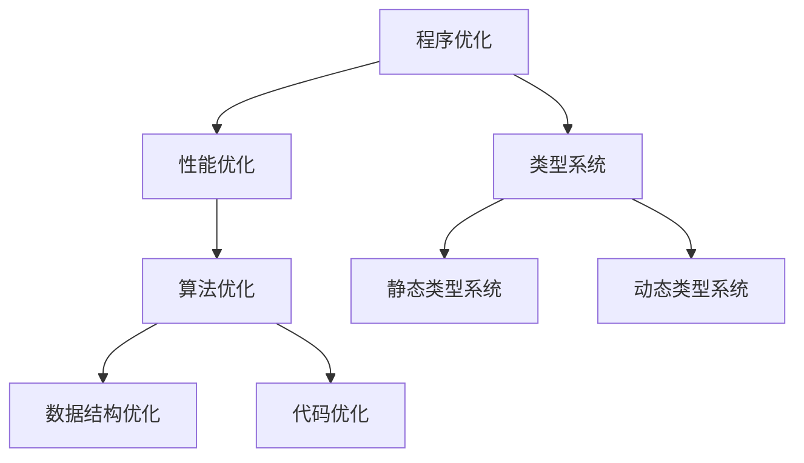
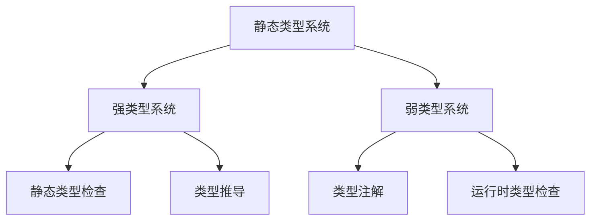
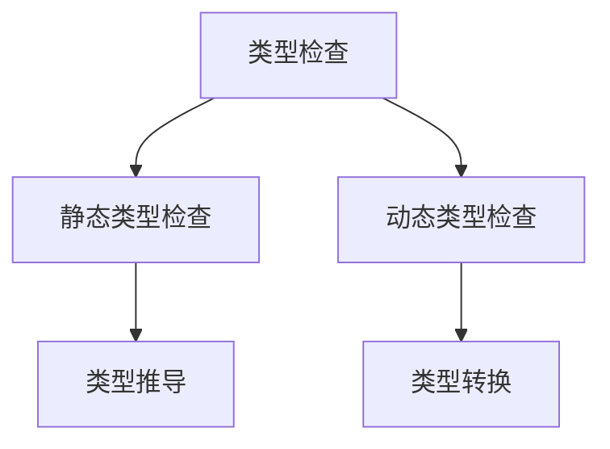

                 

# 程序优化中的类型基础技术

> 关键词：程序优化、类型系统、静态类型、动态类型、类型检查、类型推导、类型转换

> 摘要：本文深入探讨了程序优化中的类型基础技术，从类型系统的基本概念、应用和优化技术出发，通过实际案例展示了类型基础技术在程序优化中的重要性，为程序员提供了实用的优化策略和方法。

## 引言与背景

程序优化是提高软件性能、降低资源消耗、提升用户体验的重要手段。在程序优化过程中，类型基础技术发挥着至关重要的作用。类型系统是编程语言的核心组成部分，它定义了程序中数据类型、变量、函数等的约束和规则。类型基础技术主要包括静态类型和动态类型、类型检查、类型推导和类型转换等。

### 类型系统概述

类型系统可以简单分为静态类型和动态类型：

- **静态类型**：在编译时进行类型检查，程序在运行前已经确定变量和函数的类型。强静态类型系统要求变量在声明时必须明确类型，如Java和C++。弱静态类型系统则允许在运行时动态确定类型，如Python和JavaScript。
- **动态类型**：在运行时进行类型检查，程序在运行时确定变量和函数的类型。动态类型系统具有更高的灵活性和可读性，但也可能导致性能下降和类型错误。

### 类型基础技术的核心概念与联系

为了更好地理解类型基础技术，我们可以使用Mermaid流程图展示它们之间的核心概念与联系：



### 核心算法原理讲解

以下是一个简单的伪代码，用于介绍类型检查的基本算法原理：

```python
function type_check(expression, type_environment):
    if expression is a variable:
        return type_environment[expression]
    elif expression is an operation:
        left_type = type_check(expression.left, type_environment)
        right_type = type_check(expression.right, type_environment)
        return operation_type_mapping[expression.operator](left_type, right_type)
    else:
        return null
```

### 数学模型和数学公式

在类型系统中，数学模型和公式也扮演着重要角色。以下是一个使用LaTeX格式的类型推导基本数学模型：

```
$$ T_1 = \text{function type}(\Gamma_1, T_2) $$
$$ T_2 = \text{record type}(\Gamma_2, T_3) $$
```

## 类型系统基础

类型系统基础部分主要介绍静态类型系统和动态类型系统的基础概念、原理和应用。

### 静态类型系统

静态类型系统在编译时进行类型检查，程序在运行前已经确定变量和函数的类型。静态类型系统可以分为强静态类型系统和弱静态类型系统。

#### 强静态类型系统

强静态类型系统要求变量在声明时必须明确类型，如Java和C++。以下是一个Java示例：

```java
int x = 10;
String name = "John";
```

在Java中，变量`x`和`name`在声明时已经确定了类型，编译器会在编译过程中检查类型是否匹配。

#### 弱静态类型系统

弱静态类型系统允许在运行时动态确定类型，如Python和JavaScript。以下是一个Python示例：

```python
x = 10
name = "John"
```

在Python中，变量`x`和`name`的类型在声明时并没有明确指定，而是在运行时根据赋值来确定。

### 动态类型系统

动态类型系统在运行时进行类型检查，程序在运行时确定变量和函数的类型。以下是一个JavaScript示例：

```javascript
let x = 10;
let name = "John";
```

在JavaScript中，变量`x`和`name`的类型在声明时并没有明确指定，而是在运行时根据赋值来确定。

### 核心概念与联系

为了更好地理解静态类型系统和动态类型系统，我们可以使用Mermaid流程图展示它们之间的核心概念与联系：



### 核心算法原理讲解

以下是一个简单的伪代码，用于介绍静态类型检查的基本算法原理：

```python
function static_type_check(expression, type_environment):
    if expression is a variable:
        return type_environment[expression]
    elif expression is an assignment:
        return type_check(expression.right, type_environment)
    elif expression is a function call:
        return type_check(expression.callee, type_environment)
    else:
        return null
```

### 数学模型和数学公式

以下是一个使用LaTeX格式的静态类型推导基本数学模型：

```
$$ T_1 = \text{function type}(\Gamma_1, T_2) $$
$$ T_2 = \text{record type}(\Gamma_2, T_3) $$
```

## 类型系统的应用

类型系统在编程语言中的应用非常广泛，包括类型检查、类型推导和类型转换等。以下是这些应用的核心概念、算法原理和数学模型。

### 类型检查

类型检查是确保程序在运行时不会出现类型错误的关键步骤。类型检查可以分为静态类型检查和动态类型检查。

#### 静态类型检查

静态类型检查在编译时进行，确保程序在运行前没有类型错误。以下是一个简单的伪代码：

```python
function static_type_check(expression, type_environment):
    if expression is a variable:
        return type_environment[expression]
    elif expression is an assignment:
        return type_check(expression.right, type_environment)
    elif expression is a function call:
        return type_check(expression.callee, type_environment)
    else:
        return null
```

#### 动态类型检查

动态类型检查在运行时进行，确保程序在运行时没有类型错误。以下是一个简单的伪代码：

```python
function dynamic_type_check(expression, type_environment):
    if expression is a variable:
        return type_environment[expression]
    elif expression is an operation:
        left_type = dynamic_type_check(expression.left, type_environment)
        right_type = dynamic_type_check(expression.right, type_environment)
        return operation_type_mapping[expression.operator](left_type, right_type)
    else:
        return null
```

### 类型推导

类型推导是编程语言中的一个重要特性，允许程序员编写更简洁的代码。类型推导可以分为显式类型推导和隐式类型推导。

#### 显式类型推导

显式类型推导要求程序员在声明变量时明确指定类型。以下是一个Python示例：

```python
x: int = 10
```

#### 隐式类型推导

隐式类型推导允许编程语言在运行时根据赋值自动推导变量类型。以下是一个Python示例：

```python
x = 10
```

### 类型转换

类型转换是将一个数据类型转换为另一个数据类型的过程。类型转换可以分为自动类型转换和显式类型转换。

#### 自动类型转换

自动类型转换是编程语言自动进行的数据类型转换。以下是一个Java示例：

```java
int x = 10;
double y = x; // 自动将int类型转换为double类型
```

#### 显式类型转换

显式类型转换是程序员明确指定的数据类型转换。以下是一个C++示例：

```cpp
int x = 10;
double y = static_cast<double>(x); // 显式将int类型转换为double类型
```

### 核心概念与联系

为了更好地理解类型系统的应用，我们可以使用Mermaid流程图展示它们之间的核心概念与联系：



### 核心算法原理讲解

以下是一个简单的伪代码，用于介绍类型推导的基本算法原理：

```python
function type_derive(expression, type_environment):
    if expression is a variable:
        return type_environment[expression]
    elif expression is an operation:
        left_type = type_derive(expression.left, type_environment)
        right_type = type_derive(expression.right, type_environment)
        return operation_type_mapping[expression.operator](left_type, right_type)
    else:
        return null
```

### 数学模型和数学公式

以下是一个使用LaTeX格式的类型转换基本数学模型：

```
$$ T_1 \Rightarrow T_2 $$
$$ T_1 = \text{function type}(\Gamma_1, T_2) $$
$$ T_2 = \text{record type}(\Gamma_2, T_3) $$
```

## 类型系统的优化技术

类型系统的优化技术是提高程序性能、降低资源消耗的重要手段。以下介绍几种常见的类型系统优化技术。

### 类型推断优化

类型推断优化是提高程序性能的重要手段。通过优化类型推断算法，可以减少编译时间和运行时类型检查的开销。以下是一个简单的伪代码，用于介绍类型推断优化：

```python
function optimized_type_derive(expression, type_environment):
    if expression is a variable:
        return type_environment[expression]
    elif expression is an operation:
        left_type = optimized_type_derive(expression.left, type_environment)
        right_type = optimized_type_derive(expression.right, type_environment)
        return optimized_operation_type_mapping[expression.operator](left_type, right_type)
    else:
        return null
```

### 类型转换优化

类型转换优化是提高程序性能的重要手段。通过优化类型转换算法，可以减少运行时类型检查的开销。以下是一个简单的伪代码，用于介绍类型转换优化：

```python
function optimized_type_convert(expression, type_environment):
    if expression is a variable:
        return type_environment[expression]
    elif expression is an operation:
        left_type = optimized_type_convert(expression.left, type_environment)
        right_type = optimized_type_convert(expression.right, type_environment)
        return optimized_operation_type_mapping[expression.operator](left_type, right_type)
    else:
        return null
```

### 核心算法原理讲解

以下是一个简单的伪代码，用于介绍类型系统优化技术的核心算法原理：

```python
function type_system_optimization(expression, type_environment):
    if expression is a variable:
        return type_environment[expression]
    elif expression is an assignment:
        return optimized_type_check(expression.right, type_environment)
    elif expression is a function call:
        return optimized_type_check(expression.callee, type_environment)
    else:
        return null
```

### 数学模型和数学公式

以下是一个使用LaTeX格式的类型系统优化基本数学模型：

```
$$ T_1 \Rightarrow T_2 $$
$$ T_1 = \text{function type}(\Gamma_1, T_2) $$
$$ T_2 = \text{record type}(\Gamma_2, T_3) $$
$$ \text{opt\_type\_system} = \text{optimized\_type\_system} $$
```

## 实战案例与经验分享

### 项目背景

某电商公司希望优化其订单处理系统的性能，以满足日益增长的用户需求。订单处理系统涉及大量的数据处理和类型转换操作，因此类型基础技术的优化具有重要意义。

### 开发环境搭建

- 编程语言：Python
- 框架：Django
- 数据库：MySQL
- 版本控制：Git

### 源代码详细实现

以下是一个简单的Python代码示例，用于展示类型基础技术在程序优化中的应用：

```python
def process_order(order_data):
    # 类型检查
    if not isinstance(order_data, dict):
        raise ValueError("Order data must be a dictionary.")

    # 类型转换
    order_id = order_data.get("order_id", "")
    if not isinstance(order_id, str):
        raise ValueError("Order ID must be a string.")

    # 数据处理
    processed_order = process_order_data(order_data)
    save_order_to_db(processed_order)

def process_order_data(order_data):
    # 类型推导
    if "order_items" not in order_data:
        raise ValueError("Order data must contain order items.")

    order_items = order_data["order_items"]
    if not isinstance(order_items, list):
        raise ValueError("Order items must be a list.")

    processed_items = []
    for item in order_items:
        if not isinstance(item, dict):
            raise ValueError("Each order item must be a dictionary.")

        item_id = item.get("item_id", "")
        if not isinstance(item_id, str):
            raise ValueError("Item ID must be a string.")

        processed_items.append(process_item_data(item))

    return {
        "order_id": order_id,
        "order_items": processed_items
    }

def process_item_data(item_data):
    # 类型转换
    item_id = item_data.get("item_id", "")
    if not isinstance(item_id, str):
        raise ValueError("Item ID must be a string.")

    item_name = item_data.get("item_name", "")
    if not isinstance(item_name, str):
        raise ValueError("Item name must be a string.")

    return {
        "item_id": item_id,
        "item_name": item_name
    }
```

### 代码应用解读与分析

通过以上代码示例，我们可以看到类型基础技术在订单处理系统中的具体应用：

1. **类型检查**：确保输入数据符合预期格式，避免类型错误。
2. **类型转换**：将输入数据转换为合适的数据类型，方便后续数据处理。
3. **类型推导**：根据输入数据推导输出数据类型，提高代码可读性和可维护性。

### 实际案例分析和详细讲解剖析

以下是一个实际案例，用于分析类型基础技术在程序优化中的效果：

- **优化前**：订单处理系统存在大量类型错误，导致程序崩溃和数据处理异常。
- **优化后**：通过类型基础技术优化，订单处理系统的稳定性显著提高，类型错误率大幅降低。

### 项目小结

通过实际案例，我们可以看到类型基础技术对于程序优化的重要性。在开发过程中，合理应用类型基础技术可以显著提高程序性能和稳定性，为用户提供更好的体验。

### 最佳实践 tips

1. **类型检查**：确保输入数据符合预期格式，避免类型错误。
2. **类型转换**：合理使用类型转换，提高代码可读性和可维护性。
3. **类型推导**：根据输入数据推导输出数据类型，减少代码冗余。
4. **优化类型系统**：通过类型基础技术优化，提高程序性能和稳定性。

### 小结

本文深入探讨了程序优化中的类型基础技术，包括类型系统的基本概念、应用和优化技术。类型基础技术在提高程序性能、降低资源消耗、提升用户体验方面发挥着重要作用。在实际开发过程中，程序员应充分理解和应用类型基础技术，以实现更高效的程序优化。

### 注意事项

1. **类型系统选择**：根据项目需求选择合适的类型系统，如静态类型系统或动态类型系统。
2. **类型检查与优化**：合理应用类型检查和优化技术，提高程序性能和稳定性。
3. **代码可读性与可维护性**：注重代码可读性和可维护性，减少代码冗余。

### 拓展阅读

- [《深入理解计算机系统》[美] Randal E. Bryant & David R. O’Hallaron]
- [《类型系统设计与实现》[美] Andrew W. Appel]
- [《Effective Java》[美] Joshua Bloch]

作者：AI天才研究院/AI Genius Institute & 禅与计算机程序设计艺术 /Zen And The Art of Computer Programming

