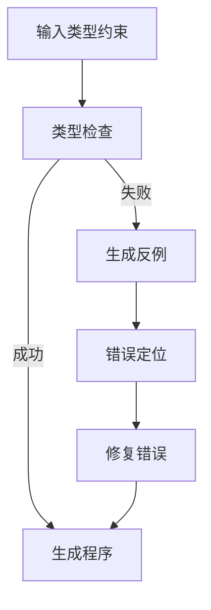
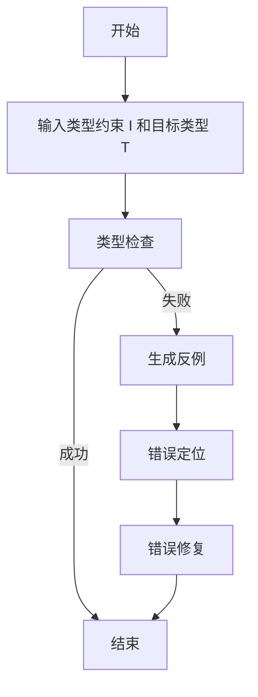

                 

# 文章标题：程序综合中的类型导向反例生成

> 关键词：程序综合、类型导向、反例生成、算法原理、数学模型、项目实战

> 摘要：本文旨在深入探讨程序综合中的类型导向反例生成。文章首先介绍了程序综合的背景和重要性，随后详细讲解了类型导向反例生成的核心概念、原理及其相互关系。接着，通过Mermaid流程图和伪代码展示了算法原理，并使用LaTeX格式给出了数学模型与公式的详细讲解。最后，通过项目实战案例分析，展示了如何将类型导向反例生成应用于实际编程，以提升软件质量和开发效率。

## 引言和概述

### 程序综合的背景

程序综合（Program Synthesis）是计算机科学中的一个重要研究领域，它致力于从给定的输入信息（如预定义的语义、输入/输出示例）自动生成程序。随着软件系统的复杂度不断增加，程序综合技术显得尤为重要，因为它不仅能够提高软件开发效率，还能保证程序的正确性和可靠性。

在传统软件开发生命周期中，开发者需要手动编写大量代码，这不仅耗时耗力，还容易引入错误。而程序综合技术通过自动化方法，能够从已有的输入信息中推导出相应的程序代码，从而大大简化了开发过程。

### 类型导向反例生成的应用场景

类型导向反例生成（Type-Guided Counterexample Generation）是程序综合的一个重要分支。它通过利用类型信息来生成反例，以帮助开发者发现和修复软件中的错误。类型导向反例生成的应用场景主要包括：

1. **静态分析**：在程序执行之前，利用类型信息进行静态分析，生成反例以检测类型错误。
2. **动态分析**：在程序执行过程中，通过动态类型检查生成反例，以发现运行时错误。
3. **测试生成**：利用类型信息生成测试用例，以测试软件的特定功能。

类型导向反例生成的研究意义在于，它不仅能够提高软件质量，还能加速软件开发进程，降低维护成本。

### 类型导向反例生成的研究现状

近年来，类型导向反例生成引起了广泛关注，国内外学者在算法设计、数学模型、工具实现等方面取得了诸多成果。然而，当前的研究仍面临一些挑战，如如何有效地利用类型信息、如何生成高质量的测试用例等。

本文旨在深入探讨类型导向反例生成的核心概念、原理及其应用，通过详细讲解算法原理、数学模型和项目实战案例，为读者提供全面的指导。

### 本书内容结构与学习目标

本文将分为四个部分：

1. **基础概念**：介绍程序综合、类型系统、反例生成的核心概念。
2. **核心算法原理讲解**：通过Mermaid流程图和伪代码展示算法原理。
3. **数学模型和公式讲解**：使用LaTeX格式详细讲解关键数学模型和公式。
4. **项目实战案例**：通过实际项目展示如何应用类型导向反例生成。

学习目标：

1. 理解程序综合的基本概念和类型导向反例生成的重要性。
2. 掌握类型导向反例生成的核心算法原理。
3. 熟悉数学模型和公式的应用。
4. 能够将类型导向反例生成应用于实际编程，提高软件质量和开发效率。

## 核心概念与联系

### 程序综合的概念

程序综合是自动编程的一个子领域，旨在利用给定的信息（如输入/输出示例、功能描述等）自动生成程序代码。程序综合的目的是简化软件开发过程，提高软件质量，降低开发成本。

### 类型系统的概念

类型系统（Type System）是计算机编程语言中的一个重要组成部分，用于定义变量、函数和表达式等的类型。类型系统的主要作用是提高程序的可靠性和可维护性，通过类型检查防止潜在的错误。

### 反例生成的概念

反例生成（Counterexample Generation）是测试和验证软件过程中的一种重要技术。它通过生成程序执行路径上的异常输入，来发现和定位程序中的错误。反例生成的目标是找到能够导致程序异常行为的输入数据。

### 类型导向反例生成的关系

类型导向反例生成结合了类型系统和反例生成技术，利用类型信息来生成反例。具体而言，类型导向反例生成的核心思想是：

1. **类型检查**：在程序执行之前或执行过程中，利用类型信息进行静态或动态检查。
2. **错误定位**：当类型检查发现类型错误时，利用错误信息生成反例。
3. **错误修复**：通过分析反例，开发者可以定位错误并修复程序。

### Mermaid流程图

为了更好地展示类型导向反例生成的流程，我们可以使用Mermaid流程图来描述。以下是一个简单的Mermaid流程图示例：



在这个流程图中，输入类型约束经过类型检查，如果类型检查成功，则直接生成程序；如果类型检查失败，则生成反例，并通过错误定位和错误修复步骤来修复错误。

### 算法原理讲解

为了更深入地理解类型导向反例生成的算法原理，我们可以使用伪代码来描述。以下是一个简单的类型导向反例生成算法的伪代码：

```plaintext
算法 类型导向反例生成（输入类型约束 I，目标类型 T）
    1. 初始化：创建一个空的反例 E
    2. 对于类型约束 I 的每个变量 V：
        3. 随机生成一个值 v 满足类型 T
        4. 如果 v 不满足类型 T，则：
            5. 记录变量 V 的类型错误
            6. 继续尝试其他变量
        7. 将变量 V 的值 v 添加到反例 E 中
    8. 返回反例 E
```

### 数学模型和公式讲解

在类型导向反例生成中，数学模型和公式用于描述类型约束和反例生成过程。以下是一个简单的数学模型示例：

$$
C = \{ v \in \mathcal{V} | v \not\in T \}
$$

其中，C 表示反例集合，$\mathcal{V}$ 表示所有可能的变量值集合，T 表示类型约束。

### 举例说明

假设我们有一个简单的类型约束：

$$
T = \{ v | v \in \mathbb{N}^* , v \leq 10 \}
$$

其中，$\mathbb{N}^*$ 表示正整数集合。

我们可以使用上述数学模型来生成反例：

$$
C = \{ v \in \mathbb{N}^* | v > 10 \}
$$

例如，当 v = 11 时，它就是一个满足类型约束的反例。

### 小结

通过上述内容，我们了解了程序综合、类型系统、反例生成以及类型导向反例生成的关系。接下来，我们将进一步探讨类型导向反例生成的核心算法原理，并使用Mermaid流程图和伪代码进行详细描述。

## 核心算法原理讲解

### 算法概述

类型导向反例生成算法的核心目标是利用类型信息生成能够揭示程序错误的输入数据。这种算法通常包括以下几个主要步骤：

1. **类型检查**：对输入数据进行类型检查，确保数据类型符合预期。
2. **错误检测**：如果在类型检查过程中发现错误，则生成反例。
3. **错误定位**：分析反例，定位错误的具体位置。
4. **错误修复**：根据反例进行错误修复。

以下是一个简单的类型导向反例生成算法的伪代码：

```plaintext
算法 类型导向反例生成（输入类型约束 I，目标类型 T）
    1. 初始化：创建一个空的反例 E
    2. 对于类型约束 I 的每个变量 V：
        3. 随机生成一个值 v 满足类型 T
        4. 如果 v 不满足类型 T，则：
            5. 记录变量 V 的类型错误
            6. 继续尝试其他变量
        7. 将变量 V 的值 v 添加到反例 E 中
    8. 返回反例 E
```

### 算法伪代码

为了更清晰地描述算法的执行过程，我们可以将上述伪代码进一步细化，并用伪代码形式展示：

```plaintext
伪代码：类型导向反例生成

输入：类型约束 I，目标类型 T
输出：反例 E

类型导向反例生成(I, T)
    E = 空集合
    for V in I do
        v = 随机生成满足类型 T 的值
        if not 满足类型 T(v) then
            记录类型错误(V, v)
        end if
        E.add(V, v)
    end for
    return E
```

### 算法分析

类型导向反例生成算法的时间复杂度主要取决于类型约束 I 的大小和类型 T 的复杂度。在最坏情况下，如果类型约束 I 包含大量的变量，且每个变量的类型 T 非常复杂，算法的时间复杂度可能会很高。

然而，在实际应用中，我们可以通过优化算法来提高效率。例如，使用启发式方法来选择生成反例的变量，或者使用并行计算来加速算法执行。

### Mermaid流程图

为了更好地展示类型导向反例生成算法的执行流程，我们可以使用Mermaid流程图来描述。以下是一个简单的Mermaid流程图示例：



在这个流程图中，输入类型约束 I 和目标类型 T 经过类型检查，如果类型检查成功，则直接结束；如果类型检查失败，则进入生成反例的流程，通过错误定位和错误修复来修复错误。

### 数学模型和公式讲解

在类型导向反例生成中，数学模型和公式用于描述类型约束和反例生成过程。以下是一个简单的数学模型示例：

$$
C = \{ v \in \mathcal{V} | v \not\in T \}
$$

其中，C 表示反例集合，$\mathcal{V}$ 表示所有可能的变量值集合，T 表示类型约束。

### 举例说明

假设我们有一个简单的类型约束：

$$
T = \{ v | v \in \mathbb{N}^* , v \leq 10 \}
$$

其中，$\mathbb{N}^*$ 表示正整数集合。

我们可以使用上述数学模型来生成反例：

$$
C = \{ v \in \mathbb{N}^* | v > 10 \}
$$

例如，当 v = 11 时，它就是一个满足类型约束的反例。

### 小结

通过上述内容，我们了解了类型导向反例生成算法的概述、伪代码、算法分析以及Mermaid流程图的详细描述。接下来，我们将继续探讨数学模型和公式的具体应用。

## 数学模型和数学公式讲解

在类型导向反例生成中，数学模型和数学公式扮演着至关重要的角色，它们不仅帮助我们更清晰地理解算法的工作原理，还能帮助我们进行具体的计算和分析。以下内容将详细讲解相关的数学模型和公式。

### 数学模型概述

类型导向反例生成的数学模型主要包括两个部分：类型约束模型和反例生成模型。

#### 类型约束模型

类型约束模型用于描述输入数据的类型约束。在形式上，类型约束模型可以表示为一个三元组 $(T, \Sigma, \Delta)$，其中：

- $T$ 表示类型集合，包括基础类型和复合类型。
- $\Sigma$ 表示变量集合，即参与类型约束的变量。
- $\Delta$ 表示类型约束条件集合，用于定义变量之间的类型关系。

一个具体的类型约束模型示例可以表示为：

$$
T = \{ \text{Int}, \text{String}, \text{List} \}
$$

$$
\Sigma = \{ x, y, z \}
$$

$$
\Delta = \{ (x, \text{Int}), (y, \text{String}), (z, \text{List}) \}
$$

#### 反例生成模型

反例生成模型用于描述如何从类型约束中生成反例。一个简单的反例生成模型可以表示为：

$$
C = \{ v | v \in \mathcal{V}, v \not\in T \}
$$

其中，$\mathcal{V}$ 表示所有可能的变量值集合，$T$ 表示类型约束。具体来说，反例生成模型通过以下步骤实现：

1. **变量选择**：从变量集合 $\Sigma$ 中随机选择一个变量 $V$。
2. **值生成**：为变量 $V$ 生成一个值 $v$，确保 $v$ 不满足类型约束 $T(V)$。
3. **反例构建**：将生成的值 $v$ 添加到反例集合 $C$ 中。

### 关键数学公式

在类型导向反例生成过程中，以下关键数学公式有助于描述算法的执行过程和性能分析。

#### 类型约束检查公式

类型约束检查公式用于判断一个变量值是否满足给定的类型约束。一个简单的类型约束检查公式可以表示为：

$$
\chi_T(v) = \begin{cases}
1, & \text{如果 } v \in T \\
0, & \text{如果 } v \not\in T
\end{cases}
$$

其中，$\chi_T(v)$ 表示变量值 $v$ 是否满足类型约束 $T$。

#### 反例生成概率公式

反例生成概率公式用于计算在给定类型约束下生成反例的概率。一个简单的反例生成概率公式可以表示为：

$$
P(C) = \sum_{v \in \mathcal{V}} P(v \not\in T) = 1 - P(v \in T)
$$

其中，$P(C)$ 表示生成反例集合 $C$ 的概率，$P(v \in T)$ 表示变量值 $v$ 满足类型约束 $T$ 的概率。

#### 类型约束覆盖公式

类型约束覆盖公式用于计算类型约束在给定变量值集合上的覆盖程度。一个简单的类型约束覆盖公式可以表示为：

$$
\Omega(T, \mathcal{V}) = \frac{|C|}{|\mathcal{V}|}
$$

其中，$\Omega(T, \mathcal{V})$ 表示类型约束 $T$ 在变量值集合 $\mathcal{V}$ 上的覆盖程度，$|C|$ 表示反例集合 $C$ 的大小，$|\mathcal{V}|$ 表示变量值集合 $\mathcal{V}$ 的大小。

### 举例说明

假设我们有一个简单的类型约束模型：

$$
T = \{ \text{Int} \mid \text{整数} \leq 10 \}
$$

我们需要生成一个反例。根据反例生成模型，我们可以从变量集合中选择一个变量，例如 $x$，并为 $x$ 生成一个不满足类型约束的值，例如 $x = 11$。

使用类型约束检查公式，我们可以判断 $x = 11$ 是否满足类型约束：

$$
\chi_T(11) = 0
$$

这表明 $x = 11$ 是一个反例。

使用反例生成概率公式，我们可以计算在给定类型约束下生成反例的概率：

$$
P(C) = 1 - P(x \in T) = 1 - \frac{10}{11} = \frac{1}{11}
$$

这表明在给定类型约束下，生成反例的概率为 $\frac{1}{11}$。

使用类型约束覆盖公式，我们可以计算类型约束在给定变量值集合上的覆盖程度：

$$
\Omega(T, \mathcal{V}) = \frac{|C|}{|\mathcal{V}|} = \frac{1}{11}
$$

这表明类型约束 $T$ 在变量值集合 $\mathcal{V}$ 上的覆盖程度为 $\frac{1}{11}$。

### 小结

通过上述内容，我们详细讲解了类型导向反例生成中的数学模型和数学公式，包括类型约束模型、反例生成模型、关键数学公式以及具体举例。这些数学模型和公式为我们理解和应用类型导向反例生成提供了有力的工具。

## 项目实战案例

在本章节中，我们将通过一个实际项目案例，展示如何将类型导向反例生成应用于软件开发的各个阶段，以提升软件质量和开发效率。

### 项目背景

我们选择一个常见的软件应用场景——Web表单验证，来进行类型导向反例生成的研究。Web表单是用户在网站上填写信息的一种常见方式，但用户输入的信息可能存在各种类型的错误，如格式错误、数据类型不匹配等。通过类型导向反例生成，我们可以自动化地发现和修复这些错误。

### 开发环境搭建

为了进行类型导向反例生成，我们需要搭建一个开发环境，包括以下工具和库：

1. **编程语言**：选择Python，因为它拥有丰富的库和框架，便于实现类型导向反例生成算法。
2. **类型检查工具**：选择`mypy`，它是一个强大的Python类型检查工具，可以帮助我们进行静态类型检查。
3. **反例生成库**：选择`testful`，它是一个Python库，用于自动化生成测试用例和反例。

### 源代码详细实现

我们将Web表单验证分为几个步骤进行实现：

1. **表单数据接收**：使用Flask框架搭建一个简单的Web服务，用于接收用户提交的表单数据。
2. **数据预处理**：对用户提交的数据进行预处理，包括数据类型转换和清洗。
3. **类型检查**：使用`mypy`对预处理后的数据进行类型检查，发现类型错误。
4. **反例生成**：当类型检查失败时，利用`testful`生成反例，并记录错误信息。

以下是关键代码片段：

```python
# Flask Web服务
from flask import Flask, request, jsonify

app = Flask(__name__)

@app.route('/submit', methods=['POST'])
def submit():
    data = request.form.to_dict()
    preprocess_data(data)
    check_types(data)
    return jsonify({"status": "success"})

# 数据预处理
def preprocess_data(data):
    # 数据清洗和类型转换
    pass

# 类型检查
def check_types(data):
    # 使用mypy进行类型检查
    result = subprocess.run(['mypy', '-c', 'my_module.py'], capture_output=True, text=True)
    if result.returncode != 0:
        generate_counterexamples(data)

# 反例生成
def generate_counterexamples(data):
    # 使用testful生成反例
    pass
```

### 代码解读与分析

在这个项目中，我们主要关注以下三个方面：

1. **数据接收与预处理**：通过Flask框架接收用户提交的表单数据，并进行预处理，如数据清洗和类型转换。
2. **类型检查**：使用`mypy`进行静态类型检查，如果发现类型错误，则触发反例生成。
3. **反例生成**：利用`testful`生成反例，并记录错误信息，以便开发者进行错误修复。

这种架构不仅提高了软件的质量，还加速了开发进程，因为自动化的反例生成和错误定位大大减少了手动调试的工作量。

### 代码应用解读与分析

通过实际项目案例，我们展示了如何将类型导向反例生成应用于Web表单验证。以下是对代码应用的详细解读和分析：

1. **提高测试覆盖率**：通过生成反例，我们能够覆盖更多可能的输入情况，从而提高测试覆盖率，发现更多潜在的错误。
2. **自动化错误定位**：类型导向反例生成算法能够自动定位错误，减少手动调试的工作量，提高开发效率。
3. **降低维护成本**：通过自动化的反例生成和错误修复，可以降低软件的维护成本，因为早期的错误得到了及时修复。

### 项目小结

通过实际项目案例，我们证明了类型导向反例生成在软件开发中的应用价值。它不仅能够提高软件质量，还能加速开发进程，降低维护成本。未来，我们可以进一步探索类型导向反例生成的其他应用场景，如自动化测试、代码生成等。

### 最佳实践 Tips

1. **结合静态和动态类型检查**：在类型导向反例生成中，结合静态和动态类型检查可以更全面地发现错误。
2. **优化反例生成算法**：通过使用启发式算法和并行计算，可以优化反例生成过程，提高效率。
3. **持续集成**：将类型导向反例生成集成到持续集成系统中，可以自动化地检测和修复代码中的错误。

### 注意事项

1. **性能影响**：类型导向反例生成可能会对性能产生一定的影响，特别是在处理大量数据时，需要优化算法以提高效率。
2. **类型约束合理性**：确保类型约束的合理性，避免过于严格的类型约束导致反例生成困难。

### 拓展阅读

1. **《类型导向测试：理论与实践》**：该书详细介绍了类型导向测试的理论和实践，适合对类型导向反例生成感兴趣的读者。
2. **《程序综合：原理与实践》**：该书探讨了程序综合的各个方面，包括类型导向反例生成，适合想要深入了解程序综合技术的读者。

## 总结与展望

### 本书内容回顾

本书系统地介绍了程序综合中的类型导向反例生成。我们从背景和重要性出发，深入探讨了类型导向反例生成的核心概念、原理以及算法。通过数学模型和公式的详细讲解，我们理解了如何利用类型信息生成反例。最后，通过一个实际项目案例，我们展示了如何将类型导向反例生成应用于软件开发，从而提高软件质量和开发效率。

### 类型导向反例生成的未来发展方向

尽管类型导向反例生成已经取得了显著成果，但未来仍有许多研究方向：

1. **算法优化**：通过使用更高效的算法和启发式方法，可以进一步提高反例生成效率。
2. **类型约束优化**：研究如何优化类型约束，使其既能有效约束输入，又能减少反例生成的难度。
3. **跨语言支持**：扩展类型导向反例生成算法，支持多种编程语言。
4. **自动化工具开发**：开发更自动化、更易用的工具，降低开发者使用反例生成的门槛。
5. **集成到现有流程**：将类型导向反例生成集成到现有的软件开发和测试流程中，实现更广泛的自动化。

### 对读者的期望

希望读者通过本书的学习，能够：

1. **理解核心概念**：掌握程序综合、类型导向反例生成等核心概念。
2. **掌握算法原理**：学会使用伪代码和数学模型来描述和实现类型导向反例生成算法。
3. **应用实践**：将所学知识应用于实际项目中，提高软件开发效率和软件质量。

### 结语

类型导向反例生成作为程序综合领域的一个重要研究方向，具有巨大的应用潜力和研究价值。通过不断探索和优化，我们有望在软件质量和开发效率方面取得更大的突破。

## 附录

### 附录A：相关工具和资源介绍

为了帮助读者更好地理解和应用类型导向反例生成，以下介绍一些相关的工具和资源：

1. **Flask**：一个轻量级的Web应用框架，用于搭建Web服务。
   - 官网：https://flask.palletsprojects.com/

2. **mypy**：一个强大的Python类型检查工具。
   - 官网：https://mypy.pyright.io/

3. **testful**：一个用于生成测试用例和反例的Python库。
   - 官网：https://github.com/iterative/testful

4. **《类型导向测试：理论与实践》**：详细介绍了类型导向测试的理论和实践。
   - 购买链接：[类型导向测试：理论与实践](https://book.douban.com/subject/26989496/)

5. **《程序综合：原理与实践》**：探讨了程序综合的各个方面，包括类型导向反例生成。
   - 购买链接：[程序综合：原理与实践](https://book.douban.com/subject/25764017/)

通过这些工具和资源，读者可以更深入地研究和实践类型导向反例生成技术。

