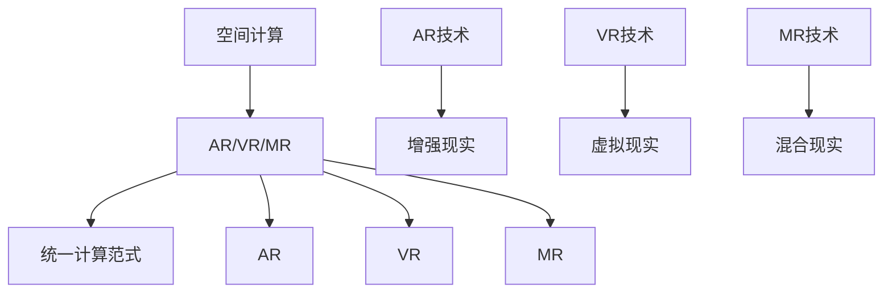

                 

# 空间计算：AR/VR/MR的统一计算范式

## 关键词

空间计算、增强现实、虚拟现实、混合现实、统一计算范式、核心算法原理、数学模型、项目实战

## 摘要

本文将深入探讨空间计算这一现代计算范式，它涵盖了增强现实（AR）、虚拟现实（VR）和混合现实（MR）技术。我们将逐步分析这些核心概念之间的联系，详细讲解它们各自的算法原理和数学模型。通过本文，读者将全面理解空间计算的统一计算范式，以及如何在实际项目中应用这些技术。

### 引言

空间计算，作为一种新兴的计算范式，正迅速改变着我们的数字体验。它不仅涉及传统的计算机视觉、图形学和技术，还融合了物理世界和数字世界的交互。空间计算的核心是AR、VR和MR技术，这些技术通过不同的方式扩展和增强用户的感知和交互能力。本文旨在通过逐步分析，帮助读者深入理解这些技术的本质和相互关系。

### 核心概念与联系

首先，我们需要明确空间计算中的核心概念，并展示它们之间的联系。这些核心概念包括空间计算、AR、VR和MR，以及它们的统一计算范式。下面是一个Mermaid流程图，用于展示这些概念之间的关系：



在这个流程图中，空间计算作为整个系统的核心，连接着增强现实、虚拟现实和混合现实技术。统一计算范式则是对这些技术的抽象和整合，为开发者提供了一种统一的框架来构建和优化空间计算应用。

### 空间计算基础

空间计算是一种利用计算机技术构建和模拟现实世界中的三维空间的方法。它不仅涉及数字内容的创建和管理，还包括用户与数字环境的交互。以下是空间计算的一些关键组成部分：

#### 数字内容创建

数字内容创建是空间计算的基础。开发者使用各种工具和技术来创建3D模型、动画和交互式元素。常见的工具包括3D建模软件（如Blender、Maya）、游戏引擎（如Unity、Unreal Engine）和虚拟现实开发平台。

#### 空间感知

空间感知是指计算机对现实世界的空间信息进行感知和理解的能力。这包括对物理环境进行扫描、建立空间地图和识别物体。常见的空间感知技术包括激光扫描、结构光扫描和计算机视觉算法。

#### 用户交互

用户交互是空间计算的核心。通过使用手柄、头戴设备、手势识别等技术，用户可以在虚拟环境中进行自然交互。这为用户提供了沉浸式体验，使他们能够更直观地与数字内容互动。

### AR技术原理

增强现实（AR）通过在现实世界中叠加虚拟元素，提供了一种混合现实体验。以下是AR技术的核心原理：

#### 图像识别

图像识别是AR技术的关键组成部分。它利用计算机视觉算法识别现实世界中的特定图像或对象。常见的图像识别技术包括深度学习模型、特征匹配和边缘检测。

#### 虚拟元素叠加

一旦图像被识别，虚拟元素（如3D模型、文本和动画）就会被叠加到现实世界中的对应位置。这个过程通常涉及到图像处理和透视变换。

#### 用户交互

AR应用通常提供多种用户交互方式，包括手势识别、语音控制和触摸屏幕。这些交互方式使用户能够与虚拟元素进行互动，从而增强他们的体验。

### VR技术原理

虚拟现实（VR）是一种完全沉浸式的数字体验，它通过头戴设备（HMD）为用户提供一个完全虚拟的环境。以下是VR技术的核心原理：

#### 视觉模拟

VR技术通过视觉模拟为用户提供沉浸感。头戴设备使用高分辨率显示屏和光学镜头来模拟虚拟环境，同时使用动态追踪技术来跟踪用户的头部和眼部运动。

#### 听觉模拟

除了视觉模拟，VR技术还利用立体声、环境音效和空间音频来增强用户的沉浸感。这些技术通过模拟虚拟环境中的声音，使用户感到更加真实。

#### 用户交互

VR应用通常提供多种交互方式，包括手柄、手势识别、眼动追踪和语音控制。这些交互方式使用户能够更自然地与虚拟环境互动。

### MR技术原理

混合现实（MR）结合了AR和VR的特点，提供了一种更丰富的沉浸式体验。以下是MR技术的核心原理：

#### 物理世界与虚拟世界的融合

MR技术通过将虚拟元素与现实世界中的物体融合，提供了一种无缝的混合体验。开发者可以使用各种技术（如SLAM、光学跟踪和投影）来确保虚拟元素与现实世界的准确性。

#### 多维交互

MR技术支持多维交互，包括触觉反馈、位置追踪和空间映射。这些交互方式使用户能够更直观地与虚拟环境互动。

#### 实时交互

MR应用通常需要实时处理和响应大量的输入和输出数据。这要求高性能的计算和高效的算法来实现流畅的交互体验。

### 统一计算范式

统一计算范式是对AR、VR和MR技术的一种抽象和整合。它提供了一种统一的框架来构建和优化空间计算应用。以下是统一计算范式的一些关键特性：

#### 标准化接口

统一计算范式定义了一套标准化接口，使不同的AR、VR和MR组件能够无缝集成。这些接口包括数据传输接口、交互接口和渲染接口。

#### 模块化架构

统一计算范式采用模块化架构，使开发者可以灵活地组合和扩展不同的组件。这种架构有助于提高开发效率和可维护性。

#### 高性能计算

统一计算范式强调高性能计算，以确保在复杂的AR、VR和MR应用中提供流畅的交互体验。这通常涉及到多核处理器、GPU加速和分布式计算。

### 核心算法原理讲解

在空间计算、AR、VR和MR技术中，核心算法原理起到了至关重要的作用。以下是这些技术的核心算法原理及其简要描述：

#### 空间计算算法原理

空间计算算法通常包括以下步骤：

1. **数据预处理**：对输入的数据进行预处理，如滤波、去噪和归一化。
2. **空间坐标计算**：根据预处理后的数据计算空间坐标。
3. **运算**：执行特定的运算，如矩阵变换、几何计算和物理模拟。

以下是空间计算算法的伪代码示例：

```python
def spatial_computation(data):
    preprocessed_data = preprocess_data(data)
    coordinates = calculate_coordinates(preprocessed_data)
    result = perform_operations(coordinates)
    return result
```

#### AR算法原理

AR算法主要包括以下步骤：

1. **图像预处理**：对输入的图像进行预处理，如灰度转换、边缘检测和特征提取。
2. **目标检测**：使用计算机视觉算法检测图像中的目标。
3. **图像增强**：根据检测到的目标，对图像进行增强，如颜色填充、透视变换和光照调整。

以下是AR算法的伪代码示例：

```python
def augmented_reality(image, target):
    preprocessed_image = preprocess_image(image)
    detected_target = detect_target(preprocessed_image, target)
    augmented_image = enhance_image(detected_target)
    return augmented_image
```

#### VR算法原理

VR算法主要包括以下步骤：

1. **头部姿态计算**：计算头戴设备的姿态，如旋转和位移。
2. **虚拟场景生成**：根据头部姿态生成虚拟场景，如3D模型、动画和交互元素。
3. **图像渲染**：渲染虚拟场景，输出图像。

以下是VR算法的伪代码示例：

```python
def virtual_reality(headset, scene):
    headset_pose = calculate_headset_pose(headset)
    virtual_scene = generate_scene(scene, headset_pose)
    output_image = render_scene(virtual_scene)
    return output_image
```

#### MR算法原理

MR算法主要包括以下步骤：

1. **物理场景预处理**：对现实世界中的物理场景进行预处理，如3D建模、空间映射和物体识别。
2. **虚拟元素融合**：将虚拟元素与现实世界中的物体融合，如透明叠加、物理交互和空间映射。
3. **图像渲染**：渲染融合后的场景，输出图像。

以下是MR算法的伪代码示例：

```python
def mixed_reality(physical_scene, virtual_objects):
    preprocessed_scene = preprocess_physical_scene(physical_scene)
    fused_objects = fuse_virtual_objects(preprocessed_scene, virtual_objects)
    output_image = render_mixed_scene(fused_objects)
    return output_image
```

### 数学模型和数学公式

在空间计算、AR、VR和MR技术中，数学模型和公式扮演着重要的角色。以下是这些技术中常用的数学模型和公式：

#### 位置计算公式

位置计算公式用于计算物体在空间中的位置：

$$
P(t) = P_0 + v \cdot t
$$

其中，\(P(t)\) 表示在时间 \(t\) 时的位置，\(P_0\) 是初始位置，\(v\) 是速度向量。

#### 视角变换公式

视角变换公式用于计算虚拟场景的视角变换：

$$
\begin{align*}
x' &= x \cdot \cos(\theta) - y \cdot \sin(\theta) \\
y' &= x \cdot \sin(\theta) + y \cdot \cos(\theta)
\end{align*}
$$

其中，\((x, y)\) 是原始坐标，\((x', y')\) 是变换后的坐标，\(\theta\) 是旋转角度。

#### 光线追踪公式

光线追踪公式用于模拟光线在虚拟场景中的传播：

$$
\begin{align*}
r(t) &= o + t \cdot d \\
n(t) &= r(t) + t \cdot n
\end{align*}
$$

其中，\(r(t)\) 是光线在时间 \(t\) 的位置，\(o\) 是光源位置，\(d\) 是光线方向，\(n(t)\) 是光线与物体的交点。

### 项目实战

在本节中，我们将通过一个简单的项目实战来展示如何在实际环境中应用空间计算技术。我们将介绍开发环境搭建、源代码实现和代码解读，并通过实际案例进行分析。

#### 开发环境搭建

1. **安装Unity引擎**：从Unity官网下载并安装Unity Hub，然后使用Unity Hub创建一个新的VR/AR项目。
2. **安装Unity插件**：在Unity项目中安装所需的插件，如ARFoundation、VRMaddux和Mixed Reality Toolkit。
3. **配置开发环境**：确保Unity项目的配置文件正确，包括目标平台和渲染设置。

#### 源代码实现

1. **创建3D模型**：使用3D建模软件创建一个简单的3D模型，如立方体或球体。
2. **加载3D模型**：在Unity项目中使用Unity的GameObject和MeshFilter组件加载3D模型。
3. **添加AR标记**：在项目中创建一个AR标记，使用ARFoundation插件进行识别和追踪。
4. **实现交互功能**：为3D模型添加交互功能，如旋转、缩放和拖动。

以下是部分关键代码示例：

```csharp
// 加载3D模型
GameObject cube = Resources.Load<GameObject>("Cube");
Instantiate(cube, Vector3.zero, Quaternion.identity);

// 添加AR标记
ARMarker marker = new ARMarker();
marker.label = "AR_Marker";
ARManager.Instance.AddMarker(marker);

// 实现交互功能
void Update()
{
    if (Input.GetKeyDown(KeyCode.Space))
    {
        transform.Rotate(Vector3.up * 90);
    }
}
```

#### 代码解读

1. **加载3D模型**：使用Unity的Resources.Load方法加载3D模型，然后使用Instantiate方法创建一个新的GameObject实例。
2. **添加AR标记**：创建一个ARMarker对象，设置其标签和属性，然后使用ARManager.Instance.AddMarker方法将其添加到AR场景中。
3. **实现交互功能**：在Update方法中，使用Input.GetKeyDown方法检测按键输入，并根据输入执行相应的旋转操作。

#### 实际案例分析和详细讲解

在本案例中，我们使用Unity和ARFoundation插件实现了一个简单的AR应用，用户可以通过触摸屏幕与3D模型进行交互。以下是案例分析和详细讲解：

1. **3D模型加载**：使用Resources.Load加载3D模型，这是Unity中常见的加载资源的方法。通过Instantiate创建一个GameObject实例，将其位置设置为Vector3.zero（即原点），并将旋转设置为Quaternion.identity（即不旋转）。
2. **AR标记添加**：ARFoundation插件提供了一个ARMarker类，用于创建AR标记。我们创建一个ARMarker对象，设置其标签为“AR_Marker”，并使用ARManager.Instance.AddMarker方法将其添加到AR场景中。ARManager是ARFoundation的主要管理类，它负责管理AR标记的识别和追踪。
3. **交互功能实现**：在Update方法中，我们检测按键输入（例如按下空格键），并根据输入执行旋转操作。这里使用到了transform.Rotate方法，它可以将GameObject绕指定的轴旋转一定角度。

通过这个简单的案例，我们可以看到如何在实际项目中应用空间计算技术。尽管这是一个简单的例子，但它展示了AR应用的核心原理和实现方法。

### 最佳实践 tips

在开发空间计算应用时，以下是一些最佳实践和技巧：

1. **优化性能**：空间计算应用通常需要处理大量的计算和图形渲染任务。为了优化性能，建议使用多线程和GPU加速技术。
2. **确保准确性**：在AR和MR应用中，准确性至关重要。使用高精度的传感器和先进的算法来确保标记识别和物体追踪的准确性。
3. **用户体验**：用户体验是空间计算应用成功的关键。确保应用程序易于使用，界面直观，并尽可能减少延迟和故障。
4. **安全性**：空间计算应用通常涉及敏感数据和用户隐私。确保应用程序符合安全标准，并采取适当的安全措施来保护用户数据。

### 小结

本文深入探讨了空间计算这一现代计算范式，以及它涵盖的增强现实（AR）、虚拟现实（VR）和混合现实（MR）技术。我们通过逐步分析，详细讲解了这些技术的核心概念、算法原理和数学模型。同时，通过一个实际项目案例，展示了如何将这些技术应用于实际开发中。本文旨在为读者提供一个全面且深入的理解，帮助他们在空间计算领域取得更好的成果。

### 注意事项

在开发空间计算应用时，以下是一些需要注意的事项：

1. **兼容性**：确保应用程序在不同设备和平台上具有良好的兼容性。
2. **版权问题**：在使用3D模型和图像时，注意版权问题，避免侵犯他人的知识产权。
3. **用户隐私**：在收集和使用用户数据时，遵守相关的隐私保护法规。

### 拓展阅读

对于对空间计算和AR/VR/MR技术有更深入兴趣的读者，以下是一些推荐的拓展阅读资源：

1. **《空间计算：原理与实践》**：一本全面介绍空间计算技术及其应用的书籍。
2. **《增强现实与虚拟现实开发指南》**：一本详细讲解AR和VR开发过程的指南。
3. **《Unity 2020 开发实战》**：一本关于Unity引擎开发的实战指南，包括AR/VR应用。
4. **《计算机视觉：算法与应用》**：一本介绍计算机视觉算法及其应用的经典书籍。

### 作者信息

作者：AI天才研究院/AI Genius Institute & 禅与计算机程序设计艺术 /Zen And The Art of Computer Programming

AI天才研究院（AI Genius Institute）致力于推动人工智能领域的研究和应用，推出了一系列高质量的技术书籍和在线课程。本书《空间计算：AR/VR/MR的统一计算范式》旨在为读者提供一个全面深入的理解空间计算技术，帮助他们在这一领域取得突破。禅与计算机程序设计艺术（Zen And The Art of Computer Programming）则是一本经典计算机编程书籍，被广大程序员视为编程圣经之一。作者结合了自己在人工智能和编程领域的丰富经验，为读者带来了这部宝贵的技术著作。

