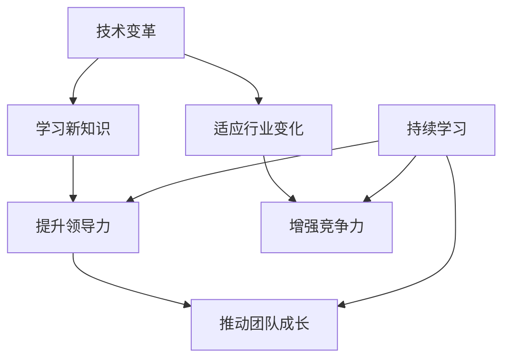
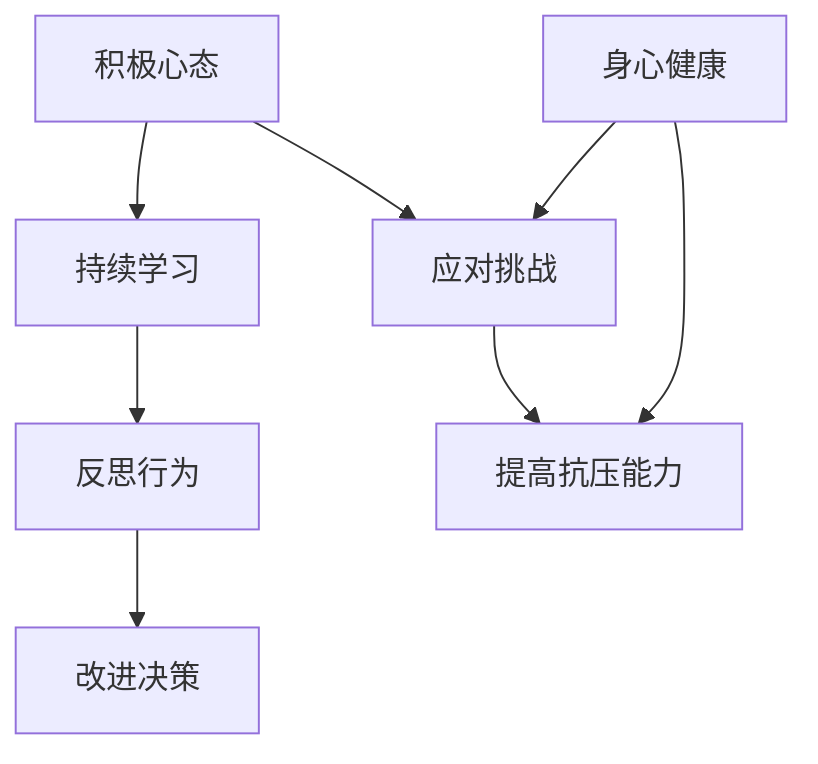
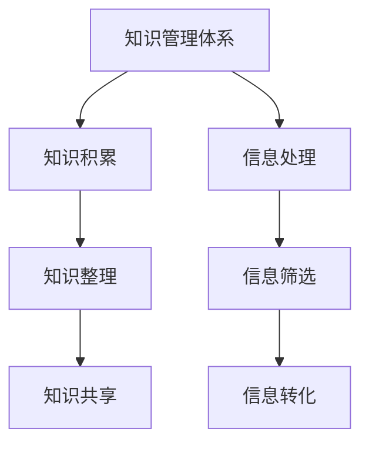
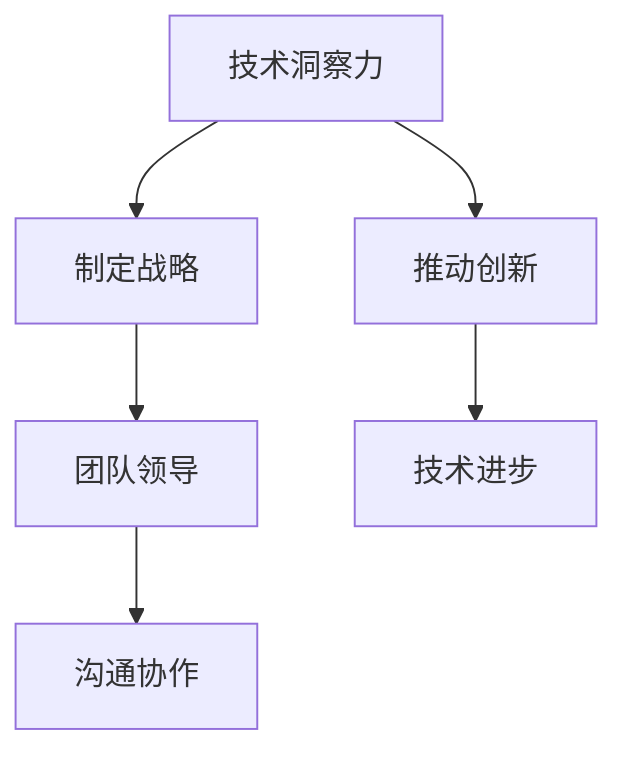
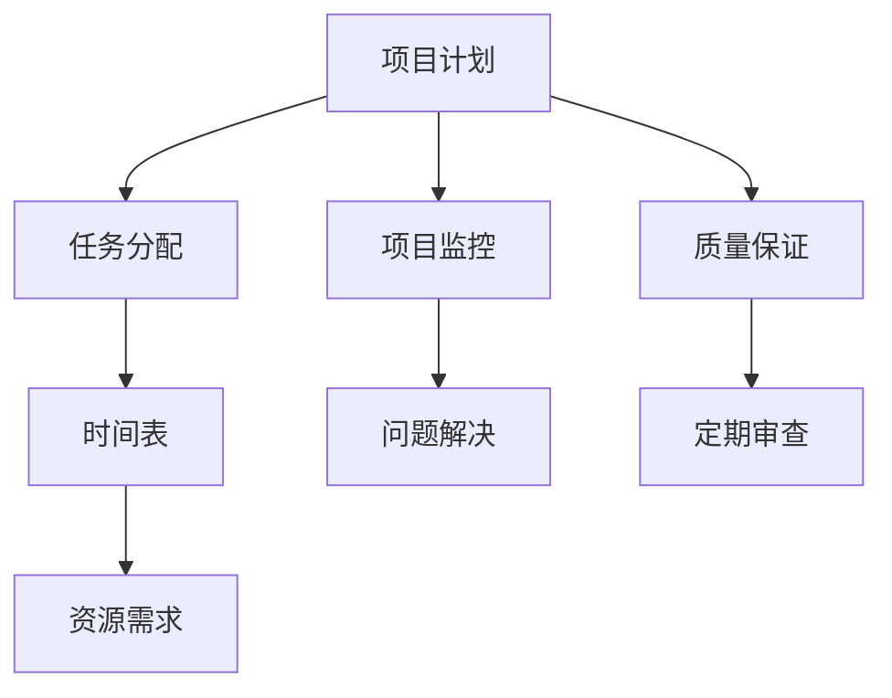
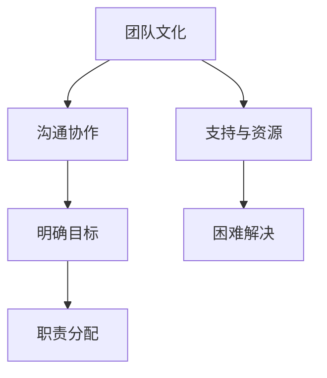
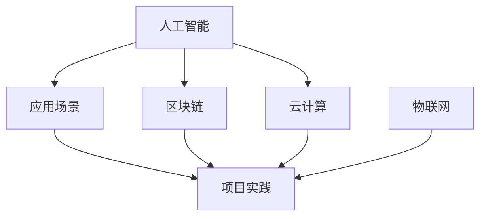
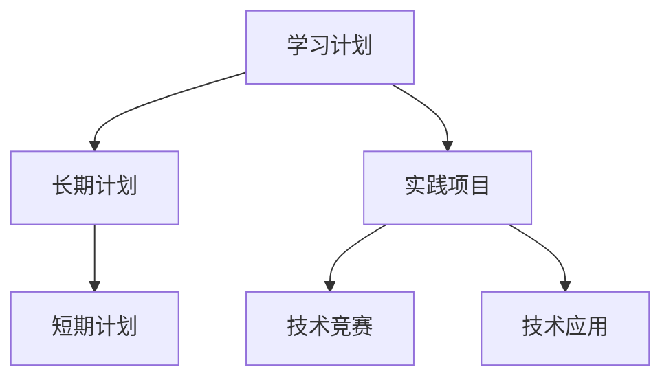
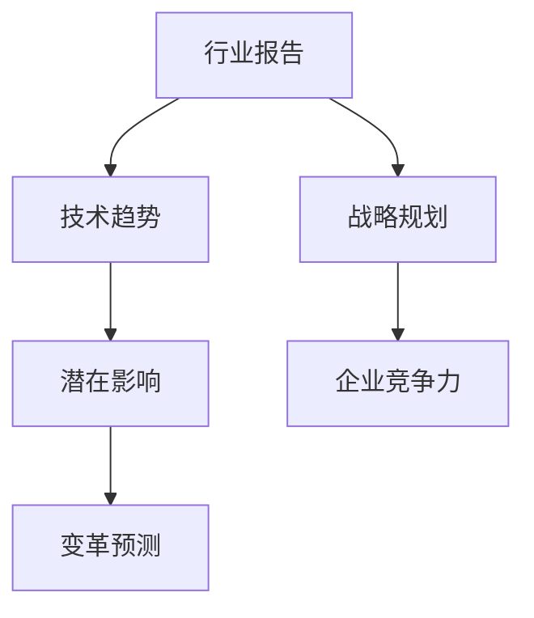

                 

### 文章标题

《突破团队天花板：技术主管的自我提升》

关键词：技术主管、自我提升、团队管理、技能提升、技术趋势

摘要：本文旨在探讨技术主管在快速发展的科技行业中如何通过自我提升来突破团队天花板，实现个人和团队的双重成长。文章从自我提升的重要性、个人成长与心态调整、知识管理与信息处理、技术主管的角色与责任、项目管理、团队建设与协作、技术趋势与技能提升等多个方面进行了深入分析和详细讲解，旨在为技术主管提供一套系统化的自我提升策略。同时，文章还通过具体案例和实践指南，帮助技术主管在实际工作中应用所学知识，提升领导力和管理能力，从而推动团队和个人的共同发展。

---

### 第一部分：自我提升的基础

#### 第1章：自我提升的重要性

在快速变化的科技行业，技术主管的自我提升显得尤为重要。首先，自我提升是适应技术变革的关键。随着人工智能、区块链、云计算等新兴技术的不断涌现，技术主管需要不断学习新知识、新技能，才能跟上行业的发展步伐。其次，自我提升有助于提升领导力。一个优秀的领导者不仅需要具备丰富的技术知识，还需要具备良好的沟通、团队管理、决策等能力。最后，自我提升是推动团队成长的重要动力。技术主管通过自我提升，可以更好地带领团队应对挑战，实现团队的目标。

**核心概念与联系**

以下是一个关于自我提升核心概念的Mermaid流程图，展示了不同因素之间的关联：



**核心算法原理讲解**

在自我提升的过程中，技术主管需要掌握以下核心算法原理：

1. **知识更新算法**：技术主管需要定期更新自己的知识库，以确保掌握最新的技术趋势和知识。这可以通过以下步骤实现：

    ```plaintext
    function 知识更新(当前知识库, 新知识库) {
        for 每个新知识点 in 新知识库 {
            if 当前知识库中没有新知识点 {
                将新知识点添加到当前知识库
            }
        }
        return 当前知识库
    }
    ```

2. **领导力提升算法**：技术主管可以通过以下步骤提升领导力：

    ```plaintext
    function 领导力提升(技术主管, 团队) {
        while 团队成员未达成目标 {
            技术主管分析团队表现
            根据分析结果调整策略
            激励团队成员
            监控团队成员的进度
        }
        return 成功达成目标
    }
    ```

**数学模型和公式**

为了更好地理解自我提升的过程，我们可以使用以下数学模型：

- **学习率**：技术主管的学习率可以表示为：

  $$L = \frac{\text{新知识点数}}{\text{总知识点数}}$$

- **提升率**：技术主管的提升率可以表示为：

  $$R = \frac{\text{领导力得分}}{\text{初始领导力得分}}$$

**详细讲解与举例说明**

例如，如果技术主管初始拥有100个知识点，通过学习新知识，他获得了30个新知识点，那么他的学习率为：

$$L = \frac{30}{100} = 0.3$$

如果他在一年后领导力得分从50提升到70，那么他的提升率为：

$$R = \frac{70}{50} = 1.4$$

这些指标可以帮助技术主管了解自己的进步情况，并制定相应的提升策略。

#### 第2章：个人成长与心态调整

个人成长是技术主管自我提升的重要组成部分。首先，技术主管需要树立正确的心态，保持积极向上的态度。一个积极的心态可以帮助技术主管更好地应对挑战，保持持续的学习动力。其次，技术主管需要不断反思自己的行为和决策，从失败中吸取教训，不断改进。此外，技术主管还应该注重身心健康，保持良好的身体和心理状态，这样才能更好地应对工作中的压力和挑战。

**核心概念与联系**

以下是一个关于个人成长与心态调整的Mermaid流程图，展示了不同因素之间的关联：



**核心算法原理讲解**

在个人成长与心态调整的过程中，技术主管可以采用以下核心算法原理：

1. **心态调整算法**：技术主管可以通过以下步骤调整心态：

    ```plaintext
    function 心态调整(技术主管) {
        while 技术主管心态消极 {
            鼓励技术主管回忆成功经历
            提醒技术主管目标的积极意义
            建议技术主管寻求支持与帮助
        }
        return 心态积极
    }
    ```

2. **自我反思算法**：技术主管可以通过以下步骤进行自我反思：

    ```plaintext
    function 自我反思(技术主管) {
        技术主管记录每天的工作和决策
        每周分析记录，识别成功与失败的原因
        制定改进计划，并执行
    }
    ```

**数学模型和公式**

为了更好地理解个人成长与心态调整的过程，我们可以使用以下数学模型：

- **心态调整率**：技术主管的心态调整率可以表示为：

  $$R_p = \frac{\text{积极心态天数}}{\text{总天数}}$$

- **自我反思率**：技术主管的自我反思率可以表示为：

  $$R_r = \frac{\text{自我反思次数}}{\text{总工作天数}}$$

**详细讲解与举例说明**

例如，如果技术主管在一个季度内有30天保持积极心态，总天数为90天，那么他的心态调整率为：

$$R_p = \frac{30}{90} = 0.33$$

如果他在一个季度内进行了20次自我反思，总工作天数为90天，那么他的自我反思率为：

$$R_r = \frac{20}{90} = 0.22$$

这些指标可以帮助技术主管了解自己的心态调整和自我反思的情况，并制定相应的改进计划。

#### 第3章：知识管理与信息处理

知识管理与信息处理是技术主管自我提升的关键环节。首先，技术主管需要建立一套有效的知识管理体系，确保知识的积累、整理、共享和更新。其次，技术主管需要掌握信息处理的方法和技巧，快速筛选和获取有用的信息，并将其转化为实际的知识和技能。

**核心概念与联系**

以下是一个关于知识管理与信息处理的Mermaid流程图，展示了不同因素之间的关联：



**核心算法原理讲解**

在知识管理与信息处理的过程中，技术主管可以采用以下核心算法原理：

1. **知识积累算法**：技术主管可以通过以下步骤积累知识：

    ```plaintext
    function 知识积累(技术主管) {
        搜集技术文献、书籍、博客等
        参加技术研讨会、培训课程等
        与同行交流、分享经验
    }
    ```

2. **信息筛选算法**：技术主管可以通过以下步骤筛选信息：

    ```plaintext
    function 信息筛选(技术主管, 信息源) {
        根据需求设定筛选条件
        对信息源进行分类
        对每个分类的信息进行评估
        选择最有价值的信息
    }
    ```

**数学模型和公式**

为了更好地理解知识管理与信息处理的过程，我们可以使用以下数学模型：

- **知识积累率**：技术主管的知识积累率可以表示为：

  $$R_k = \frac{\text{新增知识点数}}{\text{总知识点数}}$$

- **信息处理效率**：技术主管的信息处理效率可以表示为：

  $$E_i = \frac{\text{筛选出的有用信息数}}{\text{总信息数}}$$

**详细讲解与举例说明**

例如，如果技术主管在一个季度内新增了100个知识点，总知识点数为500个，那么他的知识积累率为：

$$R_k = \frac{100}{500} = 0.2$$

如果他在一个季度内筛选出了200条有用信息，总信息数为1000条，那么他的信息处理效率为：

$$E_i = \frac{200}{1000} = 0.2$$

这些指标可以帮助技术主管了解自己在知识积累和信息处理方面的表现，并制定相应的改进策略。

### 第二部分：技术主管的角色与责任

#### 第4章：技术领导力

技术领导力是技术主管的核心能力之一。技术领导力不仅体现在技术知识的深度和广度上，还包括领导团队、制定战略、推动创新等方面。首先，技术主管需要具备技术洞察力，能够准确把握技术发展趋势，为团队制定明确的发展方向。其次，技术主管需要具备良好的沟通和协作能力，能够与团队成员、管理层和其他部门有效沟通，确保项目的顺利进行。最后，技术主管需要具备创新精神，鼓励团队尝试新方法、新技术，推动技术进步。

**核心概念与联系**

以下是一个关于技术领导力的Mermaid流程图，展示了不同因素之间的关联：



**核心算法原理讲解**

在技术领导力的培养过程中，技术主管可以采用以下核心算法原理：

1. **技术洞察力提升算法**：技术主管可以通过以下步骤提升技术洞察力：

    ```plaintext
    function 技术洞察力提升(技术主管) {
        深入研究技术趋势报告
        参加技术研讨会和讲座
        与行业专家交流
        关注前沿技术研究
    }
    ```

2. **团队领导能力提升算法**：技术主管可以通过以下步骤提升团队领导能力：

    ```plaintext
    function 团队领导能力提升(技术主管) {
        建立清晰的团队目标
        提供必要的资源和支持
        定期评估团队表现
        鼓励团队成员发展
    }
    ```

**数学模型和公式**

为了更好地理解技术领导力的培养过程，我们可以使用以下数学模型：

- **技术洞察力得分**：技术主管的技术洞察力得分可以表示为：

  $$S_i = \frac{\text{正确预测的技术趋势数}}{\text{总预测数}}$$

- **团队领导能力得分**：技术主管的团队领导能力得分可以表示为：

  $$S_l = \frac{\text{达成团队目标的次数}}{\text{总目标数}}$$

**详细讲解与举例说明**

例如，如果技术主管在一个季度内正确预测了3个技术趋势，总预测数为10个，那么他的技术洞察力得分为：

$$S_i = \frac{3}{10} = 0.3$$

如果他在一个季度内达成了5个团队目标，总目标数为10个，那么他的团队领导能力得分为：

$$S_l = \frac{5}{10} = 0.5$$

这些指标可以帮助技术主管了解自己在技术洞察力和团队领导能力方面的表现，并制定相应的提升计划。

#### 第5章：项目管理

项目管理是技术主管的重要职责之一。有效的项目管理可以确保项目按时完成、在预算范围内，并达到预期的质量。首先，技术主管需要制定详细的项目计划，包括任务分配、时间表、资源需求等。其次，技术主管需要监控项目的进度，及时发现和解决潜在的问题。最后，技术主管需要确保项目交付的质量，通过定期审查和测试来确保项目的稳定性。

**核心概念与联系**

以下是一个关于项目管理的Mermaid流程图，展示了不同因素之间的关联：



**核心算法原理讲解**

在项目管理的实施过程中，技术主管可以采用以下核心算法原理：

1. **项目计划算法**：技术主管可以通过以下步骤制定项目计划：

    ```plaintext
    function 项目计划(技术主管, 项目需求) {
        收集项目需求
        分析项目需求
        制定任务列表
        制定时间表
        分配资源
        生成项目计划文档
    }
    ```

2. **项目监控算法**：技术主管可以通过以下步骤监控项目进度：

    ```plaintext
    function 项目监控(技术主管, 项目计划) {
        定期检查任务进度
        检查资源使用情况
        识别潜在的问题
        制定解决方案
    }
    ```

**数学模型和公式**

为了更好地理解项目管理的实施过程，我们可以使用以下数学模型：

- **项目进度率**：项目进度率可以表示为：

  $$R_p = \frac{\text{已完成任务数}}{\text{总任务数}}$$

- **资源利用率**：资源利用率可以表示为：

  $$R_r = \frac{\text{实际使用资源}}{\text{总需求资源}}$$

**详细讲解与举例说明**

例如，如果技术主管的项目中有10个任务，已完成5个任务，那么他的项目进度率为：

$$R_p = \frac{5}{10} = 0.5$$

如果项目的总资源需求为100个单位，实际使用资源为80个单位，那么他的资源利用率为：

$$R_r = \frac{80}{100} = 0.8$$

这些指标可以帮助技术主管了解项目的进展和资源的利用情况，并制定相应的调整计划。

#### 第6章：团队建设与协作

团队建设与协作是技术主管的重要职责之一。一个高效的团队可以显著提升工作效率和项目质量。首先，技术主管需要建立良好的团队文化，鼓励团队成员之间的沟通和合作。其次，技术主管需要明确团队目标和职责，确保每个成员都清楚自己的工作内容和目标。最后，技术主管需要提供必要的支持和资源，帮助团队成员克服困难，共同实现目标。

**核心概念与联系**

以下是一个关于团队建设与协作的Mermaid流程图，展示了不同因素之间的关联：



**核心算法原理讲解**

在团队建设与协作的过程中，技术主管可以采用以下核心算法原理：

1. **团队文化建设算法**：技术主管可以通过以下步骤建设团队文化：

    ```plaintext
    function 团队文化建设(技术主管) {
        制定团队价值观
        组织团队活动
        鼓励团队沟通
        建立信任关系
    }
    ```

2. **明确目标与职责算法**：技术主管可以通过以下步骤明确团队目标和职责：

    ```plaintext
    function 目标职责明确(技术主管) {
        定义团队目标
        为每个成员分配职责
        确保目标与职责的一致性
        定期评估目标达成情况
    }
    ```

**数学模型和公式**

为了更好地理解团队建设与协作的过程，我们可以使用以下数学模型：

- **团队协作效率**：团队协作效率可以表示为：

  $$E_c = \frac{\text{协作完成任务数}}{\text{总任务数}}$$

- **目标达成率**：目标达成率可以表示为：

  $$R_t = \frac{\text{达成目标数}}{\text{总目标数}}$$

**详细讲解与举例说明**

例如，如果技术主管的团队中有10个任务，通过协作完成了7个任务，那么他的团队协作效率为：

$$E_c = \frac{7}{10} = 0.7$$

如果团队设定了5个目标，实际达成了4个目标，那么他的目标达成率为：

$$R_t = \frac{4}{5} = 0.8$$

这些指标可以帮助技术主管了解团队的协作效率和目标达成情况，并制定相应的改进计划。

### 第三部分：技术趋势与技能提升

#### 第7章：新兴技术趋势

新兴技术不断涌现，技术主管需要紧跟技术趋势，掌握新技术，以保持竞争力。首先，技术主管需要关注人工智能、区块链、云计算等核心技术领域的发展。其次，技术主管需要了解新兴技术的应用场景，如何将其应用到实际项目中。最后，技术主管需要积极参与技术社区，与其他专家交流，不断提升自己的技术视野。

**核心概念与联系**

以下是一个关于新兴技术趋势的Mermaid流程图，展示了不同技术领域之间的关联：



**核心算法原理讲解**

在新兴技术趋势的学习过程中，技术主管可以采用以下核心算法原理：

1. **技术趋势分析算法**：技术主管可以通过以下步骤分析技术趋势：

    ```plaintext
    function 技术趋势分析(技术主管) {
        收集技术趋势报告
        分析技术发展趋势
        预测技术未来发展方向
        制定学习计划
    }
    ```

2. **技术应用算法**：技术主管可以通过以下步骤应用新技术：

    ```plaintext
    function 技术应用(技术主管, 新技术) {
        研究新技术应用场景
        设计技术实施方案
        开展技术实验
        验证技术效果
    }
    ```

**数学模型和公式**

为了更好地理解新兴技术趋势的学习和应用过程，我们可以使用以下数学模型：

- **技术趋势评分**：技术趋势评分可以表示为：

  $$S_t = \frac{\text{当前技术得分}}{\text{初始技术得分}}$$

- **技术应用效率**：技术应用效率可以表示为：

  $$E_a = \frac{\text{成功应用案例数}}{\text{总应用案例数}}$$

**详细讲解与举例说明**

例如，如果技术主管在开始学习新技术时技术得分为50分，经过一段时间的学习和实践，技术得分提升到80分，那么他的技术趋势评分为：

$$S_t = \frac{80}{50} = 1.6$$

如果技术主管在一年内成功应用了3个新技术案例，总应用案例数为5个，那么他的技术应用效率为：

$$E_a = \frac{3}{5} = 0.6$$

这些指标可以帮助技术主管了解自己在新兴技术趋势学习和应用方面的表现，并制定相应的提升计划。

#### 第8章：技能提升策略

技能提升是技术主管自我提升的重要一环。为了实现技能提升，技术主管需要制定具体的提升策略，包括学习计划、实践项目、技术竞赛等。首先，技术主管需要制定长期和短期的学习计划，确保学习目标的实现。其次，技术主管需要积极参与实践项目，将理论知识应用到实际工作中。最后，技术主管可以参加技术竞赛，与其他专家交流，提升自己的技术水平。

**核心概念与联系**

以下是一个关于技能提升策略的Mermaid流程图，展示了不同提升策略之间的关联：



**核心算法原理讲解**

在技能提升策略的实施过程中，技术主管可以采用以下核心算法原理：

1. **学习计划制定算法**：技术主管可以通过以下步骤制定学习计划：

    ```plaintext
    function 学习计划制定(技术主管) {
        确定学习目标
        分解学习目标
        制定学习进度
        制定评估标准
    }
    ```

2. **实践项目规划算法**：技术主管可以通过以下步骤规划实践项目：

    ```plaintext
    function 实践项目规划(技术主管, 学习目标) {
        根据学习目标选择实践项目
        制定项目计划
        分配项目资源
        设定项目评估标准
    }
    ```

**数学模型和公式**

为了更好地理解技能提升策略的实施过程，我们可以使用以下数学模型：

- **学习完成率**：学习完成率可以表示为：

  $$R_l = \frac{\text{已完成学习目标数}}{\text{总学习目标数}}$$

- **项目成功率**：项目成功率可以表示为：

  $$R_p = \frac{\text{成功完成项目数}}{\text{总项目数}}$$

**详细讲解与举例说明**

例如，如果技术主管制定了5个学习目标，实际完成了3个目标，那么他的学习完成率为：

$$R_l = \frac{3}{5} = 0.6$$

如果技术主管参与了3个实践项目，成功完成了2个项目，那么他的项目成功率为：

$$R_p = \frac{2}{3} = 0.67$$

这些指标可以帮助技术主管了解自己在学习计划和项目规划方面的表现，并制定相应的改进计划。

#### 第9章：技术预测与未来展望

随着科技的不断发展，技术主管需要对未来技术趋势进行预测，以便提前做好准备。首先，技术主管需要关注行业研究报告，了解技术发展的趋势和方向。其次，技术主管需要分析新兴技术的潜在影响，预测其对企业、行业和社会的变革。最后，技术主管需要制定长期战略规划，确保企业能够在未来技术发展中保持竞争力。

**核心概念与联系**

以下是一个关于技术预测与未来展望的Mermaid流程图，展示了不同因素之间的关联：



**核心算法原理讲解**

在技术预测与未来展望的过程中，技术主管可以采用以下核心算法原理：

1. **趋势预测算法**：技术主管可以通过以下步骤进行趋势预测：

    ```plaintext
    function 趋势预测(技术主管) {
        收集行业报告和技术文献
        分析历史数据
        预测未来趋势
        制定应对策略
    }
    ```

2. **变革预测算法**：技术主管可以通过以下步骤预测技术变革的影响：

    ```plaintext
    function 变革预测(技术主管, 新兴技术) {
        分析新兴技术的应用场景
        评估新兴技术的潜在影响
        预测技术变革的方向
        制定应对策略
    }
    ```

**数学模型和公式**

为了更好地理解技术预测与未来展望的过程，我们可以使用以下数学模型：

- **趋势预测准确率**：趋势预测准确率可以表示为：

  $$A_t = \frac{\text{准确预测数}}{\text{总预测数}}$$

- **变革影响评估**：变革影响评估可以表示为：

  $$I_c = \frac{\text{积极影响数}}{\text{总影响数}}$$

**详细讲解与举例说明**

例如，如果技术主管在一个季度内预测了5个技术趋势，准确预测了3个，那么他的趋势预测准确率为：

$$A_t = \frac{3}{5} = 0.6$$

如果技术主管分析了一个新兴技术，评估了其潜在影响，其中50%是积极影响，那么他的变革影响评估为：

$$I_c = \frac{50}{100} = 0.5$$

这些指标可以帮助技术主管了解自己在技术预测与未来展望方面的表现，并制定相应的改进计划。

### 附录

#### 附录 A：资源与工具推荐

为了帮助技术主管在自我提升过程中获取更多的资源，以下是一些推荐的在线课程、学习平台、技术社区和技术书籍：

- **在线课程**：
  - Coursera、Udacity、edX等平台上的计算机科学课程
  - Pluralsight、LinkedIn Learning等职业发展课程

- **学习平台**：
  - GitHub、Stack Overflow、Reddit等编程社区
  - HackerRank、LeetCode等在线编程挑战平台

- **技术社区**：
  - Twitter、LinkedIn等社交媒体平台上的技术专家
  - IEEE、ACM等专业协会和技术论坛

- **技术书籍**：
  - 《深度学习》 - Goodfellow, Bengio, Courville
  - 《设计模式：可复用面向对象软件的基础》 - Gamma, Helm, Johnson, Vlissides
  - 《算法导论》 - Cormen, Leiserson, Rivest, Stein

#### 附录 B：案例研究

为了更好地理解技术主管的自我提升实践，以下是一些案例研究：

- **案例一**：某互联网公司的技术主管通过持续学习和实践，成功带领团队将产品从零到一，实现了业务的快速增长。
- **案例二**：某区块链技术公司技术主管通过深入研究区块链技术，成功预测了区块链在金融行业的应用趋势，为公司赢得了市场先机。
- **案例三**：某云计算公司技术主管通过参与技术竞赛和社区活动，不断提升自己的技术视野和领导力，成功推动公司的技术创新。

### 最佳实践 Tips、小结、注意事项、拓展阅读

- **最佳实践 Tips**：
  - 定期反思和总结自己的工作，从失败中学习，持续改进。
  - 建立个人学习计划，确保学习目标的实现。
  - 参与技术社区和项目实践，提升自己的技术能力和视野。

- **小结**：
  - 技术主管的自我提升是推动个人和团队成长的关键。
  - 通过学习新知识、提升领导力、管理项目、建设团队和掌握新兴技术，技术主管可以实现自我提升。

- **注意事项**：
  - 注重身心健康，保持良好的工作状态。
  - 灵活应对变化，勇于尝试新方法和新技术。

- **拓展阅读**：
  - 《创新者的窘境》 - 克莱顿·克里斯坦森
  - 《影响力》 - 罗伯特·西奥迪尼
  - 《思考，快与慢》 - 丹尼尔·卡尼曼

---

### 作者信息

作者：AI天才研究院/AI Genius Institute & 禅与计算机程序设计艺术 /Zen And The Art of Computer Programming

在本文中，我们详细探讨了技术主管在快速发展的科技行业中如何通过自我提升来突破团队天花板，实现个人和团队的双重成长。从自我提升的重要性、个人成长与心态调整、知识管理与信息处理、技术主管的角色与责任、项目管理、团队建设与协作、技术趋势与技能提升等多个方面进行了深入分析和详细讲解。同时，通过具体的案例和实践指南，帮助技术主管在实际工作中应用所学知识，提升领导力和管理能力，从而推动团队和个人的共同发展。

通过本文的学习，技术主管可以更好地理解自我提升的核心概念和方法，制定切实可行的提升计划，并在实际工作中不断实践和改进。最终，实现个人和团队的持续成长，为企业在竞争激烈的科技行业中脱颖而出奠定坚实基础。

让我们共同探索技术主管自我提升的无限可能，共同推动科技行业的发展与进步！作者AI天才研究院/AI Genius Institute与《禅与计算机程序设计艺术》/Zen And The Art of Computer Programming，期待与您一起，在技术领域不断探索和前行。

