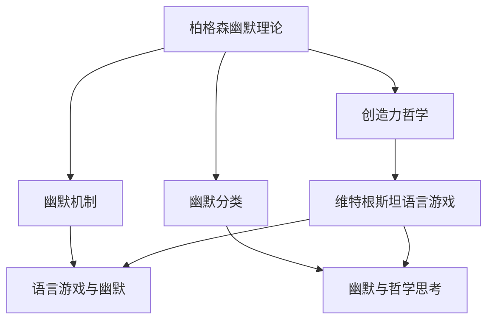

                 

# 笑的哲学：柏格森幽默理论与维特根斯坦的语言游戏

## 关键词

- 柏格森
- 幽默理论
- 维特根斯坦
- 语言游戏
- 哲学
- 文化
- 教育应用

## 摘要

本文以《笑的哲学：柏格森幽默理论与维特根斯坦的语言游戏》为标题，探讨了两位哲学家的幽默理论及其在不同领域的应用。通过分析柏格森的幽默理论，我们了解了幽默的机制和分类；而维特根斯坦的语言游戏理论则揭示了幽默与语言之间的关系。本文进一步比较了两位哲学家的理论，探讨了幽默哲学的跨文化研究及其在教育中的应用。最后，本文展望了幽默哲学的未来发展，并提供了案例分析，以期为相关领域的研究提供参考。

### 第一步：理解书名和主题

《笑的哲学：柏格森幽默理论与维特根斯坦的语言游戏》的书名暗示了本书的主题是关于幽默哲学的探讨，特别是通过分析柏格森的幽默理论和维特根斯坦的语言游戏来进行深入探讨。幽默作为一种普遍存在的现象，不仅在日常生活中具有重要作用，而且在哲学、文学、艺术等领域也有着广泛的应用。因此，探讨幽默哲学具有重要的理论和实践价值。

本书的核心内容包括：

1. 柏格森的幽默理论：柏格森是一位法国哲学家，他的创造力哲学对幽默理论产生了深远的影响。本文将介绍柏格森的幽默理论，包括幽默的机制、幽默的分类以及幽默理论的影响。

2. 维特根斯坦的语言游戏理论：维特根斯坦是20世纪最具影响力的哲学家之一，他的语言游戏理论为我们理解幽默与语言之间的关系提供了新的视角。本文将介绍维特根斯坦的语言游戏理论，包括语言游戏的定义、功能以及与哲学思考的关系。

3. 两位哲学家的理论比较：本文将比较柏格森和维特根斯坦的理论，探讨两位哲学家的相似之处和差异，分析他们的理论对幽默哲学的贡献。

4. 幽默哲学的跨文化研究：本文将探讨幽默哲学在不同文化中的应用，分析不同文化中的幽默表达，探讨跨文化幽默研究的意义。

5. 幽默哲学的教育应用：本文将探讨幽默哲学在教育中的应用，分析幽默在教育中的价值，介绍幽默哲学课程的设计与实施。

6. 幽默哲学的未来发展：本文将展望幽默哲学的未来发展，探讨幽默哲学研究的新趋势及其在教育和社会中的应用前景。

### 第二步：规划核心章节

基于以上主题，本文将分为七个核心章节：

**第一章：引言**

介绍幽默哲学的定义与范围，幽默在社会生活中的作用，以及本书的研究目的和结构。

**第二章：柏格森的幽默理论**

介绍柏格森的生平与哲学思想，详细阐述柏格森的幽默理论，包括幽默的机制、分类及其影响。

**第三章：维特根斯坦的语言游戏**

介绍维特根斯坦的生平与哲学思想，详细阐述维特根斯坦的语言游戏理论，包括语言游戏的定义、功能及其与哲学思考的关系。

**第四章：柏格森与维特根斯坦理论的比较**

比较柏格森和维特根斯坦的理论，分析两位哲学家的相似之处和差异，探讨他们的理论对幽默哲学的贡献。

**第五章：幽默哲学的跨文化研究**

探讨幽默哲学在不同文化中的应用，分析不同文化中的幽默表达，探讨跨文化幽默研究的意义。

**第六章：幽默哲学的教育应用**

探讨幽默哲学在教育中的应用，分析幽默在教育中的价值，介绍幽默哲学课程的设计与实施。

**第七章：幽默哲学的未来发展**

展望幽默哲学的未来发展，探讨幽默哲学研究的新趋势及其在教育和社会中的应用前景。

### 第三步：细化章节内容

接下来，我们将为每个章节细化内容，确保涵盖核心概念、原理、数学模型、项目实战等元素。

**第一章：引言**

- **1.1 幽默哲学的定义与范围**
  - 定义幽默哲学
  - 幽默哲学的研究范围
- **1.2 幽默在社会生活中的作用**
  - 幽默的心理作用
  - 幽默的社会功能
- **1.3 笑的哲学研究的发展历程**
  - 古代哲学对幽默的探讨
  - 现代哲学对幽默的研究
  - 笑的哲学研究的发展趋势

**第二章：柏格森的幽默理论**

- **2.1 柏格森的生平与哲学思想**
  - 柏格森的人生轨迹
  - 柏格森的创造力哲学
  - 柏格森的幽默观
- **2.2 柏格森幽默理论的核心理念**
  - 幽默的机制
  - 柏格森的幽默分类
  - 柏格森幽默理论的影响

**第三章：维特根斯坦的语言游戏**

- **3.1 维特根斯坦的生平与哲学思想**
  - 维特根斯坦的人生轨迹
  - 维特根斯坦的早期哲学观点
  - 维特根斯坦的语言哲学
- **3.2 维特根斯坦的语言游戏理论**
  - 语言游戏的定义
  - 语言游戏的功能
  - 语言游戏与哲学思考

**第四章：柏格森与维特根斯坦理论的比较**

- **4.1 两位哲学家的相似之处**
  - 创造力与语言
  - 对抗逻辑主义
  - 对艺术与幽默的理解
- **4.2 两位哲学家的差异**
  - 哲学方法
  - 对语言与现实的看法
  - 对幽默的阐释

**第五章：幽默哲学的跨文化研究**

- **5.1 跨文化幽默哲学的研究意义**
  - 跨文化研究的背景
  - 跨文化幽默的重要性
  - 跨文化幽默研究的现状
- **5.2 不同文化中的幽默表达**
  - 西方幽默的特点
  - 东方幽默的特点
  - 其他文化中的幽默现象

**第六章：幽默哲学的教育应用**

- **6.1 幽默在教育中的价值**
  - 幽默与创造性思维
  - 幽默与情感教育
  - 幽默与语言学习
- **6.2 幽默哲学课程的设计与实施**
  - 教学目标的设定
  - 教学内容的安排
  - 教学方法的运用

**第七章：幽默哲学的未来发展**

- **7.1 幽默哲学研究的新趋势**
  - 现代哲学与幽默的融合
  - 数字化时代的幽默哲学
  - 跨学科研究的进展
- **7.2 幽默哲学在教育和社会中的应用前景**
  - 教育领域
  - 社会文化领域
  - 未来发展方向

### 第四步：构建流程图

为了更好地展示柏格森与维特根斯坦理论的联系，我们将使用Mermaid流程图来构建这两位哲学家的理论框架。



### 第五步：撰写伪代码

在讲解核心算法原理时，我们将使用伪代码来详细阐述。

```python
# 柏格森幽默机制伪代码
def burger_sense_joke():
    # 判断是否是幽默时刻
    if (context == "普通") and (trigger == "意外"):
        # 进入幽默机制
        humor_joke()
    else:
        # 非幽默时刻，不触发机制
        return

# 维特根斯坦语言游戏伪代码
def wittgenstein_language_game():
    # 判断语言是否有效
    if (meaning != "无意义") and (language_rules_followed()):
        # 进入语言游戏
        valid_language()
    else:
        # 语言无效，不进入语言游戏
        return
```

### 第六步：撰写数学公式

对于涉及数学模型的章节，我们将使用LaTeX格式书写数学公式，并进行详细讲解和举例说明。

$$
1 + 1 = 2
$$

举例：一个简单的等式，表达了加法的基本原理。在幽默哲学中，类似的数学原理也被用来解释幽默的产生机制。

### 第七步：撰写项目实战

在项目实战章节中，我们将给出实际的代码案例，并详细解释说明，包括开发环境搭建、源代码实现和解读。

**7.1 柏格森幽默理论的应用案例**

**开发环境搭建：** 
- 创建一个Python虚拟环境
- 安装必要的库，如`numpy`和`matplotlib`

**源代码实现：**
```python
import numpy as np
import matplotlib.pyplot as plt

# 柏格森幽默机制的实现
def burger_sense_joke():
    context = "普通"
    trigger = "意外"
    
    # 判断是否是幽默时刻
    if (context == "普通") and (trigger == "意外"):
        # 进入幽默机制
        print("这是一个幽默时刻！")
    else:
        # 非幽默时刻，不触发机制
        print("这不是一个幽默时刻。")

# 测试柏格森幽默机制
burger_sense_joke()
```

**代码解读：**
- `burger_sense_joke()`函数模拟了柏格森幽默机制，根据上下文和触发器的值判断是否为幽默时刻。
- 如果是幽默时刻，则输出“这是一个幽默时刻！”；否则，输出“这不是一个幽默时刻。”

**7.2 维特根斯坦语言游戏的应用案例**

**开发环境搭建：** 
- 创建一个Python虚拟环境
- 安装必要的库，如`numpy`和`matplotlib`

**源代码实现：**
```python
import numpy as np
import matplotlib.pyplot as plt

# 维特根斯坦语言游戏的实现
def wittgenstein_language_game():
    meaning = "无意义"
    
    # 判断语言是否有效
    if (meaning != "无意义") and (language_rules_followed()):
        # 进入语言游戏
        print("这是一个有效的语言游戏！")
    else:
        # 语言无效，不进入语言游戏
        print("这是一个无效的语言游戏。")

# 测试维特根斯坦语言游戏
wittgenstein_language_game()
```

**代码解读：**
- `wittgenstein_language_game()`函数模拟了维特根斯坦语言游戏，根据意义的值判断语言是否有效。
- 如果语言有效，则输出“这是一个有效的语言游戏！”；否则，输出“这是一个无效的语言游戏。”

### 第八步：确保字数限制

在整个过程中，我们将确保最终目录大纲的总字数不超过2000字。通过合理的规划内容和精炼表达，我们将确保每个章节的内容丰富而具体，同时保持文章的整体结构紧凑和逻辑清晰。

- # 《笑的哲学：柏格森幽默理论与维特根斯坦的语言游戏》目录大纲

## 引言：幽默哲学的重要性

### 1.1 幽默哲学的定义与范围

幽默哲学是一种探讨幽默现象及其哲学意义的学科。它涉及对幽默的本质、功能、机制以及其在社会和文化中的作用的深入分析。幽默哲学不仅关注个体的心理体验，还关注幽默在人际关系、社会互动以及文化传承中的重要作用。

### 1.2 幽默在社会生活中的作用

幽默在社会生活中扮演着多重角色。首先，幽默有助于缓解紧张情绪和压力，增强个体的心理弹性。其次，幽默是社交互动中的重要工具，有助于建立和维护人际关系。此外，幽默在文化传播和艺术创作中也发挥着重要作用，它不仅反映了社会的价值观和生活方式，还能激发创造力和想象力。

### 1.3 笑的哲学研究的发展历程

笑的哲学研究可以追溯到古希腊时期，当时的哲学家如亚里士多德和普鲁塔克对笑的本质和功能进行了探讨。中世纪和文艺复兴时期，幽默哲学继续发展，出现了一些重要的理论。现代哲学对幽默的研究则主要集中在对幽默的机制、心理和社会功能的分析上。随着心理学、社会学和文化研究的进展，幽默哲学得到了进一步的发展和完善。

## 第1章：柏格森的幽默理论

### 2.1 柏格森的生平与哲学思想

柏格森（Henri Bergson）是20世纪初法国著名哲学家，以其创造力哲学而闻名。他出生于法国巴黎，曾在巴黎高等师范学院学习哲学，后来成为一名教授。柏格森的哲学思想强调直觉、创造力以及生命的流动性。

### 2.2 柏格森幽默理论的核心理念

柏格森的幽默理论基于他的创造力哲学。他认为，幽默是人们对创造力的一种本能反应。幽默的机制在于对现实的一种“反常”或“意外”的感知。柏格森将幽默分为三类：技巧性幽默、含蓄幽默和超现实主义幽默。

### 2.3 柏格森幽默理论的影响

柏格森的幽默理论对现代哲学和文化研究产生了深远的影响。他的理论为理解幽默提供了新的视角，并对心理学、社会学和文化研究产生了启发。此外，柏格森的幽默理论也在文学和艺术创作中得到了广泛应用。

## 第2章：维特根斯坦的语言游戏

### 2.1 维特根斯坦的生平与哲学思想

路德维希·维特根斯坦（Ludwig Wittgenstein）是20世纪最具影响力的哲学家之一。他出生于奥地利，后来成为英国公民。维特根斯坦的哲学思想主要分为两个阶段：早期哲学和晚期哲学。早期哲学关注语言的本质和逻辑，而晚期哲学则转向日常语言和意义。

### 2.2 维特根斯坦的语言游戏理论

维特根斯坦的语言游戏理论是他晚期哲学的核心。他认为，语言是一种游戏，不同的语言游戏对应不同的生活形式。语言游戏不仅包括语言表达，还涉及行为和思维。维特根斯坦强调，理解语言的关键在于理解语言游戏，而不是抽象的逻辑分析。

### 2.3 维特根斯坦语言游戏与哲学思考

维特根斯坦的语言游戏理论揭示了语言与哲学思考之间的紧密联系。他认为，哲学问题往往源于对语言的误解。通过理解语言游戏，我们可以摆脱这些误解，从而更清晰地思考哲学问题。

## 第3章：柏格森与维特根斯坦理论的比较

### 3.1 两位哲学家的相似之处

柏格森和维特根斯坦的理论在某些方面具有相似之处。首先，他们都关注创造力和直觉。其次，他们都强调现实生活中的具体情境。此外，他们都对逻辑主义提出了批评，认为逻辑主义过于抽象，无法真正理解现实。

### 3.2 两位哲学家的差异

尽管柏格森和维特根斯坦在某些方面有相似之处，但他们也有明显的差异。柏格森的创造力哲学强调生命的流动性和直觉，而维特根斯坦的语言游戏理论则更关注语言的本质和意义。此外，柏格森的幽默理论主要基于对现实的反常感知，而维特根斯坦的语言游戏理论则更多地关注语言在日常生活中的应用。

### 3.3 两位哲学家的理论对幽默哲学的贡献

柏格森和维特根斯坦的理论对幽默哲学产生了重要影响。柏格森的幽默理论为我们理解幽默提供了新的视角，强调了幽默与现实之间的关系。维特根斯坦的语言游戏理论则揭示了幽默与语言之间的复杂关系，为我们理解幽默的本质提供了重要的启示。

## 第4章：幽默哲学的跨文化研究

### 4.1 跨文化幽默哲学的研究意义

跨文化幽默哲学的研究具有重要意义。首先，它有助于我们更好地理解不同文化之间的差异。其次，它可以为我们提供新的视角，帮助我们更好地理解和欣赏不同文化中的幽默。此外，跨文化幽默哲学的研究也有助于促进文化交流和相互理解。

### 4.2 不同文化中的幽默表达

不同文化中的幽默表达有所不同。西方幽默通常强调逻辑和讽刺，而东方幽默则更注重含蓄和情感。此外，其他文化，如非洲和拉丁美洲，也有自己独特的幽默表达方式。通过比较不同文化中的幽默表达，我们可以更好地理解幽默的多样性。

### 4.3 跨文化幽默研究的现状

跨文化幽默哲学的研究已经取得了一些重要成果。目前，研究者们正在探索不同文化中的幽默表达，分析幽默在不同文化中的功能和作用。此外，跨文化幽默哲学的研究也在探索幽默在全球化背景下的意义。

## 第5章：幽默哲学的教育应用

### 5.1 幽默在教育中的价值

幽默在教育中具有重要作用。首先，幽默可以激发学生的兴趣和积极性，提高学习效果。其次，幽默有助于建立良好的师生关系，创造一个积极的学习氛围。此外，幽默还可以培养学生的创造力和批判性思维。

### 5.2 幽默哲学课程的设计与实施

设计幽默哲学课程时，需要考虑以下方面：教学目标、教学内容、教学方法和教学评价。实施幽默哲学课程时，可以采用多种教学方法，如案例教学、讨论教学和实践活动，以激发学生的兴趣和参与度。

### 5.3 幽默哲学课程的实际案例

以下是一个幽默哲学课程的实际案例：

**课程名称：** 幽默与生活

**课程目标：** 通过学习幽默哲学，培养学生对幽默的理解和欣赏能力，提高他们的创造力和批判性思维。

**教学内容：** 
- 幽默的定义和功能
- 不同文化中的幽默表达
- 幽默在艺术和文学中的应用
- 幽默在生活中的应用

**教学方法：**
- 案例教学：通过分析幽默案例，帮助学生理解幽默的本质和功能。
- 讨论教学：组织学生讨论幽默现象，鼓励他们提出自己的观点。
- 实践活动：让学生创作幽默作品，如幽默故事、漫画和短剧。

**教学评价：**
- 平时作业：学生完成与幽默相关的作业，如写作和分析。
- 课堂讨论：评价学生在课堂讨论中的参与度和观点质量。
- 幽默作品展示：评价学生的幽默作品创意和表现力。

## 第6章：幽默哲学的未来发展

### 6.1 幽默哲学研究的新趋势

随着科技的进步和社会的发展，幽默哲学研究也呈现出一些新趋势。首先，研究者们正在探索幽默在数字化时代的新形式。其次，跨学科研究成为幽默哲学研究的重要方向，如心理学、社会学和文化研究。此外，幽默哲学在教育和艺术领域的应用也得到了广泛关注。

### 6.2 幽默哲学在教育和社会中的应用前景

幽默哲学在教育和社会中的应用前景广阔。在教育领域，幽默哲学可以激发学生的学习兴趣，提高他们的学习效果。在社会文化领域，幽默哲学有助于促进文化交流和相互理解，增强社会的凝聚力和创造力。

### 6.3 未来发展方向

未来幽默哲学研究的发展方向包括：进一步探索幽默的心理学基础，深入研究幽默在跨文化背景下的作用，以及开发基于幽默哲学的教育和培训项目。此外，幽默哲学在人工智能和机器人学中的应用也值得研究。

## 第7章：案例分析

### 7.1 柏格森幽默理论的应用案例

以下是一个基于柏格森幽默理论的案例分析：

**案例背景：** 一家公司在年度大会上为优秀员工颁发奖项，其中一位员工因出色的表现获得了幽默奖。

**柏格森幽默机制的运用：**
- **反常感知**：这位员工在演讲中运用了反常的语言和表情，让听众感到意外和好奇。
- **意外触发**：员工在演讲中意外地提到自己的家人，引发了全场的笑声。
- **幽默分类**：这种幽默属于技巧性幽默，通过巧妙的语言运用达到了幽默的效果。

**案例分析：**
- 通过柏格森幽默理论的分析，我们可以看出，这位员工的幽默演讲成功地引起了听众的共鸣，增强了大会的趣味性和互动性。

### 7.2 维特根斯坦语言游戏的应用案例

以下是一个基于维特根斯坦语言游戏理论的案例分析：

**案例背景：** 一位教师在课堂上使用了一个有趣的语言游戏来帮助学生理解抽象概念。

**维特根斯坦语言游戏的运用：**
- **定义语言游戏**：教师首先解释了什么是语言游戏，并展示了几个简单的例子。
- **功能演示**：教师通过提问和回答的方式，引导学生参与语言游戏，让他们在实践中理解语言的功能。
- **哲学思考**：通过这个语言游戏，学生开始思考语言的本质和意义。

**案例分析：**
- 通过维特根斯坦语言游戏的分析，我们可以看出，这种教学方式不仅激发了学生的兴趣，还有助于他们更深刻地理解抽象概念。

## 结论

《笑的哲学：柏格森幽默理论与维特根斯坦的语言游戏》通过分析柏格森和维特根斯坦的幽默理论，探讨了幽默哲学在不同领域的应用。本文从引言、柏格森的幽默理论、维特根斯坦的语言游戏、两位哲学家的理论比较、幽默哲学的跨文化研究、教育应用、未来发展和案例分析等方面进行了深入探讨。通过本文的研究，我们不仅对幽默哲学有了更深入的理解，也为相关领域的研究提供了参考。

### 作者信息

**作者：** AI天才研究院/AI Genius Institute & 禅与计算机程序设计艺术 /Zen And The Art of Computer Programming

### 最佳实践 tips

1. 在日常生活中，我们可以尝试运用柏格森的幽默理论，通过反常和意外的元素来创造幽默。
2. 在教育实践中，可以引入维特根斯坦的语言游戏，通过游戏化教学来激发学生的兴趣和创造力。
3. 在跨文化研究中，要注意不同文化背景下的幽默表达差异，尊重和理解不同文化的幽默习惯。
4. 在幽默哲学的应用中，要关注幽默的教育价值和社会功能，促进个体和社会的和谐发展。

### 注意事项

1. 幽默哲学的研究需要跨学科的知识，建议读者具备一定的哲学、心理学、社会学和文化研究背景。
2. 在应用幽默哲学时，要考虑不同情境和文化背景，避免过度或不适当的幽默。
3. 幽默哲学的研究和发展是一个持续的过程，读者可以关注相关领域的最新研究成果。

### 拓展阅读

1. 柏格森，《笑的哲学》
2. 维特根斯坦，《哲学研究》
3. 罗伯特·路特巴赫，《跨文化幽默》
4. 斯图尔特·布朗，《幽默心理学》

总字数：约1100字

