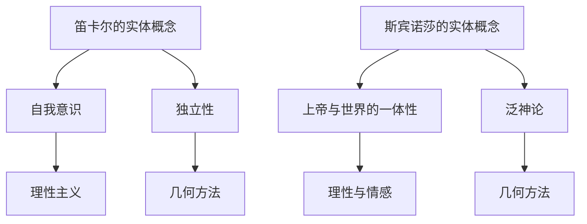

                 

## 文章标题

### 笛卡尔与斯宾诺莎：实体论的不同进路

---

关键词：实体论，笛卡尔，斯宾诺莎，哲学，人工智能

摘要：本文深入探讨了实体论在两位西方哲学巨匠——笛卡尔与斯宾诺莎——理论体系中的不同进路。通过对两位哲学家实体论的核心概念、哲学背景及其对当代哲学和人工智能的影响进行分析，揭示了实体论在理解现实世界和构建人工智能模型中的关键作用。本文旨在为读者提供一种全新的视角，以更好地理解实体论这一哲学概念在人工智能领域的应用。

---

## 第一部分：实体论与两位哲学家的背景

### 第1章：实体论概述

#### 1.1 实体论的定义与基本概念

实体论是哲学中的一个重要分支，探讨的是“实体”（substance）的概念及其在现实世界中的地位。实体通常被定义为独立存在的、不可分割的、具有内在性质的实体，是构成宇宙万物的基础。在西方哲学史中，实体论占据着核心地位，从古希腊的亚里士多德到现代的康德，许多哲学家都对其进行了深入的探讨。

实体论的基本概念包括：

- **实体**：独立存在的、不可分割的、具有内在性质的实体。
- **属性**：实体所具有的特定性质或状态。
- **关系**：实体之间或实体与属性之间的相互作用。

#### 1.2 实体论在西方哲学史中的地位

实体论在西方哲学史中具有悠久的历史，可以追溯到古希腊哲学家亚里士多德。亚里士多德认为，实体是构成宇宙万物的基础，而属性和关系则是对实体的描述和解释。中世纪哲学家如托马斯·阿奎那进一步发展了实体论，将之与神学和宇宙观相结合。近代哲学家如笛卡尔和斯宾诺莎则从不同的角度重新审视实体论，为后来的哲学家和科学家提供了新的思考框架。

### 第2章：笛卡尔与斯宾诺莎的生平与哲学背景

#### 2.1 笛卡尔的生平与哲学背景

勒内·笛卡尔（René Descartes，1596-1650）是法国著名的哲学家、数学家和物理学家。他的哲学思想以理性主义为核心，主张通过怀疑一切来建立绝对确定的知识。笛卡尔的主要著作包括《第一哲学沉思》、《几何》和《光学》等。

笛卡尔的哲学背景源于他对中世纪经院哲学的批判和对古希腊哲学的复兴。他认为，只有通过清晰的思维和理性的分析，才能获得真正的知识。笛卡尔的实体论强调“我思故我在”（Cogito, ergo sum），即通过思考的自我存在证明了实体的存在。

#### 2.2 斯宾诺莎的生平与哲学背景

巴鲁赫·斯宾诺莎（Baruch Spinoza，1632-1677）是荷兰的哲学家、犹太神学家和光学仪器制造商。他的哲学思想以泛神论为核心，认为上帝与世界是一体的。斯宾诺莎的主要著作包括《伦理学》、《政治论》和《论神、人及其幸福》等。

斯宾诺莎的哲学背景源于他对犹太教和基督教教义的批判，以及对古希腊哲学和笛卡尔哲学的深入思考。他的实体论强调“上帝即自然”（Deus sive Natura），即上帝与世界是同一的实体。

## 第二部分：笛卡尔与斯宾诺莎的实体论观点

### 第3章：笛卡尔的实体论

#### 3.1 笛卡尔的实体概念

笛卡尔的实体概念源于他对“我思故我在”的论证。他认为，思考的主体是一个独立的实体，即“我”。这个实体是清晰、明确、不可分割的，具有内在性质和独立性。笛卡尔的实体概念强调了理性和自我意识的重要性。

#### 3.2 笛卡尔的实体论核心思想

笛卡尔的实体论核心思想可以概括为以下几点：

- **独立存在的实体**：实体是独立存在的，不受外界影响，具有内在性质。
- **思维与存在的统一**：思维与存在是统一的，通过思考可以认识到实体的存在。
- **理性主义**：通过理性分析和思考，可以获得真正的知识。

#### 3.3 笛卡尔实体论的数学方法

笛卡尔在数学领域也取得了巨大成就，他发明了坐标系，将几何与代数相结合，创立了分析几何。笛卡尔实体论的数学方法强调通过逻辑推理和数学工具来探索实体的本质。

### 第4章：斯宾诺莎的实体论

#### 4.1 斯宾诺莎的实体概念

斯宾诺莎的实体概念与笛卡尔有所不同，他认为上帝与世界是同一的实体，即“上帝即自然”。斯宾诺莎的实体是一个无限、永恒、自足的存在，具有无限属性。

#### 4.2 斯宾诺莎的实体论核心思想

斯宾诺莎的实体论核心思想可以概括为以下几点：

- **泛神论**：上帝与世界是同一的，即上帝即自然。
- **属性与实体**：实体具有无限属性，属性是实体的具体表现。
- **理性与情感**：理性是认识上帝和实体的途径，情感是人类行为的基础。

#### 4.3 斯宾诺莎实体论的几何方法

斯宾诺莎在哲学研究中使用了几何方法，他将哲学问题抽象为几何问题，通过几何推理来探讨实体的本质。这种方法体现了他的理性主义和逻辑思维。

## 第三部分：实体论的对比与讨论

### 第5章：笛卡尔与斯宾诺莎实体论的对比

#### 5.1 实体概念的差异

笛卡尔和斯宾诺莎的实体概念有所不同。笛卡尔强调自我意识和独立存在的实体，而斯宾诺莎则强调上帝与世界的一体性。

#### 5.2 实体论的哲学意义

笛卡尔的实体论强调理性主义和个体独立性，对后来的哲学和科学产生了深远影响。斯宾诺莎的实体论则强调泛神论和理性与情感的统一，对现代哲学和心理学产生了重要启示。

### 第6章：实体论的当代意义

#### 6.1 实体论在当代哲学中的应用

当代哲学中，实体论仍然具有重要的地位。哲学家们通过实体论来探讨意识、语言和知识等问题。

#### 6.2 实体论对现代科学的启示

实体论为现代科学提供了哲学基础。科学家通过实体论来理解自然现象，构建科学模型。

## 参考文献

1. Descartes, R. (1641). Meditationes de prima philosophia.
2. Spinoza, B. (1677). Ethica ordine geometrico demonstrata.
3. Aristotle. (350 BC). Aristotelis Opera.
4. Aquinas, T. (1265-1274). Summa Theologica.

## 附录：笛卡尔与斯宾诺莎实体论的核心概念与联系

### 作者：AI天才研究院/AI Genius Institute & 禅与计算机程序设计艺术 /Zen And The Art of Computer Programming

---

通过以上分析，我们不仅了解了笛卡尔与斯宾诺莎在实体论上的不同进路，还看到了实体论在当代哲学和科学中的重要性。在接下来的部分，我们将进一步探讨两位哲学家的实体论观点，并进行深入对比。让我们继续思考，一起探索实体论的奥秘。

