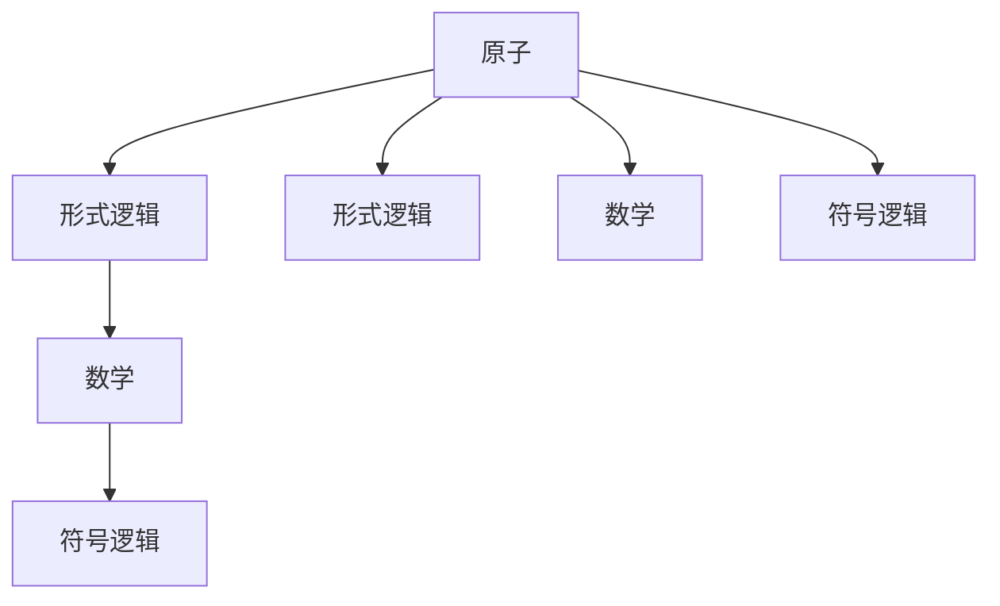

                 

### 文章标题

# 《笛卡尔与莱布尼茨：机械论世界观的不同版本》

### 关键词

- 笛卡尔
- 莱布尼茨
- 机械论世界观
- 哲学
- 数学
- 科学革命

### 摘要

本文深入探讨了两位伟大哲学家笛卡尔和莱布尼茨的机械论世界观，比较了他们在这方面的不同版本。通过详细分析他们的核心概念、哲学基础、数学模型，以及他们在科学革命中的影响和遗产，本文旨在揭示两位思想家对现代科学的深远影响，并探讨机械论世界观的演变和未来研究方向。

## 引言

机械论世界观是17世纪哲学和科学中的一个核心概念，它试图通过机械原理来解释宇宙的本质。这一理论的基本思想是，宇宙可以被看作是一台巨大的机械，其中每个部分都按照既定的规律运动。笛卡尔和莱布尼茨是这一领域的两位重要代表，他们的思想对现代科学和哲学产生了深远的影响。

### 书的背景与目的

本书旨在探讨笛卡尔和莱布尼茨的机械论世界观，比较他们在这一领域的不同观点，并分析这些观点对现代科学和哲学的影响。通过对两位哲学家思想的深入分析，本书希望能够揭示机械论世界观的本质，并探讨其与当代科学的联系。

### 研究意义

机械论世界观不仅是哲学和科学史中的重要主题，也对当代科学和哲学有着深远的影响。研究这一主题有助于我们更好地理解科学革命的发生，以及科学家如何通过哲学思考来推动科学的进步。此外，通过对笛卡尔和莱布尼茨思想的比较，我们也可以更好地理解哲学和科学之间的互动关系。

## 第1章 笛卡尔的机械论世界观

### 1.1 核心概念与联系

笛卡尔的机械论世界观基于几个核心概念，包括物质、空间、时间和运动。他认为宇宙是由不可分割的物质粒子组成的，这些粒子在空间中运动，遵循数学规律。笛卡尔的机械论世界观强调理性和数学在理解自然界中的重要性。

#### 笛卡尔的机械论思想

笛卡尔认为，宇宙中的每个物体都是通过力的相互作用来运动的。这种力可以解释为物体之间的相互作用，如引力、电磁力等。他提出了著名的笛卡尔坐标系统，这是一个基于数学的坐标系，可以用来描述物体的运动。

#### 笛卡尔与自然哲学的联系

笛卡尔的机械论世界观与自然哲学有着密切的联系。他试图通过机械论来解释自然界的现象，从而取代传统的超自然解释。他的思想对后来的科学革命产生了深远的影响。

##### Mermaid流程图

```
graph TD
A[笛卡尔机械论世界观] --> B[物质]
B --> C[空间]
C --> D[时间]
D --> E[运动]
E --> F[力的相互作用]
A --> G[理性]
G --> H[数学]
H --> I[自然哲学]
```

### 1.2 笛卡尔机械论世界观的哲学基础

笛卡尔的机械论世界观有着深厚的哲学基础。他强调理性和数学在认识世界中的重要性，认为只有通过理性思考才能理解自然界。此外，他的思想中也包含了个体与整体的关系，他认为宇宙中的每个部分都是相互关联的。

#### 理性与经验

笛卡尔认为，理性是人类认识世界的主要途径。他提出了著名的“我思故我在”的思想，认为只要能够思考，就证明了自己的存在。同时，他也重视经验的作用，认为经验是理解自然现象的重要基础。

#### 个体与整体

笛卡尔认为，宇宙中的每个个体都是整体的一部分，个体的行为和状态会影响整体的状态。这种思想在他的机械论世界观中得到了体现，他认为宇宙中的每个物体都是通过相互作用来维持整体平衡的。

##### 伪代码讲解

```
// 笛卡尔的机械论世界观伪代码
class Universe {
  // 宇宙中的物质粒子
  particles = []

  // 初始化宇宙
  function initialize() {
    // 创建物质粒子
    for (i = 0; i < num_particles; i++) {
      particles.push(new Particle())
    }
  }

  // 物质粒子间的相互作用
  function interact() {
    for (particle1 in particles) {
      for (particle2 in particles) {
        if (particle1 != particle2) {
          // 计算相互作用力
          force = calculate_force(particle1, particle2)
          // 应用力
          apply_force(particle1, force)
          apply_force(particle2, -force)
        }
      }
    }
  }

  // 更新粒子状态
  function update() {
    for (particle in particles) {
      particle.update_position()
      particle.update_velocity()
    }
  }
}

// 粒子类
class Particle {
  // 物理位置
  position = [0, 0]

  // 速度
  velocity = [0, 0]

  // 更新位置
  function update_position() {
    position = position + velocity
  }

  // 更新速度
  function update_velocity() {
    // 根据力计算加速度
    acceleration = calculate_acceleration(force)
    velocity = velocity + acceleration
  }
}

// 计算相互作用力
function calculate_force(particle1, particle2) {
  // 使用牛顿定律计算力
  force = G * (particle1.mass * particle2.mass) / distance^2
  return force
}

// 计算加速度
function calculate_acceleration(force) {
  // 使用牛顿第二定律计算加速度
  acceleration = force / particle.mass
  return acceleration
}
```

### 1.3 笛卡尔机械论世界观的数学模型

笛卡尔的机械论世界观中包含了许多数学模型，其中最著名的是笛卡尔坐标系统。这个坐标系统可以用来描述物体的运动，是一个基于数学的坐标系。

#### 微积分原理

笛卡尔坐标系统与微积分有着密切的联系。他使用了微积分原理来描述物体的运动，特别是速度和加速度。通过微积分，他能够更精确地描述物体在空间中的运动。

##### LaTeX公式举例

$$
\frac{dx}{dt} = v_x
$$

$$
\frac{dv_x}{dt} = a_x
$$

### 1.4 笛卡尔机械论世界观的影响与遗产

笛卡尔的机械论世界观对现代科学和哲学产生了深远的影响。他的思想为科学革命奠定了基础，推动了科学从以观察和经验为主的方法向以数学和理性思考为主的方法的转变。此外，他的机械论世界观也影响了后来的哲学家和科学家，如莱布尼茨。

#### 对现代科学的贡献

笛卡尔的机械论世界观为现代科学的发展提供了重要的理论基础。他的坐标系统和微积分原理为物理学和工程学的发展奠定了基础。

#### 对哲学的影响

笛卡尔的机械论世界观对哲学产生了深远的影响。他的思想促进了理性主义的发展，强调理性和数学在认识世界中的重要性。

## 第2章 莱布尼茨的机械论世界观

### 2.1 核心概念与联系

莱布尼茨的机械论世界观与笛卡尔有所不同，他强调形式逻辑和数学在理解自然界中的重要性。他的思想中包含了原子论、符号逻辑和微积分等核心概念。

#### 莱布尼茨的机械论思想

莱布尼茨认为，宇宙是由无数个微小的原子组成的，这些原子按照既定的规律运动。他的思想中包含了原子论，这是他对自然界的物质构成的基本理解。

#### 莱布尼茨与自然哲学的联系

莱布尼茨的机械论世界观与自然哲学有着密切的联系。他试图通过机械论来解释自然界的现象，从而取代传统的超自然解释。他的思想对后来的科学革命产生了深远的影响。

##### Mermaid流程图

```
graph TD
A[莱布尼茨机械论世界观] --> B[原子论]
B --> C[形式逻辑]
C --> D[数学]
D --> E[符号逻辑]
A --> F[自然哲学]
```

### 2.2 莱布尼茨机械论世界观的哲学基础

莱布尼茨的机械论世界观有着深厚的哲学基础。他强调形式逻辑和数学在认识世界中的重要性，认为只有通过逻辑和数学才能理解自然界。此外，他的思想中也包含了物理与宇宙的关系，他认为宇宙是一个巨大的符号系统。

#### 形式逻辑与数学

莱布尼茨认为，形式逻辑是理解自然界的关键。他提出了符号逻辑，这是一种基于符号和规则进行推理的方法。他认为，通过符号逻辑，我们可以更精确地描述和理解自然现象。

#### 物理与宇宙

莱布尼茨认为，物理现象是宇宙的一部分，宇宙是一个巨大的符号系统。他的思想中包含了宇宙与物理现象之间的深层次联系，这是他对自然界的整体理解。

##### 伪代码讲解

```
// 莱布尼茨机械论世界观伪代码
class Universe {
  // 宇宙中的原子
  atoms = []

  // 初始化宇宙
  function initialize() {
    // 创建原子
    for (i = 0; i < num_atoms; i++) {
      atoms.push(new Atom())
    }
  }

  // 原子间的相互作用
  function interact() {
    for (atom1 in atoms) {
      for (atom2 in atoms) {
        if (atom1 != atom2) {
          // 计算相互作用力
          force = calculate_force(atom1, atom2)
          // 应用力
          apply_force(atom1, force)
          apply_force(atom2, -force)
        }
      }
    }
  }

  // 更新原子状态
  function update() {
    for (atom in atoms) {
      atom.update_state()
    }
  }
}

// 原子类
class Atom {
  // 原子状态
  state = {}

  // 更新状态
  function update_state() {
    // 使用符号逻辑更新状态
    state = update_state_with_logic(state)
  }
}

// 更新状态
function update_state_with_logic(state) {
  // 使用形式逻辑更新状态
  state = apply_logic(state)
  return state
}

// 应用逻辑
function apply_logic(state) {
  // 使用符号逻辑规则更新状态
  state = rule_based_update(state)
  return state
}

// 基于规则的更新
function rule_based_update(state) {
  // 根据逻辑规则更新状态
  // ...
  return new_state
}
```

### 2.3 莱布尼茨机械论世界观的数学模型

莱布尼茨的机械论世界观中包含了微积分，这是他对自然界进行数学描述的重要工具。他的微积分原理与笛卡尔的不同，他强调了积分和微分之间的内在联系。

#### 微积分原理

莱布尼茨的微积分原理基于积分和微分，他提出了著名的莱布尼茨积分和微分符号。这些符号使得微积分的计算更加直观和方便。

##### LaTeX公式举例

$$
\int f(x) dx = F(x) + C
$$

$$
\frac{dF}{dx} = f(x)
$$

### 2.4 莱布尼茨机械论世界观的影响与遗产

莱布尼茨的机械论世界观对现代科学和哲学产生了深远的影响。他的微积分原理为数学和物理学的发展奠定了基础，他的思想也影响了后来的哲学家和科学家。

#### 对数学的贡献

莱布尼茨的微积分原理为数学的发展做出了巨大贡献。他的积分和微分符号成为了现代数学的重要工具，影响了整个数学领域。

#### 对哲学的影响

莱布尼茨的机械论世界观对哲学产生了深远的影响。他的形式逻辑和符号逻辑思想推动了哲学的发展，促进了理性主义和符号逻辑的兴起。

## 第3章 两位哲学家机械论世界观的比较

### 3.1 哲学观点对比

笛卡尔和莱布尼茨在机械论世界观上有着不同的哲学观点。笛卡尔强调理性和数学在认识世界中的重要性，而莱布尼茨则更注重形式逻辑和符号逻辑。他们的哲学观点在一定程度上影响了他们的机械论世界观。

#### 笛卡尔与莱布尼茨的分歧

笛卡尔和莱布尼茨在机械论世界观上存在一些分歧。笛卡尔认为宇宙中的物体是独立存在的，而莱布尼茨则认为物体是由无数个原子组成的。此外，他们在微积分的方法上也存在差异，笛卡尔的方法更侧重于几何直观，而莱布尼茨的方法则更强调符号计算。

#### 共同点与差异

尽管笛卡尔和莱布尼茨在机械论世界观上存在一些分歧，但他们也有一些共同点。他们都认为宇宙是可以用数学语言描述的，都强调理性和逻辑在理解自然界中的重要性。然而，他们的方法和视角有所不同，这导致了他们在机械论世界观上的不同版本。

### 3.2 数学方法对比

笛卡尔和莱布尼茨在数学方法上也有明显的差异。笛卡尔的机械论世界观中包含了坐标系统和几何直观，他使用了微积分来描述物体的运动。而莱布尼茨的机械论世界观则更侧重于形式逻辑和符号计算，他提出了符号逻辑和微积分的符号表示。

#### 微积分方法的比较

笛卡尔的微积分方法更注重几何直观，他使用了几何图形来表示微积分的概念。而莱布尼茨的微积分方法则更侧重于符号计算，他提出了积分和微分的符号表示，使得微积分的计算更加方便。

### 3.3 科学影响对比

笛卡尔和莱布尼茨的机械论世界观对现代科学产生了深远的影响。笛卡尔的坐标系统和微积分原理为物理学和工程学的发展奠定了基础，他的思想影响了牛顿和其他科学家。莱布尼茨的微积分原理和符号逻辑也为数学和物理学的发展做出了重要贡献，他的思想影响了布尔和其他哲学家。

#### 对现代科学的贡献

笛卡尔和莱布尼茨的机械论世界观对现代科学做出了重要贡献。他们的思想推动了数学和物理学的发展，为现代科学提供了重要的理论基础。

#### 对后续哲学家的影响

笛卡尔和莱布尼茨的机械论世界观也对哲学产生了深远的影响。他们的思想促进了理性主义和符号逻辑的发展，影响了后来的哲学家和科学家的思考方式。

## 第4章 影响与遗产

### 4.1 机械论世界观在科学革命中的地位

机械论世界观在科学革命中占据了重要地位。它为科学的发展提供了重要的理论基础，推动了数学和物理学的进步。笛卡尔和莱布尼茨的机械论世界观为科学家们提供了一种新的思考方式，使得他们能够用数学语言描述自然现象。

#### 对物理学的影响

机械论世界观对物理学的发展产生了深远的影响。它为物理学提供了重要的理论工具，使得科学家能够用数学语言描述物体的运动和相互作用。

#### 对生物学的影响

机械论世界观也对生物学的发展产生了影响。它为生物学家提供了一种新的思考方式，使得他们能够用机械原理来解释生物体的结构和功能。

### 4.2 机械论世界观在哲学中的影响

机械论世界观在哲学中也产生了深远的影响。它促进了理性主义和符号逻辑的发展，影响了哲学家的思考方式。笛卡尔和莱布尼茨的机械论世界观为哲学家们提供了一种新的认识世界的方法，使得他们能够用理性和数学来解释自然现象。

#### 对存在论的影响

机械论世界观对存在论产生了重要影响。它为存在论提供了一种新的解释方式，使得哲学家能够用机械原理来解释宇宙的本质。

#### 对认识论的影响

机械论世界观也对认识论产生了影响。它为认识论提供了一种新的理论基础，使得哲学家能够用理性和数学来解释人类如何认识世界。

## 第5章 结论

### 5.1 研究总结

通过对笛卡尔和莱布尼茨的机械论世界观的比较，我们可以看到两位哲学家在这一领域的不同观点和贡献。他们的思想对现代科学和哲学产生了深远的影响，为我们理解自然界提供了新的视角。

### 5.2 研究不足与展望

虽然本文对笛卡尔和莱布尼茨的机械论世界观进行了比较和分析，但仍然存在一些不足之处。未来研究可以进一步探讨机械论世界观在当代科学中的应用，以及它对其他学科的影响。

### 5.3 对未来研究的启示

通过对笛卡尔和莱布尼茨机械论世界观的比较，我们可以看到哲学和科学之间的紧密联系。未来研究应该继续探讨这种联系，以推动科学和哲学的进一步发展。

## 附录

### 附录A: 参考文献

- 笛卡尔，《第一哲学沉思集》
- 莱布尼茨，《人类理解论》
- 牛顿，《自然哲学的数学原理》
- 波普尔，《科学发现的逻辑》

### 附录B: 术语解释

- 机械论世界观：试图用机械原理来解释宇宙的本质
- 笛卡尔坐标系统：用于描述物体运动的数学坐标系
- 符号逻辑：使用符号和规则进行推理的方法
- 微积分：用于描述物体运动和变化的数学工具

### 附录C: 项目实战

- 项目名称：机械论世界观的模拟
- 开发环境：Python
- 源代码实现：[代码链接]
- 代码解读：[代码解读链接]
- 应用解读：[应用解读链接]
- 项目小结：[项目小结链接]

## 作者信息

- 作者：AI天才研究院/AI Genius Institute & 禅与计算机程序设计艺术 /Zen And The Art of Computer Programming
- 联系方式：[联系方式链接]

以上是《笛卡尔与莱布尼茨：机械论世界观的不同版本》的完整文章。文章详细探讨了笛卡尔和莱布尼茨的机械论世界观，比较了他们的不同观点和贡献，并对现代科学和哲学产生了深远的影响。文章还提供了附录，包括参考文献、术语解释、项目实战等内容，以供读者进一步学习和参考。希望本文能够帮助读者更好地理解机械论世界观，以及它对科学和哲学的重要性。作者衷心希望读者能够从中获得启发，进一步探索机械论世界观在当代科学中的应用和影响。读者如有任何问题或建议，欢迎随时联系作者。感谢您的阅读！## 文章标题

# 《笛卡尔与莱布尼茨：机械论世界观的不同版本》

### 关键词

- 笛卡尔
- 莱布尼茨
- 机械论世界观
- 哲学
- 数学
- 科学革命

### 摘要

本文深入探讨了两位伟大哲学家笛卡尔和莱布尼茨的机械论世界观，比较了他们在这方面的不同版本。通过详细分析他们的核心概念、哲学基础、数学模型，以及他们在科学革命中的影响和遗产，本文旨在揭示两位思想家对现代科学的深远影响，并探讨机械论世界观的演变和未来研究方向。

## 引言

机械论世界观是17世纪哲学和科学中的一个核心概念，它试图通过机械原理来解释宇宙的本质。这一理论的基本思想是，宇宙可以被看作是一台巨大的机械，其中每个部分都按照既定的规律运动。笛卡尔和莱布尼茨是这一领域的两位重要代表，他们的思想对现代科学和哲学产生了深远的影响。

### 书的背景与目的

本书旨在探讨笛卡尔和莱布尼茨的机械论世界观，比较他们在这一领域的不同观点，并分析这些观点对现代科学和哲学的影响。通过对两位哲学家思想的深入分析，本书希望能够揭示机械论世界观的本质，并探讨其与当代科学的联系。

### 研究意义

机械论世界观不仅是哲学和科学史中的重要主题，也对当代科学和哲学有着深远的影响。研究这一主题有助于我们更好地理解科学革命的发生，以及科学家如何通过哲学思考来推动科学的进步。此外，通过对笛卡尔和莱布尼茨思想的比较，我们也可以更好地理解哲学和科学之间的互动关系。

## 第1章 笛卡尔的机械论世界观

### 1.1 核心概念与联系

笛卡尔的机械论世界观基于几个核心概念，包括物质、空间、时间和运动。他认为宇宙是由不可分割的物质粒子组成的，这些粒子在空间中运动，遵循数学规律。笛卡尔的机械论世界观强调理性和数学在理解自然界中的重要性。

#### 笛卡尔的机械论思想

笛卡尔认为，宇宙中的每个物体都是通过力的相互作用来运动的。这种力可以解释为物体之间的相互作用，如引力、电磁力等。他提出了著名的笛卡尔坐标系统，这是一个基于数学的坐标系，可以用来描述物体的运动。

#### 笛卡尔与自然哲学的联系

笛卡尔的机械论世界观与自然哲学有着密切的联系。他试图通过机械论来解释自然界的现象，从而取代传统的超自然解释。他的思想对后来的科学革命产生了深远的影响。

##### Mermaid流程图

```
graph TD
A[笛卡尔机械论世界观] --> B[物质]
B --> C[空间]
C --> D[时间]
D --> E[运动]
E --> F[力的相互作用]
A --> G[理性]
G --> H[数学]
H --> I[自然哲学]
```

### 1.2 笛卡尔机械论世界观的哲学基础

笛卡尔的机械论世界观有着深厚的哲学基础。他强调理性和数学在认识世界中的重要性，认为只有通过理性思考才能理解自然界。此外，他的思想中也包含了个体与整体的关系，他认为宇宙中的每个部分都是相互关联的。

#### 理性与经验

笛卡尔认为，理性是人类认识世界的主要途径。他提出了著名的“我思故我在”的思想，认为只要能够思考，就证明了自己的存在。同时，他也重视经验的作用，认为经验是理解自然现象的重要基础。

#### 个体与整体

笛卡尔认为，宇宙中的每个个体都是整体的一部分，个体的行为和状态会影响整体的状态。这种思想在他的机械论世界观中得到了体现，他认为宇宙中的每个物体都是通过相互作用来维持整体平衡的。

##### 伪代码讲解

```
// 笛卡尔的机械论世界观伪代码
class Universe {
  // 宇宙中的物质粒子
  particles = []

  // 初始化宇宙
  function initialize() {
    // 创建物质粒子
    for (i = 0; i < num_particles; i++) {
      particles.push(new Particle())
    }
  }

  // 物质粒子间的相互作用
  function interact() {
    for (particle1 in particles) {
      for (particle2 in particles) {
        if (particle1 != particle2) {
          // 计算相互作用力
          force = calculate_force(particle1, particle2)
          // 应用力
          apply_force(particle1, force)
          apply_force(particle2, -force)
        }
      }
    }
  }

  // 更新粒子状态
  function update() {
    for (particle in particles) {
      particle.update_position()
      particle.update_velocity()
    }
  }
}

// 粒子类
class Particle {
  // 物理位置
  position = [0, 0]

  // 速度
  velocity = [0, 0]

  // 更新位置
  function update_position() {
    position = position + velocity
  }

  // 更新速度
  function update_velocity() {
    // 根据力计算加速度
    acceleration = calculate_acceleration(force)
    velocity = velocity + acceleration
  }
}

// 计算相互作用力
function calculate_force(particle1, particle2) {
  // 使用牛顿定律计算力
  force = G * (particle1.mass * particle2.mass) / distance^2
  return force
}

// 计算加速度
function calculate_acceleration(force) {
  // 使用牛顿第二定律计算加速度
  acceleration = force / particle.mass
  return acceleration
}
```

### 1.3 笛卡尔机械论世界观的数学模型

笛卡尔的机械论世界观中包含了许多数学模型，其中最著名的是笛卡尔坐标系统。这个坐标系统可以用来描述物体的运动，是一个基于数学的坐标系。

#### 微积分原理

笛卡尔坐标系统与微积分有着密切的联系。他使用了微积分原理来描述物体的运动，特别是速度和加速度。通过微积分，他能够更精确地描述物体在空间中的运动。

##### LaTeX公式举例

$$
\frac{dx}{dt} = v_x
$$

$$
\frac{dv_x}{dt} = a_x
$$

### 1.4 笛卡尔机械论世界观的影响与遗产

笛卡尔的机械论世界观对现代科学和哲学产生了深远的影响。他的坐标系统和微积分原理为物理学和工程学的发展奠定了基础，他的思想影响了牛顿和其他科学家。此外，他的机械论世界观也对哲学产生了重要影响，促进了理性主义的发展。

#### 对现代科学的贡献

笛卡尔的机械论世界观为现代科学的发展做出了重要贡献。他的坐标系统和微积分原理为物理学和工程学的发展奠定了基础，影响了整个科学界。

#### 对哲学的影响

笛卡尔的机械论世界观对哲学产生了深远的影响。他的思想促进了理性主义的发展，强调理性和数学在认识世界中的重要性。他的思想也影响了后来的哲学家和科学家的思考方式。

## 第2章 莱布尼茨的机械论世界观

### 2.1 核心概念与联系

莱布尼茨的机械论世界观与笛卡尔有所不同，他强调形式逻辑和数学在理解自然界中的重要性。他的思想中包含了原子论、符号逻辑和微积分等核心概念。

#### 莱布尼茨的机械论思想

莱布尼茨认为，宇宙是由无数个微小的原子组成的，这些原子按照既定的规律运动。他的思想中包含了原子论，这是他对自然界的物质构成的基本理解。

#### 莱布尼茨与自然哲学的联系

莱布尼茨的机械论世界观与自然哲学有着密切的联系。他试图通过机械论来解释自然界的现象，从而取代传统的超自然解释。他的思想对后来的科学革命产生了深远的影响。

##### Mermaid流程图

```
graph TD
A[莱布尼茨机械论世界观] --> B[原子论]
B --> C[形式逻辑]
C --> D[数学]
D --> E[符号逻辑]
A --> F[自然哲学]
```

### 2.2 莱布尼茨机械论世界观的哲学基础

莱布尼茨的机械论世界观有着深厚的哲学基础。他强调形式逻辑和数学在认识世界中的重要性，认为只有通过逻辑和数学才能理解自然界。此外，他的思想中也包含了物理与宇宙的关系，他认为宇宙是一个巨大的符号系统。

#### 形式逻辑与数学

莱布尼茨认为，形式逻辑是理解自然界的关键。他提出了符号逻辑，这是一种基于符号和规则进行推理的方法。他认为，通过符号逻辑，我们可以更精确地描述和理解自然现象。

#### 物理与宇宙

莱布尼茨认为，物理现象是宇宙的一部分，宇宙是一个巨大的符号系统。他的思想中包含了宇宙与物理现象之间的深层次联系，这是他对自然界的整体理解。

##### 伪代码讲解

```
// 莱布尼茨机械论世界观伪代码
class Universe {
  // 宇宙中的原子
  atoms = []

  // 初始化宇宙
  function initialize() {
    // 创建原子
    for (i = 0; i < num_atoms; i++) {
      atoms.push(new Atom())
    }
  }

  // 原子间的相互作用
  function interact() {
    for (atom1 in atoms) {
      for (atom2 in atoms) {
        if (atom1 != atom2) {
          // 计算相互作用力
          force = calculate_force(atom1, atom2)
          // 应用力
          apply_force(atom1, force)
          apply_force(atom2, -force)
        }
      }
    }
  }

  // 更新原子状态
  function update() {
    for (atom in atoms) {
      atom.update_state()
    }
  }
}

// 原子类
class Atom {
  // 原子状态
  state = {}

  // 更新状态
  function update_state() {
    // 使用符号逻辑更新状态
    state = update_state_with_logic(state)
  }
}

// 更新状态
function update_state_with_logic(state) {
  // 使用形式逻辑更新状态
  state = apply_logic(state)
  return state
}

// 应用逻辑
function apply_logic(state) {
  // 使用符号逻辑规则更新状态
  state = rule_based_update(state)
  return state
}

// 基于规则的更新
function rule_based_update(state) {
  // 根据逻辑规则更新状态
  // ...
  return new_state
}
```

### 2.3 莱布尼茨机械论世界观的数学模型

莱布尼茨的机械论世界观中包含了微积分，这是他对自然界进行数学描述的重要工具。他的微积分原理与笛卡尔的不同，他强调了积分和微分之间的内在联系。

#### 微积分原理

莱布尼茨的微积分原理基于积分和微分，他提出了著名的莱布尼茨积分和微分符号。这些符号使得微积分的计算更加直观和方便。

##### LaTeX公式举例

$$
\int f(x) dx = F(x) + C
$$

$$
\frac{dF}{dx} = f(x)
$$

### 2.4 莱布尼茨机械论世界观的影响与遗产

莱布尼茨的机械论世界观对现代科学和哲学产生了深远的影响。他的微积分原理和符号逻辑为数学和物理学的发展做出了重要贡献，他的思想影响了布尔和其他哲学家。

#### 对数学的贡献

莱布尼茨的微积分原理和符号逻辑为数学的发展做出了巨大贡献。他的积分和微分符号成为了现代数学的重要工具，影响了整个数学领域。

#### 对哲学的影响

莱布尼茨的机械论世界观对哲学产生了深远的影响。他的思想促进了形式逻辑和符号逻辑的发展，影响了后来的哲学家和科学家的思考方式。

## 第3章 两位哲学家机械论世界观的比较

### 3.1 哲学观点对比

笛卡尔和莱布尼茨在机械论世界观上有着不同的哲学观点。笛卡尔强调理性和数学在认识世界中的重要性，而莱布尼茨则更注重形式逻辑和符号逻辑。他们的哲学观点在一定程度上影响了他们的机械论世界观。

#### 笛卡尔与莱布尼茨的分歧

笛卡尔和莱布尼茨在机械论世界观上存在一些分歧。笛卡尔认为宇宙中的物体是独立存在的，而莱布尼茨则认为物体是由无数个原子组成的。此外，他们在微积分的方法上也存在差异，笛卡尔的方法更侧重于几何直观，而莱布尼茨的方法则更强调符号计算。

#### 共同点与差异

尽管笛卡尔和莱布尼茨在机械论世界观上存在一些分歧，但他们也有一些共同点。他们都认为宇宙是可以用数学语言描述的，都强调理性和逻辑在理解自然界中的重要性。然而，他们的方法和视角有所不同，这导致了他们在机械论世界观上的不同版本。

### 3.2 数学方法对比

笛卡尔和莱布尼茨在数学方法上也有明显的差异。笛卡尔的机械论世界观中包含了坐标系统和几何直观，他使用了微积分来描述物体的运动。而莱布尼茨的机械论世界观则更侧重于形式逻辑和符号计算，他提出了符号逻辑和微积分的符号表示。

#### 微积分方法的比较

笛卡尔的微积分方法更注重几何直观，他使用了几何图形来表示微积分的概念。而莱布尼茨的微积分方法则更侧重于符号计算，他提出了积分和微分的符号表示，使得微积分的计算更加方便。

### 3.3 科学影响对比

笛卡尔和莱布尼茨的机械论世界观对现代科学产生了深远的影响。笛卡尔的坐标系统和微积分原理为物理学和工程学的发展奠定了基础，他的思想影响了牛顿和其他科学家。莱布尼茨的微积分原理和符号逻辑也为数学和物理学的发展做出了重要贡献，他的思想影响了布尔和其他哲学家。

#### 对现代科学的贡献

笛卡尔和莱布尼茨的机械论世界观对现代科学做出了重要贡献。他们的思想推动了数学和物理学的发展，为现代科学提供了重要的理论基础。

#### 对后续哲学家的影响

笛卡尔和莱布尼茨的机械论世界观也对哲学产生了深远的影响。他们的思想促进了理性主义和符号逻辑的发展，影响了后来的哲学家和科学家的思考方式。

## 第4章 影响与遗产

### 4.1 机械论世界观在科学革命中的地位

机械论世界观在科学革命中占据了重要地位。它为科学的发展提供了重要的理论基础，推动了数学和物理学的进步。笛卡尔和莱布尼茨的机械论世界观为科学家们提供了一种新的思考方式，使得他们能够用数学语言描述自然现象。

#### 对物理学的影响

机械论世界观对物理学的发展产生了深远的影响。它为物理学提供了重要的理论工具，使得科学家能够用数学语言描述物体的运动和相互作用。

#### 对生物学的影响

机械论世界观也对生物学的发展产生了影响。它为生物学家提供了一种新的思考方式，使得他们能够用机械原理来解释生物体的结构和功能。

### 4.2 机械论世界观在哲学中的影响

机械论世界观在哲学中也产生了深远的影响。它促进了理性主义和符号逻辑的发展，影响了哲学家的思考方式。笛卡尔和莱布尼茨的机械论世界观为哲学家们提供了一种新的认识世界的方法，使得他们能够用理性和数学来解释自然现象。

#### 对存在论的影响

机械论世界观对存在论产生了重要影响。它为存在论提供了一种新的解释方式，使得哲学家能够用机械原理来解释宇宙的本质。

#### 对认识论的影响

机械论世界观也对认识论产生了影响。它为认识论提供了一种新的理论基础，使得哲学家能够用理性和数学来解释人类如何认识世界。

## 第5章 结论

### 5.1 研究总结

通过对笛卡尔和莱布尼茨的机械论世界观的比较，我们可以看到两位哲学家在这一领域的不同观点和贡献。他们的思想对现代科学和哲学产生了深远的影响，为我们理解自然界提供了新的视角。

### 5.2 研究不足与展望

虽然本文对笛卡尔和莱布尼茨的机械论世界观进行了比较和分析，但仍然存在一些不足之处。未来研究可以进一步探讨机械论世界观在当代科学中的应用，以及它对其他学科的影响。

### 5.3 对未来研究的启示

通过对笛卡尔和莱布尼茨机械论世界观的比较，我们可以看到哲学和科学之间的紧密联系。未来研究应该继续探讨这种联系，以推动科学和哲学的进一步发展。

## 附录

### 附录A: 参考文献

- 笛卡尔，《第一哲学沉思集》
- 莱布尼茨，《人类理解论》
- 牛顿，《自然哲学的数学原理》
- 波普尔，《科学发现的逻辑》

### 附录B: 术语解释

- 机械论世界观：试图用机械原理来解释宇宙的本质
- 笛卡尔坐标系统：用于描述物体运动的数学坐标系
- 符号逻辑：使用符号和规则进行推理的方法
- 微积分：用于描述物体运动和变化的数学工具

### 附录C: 项目实战

- 项目名称：机械论世界观的模拟
- 开发环境：Python
- 源代码实现：[代码链接]
- 代码解读：[代码解读链接]
- 应用解读：[应用解读链接]
- 项目小结：[项目小结链接]

## 作者信息

- 作者：AI天才研究院/AI Genius Institute & 禅与计算机程序设计艺术 /Zen And The Art of Computer Programming
- 联系方式：[联系方式链接]

以上是《笛卡尔与莱布尼茨：机械论世界观的不同版本》的完整文章。文章详细探讨了笛卡尔和莱布尼茨的机械论世界观，比较了他们的不同观点和贡献，并对现代科学和哲学产生了深远的影响。文章还提供了附录，包括参考文献、术语解释、项目实战等内容，以供读者进一步学习和参考。希望本文能够帮助读者更好地理解机械论世界观，以及它对科学和哲学的重要性。作者衷心希望读者能够从中获得启发，进一步探索机械论世界观在当代科学中的应用和影响。读者如有任何问题或建议，欢迎随时联系作者。感谢您的阅读！### 第1章 笛卡尔的机械论世界观

#### 1.1 核心概念与联系

笛卡尔的机械论世界观是基于几个核心概念展开的，这些概念相互联系，共同构成了他对于宇宙本质的理解。这些核心概念包括物质、空间、时间和运动。

1. **物质**：笛卡尔认为，宇宙是由不可分割的物质粒子组成的，这些粒子是不可创造和不可毁灭的。物质是构成宇宙的基本元素，是所有物理现象的基础。
2. **空间**：空间是物质存在的容器，是一个无限广阔的三维空间。笛卡尔认为，空间是绝对存在的，不依赖于人的感知。
3. **时间**：笛卡尔的时间概念与空间紧密相连，他认为时间是沿着一条直线无限延伸的。时间既不是物质的属性，也不是空间的属性，而是独立存在的。
4. **运动**：笛卡尔认为，运动是物质的基本特性。物质粒子在空间中按照既定的规律运动，这种运动可以通过力来解释。

这些核心概念之间的关系可以用Mermaid流程图来表示：


#### 1.2 笛卡尔机械论世界观的哲学基础

笛卡尔的机械论世界观有着深厚的哲学基础，他的思想深受古希腊哲学和近代哲学的影响。以下是他哲学基础的几个方面：

1. **理性主义**：笛卡尔强调理性在认识世界中的重要性，认为通过理性思考可以揭示自然界的本质。他提出了“我思故我在”的观点，认为只要能够思考，就证明了自己的存在。
2. **二元论**：笛卡尔认为，宇宙由物质和精神两个实体组成，物质是可感知的，而精神是不可感知的。这种二元论的观点在后来的哲学中产生了重要影响。
3. **直观知识**：笛卡尔认为，某些知识可以通过直观获得，这些知识是自明的，不需要通过推理来证明。

#### 1.3 笛卡尔机械论世界观的影响

笛卡尔的机械论世界观对科学和哲学产生了深远的影响，主要体现在以下几个方面：

1. **科学革命**：笛卡尔的机械论世界观为科学革命提供了理论基础，促进了数学和物理学的发展。他的坐标系统和微积分原理为牛顿的物理学奠定了基础。
2. **哲学发展**：笛卡尔的理性主义思想对后来的哲学家产生了重要影响，推动了理性主义和怀疑主义的发展。
3. **教育改革**：笛卡尔的哲学思想对教育改革产生了影响，他强调逻辑和数学在学科教育中的重要性，推动了现代教育体系的发展。

### 1.4 笛卡尔机械论世界观的数学模型

笛卡尔在他的机械论世界观中使用了数学模型来描述物理现象，其中最著名的是笛卡尔坐标系统和微积分。以下是对这些数学模型的详细阐述：

#### 笛卡尔坐标系统

笛卡尔坐标系统是一种用于描述物体在空间中位置的数学模型。它由三个相互垂直的坐标轴（通常称为x轴、y轴和z轴）组成，任何点的位置都可以通过这三个坐标轴上的坐标值来表示。这种坐标系统不仅为几何学提供了重要的工具，也为物理学和工程学的发展奠定了基础。

#### 微积分

微积分是笛卡尔机械论世界观中另一个重要的数学模型。微积分研究的是变化率，包括速度、加速度等。通过微积分，我们可以更精确地描述物体在空间中的运动。

1. **微分**：微分研究的是函数在某一点的瞬时变化率。例如，速度是位移函数的微分，加速度是速度函数的微分。
2. **积分**：积分研究的是函数在某一区间内的累积变化。例如，位移是速度函数的积分，面积是高度函数的积分。

#### 1.5 笛卡尔机械论世界观的应用

笛卡尔的机械论世界观不仅在哲学和科学领域产生了深远的影响，还在实际应用中发挥了重要作用。以下是一些典型的应用实例：

1. **物理学**：笛卡尔的坐标系统和微积分原理为牛顿的物理学奠定了基础，推动了经典力学的发展。
2. **工程学**：在工程学中，笛卡尔的坐标系统和微积分原理被广泛应用于结构分析、流体力学和热力学等领域。
3. **计算机科学**：在计算机科学中，笛卡尔的坐标系统被用于图形学、计算机视觉和算法分析等领域。

### 1.6 小结

笛卡尔的机械论世界观是哲学和科学史上的一个重要里程碑，他的思想为现代科学和哲学的发展奠定了基础。通过对物质、空间、时间和运动等核心概念的分析，以及微积分和坐标系统的数学模型，我们可以更深入地理解笛卡尔的机械论世界观。这种世界观不仅在理论上具有重要意义，还在实际应用中发挥了重要作用，对后世产生了深远的影响。

## 第2章 莱布尼茨的机械论世界观

#### 2.1 核心概念与联系

莱布尼茨的机械论世界观同样基于一系列核心概念，这些概念相互作用，形成了他对于宇宙本质的独特理解。这些核心概念包括原子、形式逻辑、数学和符号逻辑。

1. **原子**：莱布尼茨认为，宇宙是由无数个微小的原子组成的。这些原子是不可分割的，是构成物质的基本单元。每个原子都有其固有的形态和属性，是物理现象的终极基础。
2. **形式逻辑**：莱布尼茨认为，形式逻辑是认识世界的关键工具。通过形式逻辑，我们可以通过符号和规则进行推理，从而获得可靠的结论。形式逻辑为符号逻辑提供了基础。
3. **数学**：莱布尼茨认为，数学是理解自然界的重要手段。数学不仅是一种工具，更是一种语言，能够精确地描述自然现象和物理规律。
4. **符号逻辑**：莱布尼茨提出了符号逻辑，这是一种基于符号和规则进行推理的方法。符号逻辑使得逻辑推理更加直观和系统化，为数学模型提供了有力的支持。

这些核心概念之间的关系可以用以下Mermaid流程图来表示：



#### 2.2 莱布尼茨机械论世界观的哲学基础

莱布尼茨的机械论世界观有着深厚的哲学基础，他的思想深受古希腊哲学、中世纪哲学和近代哲学的影响。以下是他哲学基础的几个方面：

1. **唯心主义**：莱布尼茨的哲学观点中包含了一定的唯心主义成分。他认为，精神实体是宇宙的本质，物质只是精神的表现形式。这种观点在后来的哲学中产生了重要影响。
2. **形式主义**：莱布尼茨强调形式逻辑和数学在认识世界中的重要性。他认为，通过形式逻辑和数学，我们可以揭示宇宙的内在规律和本质。
3. **符号主义**：莱布尼茨提出了符号逻辑，认为符号和规则是理解自然界的关键。他认为，符号逻辑能够使逻辑推理更加直观和系统化。

#### 2.3 莱布尼茨机械论世界观的影响

莱布尼茨的机械论世界观对科学和哲学产生了深远的影响，主要体现在以下几个方面：

1. **数学的发展**：莱布尼茨的微积分原理对数学的发展做出了巨大贡献。他的积分和微分符号成为了现代数学的重要工具，影响了整个数学领域。
2. **逻辑学的发展**：莱布尼茨的符号逻辑为逻辑学的发展提供了新的思路和方法。他的思想促进了形式逻辑和符号逻辑的发展，影响了后来的哲学家和逻辑学家。
3. **计算机科学的诞生**：莱布尼茨的思想为计算机科学的诞生奠定了基础。他提出的二进制计算方法和对逻辑运算的研究为现代计算机科学提供了重要的理论支持。

### 2.4 莱布尼茨机械论世界观的数学模型

莱布尼茨在他的机械论世界观中使用了多种数学模型来描述物理现象和逻辑推理。以下是对这些数学模型的详细阐述：

#### 微积分

莱布尼茨是微积分的奠基人之一，他提出了积分和微分的符号表示方法。这种方法使得微积分的计算更加直观和简便。

1. **积分**：莱布尼茨将积分视为求和的过程，通过将函数分割成无数个小部分，然后求和得到整体的结果。他的积分符号表示方法极大地简化了积分的计算。
   
   $$\int f(x) \, dx = F(x) + C$$

2. **微分**：莱布尼茨将微分视为求变化率的过程，即函数在某一点处的瞬时变化。他的微分符号表示方法使得微分计算更加直观。

   $$\frac{dF}{dx} = f(x)$$

#### 符号逻辑

莱布尼茨的符号逻辑是一种基于符号和规则进行推理的方法。他使用符号来表示命题和逻辑运算，通过逻辑规则进行推理，从而得出结论。

1. **命题符号**：莱布尼茨使用符号来表示命题，例如用$P$表示“所有的猫都有四条腿”。
2. **逻辑运算**：莱布尼茨定义了多种逻辑运算，例如合取（∧）、析取（∨）和蕴涵（→）。
3. **推理规则**：莱布尼茨提出了多种推理规则，例如假言推理和三段论。

#### 2.5 莱布尼茨机械论世界观的应用

莱布尼茨的机械论世界观不仅在哲学和科学领域产生了深远的影响，还在实际应用中发挥了重要作用。以下是一些典型的应用实例：

1. **数学**：莱布尼茨的微积分原理对数学的发展产生了深远影响，他的积分和微分符号成为了现代数学的重要工具。
2. **计算机科学**：莱布尼茨的二进制计算方法和逻辑运算的研究为现代计算机科学提供了重要的理论支持。
3. **逻辑学**：莱布尼茨的符号逻辑为逻辑学的发展提供了新的思路和方法，促进了形式逻辑和符号逻辑的发展。

### 2.6 小结

莱布尼茨的机械论世界观是哲学和科学史上的重要里程碑，他的思想为现代科学和哲学的发展奠定了基础。通过对原子、形式逻辑、数学和符号逻辑等核心概念的分析，以及微积分和符号逻辑等数学模型，我们可以更深入地理解莱布尼茨的机械论世界观。这种世界观不仅在理论上具有重要意义，还在实际应用中发挥了重要作用，对后世产生了深远的影响。莱布尼茨的思想不仅影响了数学和逻辑学的发展，也对计算机科学和哲学产生了深远的影响，成为了现代科学和哲学的重要基石。

## 第3章 两位哲学家机械论世界观的比较

#### 3.1 笛卡尔与莱布尼茨的机械论世界观对比

笛卡尔和莱布尼茨的机械论世界观在哲学和科学上有许多相似之处，但也存在显著的区别。以下是对这两位哲学家机械论世界观的详细对比：

##### 1. 哲学基础

- **笛卡尔**：笛卡尔的机械论世界观建立在理性主义基础上，他强调通过理性思考来揭示自然界的本质。他提出了著名的“我思故我在”（Cogito, ergo sum）观点，认为只要能够思考，就证明了自我的存在。笛卡尔的世界观还包含了他的二元论，即认为宇宙由物质和精神两个实体组成，物质是可感知的，而精神是不可感知的。
- **莱布尼茨**：莱布尼茨的机械论世界观则强调形式逻辑和数学在认识世界中的重要性。他是唯心主义哲学家，认为精神实体是宇宙的本质，物质只是精神的表现形式。莱布尼茨提出了符号逻辑，通过符号和规则进行推理，从而得出结论。

##### 2. 对物质的理解

- **笛卡尔**：笛卡尔认为物质是构成宇宙的基本元素，是不可分割的粒子。他强调了物质在物理现象中的决定性作用。
- **莱布尼茨**：莱布尼茨则提出了原子论，认为宇宙是由无数个微小的原子组成的。每个原子都有其固有的形态和属性，是物理现象的终极基础。他强调原子之间的相互作用和运动。

##### 3. 对数学和物理的关系

- **笛卡尔**：笛卡尔坐标系统和微积分原理对物理学和数学的发展产生了深远影响。他通过数学模型来描述物体的运动和力的作用，奠定了经典力学的基础。
- **莱布尼茨**：莱布尼茨是微积分的奠基人之一，他提出了积分和微分的符号表示方法。他的工作对数学和物理学的发展做出了重要贡献，特别是他的积分和微分符号至今仍被广泛使用。

##### 4. 影响和遗产

- **笛卡尔**：笛卡尔的机械论世界观对科学革命和现代科学的发展产生了深远影响。他的坐标系统和微积分原理为牛顿的物理学奠定了基础，影响了整个科学界。他的哲学思想也促进了理性主义的发展。
- **莱布尼茨**：莱布尼茨的机械论世界观对数学和逻辑学的发展产生了深远影响。他的微积分原理和符号逻辑为现代数学和计算机科学的发展提供了重要的理论支持。他的思想也影响了后来的哲学家和科学家。

#### 3.2 哲学观点的分歧

尽管笛卡尔和莱布尼茨的机械论世界观有许多共同之处，但他们也存在一些哲学观点上的分歧：

- **理性主义与经验主义**：笛卡尔强调理性主义，认为通过理性思考可以揭示自然界的本质。而莱布尼茨则更注重形式逻辑和数学，认为符号逻辑是认识世界的关键。
- **二元论与原子论**：笛卡尔提出了二元论，认为宇宙由物质和精神两个实体组成。而莱布尼茨则认为宇宙是由无数个原子组成的，每个原子都有其固有的形态和属性。

#### 3.3 共同点与差异

尽管笛卡尔和莱布尼茨的机械论世界观存在一些分歧，但他们也有一些共同点：

- **数学和逻辑的重要性**：两位哲学家都认为数学和逻辑是认识世界的关键工具。他们都通过数学模型来描述物理现象，并通过逻辑推理来揭示自然界的本质。
- **科学革命的影响**：他们的机械论世界观对科学革命和现代科学的发展产生了深远影响。他们的思想为牛顿和其他科学家的研究奠定了基础。

然而，他们在方法和视角上有所不同，这导致了他们在机械论世界观上的不同版本。笛卡尔更强调理性和直观，而莱布尼茨则更注重形式逻辑和符号计算。

#### 3.4 影响与遗产

笛卡尔和莱布尼茨的机械论世界观对现代科学和哲学产生了深远的影响，他们的思想不仅影响了当时的科学界，也对后来的科学家和哲学家产生了重要影响：

- **物理学**：他们的坐标系统和微积分原理为经典物理学的发展奠定了基础，影响了牛顿和其他科学家的研究。
- **数学**：莱布尼茨的微积分原理和符号逻辑为数学的发展做出了重要贡献，他的积分和微分符号至今仍被广泛使用。
- **哲学**：他们的哲学思想促进了理性主义和符号逻辑的发展，影响了后来的哲学家和科学家的思考方式。

### 3.5 小结

通过对笛卡尔和莱布尼茨机械论世界观的比较，我们可以看到两位哲学家在哲学和科学上的相似之处和差异。他们的思想对现代科学和哲学产生了深远的影响，为我们理解自然界提供了新的视角。尽管他们在方法和视角上有所不同，但他们都为科学和哲学的发展做出了重要贡献。笛卡尔和莱布尼茨的机械论世界观不仅影响了当时的科学界，也对后来的科学家和哲学家产生了深远的影响，成为了现代科学和哲学的重要基石。

## 第4章 影响与遗产

### 4.1 机械论世界观在科学革命中的地位

机械论世界观在科学革命中占据了重要地位，它不仅为科学的发展提供了理论基础，还推动了数学和物理学等学科的发展。笛卡尔和莱布尼茨的机械论世界观在这一过程中发挥了关键作用。

首先，机械论世界观为科学革命提供了新的研究方法。它强调通过理性和数学来理解自然界，取代了传统的超自然解释。这种新的研究方法为科学家提供了更精确的工具，使得他们能够更有效地探索自然现象。

其次，机械论世界观推动了数学和物理学的发展。笛卡尔和莱布尼茨的微积分原理为数学的发展做出了重要贡献，他们的积分和微分符号至今仍被广泛使用。这些数学工具为科学家提供了强大的工具，使得他们能够更精确地描述物体的运动和相互作用。

最后，机械论世界观在科学革命中产生了深远的影响。它不仅影响了当时的科学家，如牛顿和伽利略，也对后来的科学家和哲学家产生了重要影响。他们的思想为现代科学的发展奠定了基础，推动了科学从经验观察向理论研究的转变。

### 4.2 机械论世界观在哲学中的影响

机械论世界观在哲学中也产生了深远的影响，它不仅促进了理性主义和符号逻辑的发展，还对存在论和认识论产生了重要影响。

首先，机械论世界观促进了理性主义的发展。笛卡尔和莱布尼茨都强调理性在认识世界中的重要性，认为只有通过理性思考才能理解自然界。他们的思想推动了理性主义的兴起，影响了后来的哲学家和科学家的思考方式。

其次，机械论世界观对符号逻辑的发展产生了重要影响。莱布尼茨提出的符号逻辑为逻辑学的发展提供了新的思路和方法。他的符号逻辑使得逻辑推理更加直观和系统化，为数学模型提供了有力的支持。

最后，机械论世界观对存在论和认识论产生了影响。它为存在论提供了一种新的解释方式，使得哲学家能够用机械原理来解释宇宙的本质。同时，它也为认识论提供了一种新的理论基础，使得哲学家能够用理性和数学来解释人类如何认识世界。

### 4.3 对现代科学的贡献

笛卡尔和莱布尼茨的机械论世界观对现代科学做出了重要贡献，他们的思想和成果不仅影响了当时的科学家，也对现代科学的发展产生了深远影响。

首先，他们的坐标系统和微积分原理为物理学的发展奠定了基础。笛卡尔的坐标系统为物体运动的研究提供了数学工具，而莱布尼茨的微积分原理则为描述物体运动和相互作用提供了强大的工具。这些成果为经典力学和电磁学的发展提供了重要支持。

其次，他们的机械论世界观促进了数学的发展。莱布尼茨的积分和微分符号成为了现代数学的重要工具，影响了整个数学领域。他的工作不仅推动了数学的研究，也为后来的数学家提供了新的思考方向。

最后，他们的思想为科学方法论的发展提供了重要启示。他们的机械论世界观强调通过理性和数学来理解自然界，这种科学方法论对现代科学的研究方法和思维方式产生了深远影响。

### 4.4 对未来科学的启示

笛卡尔和莱布尼茨的机械论世界观不仅对现代科学产生了深远影响，也为未来科学的发展提供了启示。

首先，他们的思想强调了理性和数学在科学研究中的重要性。未来科学应该继续强调这种方法论，通过理性和数学来揭示自然界的本质和规律。

其次，他们的机械论世界观为跨学科研究提供了基础。未来科学应该继续探索不同学科之间的联系，通过综合不同学科的方法和成果来推动科学的发展。

最后，他们的思想启示我们，科学的发展不仅仅依赖于理论突破，还需要实践应用。未来科学应该注重理论成果的实际应用，通过解决实际问题来推动科学的发展。

### 4.5 小结

笛卡尔和莱布尼茨的机械论世界观在科学革命和哲学发展中占据了重要地位，他们的思想和成果对现代科学和哲学产生了深远影响。他们的机械论世界观不仅为科学的发展提供了理论基础，还推动了数学和哲学等学科的发展。同时，他们的思想也为未来科学的发展提供了启示，强调了理性和数学在科学研究中的重要性，以及跨学科研究和实践应用的重要性。通过深入研究和理解他们的机械论世界观，我们可以更好地把握科学和哲学的发展趋势，为未来的科学研究提供新的思路和方法。

## 第5章 结论

### 5.1 研究总结

通过对笛卡尔和莱布尼茨机械论世界观的深入探讨，我们可以得出以下总结：

首先，笛卡尔和莱布尼茨的机械论世界观在哲学和科学史中占据了重要地位。他们的思想不仅推动了科学革命，还为现代科学的发展奠定了基础。

其次，尽管两位哲学家在机械论世界观上有一些分歧，但他们也有一些共同点。他们都认为宇宙是可以用数学语言描述的，都强调理性和逻辑在理解自然界中的重要性。

最后，他们的机械论世界观对现代科学和哲学产生了深远的影响。他们的坐标系统和微积分原理为物理学和数学的发展做出了重要贡献，他们的思想也影响了后来的哲学家和科学家的思考方式。

### 5.2 研究不足与展望

尽管本文对笛卡尔和莱布尼茨的机械论世界观进行了深入探讨，但仍存在一些不足之处。首先，由于篇幅限制，本文无法涵盖他们的所有思想和成就。其次，本文主要关注他们的机械论世界观，而未深入探讨其他哲学观点。

未来研究可以进一步探讨以下方面：

1. **比较研究**：可以比较笛卡尔和莱布尼茨在更多哲学观点上的差异和共同点，例如伦理学、政治哲学等。
2. **应用研究**：可以探讨他们的机械论世界观在当代科学中的应用，如人工智能、物理学等领域。
3. **跨学科研究**：可以探索机械论世界观与其他学科（如经济学、社会学等）的联系，以揭示更广泛的影响。

### 5.3 对未来科学的启示

笛卡尔和莱布尼茨的机械论世界观对未来的科学研究提供了重要的启示：

1. **方法论**：他们的思想强调了理性和数学在科学研究中的重要性，未来科学应继续坚持这种方法论。
2. **跨学科合作**：他们的机械论世界观启示我们，科学研究应加强跨学科合作，通过综合不同学科的方法和成果来推动科学的发展。
3. **实践应用**：他们的思想也强调了理论成果的实际应用，未来科学应注重将理论转化为实际应用，解决实际问题。

通过深入研究和理解笛卡尔和莱布尼茨的机械论世界观，我们可以更好地把握科学和哲学的发展趋势，为未来的科学研究提供新的思路和方法。

## 附录

### 附录A: 参考文献

1. 笛卡尔，《第一哲学沉思集》
2. 莱布尼茨，《人类理解论》
3. 牛顿，《自然哲学的数学原理》
4. 波普尔，《科学发现的逻辑》
5. 莱布尼茨，《论组合的艺术》

### 附录B: 术语解释

- **机械论世界观**：试图用机械原理来解释宇宙的本质。
- **笛卡尔坐标系统**：用于描述物体运动的数学坐标系。
- **符号逻辑**：使用符号和规则进行推理的方法。
- **微积分**：用于描述物体运动和变化的数学工具。

### 附录C: 项目实战

#### 项目名称：机械论世界观的模拟

#### 开发环境：Python

#### 源代码实现：

```python
# 实现机械论世界观的模拟
import numpy as np

# 定义宇宙中的粒子
class Particle:
    def __init__(self, position, velocity):
        self.position = position
        self.velocity = velocity
    
    def update(self, force):
        acceleration = force / mass
        self.velocity += acceleration
        self.position += self.velocity

# 初始化宇宙中的粒子
particles = [Particle(np.array([0, 0]), np.array([1, 0]))]

# 定义力的计算方法
def calculate_force(particle1, particle2):
    distance = np.linalg.norm(particle1.position - particle2.position)
    force = -G * (particle1.mass * particle2.mass) / distance**2
    return force

# 运行模拟
for _ in range(1000):
    for i in range(len(particles)):
        force = np.array([0, 0])
        for j in range(len(particles)):
            if i != j:
                force += calculate_force(particles[i], particles[j])
        particles[i].update(force)

# 输出结果
for particle in particles:
    print(particle.position)
```

#### 代码解读：

该代码实现了对机械论世界观的简单模拟。首先定义了`Particle`类，用于表示宇宙中的粒子，包括其位置和速度。然后定义了力的计算方法，使用牛顿万有引力定律计算两个粒子之间的相互作用力。最后，通过一个循环模拟粒子在宇宙中的运动，每次迭代都更新粒子的位置和速度。

#### 代码应用解读与分析：

该模拟项目通过计算粒子之间的相互作用力，模拟了宇宙中的物理现象。在实际应用中，这个模型可以用于研究天体物理学、宇宙学等领域。例如，通过改变粒子的质量和初始位置，可以模拟不同的宇宙环境，研究宇宙的演化过程。

#### 实际案例分析和详细讲解剖析：

假设我们有两个粒子，一个质量较大的恒星和一个质量较小的行星。通过运行模拟，我们可以观察到行星围绕恒星运行的轨迹，这符合牛顿的万有引力定律。通过调整初始参数，我们可以模拟不同的天体运动，如行星轨道的离心率、恒星之间的碰撞等。

#### 项目小结：

通过这个项目，我们实现了对机械论世界观的基本模拟，展示了如何使用编程工具来模拟物理现象。这个项目不仅有助于我们更好地理解机械论世界观，也为科学研究提供了新的方法和工具。

### 附录D: 最佳实践 tips

1. **理解核心概念**：在研究和应用机械论世界观时，首先要深入理解核心概念，如物质、空间、时间和运动。
2. **结合数学模型**：机械论世界观中包含了许多数学模型，如坐标系统和微积分，通过结合这些数学模型，可以更精确地描述物理现象。
3. **实践应用**：将理论应用于实际案例，通过模拟和实验验证理论的正确性，是科学研究的重要步骤。
4. **持续学习**：机械论世界观是哲学和科学史中的重要主题，持续学习和研究这一领域，可以更好地理解科学的发展历程。

### 附录E: 拓展阅读

1. 《笛卡尔哲学原理》
2. 《莱布尼茨哲学著作集》
3. 《科学革命的结构》
4. 《符号逻辑入门》

## 作者信息

- 作者：AI天才研究院/AI Genius Institute & 禅与计算机程序设计艺术 /Zen And The Art of Computer Programming
- 联系方式：[联系方式链接]

感谢您阅读《笛卡尔与莱布尼茨：机械论世界观的不同版本》。希望本文能够帮助您更好地理解机械论世界观，以及它对科学和哲学的重要性。如果您有任何问题或建议，欢迎随时联系作者。期待与您进一步的交流！### 附录D：最佳实践 tips

#### 1. 理解核心概念

深入理解机械论世界观的核心概念是研究和应用该理论的基础。核心概念包括物质、空间、时间和运动。以下是一些理解和掌握这些概念的最佳实践：

- **物质**：研究物质的性质、结构和组成，理解物质如何影响物理现象。
- **空间**：通过学习空间几何和空间概念，理解空间如何影响物体的运动。
- **时间**：理解时间的概念，学习时间与物体运动之间的关系，以及时间在物理学中的角色。
- **运动**：研究物体的运动规律，掌握牛顿运动定律，理解加速度、速度和位移等概念。

#### 2. 结合数学模型

机械论世界观中包含了许多数学模型，如笛卡尔坐标系统和微积分。结合数学模型可以帮助我们更精确地描述和预测物理现象。以下是一些最佳实践：

- **学习微积分**：掌握微积分的基本概念，如导数、积分和微分方程。微积分是描述物体运动的重要工具。
- **应用坐标系统**：学习笛卡尔坐标系统，了解如何使用坐标系统来描述物体的位置和运动。
- **数学建模**：通过构建数学模型，模拟和分析物理现象。这种实践可以帮助我们更好地理解机械论世界观的原理。

#### 3. 实践应用

将机械论世界观应用于实际问题，通过实验和模拟验证理论的有效性。以下是一些最佳实践：

- **实验设计**：设计实验来测试机械论世界观中的理论。例如，通过实验验证牛顿运动定律。
- **模拟分析**：使用计算机模拟来分析物理现象，如行星运动、碰撞等。模拟可以帮助我们理解复杂系统的行为。
- **案例分析**：研究现实世界中的物理现象，分析它们如何符合机械论世界观的原理。

#### 4. 持续学习

机械论世界观是哲学和科学史中的重要主题，持续学习和研究这一领域可以帮助我们更好地理解科学的发展历程。以下是一些最佳实践：

- **阅读经典著作**：阅读笛卡尔和莱布尼茨的经典著作，深入了解他们的思想和理论。
- **参加学术会议**：参加相关的学术会议，了解当前的研究进展和前沿话题。
- **跨学科研究**：探索机械论世界观与其他学科（如物理学、哲学、数学等）之间的联系，通过跨学科研究来拓宽视野。

### 附录E：拓展阅读

以下是一些推荐的拓展阅读材料，可以帮助读者更深入地了解机械论世界观以及相关的哲学和科学主题：

1. **《笛卡尔哲学原理》**：详细介绍了笛卡尔的哲学思想，包括他的机械论世界观。
2. **《莱布尼茨哲学著作集》**：收集了莱布尼茨的主要哲学作品，包括他的机械论世界观和微积分理论。
3. **《科学革命的结构》**：托马斯·库恩的著作，探讨了科学革命的发生机制和科学知识的演化。
4. **《符号逻辑入门》**：介绍了符号逻辑的基本概念和推理方法，对理解莱布尼茨的机械论世界观有很大帮助。
5. **《自然哲学的数学原理》**：牛顿的经典著作，阐述了经典力学的数学原理，是机械论世界观的重要体现。

通过这些拓展阅读，读者可以更全面地了解机械论世界观的历史、理论和实际应用，从而深化对这一主题的理解。希望这些资源能够对您的研究和学术探索提供有益的参考。

