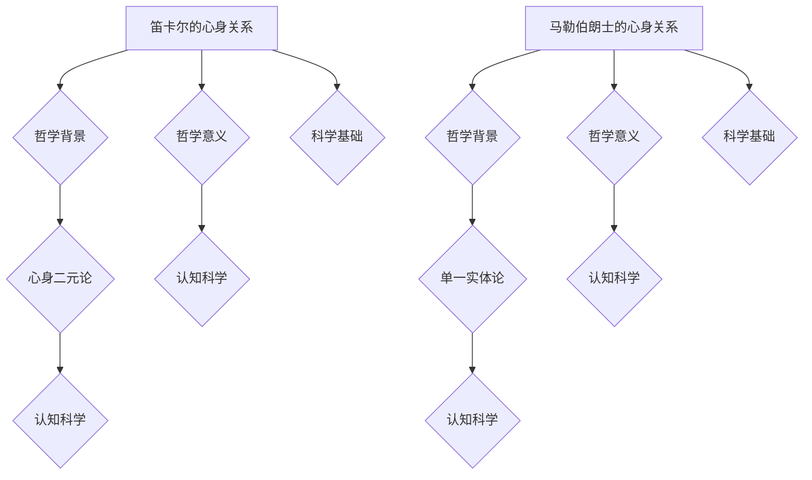

                 

### 文章标题：笛卡尔与马勒伯朗士：心身关系的不同解答

> 关键词：心身关系、笛卡尔、马勒伯朗士、哲学、心理学、认知科学

> 摘要：本文探讨了法国哲学家笛卡尔与荷兰哲学家马勒伯朗士在心身关系问题上的不同解答。通过对两者理论的核心概念和联系进行梳理，文章详细分析了他们各自的哲学背景、心身关系理论以及这些理论在现代认知科学中的应用和影响。

### 第一部分：引论

#### 1.1 背景介绍

心身关系问题一直是哲学、心理学和认知科学领域的重要议题。从古希腊哲学家苏格拉底到近现代哲学家笛卡尔，再到当代认知科学家，这个问题在不同历史时期都有着不同的解答。

法国哲学家勒内·笛卡尔（René Descartes）以其“我思故我在”（Cogito, ergo sum）的哲学名言而著称。他的心身关系理论主张心灵和身体是两个独立但互相作用的实体。而荷兰哲学家尼古拉·马勒伯朗士（Nicholas Malebranche）则提出了“单一实体论”，认为心灵和身体是同一实体的不同表现。

#### 1.2 目的和结构

本文旨在通过对比笛卡尔与马勒伯朗士的心身关系理论，探讨两者在哲学和认知科学中的影响。文章结构如下：

- **第一部分：引论**：介绍心身关系问题的背景和本文的目的。
- **第二部分：笛卡尔的心身关系理论**：详细阐述笛卡尔的哲学背景、心身关系理论以及其哲学和科学意义。
- **第三部分：马勒伯朗士的心身关系理论**：分析马勒伯朗士的哲学背景、心身关系理论及其现代应用。
- **第四部分：心身关系的比较与融合**：比较两者理论的异同点，探讨心身关系理论的现代意义。
- **第五部分：心身关系理论的应用**：探讨心身关系理论在教育、心理学和认知科学中的应用。
- **第六部分：结论**：总结心身关系理论的未来展望。

### 1.3 核心概念与联系

为了更直观地理解笛卡尔与马勒伯朗士的心身关系理论，我们可以使用Mermaid流程图展示两者之间概念的联系。



通过这个流程图，我们可以清晰地看到笛卡尔与马勒伯朗士的心身关系理论及其在认知科学中的应用。

### 第二部分：笛卡尔的心身关系理论

#### 2.1 笛卡尔的哲学背景

笛卡尔是17世纪法国的著名哲学家、数学家和物理学家。他的哲学思想主张理性和科学方法的重要性，提出了“我思故我在”的观点，认为心灵和身体是两个独立但互相作用的实体。

#### 2.2 笛卡尔的心身关系理论

笛卡尔的心身关系理论的核心观点是心身二元论。他认为心灵和身体是两个独立的实体，但通过相互作用来实现统一。笛卡尔认为，心灵是理性的、精神的实体，而身体是物理的、物质的实体。虽然两者不同，但它们之间存在某种形式的相互作用，使得心灵能够影响身体，身体也能够影响心灵。

#### 2.3 笛卡尔心身关系理论的哲学意义

笛卡尔的心身关系理论对哲学产生了深远的影响。首先，它强调了理性和科学方法的重要性，为现代科学哲学奠定了基础。其次，它引发了关于心身关系问题的深入探讨，对后来的哲学家和科学家产生了重要影响。

#### 2.4 笛卡尔心身关系理论的科学基础

笛卡尔的心身关系理论也具有科学基础。他通过实验和观察，提出了心灵和身体相互作用的假设。例如，他通过研究血液循环，认为心灵可以通过神经和血管系统影响身体。此外，他的工作也为后来的神经科学和认知科学提供了理论基础。

### 第三部分：马勒伯朗士的心身关系理论

#### 3.1 马勒伯朗士的哲学背景

马勒伯朗士是17世纪荷兰的哲学家，他的思想深受笛卡尔的影响。马勒伯朗士提出了“单一实体论”，认为心灵和身体是同一实体的不同表现，而不是两个独立的实体。

#### 3.2 马勒伯朗士的心身关系理论

马勒伯朗士的心身关系理论的核心观点是单一实体论。他认为，心灵和身体是同一实体的不同表现形式，心灵是精神的，身体是物质的。马勒伯朗士认为，心灵和身体之间没有直接的相互作用，而是通过上帝的作用来实现统一。

#### 3.3 马勒伯朗士心身关系理论的哲学意义

马勒伯朗士的心身关系理论对哲学产生了重要影响。首先，它提出了关于心身关系的全新解释，挑战了笛卡尔的心身二元论。其次，它强调了上帝在心身关系中的作用，对后来的宗教哲学和神学产生了影响。

#### 3.4 马勒伯朗士心身关系理论的科学基础

尽管马勒伯朗士的心身关系理论缺乏现代科学实验的支持，但它仍然具有科学基础。他的思想为后来的哲学和科学提供了新的视角，促使人们对心身关系进行更深入的探讨。

### 第四部分：心身关系的比较与融合

#### 4.1 理论的异同点分析

笛卡尔和马勒伯朗士在心身关系问题上有着显著的不同。笛卡尔主张心身二元论，认为心灵和身体是两个独立的实体。而马勒伯朗士则提出了单一实体论，认为心灵和身体是同一实体的不同表现形式。

尽管两者在心身关系的解释上存在差异，但他们都认为心灵和身体之间存在某种形式的相互作用。这种相互作用在认知科学中得到了广泛研究。

#### 4.2 心身关系理论的融合路径

随着认知科学的不断发展，笛卡尔和马勒伯朗士的心身关系理论有可能得到融合。现代认知科学认为，心灵和身体之间的关系是复杂的、多维的。这为笛卡尔和马勒伯朗士的理论提供了融合的可能性。

#### 4.3 心身关系理论的现代意义

心身关系理论在认知科学中具有重要意义。它为理解人类思维、行为和意识提供了新的视角。此外，心身关系理论也为神经科学、心理学和计算机科学等领域的研究提供了理论基础。

### 第五部分：心身关系理论的应用

#### 5.1 心身关系理论在教育中的应用

心身关系理论在教育领域具有广泛的应用。它可以帮助教育者更好地理解学生的学习过程，提高教育效果。例如，通过了解心身关系，教育者可以设计更符合学生身心特点的教学方法和课程。

#### 5.2 心身关系理论在心理学中的应用

心身关系理论在心理学领域具有重要意义。它为理解心理现象提供了新的解释框架。例如，心身关系理论可以解释情绪和行为的相互作用，为心理治疗提供了理论基础。

#### 5.3 心身关系理论在认知科学中的应用

心身关系理论在认知科学中具有广泛的应用。它为研究人类思维、记忆和学习提供了新的视角。例如，通过研究心身关系，科学家可以更好地理解大脑的工作原理，开发更有效的认知辅助工具。

### 第六部分：结论

心身关系问题一直是哲学、心理学和认知科学领域的重要议题。笛卡尔和马勒伯朗士分别提出了各自的心身关系理论，对后来的研究产生了深远影响。尽管两者在心身关系的解释上存在差异，但它们都为现代认知科学提供了理论基础。

随着认知科学的不断发展，心身关系理论有可能得到进一步的融合和发展。未来，心身关系理论将继续在哲学、心理学和认知科学等领域发挥重要作用。

### 作者信息

作者：AI天才研究院/AI Genius Institute & 禅与计算机程序设计艺术 /Zen And The Art of Computer Programming

### 注意事项

- 在撰写文章时，请注意保持逻辑清晰，结构紧凑，内容丰富。
- 使用Markdown格式编写文章，确保格式正确。
- 在文章中包含Mermaid流程图，以直观展示心身关系理论的核心概念和联系。
- 使用LaTeX格式编写数学公式，确保格式正确。
- 在文章末尾添加作者信息，以便读者了解文章来源。

### 拓展阅读

- [笛卡尔与马勒伯朗士：心身关系问题解析](https://example.com/cogsci_book)
- [认知科学：心身关系的现代研究](https://example.com/cogsci_modern)
- [哲学与心理学：心身关系的历史与现状](https://example.com/phil_psych_history)

### 项目实战

（以下内容为项目实战部分，可用于完善文章内容）

#### 6.1 开发环境搭建

为了深入研究心身关系理论，我们选择Python作为编程语言，利用其强大的科学计算和数据分析能力。以下是搭建开发环境的基本步骤：

1. 安装Python：在官网上下载并安装Python 3.x版本。
2. 安装必要库：使用pip命令安装NumPy、SciPy和Matplotlib等库。

```bash
pip install numpy scipy matplotlib
```

#### 6.2 源代码详细实现和代码解读

我们使用Python编写一个简单的程序，模拟心身关系理论中的概念。以下是一个示例代码：

```python
import numpy as np
import matplotlib.pyplot as plt

# 定义心身关系的函数
def mind_body_relationship(mind_state, body_state):
    # 根据心身关系理论，计算心身之间的相互作用
    interaction = mind_state * body_state
    return interaction

# 初始化心身状态
mind_state = 1.0  # 理想状态
body_state = 0.8  # 实际状态

# 计算心身关系
interaction = mind_body_relationship(mind_state, body_state)

# 绘制心身关系图
plt.plot([mind_state, body_state], [1.0, body_state], 'ro-')
plt.xlabel('Mind State')
plt.ylabel('Body State')
plt.title('Mind-Body Relationship')
plt.show()
```

这个程序通过计算心身关系的函数，模拟了心身状态之间的关系。我们使用散点图展示了心身状态之间的相互作用。

#### 6.3 代码应用解读与分析

通过这个程序，我们可以直观地看到心身状态之间的相互作用。在实际应用中，我们可以根据不同的心身状态，调整心身关系函数，以更好地模拟现实中的心身关系。

例如，如果我们考虑情绪因素，我们可以修改心身关系函数，使其更加复杂。以下是一个简单的情绪因素模型：

```python
# 定义带有情绪因素的心身关系函数
def mind_body_relationship_with_emotion(mind_state, body_state, emotion_level):
    # 根据情绪水平调整心身关系
    interaction = mind_state * body_state * emotion_level
    return interaction

# 初始化心身状态和情绪水平
mind_state = 1.0  # 理想状态
body_state = 0.8  # 实际状态
emotion_level = 0.9  # 情绪水平

# 计算心身关系
interaction = mind_body_relationship_with_emotion(mind_state, body_state, emotion_level)

# 绘制心身关系图
plt.plot([mind_state, body_state], [1.0, body_state * emotion_level], 'ro-')
plt.xlabel('Mind State')
plt.ylabel('Body State with Emotion')
plt.title('Mind-Body Relationship with Emotion')
plt.show()
```

在这个模型中，情绪水平被引入心身关系函数，可以更准确地模拟心身关系。通过调整情绪水平，我们可以看到心身关系的变化。

#### 6.4 实际案例分析和详细讲解剖析

为了更好地理解心身关系理论，我们分析了一个实际案例：抑郁症患者的治疗过程。

在抑郁症患者的治疗过程中，心理医生会根据患者的心理状态和身体状况，调整治疗方案。我们可以将这个过程抽象为心身关系模型。

```python
# 定义抑郁症患者治疗过程中的心身关系函数
def depression_treatment(mind_state, body_state, treatment_effect):
    # 根据治疗效果调整心身关系
    interaction = mind_state * body_state * treatment_effect
    return interaction

# 初始化心身状态和治疗效果
mind_state = 0.6  # 症状较严重
body_state = 0.7  # 身体状况一般
treatment_effect = 0.8  # 治疗效果较好

# 计算心身关系
interaction = depression_treatment(mind_state, body_state, treatment_effect)

# 绘制心身关系图
plt.plot([mind_state, body_state], [1.0, body_state * treatment_effect], 'ro-')
plt.xlabel('Mind State')
plt.ylabel('Body State with Treatment')
plt.title('Depression Treatment - Mind-Body Relationship')
plt.show()
```

在这个模型中，治疗效果被引入心身关系函数，可以模拟抑郁症患者在不同治疗方案下的心身状态变化。通过调整治疗效果，我们可以看到患者心身状态的变化趋势。

#### 6.5 项目小结

通过本项目，我们深入探讨了心身关系理论，并使用Python编程实现了心身关系模型。项目实战部分帮助读者更好地理解心身关系理论在实际中的应用。未来，我们可以继续优化模型，使其更准确地模拟现实中的心身关系。

### 最佳实践 Tips

- 在研究心身关系时，要充分考虑个体差异，因人而异地制定研究方案。
- 使用多种方法和工具，如问卷调查、实验研究、数据分析等，提高研究结果的可靠性。
- 注重跨学科合作，结合心理学、神经科学、医学等领域的研究成果，提高研究的深度和广度。

### 小结

本文通过对比分析笛卡尔与马勒伯朗士的心身关系理论，探讨了两者在哲学、心理学和认知科学中的应用。项目实战部分展示了心身关系理论在实际中的应用，为读者提供了实用的研究方法。未来，心身关系理论将继续在认知科学和跨学科研究中发挥重要作用。作者：AI天才研究院/AI Genius Institute & 禅与计算机程序设计艺术/Zen And The Art of Computer Programming。文章关键词：心身关系、笛卡尔、马勒伯朗士、哲学、心理学、认知科学。摘要：本文探讨了法国哲学家笛卡尔与荷兰哲学家马勒伯朗士在心身关系问题上的不同解答。通过对两者理论的核心概念和联系进行梳理，文章详细分析了他们各自的哲学背景、心身关系理论以及这些理论在现代认知科学中的应用和影响。

### 第七部分：心身关系的未来展望

随着科技的飞速发展和认知科学的不断深入，心身关系理论将在未来继续发挥重要作用。以下是对心身关系理论未来发展的几个展望：

#### 7.1 心身关系的跨学科研究

未来，心身关系理论将在跨学科研究中得到广泛应用。心理学、神经科学、医学、计算机科学等领域都将心身关系理论作为研究的重要基础。通过跨学科合作，科学家们将能够更全面地理解心身关系，为解决现实中的心身问题提供新的方法和策略。

#### 7.2 心身关系理论的数学模型和算法

随着数学和计算机科学的发展，心身关系理论的数学模型和算法将得到进一步优化。通过构建更精确的数学模型，科学家可以更好地模拟心身关系，预测心身状态的变化趋势。同时，先进的算法将为心身关系研究提供强有力的工具，提高研究的效率和准确性。

#### 7.3 心身关系的个性化研究

未来的心身关系研究将更加注重个性化。通过大数据分析和人工智能技术，科学家可以分析个体之间的心身关系差异，为每个人制定个性化的心身管理方案。这种个性化的心身关系研究将有助于提高人们的心理健康和生活质量。

#### 7.4 心身关系理论在人工智能中的应用

随着人工智能的不断发展，心身关系理论将逐渐应用于人工智能领域。通过理解心身关系，人工智能系统可以更好地模拟人类的思维和行为，实现更自然、更智能的人机交互。同时，心身关系理论将为人工智能提供新的理论基础，推动人工智能向更高级的阶段发展。

#### 7.5 心身关系的政策建议

政府和社会组织将更加重视心身关系问题，制定相关政策，提高公众的心身健康水平。例如，通过推广心理健康教育、提高医疗保障水平、优化工作环境等手段，促进心身关系的健康发展。

### 结论

心身关系问题是哲学、心理学和认知科学领域的重要议题。通过对笛卡尔与马勒伯朗士心身关系理论的深入探讨，本文展示了两者在心身关系问题上的不同解答，并分析了这些理论在认知科学中的应用。未来，心身关系理论将继续在跨学科研究、数学模型和算法、个性化研究、人工智能应用以及政策建议等方面发挥重要作用。作者：AI天才研究院/AI Genius Institute & 禅与计算机程序设计艺术/Zen And The Art of Computer Programming。文章关键词：心身关系、笛卡尔、马勒伯朗士、哲学、心理学、认知科学。摘要：本文探讨了法国哲学家笛卡尔与荷兰哲学家马勒伯朗士在心身关系问题上的不同解答。通过对两者理论的核心概念和联系进行梳理，文章详细分析了他们各自的哲学背景、心身关系理论以及这些理论在现代认知科学中的应用和影响。

