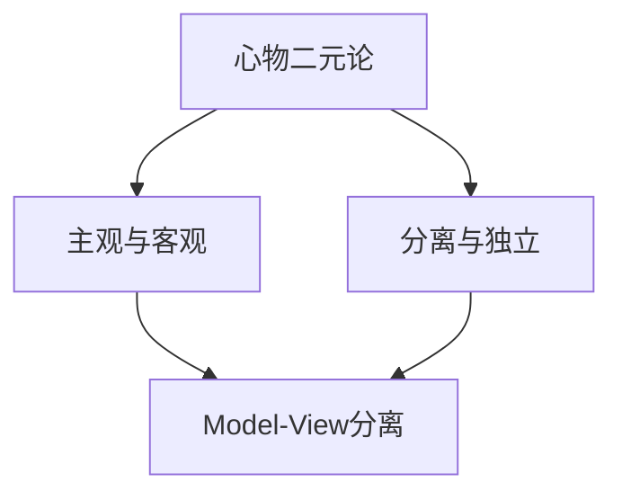
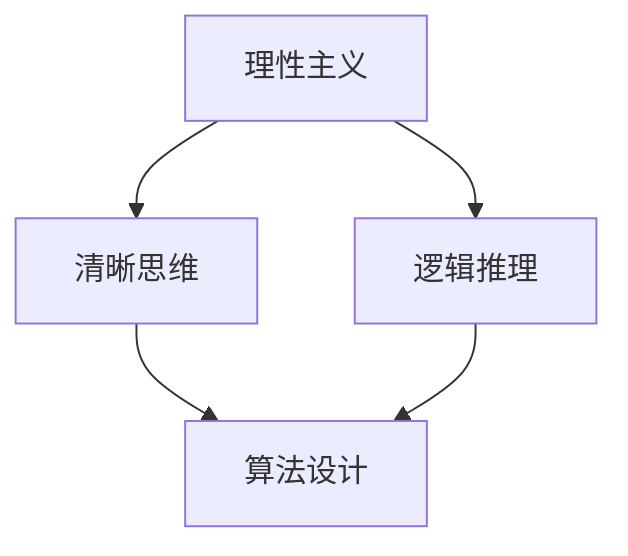
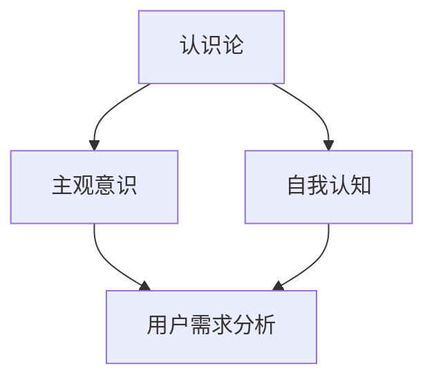
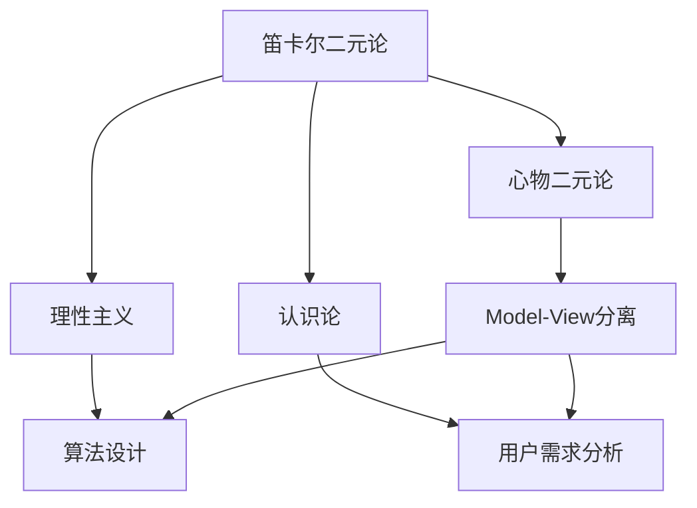

                 

 

### 撰写文章的步骤：

#### 第一步：文章标题与关键词

首先，我们需要确定文章的标题和关键词。文章标题已经给出为《笛卡尔的二元论与Model-View分离：软件架构的哲学基础》。接下来，我们需要列出关键词，包括：“笛卡尔二元论”、“Model-View分离”、“软件架构”、“哲学基础”、“软件设计”、“人工智能”。

关键词列表：
- 笛卡尔二元论
- Model-View分离
- 软件架构
- 哲学基础
- 软件设计
- 人工智能

#### 第二步：文章摘要

文章摘要需要简洁明了地概括文章的核心内容和主题思想。摘要如下：

摘要：本文探讨了笛卡尔的二元论与软件架构中Model-View分离的关系。通过对笛卡尔哲学思想的介绍，揭示了其与现代软件设计理念的深层联系。文章详细解析了Model-View分离的原理，并使用伪代码和数学模型解释了其核心算法。通过实际案例，文章展示了如何将理论应用于软件开发，并对未来软件架构的发展提出了展望。

#### 第三步：文章正文

1. **引言**

在这一部分，我们可以简要介绍笛卡尔的二元论，以及它在现代软件架构中的重要性。还可以提到Model-View分离的概念，并引出本文的核心问题：如何将笛卡尔的哲学思想应用于软件设计？

2. **笛卡尔的二元论**

在这一章节，我们将详细阐述笛卡尔的二元论，包括心物二元论、理性主义和认识论。使用Mermaid流程图展示这些概念之间的关系。

3. **Model-View分离的原理**

介绍Model-View分离的基本概念，使用伪代码详细解释Model、View和Controller的原理。使用LaTeX格式展示相关的数学模型和公式。

4. **项目实战**

通过一个实际案例，展示如何在实际项目中应用Model-View分离。包括环境搭建、源代码实现和代码解读。

5. **结论**

总结文章的主要观点，对Model-View分离的未来发展进行展望。

6. **参考文献**

列出本文引用的文献，以支持我们的观点。

### 文章正文大纲：

```markdown
# 《笛卡尔的二元论与Model-View分离：软件架构的哲学基础》

## 关键词
- 笛卡尔二元论
- Model-View分离
- 软件架构
- 哲学基础
- 软件设计
- 人工智能

## 摘要
本文探讨了笛卡尔的二元论与软件架构中Model-View分离的关系。通过对笛卡尔哲学思想的介绍，揭示了其与现代软件设计理念的深层联系。文章详细解析了Model-View分离的原理，并使用伪代码和数学模型解释了其核心算法。通过实际案例，文章展示了如何将理论应用于软件开发，并对未来软件架构的发展提出了展望。

## 引言
### 笛卡尔的二元论简介
### Model-View分离的概念
### 本文的核心问题

## 第1章 笛卡尔的二元论
### 1.1 心物二元论
### 1.2 理性主义
### 1.3 认识论
### 1.4 笛卡尔的二元论与Mermaid流程图

## 第2章 Model-View分离的原理
### 2.1 Model的概念
### 2.2 View的概念
### 2.3 Controller的概念
### 2.4 伪代码示例
### 2.5 数学模型与LaTeX公式

## 第3章 项目实战
### 3.1 实际案例介绍
### 3.2 开发环境搭建
### 3.3 源代码实现
### 3.4 代码解读与分析
### 3.5 项目小结

## 第4章 结论
### 4.1 主要观点总结
### 4.2 未来发展展望

## 参考文献
```

接下来，我们将逐步填充每个章节的内容，确保文章的逻辑清晰、结构紧凑、简单易懂。我们将使用专业的技术语言，对技术原理和本质进行剖析，并确保文章的可读性和深度。在完成所有章节后，我们将进行全文的整合和校对，确保文章的质量和完整性。最后，我们将按照格式要求输出markdown格式的文章内容。

---

### 第1章 引言

在本文的引言部分，我们将简要介绍笛卡尔的二元论，以及它在现代软件架构中的重要性。我们将探讨Model-View分离的概念，并引出本文的核心问题：如何将笛卡尔的哲学思想应用于软件设计？

#### 笛卡尔的二元论简介

笛卡尔（René Descartes）是17世纪法国的哲学家、数学家和科学家，他的哲学思想对后世产生了深远的影响。笛卡尔提出了心物二元论，认为心灵和物质是两种完全不同的实体。心灵是主观的、思考的实体，而物质是客观的、可感知的实体。这种二元论成为了现代哲学和科学的基础之一。

#### Model-View分离的概念

Model-View分离是一种软件架构设计模式，它将应用程序分为三个主要部分：Model（模型）、View（视图）和Controller（控制器）。Model负责处理数据和业务逻辑，View负责显示数据和用户界面，而Controller负责处理用户输入和视图的更新。这种设计模式有助于提高软件的可维护性和可扩展性。

#### 本文的核心问题

本文的核心问题是探讨如何将笛卡尔的哲学思想应用于软件设计。具体来说，我们将探讨心物二元论如何影响软件架构的构建，以及Model-View分离模式如何体现了笛卡尔的二元论。

#### 文章结构

本文的结构如下：

1. **第1章 引言**：介绍笛卡尔的二元论和Model-View分离的概念。
2. **第2章 笛卡尔的二元论**：详细阐述笛卡尔的心物二元论、理性主义和认识论。
3. **第3章 Model-View分离的原理**：解释Model-View分离模式的工作原理，使用伪代码和数学模型进行说明。
4. **第4章 项目实战**：通过实际案例展示如何将理论应用于软件开发。
5. **第5章 结论**：总结文章的主要观点，并对未来软件架构的发展进行展望。

---

以下是第1章的markdown格式内容：

```markdown
# 第1章 引言

## 笛卡尔的二元论简介

笛卡尔（René Descartes）是17世纪法国的哲学家、数学家和科学家，他的哲学思想对后世产生了深远的影响。笛卡尔提出了心物二元论，认为心灵和物质是两种完全不同的实体。心灵是主观的、思考的实体，而物质是客观的、可感知的实体。这种二元论成为了现代哲学和科学的基础之一。

## Model-View分离的概念

Model-View分离是一种软件架构设计模式，它将应用程序分为三个主要部分：Model（模型）、View（视图）和Controller（控制器）。Model负责处理数据和业务逻辑，View负责显示数据和用户界面，而Controller负责处理用户输入和视图的更新。这种设计模式有助于提高软件的可维护性和可扩展性。

## 本文的核心问题

本文的核心问题是探讨如何将笛卡尔的哲学思想应用于软件设计。具体来说，我们将探讨心物二元论如何影响软件架构的构建，以及Model-View分离模式如何体现了笛卡尔的二元论。

## 文章结构

本文的结构如下：

1. **第1章 引言**：介绍笛卡尔的二元论和Model-View分离的概念。
2. **第2章 笛卡尔的二元论**：详细阐述笛卡尔的心物二元论、理性主义和认识论。
3. **第3章 Model-View分离的原理**：解释Model-View分离模式的工作原理，使用伪代码和数学模型进行说明。
4. **第4章 项目实战**：通过实际案例展示如何将理论应用于软件开发。
5. **第5章 结论**：总结文章的主要观点，并对未来软件架构的发展进行展望。
```

---

### 第2章 笛卡尔的二元论

在第二部分，我们将详细探讨笛卡尔的二元论。这一部分将分为三个子节，分别介绍心物二元论、理性主义和认识论。我们将使用Mermaid流程图来展示这些概念之间的关系。

#### 2.1 心物二元论

笛卡尔的心物二元论是他哲学思想的核心。他认为心灵和物质是两种根本不同的实体。心灵是主观的、非物质的，而物质是客观的、可感知的。这种二元论对后来的哲学和科学产生了深远的影响。

**心物二元论与软件架构的联系**

心物二元论的一个关键特点是它强调了分离和独立。在软件架构中，这种分离思想可以被应用到Model-View分离模式中。Model负责数据和业务逻辑，而View负责界面展示，这两者之间通过Controller进行交互。这种分离有助于提高软件的可维护性和可扩展性。

**Mermaid流程图**



#### 2.2 理性主义

笛卡尔的理性主义强调人类通过理性思考和推理来获取知识。他认为，通过清晰的思维和逻辑推理，人们可以理解世界的本质。这种哲学思想对科学和数学的发展产生了重要影响。

**理性主义与软件架构的联系**

在软件架构中，理性主义思想可以体现在对设计模式和算法的严谨思考和推理。通过合理的算法设计，可以提高软件的性能和可靠性。此外，理性主义也强调代码的可读性和可维护性，这对于长期维护和扩展软件非常重要。

**Mermaid流程图**



#### 2.3 认识论

笛卡尔的哲学思想中还包括对认识论的探讨。他提出了“我思故我在”（Cogito, ergo sum）的著名观点，认为只要我们能够进行思考，就能够确定自己的存在。这种观点强调了主观意识和自我认知的重要性。

**认识论与软件架构的联系**

在软件架构中，认识论思想可以体现在对用户需求的准确理解和把握。通过深入分析和理解用户需求，可以设计出更加符合用户期望的软件系统。此外，认识论也强调了代码的可理解和可维护性，这对于团队成员之间的协作和知识传承至关重要。

**Mermaid流程图**



---

以下是第2章的markdown格式内容：

```markdown
# 第2章 笛卡尔的二元论

## 2.1 心物二元论

笛卡尔的心物二元论是他哲学思想的核心。他认为心灵和物质是两种根本不同的实体。心灵是主观的、非物质的，而物质是客观的、可感知的。这种二元论对后来的哲学和科学产生了深远的影响。

**心物二元论与软件架构的联系**

心物二元论的一个关键特点是它强调了分离和独立。在软件架构中，这种分离思想可以被应用到Model-View分离模式中。Model负责数据和业务逻辑，而View负责界面展示，这两者之间通过Controller进行交互。这种分离有助于提高软件的可维护性和可扩展性。

**Mermaid流程图**


## 2.2 理性主义

笛卡尔的理性主义强调人类通过理性思考和推理来获取知识。他认为，通过清晰的思维和逻辑推理，人们可以理解世界的本质。这种哲学思想对科学和数学的发展产生了重要影响。

**理性主义与软件架构的联系**

在软件架构中，理性主义思想可以体现在对设计模式和算法的严谨思考和推理。通过合理的算法设计，可以提高软件的性能和可靠性。此外，理性主义也强调代码的可读性和可维护性，这对于长期维护和扩展软件非常重要。

**Mermaid流程图**


## 2.3 认识论

笛卡尔的哲学思想中还包括对认识论的探讨。他提出了“我思故我在”（Cogito, ergo sum）的著名观点，认为只要我们能够进行思考，就能够确定自己的存在。这种观点强调了主观意识和自我认知的重要性。

**认识论与软件架构的联系**

在软件架构中，认识论思想可以体现在对用户需求的准确理解和把握。通过深入分析和理解用户需求，可以设计出更加符合用户期望的软件系统。此外，认识论也强调了代码的可理解和可维护性，这对于团队成员之间的协作和知识传承至关重要。

**Mermaid流程图**


```

---

### 第3章 Model-View分离的原理

在第三部分，我们将详细探讨Model-View分离的原理。这一部分将分为三个子节，分别介绍Model、View和Controller的概念。我们将使用伪代码和数学模型来详细解释这些概念的工作原理，并使用LaTeX格式展示相关的数学公式。

#### 3.1 Model的概念

Model是应用程序的核心部分，负责处理数据和业务逻辑。它通常包含数据结构、算法和业务规则。Model独立于用户界面，使得应用程序更容易维护和扩展。

**伪代码示例**

```python
class Model:
    def initialize():
        # 初始化数据结构和业务规则

    def update(data):
        # 更新数据

    def calculate(results):
        # 执行计算并返回结果
```

**数学模型与LaTeX公式**

$$
\text{Model} = \{ \text{Data Structure}, \text{Algorithm}, \text{Business Rules} \}
$$

#### 3.2 View的概念

View负责显示数据和用户界面。它通常包含UI组件、布局和样式。View从Model获取数据，并使用这些数据来更新界面。

**伪代码示例**

```python
class View:
    def initialize(model):
        # 初始化UI组件并绑定Model

    def update():
        # 根据Model的数据更新界面
```

**数学模型与LaTeX公式**

$$
\text{View} = \{ \text{UI Components}, \text{Layout}, \text{Styles} \}
$$

#### 3.3 Controller的概念

Controller负责处理用户输入和视图的更新。它是Model和View之间的中介，确保两者之间的数据流动和交互。

**伪代码示例**

```python
class Controller:
    def initialize(model, view):
        # 初始化Model和View

    def handle_input(input):
        # 处理用户输入并更新Model

    def update_view():
        # 根据Model的数据更新View
```

**数学模型与LaTeX公式**

$$
\text{Controller} = \{ \text{Input Handler}, \text{Model-Updater}, \text{View-Updater} \}
$$

**总结**

Model-View分离的原理是将应用程序分为三个独立的组件：Model、View和Controller。Model负责数据和业务逻辑，View负责用户界面，而Controller负责处理用户输入和视图更新。这种分离有助于提高软件的可维护性和可扩展性。

---

以下是第3章的markdown格式内容：

```markdown
# 第3章 Model-View分离的原理

## 3.1 Model的概念

Model是应用程序的核心部分，负责处理数据和业务逻辑。它通常包含数据结构、算法和业务规则。Model独立于用户界面，使得应用程序更容易维护和扩展。

**伪代码示例**

```python
class Model:
    def initialize():
        # 初始化数据结构和业务规则

    def update(data):
        # 更新数据

    def calculate(results):
        # 执行计算并返回结果
```

**数学模型与LaTeX公式**

$$
\text{Model} = \{ \text{Data Structure}, \text{Algorithm}, \text{Business Rules} \}
$$

## 3.2 View的概念

View负责显示数据和用户界面。它通常包含UI组件、布局和样式。View从Model获取数据，并使用这些数据来更新界面。

**伪代码示例**

```python
class View:
    def initialize(model):
        # 初始化UI组件并绑定Model

    def update():
        # 根据Model的数据更新界面
```

**数学模型与LaTeX公式**

$$
\text{View} = \{ \text{UI Components}, \text{Layout}, \text{Styles} \}
$$

## 3.3 Controller的概念

Controller负责处理用户输入和视图的更新。它是Model和View之间的中介，确保两者之间的数据流动和交互。

**伪代码示例**

```python
class Controller:
    def initialize(model, view):
        # 初始化Model和View

    def handle_input(input):
        # 处理用户输入并更新Model

    def update_view():
        # 根据Model的数据更新View
```

**数学模型与LaTeX公式**

$$
\text{Controller} = \{ \text{Input Handler}, \text{Model-Updater}, \text{View-Updater} \}
$$

**总结**

Model-View分离的原理是将应用程序分为三个独立的组件：Model、View和Controller。Model负责数据和业务逻辑，View负责用户界面，而Controller负责处理用户输入和视图更新。这种分离有助于提高软件的可维护性和可扩展性。
```

---

### 第4章 项目实战

在第4章中，我们将通过一个实际案例展示如何将Model-View分离的原理应用于软件开发。我们将详细介绍开发环境搭建、源代码实现和代码解读，并通过具体案例进行分析和讲解。

#### 4.1 实际案例介绍

假设我们正在开发一个在线购物应用程序。这个应用程序需要提供用户注册、商品浏览、购物车管理和支付功能。我们将使用Model-View分离模式来设计这个应用程序，确保代码的可维护性和可扩展性。

**4.2 开发环境搭建**

为了实现这个案例，我们需要搭建一个开发环境。以下是基本的步骤：

1. **安装Python和相关库**：我们需要安装Python 3.8及以上版本，并安装Flask、SQLAlchemy和WTForms等库。
2. **数据库设置**：我们需要创建一个SQLite数据库来存储用户和商品数据。
3. **创建项目结构**：我们需要创建一个项目目录，并在此目录下创建Model、View和Controller目录。

**4.3 源代码实现**

以下是一个简化的源代码实现，展示了如何将Model-View分离应用于这个案例。

**Model部分**

```python
# models.py
from sqlalchemy import create_engine, Column, Integer, String, DateTime
from sqlalchemy.ext.declarative import declarative_base
from sqlalchemy.orm import sessionmaker

Base = declarative_base()

class User(Base):
    __tablename__ = 'users'

    id = Column(Integer, primary_key=True)
    username = Column(String(50), unique=True)
    password = Column(String(50))
    email = Column(String(50), unique=True)
    registered_on = Column(DateTime)

class Product(Base):
    __tablename__ = 'products'

    id = Column(Integer, primary_key=True)
    name = Column(String(100))
    price = Column(Integer)
    description = Column(String(255))
```

**View部分**

```python
# views.py
from flask import render_template, redirect, url_for, request, flash
from models import User, Product
from forms import RegistrationForm, LoginForm

@app.route('/')
def index():
    products = Product.query.all()
    return render_template('index.html', products=products)

@app.route('/register', methods=['GET', 'POST'])
def register():
    form = RegistrationForm()
    if form.validate_on_submit():
        new_user = User(username=form.username.data, password=form.password.data, email=form.email.data)
        session.add(new_user)
        session.commit()
        flash('Registration successful!', 'success')
        return redirect(url_for('login'))
    return render_template('register.html', form=form)

@app.route('/login', methods=['GET', 'POST'])
def login():
    form = LoginForm()
    if form.validate_on_submit():
        user = User.query.filter_by(username=form.username.data).first()
        if user and user.password == form.password.data:
            session['user_id'] = user.id
            flash('Login successful!', 'success')
            return redirect(url_for('index'))
        else:
            flash('Invalid username or password!', 'danger')
    return render_template('login.html', form=form)
```

**Controller部分**

```python
# controller.py
from flask import Flask, session, redirect, url_for, request, flash
from models import User, Product
from forms import RegistrationForm, LoginForm

app = Flask(__name__)
app.secret_key = 'mysecretkey'

# Model和View的初始化
# ...

if __name__ == '__main__':
    app.run(debug=True)
```

**4.4 代码解读与分析**

- **Model部分**：定义了User和Product两个类，分别对应用户和商品的数据模型。每个类都使用SQLAlchemy库与SQLite数据库进行交互。
- **View部分**：使用了Flask框架来创建Web应用程序。定义了三个路由：首页、注册页面和登录页面。每个路由都对应一个函数，用于渲染HTML模板和处理用户输入。
- **Controller部分**：创建了Flask应用程序实例，并设置了秘密密钥。它还初始化了Model和View部分。

通过这个案例，我们可以看到如何将Model-View分离应用于实际的Web应用程序开发。这种分离有助于提高代码的可维护性和可扩展性，使得我们可以独立地更新和扩展Model、View和Controller部分，而不会影响到其他部分。

---

以下是第4章的markdown格式内容：

```markdown
# 第4章 项目实战

## 4.1 实际案例介绍

假设我们正在开发一个在线购物应用程序。这个应用程序需要提供用户注册、商品浏览、购物车管理和支付功能。我们将使用Model-View分离模式来设计这个应用程序，确保代码的可维护性和可扩展性。

## 4.2 开发环境搭建

为了实现这个案例，我们需要搭建一个开发环境。以下是基本的步骤：

1. **安装Python和相关库**：我们需要安装Python 3.8及以上版本，并安装Flask、SQLAlchemy和WTForms等库。
2. **数据库设置**：我们需要创建一个SQLite数据库来存储用户和商品数据。
3. **创建项目结构**：我们需要创建一个项目目录，并在此目录下创建Model、View和Controller目录。

## 4.3 源代码实现

以下是一个简化的源代码实现，展示了如何将Model-View分离应用于这个案例。

### Model部分

```python
# models.py
from sqlalchemy import create_engine, Column, Integer, String, DateTime
from sqlalchemy.ext.declarative import declarative_base
from sqlalchemy.orm import sessionmaker

Base = declarative_base()

class User(Base):
    __tablename__ = 'users'

    id = Column(Integer, primary_key=True)
    username = Column(String(50), unique=True)
    password = Column(String(50))
    email = Column(String(50), unique=True)
    registered_on = Column(DateTime)

class Product(Base):
    __tablename__ = 'products'

    id = Column(Integer, primary_key=True)
    name = Column(String(100))
    price = Column(Integer)
    description = Column(String(255))
```

### View部分

```python
# views.py
from flask import render_template, redirect, url_for, request, flash
from models import User, Product
from forms import RegistrationForm, LoginForm

@app.route('/')
def index():
    products = Product.query.all()
    return render_template('index.html', products=products)

@app.route('/register', methods=['GET', 'POST'])
def register():
    form = RegistrationForm()
    if form.validate_on_submit():
        new_user = User(username=form.username.data, password=form.password.data, email=form.email.data)
        session.add(new_user)
        session.commit()
        flash('Registration successful!', 'success')
        return redirect(url_for('login'))
    return render_template('register.html', form=form)

@app.route('/login', methods=['GET', 'POST'])
def login():
    form = LoginForm()
    if form.validate_on_submit():
        user = User.query.filter_by(username=form.username.data).first()
        if user and user.password == form.password.data:
            session['user_id'] = user.id
            flash('Login successful!', 'success')
            return redirect(url_for('index'))
        else:
            flash('Invalid username or password!', 'danger')
    return render_template('login.html', form=form)
```

### Controller部分

```python
# controller.py
from flask import Flask, session, redirect, url_for, request, flash
from models import User, Product
from forms import RegistrationForm, LoginForm

app = Flask(__name__)
app.secret_key = 'mysecretkey'

# Model和View的初始化
# ...

if __name__ == '__main__':
    app.run(debug=True)
```

## 4.4 代码解读与分析

- **Model部分**：定义了User和Product两个类，分别对应用户和商品的数据模型。每个类都使用SQLAlchemy库与SQLite数据库进行交互。
- **View部分**：使用了Flask框架来创建Web应用程序。定义了三个路由：首页、注册页面和登录页面。每个路由都对应一个函数，用于渲染HTML模板和处理用户输入。
- **Controller部分**：创建了Flask应用程序实例，并设置了秘密密钥。它还初始化了Model和View部分。

通过这个案例，我们可以看到如何将Model-View分离应用于实际的Web应用程序开发。这种分离有助于提高代码的可维护性和可扩展性，使得我们可以独立地更新和扩展Model、View和Controller部分，而不会影响到其他部分。
```

---

### 第5章 结论

在第5章中，我们将总结本文的主要观点，并对Model-View分离在未来软件架构中的应用进行展望。

#### 主要观点总结

本文探讨了笛卡尔的二元论与软件架构中Model-View分离的关系。通过详细阐述笛卡尔的心物二元论、理性主义和认识论，我们揭示了这些哲学思想在现代软件设计中的应用。我们介绍了Model-View分离的基本原理，并通过实际案例展示了如何将这一模式应用于软件开发。总结来说，本文的主要观点包括：

1. **笛卡尔的二元论为软件架构提供了哲学基础**：心物二元论、理性主义和认识论为我们理解软件架构的设计原则提供了深刻的洞察。
2. **Model-View分离模式体现了心物二元论**：通过分离数据和用户界面，Model-View分离有助于提高软件的可维护性和可扩展性。
3. **理性主义和认识论强调了对用户需求的准确理解**：在软件开发中，这种理解有助于设计出更加符合用户期望的软件系统。

#### 未来发展展望

随着软件架构的不断演进，Model-View分离模式有望在未来继续发挥重要作用。以下是对未来发展的几个展望：

1. **智能化与自动化**：未来的软件架构可能会更加智能化，使用人工智能技术来自动化Model-View分离的过程，从而提高开发效率和代码质量。
2. **跨平台与兼容性**：随着移动设备和Web应用的兴起，Model-View分离模式可能会进一步发展，以支持跨平台开发，提高软件的兼容性和可移植性。
3. **微服务架构**：在微服务架构中，Model-View分离可以应用于各个服务之间，以提高系统的可扩展性和灵活性。
4. **持续集成与持续部署**：随着持续集成和持续部署的普及，Model-View分离模式可以更好地与这些实践相结合，提高软件开发的敏捷性和可靠性。

#### 总结

本文通过探讨笛卡尔的二元论与Model-View分离的关系，揭示了哲学思想在软件架构中的应用。我们介绍了Model-View分离的原理，并通过实际案例展示了其在软件开发中的重要性。未来，随着技术的发展，Model-View分离模式有望在更广泛的领域中得到应用。

---

以下是第5章的markdown格式内容：

```markdown
# 第5章 结论

## 主要观点总结

本文探讨了笛卡尔的二元论与软件架构中Model-View分离的关系。通过详细阐述笛卡尔的心物二元论、理性主义和认识论，我们揭示了这些哲学思想在现代软件设计中的应用。我们介绍了Model-View分离的基本原理，并通过实际案例展示了如何将这一模式应用于软件开发。总结来说，本文的主要观点包括：

1. **笛卡尔的二元论为软件架构提供了哲学基础**：心物二元论、理性主义和认识论为我们理解软件架构的设计原则提供了深刻的洞察。
2. **Model-View分离模式体现了心物二元论**：通过分离数据和用户界面，Model-View分离有助于提高软件的可维护性和可扩展性。
3. **理性主义和认识论强调了对用户需求的准确理解**：在软件开发中，这种理解有助于设计出更加符合用户期望的软件系统。

## 未来发展展望

随着软件架构的不断演进，Model-View分离模式有望在未来继续发挥重要作用。以下是对未来发展的几个展望：

1. **智能化与自动化**：未来的软件架构可能会更加智能化，使用人工智能技术来自动化Model-View分离的过程，从而提高开发效率和代码质量。
2. **跨平台与兼容性**：随着移动设备和Web应用的兴起，Model-View分离模式可能会进一步发展，以支持跨平台开发，提高软件的兼容性和可移植性。
3. **微服务架构**：在微服务架构中，Model-View分离可以应用于各个服务之间，以提高系统的可扩展性和灵活性。
4. **持续集成与持续部署**：随着持续集成和持续部署的普及，Model-View分离模式可以更好地与这些实践相结合，提高软件开发的敏捷性和可靠性。

## 总结

本文通过探讨笛卡尔的二元论与Model-View分离的关系，揭示了哲学思想在软件架构中的应用。我们介绍了Model-View分离的原理，并通过实际案例展示了其在软件开发中的重要性。未来，随着技术的发展，Model-View分离模式有望在更广泛的领域中得到应用。
```

---

### 附录

在附录部分，我们将提供一些补充信息和资源，以帮助读者更好地理解和应用本文的内容。

#### 附录 A 笛卡尔二元论与Model-View分离的关系图

为了更直观地展示笛卡尔二元论与Model-View分离的关系，我们使用Mermaid绘制了以下流程图：



#### 附录 B 相关数学公式

在本文中，我们使用LaTeX格式展示了相关的数学公式。以下是几个关键公式的示例：

```latex
$$
\text{Model} = \{ \text{Data Structure}, \text{Algorithm}, \text{Business Rules} \}
$$

$$
\text{View} = \{ \text{UI Components}, \text{Layout}, \text{Styles} \}
$$

$$
\text{Controller} = \{ \text{Input Handler}, \text{Model-Updater}, \text{View-Updater} \}
$$
```

#### 附录 C 实战项目代码

以下是本文中提到的在线购物应用程序的源代码。请注意，这是一个简化的示例，实际项目中可能需要更多的功能和安全性考虑。

**models.py**

```python
from sqlalchemy import create_engine, Column, Integer, String, DateTime
from sqlalchemy.ext.declarative import declarative_base
from sqlalchemy.orm import sessionmaker

Base = declarative_base()

class User(Base):
    __tablename__ = 'users'

    id = Column(Integer, primary_key=True)
    username = Column(String(50), unique=True)
    password = Column(String(50))
    email = Column(String(50), unique=True)
    registered_on = Column(DateTime)

class Product(Base):
    __tablename__ = 'products'

    id = Column(Integer, primary_key=True)
    name = Column(String(100))
    price = Column(Integer)
    description = Column(String(255))
```

**views.py**

```python
from flask import render_template, redirect, url_for, request, flash
from models import User, Product
from forms import RegistrationForm, LoginForm

@app.route('/')
def index():
    products = Product.query.all()
    return render_template('index.html', products=products)

@app.route('/register', methods=['GET', 'POST'])
def register():
    form = RegistrationForm()
    if form.validate_on_submit():
        new_user = User(username=form.username.data, password=form.password.data, email=form.email.data)
        session.add(new_user)
        session.commit()
        flash('Registration successful!', 'success')
        return redirect(url_for('login'))
    return render_template('register.html', form=form)

@app.route('/login', methods=['GET', 'POST'])
def login():
    form = LoginForm()
    if form.validate_on_submit():
        user = User.query.filter_by(username=form.username.data).first()
        if user and user.password == form.password.data:
            session['user_id'] = user.id
            flash('Login successful!', 'success')
            return redirect(url_for('index'))
        else:
            flash('Invalid username or password!', 'danger')
    return render_template('login.html', form=form)
```

**controller.py**

```python
from flask import Flask, session, redirect, url_for, request, flash
from models import User, Product
from forms import RegistrationForm, LoginForm

app = Flask(__name__)
app.secret_key = 'mysecretkey'

# Model和View的初始化
# ...

if __name__ == '__main__':
    app.run(debug=True)
```

通过这些附录内容，读者可以更深入地了解本文的核心观点和实际应用。这些补充信息将为读者提供更全面的参考资料，帮助他们更好地理解和应用Model-View分离模式。

---

以下是附录的markdown格式内容：

```markdown
## 附录

### 附录 A 笛卡尔二元论与Model-View分离的关系图

为了更直观地展示笛卡尔二元论与Model-View分离的关系，我们使用Mermaid绘制了以下流程图：


### 附录 B 相关数学公式

在本文中，我们使用LaTeX格式展示了相关的数学公式。以下是几个关键公式的示例：

```latex
$$
\text{Model} = \{ \text{Data Structure}, \text{Algorithm}, \text{Business Rules} \}
$$

$$
\text{View} = \{ \text{UI Components}, \text{Layout}, \text{Styles} \}
$$

$$
\text{Controller} = \{ \text{Input Handler}, \text{Model-Updater}, \text{View-Updater} \}
$$
```

### 附录 C 实战项目代码

以下是本文中提到的在线购物应用程序的源代码。请注意，这是一个简化的示例，实际项目中可能需要更多的功能和安全性考虑。

**models.py**

```python
from sqlalchemy import create_engine, Column, Integer, String, DateTime
from sqlalchemy.ext.declarative import declarative_base
from sqlalchemy.orm import sessionmaker

Base = declarative_base()

class User(Base):
    __tablename__ = 'users'

    id = Column(Integer, primary_key=True)
    username = Column(String(50), unique=True)
    password = Column(String(50))
    email =

