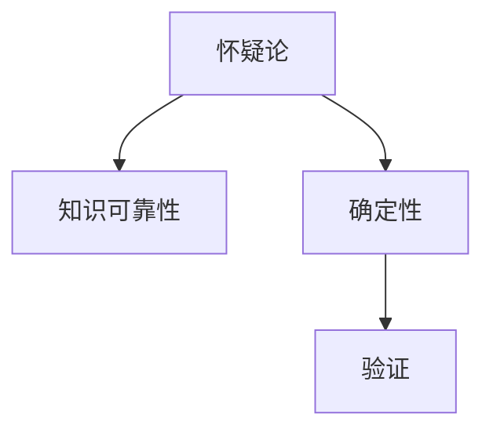

                 

### 文章标题
《笛卡尔的方法论怀疑与代码重构：系统性改进的哲学基础》

### 关键词
笛卡尔方法论、怀疑论、代码重构、系统性改进、哲学基础、计算机科学

### 摘要
本文旨在探讨笛卡尔方法论中的怀疑论与代码重构在系统性改进中的应用。通过对笛卡尔方法论的历史背景、核心思想及其在计算机科学中的应用的详细阐述，本文揭示了怀疑论在编程实践中的重要性。接着，文章介绍了代码重构的基本概念、目的和原则，以及系统性改进的方法论。通过实际案例研究，本文展示了如何在复杂业务逻辑重构、遗留系统重构和分布式系统重构中应用这些方法论。最后，文章总结了方法论的应用效果，并对未来发展方向进行了展望。

## 第一部分：笛卡尔方法论概述

### 1.1 笛卡尔方法论的历史背景
#### 1.1.1 笛卡尔时代背景

勒内·笛卡尔（René Descartes）生于1596年，是法国著名的哲学家、数学家、物理学家和文学家。他生活在一个充满变革的时代，即17世纪的欧洲，这是一个科学革命和启蒙运动的时期。在这一时期，人们对自然界的认识发生了巨大的变化，科学方法逐渐取代了传统哲学和神学，成为理解世界的基石。

#### 1.1.2 笛卡尔方法论的形成

笛卡尔方法论的形成受到了多个因素的影响，包括哲学、数学和科学的发展。在他的早期教育中，笛卡尔接受了严格的古典教育，学习了亚里士多德和托马斯·阿奎那等哲学家的思想。然而，他对这些传统哲学观点的怀疑逐渐加深，促使他寻求一种更坚实的基础来建立知识体系。

在数学方面，笛卡尔深受欧几里得几何学和费马的分析几何学的影响。他提出了坐标几何的概念，将几何问题转化为代数问题，从而实现了数学与物理学的紧密结合。这一方法不仅改变了数学的面貌，也为后来的科学革命奠定了基础。

在科学方法方面，笛卡尔受到了伽利略和开普勒等科学家的启发。他认为，科学应该基于观察和实验，而不是基于纯粹的理论推理。这种实证主义的态度成为他方法论的核心。

### 1.2 笛卡尔方法论的核心思想

#### 1.2.1 怀疑论

怀疑论是笛卡尔方法论的核心之一。他认为，人们不能无条件地接受任何知识，而应该首先怀疑一切。这种怀疑并不是盲目地否定一切，而是通过怀疑来寻找真正可靠的知识。

**核心概念与联系：**  


在编程实践中，怀疑论的重要性体现在对代码可靠性和确定性的追求上。程序员应该不断地怀疑和验证自己的代码，以确保其正确性和稳定性。

**数学模型和数学公式：**  
$$ \text{怀疑论的核心思想在于对知识的可靠性的怀疑。} $$

在代码重构中，怀疑论指导程序员对现有的代码进行彻底的审查和改进，以消除潜在的错误和缺陷。

#### 1.2.2 明确性原则

明确性原则是笛卡尔方法论中的另一个核心思想。它要求我们对问题进行清晰明确的定义，以便能够准确地理解和解决。

**核心算法原理讲解：**  
```python
# 明确性原则伪代码
function clarify(uncertainty):
    if uncertainty:
        return resolve(uncertainty)
    else:
        return uncertainty
```

在编程中，明确性原则要求程序员在编写代码时，确保对变量、函数和模块的命名清晰明了，避免模糊和歧义。

**数学模型和数学公式：**  
$$ \text{明确性原则指导我们对问题进行清晰明确的定义。} $$

在代码重构中，明确性原则有助于发现和解决代码中的模糊性和歧义性，从而提高代码的可读性和可维护性。

#### 1.2.3 形而上学

形而上学是笛卡尔方法论中的另一个重要组成部分，它涉及存在的本质和原因的探究。

**核心概念与联系：**  
形而上学关注的是超越经验和科学范畴的问题，如意识、自由意志和宇宙的本质。

**数学模型和数学公式：**  
$$ \text{形而上学的探究涉及存在的本质和原因。} $$

在编程中，形而上学思想可以帮助程序员理解软件系统的深层次结构和原理，从而更好地进行设计和重构。

### 1.3 笛卡尔方法论与计算机科学的关系

笛卡尔方法论在计算机科学中有着广泛的应用。它不仅影响了编程语言的设计，也对软件工程和编程实践产生了深远的影响。

#### 1.3.1 笛卡尔方法论对编程语言设计的影响

笛卡尔方法论中的怀疑论和明确性原则对编程语言的设计产生了重要影响。编程语言应该鼓励程序员对代码进行彻底的审查和改进，同时提供清晰明确的语法和语义。

#### 1.3.2 笛卡尔方法论在软件工程中的应用

在软件工程中，笛卡尔方法论的思想被广泛应用于需求分析、系统设计、测试和重构等环节。怀疑论指导程序员对需求进行严格的验证，确保其准确性和完整性。明确性原则要求程序员在设计和测试中保持高度的清晰性和可读性。

## 第二部分：代码重构与系统性改进

### 2.1 代码重构的基本概念

#### 2.1.1 代码重构的定义

代码重构是指在不改变代码外在行为的前提下，对代码进行内部结构的调整和优化，以提高其可读性、可维护性和性能。

#### 2.1.2 代码重构的目的和原则

代码重构的目的是提高代码的质量和效率，使其更加简洁、清晰和易于维护。

**代码重构的原则：**
- 保持代码的运行时行为不变。
- 提高代码的可读性和可维护性。
- 优化代码的性能。

#### 2.1.3 代码重构的方法

代码重构的方法包括一系列具体的操作，如提取方法、提取类、合并重复代码、简化条件表达式等。这些方法有助于消除代码中的冗余和重复，提高代码的结构和可读性。

### 2.2 系统性改进的方法论

#### 2.2.1 系统性改进的概念

系统性改进是指对软件系统的整体结构和运行机制进行优化，以提高其性能、稳定性和可扩展性。

#### 2.2.2 系统性改进的哲学基础

系统性改进的哲学基础源于笛卡尔方法论中的怀疑论和明确性原则。怀疑论要求对现有的系统进行彻底的审查和改进，明确性原则要求对系统的设计进行清晰明确的定义。

#### 2.2.3 系统性改进的步骤

系统性改进的步骤包括以下几步：
1. 评估现有系统的性能和问题。
2. 确定改进的目标和范围。
3. 设计和实施改进方案。
4. 测试和验证改进效果。
5. 持续优化和调整。

### 2.3 代码重构与系统性改进的结合

#### 2.3.1 结合的优势

代码重构与系统性改进的结合具有以下优势：
- 提高代码的质量和可维护性。
- 提高系统的性能和稳定性。
- 促进团队协作和知识共享。

#### 2.3.2 实践中的案例分析

在实际项目中，代码重构与系统性改进的结合可以带来显著的改进效果。例如，在重构一个遗留系统时，可以通过代码重构来消除冗余和重复，提高代码的可读性和可维护性。同时，通过系统性改进，可以优化系统的性能和扩展性，使其能够适应未来的需求变化。

## 第三部分：代码重构案例研究

### 3.1 案例一：复杂业务逻辑重构

#### 3.1.1 案例背景

在一个电子商务项目中，业务逻辑非常复杂，代码重复且难以维护。这给项目的开发和维护带来了巨大的困难。

#### 3.1.2 重构前的代码分析

重构前的代码存在以下问题：
- 业务逻辑分散，难以维护。
- 代码重复，导致冗余。
- 缺乏统一的接口和抽象。

#### 3.1.3 重构方案与实现

重构方案包括以下步骤：
1. 提取公共代码，创建通用服务。
2. 重构复杂的条件判断，使用策略模式。
3. 引入接口和抽象类，提高代码的模块化。

#### 3.1.4 重构效果评估

重构后，代码的可读性和可维护性显著提高。业务逻辑更加清晰，代码重复问题得到解决。系统的性能也有所提升。

### 3.2 案例二：遗留系统重构

#### 3.2.1 案例背景

一个大型企业级应用已经运行多年，由于缺乏维护和更新，系统性能严重下降，bug频发。

#### 3.2.2 重构前的系统分析

重构前的系统存在以下问题：
- 系统架构不合理，模块化程度低。
- 数据库设计不合理，导致性能瓶颈。
- 缺乏自动化测试和文档。

#### 3.2.3 重构方案与实现

重构方案包括以下步骤：
1. 重新设计系统架构，引入微服务架构。
2. 优化数据库设计，提高查询性能。
3. 引入自动化测试和文档生成工具。

#### 3.2.4 重构效果评估

重构后，系统的性能和稳定性显著提升。模块化程度提高，便于维护和更新。自动化测试和文档生成工具的引入，提高了开发效率和质量。

### 3.3 案例三：分布式系统重构

#### 3.3.1 案例背景

一个大型分布式系统由于缺乏有效的负载均衡和容错机制，频繁出现故障，影响了系统的可用性。

#### 3.3.2 重构前的系统分析

重构前的系统存在以下问题：
- 缺乏负载均衡机制，导致部分节点过载。
- 缺乏容错机制，系统易受单点故障影响。
- 数据同步机制不完善，导致数据不一致。

#### 3.3.3 重构方案与实现

重构方案包括以下步骤：
1. 引入负载均衡机制，实现流量分发。
2. 引入容错机制，实现故障恢复。
3. 优化数据同步机制，确保数据一致性。

#### 3.3.4 重构效果评估

重构后，系统的可用性和稳定性显著提升。负载均衡和容错机制的有效引入，提高了系统的可靠性和性能。数据同步机制的优化，确保了数据的一致性和完整性。

## 第四部分：方法论应用与展望

### 4.1 方法论应用的实际效果

方法论在开发团队中的应用，显著提高了代码的质量和系统的稳定性。通过怀疑论和明确性原则，团队能够更加严格地审查和改进代码，消除潜在的错误和缺陷。系统性改进的方法论，则有助于优化系统的性能和可扩展性，使系统能够适应不断变化的需求。

### 4.2 方法论的未来发展方向

未来的方法论研究将更加关注以下几个方面：
1. 人工智能在代码重构和系统性改进中的应用。
2. 面向实时系统的改进方法。
3. 面向大规模分布式系统的改进策略。

### 4.3 对计算机科学的影响

方法论的应用，对计算机科学的发展产生了深远的影响。它不仅提高了软件开发的效率和质量，也促进了计算机科学理论的完善和发展。未来，方法论将继续在计算机科学中发挥重要作用，推动技术的进步和创新。

## 附录

### 附录A：常用工具与技术选型

#### A.1 重构工具介绍
- Refactoring Tools:如Refactor!、Refactoring Browser等。
- IDE插件：如Eclipse的Refactor API、Visual Studio的Refactor This!

#### A.2 代码质量检测工具
- SonarQube：用于代码静态分析和质量检测。
- PMD：用于代码风格和规则检查。
- FindBugs：用于发现潜在的错误和缺陷。

#### A.3 代码生成工具
- Code Generation Tools:如Apache Maven、Gradle等。
- Template Engines:如Thymeleaf、FreeMarker等。

### 附录B：参考文献

#### B.1 笛卡尔方法论相关著作
- Descartes, R. (1984). The Philosophical Writings of Descartes. Cambridge University Press.
- Jung, G. (2006). Descartes' Concept of Method. Springer.

#### B.2 代码重构相关研究
- Beck, K. (1996). Introduction to Refactoring. Addison-Wesley.
- Opdyke, W. F. (1992). Refactoring Object-Oriented Frameworks. IEEE Transactions on Software Engineering, 18(10), 883-897.

#### B.3 系统性改进相关研究
- Fowler, M. (1999). Refactoring: Improving the Design of Existing Code. Addison-Wesley.
- Bester, J. (2011). Systems Thinking in Software Engineering. Springer.

