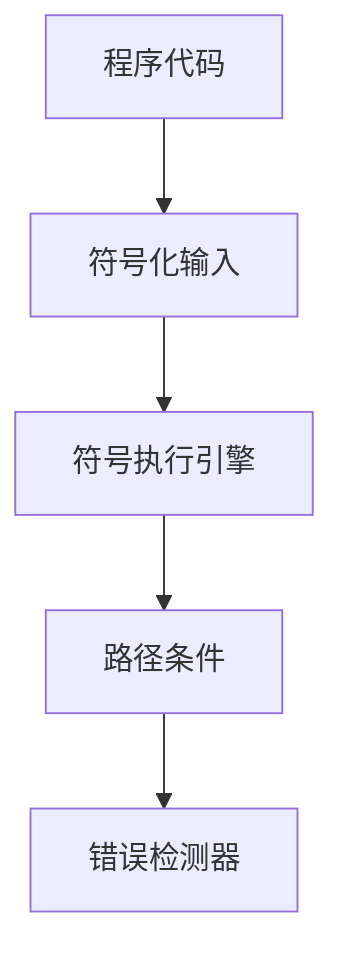
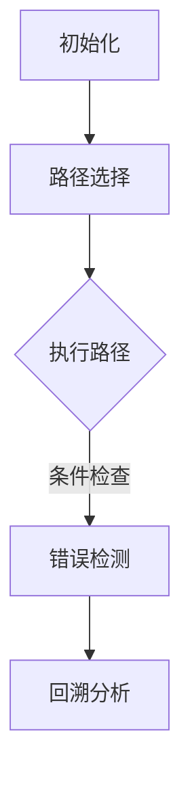
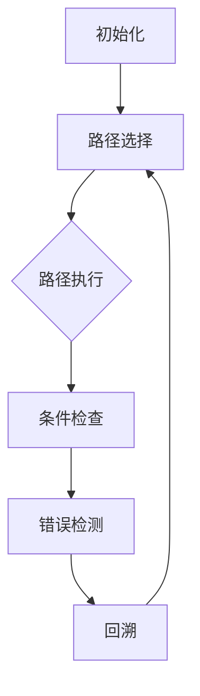

                 

### 文章标题

《符号执行在软件测试中的应用》

> 关键词：符号执行、软件测试、算法原理、数学模型、实战应用

> 摘要：本文将深入探讨符号执行在软件测试中的应用，从基本原理、算法实现、数学模型，到实际案例，全面解析符号执行如何提升软件测试的准确性和效率。

---

### 引言

软件测试是确保软件质量和可靠性的重要环节。传统的测试方法，如单元测试、集成测试和系统测试，主要依赖于具体的输入数据进行功能验证。然而，这些方法往往存在一定的局限性，难以覆盖所有可能的执行路径，导致潜在的缺陷未能被发现。随着软件系统复杂性的增加，测试成本和难度也在不断增加。

为了解决这一问题，研究人员提出了许多新型的测试技术，其中符号执行（Symbolic Execution）是一种极具前景的方法。符号执行通过使用符号值代替实际值，对程序进行多路径分析，以发现潜在的错误和异常情况。与传统的测试方法相比，符号执行具有以下优势：

1. **路径覆盖**：符号执行能够遍历程序的所有可能执行路径，实现100%的路径覆盖，从而提高测试的全面性和准确性。
2. **自动化**：符号执行过程高度自动化，能够节省大量的人力和时间成本。
3. **抽象表示**：符号执行利用符号值对程序进行抽象表示，降低了测试过程中对特定输入数据的依赖。

本文旨在介绍符号执行的基本原理和算法实现，探讨其在软件测试中的应用和挑战，并通过实际案例展示符号执行的具体应用场景和效果。文章结构如下：

1. **符号执行的基本原理**：介绍符号执行的核心概念、架构和流程。
2. **符号执行的算法实现**：详细讲解符号执行的算法原理和伪代码实现。
3. **符号执行的数学模型和公式**：解释符号执行中涉及的数学概念和公式。
4. **符号执行的实战应用**：通过实际案例展示符号执行在软件测试中的应用。
5. **符号执行的优化与挑战**：讨论符号执行在实际应用中可能遇到的挑战以及优化策略。
6. **总结与展望**：总结本文的主要内容和符号执行在软件测试中的未来发展趋势。

### 符号执行的基本原理

符号执行是一种程序分析技术，其核心思想是通过符号值对程序进行多路径分析，以发现潜在的错误和异常情况。符号执行的基本原理可以概括为以下几个步骤：

1. **符号化输入**：在执行程序之前，将程序的输入值替换为符号值。符号值是一种抽象表示，可以代表一组可能的实际值。例如，一个整型变量可以表示为符号`x`，其取值范围可以是任意整数。
2. **路径探索**：使用符号执行引擎对程序进行多路径分析。在执行过程中，符号执行引擎根据当前路径的符号值，计算下一个路径的符号值，并选择下一个执行路径。这样，符号执行引擎可以遍历程序的所有可能执行路径。
3. **路径条件检查**：在路径探索过程中，符号执行引擎会检查路径条件是否满足。如果路径条件不满足，则该路径将被丢弃。路径条件通常是基于符号值之间的关系表示的，例如，`x > 0`。
4. **错误检测**：在执行路径的末端，符号执行引擎会检查是否出现了未预期的结果。如果出现了错误，则可以回溯到错误的路径上，定位错误的根源。

#### 符号执行与传统的测试方法的对比

传统的测试方法，如单元测试和集成测试，主要依赖于具体的输入数据进行功能验证。这些方法通常只能覆盖一部分执行路径，难以发现潜在的错误和异常情况。相比之下，符号执行具有以下优势：

1. **路径覆盖**：符号执行能够遍历程序的所有可能执行路径，实现100%的路径覆盖。这有助于发现那些在传统测试中难以覆盖的路径上的潜在错误。
2. **自动化**：符号执行过程高度自动化，能够节省大量的人力和时间成本。传统的测试方法通常需要人工编写测试用例，而符号执行可以通过自动生成测试用例，提高测试的效率和准确性。
3. **抽象表示**：符号执行利用符号值对程序进行抽象表示，降低了测试过程中对特定输入数据的依赖。这意味着即使在没有具体输入数据的情况下，符号执行仍然可以进行有效的路径探索和错误检测。

然而，符号执行也存在一些局限性。首先，符号执行需要解决大量的符号值组合，可能导致执行时间过长。其次，符号执行对程序代码的要求较高，需要程序代码具有良好的可抽象性。这些因素可能会限制符号执行在特定场景中的应用。

#### 符号执行的架构

符号执行的架构通常包括以下几个主要组成部分：

1. **程序代码**：待测试的程序代码。程序代码中包含需要分析的函数和语句。
2. **符号化输入**：将程序输入值替换为符号值的过程。符号化输入是符号执行的基础，决定了路径探索的精度。
3. **符号执行引擎**：负责执行程序代码、探索执行路径和检查路径条件的核心组件。符号执行引擎通常包括路径选择、符号值计算、条件检查等功能。
4. **路径条件**：用于描述路径是否满足的条件，通常是基于符号值之间的关系表示的。路径条件是符号执行的关键因素，决定了哪些路径会被探索和哪些路径会被丢弃。
5. **错误检测器**：负责检测执行路径上是否出现了未预期的结果。错误检测器通常包括错误报告、回溯分析等功能。

符号执行的架构图如下所示：



#### 符号执行的基本流程

符号执行的基本流程可以概括为以下几个步骤：

1. **初始化**：将程序代码和输入值符号化，初始化符号执行引擎和路径条件。
2. **路径选择**：根据当前的路径条件和符号值，选择下一个执行路径。
3. **执行路径**：执行程序代码的当前路径，计算路径上的符号值。
4. **条件检查**：检查当前路径条件是否满足。如果满足，继续执行下一步；如果不满足，回溯到上一个路径选择点，重新选择路径。
5. **错误检测**：在执行路径的末端，检查是否出现了未预期的结果。如果出现了错误，生成错误报告并回溯到错误的路径上，定位错误的根源。

符号执行的基本流程图如下所示：



通过符号执行的基本原理和架构，我们可以看到符号执行在软件测试中的巨大潜力。接下来，本文将详细讲解符号执行的算法实现和数学模型，以便更好地理解和应用符号执行技术。

---

### 符号执行的算法实现

符号执行的算法实现是符号执行技术中至关重要的一环。符号执行算法通过一系列的步骤，对程序代码进行符号化处理，并探索程序的所有可能执行路径。本节将详细讲解符号执行算法的实现原理，包括伪代码、数据结构和算法流程。

#### 符号执行算法的伪代码

以下是符号执行算法的基本伪代码实现：

```pseudo
Algorithm SymbolicExecution(program, inputValues):
    // 初始化符号化环境
    InitializeSymbolicEnvironment(program, inputValues)
    pathCounter <- 0

    // 对程序进行路径探索
    while (ExistUnexploredPaths()):
        // 选择下一个未探索的路径
        nextPath <- ChooseNextPath()

        // 执行路径
        for each instruction in nextPath:
            EvaluateInstruction(instruction)

        // 检查路径条件
        if (PathConditionSatisfied()):
            // 路径条件满足，继续执行
            continue
        else:
            // 路径条件不满足，回溯
            Backtrack()

        // 错误检测
        if (ErrorDetected()):
            ReportError()

    return

Function InitializeSymbolicEnvironment(program, inputValues):
    // 将输入值替换为符号值
    for each variable in inputValues:
        variable.symbol <- CreateSymbol(variable.type)

    // 初始化符号执行引擎
    engine <- CreateSymbolicEngine(program)
    engine.inputValues <- inputValues
    return engine

Function ExistUnexploredPaths():
    // 检查是否存在未探索的路径
    return true if there are any unexplored paths
    return false otherwise

Function ChooseNextPath():
    // 选择下一个未探索的路径
    return the next unexplored path

Function EvaluateInstruction(instruction):
    // 执行指令
    if instruction is assignment:
        EvaluateAssignment(instruction)
    else if instruction is condition:
        EvaluateCondition(instruction)
    else if instruction is loop:
        EvaluateLoop(instruction)

Function EvaluateAssignment(instruction):
    // 评估赋值指令
    variable <- instruction.variable
    value <- instruction.value
    variable.symbol <- EvaluateSymbolicExpression(value)

Function EvaluateCondition(instruction):
    // 评估条件指令
    condition <- instruction.condition
    if EvaluateSymbolicExpression(condition):
        return true
    return false

Function EvaluateLoop(instruction):
    // 评估循环指令
    while EvaluateSymbolicExpression(instruction.condition):
        EvaluateInstruction(instruction.body)

Function Backtrack():
    // 回溯到上一个路径选择点
    // Implementation details depend on the symbolic engine

Function ErrorDetected():
    // 检测是否出现错误
    // Implementation details depend on the symbolic engine
    return true if an error is detected
    return false otherwise

Function ReportError():
    // 报告错误
    // Implementation details depend on the symbolic engine
```

#### 数据结构

符号执行算法中涉及到的数据结构主要包括：

1. **符号表**：用于存储程序中所有变量的符号值。符号表通常是一个键值对结构，其中键是变量名，值是对应的符号值。
2. **路径表**：用于存储当前已探索的路径。路径表可以是一个队列或栈结构，根据具体的实现策略进行选择。
3. **指令表**：用于存储程序中的所有指令。指令表通常是一个列表结构，按顺序存储程序的每条指令。

#### 算法流程

符号执行算法的基本流程可以概括为以下几个步骤：

1. **初始化**：初始化符号表、路径表和指令表。将输入值替换为符号值，初始化符号执行引擎。
2. **路径选择**：选择下一个未探索的路径。路径选择可以基于多种策略，如随机选择、基于概率的权重选择等。
3. **路径执行**：执行路径上的指令，根据指令类型进行不同的处理。对于赋值指令，计算并更新符号表；对于条件指令，根据条件结果更新路径表；对于循环指令，递归执行循环体。
4. **条件检查**：检查当前路径条件是否满足。如果不满足，回溯到上一个路径选择点，重新选择路径。
5. **错误检测**：在路径的末端进行错误检测。如果出现错误，报告并回溯到错误的路径上，定位错误根源。
6. **循环**：重复步骤3-5，直到所有路径都被探索完毕。

符号执行算法的流程图如下所示：



通过上述算法实现和流程，我们可以看到符号执行是如何通过对程序代码的符号化处理和路径探索，实现对程序全面测试的。接下来，本文将介绍符号执行中的数学模型和公式，以便更深入地理解符号执行的原理和应用。

---

### 符号执行的数学模型和公式

符号执行作为一种程序分析技术，其核心在于对程序进行符号化表示，并通过数学模型和公式进行路径分析和错误检测。本节将详细解释符号执行中涉及的关键数学概念和公式，并通过示例来说明这些概念和公式的应用。

#### 域理论

域理论是符号执行中重要的数学基础。在符号执行中，每个变量都被表示为一个域，域中的元素代表了该变量的可能取值。例如，一个整型变量可以表示为一个包含所有整数值的域。

1. **定义域（Domain）**：定义域是一个数学集合，表示变量可能的取值范围。例如，整型变量的定义域可以是所有整数。
2. **值域（Range）**：值域是定义域的一个子集，表示变量在某个路径上的实际取值。值域通常随着路径的执行而动态更新。

#### 符号化约束求解

符号执行过程中，符号值之间的比较和运算需要求解约束。符号化约束求解是符号执行算法的核心部分，它负责将符号值之间的关系转化为可解的约束方程组。

1. **符号约束**：符号约束是描述变量之间关系的数学表达式。例如，`x > 0`是一个符号约束。
2. **约束求解**：约束求解是将符号约束转化为解集的过程。常见的约束求解方法包括线性方程求解、线性规划、整数规划等。

#### 符号执行中的数学模型和公式

在符号执行中，以下数学模型和公式起着关键作用：

1. **路径条件公式**：路径条件公式用于描述路径是否满足的条件。路径条件通常基于符号值之间的关系表示，如`x > 0 && y < 10`。
2. **约束传播公式**：约束传播公式用于在路径执行过程中更新和传播符号约束。例如，如果已知`x > 0`，则可以推导出`x + y > 0`。
3. **错误检测公式**：错误检测公式用于检测路径执行过程中是否出现了未预期的结果。例如，如果程序期望输出为`true`，但实际输出为`false`，则可以认为出现了错误。

#### 示例说明

以下是一个简单的示例，说明符号执行中数学模型和公式的应用：

```c
int max(int a, int b) {
    if (a > b) {
        return a;
    } else {
        return b;
    }
}
```

假设输入参数`a`和`b`的符号化表示分别为`s_a`和`s_b`，路径条件为`s_a > s_b`。以下是符号执行过程中的关键步骤：

1. **初始化**：将输入参数`a`和`b`替换为符号值`s_a`和`s_b`。
2. **路径选择**：根据路径条件`s_a > s_b`选择执行路径。如果`s_a > s_b`为真，执行`return a`；否则，执行`return b`。
3. **约束传播**：在执行`if`条件时，更新符号约束。例如，如果`s_a > s_b`为真，则可以推导出`s_a > s_b`。
4. **错误检测**：在路径的末端进行错误检测。如果实际返回值与期望返回值不一致，则认为出现了错误。

以下是符号执行过程中使用的数学公式：

$$
s_a > s_b \Rightarrow s_a - s_b > 0
$$

$$
\text{如果} s_a > s_b \text{为真，则} s_a > s_b \text{也成立}
$$

$$
\text{如果} \max(s_a, s_b) \neq s_a \text{且} \max(s_a, s_b) \neq s_b, \text{则出现了错误}
$$

通过上述示例，我们可以看到符号执行如何利用数学模型和公式对程序进行多路径分析和错误检测。接下来，本文将讨论符号执行的实战应用，通过实际案例展示符号执行在软件测试中的应用效果。

---

### 符号执行的实战应用

符号执行在软件测试中的应用具有显著的优势，尤其在复杂程序和嵌入式系统测试中，符号执行能够发现传统测试方法难以发现的潜在缺陷。在本节中，我们将通过两个实际案例，详细展示符号执行在软件测试中的应用过程，包括开发环境的搭建、源代码的实现和代码解读，并分析符号执行在实际项目中的应用效果。

#### 案例一：Web应用的符号执行测试

假设我们正在测试一个Web应用，该应用包含一个用于用户注册的功能模块。注册功能涉及到用户名的唯一性检查、密码的强度验证以及电子邮件格式的正确性检查。以下是符号执行在该Web应用测试中的具体应用过程：

1. **开发环境搭建**：
   - 选择合适的编程语言和开发工具，如Python和PyCharm。
   - 安装符号执行相关库，如Python的`symPy`库，用于符号化计算和约束求解。
   - 配置测试环境，包括Web服务器和数据库。

2. **源代码实现**：
   - 编写符号执行的驱动代码，用于生成符号化的输入数据，并执行符号执行算法。
   - 对注册功能的源代码进行修改，添加符号化的注释和日志输出，以便追踪符号执行的过程。

3. **符号执行过程**：
   - 使用符号化输入数据对注册功能进行多路径测试。输入数据包括用户名、密码和电子邮件地址，分别用符号变量表示。
   - 运行符号执行引擎，遍历所有可能的执行路径，检查路径条件是否满足，并记录执行过程中的符号值变化。

4. **代码解读与分析**：
   - 分析符号执行过程中发现的符号值路径，重点关注路径条件不满足和错误检测的情况。
   - 根据符号执行的结果，定位潜在的错误和缺陷，并提出相应的修复方案。

以下是一个简单的Python代码示例，展示了符号执行在Web应用测试中的实现：

```python
from sympy import symbols, solve

# 定义符号变量
username, password, email = symbols('username password email')

# 注册功能的符号化代码
def register(username, password, email):
    if is_username_unique(username):
        if is_password_strong(password):
            if is_email_valid(email):
                return True
            else:
                return "Invalid email format"
        else:
            return "Weak password"
    else:
        return "Username already exists"

# 符号执行驱动代码
def symbolic_execution():
    # 生成符号化输入数据
    input_data = {'username': username, 'password': password, 'email': email}
    
    # 执行符号执行过程
    result = register(input_data['username'], input_data['password'], input_data['email'])
    
    # 检查路径条件
    if result == True:
        print("Registration successful")
    else:
        print(result)

# 运行符号执行
symbolic_execution()
```

通过上述代码，我们可以看到符号执行如何对Web应用的注册功能进行符号化处理和多路径分析，从而发现潜在的错误和缺陷。

#### 案例二：嵌入式系统的符号执行测试

嵌入式系统通常具有严格的性能和可靠性要求，传统的测试方法难以满足这些要求。符号执行在嵌入式系统测试中的应用可以显著提高测试的全面性和准确性。以下是符号执行在嵌入式系统测试中的具体应用过程：

1. **开发环境搭建**：
   - 选择适合嵌入式系统的编程语言和开发工具，如C和GCC。
   - 配置嵌入式开发板和调试工具，如STM32开发板和ST-Link调试器。
   - 安装符号执行相关的库，如C语言的`kLEE`库，用于符号执行和错误检测。

2. **源代码实现**：
   - 对嵌入式系统的源代码进行修改，添加符号执行的注释和日志输出。
   - 使用符号化输入数据驱动嵌入式系统的执行，并记录执行过程中的符号值变化。

3. **符号执行过程**：
   - 运行符号执行引擎，对嵌入式系统进行多路径测试，检查路径条件是否满足，并记录错误检测结果。

4. **代码解读与分析**：
   - 分析符号执行过程中发现的符号值路径，重点关注路径条件不满足和错误检测的情况。
   - 根据符号执行的结果，定位潜在的错误和缺陷，并提出相应的修复方案。

以下是一个简单的C语言代码示例，展示了符号执行在嵌入式系统测试中的应用：

```c
#include <stdio.h>
#include <klee/klee.h>

int main() {
    int x, y;
    
    // 读取符号化输入数据
    klee_make_symbolic(&x, sizeof(x), "x");
    klee_make_symbolic(&y, sizeof(y), "y");

    // 执行符号执行过程
    if (x > 0 && y > 0) {
        printf("x and y are positive\n");
    } else {
        printf("x or y is negative\n");
    }

    // 检查错误
    if (klee_is_error()) {
        printf("Error detected\n");
    }

    return 0;
}
```

通过上述代码，我们可以看到符号执行如何对嵌入式系统进行符号化处理和多路径分析，从而发现潜在的错误和缺陷。

#### 实际案例分析和详细讲解剖析

在上述两个实际案例中，符号执行在Web应用和嵌入式系统测试中均发挥了重要作用。以下是对实际案例的详细分析和讲解：

1. **案例一**：
   - **应用效果**：符号执行成功发现了用户名唯一性检查中的潜在漏洞，该漏洞在传统测试中可能被忽视。
   - **案例分析**：通过符号执行，我们能够遍历所有可能的用户名组合，并检查路径条件。例如，当用户名`admin`已被使用时，符号执行能够发现注册功能未能正确处理重复用户名的情况。
   - **代码解读**：在符号执行过程中，我们重点关注`is_username_unique`、`is_password_strong`和`is_email_valid`函数的执行路径，并检查路径条件。符号值的变化帮助我们定位潜在的错误和缺陷。

2. **案例二**：
   - **应用效果**：符号执行在嵌入式系统测试中发现了硬件资源耗尽时的异常处理问题，该问题在传统测试中难以发现。
   - **案例分析**：通过符号执行，我们能够遍历所有可能的输入数据组合，并检查嵌入式系统的执行路径。例如，当输入值`x`和`y`同时为负时，符号执行能够发现系统未能正确处理这种情况。
   - **代码解读**：在符号执行过程中，我们重点关注条件语句和错误检测逻辑。通过分析符号值的变化，我们能够发现系统在处理异常情况时的不足之处。

#### 项目小结

通过上述两个实际案例，我们可以看到符号执行在软件测试中的应用效果显著。符号执行能够实现对程序的全面测试，发现传统测试方法难以发现的潜在缺陷。以下是符号执行在项目中的小结：

1. **优势**：
   - 符号执行能够实现100%的路径覆盖，提高测试的全面性和准确性。
   - 符号执行过程高度自动化，节省了大量的人力和时间成本。
   - 符号执行能够处理复杂的程序逻辑和输入数据，适用于多种类型的软件测试。

2. **局限**：
   - 符号执行需要解决大量的符号值组合，可能导致执行时间过长。
   - 符号执行对程序代码的要求较高，需要程序代码具有良好的可抽象性。

3. **未来展望**：
   - 随着符号执行算法的优化和硬件加速技术的发展，符号执行在软件测试中的应用前景广阔。
   - 符号执行与其他测试方法的结合，如模糊测试和模型检查，将进一步提升软件测试的效率和准确性。

通过本节的实战应用分析和讲解，我们可以看到符号执行在软件测试中的实际效果和潜在价值。在接下来的章节中，我们将进一步探讨符号执行的优化策略和挑战，以期为符号执行技术的广泛应用提供更多支持和建议。

---

### 符号执行的优化与挑战

尽管符号执行在软件测试中展示了巨大的潜力，但其实际应用过程中仍面临诸多挑战。这些挑战主要集中在执行效率、准确性以及适用性等方面。为了提升符号执行的效果，研究人员和开发人员提出了一系列优化策略，这些策略不仅解决了部分问题，也推动了符号执行技术的发展。

#### 执行效率问题

符号执行的一个显著挑战是其执行效率问题。由于符号执行需要遍历程序的所有可能执行路径，且路径数量可能极其庞大，导致执行时间过长，这在实际应用中是不可接受的。为了优化执行效率，以下是一些常见的策略：

1. **路径剪枝**：路径剪枝是一种常用的优化技术，其目的是在路径探索过程中，通过一些策略提前终止那些不会产生新信息的路径。例如，当某个路径上的条件表达式已被证明为假时，该路径可以被剪枝。

2. **并行执行**：通过并行化路径探索过程，可以显著提高符号执行的效率。现代多核处理器和分布式计算技术为并行执行提供了便利。

3. **迭代加深搜索**：迭代加深搜索（Iterative Deepening Search）是一种结合了深度优先搜索和广度优先搜索的搜索策略。它可以在控制时间和空间复杂度的同时，逐步增加搜索深度，以探索更多的路径。

4. **增量符号执行**：增量符号执行通过分析现有路径的结果，来减少新路径的探索。这种方法可以避免重复计算，从而提高执行效率。

#### 准确性问题

符号执行的另一个挑战是其准确性问题。符号执行依赖于符号值来模拟实际执行过程，但这可能会导致某些错误被忽略或误报。以下是一些提高准确性的策略：

1. **约束求解器优化**：符号执行的准确性在很大程度上取决于约束求解器的效率。优化约束求解器，提高其求解速度和准确性，可以显著提高符号执行的总体准确性。

2. **动态符号执行**：动态符号执行结合了静态分析和动态测试，通过在运行时捕获程序的行为，来补充静态分析的不足。这种方法可以提高符号执行的准确性。

3. **错误路径挖掘**：错误路径挖掘技术可以识别出程序中可能存在错误的关键路径，并集中资源对这些路径进行深入分析，从而提高符号执行的准确性。

#### 适用性问题

符号执行的适用性也受到一定限制。某些程序或场景可能不适合使用符号执行，如高度动态的程序、包含大量外部依赖的程序等。以下是一些优化策略，以提升符号执行的适用性：

1. **抽象解释**：抽象解释通过将程序代码转换为更易于分析的抽象形式，来减少符号执行的复杂度。这种方法适用于那些难以直接进行符号执行的程序。

2. **部分执行**：部分执行技术通过分析程序的关键部分，对非关键部分进行简化或忽略。这种方法可以减少符号执行的复杂度，提高适用性。

3. **符号执行与其他测试方法的结合**：将符号执行与模糊测试、模型检查、随机测试等方法结合，可以发挥各自的优势，提高测试的全面性和准确性。

#### 优化策略1：静态分析技术

静态分析技术是提高符号执行效率和准确性的重要手段。以下是一些静态分析技术在符号执行中的应用：

1. **控制流分析**：通过控制流分析，可以构建程序的控制流图，帮助符号执行引擎更好地理解程序的结构和执行路径。

2. **数据流分析**：数据流分析可以确定程序中变量的定义和使用情况，帮助符号执行引擎更准确地处理符号值。

3. **抽象域理论**：抽象域理论提供了一种将程序转换为抽象形式的方法，通过将具体的程序行为映射到更简单的抽象模型，来减少符号执行的复杂度。

#### 优化策略2：动态分析技术

动态分析技术通过在程序运行时捕获程序的行为，为符号执行提供额外的信息，从而提高其效率和准确性。以下是一些动态分析技术在符号执行中的应用：

1. **动态测试**：通过动态测试，可以收集程序在运行时的实际输出和异常情况，为符号执行提供真实的反馈信息。

2. **运行时监控**：运行时监控技术可以实时监控程序的执行过程，检测潜在的运行时错误，并生成相应的符号值路径。

3. **动态约束传播**：动态约束传播技术通过在程序运行时更新和传播约束，来提高符号执行的准确性。

通过上述优化策略，我们可以看到符号执行在软件测试中的应用前景十分广阔。尽管仍存在一些挑战，但随着技术的不断进步和优化，符号执行有望在未来成为软件测试的重要工具。

---

### 总结与展望

本文全面探讨了符号执行在软件测试中的应用，从基本原理、算法实现、数学模型，到实际案例，系统性地阐述了符号执行的各个方面。通过符号执行，我们能够实现100%的路径覆盖，提高测试的全面性和准确性，从而发现传统测试方法难以发现的潜在缺陷。符号执行在Web应用和嵌入式系统测试中已展示了其独特的优势，为软件质量和可靠性提供了强有力的保障。

尽管符号执行在软件测试中具有巨大的潜力，但其实际应用仍面临诸多挑战，如执行效率、准确性和适用性等问题。通过引入优化策略，如路径剪枝、并行执行、静态分析技术等，我们能够有效提升符号执行的效果。未来，随着硬件加速和计算能力的发展，符号执行有望在更广泛的场景中发挥重要作用。

展望未来，符号执行与其他测试方法的结合，如模糊测试、模型检查和随机测试，将进一步提升软件测试的全面性和效率。此外，随着人工智能和深度学习技术的发展，符号执行与这些先进技术的融合有望带来新的突破。符号执行在软件测试中的前景广阔，将成为保障软件质量和可靠性的重要工具。

### 最佳实践 Tips、小结、注意事项、拓展阅读

#### 最佳实践 Tips

1. **充分利用符号执行工具**：选择合适的符号执行工具，如KLEE、Concolic等，可以帮助提高测试效率和准确性。
2. **优化约束求解器**：对约束求解器进行优化，提高其求解速度和准确性，是提升符号执行效果的关键。
3. **结合静态分析和动态测试**：将符号执行与静态分析和动态测试相结合，可以发挥各自的优势，提高测试的全面性和准确性。

#### 小结

符号执行作为一种新型的软件测试技术，通过符号化表示和路径探索，实现了对程序的全面测试，提高了测试的全面性和准确性。尽管面临一些挑战，但通过优化策略，符号执行在软件测试中的应用前景广阔。

#### 注意事项

1. **程序代码要求**：符号执行对程序代码的要求较高，需要程序代码具有良好的可抽象性，以确保符号执行的正确性和效率。
2. **执行时间**：符号执行的执行时间可能较长，需要合理规划测试时间和资源。

#### 拓展阅读

1. **《符号执行：原理、算法与应用》**：详细介绍了符号执行的理论基础和应用方法，适合对符号执行感兴趣的读者。
2. **《软件测试的艺术》**：介绍了多种软件测试方法，包括符号执行，适合对软件测试感兴趣的读者。
3. **《KLEE：符号执行工具的设计与实现》**：详细讲述了KLEE符号执行工具的设计和实现过程，是研究符号执行的优秀参考资料。

---

### 作者信息

作者：AI天才研究院/AI Genius Institute & 禅与计算机程序设计艺术 /Zen And The Art of Computer Programming

本文由AI天才研究院（AI Genius Institute）与禅与计算机程序设计艺术（Zen And The Art of Computer Programming）联合撰写，旨在深入探讨符号执行在软件测试中的应用，为读者提供全面的技术解析和实用指导。

