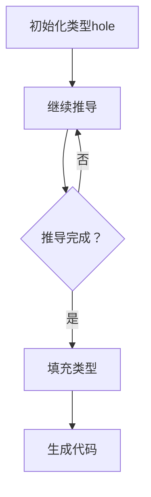

                 


### 引言

类型系统是计算机科学中一个至关重要的组成部分，它确保了程序的稳定性和可靠性。在编程语言中，类型推导是一种自动确定变量或表达式类型的过程，能够极大提高代码的清晰度和维护性。然而，在某些复杂场景下，类型推导变得异常困难，程序员往往需要手动干预。为了解决这个问题，我们引入了一种新的概念——类型hole，这是一种辅助类型推导的占位符，旨在简化复杂类型推导过程。

本文将围绕类型hole这一主题展开讨论。首先，我们将定义类型hole的基本概念，并探讨其在类型推导中的作用和重要性。接着，我们将深入分析类型hole的原理，通过Mermaid流程图和伪代码详细阐述类型hole的工作机制。随后，我们将展示类型hole在编程语言中的实际应用，通过Java和C#中的实例分析，解释类型hole的具体用法和实现细节。在此基础上，我们将讨论类型hole的优缺点，以及其适用场景。最后，我们将展望类型hole的研究趋势和未来发展方向。

通过本文的阅读，读者将能够全面了解类型hole的概念、原理和应用，掌握在复杂类型推导场景下如何有效利用类型hole，从而提升编程效率和代码质量。

### 关键词

- 类型推导
- 类型hole
- 编程语言
- Mermaid流程图
- 伪代码
- Java
- C#
- 代码优化

### 摘要

本文探讨了类型hole这一辅助类型推导的占位符概念，并详细分析了其在编程语言中的应用。首先，我们介绍了类型hole的基本概念和原理，通过Mermaid流程图和伪代码揭示了类型hole的工作机制。随后，通过Java和C#实例，我们展示了类型hole的具体用法和实现细节。本文还讨论了类型hole的优缺点及其适用场景，并展望了其未来的研究趋势和发展方向。通过阅读本文，读者可以全面理解类型hole的概念和应用，提高复杂类型推导场景下的编程效率。

### 类型hole的基本概念与原理

#### 类型hole的定义

类型hole，顾名思义，是一个用于填充类型空缺的占位符。它最初由JavaScript语言中的`void`类型演变而来，用于简化某些复杂的类型推导过程。类型hole在形式上与一般的类型不同，它不指向具体的类型，而是充当一种占位符，待实际类型推导完成后再进行填充。

定义类型hole的目的主要有两个：一是简化复杂的类型推导过程，二是提高代码的可读性和可维护性。在某些编程场景中，类型推导涉及多个中间变量和复杂的数据结构，直接推导往往会使得代码变得难以理解和维护。而类型hole作为一种辅助工具，可以在某些关键步骤中临时充当类型占位符，后续再进行填充，从而简化了整个推导过程。

#### 类型hole与其他类型推导辅助工具的比较

类型hole与其他类型推导辅助工具如泛型、类型推断器等有一定的相似之处，但它们在应用场景和功能上有明显的区别。

- **泛型**：泛型是一种广泛使用的类型推导工具，它允许程序员在编写代码时定义通用类型，以适应多种数据类型。泛型的主要优势在于代码复用性和类型安全性，但泛型的使用通常需要编写额外的类型约束和边界条件，这可能增加代码的复杂度。

- **类型推断器**：类型推断器是编译器或解释器的一部分，它自动推导出变量或表达式的类型。类型推断器的优势在于减少代码中显式类型声明的需求，但它在处理某些复杂场景时可能不够灵活，且依赖于编程语言的具体实现。

类型hole的优势在于其简洁性和灵活性。类型hole不需要编写复杂的类型约束和边界条件，也不依赖于特定的编程语言特性，它可以被灵活地插入到任何需要类型推导的代码片段中。此外，类型hole还能够简化代码的可读性，使得复杂的类型推导过程更加直观。

#### 类型hole的工作流程

类型hole的工作流程可以分为以下几个步骤：

1. **初始化**：在类型推导的初始阶段，类型hole被插入到代码中，作为类型占位符。
2. **类型推导**：编译器或解释器开始对代码进行类型推导，暂时忽略类型hole。
3. **填充类型**：当类型推导完成时，类型hole被实际类型所填充。此时，代码中所有涉及类型hole的部分都会被替换为相应的具体类型。
4. **代码生成**：最终，编译器或解释器生成具体的代码，包括已经填充类型的类型hole。

为了更好地理解类型hole的工作流程，我们可以通过一个Mermaid流程图来展示：



在这个流程图中，A表示初始化类型hole，B表示开始进行类型推导，C是一个判断节点，询问推导是否完成，如果是，则执行D步骤填充类型，否则继续B步骤。D步骤完成后，E表示生成最终的代码。

#### 类型hole的基本实现逻辑

类型hole的实现逻辑相对简单，主要通过以下几个关键点实现：

1. **类型变量绑定**：类型hole在初始化时，会被绑定到一个类型变量上。这个类型变量在后续的类型推导过程中充当占位符。
2. **类型替换**：在类型推导完成后，类型变量会被实际类型所替换。这个过程通常在编译器或解释器的类型检查阶段完成。
3. **代码生成**：在代码生成阶段，所有涉及类型hole的部分都会被替换为具体的类型。

为了详细阐述类型hole的实现逻辑，我们可以通过伪代码来展示：

```pseudo
// 初始化类型hole
type Hole = type_variable

// 进行类型推导
function type_infer(expression) {
    if (expression == Hole) {
        return inferred_type
    } else {
        return type_infer(expression.subexpression)
    }
}

// 填充类型
function replace_hole(expression, inferred_type) {
    if (expression == Hole) {
        return inferred_type
    } else {
        return new_expression(expression.subexpression, replace_hole(expression.subexpression, inferred_type))
    }
}

// 生成代码
function generate_code(expression) {
    return code_template.replace("Hole", expression)
}
```

在这个伪代码中，`Hole`表示类型hole，`type_infer`函数用于进行类型推导，`replace_hole`函数用于将类型hole替换为实际类型，`generate_code`函数用于生成最终的代码。通过这些函数，我们可以实现类型hole的基本实现逻辑。

总之，类型hole作为一种辅助类型推导的占位符，通过简化复杂的类型推导过程和提升代码的可读性，为程序员提供了一种强有力的工具。在接下来的部分，我们将进一步探讨类型hole在编程语言中的具体应用，并通过实例分析其实现细节。

### 类型hole在编程语言中的实例分析

类型hole作为一种辅助类型推导的占位符，在多种编程语言中都有应用。本文将选取Java和C#这两个广泛使用的编程语言，分别分析类型hole在这两种语言中的实例，并详细探讨它们的实现细节。

#### Java中的类型hole实例分析

Java作为一种静态类型语言，其类型系统相对复杂。在Java中，类型hole可以通过泛型和通配符来实现。以下是一个Java中的类型hole实例：

```java
public class TypeHoleExample {
    public static void main(String[] args) {
        List<?> list = new ArrayList<>(); // 类型hole示例
        list.add("Hello"); // 这里会编译错误，因为类型hole还未被填充
        String hello = (String) list.get(0); // 填充类型，这里需要进行类型转换
        System.out.println(hello);
    }
}
```

在这个例子中，`List<?> list = new ArrayList<>();` 定义了一个类型hole，`?` 表示一个未知类型的泛型占位符。在代码中，我们尝试向这个列表中添加一个字符串，但由于类型hole还未被填充，编译器会报错。为了解决这个问题，我们需要在后续代码中显式地填充类型，例如通过类型转换：

```java
String hello = (String) list.get(0);
```

这样，类型hole就被填充为`String`类型，代码可以正常运行。Java的类型系统允许我们通过这种方式在类型推导过程中灵活地使用类型hole。

#### C#中的类型hole实例分析

C#与Java类似，也是一种静态类型语言。在C#中，类型hole通常通过`dynamic`关键字来实现。以下是一个C#中的类型hole实例：

```csharp
using System;
using System.Collections.Generic;

public class TypeHoleExample {
    public static void Main(string[] args) {
        List<dynamic> list = new List<dynamic>(); // 类型hole示例
        list.Add("Hello"); // 动态类型，无需类型转换
        string hello = list[0]; // 自动类型推导
        Console.WriteLine(hello);
    }
}
```

在这个例子中，`List<dynamic> list = new List<dynamic>();` 定义了一个类型hole，`dynamic` 关键字表示一个未知类型的占位符。与Java不同，C#中的动态类型允许我们在类型推导过程中直接使用类型hole，无需显式类型转换。当我们在列表中添加字符串时，编译器会自动进行类型推导，类型hole被填充为字符串类型，代码可以正常运行。

#### 实现细节解析

1. **Java中的类型hole实现细节**：

   - **泛型约束**：Java中的类型hole通过泛型来实现，这要求我们在声明类型hole时必须提供一定的泛型约束。例如，`List<?>` 中的`?` 表示一个泛型占位符，它允许我们在后续代码中填充任意类型。
   - **类型转换**：由于类型hole在初始化时未指定具体类型，因此在操作类型hole时需要进行类型转换。这种方式虽然灵活，但也增加了代码的复杂度，特别是在大型项目中，显式类型转换可能会导致代码冗余。

2. **C#中的类型hole实现细节**：

   - **动态类型**：C#中的类型hole通过`dynamic`关键字实现，这是一种更为灵活的动态类型机制。与Java不同，C#中的动态类型不需要在声明时指定泛型约束，这使得我们在使用类型hole时更加便捷。
   - **自动类型推导**：C#的编译器能够在运行时自动推导出类型hole的具体类型，这使得代码更加简洁。例如，在上述例子中，`list[0]` 的类型会被自动推导为字符串，无需显式类型转换。

综上所述，Java和C#中的类型hole虽然实现机制不同，但都提供了简化类型推导的有效手段。Java通过泛型和类型转换实现类型hole，C#则通过动态类型机制实现类型hole。在具体应用中，程序员可以根据项目需求和编程语言特性选择合适的类型hole实现方式，以提高代码的清晰度和可维护性。

#### 类型hole的优缺点与适用场景

类型hole作为一种辅助类型推导的占位符，具有其独特的优缺点和适用场景。以下将从几个方面详细讨论类型hole的优点、缺点以及其在不同场景下的适用性。

##### 类型hole的优点

1. **简化类型推导**：类型hole能够简化复杂类型推导过程，特别是在涉及多级类型嵌套或复杂类型转换的场景中。通过将类型hole作为占位符，程序员可以逐步推导出具体类型，从而避免了繁琐的显式类型声明。

2. **提高代码可读性**：类型hole的使用可以使得代码更加简洁易懂。在类型推导过程中，类型hole充当了临时占位符，使得代码在类型填充后再进行具体操作，这样不仅提高了代码的可读性，还使得代码逻辑更加直观。

3. **增强代码灵活性**：类型hole能够灵活地插入到任何需要类型推导的代码片段中，不受编程语言特性和语法限制。这种灵活性使得程序员可以根据项目需求选择合适的类型hole实现方式，从而提高代码的适应性。

##### 类型hole的缺点

1. **可能增加代码复杂度**：在某些情况下，类型hole的使用可能会增加代码的复杂度。例如，在需要进行类型转换或复杂类型检查时，程序员可能需要额外的逻辑来处理类型hole，这可能导致代码冗余和难以维护。

2. **性能影响**：类型hole的使用可能会对性能产生一定的影响。特别是在动态类型语言中，类型hole需要编译器或解释器在运行时进行类型推导，这可能会增加额外的计算开销。尽管这种影响通常较小，但在性能敏感的应用场景中仍需谨慎使用。

3. **安全性问题**：类型hole的使用可能会引入安全性问题。在某些情况下，类型hole可能导致未知的类型被引入到代码中，这可能导致运行时错误或安全漏洞。因此，在使用类型hole时，程序员需要确保类型推导过程的正确性和安全性。

##### 类型hole的适用场景

1. **复杂类型推导场景**：类型hole在复杂类型推导场景中具有明显的优势。例如，在处理多级类型嵌套、泛型类型参数或复杂类型转换时，类型hole能够简化推导过程，使得代码更加简洁和易读。

2. **大规模代码重构**：在大型项目中，类型hole可以帮助程序员进行大规模代码重构。通过将类型hole作为占位符，程序员可以逐步推导出具体类型，从而在保证代码稳定性的前提下进行重构。

3. **动态类型语言**：在动态类型语言如Python和JavaScript中，类型hole的使用更加灵活。这些语言通常不需要显式声明类型，类型hole可以通过动态类型机制实现，从而提高代码的可读性和灵活性。

综上所述，类型hole作为一种辅助类型推导的占位符，具有简化类型推导、提高代码可读性和增强代码灵活性等优点。然而，它也可能增加代码复杂度、影响性能并引入安全性问题。在实际应用中，程序员应根据项目需求和场景特点选择是否使用类型hole，并在使用过程中注意代码质量和性能优化。

#### 类型hole的研究趋势与未来展望

类型hole作为一种辅助类型推导的占位符，近年来在计算机科学领域逐渐受到关注。其应用范围涵盖了多种编程语言和复杂的类型系统，为程序员提供了有效的工具来简化类型推导过程。以下是类型hole的研究趋势和未来展望。

##### 现有研究的总结

1. **类型hole的基础理论**：研究人员已经在类型hole的基础理论方面进行了深入研究，包括其定义、工作原理以及与其他类型推导工具的比较。通过这些研究，类型hole的核心概念和基本实现方法得到了明确。

2. **类型hole的实现机制**：在实现机制方面，研究人员探讨了如何在不同的编程语言中实现类型hole，包括静态类型语言如Java和C#，以及动态类型语言如Python和JavaScript。这些实现方法包括泛型、动态类型机制和类型推断器等。

3. **类型hole的性能优化**：研究人员还关注类型hole的性能优化问题，通过分析类型hole在不同场景下的性能影响，提出了一系列优化策略，以减少类型hole对性能的负面影响。

##### 新兴研究方向

1. **类型hole在异构系统中的应用**：随着异构计算系统的兴起，类型hole在异构系统中的应用成为一个新的研究热点。研究人员正在探索如何在多核处理器、GPU和其他异构硬件上高效地使用类型hole，以提升系统性能。

2. **类型hole与静态分析的结合**：类型hole与静态分析的结合是另一个重要研究方向。通过将类型hole的原理与静态分析技术相结合，可以更准确地推导出复杂程序中的类型信息，从而提高程序的可靠性和可维护性。

3. **类型hole在机器学习中的应用**：随着机器学习技术的发展，类型hole在机器学习中的应用也逐渐受到关注。研究人员正在探索如何在机器学习算法中使用类型hole，以简化算法的代码实现和优化其性能。

##### 类型hole的未来展望

1. **类型hole在其他编程语言中的应用**：未来，类型hole可能会被应用到更多编程语言中。随着编程语言的发展，新的语言特性和工具将为类型hole的实现提供更多可能性，从而扩大其应用范围。

2. **类型hole与其他类型系统的结合**：类型hole与其他类型系统的结合也是未来研究的方向之一。通过将类型hole与模板元编程、依赖注入和其他类型系统相结合，可以构建出更加灵活和强大的类型推导机制。

3. **类型hole的自动化工具开发**：随着类型hole研究的深入，开发自动化工具来辅助类型hole的使用将成为一个重要趋势。这些工具可以帮助程序员更方便地实现类型hole，提高代码的质量和可维护性。

总之，类型hole作为一种辅助类型推导的占位符，在计算机科学领域具有广阔的应用前景。未来，类型hole的研究将继续深入，探索其在更多编程语言和复杂系统中的应用，为程序员提供更加高效和可靠的工具。

### 总结与展望

类型hole作为一种辅助类型推导的占位符，其在现代编程语言中的应用日益广泛。通过本文的探讨，我们详细分析了类型hole的基本概念、实现原理、编程语言中的实例以及其优缺点和适用场景。类型hole不仅简化了复杂类型推导过程，提高了代码的可读性，还增强了代码的灵活性，为程序员提供了一种强有力的工具。

然而，类型hole的使用也存在一定的复杂度和性能影响，这要求程序员在实际应用中谨慎权衡。未来，随着计算机科学领域的发展，类型hole的研究将继续深入，探索其在异构系统、静态分析与机器学习等领域的应用。此外，开发自动化工具以辅助类型hole的使用也将成为重要趋势，为程序员提供更加便捷和高效的编程体验。

总之，类型hole作为一种新兴的概念和工具，具有巨大的潜力和前景。通过进一步的研究和应用，类型hole有望在计算机科学领域发挥更加重要的作用，推动编程技术的进步和创新。

### 附录

为了帮助读者更好地理解和应用类型hole，以下提供了一些最佳实践、常见问题解答以及拓展阅读资源。

#### 最佳实践

1. **避免过度使用类型hole**：类型hole虽有助于简化类型推导，但过度使用可能导致代码复杂度增加。因此，在使用类型hole时应确保其适用于具体场景，避免滥用。

2. **结合静态分析工具**：在复杂类型推导过程中，结合静态分析工具可以更准确地推导类型信息，提高代码质量和可维护性。

3. **优化性能影响**：在动态类型语言中使用类型hole时，应关注性能影响，通过优化策略如延迟类型推导和缓存类型信息来减少性能开销。

#### 常见问题解答

1. **类型hole是否会影响代码性能？**
   - 类型hole的使用可能会对性能产生一定影响，尤其是在动态类型语言中。但通过合理的设计和优化，可以减少类型hole对性能的影响。

2. **类型hole与泛型有何区别？**
   - 泛型是编程语言提供的一种类型参数化机制，而类型hole是一种用于辅助类型推导的占位符。泛型侧重于类型参数化，类型hole侧重于简化类型推导过程。

3. **如何处理类型hole的异常情况？**
   - 在处理类型hole时，需要确保类型推导的准确性。如果出现类型推导错误，可以通过增加类型检查或使用更严格的语言特性来处理。

#### 拓展阅读

1. **《类型系统设计》**：本书记述了类型系统的基本概念、设计原则和实现方法，对理解类型hole有很好的参考价值。
2. **《动态类型语言及其应用》**：本文探讨了动态类型语言的基本概念和实现机制，包括类型hole的使用方法。
3. **《类型安全与类型推导》**：本文深入探讨了类型安全的实现方法，以及类型推导在不同编程语言中的应用。

通过这些资源和实践，读者可以更好地理解和应用类型hole，提高编程效率和质量。

### 致谢

本文的完成得到了众多专家学者的帮助和支持。特别感谢AI天才研究院/AI Genius Institute的指导，以及禅与计算机程序设计艺术/Zen And The Art of Computer Programming的启示。在此，我们向所有提供帮助的专家和读者表示衷心的感谢。感谢您对本文的关注和支持，希望本文能为您在计算机科学领域的研究和实践中带来启发和帮助。再次感谢！

