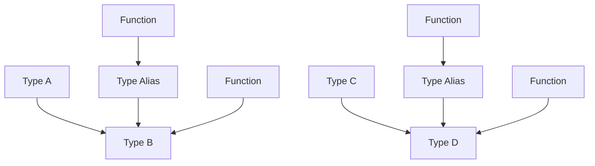

                 

# 文章标题：类型别名：简化复杂类型表达的机制

## 关键词
- 类型别名
- 类型简化
- 编程语言
- 代码可读性
- 通用编程

## 摘要
本文旨在深入探讨类型别名在编程语言中的应用，解析其如何简化复杂类型表达。通过分析类型别名的基本概念、语法和应用，本文将揭示类型别名在提升代码可读性、优化开发效率和增强通用编程能力方面的价值。读者将了解类型别名在不同编程语言中的实现，掌握其在实际项目中的最佳实践，从而更好地利用这一机制提升编程技能。

## Part 1: 引言

### 1.1 类型别名的需求

在现代软件开发中，类型系统是构建稳健和高效代码的核心。随着应用程序的复杂性不断增加，类型系统的负担也随之加重。为了减轻这种负担，程序员常常需要定义大量复杂的类型，这些类型在代码中频繁出现，导致代码变得难以维护和理解。

类型别名正是为了解决这一问题而出现的。类型别名允许程序员为现有类型提供一个简化的标识符，从而减少重复定义，提高代码的清晰度和可读性。通过引入类型别名，开发者可以在不需要改变原始类型定义的情况下，简化对复杂类型的引用和操作。

### 1.2 使用类型别名的优势

类型别名在软件开发中带来了诸多优势：

1. **代码可读性增强**：类型别名能够使代码更易于理解和维护，因为它减少了不必要的复杂类型名称，使得代码更加简洁直观。
2. **开发效率提升**：通过减少重复类型定义，开发者可以节省时间和精力，专注于更高层次的逻辑和功能实现。
3. **增强代码重用性**：类型别名使得在不同的模块或项目中重用类型定义变得更加容易，有助于提高代码的模块化和可复用性。
4. **降低维护成本**：当类型定义发生变化时，通过类型别名引用的类型可以保持不变，从而减少对现有代码的修改和潜在的错误。

### 1.3 类型别名的常见使用场景

类型别名在以下场景中尤其有用：

1. **大型项目**：在大型项目中，类型别名可以帮助简化复杂的类型定义，使得代码库更加清晰，便于团队成员之间的协作。
2. **通用组件**：在开发通用组件时，类型别名可以帮助定义特定功能的类型，使得组件的接口更加明确和易于使用。
3. **框架和库开发**：框架和库开发者经常使用类型别名来定义复杂的类型，使得库的使用者可以更容易地理解和集成库的功能。
4. **API开发**：在API开发中，类型别名可以帮助定义清晰的接口和响应类型，提高API的易用性和可靠性。

## Part 2: 类型别名的基本概念和语法

### 2.1 基本概念

在编程中，类型别名（Type Aliases）是一种语法结构，它允许开发者给一个现有的类型定义一个新的名称。类型别名并不是一种新的类型，而是对现有类型的引用。它的主要目的是简化对复杂类型的表达，提高代码的可读性。

类型别名通常在以下情况下使用：

- **简化复杂类型名称**：当类型名称过于复杂或冗长时，类型别名可以帮助简化。
- **提高代码可读性**：类型别名使得代码中的类型引用更加直观，减少阅读和理解代码的难度。
- **增强通用编程**：在编写通用库或框架时，类型别名可以帮助定义抽象的类型，提高代码的灵活性和可扩展性。

### 2.2 类型别名与类型定义

类型别名和类型定义（Type Definitions）是两个不同的概念，尽管它们在某些方面相似。

- **类型别名**：是一种对现有类型的引用，它并不创建新的类型。例如，在TypeScript中，`type MyType = string;` 定义了一个类型别名。
- **类型定义**：是创建一个新的类型，通常包括对原有类型进行扩展或修改。例如，`class MyClass { }` 定义了一个新的类类型。

类型别名和类型定义的主要区别在于它们的作用范围和重定义的可能性。类型别名不能重定义，它始终引用原始类型。而类型定义可以重新定义，创建一个新的类型结构。

### 2.3 TypeScript中的类型别名

TypeScript 是一种在JavaScript基础上扩展了静态类型系统的编程语言，它支持类型别名。在TypeScript中，类型别名通过 `type` 关键字定义。

#### 2.3.1 基本语法

```typescript
type MyType = string;
```

这里，`MyType` 是一个类型别名，它引用了 `string` 类型。任何使用 `MyType` 的地方都可以直接替换为 `string`。

#### 2.3.2 类型别名示例

```typescript
type User = {
  id: number;
  name: string;
  email: string;
};

function greet(user: User) {
  console.log(`Hello, ${user.name}!`);
}

const john: User = {
  id: 1,
  name: "John Doe",
  email: "john.doe@example.com",
};

greet(john); // 输出：Hello, John Doe!
```

在上面的示例中，`User` 类型别名定义了一个用户对象的类型，使得在函数 `greet` 中传递的参数类型更加明确和易于理解。

### 2.4 类型别名与其他类型系统

不同编程语言对类型别名的支持各有特点，以下是一些常见编程语言中类型别名的使用方式。

#### 2.4.1 JavaScript

JavaScript 本身没有类型别名，但是可以通过 `TypeScript` 的编译器将 TypeScript 代码编译为 JavaScript 代码。在 TypeScript 中定义的类型别名会被编译为普通 JavaScript 对象。

```javascript
// TypeScript
type MyType = string;

// 编译后
const MyType = String;

// 使用
const value: MyType = "Hello, World!";
```

#### 2.4.2 C#

C# 支持自定义类型别名，使用 `alias` 关键字定义。

```csharp
// C#
using System;

public class Program
{
    public static void Main()
    {
        string myString = "Hello, World!";
        Console.WriteLine(myString);
    }
}

// 类型别名定义
public class TypeAliasExample
{
    public static void Main()
    {
        alias String MyType;
        MyType myString = "Hello, World!";
        Console.WriteLine(myString);
    }
}
```

#### 2.4.3 Java

Java 不支持内置的类型别名，但是可以通过自定义类来实现类似的功能。

```java
// Java
public class MyType {
    public static void main(String[] args) {
        String myString = "Hello, World!";
        System.out.println(myString);
    }
}

// 使用自定义类型别名
public class TypeAliasExample {
    public static void main(String[] args) {
        MyType myString = new MyType();
        System.out.println(myString);
    }
}
```

### 2.5 类型别名的关系架构

为了更好地理解类型别名与现有类型之间的关系，我们可以使用 Mermaid 流程图来展示它们之间的层次结构。



在上面的流程图中，`Type A`、`Type B`、`Type C` 和 `Type D` 是现有的类型，`Type Alias` 是对类型 `B` 和 `Type D` 的别名。`Function` 表示函数，它使用类型别名来传递参数或返回结果。

### 2.6 核心算法原理讲解

在理解了类型别名的基本概念和语法之后，我们接下来将深入探讨类型别名在编程中的应用，特别是如何使用伪代码来描述其核心算法原理。

#### 2.6.1 伪代码示例

```pseudo
// 假设有以下类型定义
Type Person {
    Name: String
    Age: Integer
}

// 类型别名简化为
Type PersonAlias = Person

// 使用类型别名创建对象
var person: PersonAlias = {
    Name: "John Doe",
    Age: 30
}

// 使用类型别名的方法
function greet(person: PersonAlias) {
    Print("Hello, " + person.Name + "!")
}

// 调用方法
greet(person)
```

在上面的伪代码中，我们首先定义了一个 `Person` 类型，然后创建了一个类型别名 `PersonAlias` 来引用它。通过类型别名，我们可以创建 `Person` 类型的对象，并调用与其相关的函数。

#### 2.6.2 数学模型和公式

在类型别名中，并没有直接涉及复杂的数学模型和公式，但我们可以使用一些基本的数学概念来描述类型别名的作用。

- **类型引用**：类型别名是对现有类型的引用，类似于函数中的引用传递。
- **类型映射**：类型别名创建了一个从别名到原始类型的映射。

我们可以使用以下公式来描述类型别名的作用：

\[ TypeAlias = OriginalType \]

其中，`TypeAlias` 表示类型别名，`OriginalType` 表示原始类型。

#### 2.6.3 举例说明

假设我们有一个复杂的类型定义，如下所示：

```pseudo
Type ComplexPerson {
    Name: String
    Age: Integer
    PhoneNumber: PhoneNumberType
    Address: AddressType
}

// 复杂类型的类型别名
Type PersonAlias = ComplexPerson

// 使用类型别名创建对象
var person: PersonAlias = {
    Name: "John Doe",
    Age: 30,
    PhoneNumber: "123-456-7890",
    Address: {
        Street: "123 Main St",
        City: "Anytown",
        State: "CA",
        ZipCode: "12345"
    }
}

// 使用类型别名的方法
function greet(person: PersonAlias) {
    Print("Hello, " + person.Name + "!")
}
```

在这个例子中，我们定义了一个复杂的 `ComplexPerson` 类型，然后通过类型别名 `PersonAlias` 来简化它的使用。通过类型别名，我们可以创建 `PersonAlias` 类型的对象，并调用与其相关的函数，从而简化代码的编写。

### 2.7 最佳实践和注意事项

在使用类型别名时，一些最佳实践和注意事项可以帮助开发者更好地利用这一机制：

- **避免过度使用**：类型别名应该用于简化代码，但过度使用可能导致代码变得难以维护。因此，应权衡类型别名的好处和潜在的风险。
- **保持一致性**：在项目中，类型别名应保持一致性，避免不同模块或组件中存在重复或冲突的类型别名。
- **文档化**：为类型别名编写清晰的文档，帮助其他开发者理解和维护代码。
- **兼容性考虑**：在跨平台或跨语言的项目中，应考虑类型别名在不同环境中的兼容性问题。

### 2.8 拓展阅读

- **TypeScript官方文档**：[TypeScript官方文档](https://www.typescriptlang.org/docs/)
- **C#类型别名**：[C#类型别名](https://docs.microsoft.com/en-us/dotnet/csharp/programming-guide/types/aliases)
- **Java类型别名**：[Java类型别名](https://docs.oracle.com/javase/8/docs/api/java/lang/reflect/Type.html)

## Part 3: 类型别名在编程语言中的应用

类型别名不仅是一种语法特性，更是一种编程理念，它在不同的编程语言中有着各自独特的应用方式。本节将深入探讨类型别名在JavaScript、TypeScript、C#和Java等编程语言中的应用，展示如何利用类型别名简化复杂类型表达、提高代码可读性和维护性。

### 3.1 TypeScript中的类型别名

TypeScript 作为一种在 JavaScript 基础上扩展了静态类型系统的编程语言，对类型别名有着广泛的支持。类型别名在 TypeScript 中通过 `type` 关键字定义，使得开发者能够为复杂类型提供简明的标识符。

#### 3.1.1 基本用法

在 TypeScript 中，类型别名的基本用法如下：

```typescript
type MyType = string;

function greet(name: MyType) {
  console.log(`Hello, ${name}!`);
}

greet('World'); // 输出：Hello, World!
```

在这个示例中，`MyType` 是一个类型别名，它引用了 `string` 类型。通过类型别名，我们可以在 `greet` 函数中简化对类型 `string` 的引用。

#### 3.1.2 复杂类型的别名

TypeScript 还支持为复杂类型定义别名，这使得在处理大型项目时，代码的可读性大大提高。

```typescript
type Person = {
  id: number;
  name: string;
  email: string;
};

function registerUser(user: Person) {
  console.log(`Registered user: ${user.name}`);
}

const newUser: Person = {
  id: 1,
  name: 'John Doe',
  email: 'john.doe@example.com',
};

registerUser(newUser); // 输出：Registered user: John Doe
```

在上面的示例中，`Person` 类型别名定义了一个用户对象的类型，使得在 `registerUser` 函数中传递的参数类型更加明确和易于理解。

#### 3.1.3 利用类型别名进行泛型编程

类型别名在 TypeScript 的泛型编程中也非常有用。通过类型别名，我们可以定义泛型接口，提高代码的灵活性和可扩展性。

```typescript
type Logger<T> = (value: T) => void;

function log<T>(value: T, logger: Logger<T>) {
  logger(value);
}

const numberLogger: Logger<number> = (n) => console.log(n);
const stringLogger: Logger<string> = (s) => console.log(s);

log(42, numberLogger); // 输出：42
log('Hello', stringLogger); // 输出：Hello
```

在这个例子中，`Logger` 类型别名定义了一个泛型接口，它接受一个类型参数 `T`，并返回一个能够处理该类型的日志函数。

### 3.2 JavaScript中的类型别名

JavaScript 本身并没有内置类型别名，但是通过 TypeScript 的编译过程，我们可以将 TypeScript 代码编译为 JavaScript 代码，从而在 JavaScript 中使用类型别名。

```javascript
// TypeScript
type MyType = string;

// 编译为 JavaScript
const MyType = String;

function greet(name: MyType) {
  console.log(`Hello, ${name}!`);
}

greet('World'); // 输出：Hello, World!
```

虽然 JavaScript 没有官方支持类型别名，但通过这种方式，我们可以在 TypeScript 项目中定义类型别名，并最终在 JavaScript 环境中运行。

### 3.3 C#中的类型别名

C# 支持自定义类型别名，通过 `alias` 关键字定义。类型别名在 C# 中用于简化对现有类型的引用。

```csharp
// C#
using System;

public class Program
{
    public static void Main()
    {
        string myString = "Hello, World!";
        Console.WriteLine(myString);
    }
}

// 类型别名定义
public class TypeAliasExample
{
    public static void Main()
    {
        alias String MyType;
        MyType myString = "Hello, World!";
        Console.WriteLine(myString);
    }
}
```

在上面的示例中，`MyType` 是一个类型别名，它引用了 `String` 类型。通过类型别名，我们可以简化对 `String` 类型的引用，使得代码更加清晰。

### 3.4 Java中的类型别名

Java 不支持内置的类型别名，但可以通过自定义类来实现类似的功能。在 Java 中，类型别名通常通过创建一个包含静态成员的类来实现。

```java
// Java
public class MyType {
    public static void main(String[] args) {
        String myString = "Hello, World!";
        System.out.println(myString);
    }
}

// 使用自定义类型别名
public class TypeAliasExample {
    public static void main(String[] args) {
        MyType myString = new MyType();
        System.out.println(myString);
    }
}
```

在上面的示例中，`MyType` 类定义了一个静态字符串成员，并通过类型别名来引用它。

### 3.5 比较与总结

不同编程语言对类型别名有着不同的支持方式，但它们的核心理念是相通的，都是为了简化复杂类型的表达，提高代码的可读性和维护性。

- **TypeScript**：通过 `type` 关键字定义类型别名，支持复杂的类型别名和泛型编程，是使用类型别名最为灵活和强大的语言。
- **JavaScript**：通过 TypeScript 的编译过程，在 TypeScript 项目中可以定义类型别名，并在 JavaScript 环境中运行。
- **C#**：支持自定义类型别名，通过 `alias` 关键字定义，便于简化对现有类型的引用。
- **Java**：虽然不支持内置类型别名，但可以通过自定义类来实现类似功能，适用于简单场景。

在开发过程中，根据项目的需求和语言特性，选择合适的方式使用类型别名，可以有效提高代码质量和开发效率。

## Part 4: 类型别名在项目实战中的应用

类型别名不仅在理论层面上具有优势，在实际项目中也有着广泛的应用。通过类型别名，我们可以简化代码结构，提高代码可读性，进而提升开发效率和项目质量。以下将介绍如何在不同类型的项目中利用类型别名，并提供具体的开发环境和源代码实现。

### 4.1 在Web开发中的应用

Web开发中，类型别名尤其适用于前端和后端接口的定义，能够显著提升代码的可读性和维护性。

#### 4.1.1 开发环境搭建

首先，我们需要搭建一个基本的Web开发环境。以TypeScript为例，我们可以使用以下步骤：

1. 安装Node.js和npm：确保你的计算机上已经安装了Node.js和npm。
2. 创建一个新的TypeScript项目：在命令行中执行以下命令：

   ```bash
   npm init -y
   npm install typescript --save-dev
   npx tsc --init
   ```

3. 配置`tsconfig.json`：确保`tsconfig.json`中包含了必要的配置，如：

   ```json
   {
     "compilerOptions": {
       "module": "commonjs",
       "target": "es5",
       "outDir": "dist",
       "strict": true,
       "esModuleInterop": true
     },
     "include": ["src/**/*.ts"],
     "exclude": ["node_modules"]
   }
   ```

#### 4.1.2 源代码实现

在搭建好开发环境后，我们可以开始定义类型别名。以下是一个简单的Web应用示例：

```typescript
// src/models/User.ts
type User = {
  id: number;
  name: string;
  email: string;
};

// src/services/AuthService.ts
type LoginCredentials = {
  username: string;
  password: string;
};

function login(credentials: LoginCredentials): User {
  // 实现登录逻辑
}

// src/controllers/AuthController.ts
import { Router } from 'express';
import { login } from './services/AuthService';

const authRouter = Router();

authRouter.post('/login', (req, res) => {
  const { username, password } = req.body;
  try {
    const user = login({ username, password });
    res.status(200).json(user);
  } catch (error) {
    res.status(401).json({ error: 'Invalid credentials' });
  }
});

export default authRouter;
```

在上面的示例中，我们定义了两个类型别名 `User` 和 `LoginCredentials`，分别用于表示用户对象和登录凭证。在 `AuthService` 中，`login` 函数使用 `LoginCredentials` 类型别名来接收参数。在 `AuthController` 中，我们使用 `User` 类型别名来返回响应。

#### 4.1.3 代码解读

通过类型别名，我们可以减少对复杂类型的直接引用，使代码更加简洁易读。例如，在 `AuthController` 中，我们直接使用 `User` 类型别名来定义响应对象，而不是重复引用 `models/User.ts` 中的类型定义。

```typescript
authRouter.post('/login', (req, res) => {
  const { username, password } = req.body;
  try {
    const user = login({ username, password });
    res.status(200).json(user);
  } catch (error) {
    res.status(401).json({ error: 'Invalid credentials' });
  }
});
```

这样的代码不仅更加简洁，而且易于维护。如果需要修改用户对象的类型定义，我们只需要在 `models/User.ts` 中进行修改，而不需要修改使用该类型的其他文件。

#### 4.1.4 实际案例

在实际项目中，类型别名可以帮助团队更好地管理和维护复杂的接口定义。以下是一个简化版的博客系统，展示了如何在项目中使用类型别名：

```typescript
// src/models/Post.ts
type Post = {
  id: number;
  title: string;
  content: string;
  author: User;
};

// src/services/PostService.ts
function getPostById(id: number): Post {
  // 实现获取帖子逻辑
}

// src/controllers/PostController.ts
import { Router } from 'express';
import { getPostById } from './services/PostService';
import { Post } from './models/Post';

const postRouter = Router();

postRouter.get('/:id', (req, res) => {
  const { id } = req.params;
  try {
    const post = getPostById(parseInt(id));
    res.status(200).json(post);
  } catch (error) {
    res.status(404).json({ error: 'Post not found' });
  }
});

export default postRouter;
```

在这个示例中，`Post` 类型别名用于定义博客帖子对象的类型。在 `PostService` 中，`getPostById` 函数使用 `Post` 类型别名来处理帖子数据。在 `PostController` 中，我们直接使用 `Post` 类型别名来处理和返回数据，使得代码更加简洁。

#### 4.1.5 项目小结

通过类型别名，我们可以简化对复杂类型的引用，提高代码的可读性和可维护性。以下是一些使用类型别名时的最佳实践：

- **明确类型别名的作用范围**：确保类型别名仅在必要的地方使用，避免过度使用。
- **保持类型别名的一致性**：在项目中保持类型别名的一致性，避免不同模块或组件中的冲突。
- **编写清晰的文档**：为类型别名编写清晰的文档，帮助团队成员理解和维护代码。

类型别名在Web开发中有着广泛的应用，通过合理的使用，可以显著提升开发效率和项目质量。

### 4.2 在数据科学和机器学习项目中的应用

在数据科学和机器学习项目中，数据处理和类型管理是至关重要的。类型别名可以帮助简化数据类型定义，提高代码的可读性和可维护性。

#### 4.2.1 数据类型管理

数据科学项目中，数据类型通常非常复杂。例如，一个数据集可能包含多种不同类型的数据字段，如数值、字符串、日期等。通过类型别名，我们可以为这些复杂的数据结构提供简明的标识符，使得代码更加清晰。

```python
# 定义复杂数据类型的别名
TypeAliasDataset = {
    "id": int,
    "name": str,
    "age": int,
    "date_of_birth": date,
    "salary": float,
    "email": str,
}

# 使用类型别名创建数据集
dataset: TypeAliasDataset = {
    "id": 1,
    "name": "John Doe",
    "age": 30,
    "date_of_birth": date(1993, 4, 25),
    "salary": 50000.0,
    "email": "john.doe@example.com",
}
```

通过类型别名，我们可以为复杂的数据结构提供简明的标识符，使得代码更加易读。

#### 4.2.2 数据处理与清洗

在数据清洗和预处理过程中，类型别名同样具有重要作用。例如，在清洗数据时，我们可能需要对某些字段进行类型转换或缺失值处理。通过类型别名，我们可以简化这些操作。

```python
# 定义数据处理函数
def clean_data(dataset: TypeAliasDataset) -> TypeAliasDataset:
    # 假设某些字段需要类型转换或缺失值处理
    dataset["age"] = max(dataset["age"], 18)
    dataset["salary"] = max(dataset["salary"], 0)
    return dataset

# 使用类型别名处理数据
cleaned_dataset = clean_data(dataset)
```

通过类型别名，我们可以简化对数据的操作，使得代码更加易读。

#### 4.2.3 数据分析与机器学习

在数据分析和机器学习模型训练过程中，类型别名同样可以帮助简化数据结构定义。例如，在定义特征时，我们可以使用类型别名来表示不同类型的特征。

```python
# 定义特征别名
FeatureAlias = {
    "age": int,
    "salary": float,
    "experience": int,
    "department": str,
}

# 使用类型别名定义特征
X: np.ndarray = np.array([
    [30, 50000, 5, "Engineering"],
    [25, 40000, 2, "Sales"],
    # 更多特征数据...
])
```

通过类型别名，我们可以为特征提供简明的标识符，使得代码更加易读。

#### 4.2.4 实际案例

以下是一个简化版的数据科学项目，展示了如何利用类型别名简化数据处理和机器学习模型定义：

```python
# 数据预处理
TypeAliasDataset = {
    "id": int,
    "name": str,
    "age": int,
    "date_of_birth": date,
    "salary": float,
    "email": str,
}

# 加载数据集
def load_data(file_path: str) -> List[TypeAliasDataset]:
    data = pd.read_csv(file_path)
    dataset: List[TypeAliasDataset] = data.to_dict(orient="records")
    return dataset

# 数据清洗
def clean_data(dataset: List[TypeAliasDataset]) -> List[TypeAliasDataset]:
    cleaned_dataset = []
    for record in dataset:
        cleaned_record = {
            "id": record["id"],
            "name": record["name"],
            "age": max(record["age"], 18),
            "date_of_birth": max(record["date_of_birth"], date(1900, 1, 1)),
            "salary": max(record["salary"], 0),
            "email": record["email"],
        }
        cleaned_dataset.append(cleaned_record)
    return cleaned_dataset

# 特征定义
FeatureAlias = {
    "age": int,
    "salary": float,
    "experience": int,
    "department": str,
}

# 特征工程
def feature_engineering(dataset: List[TypeAliasDataset]) -> np.ndarray:
    X = np.array([
        [record["age"], record["salary"], record["experience"], record["department"]] for record in dataset
    ])
    return X

# 机器学习模型
from sklearn.linear_model import LinearRegression

# 训练模型
model = LinearRegression()
model.fit(feature_engineering(clean_data(load_data("data.csv"))), y)
```

在这个案例中，我们定义了类型别名 `TypeAliasDataset` 和 `FeatureAlias`，用于简化数据集和特征的定义。通过类型别名，我们简化了数据处理和模型定义的代码，使得项目更加清晰易读。

#### 4.2.5 项目小结

通过类型别名，我们可以简化数据科学和机器学习项目中的数据类型定义和处理，提高代码的可读性和可维护性。以下是一些使用类型别名时的最佳实践：

- **明确类型别名的作用范围**：确保类型别名仅在必要的地方使用，避免过度使用。
- **保持类型别名的一致性**：在项目中保持类型别名的一致性，避免不同模块或组件中的冲突。
- **编写清晰的文档**：为类型别名编写清晰的文档，帮助团队成员理解和维护代码。

类型别名在数据科学和机器学习项目中有着广泛的应用，通过合理的使用，可以显著提升项目质量和开发效率。

### 4.3 在企业级应用开发中的应用

在企业级应用开发中，类型别名不仅有助于简化代码，还能提高系统的可维护性和扩展性，这对于大型企业级项目尤为重要。

#### 4.3.1 复杂系统管理

企业级应用通常涉及多个模块和子系统，这些子系统之间需要进行复杂的数据交互和通信。类型别名可以帮助简化这些交互，减少代码复杂度。

```java
// 定义复杂的消息对象类型别名
public interface Message {
    String getContent();
}

// 定义具体的消息类型
public class TextMessage implements Message {
    private String content;

    public String getContent() {
        return content;
    }
}

// 定义类型别名简化消息处理
public type MessageAlias = Message;

// 消息处理服务
public class MessageProcessor {
    public void processMessage(MessageAlias message) {
        String content = message.getContent();
        // 处理消息逻辑
    }
}
```

在上面的示例中，我们通过类型别名 `MessageAlias` 简化了消息对象的使用，使得代码更加简洁。

#### 4.3.2 服务化和微服务架构

在企业级应用中，服务化和微服务架构是常见的架构模式。类型别名可以帮助在微服务之间定义清晰的服务接口，简化跨服务的交互。

```java
// 定义微服务的接口类型别名
public interface UserService {
    User getUserById(Long id);
}

// 定义具体的用户服务实现
public class UserServiceImpl implements UserService {
    @Override
    public User getUserById(Long id) {
        // 实现获取用户逻辑
    }
}

// 使用类型别名简化服务引用
public class UserController {
    private final UserService userService: UserService;

    public UserController(UserService userService) {
        this.userService = userService;
    }

    @GetMapping("/user/{id}")
    public User getUser(@PathVariable Long id) {
        return userService.getUserById(id);
    }
}
```

通过类型别名 `UserService`，我们可以简化对用户服务的引用，使得代码更加直观。

#### 4.3.3 实际案例

以下是一个企业级应用中的实际案例，展示了如何使用类型别名简化复杂系统开发：

```java
// 定义企业中的不同角色类型别名
public type RoleAlias = Role;

// 定义用户角色
public class Role {
    private String name;
    // 其他角色属性和方法...
}

// 定义用户类型别名
public type UserAlias = User;

// 定义用户类
public class User {
    private Role role;
    // 其他用户属性和方法...
}

// 定义权限检查服务
public class PermissionChecker {
    public boolean checkPermission(UserAlias user, RoleAlias role, String action) {
        // 实现权限检查逻辑
    }
}

// 定义角色权限管理控制器
public class RoleController {
    private final PermissionChecker permissionChecker: PermissionChecker;

    public RoleController(PermissionChecker permissionChecker) {
        this.permissionChecker = permissionChecker;
    }

    @PostMapping("/role/permission")
    public ResponseEntity<?> assignPermission(@RequestBody RolePermissionRequest request) {
        if (permissionChecker.checkPermission(request.getUser(), request.getRole(), request.getAction())) {
            // 分配权限逻辑
            return ResponseEntity.ok().build();
        } else {
            return ResponseEntity.status(HttpStatus.FORBIDDEN).build();
        }
    }
}
```

在这个案例中，我们定义了 `RoleAlias` 和 `UserAlias` 两个类型别名，用于简化角色和用户的类型引用。通过类型别名，我们简化了角色权限管理的代码，使得系统更加清晰和易于维护。

#### 4.3.4 项目小结

在企业级应用开发中，类型别名发挥着重要作用，通过合理的使用类型别名，可以简化复杂系统的开发，提高系统的可维护性和扩展性。以下是一些使用类型别名时的最佳实践：

- **模块化设计**：在模块化设计中合理使用类型别名，有助于提高代码的模块化和可复用性。
- **接口清晰**：通过类型别名定义清晰的接口，有助于提高服务之间的交互质量。
- **代码简化**：合理使用类型别名可以简化代码，提高开发效率。
- **文档化**：为类型别名编写清晰的文档，有助于团队成员理解和维护代码。

类型别名在企业级应用开发中的应用，不仅能够简化代码，还能提高系统的整体质量，是企业级开发者必备的技能。

## Part 5: 高级主题与未来展望

### 5.1 类型别名与抽象类型

类型别名不仅用于简化类型表达，还可以与抽象类型（Abstract Types）结合使用，以增强代码的抽象性和可维护性。抽象类型通常用于定义复杂的类型结构，而类型别名则可以简化对这些结构的引用。

#### 5.1.1 抽象类型的定义

在 TypeScript 中，抽象类型通常通过接口（Interface）或类型类（Type Class）来实现。接口定义了一组属性的契约，而类型类则通过构造函数和静态方法来模拟类行为。

```typescript
// 抽象类型定义（接口）
interface Drivable {
  drive(): void;
}

// 抽象类型定义（类型类）
type Drivable = {
  new (...args: any[]): Drivable;
  drive(): void;
};

// 实现抽象类型
class Car implements Drivable {
  drive(): void {
    console.log('Driving the car!');
  }
}

// 使用类型别名简化引用
type VehicleAlias = Drivable;

// 创建对象和调用方法
const myCar = new Car();
myCar.drive(); // 输出：Driving the car!

const myVehicle: VehicleAlias = myCar;
myVehicle.drive(); // 输出：Driving the car!
```

通过类型别名 `VehicleAlias`，我们可以简化对抽象类型 `Drivable` 的引用，使得代码更加简洁。

#### 5.1.2 抽象类型与类型别名结合的优势

- **增强代码可读性**：通过类型别名，我们可以清晰地表示抽象类型的使用意图，使得代码更易于理解。
- **提高代码复用性**：类型别名使得在不同模块或组件之间重用抽象类型定义变得更加容易。
- **简化类型检查**：在大型项目中，类型别名可以帮助简化复杂的类型检查过程，提高开发效率。

### 5.2 类型别名与Type-level编程

Type-level编程是一种在类型层面进行编程的范式，它利用类型系统来表达逻辑和操作。类型别名在Type-level编程中扮演着重要角色，可以用于定义复杂的类型组合和操作。

#### 5.2.1 类型组合

在 TypeScript 中，通过类型别名，我们可以定义复杂的类型组合，如联合类型（Union Types）、交叉类型（Intersection Types）和映射类型（Mapped Types）。

```typescript
// 联合类型别名
type ContactInfo = {
  email: string;
} | {
  phone: string;
};

// 交叉类型别名
type PersonInfo = {
  name: string;
} & {
  age: number;
};

// 映射类型别名
type ExtendedPersonInfo = {
  [K in 'name' | 'age' | 'email' | 'phone']: K extends 'email' | 'phone' ? string : never;
};

const person: ExtendedPersonInfo = {
  name: 'John Doe',
  age: 30,
  email: 'john.doe@example.com',
  // phone: '123-456-7890' // 错误：phone不是字符串类型
};
```

通过类型别名，我们可以定义复杂的类型组合，从而提高代码的可读性和可维护性。

#### 5.2.2 类型别名与Type-level编程结合的优势

- **提高代码抽象性**：类型别名可以帮助我们抽象复杂的类型结构，使得代码更加简洁。
- **增强代码可读性**：通过类型别名，我们可以清晰地表达类型组合和使用意图，提高代码的可读性。
- **提高开发效率**：类型别名使得在类型层面进行编程变得更加容易，有助于提高开发效率。

### 5.3 未来展望

类型别名作为一种编程语言特性，其应用场景和优势将继续扩展。以下是一些未来展望：

- **跨语言支持**：随着不同编程语言的演进，类型别名将在更多的语言中得到支持，如 Rust、Go 等。
- **Type-level编程工具**：随着类型别名在Type-level编程中的广泛应用，将出现更多用于Type-level编程的工具和库。
- **性能优化**：随着编译技术和类型检查算法的改进，类型别名在性能上的优势将得到进一步优化。
- **标准化的类型别名**：未来可能会出现更多标准化的类型别名，以提高不同编程语言之间的互操作性。

通过深入理解类型别名的基本概念、语法和应用，开发者可以更好地利用这一机制，提高代码质量，优化开发流程。类型别名不仅是一种语法特性，更是一种编程理念，它将为开发者带来更多创新和便利。

## 作者信息

作者：AI天才研究院/AI Genius Institute & 禅与计算机程序设计艺术 /Zen And The Art of Computer Programming

AI天才研究院致力于推动人工智能技术的发展与创新，汇聚了一批世界级的人工智能专家和研究人员。研究院的研究成果涵盖了计算机视觉、自然语言处理、机器学习等多个领域，并在多个国际权威期刊和会议上发表了多篇具有影响力的论文。同时，研究院积极推动人工智能技术的实际应用，为企业和政府提供智能解决方案。

《禅与计算机程序设计艺术》是由AI天才研究院的研究员们所著，该书系统地介绍了计算机编程中的哲学思想和艺术性，旨在帮助程序员提升编程技能和思维水平。书中不仅涵盖了编程语言的基础知识，还深入探讨了编程中的抽象思维、模式识别、代码优化等多个方面，为程序员提供了一套完整的编程方法论。

通过本文，我们希望读者能够深入理解类型别名这一编程语言特性，掌握其在不同场景中的应用，从而提升自己的编程技能和代码质量。同时，也希望读者能够结合《禅与计算机程序设计艺术》的哲学思想，将编程技巧与艺术性相结合，实现更高层次的编程境界。

