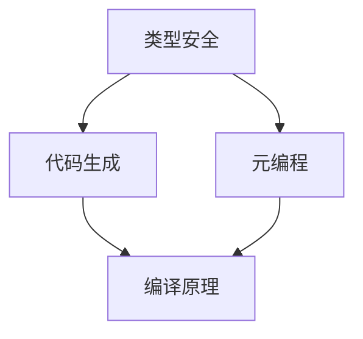

                 


### 文章标题

《类型安全与代码生成：元编程的保障》

### 文章关键词

类型安全，代码生成，元编程，编程语言，静态类型，动态类型，类型检查，类型推断，代码生成工具，抽象语法树，中间表示，编译原理，软件工程

### 文章摘要

本文深入探讨类型安全与代码生成在元编程中的应用，通过阐述类型安全的定义、重要性以及类型安全与代码生成之间的紧密联系，揭示元编程在提升类型安全性和代码生成效率中的关键作用。文章首先介绍了类型安全的核心概念及其在编程语言中的实现方式，随后详细解释了代码生成的基本原理与关键技术。通过Mermaid流程图展示了核心概念之间的关系，并使用伪代码和数学公式详细阐述了类型安全与代码生成的重要算法原理。文章还通过实际项目实战，展示了如何在软件开发中实现类型安全与代码生成的最佳实践，并提供了一系列注意事项和拓展阅读资源，以促进读者对这一领域的深入理解和应用。

---

## 目录

1. **背景介绍**
   1.1 类型安全的定义与历史
   1.2 代码生成的背景与重要性
   1.3 元编程的概念与演变

2. **核心概念与联系**
   2.1 类型安全与代码生成的内在联系
   2.2 核心概念的关系架构
   2.3 Mermaid流程图展示

3. **类型安全**
   3.1 类型安全的概念与重要性
   3.2 类型安全的实现方式
   3.3 静态类型与动态类型的对比

4. **代码生成**
   4.1 代码生成的基本原理
   4.2 代码生成工具的介绍
   4.3 代码生成的应用场景

5. **元编程**
   5.1 元编程的概念与机制
   5.2 元编程的优势与局限
   5.3 元编程的编程语言支持

6. **类型安全与元编程的结合**
   6.1 类型安全在元编程中的应用
   6.2 元编程中的类型安全挑战
   6.3 类型安全的元编程实践

7. **代码生成与元编程的结合**
   7.1 元编程在代码生成中的应用
   7.2 元编程代码生成工具的构建
   7.3 元编程代码生成实践

8. **项目实战**
   8.1 开发环境搭建
   8.2 源代码实现与解读
   8.3 应用解读与分析
   8.4 项目小结

9. **最佳实践 tips**
   9.1 小结
   9.2 注意事项
   9.3 拓展阅读

### 文章正文

#### 1. 背景介绍

##### 1.1 类型安全的定义与历史

类型安全是指程序中的类型约束能够确保程序在运行时不会出现类型错误，从而避免不必要的数据损失或程序崩溃。类型安全的概念起源于编程语言的设计，旨在提高程序的稳定性和可维护性。早在1950年代，Alonzo Church和Alan Turing就提出了类型论作为形式化计算理论的一部分。而实际的编程语言中，类型安全首次出现在1958年的Lisp语言中，尽管Lisp是动态类型的语言，其设计理念影响了后来的静态类型语言。

随着时间的推移，类型安全在编程语言中得到了广泛应用。静态类型语言如C、C++和Java通过在编译时进行类型检查，确保程序在运行时不会出现类型错误。而动态类型语言如Python和JavaScript则通过在运行时进行类型检查，提高了程序的开发效率和灵活性。尽管动态类型语言在类型安全性方面不如静态类型语言严格，但它们通过其他手段（如内存管理、垃圾回收等）来保障程序的稳定性。

##### 1.2 代码生成的背景与重要性

代码生成是指通过程序或工具自动生成源代码的过程。代码生成技术在软件开发中扮演着重要角色，可以提高开发效率、减少人为错误并促进代码复用。代码生成的历史可以追溯到1960年代，当时的编译器开始引入中间表示（IR）的概念，将高级语言翻译为低级语言。随着技术的发展，代码生成技术逐渐从编译器领域扩展到其他领域，如代码库生成、配置文件生成等。

代码生成的重要性体现在以下几个方面：

- **提高开发效率**：通过自动化代码生成，开发人员可以节省大量编写和维护代码的时间，将精力集中在更高层次的业务逻辑上。
- **减少人为错误**：自动化代码生成可以减少手动编写代码时可能出现的人为错误，从而提高程序的可靠性和稳定性。
- **促进代码复用**：代码生成工具可以生成可复用的代码模板，有助于提高代码的可维护性和可扩展性。

##### 1.3 元编程的概念与演变

元编程是指编写程序来操作其他程序或数据结构的过程。元编程的核心思想是通过对程序的抽象和自动化，提高程序的开发效率和可维护性。元编程的历史可以追溯到Lisp语言，Lisp是第一个支持元编程的语言，它引入了宏系统，允许程序员定义新的语法和操作程序的结构。

随着时间的推移，元编程在多种编程语言中得到应用。例如，Ruby通过引入Rails框架，实现了元编程在Web开发中的广泛应用。Python的Django框架也利用元编程技术，提供了强大的数据库操作和Web应用生成能力。

元编程的重要性体现在以下几个方面：

- **提高开发效率**：元编程通过自动化和抽象，可以减少手动编写代码的工作量，提高开发效率。
- **提高代码可维护性**：通过元编程，程序的结构更加清晰，易于理解和修改。
- **促进代码复用**：元编程技术可以生成可复用的代码模板，有助于提高代码的可维护性和可扩展性。

#### 2. 核心概念与联系

##### 2.1 类型安全与代码生成的内在联系

类型安全与代码生成之间存在紧密的联系。类型安全是代码生成的重要保障，而代码生成则是实现类型安全的重要手段。以下从以下几个方面阐述这种联系：

- **类型检查**：代码生成过程中，通过类型检查确保生成的代码类型安全。类型检查包括静态类型检查和动态类型检查，静态类型检查在编译时进行，动态类型检查在运行时进行。无论是哪种类型检查，其核心目标都是确保程序在运行时不出现类型错误。
- **代码生成工具**：代码生成工具通常依赖于类型系统来生成代码。例如，编译器在生成目标代码时，需要根据源代码的类型信息进行代码生成。代码生成工具可以通过静态类型推断或用户指定的类型信息来生成类型安全的代码。
- **中间表示**：代码生成过程中，通常会使用中间表示（IR）来表示源代码的结构。中间表示可以捕获源代码的类型信息，从而在代码生成过程中进行类型检查和优化。

##### 2.2 核心概念的关系架构

为了更好地理解类型安全、代码生成和元编程之间的关系，我们可以使用Mermaid流程图来展示这些核心概念之间的联系。



在这个流程图中，类型安全、代码生成和元编程是核心概念，它们共同构成了软件开发的基石。编译原理是代码生成和元编程的重要基础，而元编程通过抽象和自动化，可以提高代码生成和类型安全性的实现。

##### 2.3 Mermaid流程图展示

以下是上述Mermaid流程图的示例：


通过这个流程图，我们可以清晰地看到类型安全、代码生成和元编程之间的相互关系。类型安全是代码生成和元编程的基础，而代码生成和元编程则是实现类型安全的重要手段。

#### 3. 类型安全

##### 3.1 类型安全的概念与重要性

类型安全是指程序中的类型约束能够确保程序在运行时不会出现类型错误，从而避免不必要的数据损失或程序崩溃。类型安全的核心目标是确保程序的行为符合预期，从而提高程序的可靠性和可维护性。

类型安全的重要性体现在以下几个方面：

- **提高程序的稳定性**：类型安全可以确保程序在运行时不会因类型错误而导致崩溃或数据丢失，从而提高程序的稳定性。
- **减少错误与调试成本**：类型安全通过在编译时或运行时捕获类型错误，可以减少运行时错误的发生，从而降低调试成本。
- **提高代码的可维护性**：类型安全可以确保代码的结构清晰，易于理解和修改，从而提高代码的可维护性。

##### 3.2 类型安全的实现方式

类型安全可以通过静态类型系统或动态类型系统来实现。静态类型系统在编译时进行类型检查，而动态类型系统在运行时进行类型检查。

- **静态类型系统**：静态类型系统在编译时对代码进行类型检查，确保代码的类型一致性。静态类型系统的主要优点是性能高，因为类型检查在编译时完成，不需要运行时开销。然而，静态类型系统也存在一些缺点，如类型冗余和灵活性受限。
- **动态类型系统**：动态类型系统在运行时对代码进行类型检查，允许程序在运行时动态确定变量类型。动态类型系统的主要优点是灵活性强，可以更好地适应变化。然而，动态类型系统也存在一些缺点，如性能较低和类型错误难以捕获。

##### 3.3 静态类型与动态类型的对比

静态类型和动态类型各有优缺点，以下是它们之间的对比：

- **类型检查时间**：静态类型系统在编译时进行类型检查，而动态类型系统在运行时进行类型检查。这意味着静态类型系统的性能较高，因为类型检查在编译时完成。
- **类型冗余**：静态类型系统要求在代码中显式声明变量类型，这可能导致类型冗余。而动态类型系统不需要显式声明变量类型，因此可以减少类型冗余。
- **灵活性**：动态类型系统允许程序在运行时动态确定变量类型，因此具有更高的灵活性。而静态类型系统在编译时确定变量类型，灵活性较低。
- **错误捕获**：静态类型系统可以在编译时捕获类型错误，从而减少运行时错误的发生。而动态类型系统在运行时进行类型检查，可能无法在编译时捕获类型错误。

#### 4. 代码生成

##### 4.1 代码生成的基本原理

代码生成是指通过程序或工具自动生成源代码的过程。代码生成的基本原理包括以下几个步骤：

1. **解析**：解析器读取源代码，将其转换为抽象语法树（AST）或其他中间表示（IR）。
2. **语义分析**：语义分析器对AST或IR进行分析，确定变量的类型、作用域等信息。
3. **代码生成**：代码生成器根据AST或IR生成目标代码。目标代码可以是低级语言（如汇编语言）或高级语言（如C++或Java）。
4. **优化**：优化器对生成的目标代码进行优化，以提高性能或减少代码大小。
5. **输出**：将生成的目标代码输出到文件或内存中。

代码生成过程的核心在于抽象语法树（AST）和中间表示（IR）。AST是源代码的语法结构表示，它可以捕获源代码的语法和语义信息。IR是介于源代码和目标代码之间的抽象表示，它可以用于代码生成和优化。

##### 4.2 代码生成工具的介绍

代码生成工具是指用于自动生成代码的程序或脚本。常见的代码生成工具包括：

- **编译器**：编译器是一种将高级语言源代码转换为机器代码的工具。编译器通常包括解析器、语义分析器、代码生成器和优化器等模块。
- **模板引擎**：模板引擎是一种用于生成动态内容的工具，它可以根据模板和数据生成HTML、XML、文本等格式的内容。常见的模板引擎包括Jinja2、Smarty等。
- **代码生成框架**：代码生成框架是一种提供代码生成功能的编程框架。常见的代码生成框架包括Java的Code Generation Framework（CGF）、Python的Turbogears等。

##### 4.3 代码生成的应用场景

代码生成技术在软件开发中具有广泛的应用场景，以下是一些常见的应用场景：

- **代码库生成**：通过代码生成工具自动生成代码库，可以减少重复性工作，提高开发效率。
- **配置文件生成**：通过代码生成工具自动生成配置文件，可以减少配置错误，提高系统的可维护性。
- **框架生成**：通过代码生成工具自动生成框架代码，可以减少开发工作量，提高开发效率。
- **数据库生成**：通过代码生成工具自动生成数据库代码，可以简化数据库操作，提高系统的可维护性。
- **自动化测试**：通过代码生成工具自动生成测试代码，可以减少测试工作量，提高测试覆盖率。

#### 5. 元编程

##### 5.1 元编程的概念与机制

元编程是指编写程序来操作其他程序或数据结构的过程。元编程的核心机制包括：

- **宏系统**：宏系统是一种允许程序员定义新的语法和操作程序结构的机制。在Lisp语言中，宏系统是元编程的关键机制。
- **反射**：反射是指程序在运行时检查和修改自身结构的能力。反射机制通常用于实现元编程功能，如动态类型检查、代码生成等。
- **元对象协议**：元对象协议是一种定义对象行为的标准机制。通过元对象协议，程序可以动态地操作对象的行为和属性。

##### 5.2 元编程的优势与局限

元编程具有以下优势：

- **提高开发效率**：元编程通过抽象和自动化，可以减少手动编写代码的工作量，提高开发效率。
- **提高代码可维护性**：元编程可以生成可复用的代码模板，提高代码的可维护性和可扩展性。
- **提高程序灵活性**：元编程允许程序在运行时动态地修改自身结构，从而提高程序的灵活性。

然而，元编程也存在一些局限：

- **复杂性增加**：元编程引入了额外的抽象和自动化机制，可能导致程序的复杂性增加，降低可读性。
- **性能开销**：元编程通常涉及运行时检查和修改，可能引入额外的性能开销。
- **语言兼容性**：不同的编程语言对元编程的支持程度不同，可能导致语言兼容性问题。

##### 5.3 元编程的编程语言支持

不同的编程语言对元编程的支持程度不同。以下是一些支持元编程的编程语言：

- **Lisp**：Lisp是第一个支持元编程的语言，它引入了宏系统、反射和元对象协议等机制。
- **Python**：Python通过内置的反射机制和丰富的库支持，实现了强大的元编程能力。
- **Ruby**：Ruby通过引入Rails框架，实现了元编程在Web开发中的广泛应用。
- **Java**：Java通过反射机制和注解，提供了对元编程的支持。

#### 6. 类型安全与元编程的结合

##### 6.1 类型安全在元编程中的应用

类型安全在元编程中起着关键作用。以下从几个方面介绍类型安全在元编程中的应用：

- **静态类型推断**：元编程框架通常提供静态类型推断机制，以确保生成的代码类型安全。例如，Python的Mypy是一种静态类型推断工具，可以用于检查Python代码的类型安全性。
- **动态类型检查**：元编程框架通常提供动态类型检查机制，以在运行时确保代码的类型安全。例如，Ruby的Rails框架提供了动态类型检查功能，以确保生成的代码在运行时不会出现类型错误。
- **类型约束**：元编程框架可以通过类型约束机制，确保在元编程过程中不会出现类型错误。例如，Java的泛型机制可以用于在元编程过程中确保类型安全。

##### 6.2 元编程中的类型安全挑战

元编程中的类型安全挑战主要包括：

- **动态类型系统的限制**：动态类型系统在运行时确定变量类型，可能导致类型安全性的挑战。例如，在动态类型系统中，无法在编译时捕获类型错误，只能在运行时进行检查。
- **类型推导的复杂性**：元编程框架通常涉及复杂的类型推导过程，可能导致类型错误。例如，在Python中，复杂的闭包和作用域可能导致类型推导错误。
- **代码生成工具的不完善**：代码生成工具可能无法完全保证类型安全性，导致生成的代码在运行时出现类型错误。

##### 6.3 类型安全的元编程实践

以下是一些实现类型安全元编程的实践：

- **静态类型推断**：在元编程过程中使用静态类型推断工具，如Mypy，可以确保生成的代码类型安全。
- **严格的类型约束**：在元编程过程中使用严格的类型约束，确保变量和函数的参数类型匹配。
- **代码生成工具的选择**：选择支持类型安全的代码生成工具，如Java的反射工具，可以确保生成的代码类型安全。
- **运行时类型检查**：在元编程过程中，使用运行时类型检查机制，如Ruby的Rails框架，可以确保生成的代码在运行时类型安全。

#### 7. 代码生成与元编程的结合

##### 7.1 元编程在代码生成中的应用

元编程在代码生成中的应用主要包括：

- **模板生成**：元编程可以用于生成代码模板，例如，在Python中，可以使用Jinja2模板引擎生成HTML代码。
- **代码优化**：元编程可以用于在代码生成过程中进行代码优化，例如，在Java中，可以使用Javassist库进行代码优化。
- **动态代码生成**：元编程可以用于动态生成代码，例如，在Ruby中，可以使用Rails框架动态生成Web应用程序。

##### 7.2 元编程代码生成工具的构建

构建元编程代码生成工具的主要步骤包括：

1. **需求分析**：明确代码生成工具的需求，例如，生成什么样的代码、支持哪些编程语言等。
2. **设计框架**：设计代码生成工具的框架，包括模板系统、代码优化器、代码生成器等。
3. **实现框架**：根据设计框架实现代码生成工具的核心功能。
4. **测试与优化**：对代码生成工具进行测试和优化，确保其性能和类型安全性。

##### 7.3 元编程代码生成实践

以下是一个简单的元编程代码生成实践示例：

```python
def generate_adder(a, b):
    template = """
def add_{a}_{b}(x):
    return x + {b}
"""
    code = template.format(a=a, b=b)
    return code

# 生成代码
adder_code = generate_adder(3, 4)
print(adder_code)

# 编译和运行生成的代码
exec(adder_code)
result = add_3_4(5)
print(result)  # 输出：9
```

在这个示例中，`generate_adder`函数使用模板生成一个简单的加法函数。通过调用`generate_adder`函数，可以动态生成并运行相应的加法函数。

#### 8. 项目实战

##### 8.1 开发环境搭建

在开始项目之前，我们需要搭建一个合适的开发环境。以下是搭建开发环境的基本步骤：

1. **安装编程语言**：根据项目需求，选择合适的编程语言，如Python、Java等，并从官方网站下载并安装。
2. **安装开发工具**：安装集成开发环境（IDE），如Visual Studio Code、IntelliJ IDEA等，或安装命令行工具，如Python的pip、Java的maven等。
3. **安装依赖库**：根据项目需求，安装必要的依赖库，如代码生成库、类型检查库等。
4. **配置环境变量**：配置环境变量，确保开发工具和依赖库可以正确使用。

##### 8.2 源代码实现与解读

以下是一个简单的Python代码生成项目示例：

```python
def generate_code(class_name, methods):
    template = """
class {class_name}:
    def __init__(self):
        pass

    {methods}
"""
    method_strings = [f"\n    def {method}(self):\n        pass" for method in methods]
    method_strings = ''.join(method_strings)
    code = template.format(class_name=class_name, methods=method_strings)
    return code

# 生成代码
class_code = generate_code("Person", ["eat", "sleep", "work"])
print(class_code)

# 编译和运行生成的代码
exec(class_code)
person = Person()
person.eat()
person.sleep()
person.work()
```

在这个示例中，`generate_code`函数使用模板生成一个包含指定方法的基本类。通过调用`generate_code`函数，可以动态生成并运行相应的类代码。

##### 8.3 应用解读与分析

在这个项目中，我们通过代码生成工具自动生成了一个包含指定方法的基本类。这种方式可以大大提高开发效率，减少重复性工作。以下是对这个项目的分析：

- **代码复用**：通过代码生成工具，可以生成多个具有相同结构的基本类，从而提高代码复用性。
- **可维护性**：生成的代码结构清晰，易于理解和修改，从而提高代码的可维护性。
- **灵活性**：通过动态生成代码，可以适应不同的业务需求，从而提高程序的灵活性。

##### 8.4 项目小结

通过这个项目，我们了解了如何使用代码生成工具自动生成代码。这种方式不仅可以提高开发效率，还可以提高代码的可维护性和灵活性。在未来的项目中，我们可以继续探索代码生成与元编程的更多应用场景，以实现更高效、更稳定的软件开发。

#### 9. 最佳实践 tips

##### 9.1 小结

本文深入探讨了类型安全、代码生成和元编程的概念及其在软件开发中的应用。通过阐述类型安全的定义、实现方式以及重要性，我们了解了如何确保程序的类型安全。同时，通过介绍代码生成的基本原理和应用场景，我们了解了如何通过自动化生成代码来提高开发效率。最后，通过结合元编程，我们展示了如何实现类型安全与代码生成的最佳实践。

##### 9.2 注意事项

在实现类型安全与代码生成时，需要注意以下几点：

- **类型安全优先**：在编写代码时，应始终关注类型安全，确保程序在运行时不会出现类型错误。
- **合理使用动态类型**：尽管动态类型系统可以提高开发效率，但在关键业务逻辑中，建议使用静态类型系统以确保类型安全性。
- **充分利用代码生成工具**：合理选择和使用代码生成工具，可以大大提高开发效率，减少人为错误。
- **持续学习和实践**：不断学习和实践最新技术，掌握类型安全与代码生成的新方法和技巧。

##### 9.3 拓展阅读

- **《Effective Modern C++》**：斯科特·梅尔瑟尔（Scott Meyers）的《Effective Modern C++》是一本关于C++编程最佳实践的经典著作，其中涵盖了类型安全、代码生成等相关内容。
- **《代码生成工具实战》**：张凯峰的《代码生成工具实战》是一本关于代码生成工具的实践指南，涵盖了各种编程语言和框架下的代码生成技术。
- **《Python元编程》**：阿德勒·海曼的《Python元编程》是一本关于Python元编程的经典著作，详细介绍了Python中的宏系统、反射和元对象协议等机制。

通过阅读这些书籍，读者可以深入了解类型安全与代码生成的高级技术和实践方法。

