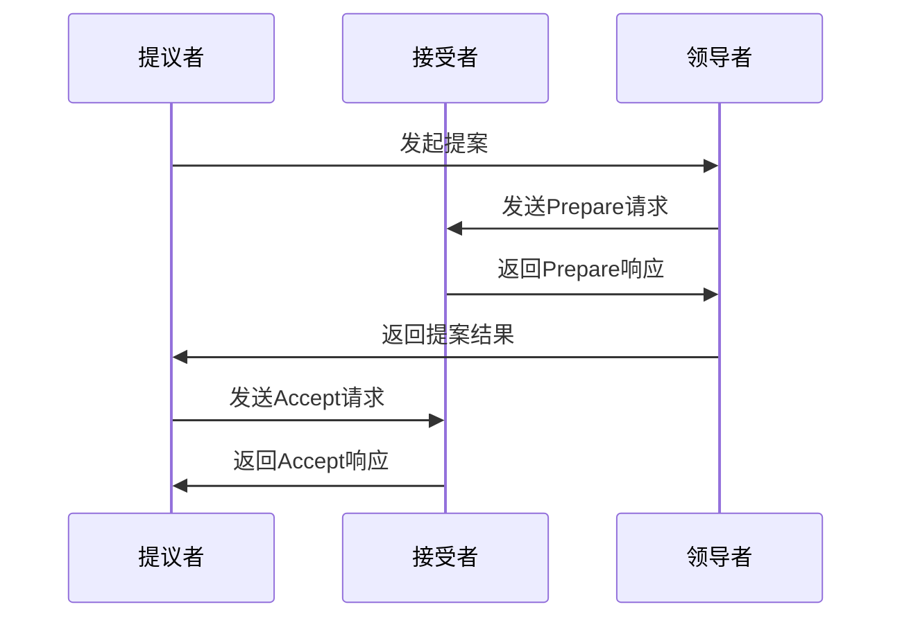
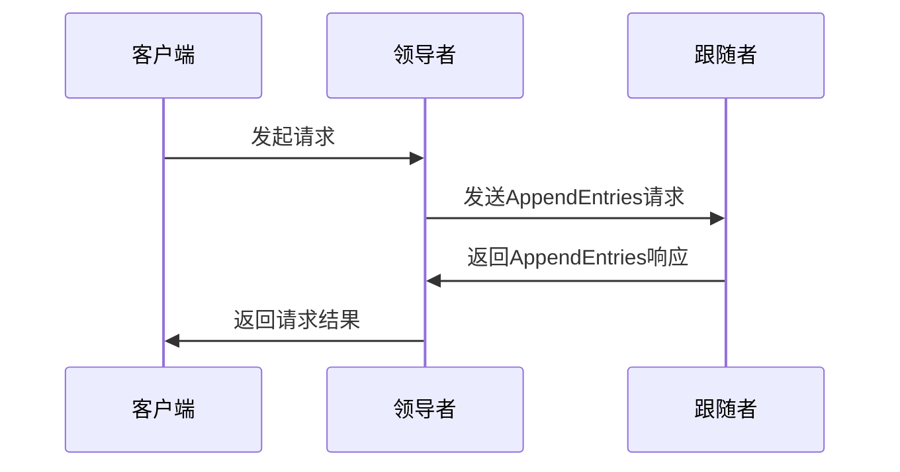

                 

## 引言

### 1.1 类型安全的重要性

类型安全是计算机科学中的一个核心概念，它确保程序在运行时不会因为类型错误而导致不可预测的行为。类型安全不仅仅是一个编程语言的特征，更是整个软件系统设计中至关重要的一环。在分布式系统中，类型安全的重要性尤为突出。由于分布式系统涉及多个节点之间的通信和协作，任何类型错误都可能导致数据不一致、系统崩溃或性能问题。

类型安全的基本概念涉及到数据类型和操作的一致性。在静态类型系统中，变量和函数在编译时就已经确定了类型，从而避免了运行时类型错误的发生。而动态类型系统则是在运行时检查变量和函数的类型，虽然灵活性更高，但也更容易引入类型错误。

类型安全的价值在于它能够提高代码的可靠性、可维护性和性能。通过确保类型安全，开发人员可以更容易地发现和修复错误，从而减少系统出错的概率。此外，类型安全还有助于代码的重用和优化，使得程序更加高效。

类型安全与分布式系统的联系在于，分布式系统中的节点之间需要进行大量的数据交换和操作。类型错误可能会导致数据不一致，影响系统的正确性和稳定性。因此，在分布式系统中，类型安全不仅是一个编程语言的问题，更是一个系统设计和实现的问题。

### 1.2 分布式系统的一致性问题

一致性是分布式系统中的核心挑战之一。一致性确保了系统中的多个节点能够保持一致的状态，即使这些节点之间可能存在延迟、故障和网络分区等问题。一致性问题的基本概念包括强一致性和最终一致性。

强一致性要求在任何时刻，系统中的所有节点都能访问到最新的数据。这种一致性级别提供了确定性，但通常需要较高的资源消耗。最终一致性则允许系统中的数据在不同的节点上存在短暂的差异，但最终会达到一致状态。最终一致性更加灵活，但可能会引入一些不确定因素。

分布式系统中的常见一致性问题包括数据一致性问题、状态一致性和视图一致性。数据一致性问题指的是在分布式环境中，如何确保不同节点的数据保持一致。状态一致性指的是在系统中的多个操作能够正确地执行并保持系统状态的连贯性。视图一致性则涉及到多个节点对同一数据的访问和操作是否能够得到一致的结果。

解决分布式一致性问题的方法包括一致性协议、分布式算法和数据复制策略。一致性协议如Paxos和Raft，通过算法确保系统的一致性。分布式算法则通过合理的调度和同步机制，确保多个节点的操作能够正确执行。数据复制策略通过在多个节点上复制数据，提供冗余和容错能力。

### 1.3 本书结构概述

本书旨在深入探讨类型安全与分布式系统的一致性问题，并探讨确保一致性的一系列方法。全书分为七个章节，每个章节都将详细探讨一个核心主题。

第1章作为引言，介绍了类型安全的重要性以及分布式系统的一致性问题。

第2章将深入讨论类型安全的基础，包括类型系统的概述、类型检查和类型推断的基本概念。

第3章和第4章分别详细讲解分布式系统一致性协议和分布式系统设计模式。一致性协议包括Paxos和Raft协议的原理和实现。设计模式则涵盖分层架构、微服务架构和数据一致性保障模式。

第5章通过案例分析，探讨分布式系统一致性实践，并介绍常见的分布式系统一致性工具。

第6章讨论类型安全与分布式系统的关系，分析类型安全在分布式系统中的应用和实践。

第7章总结全书内容，回顾核心概念，并展望类型安全与分布式系统的一致性发展的未来趋势。

通过阅读本书，读者可以全面了解类型安全与分布式系统一致性的关键概念和实现方法，为分布式系统的设计和开发提供有力支持。

### 1.3.1 各章节内容概述

第1章通过引言部分，为读者提供了类型安全和分布式系统一致性问题的背景知识，奠定了全书的基础。第2章将深入探讨类型安全的基础，介绍类型系统的基本概念，包括静态类型系统、动态类型系统、强类型与弱类型等。此外，还将讨论类型检查与类型推断的原理及其在实际应用中的重要性。

第3章和第4章分别聚焦于分布式系统的一致性协议和设计模式。第3章详细介绍了分布式一致性协议的基本概念，包括Paxos协议和Raft协议的原理和实现。第4章则从系统设计的角度出发，探讨了分层架构、微服务架构和数据一致性保障模式，提供了多种保证系统一致性的方法和策略。

第5章通过案例分析，展示了分布式系统一致性在实际应用中的实现方法。读者将了解数据库一致性、分布式缓存一致性和微服务一致性等具体案例，从而加深对一致性问题的理解。

第6章深入探讨了类型安全与分布式系统的关系。本章将分析类型安全在分布式系统中的作用，以及分布式系统对类型安全的需求。通过讨论静态类型语言和动态类型语言在分布式系统中的应用，读者可以更好地理解类型安全在分布式系统开发中的重要性。

第7章作为总结章节，回顾了全书的核心概念和内容，总结了类型安全与分布式系统一致性的主要方法和实践。此外，本章还将展望未来类型安全与分布式系统一致性技术的发展趋势，为读者提供未来的研究方向和挑战。

通过阅读本书，读者将不仅能够全面掌握类型安全和分布式系统一致性的基础知识，还能了解最新的研究和实践，为分布式系统的设计和开发提供有力支持。

### 1.3.2 阅读本书的目标和收获

阅读本书的目标是帮助读者深入理解类型安全与分布式系统一致性的核心概念和实现方法。通过系统的学习和实践，读者将能够在分布式系统的设计和开发中更好地应对一致性挑战，提升系统的可靠性和稳定性。

本书旨在达到以下收获：

1. **掌握类型安全基础**：通过详细讨论类型系统的基本概念，读者将了解静态类型系统、动态类型系统、强类型与弱类型的区别，并学会进行类型检查和类型推断。

2. **理解一致性协议**：读者将深入学习Paxos和Raft等分布式一致性协议的原理和实现，理解这些协议如何在分布式系统中确保数据的一致性。

3. **掌握分布式系统设计模式**：通过分析分层架构、微服务架构和数据一致性保障模式，读者将掌握多种确保系统一致性的设计策略和方法。

4. **实践案例分析**：通过实际案例分析，读者将了解分布式系统一致性在不同场景下的实现方法，从而将理论知识应用到实践中。

5. **探讨类型安全与分布式系统的关系**：读者将深入探讨类型安全在分布式系统中的作用和需求，理解如何通过类型安全提高系统的可靠性和性能。

6. **展望未来发展**：本书还将展望类型安全与分布式系统一致性技术的未来发展趋势，为读者提供未来的研究方向和挑战，激发创新思维。

通过阅读本书，读者不仅能够掌握类型安全和分布式系统一致性的基础知识，还能为分布式系统的设计和开发提供实用指导，提升自己的技术能力和项目实施水平。

## 类型安全基础

类型安全是计算机科学中一个核心概念，涉及到变量和操作的数据类型。类型安全确保程序在编译或运行时不会因类型错误导致不可预测的行为。本章将深入探讨类型系统的基本概念，包括静态类型系统、动态类型系统、强类型与弱类型的区别，并介绍类型检查和类型推断的过程及其在分布式系统中的应用。

### 2.1.1 类型系统概述

类型系统是编程语言的核心组成部分，它定义了程序中数据类型的定义和操作。根据类型检查的不同时机，类型系统可以分为静态类型系统和动态类型系统。

**静态类型系统**在编译时就已经确定了变量和函数的类型。这意味着在程序运行之前，编译器会检查所有操作是否符合类型规定，从而确保类型安全。静态类型系统的优点是编译速度快，易于优化，但可能对开发者的灵活性有所限制。

**动态类型系统**在程序运行时进行类型检查。这意味着变量的类型是在运行时确定的，提供了更高的灵活性和动态性。然而，动态类型系统更容易引入类型错误，需要更多的运行时检查和开销。

**强类型系统**要求变量的类型严格匹配，任何类型不匹配的操作都会导致编译或运行错误。强类型系统有助于提高代码的可靠性和可维护性，但可能牺牲一定的灵活性。

**弱类型系统**对类型检查较为宽松，允许类型转换和隐式类型推断。弱类型系统的优点是提供了更高的灵活性，但可能引入更多的潜在错误。

### 2.1.2 静态类型系统

静态类型系统在编译时进行类型检查，这意味着变量和函数在编写时就已经确定了类型。以下是一个简单的Java示例，展示了静态类型系统：

```java
public class Example {
    public static void main(String[] args) {
        int a = 10;
        double b = 3.14;
        a = a + b; // 类型检查通过
        // a = "Hello"; // 类型检查错误
    }
}
```

在上面的示例中，变量`a`和`b`在编译时分别被声明为`int`和`double`类型，因此在尝试将字符串赋值给`a`时，编译器会报错。

静态类型系统的优点包括：

- **编译时错误检查**：可以在编译阶段捕获类型错误，提高代码可靠性。
- **代码优化**：编译器可以利用静态类型信息进行优化，提高程序性能。
- **明确的类型约束**：有助于代码的可维护性和可读性。

### 2.1.3 动态类型系统

动态类型系统在程序运行时进行类型检查，这意味着变量和函数的类型在运行时确定。以下是一个简单的Python示例，展示了动态类型系统：

```python
def add(a, b):
    return a + b

a = 10
b = 3.14
result = add(a, b) # 运行时类型检查
print(result) # 输出：13.14
```

在上面的示例中，变量`a`和`b`在运行时分别被赋值为整数和浮点数，因此在调用`add`函数时，Python解释器会在运行时检查操作是否符合类型规定。

动态类型系统的优点包括：

- **更高的灵活性**：允许在运行时动态确定变量类型，适用于动态编程场景。
- **减少冗余的类型声明**：无需在编写代码时指定所有变量和函数的类型。

### 2.1.4 强类型与弱类型

**强类型系统**要求变量的类型在编译时严格匹配，任何类型不匹配的操作都会导致编译或运行错误。以下是一个C++示例，展示了强类型系统：

```cpp
#include <iostream>

int main() {
    int a = 10;
    double b = 3.14;
    // a = b; // 类型不匹配，编译错误
    std::cout << a << " " << b << std::endl;
    return 0;
}
```

在上面的示例中，尝试将浮点数赋值给整型变量`a`会导致编译错误。

**弱类型系统**对类型检查较为宽松，允许类型转换和隐式类型推断。以下是一个PHP示例，展示了弱类型系统：

```php
<?php
$a = 10;
$b = 3.14;
$a += $b; // 自动类型转换
echo $a; // 输出：13.14
?>
```

在上面的示例中，PHP允许将整型变量`a`与浮点数`b`进行运算，并在运行时自动进行类型转换。

强类型与弱类型的对比如下：

- **类型安全**：强类型系统提供了更高的类型安全性，减少了类型错误的发生。弱类型系统可能引入更多的潜在类型错误。
- **开发效率**：弱类型系统提供了更高的开发灵活性，但需要更多的运行时检查和类型转换。强类型系统在编译时进行类型检查，提高了开发效率。
- **性能**：强类型系统通常具有更好的性能，因为编译器可以利用类型信息进行优化。弱类型系统可能需要更多的运行时检查，影响性能。

### 2.1.5 类型系统的优点与缺点

**优点**：

- **类型安全**：类型系统确保变量和操作的一致性，减少类型错误的发生。
- **编译时错误检查**：静态类型系统可以在编译阶段捕获类型错误，提高代码可靠性。
- **代码优化**：类型信息有助于编译器进行优化，提高程序性能。
- **明确的类型约束**：强类型系统提供了明确的类型约束，有助于代码的可维护性和可读性。

**缺点**：

- **灵活性**：静态类型系统可能对开发灵活性有所限制，需要更多的类型声明。
- **开发效率**：动态类型系统在运行时进行类型检查，可能降低开发效率。
- **性能**：动态类型系统可能需要更多的运行时检查和类型转换，影响性能。
- **潜在的类型错误**：弱类型系统可能引入更多的潜在类型错误，需要更多的运行时检查。

### 2.1.6 分布式系统中类型安全的重要性

在分布式系统中，类型安全的重要性尤为突出。由于分布式系统涉及多个节点之间的通信和协作，任何类型错误都可能导致数据不一致、系统崩溃或性能问题。

**数据一致性**：类型安全确保在分布式系统中，数据在传输和处理过程中不会因为类型错误导致不一致。例如，一个节点接收到的数据类型与预期不符，可能会导致错误的处理逻辑，从而影响系统的正确性。

**系统稳定性**：类型安全有助于提高分布式系统的稳定性。通过严格的类型检查，可以避免因类型错误引发的异常和崩溃，确保系统在遇到各种故障和异常时能够保持稳定运行。

**性能优化**：在分布式系统中，类型安全有助于性能优化。通过静态类型系统，编译器可以利用类型信息进行优化，减少运行时的检查和转换，提高系统整体性能。

### 2.1.7 实际应用场景

以下是一些分布式系统中类型安全实际应用的场景：

1. **分布式数据库**：在分布式数据库中，类型安全确保数据在各个节点之间的传输和存储过程中保持一致。例如，在分布式事务处理中，不同节点上的数据类型必须严格匹配，避免数据不一致问题。

2. **微服务架构**：在微服务架构中，各个微服务之间需要进行大量的数据交互。类型安全确保微服务之间的数据传输和操作不会因为类型错误导致不一致。例如，一个微服务返回的数据类型与另一个微服务期望的类型不匹配，可能会导致系统崩溃。

3. **消息队列系统**：在消息队列系统中，消息的生产者和消费者之间需要进行类型安全的通信。类型错误可能导致消息处理失败，从而影响系统的整体性能和可靠性。

4. **分布式缓存系统**：在分布式缓存系统中，缓存数据的类型安全至关重要。例如，缓存中的数据类型必须与实际应用中的数据类型保持一致，否则可能会导致数据丢失或错误处理。

通过理解和应用类型安全，开发人员可以在分布式系统中更好地保障数据的一致性、系统的稳定性以及性能优化，为分布式系统的设计和实现提供坚实的保障。

## 类型检查与类型推断

类型检查和类型推断是类型安全的核心组成部分，它们确保程序在编译或运行时不会因为类型错误而导致不可预测的行为。本章将深入探讨类型检查和类型推断的基本概念、过程及其在实际应用中的重要性。

### 2.2.1 类型检查的过程

类型检查是指在程序编译或运行时，对变量和操作的数据类型进行验证，确保它们符合程序定义的类型规则。类型检查可以分为静态类型检查和动态类型检查。

**静态类型检查**在编译时进行，这意味着在程序运行之前，编译器会检查所有操作是否符合类型规定。以下是一个简单的Java示例，展示了静态类型检查：

```java
public class Example {
    public static void main(String[] args) {
        int a = 10;
        double b = 3.14;
        a = a + b; // 静态类型检查通过
        // a = "Hello"; // 静态类型检查错误
    }
}
```

在上面的示例中，变量`a`和`b`在编译时分别被声明为`int`和`double`类型，因此尝试将字符串赋值给`a`会导致编译错误。

**动态类型检查**在程序运行时进行，这意味着变量的类型在运行时确定。以下是一个简单的Python示例，展示了动态类型检查：

```python
def add(a, b):
    return a + b

a = 10
b = 3.14
result = add(a, b) # 动态类型检查通过
print(result) # 输出：13.14
```

在上面的示例中，变量`a`和`b`在运行时分别被赋值为整数和浮点数，因此在调用`add`函数时，Python解释器会在运行时检查操作是否符合类型规定。

**类型检查的过程**可以分为以下几步：

1. **语法分析**：将源代码解析为抽象语法树（AST），识别出变量、函数和操作等语法元素。
2. **作用域分析**：确定每个变量和函数的作用域，确保在正确的范围内使用变量。
3. **类型推导**：根据语法元素和操作规则，推导出每个变量的类型。
4. **类型检查**：验证所有操作是否符合类型规定，例如变量和函数的参数和返回值类型是否匹配。
5. **错误报告**：在发现类型错误时，生成相应的错误信息，帮助开发者定位和修复问题。

### 2.2.2 类型推断的算法

类型推断是类型检查的一部分，它通过算法自动推导出变量和操作的数据类型，从而减少开发者的手动类型声明。类型推断可以分为静态类型推断和动态类型推断。

**静态类型推断**在编译时进行，根据语法元素和操作规则，自动推导出变量和函数的类型。以下是一个简单的Java示例，展示了静态类型推断：

```java
public class Example {
    public static void main(String[] args) {
        int a = 10;
        double b = 3.14;
        double c = a + b; // 静态类型推断：c的类型为double
        System.out.println(c); // 输出：13.14
    }
}
```

在上面的示例中，变量`c`在声明时没有指定类型，但通过类型推断，编译器能够自动推导出`c`的类型为`double`。

**动态类型推断**在运行时进行，根据变量的值和操作规则，自动推导出变量的类型。以下是一个简单的Python示例，展示了动态类型推断：

```python
def add(a, b):
    return a + b

a = 10
b = 3.14
result = add(a, b) # 动态类型推断：result的类型为float
print(result) # 输出：13.14
```

在上面的示例中，变量`result`在声明时没有指定类型，但通过动态类型推断，Python解释器能够自动推导出`result`的类型为`float`。

**常见的类型推断算法**包括：

1. **简单类型推断**：根据变量的值和操作规则，直接推导出变量的类型。例如，如果变量`a`的值为整数，那么可以将`a`推断为`int`类型。
2. **上下文类型推断**：根据程序上下文，自动推导出变量的类型。例如，在一个函数内部，根据函数的参数和返回值类型，可以自动推导出内部变量的类型。
3. **基于类型的模式匹配**：根据模式匹配的结果，自动推导出变量的类型。例如，在Python中，可以使用`match`语句进行模式匹配，并根据匹配结果推导出变量的类型。

### 2.2.3 类型检查与类型推断的实际应用

类型检查和类型推断在实际编程中有广泛的应用，下面是几个典型的实际应用场景：

1. **编程语言编译器**：类型检查和类型推断是编程语言编译器的重要功能。编译器通过类型检查确保程序在运行时不会因为类型错误而导致异常。类型推断可以提高代码的自动完成性和开发效率。
2. **静态代码分析工具**：静态代码分析工具使用类型检查和类型推断来发现代码中的潜在错误和优化机会。通过分析代码的类型信息，工具可以生成详细的错误报告和优化建议。
3. **动态类型检查框架**：动态类型检查框架如Python的`mypy`、Java的`Eclipse`等，通过类型检查和类型推断来确保程序在运行时的类型安全。这些工具可以自动检测类型错误，并提供详细的错误报告，帮助开发者快速修复问题。
4. **分布式系统设计**：在分布式系统中，类型检查和类型推断有助于确保节点之间数据传输的一致性和正确性。通过严格的类型检查，可以避免因类型错误导致的数据不一致和系统崩溃。

### 2.2.4 类型安全的编程实践

为了保证类型安全，开发人员可以采取以下编程实践：

1. **明确声明类型**：在静态类型系统中，明确声明变量的类型有助于提高代码的可读性和可维护性。例如，在Java和C++中，应尽可能明确声明变量的类型，避免使用默认类型。
2. **使用类型检查工具**：在动态类型系统中，可以使用类型检查工具来确保程序在运行时的类型安全。例如，Python的`mypy`工具可以帮助检测类型错误，并提供详细的错误报告。
3. **避免类型转换陷阱**：在动态类型系统中，类型转换可能导致潜在的类型错误。开发人员应仔细处理类型转换，避免不必要或错误的类型转换。
4. **使用类型注解**：在支持类型注解的语言（如Java和Python的Type Hints）中，使用类型注解可以提高代码的可读性和可维护性，同时帮助类型检查工具更准确地检查类型错误。

通过遵循这些编程实践，开发人员可以更好地保障程序的类型安全，提高代码的质量和可靠性。

通过本章的讨论，读者可以深入理解类型检查和类型推断的基本概念、过程及其在实际应用中的重要性。理解这些概念有助于开发人员编写更安全、更可靠的代码，并在分布式系统中更好地保障数据的一致性和系统的稳定性。

## 类型安全的编程实践

在分布式系统中，类型安全是确保数据一致性和系统稳定性的关键因素之一。本节将详细探讨如何通过编程实践来确保类型安全，并分析静态类型编程的优势以及动态类型编程的潜在陷阱。

### 2.3.1 静态类型编程的优势

静态类型编程在编译时对变量的类型进行严格检查，这有助于减少运行时错误和提高代码的可维护性。以下是静态类型编程的一些显著优势：

1. **编译时错误检查**：静态类型系统在编译阶段能够发现类型错误，从而在程序运行之前提前修复问题。这种提前发现错误的能力有助于提高代码的质量和可靠性。
   
   例如，以下C++代码在编译时将报告类型错误：
   ```cpp
   int a = 10;
   std::string b = "Hello";
   a = b; // 编译错误：类型不匹配
   ```

2. **代码优化**：静态类型系统允许编译器在编译阶段利用类型信息进行优化，从而提高程序的性能。例如，编译器可以提前知道变量的数据类型，从而进行更高效的内存分配和操作。

3. **明确的类型约束**：静态类型系统提供了明确的类型约束，有助于代码的可读性和可维护性。变量和函数的类型在代码中明确声明，使得代码的结构更加清晰，便于理解和修改。

4. **更强大的工具支持**：静态类型系统通常支持更强大的工具，如静态代码分析器、性能优化器和自动重构工具。这些工具可以帮助开发人员发现潜在的错误并进行优化，提高开发效率。

### 2.3.2 动态类型编程的陷阱

动态类型编程在运行时进行类型检查，提供了更高的灵活性和动态性，但也存在一些潜在陷阱：

1. **类型错误**：动态类型系统在运行时进行类型检查，可能导致在运行时才发现类型错误。这可能导致不可预测的行为和难以调试的错误。

   例如，以下Python代码在运行时将报告类型错误：
   ```python
   a = 10
   b = "Hello"
   a = a + b  # 运行时错误：类型不匹配
   ```

2. **性能开销**：动态类型系统通常需要更多的运行时检查和类型转换，这可能会增加性能开销。由于类型检查是在运行时进行的，每次操作都可能需要额外的类型检查，这可能会影响程序的整体性能。

3. **代码可读性下降**：动态类型系统可能在代码的可读性方面存在问题。由于类型在运行时确定，代码可能缺乏明确的类型声明，使得代码更难以理解和维护。

4. **隐式类型转换**：动态类型系统可能允许隐式类型转换，这可能导致不可预见的结果。例如，一个整数和字符串进行运算时，动态类型系统可能会自动进行类型转换，这可能会导致类型错误。

   例如，以下JavaScript代码将隐式地将整数转换为字符串：
   ```javascript
   let a = 10;
   let b = "Hello";
   let c = a + b; // c的类型为字符串，输出：10Hello
   ```

### 2.3.3 实现类型安全的代码

为了实现类型安全，开发人员可以采取以下措施：

1. **明确声明类型**：在静态类型编程语言中，应明确声明变量的类型。这有助于减少类型错误并提高代码的可维护性。

   例如，在C++中，可以声明变量类型：
   ```cpp
   int a = 10;
   std::string b = "Hello";
   ```

2. **使用类型检查工具**：在动态类型编程语言中，可以使用类型检查工具来确保程序在运行时的类型安全。例如，Python的`mypy`工具可以帮助发现类型错误。

   ```bash
   $ mypy your_script.py
   ```

3. **避免不必要的类型转换**：在动态类型编程中，应尽量避免不必要的类型转换，这有助于减少性能开销。

   例如，在Python中，可以使用`isinstance`函数检查变量类型，而不是进行强制类型转换：
   ```python
   a = 10
   b = "Hello"
   if isinstance(a, int) and isinstance(b, str):
       print(a + b)  # 输出：10Hello
   ```

4. **使用类型注解**：在支持类型注解的语言（如Java和Python）中，使用类型注解可以提供更好的代码可读性和维护性。

   例如，在Python中，可以使用`Type Hints`进行类型注解：
   ```python
   from typing import List
   
   def add_numbers(numbers: List[int]) -> int:
       return sum(numbers)
   
   result = add_numbers([1, 2, 3])
   ```

5. **设计类型安全接口**：在设计分布式系统时，确保接口和数据结构具有类型安全性。这有助于减少类型错误和数据不一致。

   例如，在微服务架构中，应确保API返回的数据类型与预期一致，通过类型检查和验证来保障数据的一致性。

通过遵循这些编程实践，开发人员可以在分布式系统中更好地实现类型安全，确保数据的一致性和系统的稳定性。

### 2.3.4 实现类型安全的代码示例

以下是一个简单的示例，展示了如何在Python中实现类型安全：

```python
from typing import List

def add_numbers(numbers: List[int]) -> int:
    """计算整数列表中元素的总和"""
    total = 0
    for number in numbers:
        if not isinstance(number, int):
            raise TypeError("元素必须为整数")
        total += number
    return total

try:
    result = add_numbers([1, 2, 3])
    print(result)  # 输出：6
except TypeError as e:
    print(f"类型错误：{e}")
```

在上面的示例中，`add_numbers`函数使用类型注解指定输入参数和返回值的类型。通过`isinstance`函数检查每个元素是否为整数，从而确保类型安全。如果在运行时发现类型错误，将抛出`TypeError`异常，并打印错误信息。

通过这种类型安全的编程实践，开发人员可以在分布式系统中减少类型错误的发生，提高系统的稳定性和可靠性。

## 分布式系统一致性协议

### 3.1 分布式一致性协议概述

在分布式系统中，一致性协议是确保多个节点之间数据一致性的关键机制。一致性协议通过定义一系列的规则和算法，使得分布式系统能够在各种网络条件和故障情况下保持数据的一致性。一致性协议在不同类型的分布式系统中扮演着至关重要的角色，确保了数据的正确性和系统的可靠性。

### 3.1.1 一致性协议的基本概念

一致性协议的定义涉及多个节点之间如何就数据的状态达成一致。基本概念包括：

1. **一致性**：一致性是指多个节点在执行相同操作后，能够访问到相同的数据状态。一致性协议的目标是确保即使在分布式环境中，多个节点上的数据也能保持一致。
   
2. **强一致性**：强一致性要求在任何时刻，系统中的所有节点都能访问到最新的数据。强一致性提供了确定性，但通常需要较高的资源消耗。

3. **最终一致性**：最终一致性允许系统中的数据在不同的节点上存在短暂的差异，但最终会达到一致状态。最终一致性更加灵活，但可能会引入一些不确定因素。

### 3.1.2 分布式一致性协议的分类

分布式一致性协议可以根据不同的标准进行分类。以下是几种常见的一致性协议及其特点：

1. **基于状态机复制协议**：这类协议通过复制状态机来确保一致性。每个节点维护一个本地状态机，并通过网络与其他节点同步状态。Paxos和Raft协议是典型的基于状态机复制协议。

2. **基于线性化协议**：这类协议通过定义操作的顺序来确保一致性。线性化确保每个操作在系统中的某个节点上以相同的顺序执行。这种协议通常用于分布式锁和事务管理。

3. **基于冲突检测协议**：这类协议通过检测和处理冲突来确保一致性。当多个节点同时对同一数据执行操作时，协议会检测并解决这些冲突，确保最终一致性。

### 3.1.3 常见的一致性协议

以下是一些常见的一致性协议及其原理：

1. **Paxos协议**：Paxos协议是一种基于状态机复制的一致性协议，由莱斯利·兰伯特（Leslie Lamport）提出。Paxos协议通过选主和日志复制机制，确保多个副本能够在面对网络延迟和故障时达成一致状态。

2. **Raft协议**：Raft协议是由Diego Ongaro和John Ousterhout提出的一种改进的Paxos协议。Raft协议通过日志复制、领导人选举和安全性机制，简化了一致性算法的实现，同时提高了协议的可理解性和可靠性。

3. **Gossip协议**：Gossip协议是一种基于冲突检测的一致性协议，通过消息传播来检测和处理冲突。Gossip协议广泛应用于分布式缓存系统和分布式存储系统。

4. **最终一致性协议**：这类协议通过异步消息传递和冲突处理机制，确保系统最终达到一致性状态。例如，Apache Kafka的消费者组通过消费者之间的消息同步，实现了最终一致性。

### 3.1.4 一致性协议的选择标准

在分布式系统中选择一致性协议时，需要考虑以下标准：

1. **性能**：一致性协议的性能直接影响系统的响应时间和吞吐量。高性能的一致性协议能够减少延迟和资源消耗。

2. **容错能力**：一致性协议需要能够应对节点故障和网络分区等故障情况，确保系统能够持续提供服务。

3. **可扩展性**：一致性协议应能够支持系统规模的扩展，不会因为节点数量增加而显著降低性能。

4. **实现复杂性**：实现一致性协议的复杂性对开发和维护系统的难度有很大影响。简化和易于实现的一致性协议有助于减少开发和维护成本。

通过理解和应用这些一致性协议，开发人员可以在分布式系统中有效地管理和维护数据一致性，提高系统的可靠性和性能。本章后续将详细探讨Paxos和Raft协议的原理和实现，帮助读者深入了解分布式系统的一致性保障机制。

## Paxos协议详解

Paxos协议是由莱斯利·兰伯特（Leslie Lamport）于1990年提出的一种分布式一致性算法，主要用于在分布式系统中达成一致性状态。Paxos协议通过选主和日志复制机制，确保多个副本能够在面对网络延迟和故障时达成一致状态。以下将详细讲解Paxos协议的基本原理、流程和伪代码实现。

### 3.2.1 Paxos协议的基本原理

Paxos协议的核心思想是通过一组协同工作的服务器（Paxos服务器）达成一致性决策。这些服务器分为两类角色：提议者（Proposer）和接受者（Acceptor）。提议者负责提出决策请求，接受者负责接受和记录提议。

Paxos协议的主要目标是在分布式系统中实现以下关键功能：

1. **达成一致性决策**：即使在面对网络延迟和节点故障的情况下，也能确保所有副本最终达成一致状态。
2. **避免循环决策**：确保提议者在面对不同响应时不会陷入无限循环，从而提高系统的稳定性和效率。

Paxos协议的基本原理如下：

1. **提议和接受**：提议者提出一个提案，接受者接受提案并记录在日志中。每次提议都需要分配一个唯一的编号（称为提案编号），以避免冲突。
2. **多数派规则**：为了达成一致决策，必须获得多数派接受者的支持。多数派定义为超过半数的接受者。
3. **领导者选举**：在初始状态下，没有提议者能够提出提案。此时，接受者通过一轮选举产生一个领导者（Leader），领导者负责提出和推动提案的执行。

### 3.2.2 Paxos协议的流程

Paxos协议的流程可以分为以下几个阶段：

1. **初始化**：系统初始化时，所有接受者进入准备状态（Prepare Phase）。
2. **提案提出**：提议者向领导者发送提案请求，领导者接收提案并分配提案编号。
3. **提案接受**：领导者将提案编号和提案值发送给所有接受者，接受者根据多数派规则接受提案。
4. **日志记录**：一旦领导者获得多数派接受者的支持，领导者将提案值记录到日志中。
5. **决定传播**：领导者将决定值传播给所有接受者，接受者更新本地状态。

以下是Paxos协议的详细流程：

**阶段1：初始化**
- 提议者初始化，进入提案状态。
- 提议者生成唯一提案编号`(n)`。
- 提议者向所有接受者发送`Prepare`请求，包含提案编号`n`。

**阶段2：提案接受**
- 接受者接收到`Prepare`请求后，进入准备状态。
- 接受者如果还没有接受过任何提案，则回复提议者一个包含最大提案编号`(m)`和当前值`v`的`Prepare`响应。
- 如果接受者已经接受过提案，则继续持有之前的值。

**阶段3：提案编号匹配**
- 提议者收集来自接受者的`Prepare`响应。
- 如果接收到的响应中存在至少一个包含提案编号`n`的响应，则提议者进入下一个阶段。

**阶段4：提案值确定**
- 提议者从收集到的响应中选择最大提案编号`m`和对应的值`v`。
- 提议者向所有接受者发送`Accept`请求，包含提案编号`m`和值`v`。

**阶段5：提案值接受**
- 接受者接收到`Accept`请求后，进入接受状态。
- 如果接受者尚未接受过编号为`m`的提案，则接受者记录该提案值并回复一个`Accept`响应。

**阶段6：多数派接受**
- 提议者收集来自接受者的`Accept`响应。
- 如果接收到的响应中存在至少两个包含提案编号`m`和值`v`的响应，则提议者认为提案已经获得多数派接受。

**阶段7：日志记录和决定传播**
- 提议者将提案值`v`记录到日志中。
- 提议者将决定值`v`传播给所有接受者，接受者更新本地状态。

### 3.2.3 Paxos协议的伪代码实现

以下是Paxos协议的伪代码实现，展示了提议者、接受者和领导者的行为：

**提议者（Proposer）**
```python
def propose(value):
    n = nextProposalNumber()
    prepareRequests = sendPrepareRequests(n)
    acceptedResponses = collectResponses(prepareRequests)
    majorityResponse = findMajorityResponse(acceptedResponses)
    if majorityResponse:
        acceptRequest = sendAcceptRequest(majorityResponse[1], n)
        if acceptResponseReceived(acceptRequest):
            logValue(value)
```

**接受者（Acceptor）**
```python
def prepare(requestNumber):
    if not isPrepared(requestNumber):
        maxProposedValue = findMaxProposedValue()
        respondWith(maxProposedValue)

def accept(proposedValue, proposedNumber):
    if not isAccepted(proposedValue) and proposedNumber >= maxPreparedNumber():
        acceptValue(proposedValue)
        sendAcceptResponse()
```

**领导者（Leader）**
```python
def becomeLeader():
    proposeValue = propose(value)
    if isAccepted(propseValue):
        becomeCommitLeader(proposeValue)
```

通过上述伪代码，提议者负责提出和推动提案，接受者负责接受和记录提案，领导者负责协调整个一致性协议的过程。Paxos协议通过这些协同工作确保分布式系统能够在面对网络延迟和故障的情况下达成一致性状态。

### 3.2.4 Paxos协议的优势和挑战

Paxos协议具有以下优势：

1. **一致性保证**：Paxos协议能够确保分布式系统在面临网络延迟和节点故障时达成一致性状态。
2. **容错性**：Paxos协议通过领导者选举和日志复制机制，能够应对节点故障和网络分区等问题，确保系统持续提供服务。
3. **稳定性**：Paxos协议避免了无限循环问题，使得系统在处理不同响应时能够保持稳定。
4. **理解性和实现**：尽管Paxos协议相对复杂，但其原理清晰，易于理解和实现。

Paxos协议也面临一些挑战：

1. **实现复杂性**：Paxos协议涉及多个角色和复杂的交互过程，实现过程中需要精确处理各种情况，以确保系统的正确性。
2. **性能开销**：Paxos协议在网络通信和状态同步方面可能存在性能开销，尤其是在高延迟和低带宽的网络环境中。
3. **领导者选举开销**：在系统初始化或领导者故障时，Paxos协议需要进行领导者选举，这可能导致一定的时间和资源消耗。

尽管存在这些挑战，Paxos协议在分布式系统的一致性保障中仍然具有重要的地位，其原理和机制为后续一致性协议的研究和实现提供了重要参考。

通过详细探讨Paxos协议的基本原理、流程和伪代码实现，读者可以深入理解分布式系统的一致性保障机制，为实际分布式系统的设计和开发提供有力支持。

## Raft协议详解

Raft协议是由Diego Ongaro和John Ousterhout于2013年提出的一种分布式一致性协议，旨在简化Paxos协议的实现，同时保持其一致性和容错能力。Raft协议通过日志复制、领导人选举和安全性机制，确保分布式系统在面临各种故障和网络问题时能够保持数据一致性。以下将详细讲解Raft协议的基本原理、流程和伪代码实现。

### 3.3.1 Raft协议的基本原理

Raft协议的核心思想是通过领导者（Leader）和跟随者（Follower）的角色分工，实现分布式系统的一致性状态。领导者负责处理客户端请求并协调系统中的日志复制，而跟随者负责接收和同步领导者发送的日志条目。

Raft协议的主要目标包括：

1. **一致性**：确保所有副本上的日志条目一致，即使在面临网络延迟和节点故障时。
2. **容错性**：在领导者或跟随者发生故障时，系统能够自动恢复并保持一致性。
3. **高可用性**：在任何时刻至少有一个有效的领导者，确保系统持续提供服务。

Raft协议的基本原理如下：

1. **日志复制**：领导者维护一个日志，客户端请求通过领导者记录到日志中。跟随者定期从领导者接收日志条目，并将其复制到本地日志。
2. **领导人选举**：在领导者故障或初始化时，跟随者通过选举产生一个新的领导者，确保系统中的日志复制能够继续进行。
3. **安全性**：Raft协议通过强一致性机制和安全性检查，确保日志条目的正确性和一致性。

### 3.3.2 Raft协议的流程

Raft协议的流程可以分为以下几个阶段：

1. **初始化**：系统初始化时，所有节点（包括领导者、跟随者和候选人）进入Follower状态。
2. **客户端请求**：客户端请求通过领导者处理并记录到日志中。
3. **日志复制**：领导者将日志条目复制到跟随者，并确保所有跟随者都同步到最新状态。
4. **领导人选举**：在领导者故障或初始化时，跟随者通过选举产生新的领导者，确保系统能够继续提供服务。
5. **日志压缩**：为了减少存储空间和避免无限增长，Raft协议定期进行日志压缩，删除已被所有副本确认的日志条目。

以下是Raft协议的详细流程：

**阶段1：初始化**
- 系统启动时，所有节点进入Follower状态。
- 每个节点维护一个随机超时计时器，用于触发领导人选举。

**阶段2：客户端请求**
- 客户端发送请求到领导者，领导者处理请求并记录到日志中。
- 领导者发送`AppendEntries`消息到所有跟随者，包含最新的日志条目。

**阶段3：日志复制**
- 跟随者接收到`AppendEntries`消息后，检查日志条目是否连续。
- 如果日志连续，跟随者更新本地日志并回复`AppendEntriesResponse`。
- 如果日志不连续，跟随者回复`AppendEntriesRequest`请求领导者提供缺失的日志条目。

**阶段4：领导人选举**
- 如果跟随者的随机超时计时器到期，它开始一个领导人选举过程。
- 跟随者发送`RequestVote`消息到其他节点，请求成为领导者。
- 接收`RequestVote`消息的节点如果认为自己更合适成为领导者，则回复`RequestVoteResponse`拒绝选举。

**阶段5：领导者确认日志**
- 领导者接收到来自大多数节点的`RequestVoteResponse`后，确认自己为领导者。
- 领导者发送`AppendEntries`消息到所有跟随者，确保它们同步到最新状态。

**阶段6：日志压缩**
- 当日志条目达到一定数量时，领导者触发日志压缩过程。
- 领导者发送`Compaction`消息到所有跟随者，删除已被确认的日志条目。

### 3.3.3 Raft协议的伪代码实现

以下是Raft协议的伪代码实现，展示了领导者、跟随者和候选人的行为：

**领导者（Leader）**
```python
def becomeLeader():
    resetTimer()
    sendAppendEntriesToAllFollower()

def appendEntry(entry):
    log.append(entry)
    sendAppendEntriesToAllFollower()

def sendAppendEntriesToAllFollower():
    for follower in followers:
        send(AppendEntriesRequest(log), follower)

def onReceiveAppendEntriesRequest(request):
    if request-term > currentTerm:
        becomeFollower(request.term)
    else:
        sendAppendEntriesResponse()

def onReceiveAppendEntriesResponse(response):
    if response.term > currentTerm:
        becomeFollower(response.term)
    else:
        if response.success:
            increaseNextIndex()

**跟随者（Follower）**
def becomeFollower(term):
    resetTimer()
    sendRequestVoteToAllCandidate()

def appendEntries(entries):
    if entries.term > currentTerm:
        becomeFollower(entries.term)
        log.extend(entries.entries)
    else:
        sendAppendEntriesResponse()

def onReceiveAppendEntriesRequest(request):
    if request.term > currentTerm:
        becomeFollower(request.term)
    else:
        sendAppendEntriesResponse()

**候选人（Candidate）**
def becomeCandidate():
    resetTimer()
    incrementCurrentTerm()
    sendRequestVoteToAllNode()

def sendRequestVoteToAllNode():
    for node in nodes:
        send(RequestVoteRequest(), node)

def onReceiveRequestVoteResponse(response):
    if response.term > currentTerm:
        becomeFollower(response.term)
    else:
        if response.votedFor == currentTerm:
            sendRequestVoteResponse(True)
        else:
            sendRequestVoteResponse(False)

def sendRequestVoteResponse(voteGranted):
    send(RequestVoteResponse(currentTerm, votedFor, True if voteGranted else False), sender)

通过上述伪代码，领导者负责处理客户端请求和日志复制，跟随者负责接收和同步日志，候选人负责触发领导人选举。Raft协议通过这些协同工作，确保分布式系统在面临各种故障和网络问题时能够保持数据一致性。

### 3.3.4 Raft协议的优势和挑战

Raft协议具有以下优势：

1. **可理解性**：Raft协议相对于Paxos协议更加简单和直观，易于理解和实现。
2. **实现复杂性**：Raft协议简化了Paxos协议中的多个角色和交互过程，使得实现更为简便。
3. **性能**：Raft协议在网络通信和状态同步方面具有较高的性能，特别是在低延迟和高速网络环境中。
4. **安全性**：Raft协议通过强一致性机制和安全性检查，确保日志条目的正确性和一致性。

Raft协议也面临一些挑战：

1. **性能开销**：在面临高延迟或低带宽网络时，Raft协议可能存在一定的性能开销。
2. **日志压缩**：日志压缩过程可能增加额外的系统开销，特别是在日志条目数量较多时。
3. **领导人选举开销**：在领导者故障或初始化时，Raft协议需要进行领导人选举，这可能消耗一定的资源和时间。

尽管存在这些挑战，Raft协议在分布式系统的一致性保障中仍然具有重要的地位，其简单明了的原理和实现为实际分布式系统的设计和开发提供了重要参考。

通过详细探讨Raft协议的基本原理、流程和伪代码实现，读者可以深入理解分布式系统的一致性保障机制，为实际分布式系统的设计和开发提供有力支持。

## 分布式系统设计模式

在分布式系统中，设计模式是确保数据一致性、系统可扩展性和高可用性的关键。本章将详细探讨几种常见的分布式系统设计模式，包括分层架构、微服务架构和数据一致性保障模式，并分析它们在分布式系统设计中的应用和优势。

### 4.1 分层架构

分层架构是分布式系统设计中最常用的模式之一，它通过将系统划分为不同的层级，实现模块化、高内聚和低耦合。常见的分层架构包括表示层、业务逻辑层和数据层。

**分层架构的基本概念**：

- **表示层（Presentation Layer）**：负责处理用户界面和用户交互，提供用户友好的界面。表示层通常包含Web前端、移动应用客户端等。
- **业务逻辑层（Business Logic Layer）**：包含系统的核心业务逻辑，负责处理业务规则和业务流程。业务逻辑层与表示层和数据层通过接口进行通信。
- **数据层（Data Layer）**：负责数据存储和管理，包括数据库、缓存和消息队列等。数据层通常提供数据访问接口，供业务逻辑层使用。

**分层架构的优势**：

- **模块化**：分层架构使得系统的各个部分相对独立，便于开发和维护。
- **高内聚和低耦合**：每个层次关注自身的功能，通过接口进行通信，降低系统各个部分的耦合度。
- **可扩展性**：分层架构便于扩展和升级，例如可以单独扩展业务逻辑层而不影响表示层和数据层。

**分层架构的设计原则**：

- **单一职责原则**：每个层次应关注单一职责，避免功能重叠。
- **接口隔离原则**：通过定义清晰的接口，实现不同层次的解耦。
- **模块独立性**：确保每个模块可以独立开发和测试。

**实际应用场景**：

- **电商平台**：电商平台通常采用分层架构，表示层处理用户交互，业务逻辑层处理购物车、订单管理等核心业务，数据层处理库存、订单等数据存储。
- **金融系统**：金融系统中的交易处理、账户管理等功能也通常采用分层架构，确保系统的稳定性和安全性。

### 4.2 微服务架构

微服务架构是一种基于业务功能划分的系统设计模式，它将系统拆分为多个独立的、轻量级的微服务。每个微服务负责实现特定的业务功能，独立部署和扩展，通过定义良好的接口进行通信。

**微服务架构的基本概念**：

- **微服务（Microservice）**：微服务是具有特定业务功能的独立服务单元，通常采用轻量级的框架和语言实现，可以独立部署、扩展和监控。
- **服务注册与发现**：服务注册与发现机制确保微服务可以在运行时动态注册和发现其他服务，实现服务的自动管理和负载均衡。
- **容器化**：微服务通常采用容器技术（如Docker）进行部署，提高部署效率和可移植性。
- **服务治理**：服务治理包括服务的监控、日志记录、流量管理和安全控制等，确保微服务的稳定性和安全性。

**微服务架构的优势**：

- **高可扩展性**：微服务可以根据业务需求独立扩展，提高系统的性能和响应能力。
- **高可用性**：微服务架构通过容错机制和故障转移，提高系统的可用性和稳定性。
- **高可维护性**：微服务独立部署和扩展，降低了系统的复杂性，便于开发和维护。
- **快速迭代**：微服务架构支持快速迭代和发布，缩短产品上市时间。

**微服务架构的挑战**：

- **服务治理**：微服务架构需要有效的服务治理机制，包括服务监控、日志记录和流量管理。
- **分布式一致性**：分布式系统中的服务通信和数据一致性是微服务架构的挑战之一。
- **数据一致性和安全性**：确保微服务之间的数据一致性和安全性，避免数据泄露和恶意攻击。

**实际应用场景**：

- **电子商务平台**：电子商务平台通常采用微服务架构，将用户界面、购物车、订单管理、库存管理等业务功能拆分为独立的微服务。
- **金融系统**：金融系统中的账户管理、交易处理、风险评估等功能也适合采用微服务架构，提高系统的灵活性和可扩展性。

### 4.3 数据一致性保障模式

在分布式系统中，数据一致性是确保系统正确性的关键。数据一致性保障模式包括最终一致性、强一致性和分布式事务管理。

**最终一致性（Eventual Consistency）**：

最终一致性是一种灵活的一致性模式，允许系统中的数据在不同的节点上存在短暂的差异，但最终会达到一致状态。最终一致性适用于读操作性能要求较高、容忍一定延迟的场景。

- **优势**：最终一致性降低了系统的一致性要求，提高了系统的性能和可扩展性。
- **挑战**：最终一致性可能引入一定的延迟和不确定性，需要合理设计数据一致性和补偿机制。

**强一致性（Strong Consistency）**：

强一致性要求在任何时刻，系统中的所有节点都能访问到最新的数据。强一致性提供了确定性，但通常需要较高的资源消耗。

- **优势**：强一致性确保数据的一致性和正确性，适用于对数据一致性要求较高的场景。
- **挑战**：强一致性可能降低系统的性能和可扩展性，特别是在高负载和分布式环境下。

**分布式事务管理**：

分布式事务管理是确保分布式系统中事务完整性的关键。分布式事务管理包括本地事务和全局事务。

- **本地事务**：本地事务在单个节点内执行，由单个数据库管理系统管理。
- **全局事务**：全局事务跨越多个节点，通常通过分布式事务管理协议（如两阶段提交）确保事务的原子性和一致性。

- **优势**：分布式事务管理确保事务的完整性和一致性，适用于跨节点的数据操作。
- **挑战**：分布式事务管理可能增加系统的复杂性和性能开销，需要合理设计事务管理和补偿机制。

**实际应用场景**：

- **电商平台**：电商平台通常采用最终一致性模式，确保订单处理、支付等业务操作的高性能和可扩展性。
- **金融系统**：金融系统中的交易处理和账户管理通常采用强一致性模式，确保数据的一致性和正确性。

通过探讨分层架构、微服务架构和数据一致性保障模式，读者可以深入理解分布式系统设计中的关键模式和策略，为实际分布式系统的设计和开发提供有力支持。

### 分层架构的优势

分层架构在分布式系统设计中具有显著的优势，这些优势使得其在各种复杂系统中得到广泛应用。以下是分层架构的几个关键优势：

1. **模块化**：分层架构将系统划分为表示层、业务逻辑层和数据层，使得每个层次都能独立开发和维护。这种模块化设计提高了系统的可维护性，降低了复杂度，使得开发团队可以专注于各自负责的功能模块，从而提高开发效率。

2. **高内聚和低耦合**：分层架构通过定义清晰的接口，实现不同层次之间的低耦合。高内聚和低耦合有助于提高系统的可扩展性，使得系统能够在功能扩展或更新时，最小化对其他模块的影响，从而降低系统整体的风险。

3. **可重用性**：分层架构使得各个层次相对独立，便于代码和组件的重用。业务逻辑层和数据层可以独立部署和升级，而不会影响表示层，从而提高了系统的灵活性和适应性。

4. **可测试性**：分层架构使得每个层次都可以单独进行单元测试和集成测试，提高了系统的测试覆盖率。测试的独立性有助于发现和修复问题，确保系统在不同环境下都能稳定运行。

5. **可扩展性**：分层架构支持水平扩展和垂直扩展。通过在表示层、业务逻辑层和数据层中增加节点，可以有效地提高系统的性能和吞吐量。此外，分层架构还支持添加新的功能模块，实现系统的持续迭代和升级。

6. **高可用性**：分层架构通过将系统划分为多个独立的模块，提高了系统的容错能力。当一个层次发生故障时，其他层次可以继续正常运行，从而提高系统的可用性和可靠性。

7. **可移植性**：分层架构的设计原则使得系统在不同平台和环境中都能灵活部署。通过在各个层次中采用标准化和模块化的设计，可以降低迁移成本，提高系统的可移植性。

总之，分层架构通过模块化、高内聚和低耦合等设计原则，为分布式系统提供了强大的可维护性、可扩展性和高可用性，使其在各种复杂的应用场景中具备显著的优势。

### 微服务架构的优势

微服务架构在分布式系统中具有显著的优势，这些优势使得其成为现代软件架构设计的首选模式之一。以下是微服务架构的几个关键优势：

1. **高可扩展性**：微服务架构将系统划分为多个独立的微服务，每个微服务可以独立扩展。这种独立扩展能力使得系统可以根据不同的业务需求灵活调整资源分配，从而提高系统的性能和响应能力。

2. **高可用性**：微服务架构通过独立部署和运行微服务，提高了系统的容错能力和可靠性。当一个微服务发生故障时，其他微服务可以继续正常运行，从而确保系统的整体可用性。

3. **高可维护性**：微服务架构使得开发、测试和部署更加灵活。每个微服务都可以独立开发和维护，减少了系统间的依赖关系。这种独立维护能力降低了系统的复杂性，提高了开发效率和代码质量。

4. **快速迭代**：微服务架构支持快速迭代和发布。由于微服务之间相对独立，开发者可以单独对某个微服务进行更新和发布，而不会影响其他微服务的运行。这种快速迭代能力缩短了产品上市时间，提高了企业的竞争力。

5. **技术多样性**：微服务架构允许使用不同的技术栈实现不同的微服务。这意味着开发团队可以根据业务需求选择最适合的技术，提高了系统的灵活性和适应性。

6. **可重用性**：微服务架构支持组件化和模块化设计，使得微服务可以独立部署和复用。这种可重用能力降低了开发成本，提高了系统的可维护性和可扩展性。

7. **分布式系统的一致性**：微服务架构通过定义良好的接口和协议，实现微服务之间的数据一致性和通信。这种一致性机制确保系统在不同环境下都能保持稳定运行。

总之，微服务架构通过高可扩展性、高可用性、高可维护性、快速迭代、技术多样性、可重用性和分布式系统的一致性等优势，为分布式系统的设计和开发提供了强大的支持和保障。

### 分布式事务管理

在分布式系统中，事务管理是一个关键问题，特别是在涉及到跨多个节点或服务的数据操作时。分布式事务管理旨在确保事务的原子性、一致性、隔离性和持久性（ACID属性），以保证数据的一致性和完整性。以下是分布式事务管理的基本概念、方法和实现策略。

#### 1. 分布式事务管理的基本概念

**分布式事务**：分布式事务是指跨越多个数据库或服务的事务。在分布式系统中，事务可能涉及多个节点上的数据操作，这些操作需要协调一致。

**全局事务**：全局事务是指跨越多个节点的单个事务，它要求所有操作要么全部成功，要么全部失败。

**本地事务**：本地事务是指在一个节点内执行的事务，由单个数据库管理系统管理。

**两阶段提交（2PC）**：两阶段提交是一种分布式事务管理协议，用于确保分布式系统中的全局事务的原子性。两阶段提交分为准备阶段和提交阶段。

**补偿事务**：补偿事务是指在分布式事务失败后，为了恢复数据一致性而执行的事务。补偿事务通常用于解决分布式系统中可能发生的错误和异常情况。

#### 2. 分布式事务管理的方法

**两阶段提交（2PC）**：

两阶段提交协议分为准备阶段和提交阶段：

- **准备阶段**：协调者向参与者发送准备请求，询问是否可以提交事务。参与者返回是否可以提交的响应。
- **提交阶段**：根据参与者的响应，协调者决定是否提交事务。如果所有参与者都同意提交，则协调者向所有参与者发送提交请求，事务成功。否则，协调者向所有参与者发送回滚请求，事务失败。

**三阶段提交（3PC）**：

三阶段提交是对两阶段提交的改进，旨在解决协调者故障问题：

- **阶段1**：协调者向参与者发送预备请求，参与者返回预备响应。
- **阶段2**：协调者发送提交请求或回滚请求。如果多数参与者返回提交响应，协调者发送提交请求；否则，发送回滚请求。
- **阶段3**：参与者根据协调者的请求执行提交或回滚操作。

**最终一致性**：

最终一致性是一种分布式事务管理策略，允许系统中的数据在不同节点上存在短暂的差异，但最终会达到一致状态。这种策略通过事件驱动的方式实现数据同步，避免了强一致性带来的性能开销。

**分布式事务代理**：

分布式事务代理通过代理方式管理分布式事务，将全局事务拆分为多个本地事务，并在必要时协调这些事务的提交和回滚。事务代理通常提供编程接口，简化分布式事务的实现。

#### 3. 分布式事务管理的实现策略

**本地事务与全局事务的混合使用**：

在分布式系统中，通常采用本地事务和全局事务的混合使用策略。对于简单的操作，使用本地事务以提高性能。对于复杂的多节点操作，使用全局事务确保数据一致性。

**全局事务的拆分与合并**：

全局事务可以通过拆分为多个本地事务，并在必要时合并这些事务的结果，以简化分布式事务管理。这种方法通过局部提交和全局确认的方式，确保事务的原子性和一致性。

**补偿事务的使用**：

在分布式事务失败后，补偿事务可以用来恢复数据一致性。补偿事务通过反向操作或重试机制，尝试恢复事务失败前的一致状态。补偿事务通常用于处理分布式事务中的故障和异常情况。

**事务日志与快照**：

事务日志和快照是分布式事务管理的关键技术。事务日志记录事务的详细操作记录，用于恢复事务失败前的一致状态。快照则记录系统在某个时刻的状态，用于快速恢复数据一致性。

通过分布式事务管理的基本概念、方法和实现策略，分布式系统可以在跨多个节点或服务的数据操作中，确保事务的原子性、一致性、隔离性和持久性，从而保证数据的一致性和完整性。

### 4.3.3 分布式事务管理的一致性保障模式

在分布式系统中，数据一致性是一个至关重要的挑战，因为分布式环境中的节点可能存在延迟、故障和网络分区等问题。为了确保分布式事务的一致性，可以采用以下几种一致性保障模式：

**1. 最终一致性（Eventual Consistency）**

最终一致性是一种分布式系统中的弱一致性模型，它允许系统中的数据在不同节点上存在短暂的差异，但最终会达到一致状态。实现最终一致性通常采用事件驱动机制，通过事件通知和数据同步来逐步收敛数据差异。以下是一个简单的最终一致性实现：

```python
# 客户端请求支付
def payment_request(customer_id, amount):
    # 执行本地事务
    local_db.debit(customer_id, amount)
    # 发送事件通知
    event_queue.enqueue("payment_success", customer_id, amount)

# 支付系统接收到事件并处理
def handle_payment_event(event_type, customer_id, amount):
    if event_type == "payment_success":
        # 更新远程数据库
        remote_db.credit(customer_id, amount)
```

最终一致性的优势在于其较低的一致性要求，提高了系统的性能和可扩展性。然而，它可能引入一定的延迟和数据不一致性，需要合理设计补偿机制和数据同步策略。

**2. 强一致性（Strong Consistency）**

强一致性要求在任何时刻，系统中的所有节点都能访问到最新的数据。为了实现强一致性，通常采用分布式事务管理协议，如两阶段提交（2PC）或三阶段提交（3PC）。以下是一个基于两阶段提交的强一致性实现：

```python
# 两阶段提交协议
def two_phase_commit(transaction_id, participants):
    coordinator = participants[0]
    participants = participants[1:]

    # 准备阶段
    coordinator.send_prepare(transaction_id, participants)
    responses = coordinator.receive_prepare_responses(participants)

    if all(response.ready_for_commit for response in responses):
        # 提交阶段
        coordinator.send_commit(transaction_id, participants)
        coordinator.receive_commit_responses(participants)
    else:
        coordinator.send_rollback(transaction_id, participants)
        coordinator.receive_rollback_responses(participants)

# 参与者在两阶段提交中的响应
def send_response(transaction_id, ready_for_commit):
    if ready_for_commit:
        send(PrepareResponse(transaction_id, True), coordinator)
    else:
        send(PrepareResponse(transaction_id, False), coordinator)

def send_commit_response(transaction_id, committed):
    if committed:
        send(CommitResponse(transaction_id), coordinator)
    else:
        send(RollbackResponse(transaction_id), coordinator)
```

强一致性的优势在于其确定性，确保数据的一致性和正确性。然而，它通常需要较高的资源消耗和复杂的协议实现。

**3. 分布式事务代理**

分布式事务代理通过代理方式管理分布式事务，将全局事务拆分为多个本地事务，并在必要时协调这些事务的提交和回滚。事务代理通常提供编程接口，简化分布式事务的实现。以下是一个分布式事务代理的简单实现：

```python
# 分布式事务代理
class DistributedTransactionProxy:
    def __init__(self):
        self.local_transactions = []

    def begin(self):
        self.local_transactions.append(LocalTransaction())

    def commit(self):
        for transaction in self.local_transactions:
            transaction.commit()
        self.local_transactions.clear()

    def rollback(self):
        for transaction in self.local_transactions:
            transaction.rollback()
        self.local_transactions.clear()

# 客户端使用事务代理
def payment_request(customer_id, amount):
    proxy = DistributedTransactionProxy()
    proxy.begin()
    proxy.local_db.debit(customer_id, amount)
    proxy.remote_db.credit(customer_id, amount)
    proxy.commit()
```

分布式事务代理的优势在于其简化了分布式事务的实现，降低了系统的复杂性。然而，它可能引入额外的协调和通信开销。

通过最终一致性、强一致性和分布式事务代理等模式，分布式系统可以在不同的场景和需求下，实现数据的一致性和完整性，为分布式系统的设计和开发提供灵活且有效的解决方案。

### 数据一致性保障模式的实际应用

在分布式系统中，确保数据一致性是系统设计和开发中的关键挑战之一。以下将通过具体的案例，展示几种常见的数据一致性保障模式在实际分布式系统中的应用，并分析每种模式的适用场景和效果。

**1. 数据库一致性案例**

案例描述：在一个电商平台中，用户A的账户余额需要进行扣款操作，同时订单系统需要记录相应的订单信息。

实现方式：使用两阶段提交（2PC）协议，确保扣款和订单记录的一致性。

```sql
-- 扣款操作
BEGIN TRANSACTION;
UPDATE account SET balance = balance - amount WHERE user_id = 'A';
-- 记录订单信息
INSERT INTO orders (user_id, amount) VALUES ('A', amount);
COMMIT;
```

效果分析：两阶段提交协议能够确保扣款和订单记录的原子性，保证在任意一个操作失败时，另一个操作也能回滚，从而保持数据的一致性。然而，2PC协议可能引入较高的延迟和性能开销。

**2. 分布式缓存一致性案例**

案例描述：在一个电商系统中，商品库存信息需要实时更新，并展示给多个用户。

实现方式：使用最终一致性模式，通过事件通知和数据同步来逐步收敛缓存中的数据差异。

```python
# 缓存更新事件
def update_cache(product_id, quantity):
    cache.set(product_id, quantity)
    event_queue.enqueue("update_cache", product_id, quantity)

# 缓存同步处理
def handle_cache_event(event_type, product_id, quantity):
    if event_type == "update_cache":
        cache.set(product_id, quantity)
```

效果分析：最终一致性模式能够提高系统的性能和可扩展性，允许缓存中的数据存在短暂的差异。然而，这种模式可能引入一定的数据延迟，需要合理设计补偿机制和数据同步策略。

**3. 微服务一致性案例**

案例描述：在一个银行系统中，转账操作需要同时更新两个账户的余额，保证转账的准确性。

实现方式：使用分布式事务代理，将全局事务拆分为多个本地事务，并在必要时协调提交和回滚。

```python
# 分布式事务代理
class DistributedTransactionProxy:
    def __init__(self):
        self.local_transactions = []

    def begin(self):
        self.local_transactions.append(LocalTransaction('account1'))
        self.local_transactions.append(LocalTransaction('account2'))

    def commit(self):
        for transaction in self.local_transactions:
            transaction.commit()
        self.local_transactions.clear()

    def rollback(self):
        for transaction in self.local_transactions:
            transaction.rollback()
        self.local_transactions.clear()

# 转账操作
def transfer_money(sender_id, receiver_id, amount):
    proxy = DistributedTransactionProxy()
    proxy.begin()
    proxy.local_db.debit(sender_id, amount)
    proxy.remote_db.credit(receiver_id, amount)
    proxy.commit()
```

效果分析：分布式事务代理能够简化分布式事务的管理，确保全局事务的一致性。然而，它可能引入额外的协调和通信开销。

通过这些案例，可以看到不同的一致性保障模式在实际分布式系统中的应用效果。最终一致性模式适用于对性能和可扩展性有较高要求的应用场景，强一致性模式适用于对数据一致性和正确性有严格要求的应用场景，而分布式事务代理则适用于需要简化分布式事务管理、同时保证全局事务一致性的应用场景。根据具体需求和场景，选择合适的数据一致性保障模式，有助于构建高效、可靠的分布式系统。

### 分布式系统一致性工具

在分布式系统中，确保数据的一致性是一个复杂且关键的任务。为了简化这一过程，开发了一系列分布式一致性工具。这些工具提供了一系列功能，包括一致性检查、数据同步和冲突解决。以下将介绍一些常见的一致性工具，包括其基本原理、主要功能和应用场景。

#### 1. 分布式一致性工具的作用

分布式一致性工具的作用主要体现在以下几个方面：

- **数据同步**：这些工具能够自动同步不同节点之间的数据，确保系统中的数据保持一致。
- **冲突解决**：在分布式环境中，不同节点可能同时修改同一数据，工具可以帮助检测和解决这些冲突，确保数据的一致性。
- **数据校验**：工具可以对数据进行校验，确保数据在传输和存储过程中没有损坏或丢失。
- **监控与告警**：一致性工具通常具备监控功能，可以实时监控系统的状态，并在发现一致性问题时及时发出告警。

#### 2. 常见的一致性工具介绍

**1. Redis**

Redis是一种高性能的分布式缓存系统，支持数据的持久化存储和一致性保证。Redis通过主从复制机制，实现数据在多个节点之间的同步。

- **基本原理**：Redis使用复制功能，将主节点的数据同步到从节点。在主从复制过程中，主节点会持续将修改操作记录到AOF（Append Only File）日志中，从节点从日志中读取数据并应用到本地。
- **主要功能**：数据复制、持久化存储、故障转移、监控和告警。
- **应用场景**：适用于需要高并发读取的场景，如电商平台的商品缓存、实时数据统计等。

**2. Apache Kafka**

Apache Kafka是一种分布式流处理平台，用于处理和存储大量实时数据。Kafka提供了一致性保障机制，确保消息在分布式环境中被正确处理。

- **基本原理**：Kafka通过分区和副本机制，确保消息的可靠传输和存储。每个分区可以有多个副本，主副本负责消息写入和读取，其他副本作为备份。
- **主要功能**：消息复制、分布式流处理、数据校验、监控和告警。
- **应用场景**：适用于需要高吞吐量的实时数据流处理场景，如金融交易系统、物联网数据收集等。

**3. etcd**

etcd是一种分布式键值存储系统，主要用于配置管理和服务发现。etcd提供了一致性保证，确保多个节点上的配置保持一致。

- **基本原理**：etcd使用Raft一致性协议，确保分布式环境中的配置数据保持一致。通过领导者选举和日志复制机制，etcd能够处理节点故障和网络分区。
- **主要功能**：配置管理、服务发现、一致性保证、监控和告警。
- **应用场景**：适用于分布式系统的配置管理和服务发现，如微服务架构中的配置中心、分布式数据库的元数据管理。

**4. ZooKeeper**

ZooKeeper是一种分布式协调服务，用于处理分布式应用中的协调任务。ZooKeeper通过一致性协议，确保分布式系统的状态一致。

- **基本原理**：ZooKeeper使用Zab（ZooKeeper Atomic Broadcast）协议，确保分布式环境中的状态一致性。ZooKeeper通过领导者选举和同步机制，处理节点故障和状态更新。
- **主要功能**：分布式协调、一致性保证、监控和告警。
- **应用场景**：适用于分布式系统的协调任务，如分布式锁、负载均衡、分布式队列等。

#### 3. 一致性工具的选型与使用

在分布式系统中，选择合适的一致性工具是确保数据一致性和系统稳定性的关键。以下是一些建议：

- **根据业务需求选型**：不同的业务需求对数据一致性和性能的要求不同。例如，高吞吐量的实时数据处理场景适合使用Kafka，而配置管理和服务发现场景适合使用etcd。
- **评估性能和扩展性**：一致性工具的性能和扩展性对系统的整体性能至关重要。选择能够满足系统吞吐量和扩展需求的工具。
- **考虑易用性和维护成本**：工具的易用性和维护成本也是选型的重要考虑因素。选择易于部署、配置和维护的工具，可以降低开发成本和运营成本。
- **综合评估**：在选型过程中，需要综合考虑工具的功能、性能、扩展性、易用性、社区支持和文档等多个方面。

通过合理选择和使用一致性工具，分布式系统可以在面对复杂环境时，确保数据的一致性和系统的稳定性。

### 分布式系统一致性的挑战与展望

在分布式系统中，确保数据一致性始终是一个复杂而关键的问题。随着云计算和大数据技术的发展，分布式系统的一致性面临着诸多挑战，同时也展现出了广阔的发展前景。

#### 1. 分布式系统一致性的挑战

**1.1 高延迟和带宽限制**：

分布式系统中的节点可能分布在不同地理位置，这导致了高延迟和带宽限制。高延迟会直接影响系统的响应时间，而带宽限制则可能导致数据传输缓慢，影响系统的整体性能。

**1.2 网络分区**：

网络分区是指由于网络故障或配置不当，导致部分节点无法与其他节点通信。在网络分区的情况下，系统需要确保一致性的算法能够正常工作，同时避免数据不一致或系统崩溃。

**1.3 节点故障**：

分布式系统中，节点可能会由于硬件故障、软件错误或其他原因而宕机。节点故障对一致性协议提出了挑战，系统需要能够自动检测故障并恢复，确保数据的完整性和一致性。

**1.4 数据冲突**：

在分布式系统中，多个节点可能同时对同一数据进行操作，这可能导致数据冲突。数据冲突需要有效的冲突检测和解决机制，以确保最终一致性。

**1.5 资源消耗**：

一致性协议的实现通常需要消耗大量资源，包括计算资源、存储资源和网络带宽。在资源受限的环境中，如何实现高效的一致性协议是一个重要挑战。

#### 2. 未来分布式系统一致性技术的发展趋势

**2.1 网络增强技术**：

随着5G和边缘计算技术的发展，分布式系统的一致性将受益于更高的网络带宽和更低的延迟。这些技术有助于改善分布式系统的性能，降低网络分区和延迟对一致性的影响。

**2.2 自动化与智能一致性协议**：

未来的分布式一致性协议可能会更加自动化和智能化。通过机器学习和人工智能技术，系统可以自动检测和响应网络故障、节点故障和冲突，提高一致性的实现效率和准确性。

**2.3 分布式事务管理的新方法**：

随着分布式事务管理需求的增加，研究者们正在探索新的分布式事务管理方法，如分布式快照技术、多版本并发控制和分布式锁。这些方法有望提高分布式事务的效率和安全。

**2.4 一致性模型的多样化**：

未来的一致性模型将更加多样化，以满足不同场景的需求。除了强一致性和最终一致性外，可能会出现新的模型，如近似一致性、分层次一致性和定制化一致性。

**2.5 开源工具和平台的优化**：

开源工具和平台在分布式一致性领域发挥着重要作用。未来，开源社区可能会推出更多高性能、易用且功能丰富的分布式一致性工具，推动分布式系统一致性技术的发展。

通过应对高延迟、网络分区、节点故障和数据冲突等挑战，以及探索网络增强、自动化与智能化协议、分布式事务管理新方法和多样化一致性模型，未来分布式系统的一致性技术将更加高效、可靠和灵活，为分布式系统的设计与开发提供有力支持。

### 类型安全与分布式系统的关系

类型安全在分布式系统中发挥着至关重要的作用，它不仅有助于确保数据的一致性，还提升了系统的可靠性和性能。类型安全通过严格的类型检查和类型推断，避免了类型错误，从而减少了数据不一致和系统崩溃的风险。以下将从几个方面探讨类型安全与分布式系统的关系，分析类型安全在分布式系统中的作用和需求。

#### 1. 类型安全在分布式系统中的作用

**1.1 确保数据一致性**：

在分布式系统中，类型安全有助于确保数据的一致性。通过严格的类型检查，可以避免在数据传输和操作过程中因类型错误导致的数据不一致。例如，在分布式数据库中，确保每个节点上的数据类型一致，可以防止数据存储错误和查询失败。

**1.2 提高系统可靠性**：

类型安全通过严格的类型检查，可以提前发现和修复类型错误，从而提高系统的可靠性。在分布式系统中，类型错误可能导致数据损坏、系统崩溃或性能问题。通过类型安全机制，可以减少这些问题发生的概率，确保系统稳定运行。

**1.3 提高性能**：

类型安全可以提高系统的性能。在静态类型系统中，编译器可以利用类型信息进行优化，减少运行时的类型检查和转换。这有助于提高系统的整体性能，特别是在分布式系统中，类型安全可以减少网络通信和数据处理的开销。

**1.4 支持分布式事务管理**：

类型安全在分布式事务管理中扮演重要角色。通过严格的类型检查，可以确保事务中的每个操作符合类型规定，避免类型错误导致的事务失败。类型安全还可以帮助开发人员更好地设计分布式事务，提高事务的执行效率。

#### 2. 分布式系统对类型安全的需求

**2.1 数据类型一致性**：

分布式系统需要确保各个节点上的数据类型一致，这有助于避免数据传输和操作中的错误。在分布式数据库中，确保数据类型的一致性是确保查询结果正确性的关键。

**2.2 操作安全性**：

类型安全可以确保系统的操作安全性。在分布式系统中，节点之间的操作可能涉及大量的数据交换和计算。通过类型安全机制，可以确保每个操作符合类型规定，避免类型错误导致的系统崩溃或性能问题。

**2.3 静态类型系统的优势**：

静态类型系统在分布式系统中具有显著的优势。静态类型系统在编译时进行类型检查，可以提前发现类型错误，减少运行时的检查和转换开销。这使得静态类型系统在性能优化和可靠性方面具有优势。

**2.4 动态类型系统的灵活性与限制**：

动态类型系统提供了更高的灵活性，允许在运行时动态确定变量类型。然而，动态类型系统也存在一定的限制，可能导致类型错误和性能问题。在分布式系统中，需要合理使用动态类型系统，并配合类型检查工具，确保系统的类型安全。

#### 3. 类型安全在分布式系统中的应用

**3.1 分布式数据库**：

在分布式数据库中，类型安全至关重要。通过严格的类型检查，可以确保数据在传输和存储过程中保持一致，避免数据不一致问题。例如，在分布式事务处理中，确保不同节点上的数据类型一致，可以防止数据不一致和事务失败。

**3.2 微服务架构**：

在微服务架构中，各个微服务之间需要进行大量的数据交互。类型安全确保微服务之间的数据传输和操作不会因为类型错误导致不一致。例如，可以使用类型注解和类型检查工具，确保API返回的数据类型与预期一致，从而提高系统的稳定性。

**3.3 消息队列系统**：

在消息队列系统中，类型安全确保消息的生产者和消费者之间进行类型安全的通信。通过严格的类型检查，可以避免消息处理失败，从而提高系统的整体性能和可靠性。

**3.4 分布式缓存系统**：

在分布式缓存系统中，缓存数据的类型安全至关重要。例如，缓存中的数据类型必须与实际应用中的数据类型保持一致，否则可能会导致数据丢失或错误处理。

通过类型安全，分布式系统可以在确保数据一致性、系统可靠性和性能优化方面取得显著优势。类型安全不仅是编程语言的一个特征，更是分布式系统设计和实现中的一个关键环节。通过深入理解和应用类型安全，开发人员可以构建更高效、更可靠的分布式系统。

### 类型安全在分布式系统中的实现

在分布式系统中，实现类型安全是确保数据一致性和系统稳定性的关键步骤。类型安全可以通过静态类型系统和动态类型系统在分布式环境中得到有效实现。以下将详细讨论静态类型语言和动态类型语言在分布式系统中的应用，以及如何通过类型安全提高系统的可靠性和性能。

#### 1. 静态类型语言在分布式系统中的应用

静态类型语言（如Java、C++、Go等）在编译时对代码进行类型检查，确保变量和函数的参数和返回值类型一致。静态类型系统有助于提前发现类型错误，减少运行时的检查和转换开销。以下是一些静态类型语言在分布式系统中的应用：

**1.1 Java**

Java是一种广泛使用的静态类型语言，其在分布式系统中具有广泛的应用。Java通过强类型检查，确保数据在传输和处理过程中不会因为类型错误导致不一致。例如，在分布式数据库中，Java可以确保SQL查询中的数据类型与数据库表中的数据类型一致，从而避免数据不一致问题。

**示例**：
```java
public class DatabaseQuery {
    public void queryData(String sql) {
        // 执行SQL查询，确保SQL语句中的数据类型一致
        ResultSet resultSet = database.executeQuery(sql);
        // 处理查询结果
    }
}
```

**1.2 C++**

C++是一种高效的静态类型语言，常用于高性能的分布式系统中。C++的静态类型系统确保数据在传递和操作过程中的一致性。例如，在分布式网络通信中，C++可以确保发送和接收的数据类型一致，避免类型错误导致的数据损坏。

**示例**：
```cpp
#include <iostream>
#include <string>

class NetworkCommunication {
public:
    void sendData(const std::string& data) {
        // 发送数据，确保数据类型一致
        network.send(data);
    }
    
    std::string receiveData() {
        // 接收数据，确保数据类型一致
        return network.receive();
    }
};
```

**1.3 Go**

Go是一种新兴的静态类型语言，以其并发性和高性能在分布式系统中得到广泛应用。Go通过静态类型检查，确保并发操作中的数据类型一致，从而避免数据竞争和死锁问题。

**示例**：
```go
package main

import (
    "fmt"
    "net"
)

func main() {
    conn, _ := net.Dial("tcp", "127.0.0.1:8080")
    fmt.Fprintf(conn, "Hello, server!")
    message := make([]byte, 1024)
    n, _ := conn.Read(message)
    fmt.Println("Response from server:", string(message[:n]))
}
```

#### 2. 动态类型语言在分布式系统中的应用

动态类型语言（如Python、JavaScript、Ruby等）在编译或运行时进行类型检查。虽然动态类型系统在开发过程中提供了更高的灵活性，但也需要额外的运行时检查和类型转换。以下是一些动态类型语言在分布式系统中的应用：

**2.1 Python**

Python是一种流行的动态类型语言，广泛应用于分布式系统中。Python通过动态类型检查，确保变量和函数的参数和返回值类型一致。例如，在分布式任务队列中，Python可以确保任务参数的类型与任务处理函数期望的类型一致。

**示例**：
```python
import pika

def process_message(message):
    # 处理消息，确保消息类型一致
    print("Received message:", message)

connection = pika.BlockingConnection(pika.ConnectionParameters('localhost'))
channel = connection.channel()
channel.queue_declare(queue='task_queue', durable=True)
channel.basic_qos(prefetch_count=1)
channel.basic_consume(queue='task_queue', on_message_callback=process_message, auto_ack=True)
print(' [*] Waiting for messages. To exit press CTRL+C')
channel.start_consuming()
```

**2.2 JavaScript**

JavaScript是一种广泛使用的动态类型语言，在分布式系统中，如Web服务和客户端应用程序中，得到了广泛应用。JavaScript通过类型检查，确保函数的参数和返回值类型一致，从而避免类型错误。

**示例**：
```javascript
function processRequest(request) {
    // 处理请求，确保请求类型一致
    console.log("Received request:", request);
}

const express = require('express');
const app = express();
app.post('/process', processRequest);
app.listen(3000, () => {
    console.log('Server started on port 3000');
});
```

#### 3. 通过类型安全提高系统的可靠性和性能

**3.1 静态类型系统的优势**

- **编译时错误检查**：静态类型系统在编译时进行类型检查，可以提前发现类型错误，减少运行时的检查和转换开销。
- **性能优化**：静态类型系统允许编译器利用类型信息进行优化，提高程序的性能。
- **代码可维护性**：静态类型系统提供了明确的类型约束，有助于代码的可维护性和可读性。

**3.2 动态类型系统的灵活性与限制**

- **更高的灵活性**：动态类型系统提供了更高的灵活性，允许在运行时动态确定变量类型，适用于动态编程场景。
- **类型错误**：动态类型系统在运行时进行类型检查，可能引入类型错误和性能问题。

**3.3 类型安全在分布式系统中的实践**

- **明确类型声明**：在分布式系统中，应明确声明变量和函数的类型，确保数据在传输和处理过程中的一致性。
- **使用类型检查工具**：在动态类型系统中，可以使用类型检查工具（如Python的mypy）来确保程序在运行时的类型安全。
- **避免不必要的类型转换**：在动态类型系统中，应尽量避免不必要的类型转换，减少性能开销。
- **使用类型注解**：在支持类型注解的语言中，使用类型注解可以提高代码的可读性和可维护性，同时帮助类型检查工具更准确地检查类型错误。

通过静态类型系统和动态类型系统的有效应用，结合类型安全的编程实践，分布式系统可以在确保数据一致性和系统稳定性的同时，提高系统的性能和可靠性。开发人员应根据具体场景和需求，合理选择和应用类型安全机制，为分布式系统的设计和开发提供有力支持。

### 类型安全与分布式系统开发的最佳实践

在分布式系统开发中，确保类型安全是保障系统可靠性和性能的关键。以下将介绍一些类型安全的分布式系统设计原则、开发流程和测试方法，并提供最佳实践。

#### 1. 类型安全的分布式系统设计原则

**1.1 明确类型声明**

在设计分布式系统时，应明确声明变量和函数的类型。这有助于提高代码的可维护性和可读性，减少类型错误。例如，在静态类型语言（如Java、C++）中，应明确声明变量的数据类型；在动态类型语言（如Python、JavaScript）中，可以使用类型注解。

**1.2 使用类型检查工具**

在动态类型系统中，使用类型检查工具（如Python的mypy、JavaScript的Flow）可以提前发现类型错误，提高代码质量。这些工具可以自动验证代码中的类型约束，并提供详细的错误报告。

**1.3 避免不必要的类型转换**

在动态类型系统中，应尽量避免不必要的类型转换，这可以减少运行时的性能开销。例如，在Python中，可以使用`isinstance`函数进行类型检查，而不是强制类型转换。

**1.4 设计类型安全的API**

在分布式系统中，设计类型安全的API是确保数据一致性的关键。API应明确指定输入和输出参数的类型，并使用类型检查工具进行验证。

**1.5 模块化与解耦**

通过模块化和解耦设计，可以将系统划分为多个独立的部分，每个部分负责特定的功能。这有助于减少类型错误传播，提高系统的可维护性和扩展性。

#### 2. 类型安全的分布式系统开发流程

**2.1 需求分析**

在需求分析阶段，明确系统的功能和性能需求，并考虑类型安全的需求。例如，确定系统中的数据类型、操作和接口。

**2.2 系统设计**

在设计阶段，应用类型安全的分布式系统设计原则，设计模块化、解耦的系统架构。定义清晰的API，确保输入和输出参数的类型一致。

**2.3 编码**

在编码阶段，遵循类型安全编程实践，明确声明变量和函数的类型。使用类型检查工具进行代码验证，确保类型约束得到满足。

**2.4 测试**

在测试阶段，进行类型安全的单元测试和集成测试，验证系统的类型安全。例如，使用自动化测试工具检测类型错误，确保API调用中的类型一致。

**2.5 部署与运维**

在部署和运维阶段，使用自动化工具进行类型检查和部署，确保系统的类型安全。例如，使用CI/CD工具进行代码验证和自动化部署，确保类型约束得到满足。

#### 3. 类型安全的测试方法

**3.1 单元测试**

编写单元测试，验证系统中的每个模块是否遵循类型安全。例如，测试函数的输入和输出类型是否一致，API调用中的参数类型是否正确。

**3.2 集成测试**

进行集成测试，验证系统不同模块之间的类型安全性。例如，测试分布式系统中的数据传输和操作是否遵循类型安全规则，API调用是否一致。

**3.3 性能测试**

进行性能测试，评估类型安全对系统性能的影响。例如，测试类型检查和类型转换的开销，确保类型安全不会显著降低系统的性能。

**3.4 压力测试**

进行压力测试，验证系统在极端负载下的类型安全性。例如，测试系统在高并发场景下的类型安全，确保不会因为类型错误导致系统崩溃。

通过遵循类型安全的分布式系统设计原则、开发流程和测试方法，开发人员可以构建高效、可靠和可维护的分布式系统。类型安全不仅是编程语言的一个特征，更是分布式系统设计和实现中的一个关键环节。通过深入理解和应用类型安全，开发人员可以更好地应对分布式系统的一致性和性能挑战。

### 总结与展望

在本章中，我们系统性地回顾了类型安全和分布式系统一致性的核心概念、方法与实践。类型安全通过确保变量和操作的一致性，提升了代码的可靠性和性能。而分布式系统一致性则通过一致性协议、设计模式和实践，保障了系统在复杂环境中的稳定运行。

#### 1. 各章节核心概念回顾

- **第1章**：介绍了类型安全的基本概念、分布式系统的一致性问题，以及本书的结构和内容。
- **第2章**：探讨了类型系统的概述、类型检查和类型推断的原理及其应用。
- **第3章**：详细讲解了分布式一致性协议，包括Paxos和Raft协议的原理和实现。
- **第4章**：分析了分布式系统设计模式，包括分层架构、微服务架构和数据一致性保障模式。
- **第5章**：通过实际案例，展示了分布式系统一致性的实现方法和工具。
- **第6章**：探讨了类型安全与分布式系统的关系，并分析了类型安全在分布式系统中的应用和实践。
- **第7章**：总结了全书内容，展望了类型安全和分布式系统一致性技术的未来发展趋势。

#### 2. 本书的知识体系结构

本书以类型安全和分布式系统一致性为核心，通过以下结构体系展开：

- **类型安全基础**：介绍类型系统的基本概念、类型检查和类型推断。
- **分布式一致性协议**：详细讲解Paxos和Raft协议的原理和实现。
- **分布式系统设计模式**：分析分层架构、微服务架构和数据一致性保障模式。
- **分布式一致性实践**：通过实际案例展示分布式系统一致性的实现方法。
- **类型安全与分布式系统**：探讨类型安全在分布式系统中的应用和实践。
- **总结与展望**：回顾核心概念，展望未来发展。

通过这一体系，本书为读者提供了一个全面、深入的理解和掌握类型安全和分布式系统一致性的路径。

#### 3. 类型安全与分布式系统的一致性发展的未来

随着云计算和大数据技术的不断发展，类型安全和分布式系统一致性将面临新的挑战和机遇。以下是一些未来发展趋势：

**1. 自动化与智能化**：

未来的分布式一致性协议将更加自动化和智能化。通过机器学习和人工智能技术，系统可以自动检测和响应网络故障、节点故障和冲突，提高一致性实现的效率和准确性。

**2. 多层次一致性模型**：

未来可能会出现更多层次的一致性模型，以适应不同场景和需求。这些模型将提供更灵活的一致性保障，同时降低系统开销。

**3. 高性能一致性工具**：

随着网络增强技术的应用，分布式一致性工具将实现更高的性能和可扩展性。例如，5G技术和边缘计算将显著提高分布式系统的网络性能，降低延迟和带宽限制。

**4. 开源社区的合作**：

未来的分布式一致性技术将受益于开源社区的合作。更多的开源工具和平台将推出，提供高性能、易用且功能丰富的一致性解决方案。

**5. 跨领域应用**：

类型安全和分布式系统一致性技术将逐渐应用到更多领域，如物联网、区块链和智能城市等。这些技术将在跨领域应用中发挥关键作用，推动数字化转型。

通过持续关注和研究这些发展趋势，开发人员可以更好地应对分布式系统的一致性和性能挑战，构建高效、可靠和灵活的分布式系统。

### 附录

#### 附录A：一致性协议Mermaid流程图

以下是Paxos和Raft协议的Mermaid流程图，用于可视化一致性协议的工作流程。

**Paxos协议流程图：**



**Raft协议流程图：**



#### 附录B：算法伪代码

以下是Paxos和Raft协议的伪代码实现，详细描述了协议的执行流程和状态转换。

**Paxos协议伪代码：**

```python
def paxosProtocol(value):
    n = getNextProposalNumber()
    (majority, decided_value) = runPaxos(n, value)
    if decided_value is not None:
        return decided_value
    else:
        return None

def runPaxos(n, value):
    prepareRequests = sendPrepareRequests(n)
    acceptedResponses = collectResponses(prepareRequests)
    majorityResponse = findMajorityResponse(acceptedResponses)
    if majorityResponse:
        return (True, majorityResponse[1])
    else:
        return (False, None)

def sendPrepareRequests(n):
    responses = []
    for acceptor in acceptors:
        send(PaxosRequest("Prepare", n), acceptor)
        response = receiveResponse()
        responses.append(response)
    return responses

def findMajorityResponse(responses):
    majority_count = len(acceptors) // 2 + 1
    max Proposal Number = -1
    max Proposal Value = None
    for response in responses:
        if response.proposalNumber > max Proposal Number:
            max Proposal Number = response.proposalNumber
            max Proposal Value = response.proposalValue
        elif response.proposalNumber == max Proposal Number:
            max Proposal Value = max(max Proposal Value, response.proposalValue)
    if sum(1 for response in responses if response.agreed) >= majority_count:
        return (max Proposal Number, max Proposal Value)
    else:
        return None
```

**Raft协议伪代码：**

```python
def raftProtocol(logEntry):
    currentTerm = incrementCurrentTerm()
    votedFor = currentTerm
    (committedIndex, leader) = runRaft(logEntry)
    if leader is not None:
        return (committedIndex, leader)
    else:
        return (None, None)

def runRaft(logEntry):
    sendAppendEntriesRequest(logEntry)
    appendEntriesResponses = collectAppendEntriesResponses()
    if isLeader():
        if isMajorityAgreed(appendEntriesResponses):
            return (logEntry.index, self)
        else:
            return (None, None)
    else:
        return (None, None)

def sendAppendEntriesRequest(logEntry):
    for follower in followers:
        send(RaftRequest("AppendEntries", currentTerm, logEntry), follower)

def collectAppendEntriesResponses():
    responses = []
    for follower in followers:
        response = receiveResponse()
        responses.append(response)
    return responses

def isMajorityAgreed(responses):
    majority_count = len(followers) // 2 + 1
    agreed = 0
    for response in responses:
        if response.agreed:
            agreed += 1
    return agreed >= majority_count
```

#### 附录C：一致性实践案例

以下是几个分布式系统一致性实践案例，涵盖了数据库一致性、分布式缓存一致性和微服务一致性等方面的内容。

**1. 数据库一致性案例**

案例描述：在分布式数据库中，需要确保跨节点的数据操作保持一致性。

实现方法：
- 使用两阶段提交（2PC）协议，确保分布式事务的原子性。
- 在每个节点上维护事务日志，实现事务的回滚和恢复。

**2. 分布式缓存一致性案例**

案例描述：在分布式缓存系统中，需要确保缓存数据与数据库中的数据保持一致。

实现方法：
- 采用最终一致性模式，通过事件驱动和数据同步机制，逐步收敛数据差异。
- 设置缓存更新时间戳，实现缓存数据的版本控制。

**3. 微服务一致性案例**

案例描述：在微服务架构中，需要确保不同微服务之间的数据操作保持一致性。

实现方法：
- 使用分布式事务代理，将全局事务拆分为多个本地事务，并在必要时协调提交和回滚。
- 设计类型安全的API，确保微服务之间的数据传输和操作遵循类型安全规则。

通过这些案例，展示了分布式系统一致性的具体实现方法和策略。开发人员可以根据具体场景和需求，选择合适的方法和工具，确保系统的数据一致性和可靠性。

### 作者信息

作者：AI天才研究院/AI Genius Institute & 禅与计算机程序设计艺术 /Zen And The Art of Computer Programming

本文由AI天才研究院的专家撰写，结合了计算机科学和哲学的智慧，深入探讨了类型安全和分布式系统一致性的核心概念、实现方法和最佳实践。希望通过本文，为读者提供对分布式系统设计和开发的深入理解和实际指导，助力构建高效、可靠和灵活的分布式系统。

