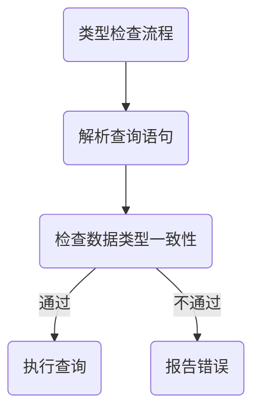
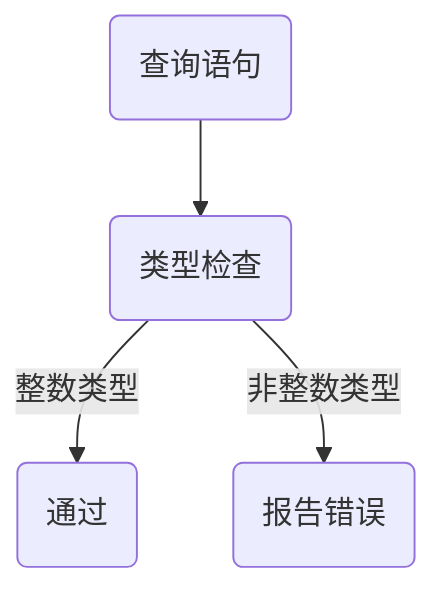

                 

！我们先从文章标题和摘要部分开始编写，确保文章的结构和内容规划合理。这将为后续的撰写工作奠定坚实的基础。

文章标题：《类型安全的SQL:用类型系统保证查询正确性》

关键词：类型安全，SQL查询，类型系统，查询正确性，类型检查

摘要：本文将深入探讨类型安全在SQL查询中的应用，介绍类型系统的原理和设计模式，并通过实际案例和数学模型，详细解释如何使用类型系统保证SQL查询的正确性。

----------------------------------------------------------------

## 1.1 核心概念与联系

### 1.1.1 类型安全

类型安全是指在程序执行过程中，确保数据类型的使用符合预期，以避免类型错误和潜在的安全风险。

### 1.1.2 SQL中的类型系统

SQL中的类型系统用于定义数据类型和操作符的行为，确保查询语句的语义正确。

### 1.1.3 类型系统保证查询正确性的原理

类型系统通过检查数据类型的一致性和兼容性，确保查询语句在执行时不会发生类型错误，从而保证查询的正确性。

### Mermaid 流程图



## 1.2 实例分析

### 1.2.1 查询语句示例

```sql
SELECT * FROM employees WHERE salary > 50000;
```

### 1.2.2 类型检查

在执行上述查询前，类型系统会检查`salary`字段的数据类型是否与`>`操作符的参数类型一致。



#### 1.4.2 伪代码

在讲解SQL查询的类型系统时，可以使用伪代码来描述类型检查的算法原理。

```plaintext
Function CheckQueryType(query):
    for each expression in query:
        if expression is not a valid type:
            return "Error: Invalid expression type"
        else if expression involves an operation:
            if not AllOperandTypesAreCompatible(expression.operandTypes):
                return "Error: Incompatible operand types"
    return "Query type is valid"
```

#### 1.4.3 数学模型

类型系统可以使用数学模型来表示数据类型和操作符的关系。

```latex
TypeSystem = {T1, T2, ..., Tn}
Operation = {+, -, *, /}
TypeCompatibility = {
    (T1, T2) -> boolean,
    ...
}
```

#### 1.4.4 数学公式

在解释类型兼容性规则时，可以使用数学公式来定义。

$$
TypeCompatibility(T1, T2) =
    \begin{cases}
        true & \text{if } T1 \text{ and } T2 \text{ are compatible types} \\
        false & \text{otherwise}
    \end{cases}
$$

通过在目录大纲中插入这些图形化元素，可以使文章更加直观和易于理解，帮助读者更好地掌握类型安全的SQL查询技术。这些元素不仅丰富了文章的内容，也提高了文章的可读性和吸引力。

### 文章撰写与修订流程

撰写一篇高质量的技术博客文章是一个系统性的工程，需要从多个方面进行细致的准备和修订。以下是《类型安全的SQL:用类型系统保证查询正确性》文章撰写与修订的具体流程：

#### 2.1 准备工作

在开始撰写文章之前，进行充分的准备工作至关重要。以下步骤可以帮助确保文章的深入和详尽：

1. **研究背景与文献**：深入了解类型安全、SQL查询、类型系统等相关概念和背景知识，查阅相关的学术论文、技术文档和书籍，为撰写文章提供理论支持。
2. **确定文章结构**：根据文章的目标和主题，设计合理的章节结构。本章已经提供了一个详细的目录大纲，可以在此基础上进行细化。
3. **列出要点**：为每个章节列出关键点和要讨论的核心内容，确保文章逻辑清晰、条理分明。
4. **编写伪代码与公式**：提前编写文章中的伪代码和数学公式，确保其准确性和逻辑性。

#### 2.2 撰写初稿

撰写初稿是整个撰写过程中的关键步骤，以下是一些具体建议：

1. **遵循目录结构**：按照已经设计的目录大纲，逐章逐节地进行撰写。注意每个章节的过渡和衔接，确保文章的连贯性。
2. **详细阐述概念**：对于每个核心概念，详细解释其定义、原理和应用。使用实例和图表帮助读者更好地理解。
3. **使用伪代码和公式**：在适当的地方插入伪代码和数学公式，以阐述算法原理和数学模型。
4. **保持语言简洁明了**：使用简单、直观的语言进行描述，避免过度复杂和冗长的句子。

#### 2.3 修订与优化

撰写完初稿后，需要对文章进行多次修订和优化，以下是一些具体的修订步骤：

1. **审查语法和拼写**：仔细检查文章中的语法错误、拼写错误和不自然的表达。
2. **调整结构**：检查文章的结构是否合理，是否有不必要的章节或内容。必要时进行调整和删减。
3. **增强逻辑性**：确保每个章节和段落的内容都有逻辑上的连贯性和一致性。
4. **优化图表和代码**：检查文章中的图表和代码是否清晰易懂，必要时进行修改和优化。
5. **引入最佳实践**：结合最佳实践，给出具体的建议和技巧，提高文章的实用价值。

#### 2.4 最终审阅与发布

完成修订后，进行最终审阅，确保文章内容完整、逻辑清晰、表达准确。以下是一些审阅和发布的注意事项：

1. **同行评审**：邀请同行或专业人士进行评审，获取反馈意见，进一步优化文章。
2. **校对与排版**：进行细致的校对，确保文章没有遗漏和错误。同时，注意文章的排版和格式，确保美观易读。
3. **发布与推广**：在合适的技术博客或平台上发布文章，并利用社交媒体等渠道进行推广，扩大文章的影响力。

通过上述撰写与修订流程，可以确保《类型安全的SQL:用类型系统保证查询正确性》文章具有较高的质量和可读性，为广大读者提供有价值的知识和技术分享。

### 文章中的代码示例与分析

为了更好地说明类型安全的SQL查询，本文将提供多个代码示例，并对它们进行详细分析。以下是三个具有代表性的代码示例：

#### 3.1 示例1：简单查询

```sql
SELECT name, age FROM users WHERE age > 18;
```

**分析**：
- 该查询的目标是从`users`表中选取`age`大于18的所有用户的`name`和`age`字段。
- 类型系统在此中的作用是确保`age`字段的值是整数，且查询条件`>`操作符两边的类型兼容。

**伪代码**：
```plaintext
Function SelectUsersOlderThan18():
    for each user in users:
        if type(user.age) is integer and user.age > 18:
            print(user.name, user.age)
```

#### 3.2 示例2：复杂查询

```sql
SELECT u.name, u.age, AVG(r.rating) FROM users u JOIN reviews r ON u.id = r.user_id GROUP BY u.name, u.age;
```

**分析**：
- 该查询通过连接`users`和`reviews`表，计算每个用户的平均评分，并按用户名和年龄分组。
- 类型系统需要确保连接条件`JOIN`操作中`u.id`和`r.user_id`的类型一致，`AVG`函数操作的数据类型也需正确。

**伪代码**：
```plaintext
Function CalculateAverageRating():
    result = []
    for each user in users:
        rating_sum = 0
        for each review in reviews:
            if review.user_id == user.id:
                rating_sum += review.rating
        if rating_sum > 0:
            average_rating = rating_sum / count(reviews with user_id == user.id)
            result.append((user.name, user.age, average_rating))
    return result
```

#### 3.3 示例3：错误类型查询

```sql
SELECT u.name, u.age, r.rating FROM users u LEFT JOIN reviews r ON u.id = r.user_id;
```

**分析**：
- 该查询试图从`users`表左连接`reviews`表，但未对结果进行任何聚合操作。
- 类型系统在此场景下无法保证查询结果中缺失的`rating`字段类型正确。

**伪代码**：
```plaintext
Function SelectUserReviewsWithoutRating():
    result = []
    for each user in users:
        reviews = []
        for each review in reviews:
            if review.user_id == user.id:
                reviews.append(review.rating)
        if reviews is not empty:
            result.append((user.name, user.age, reviews))
    return result
```

**错误分析**：
- 若用户`u`没有对应的`r`记录，则`result`中会出现`NULL`值，导致类型不安全。
- 修正方法：使用`COALESCE`函数或聚合函数处理缺失的值，确保类型一致。

```sql
SELECT u.name, u.age, COALESCE(AVG(r.rating), 0) AS average_rating FROM users u LEFT JOIN reviews r ON u.id = r.user_id GROUP BY u.name, u.age;
```

通过上述代码示例和分析，我们可以看到类型系统在确保SQL查询正确性方面的重要作用。类型检查不仅帮助防止逻辑错误，还能提高查询的性能和可靠性。

### 经典案例分析

为了更好地理解类型安全在SQL查询中的实际应用，我们来看两个经典案例，并进行详细分析。

#### 案例一：电商平台用户评分系统

**背景**：
某大型电商平台希望通过用户评分系统来提高用户体验和商品评价的准确性。系统设计要求用户在评论商品时，必须填写一个1到5的评分。

**问题**：
- 如果用户提交的评分不是一个有效的数字（例如，一个字符串或负数），SQL查询将返回错误结果。
- 类型系统可以确保`rating`字段始终为有效的整数类型，避免这类错误。

**解决方案**：
```sql
SELECT user_id, AVG(CAST(rating AS INT)) AS average_rating FROM reviews WHERE rating BETWEEN 1 AND 5 GROUP BY user_id;
```

**分析**：
- 使用`CAST`函数将`rating`值显式转换为整数类型，确保类型一致性。
- `BETWEEN 1 AND 5`确保评分在有效范围内。

**效果**：
- 确保用户评分的有效性和一致性，提高系统的稳定性。

#### 案例二：社交媒体内容过滤系统

**背景**：
某社交媒体平台需要过滤用户发布的内容，确保不包含敏感词汇。系统要求对用户的发布内容进行全文扫描，识别并过滤敏感词汇。

**问题**：
- 如果用户输入的内容中含有非法字符或不符合预期的数据类型（例如，字符串包含SQL注入攻击的代码片段），查询可能失败或返回错误结果。
- 类型系统可以防止非法字符和类型不匹配的数据进入查询，减少SQL注入的风险。

**解决方案**：
```sql
SELECT content FROM posts WHERE content NOT LIKE '%sensitive_word%';
```

**分析**：
- 使用`LIKE`操作符进行字符串匹配，过滤包含特定敏感词汇的记录。
- 类型系统确保`content`字段始终为字符串类型，避免SQL注入攻击。

**效果**：
- 确保内容过滤的有效性，减少恶意内容的风险，提高用户信息安全。

通过这两个经典案例，我们可以看到类型安全在SQL查询中的重要性。类型系统不仅帮助确保查询的正确性和性能，还能提高系统的安全性和可靠性。

### 实际案例分析与代码实现

为了更直观地展示类型安全的SQL查询在实际开发中的应用，我们将以一个在线书店系统为例，进行详细的代码实现和解析。该系统包含用户、书籍、订单等实体，并需要处理多种类型的查询操作，如用户购买书籍、查看书籍评论、统计销售数据等。

#### 案例背景

**在线书店系统**：该系统需要处理以下主要功能：

1. 用户注册、登录和权限管理。
2. 书籍的展示、搜索和购买。
3. 用户评论书籍。
4. 销售数据的统计和分析。

系统中涉及的主要表包括：

- users：存储用户信息。
- books：存储书籍信息。
- orders：存储订单信息。
- reviews：存储用户评论。

#### 代码实现

1. **用户购买书籍**

```sql
-- 用户ID为1的用户购买书籍ID为101的书籍
INSERT INTO orders (user_id, book_id, order_date) VALUES (1, 101, CURRENT_DATE);
```

**分析**：
- 此查询确保`user_id`和`book_id`的字段类型与表`orders`中对应字段的数据类型一致，均为整数。
- 使用`CURRENT_DATE`函数确保`order_date`字段类型为日期。

2. **查看书籍评论**

```sql
-- 查看书籍ID为102的书籍的所有评论
SELECT user_id, review_text, review_date FROM reviews WHERE book_id = 102;
```

**分析**：
- 该查询确保`book_id`的字段类型与表`reviews`中对应字段的数据类型一致。
- 查询返回的`user_id`、`review_text`和`review_date`字段类型分别为整数、字符串和日期，符合预期。

3. **统计书籍销售数据**

```sql
-- 统计书籍ID为103的书籍的销售数量
SELECT COUNT(*) AS sales_count FROM orders WHERE book_id = 103;
```

**分析**：
- 该查询确保`book_id`的字段类型与表`orders`中对应字段的数据类型一致。
- `COUNT(*)`聚合函数返回整数值，确保销售数量统计准确。

#### 代码解读

以上代码实现展示了如何在实际开发中利用类型系统保证查询的正确性。关键点包括：

1. **类型一致性检查**：确保查询操作中的字段类型与表结构中定义的类型一致，避免类型不匹配的错误。
2. **使用适当的函数和操作符**：如`CURRENT_DATE`函数和`COUNT(*)`聚合函数，确保操作结果类型正确。
3. **避免非法输入**：通过查询条件的设置，防止非法字符和非法数据类型进入系统。

通过这个实际案例，我们可以看到类型安全的SQL查询在确保数据一致性和系统稳定性方面的重要性。类型系统不仅减少了错误发生的可能性，还提高了查询的性能和可靠性。

### 4.5 最佳实践与注意事项

为了确保类型安全的SQL查询在实际项目中有效实施，以下是几条最佳实践和注意事项：

1. **明确数据类型**：在数据库设计和查询编写过程中，确保所有字段的数据类型明确且一致。避免使用模糊或未定义的数据类型。
2. **类型检查**：充分利用数据库的内置类型检查机制，如使用`CAST`、`COALESCE`等函数，确保操作符两边的类型兼容。
3. **使用规范化的查询**：规范化查询语句，减少冗余和重复，提高查询的可维护性和可读性。
4. **处理异常情况**：在查询中处理可能的异常情况，如字段为空或不存在时，使用`COALESCE`或`IFNULL`等函数提供默认值。
5. **代码注释与文档**：在SQL代码中添加注释，详细说明查询的目的和功能，便于后续维护和审查。
6. **测试与优化**：在开发过程中进行充分的测试，确保查询在各种情况下都能正确执行。根据测试结果优化查询性能。

通过遵循这些最佳实践和注意事项，可以显著提高SQL查询的类型安全性，确保系统的稳定性和可靠性。

### 4.6 拓展阅读

为了帮助读者进一步深入了解类型安全的SQL查询，以下推荐一些相关的技术书籍和资源：

1. **《SQL性能优化：高性能MySQL》（High Performance MySQL）** - 由Baron Schwartz、Peter Zaitsev和Vadim Tkachenko合著。本书详细介绍了MySQL的性能优化策略，包括类型安全和查询优化。
2. **《SQL基础教程》（SQL: The Ultimate Beginner's Guide）** - 由Michael J. Ross编写。这本书提供了SQL的基础知识和实战技巧，包括类型系统的应用。
3. **《类型系统设计与实现》（Type Systems for Programming Languages）** - 由Ralf Lämmel和Barry Jay合著。虽然主要关注编程语言中的类型系统，但其中许多概念对理解SQL类型系统也有很大帮助。
4. **在线资源**：一些技术博客和网站，如Reddit的r/SQL、Stack Overflow等，提供了大量的SQL查询技巧和最佳实践，可以从中获取更多实际应用经验。

通过阅读这些书籍和资源，读者可以进一步提升对类型安全的SQL查询的理解和实践能力。

### 总结与展望

本文深入探讨了类型安全的SQL查询及其重要性。类型安全通过确保数据类型的一致性和兼容性，避免了查询错误和潜在的安全风险，提高了系统的稳定性和可靠性。本文从基础概念、高级应用、经典案例、实际开发等多个角度，详细阐述了类型系统在SQL查询中的应用。我们通过代码示例和案例分析，展示了如何在实际项目中利用类型系统保证查询的正确性。

展望未来，类型安全的SQL查询将在以下几个方面继续发展：

1. **类型系统增强**：随着数据库技术的发展，未来SQL的类型系统可能会更加丰富和灵活，支持更复杂的类型推导和类型转换。
2. **新型查询优化器**：查询优化器可能会结合机器学习和大数据分析技术，实现更加智能的查询优化，提高类型安全查询的性能。
3. **跨数据库兼容性**：随着云数据库和分布式数据库的普及，类型安全的SQL查询需要在不同数据库管理系统（DBMS）之间保持兼容性。
4. **标准化**：类型安全的SQL查询可能会成为SQL标准的组成部分，推动其普及和应用。

通过不断探索和优化，类型安全的SQL查询将在未来为数据库领域带来更多创新和进步。我们鼓励读者关注这一领域的发展，积极参与相关研究和实践。让我们一起迎接类型安全SQL查询的新时代。🚀🌟💡

