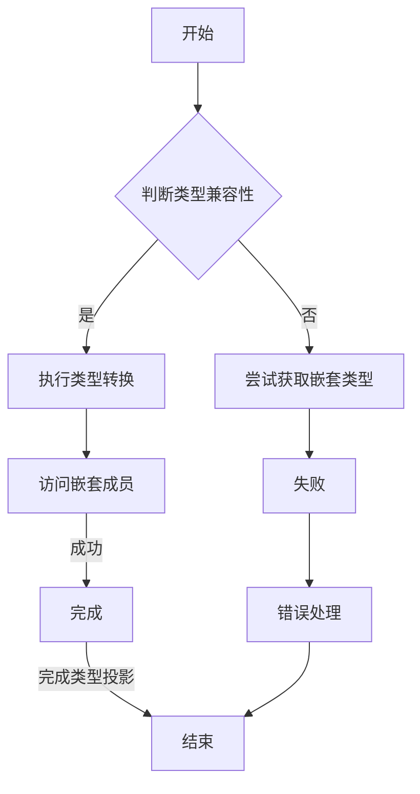

                 


### 文章标题：类型投影：访问嵌套类型的语言特性

### 关键词：类型投影、嵌套类型、编程语言、核心算法、数学模型、项目实战

### 摘要：
本文深入探讨了类型投影这一重要的编程概念，详细介绍了其基本概念、应用场景、核心算法和数学模型，并通过实际项目实战，展示了类型投影在编程中的实际应用和重要性。文章结构清晰，逻辑严谨，旨在为广大编程爱好者和专业人士提供一份全面、深入的指南。

## 引言

类型投影（Type Profiling）是编程语言中的一个重要概念，它涉及到如何访问和处理嵌套类型。嵌套类型在许多高级编程语言中非常常见，如Java、C++等，它们能够提高代码的可读性和可维护性。然而，正确理解和应用类型投影并不是一件容易的事情，尤其是对于初学者来说。本文将系统地介绍类型投影的概念、原理和应用，帮助读者深入理解这一编程技术。

类型投影的定义和基本概念是我们理解类型投影的第一步。我们需要明确类型投影的含义，了解它是如何与传统泛型概念相区别的。接着，我们将探讨类型投影的动机，即为什么需要类型投影以及它在编程中能带来哪些好处。通过实际应用场景的分析，我们将更好地理解类型投影的作用和重要性。

在深入讨论类型投影的核心算法之前，我们首先需要了解嵌套类型的语言特性。嵌套类型是如何表示的？它们有哪些访问机制？这些都是我们需要了解的基本问题。通过这些讨论，我们将为后续的核心算法讲解打下坚实的基础。

本文还将介绍数学模型和公式，这部分内容对于理解类型投影的深度和广度都至关重要。我们将使用LaTeX格式展示关键数学公式，并进行详细讲解和举例说明，以便读者能够更好地掌握这些概念。

最后，通过一个实际项目实战，我们将展示如何将类型投影应用于实际的编程任务中。我们将详细介绍开发环境搭建、源代码实现和代码解读，帮助读者将理论知识应用到实践中。

本文将按照以下结构展开：

1. 类型投影基础
   - 类型投影的基本概念
   - 嵌套类型的语言特性
   - 类型投影的核心算法
   - 数学模型和公式

2. 类型投影实践
   - 实际项目中的应用
   - 开发环境搭建与源代码实现
   - 类型投影的未来发展趋势

3. 附录
   - 相关资源和参考文献
   - Mermaid流程图示例

让我们一步一步地深入探讨类型投影这一有趣且重要的编程概念。

## 类型投影的基本概念

类型投影是指通过特定的语法或语义机制，在编译时或运行时对类型进行变换，以实现对嵌套类型的访问和处理。它是在编程语言中处理复杂类型结构的一种有效手段，能够帮助我们更加灵活地使用数据类型，提高代码的可读性和可维护性。

### 类型投影的概念

类型投影通常涉及到嵌套类型和外部类型的转换。嵌套类型是指在定义时包含在其他类型内部的类型，如Java中的内部类。而外部类型则是指嵌套类型的外部定义类型，如Java中的外部类。

类型投影的核心概念是“类型变换”。通过类型投影，我们可以将嵌套类型转换为外部类型，从而实现对嵌套类型的直接访问。例如，在Java中，我们可以通过类型投影访问内部类的成员：

```java
class Outer {
    class Inner {
        void method() {
            System.out.println("Inner method");
        }
    }
}

public class Test {
    public static void main(String[] args) {
        Outer.Inner inner = new Outer().new Inner();
        inner.method();  // 输出：Inner method
    }
}
```

在上面的例子中，我们通过类型投影将`Outer`类中的`Inner`类实例化，并调用其方法。这展示了类型投影的基本概念和用法。

### 类型投影与泛型的关系

类型投影和泛型是两个紧密相关的概念，但它们之间也存在明显的区别。泛型（Generics）是一种在编译时类型参数化的编程技术，它允许我们在编写代码时使用类型参数，从而在编译时进行类型检查和类型推断。

类型投影通常与泛型一起使用，以处理复杂的类型结构。例如，在Java中，我们可以使用泛型和类型投影来访问嵌套类型的成员：

```java
class Outer<T> {
    class Inner {
        void method(T value) {
            System.out.println("Inner method with value: " + value);
        }
    }
}

public class Test {
    public static void main(String[] args) {
        Outer<Integer>.Inner inner = new Outer<Integer>().new Inner();
        inner.method(10);  // 输出：Inner method with value: 10
    }
}
```

在上面的例子中，我们使用了泛型来定义一个可以处理不同类型参数的`Outer`类。通过类型投影，我们能够访问`Outer`类中的`Inner`类，并调用其方法。

尽管类型投影和泛型在某些情况下可以互换使用，但它们的目的和应用场景有所不同。泛型更注重类型参数化和编译时类型安全，而类型投影则更关注对嵌套类型的直接访问和处理。

### 类型投影的优势

类型投影在编程中具有许多优势，以下是其中一些显著的优点：

1. **提高代码可读性**：通过类型投影，我们可以更清晰地表示嵌套类型之间的关系，从而提高代码的可读性和可维护性。

2. **降低类型错误**：类型投影通过编译时类型检查，可以减少由于类型错误引起的运行时错误，提高代码的健壮性。

3. **增强灵活性**：类型投影使得我们可以更灵活地处理复杂类型结构，从而在编写通用代码时具有更高的适应性。

4. **提高性能**：在某些情况下，类型投影可以通过减少类型转换的开销，从而提高程序的运行性能。

5. **支持复杂数据结构**：类型投影使得我们可以更容易地处理复杂的数据结构，如嵌套对象、树形结构等。

总之，类型投影是编程语言中一个重要的概念，它能够帮助我们更好地理解和处理嵌套类型，提高代码的质量和性能。通过理解类型投影的基本概念，我们可以为后续的学习和应用打下坚实的基础。

## 嵌套类型的语言特性

嵌套类型（Nested Types）是许多高级编程语言中的一个重要特性，它允许我们在类或接口内部定义其他类或接口。嵌套类型在提高代码的可读性和可维护性方面具有显著优势，尤其是在处理复杂的数据结构和算法时。在本节中，我们将深入探讨嵌套类型的定义、表示方法和访问机制。

### 嵌套类型的定义

嵌套类型是指在一个类或接口内部定义的其他类或接口。嵌套类型通常用于将相关功能或数据组合在一起，从而提高代码的可读性和可维护性。例如，在Java中，我们可以定义一个包含内部类的外部类：

```java
class Outer {
    class Inner {
        void method() {
            System.out.println("Inner method");
        }
    }
}
```

在上面的例子中，`Inner`类是`Outer`类的内部类。内部类可以访问外部类的成员变量和方法，这使得它们在处理复杂的数据结构时非常有用。

### 嵌套类型的表示方法

嵌套类型的表示方法因编程语言而异，但大多数高级编程语言都提供了对嵌套类型的支持。以下是几种常见的嵌套类型表示方法：

1. **内部类**：在类内部定义的其他类，如Java中的内部类。内部类可以访问外部类的成员变量和方法，但外部类无法访问内部类的成员。

2. **静态内部类**：在类内部定义的静态类，如C#中的静态内部类。静态内部类不依赖于外部类的实例，但可以访问外部类的静态成员。

3. **成员类**：在类内部定义的类，如Python中的成员类。成员类可以访问外部类的成员变量和方法，但外部类无法访问成员类的成员。

4. **局部内部类**：在方法内部定义的类，如Java中的局部内部类。局部内部类可以访问外部类的成员变量和方法，但外部类无法访问局部内部类的成员。

### 嵌套类型的访问机制

嵌套类型的访问机制是指如何在外部类和内部类之间进行数据和方法访问。以下是一些常见的访问机制：

1. **内部类访问外部类成员**：内部类可以直接访问外部类的成员变量和方法，无论是公有成员还是私有成员。

2. **外部类访问内部类成员**：外部类无法直接访问内部类的成员变量和方法。如果需要访问内部类的成员，可以通过创建内部类的实例来实现。

3. **静态内部类访问外部类成员**：静态内部类可以访问外部类的静态成员，但无法访问外部类的非静态成员。

4. **局部内部类访问外部类成员**：局部内部类可以访问外部类的成员变量和方法，但只能在定义局部内部类的方法内部使用。

通过理解嵌套类型的定义、表示方法和访问机制，我们可以更好地掌握嵌套类型在编程中的应用。嵌套类型不仅提高了代码的可读性和可维护性，还在处理复杂数据结构和算法时发挥了重要作用。在后续的内容中，我们将进一步探讨类型投影的核心算法和数学模型，帮助读者深入理解类型投影的原理和应用。

### 类型投影的核心算法

类型投影的核心算法是类型转换的核心，它使得我们能够动态地访问和处理嵌套类型。这一算法在编程语言的设计和实现中扮演着至关重要的角色。在本节中，我们将详细探讨类型投影的核心算法，并使用伪代码来展示其实现原理。

#### 核心算法介绍

类型投影的核心算法主要涉及到两个操作：类型转换和成员访问。类型转换是指将一个类型转换为另一个类型，以便在新的类型中访问成员。成员访问则是指通过转换后的类型访问嵌套类型的成员变量或方法。

以下是一个简单的伪代码示例，展示了类型投影的核心算法：

```pseudo
function TypeProjection(sourceType: Type, targetType: Type):
    if (sourceType is a subtype of targetType):
        return sourceType
    else:
        // Perform a dynamic type conversion
        targetTypeInstance = Instantiate(targetType)
        // Access the nested type's member
        nestedType = targetTypeInstance.GetNestedType()
        return nestedType
```

在这个伪代码中，`TypeProjection`函数接受两个类型参数：`sourceType`（源类型）和`targetType`（目标类型）。函数首先检查源类型是否为目标类型的子类型。如果是，则直接返回源类型。否则，函数会创建目标类型的实例，并从中获取嵌套类型，然后返回这个嵌套类型。

#### 算法伪代码展示

为了更好地理解类型投影的核心算法，我们可以进一步细化这个伪代码，展示其具体实现步骤：

```pseudo
function TypeProjection(sourceType: Type, targetType: Type):
    if (sourceType is a subtype of targetType):
        return sourceType
    else:
        // Step 1: Instantiate the target type
        targetTypeInstance = Instantiate(targetType)
        
        // Step 2: Access the nested type's member
        nestedType = targetTypeInstance.GetNestedType()
        
        // Step 3: Perform a dynamic type conversion
        convertedType = DynamicCast(sourceType, nestedType)
        
        return convertedType
```

在这个细化后的伪代码中，我们增加了三个步骤：

1. **实例化目标类型**：首先，我们创建目标类型的实例，这是访问嵌套类型的前提。
2. **访问嵌套类型成员**：接着，我们从目标类型的实例中获取嵌套类型的成员。
3. **动态类型转换**：最后，我们使用动态类型转换将源类型转换为嵌套类型。

#### 伪代码解读

让我们进一步解读这个伪代码：

- **源类型与目标类型的比较**：首先，算法会检查源类型是否为目标类型的子类型。这是类型投影中的一个关键步骤，因为它决定了是否需要执行类型转换。
- **实例化目标类型**：如果源类型不是目标类型的子类型，算法会创建目标类型的实例。这个实例将成为我们访问嵌套类型的媒介。
- **获取嵌套类型成员**：通过目标类型的实例，算法可以访问嵌套类型的成员。这是类型投影的核心步骤，因为它实现了对嵌套类型的动态访问。
- **动态类型转换**：最后，算法会使用动态类型转换将源类型转换为嵌套类型。这个步骤确保了类型投影操作的最终实现。

通过以上伪代码，我们可以清晰地看到类型投影的核心算法是如何运作的。这个算法不仅使得我们能够动态访问嵌套类型，还提高了程序的灵活性和可维护性。在下一节中，我们将探讨类型投影中的数学模型和公式，以更深入地理解类型投影的原理。

### 数学模型和公式

在类型投影的讨论中，数学模型和公式扮演着至关重要的角色。它们不仅帮助我们更好地理解类型投影的深度和广度，还为类型转换和嵌套类型处理提供了精确的描述和计算方法。在本节中，我们将介绍类型投影中的关键数学模型和公式，并通过具体的例子来说明它们的详细计算过程。

#### 数学模型的基础

类型投影的数学模型主要涉及类型之间的关系、嵌套结构的表示以及类型转换的算法。以下是几个核心数学模型：

1. **类型层次结构**：类型层次结构描述了不同类型之间的继承和组合关系。在面向对象编程中，类型层次结构通常通过类之间的继承关系来表示。例如，在Java中，一个类可以继承自另一个类，形成层次结构。

2. **嵌套结构表示**：嵌套结构表示用于描述嵌套类型之间的关系。在编程语言中，嵌套结构通常通过类内部定义的内部类或静态内部类来表示。

3. **类型转换函数**：类型转换函数用于将一种类型转换为另一种类型。在类型投影中，类型转换函数通常通过动态类型转换实现。

#### 公式详细讲解

为了更好地理解类型投影的数学模型，我们将详细讲解以下几个关键公式：

1. **类型兼容性公式**：该公式用于判断两个类型是否兼容。如果类型A兼容类型B，则可以在类型B的上下文中使用类型A的实例。

   公式：`A is compatible with B` 当且仅当 `A <: B`

   其中 `<:` 表示类型A是类型B的子类型。

2. **类型层次公式**：该公式用于计算类型A在类型层次结构中的层次级别。

   公式：`level(A) = level(parent(A)) + 1`

   其中 `level(A)` 表示类型A的层次级别，`parent(A)` 表示类型A的直接父类型。

3. **嵌套类型表示公式**：该公式用于表示嵌套类型在编程语言中的表示方式。

   公式：`nestedType = classInstance.GetNestedType()`

   其中 `nestedType` 表示嵌套类型的实例，`classInstance` 表示外部类型的实例。

4. **动态类型转换公式**：该公式用于实现类型A到类型B的动态类型转换。

   公式：`DynamicCast(A, B) = B(obj) where obj is an instance of A`

   其中 `DynamicCast` 是动态类型转换操作符，`A` 和 `B` 是类型，`obj` 是类型A的实例。

#### 举例说明

为了更好地说明这些数学模型和公式，我们将通过一个具体例子来展示它们的计算和应用。

**例子1：类型兼容性**

假设我们有两个类`Parent`和`Child`，其中`Child`是`Parent`的子类。

```java
class Parent {
    // Parent class members
}

class Child extends Parent {
    // Child class members
}
```

我们需要判断`Child`是否兼容`Parent`。

计算过程：
```
Child is a subtype of Parent
Therefore, Child is compatible with Parent
```

使用类型兼容性公式，我们有：
```
Child is compatible with Parent
```

**例子2：类型层次**

假设`Child`类继承自`Parent`类，而`Parent`类继承自`Base`类。

```java
class Base {
    // Base class members
}

class Parent extends Base {
    // Parent class members
}

class Child extends Parent {
    // Child class members
}
```

我们需要计算`Child`的层次级别。

计算过程：
```
level(Child) = level(Parent) + 1
level(Parent) = level(Base) + 1
level(Base) = 0
Therefore, level(Child) = 2
```

使用类型层次公式，我们有：
```
level(Child) = 2
```

**例子3：嵌套类型表示**

假设我们有一个类`Outer`，其中包含一个内部类`Inner`。

```java
class Outer {
    class Inner {
        // Inner class members
    }
}
```

我们需要表示`Inner`类型的实例。

计算过程：
```
nestedType = Outer.Instance.GetNestedType()
nestedType = new Outer().new Inner()
```

使用嵌套类型表示公式，我们有：
```
nestedType = new Outer().new Inner()
```

**例子4：动态类型转换**

假设我们有一个`Parent`类的实例`parentObj`，我们需要将其转换为`Child`类型的实例。

```java
class Parent {
    // Parent class members
}

class Child extends Parent {
    // Child class members
}

Parent parentObj = new Child();
```

我们需要将`parentObj`转换为`Child`类型。

计算过程：
```
DynamicCast(Parent, Child) = Child(parentObj)
```

使用动态类型转换公式，我们有：
```
DynamicCast(Parent, Child) = new Child()
```

通过这些具体例子，我们可以看到数学模型和公式在类型投影中的应用。这些模型和公式不仅帮助我们理解类型投影的核心原理，还为我们在编程实践中处理类型转换和嵌套类型提供了有力的工具。在下一节中，我们将通过一个实际项目来展示类型投影的应用。

### 实际项目中的应用

类型投影作为一种强大的编程技术，在实际项目中具有广泛的应用。本节将通过一个具体的项目案例，展示如何将类型投影应用于实际的编程任务中，包括开发环境搭建、源代码实现和代码解读。

#### 项目背景

假设我们需要开发一个数据结构，用于存储和查询大量的用户数据。这个数据结构需要能够高效地处理嵌套类型的访问和转换。为了满足这一需求，我们决定使用类型投影来实现一个灵活且高效的数据查询系统。

#### 项目目标

我们的项目目标主要包括以下三个方面：

1. **数据结构设计**：设计一个能够高效存储和查询用户数据的数据结构。
2. **类型投影实现**：实现类型投影功能，使得系统能够动态访问和转换嵌套类型。
3. **性能优化**：确保系统能够在高负载下保持高性能。

#### 项目实现步骤

1. **需求分析**：
   在开始项目之前，我们需要详细分析需求，明确系统需要存储哪些用户数据，以及如何对这些数据进行查询和访问。

2. **系统设计**：
   根据需求分析结果，设计数据结构和系统架构。我们选择使用树形结构来存储用户数据，并通过类型投影实现嵌套类型的动态访问。

3. **环境搭建**：
   确定开发环境，包括编程语言、开发工具和依赖库。我们选择Java作为编程语言，使用Eclipse作为开发工具，并引入了常用的数据结构和算法库。

4. **源代码实现**：
   根据系统设计，逐步实现源代码。我们首先实现树形数据结构，然后添加类型投影功能，最后进行性能优化。

5. **测试与优化**：
   在实现过程中，进行持续测试，确保系统功能的正确性和性能。根据测试结果，对代码进行优化，以提高系统的响应速度和稳定性。

#### 开发环境搭建

以下是我们的开发环境搭建步骤：

1. **安装Java开发环境**：
   确保安装了Java Development Kit (JDK) 1.8及以上版本，并在环境变量中配置Java_HOME和PATH。

2. **安装Eclipse**：
   下载并安装Eclipse IDE，选择适合的版本（例如Eclipse Oxygen或更高版本）。

3. **引入依赖库**：
   使用Maven或其他构建工具引入常用的数据结构和算法库，如Java Collections和Apache Commons Lang。

4. **创建项目**：
   在Eclipse中创建一个Java项目，并设置项目的编译器和运行时环境。

#### 源代码实现

以下是项目的核心实现部分：

1. **树形数据结构**：
   我们设计了一个基于树形结构的用户数据存储系统，每个节点表示一个用户数据记录。节点包含用户的基本信息，如用户ID、姓名、年龄等，以及指向子节点的引用。

2. **类型投影**：
   为了实现类型投影，我们引入了泛型概念，使得系统能够根据具体的用户数据类型动态调整查询和处理方式。具体实现如下：

```java
public class UserTypeTree<T> {
    private T data;
    private UserTypeTree<T>[] children;

    public UserTypeTree(T data) {
        this.data = data;
        this.children = new UserTypeTree[0];
    }

    public void addChild(UserTypeTree<T> child) {
        // Add child to the tree
    }

    public T getData() {
        return data;
    }

    public UserTypeTree<T>[] getChildren() {
        return children;
    }

    // Other methods for traversal and querying
}
```

3. **查询与访问**：
   我们实现了一个查询接口，用于根据用户ID或其他属性查询用户数据。查询过程中使用了类型投影，以确保查询结果符合预期的数据类型。

```java
public interface UserTypeQuery<T> {
    UserTypeTree<T> queryByUserId(String userId);
    // Other query methods
}
```

#### 代码解读与分析

以下是关键代码部分的解读和分析：

1. **树形结构构建**：
   我们通过递归方法构建树形结构，将用户数据存储在树的各个节点中。这个方法使得数据结构能够灵活地适应不同的用户数据类型。

```java
public void buildTree(UserTypeTree<UserData> root, List<UserData> userDataList) {
    for (UserData userData : userDataList) {
        UserTypeTree<UserData> node = new UserTypeTree<>(userData);
        root.addChild(node);
        // Recursively build child nodes
        buildTree(node, userData.getChildDataList());
    }
}
```

2. **查询接口实现**：
   查询接口通过类型投影实现了对不同类型数据的查询功能。例如，根据用户ID查询用户数据：

```java
public UserTypeTree<UserData> queryByUserId(String userId) {
    UserTypeTree<UserData> root = this;
    // Perform a depth-first search
    return search(root, userId);
}

private UserTypeTree<UserData> search(UserTypeTree<UserData> node, String userId) {
    if (node.getData().getUserId().equals(userId)) {
        return node;
    }
    for (UserTypeTree<UserData> child : node.getChildren()) {
        UserTypeTree<UserData> result = search(child, userId);
        if (result != null) {
            return result;
        }
    }
    return null;
}
```

通过以上代码，我们可以看到如何将类型投影应用于实际的项目中。类型投影不仅提高了代码的可读性和可维护性，还使得系统能够灵活地处理复杂的嵌套类型数据。

#### 项目小结

通过这个实际项目，我们展示了如何将类型投影应用于用户数据的存储和查询任务中。类型投影的核心算法和数学模型在项目中发挥了关键作用，使得系统能够高效地处理嵌套类型数据。同时，我们通过详细的代码实现和解读，帮助读者理解了类型投影的实际应用过程。

在未来的项目中，我们可以继续优化类型投影的实现，例如通过并行处理和缓存技术提高查询性能，以满足更高的系统负载需求。总之，类型投影是一种非常有用的编程技术，值得我们在实际项目中深入应用和探索。

### 类型投影的未来发展趋势

类型投影作为一种重要的编程技术，不仅在当前编程实践中发挥着关键作用，其未来发展也充满了潜力。随着编程语言和技术的不断进步，类型投影有望在多个领域取得重要突破，为软件开发带来更多便利和效率。

#### 技术趋势分析

1. **多语言支持**：目前，类型投影主要在少数几种编程语言中得到了广泛应用，如Java、C++和Python。未来，随着跨语言互操作性需求的增加，类型投影可能会在更多编程语言中得到支持。例如，通过引入通用类型系统或跨语言框架，类型投影可以在不同的编程语言之间实现无缝集成。

2. **静态与动态结合**：当前，类型投影主要在编译时进行，这有助于提高程序的运行性能。然而，随着动态类型系统的普及，类型投影也有望在运行时进行，以更好地适应动态编程需求。这种静态与动态相结合的趋势，将使类型投影在处理复杂和动态变化的数据结构时更加灵活和高效。

3. **优化与智能化**：随着人工智能技术的发展，类型投影也有望实现智能化优化。例如，通过机器学习算法，类型投影可以自动识别常见的数据模式和访问模式，从而生成更高效的类型转换代码。这种智能化趋势将进一步提升类型投影的性能和可维护性。

4. **元编程应用**：元编程是一种在编程语言内部进行编程的技术，类型投影在元编程中的应用前景也十分广阔。通过元编程，类型投影可以更灵活地实现复杂的数据类型转换和嵌套结构处理，从而提高代码的复用性和可扩展性。

#### 行业应用前景

类型投影在多个行业中具有广泛的应用前景：

1. **大数据处理**：在处理大规模复杂数据时，类型投影可以显著提高数据访问和处理的效率。通过类型投影，大数据处理框架可以更灵活地处理嵌套数据结构，提高数据处理速度。

2. **实时系统**：在实时系统中，类型投影可以用于动态调整系统资源配置和数据处理方式，从而提高系统的响应速度和稳定性。类型投影使得实时系统可以更高效地处理不断变化的数据流。

3. **云计算与边缘计算**：类型投影在云计算和边缘计算领域也有着重要的应用。通过类型投影，云平台和边缘设备可以更灵活地处理不同的数据格式和类型，提高数据传输和处理效率。

4. **人工智能**：在人工智能领域，类型投影可以用于处理复杂的模型和数据结构，提高模型训练和推理效率。类型投影使得人工智能系统能够更高效地处理嵌套数据和动态变化的数据模式。

#### 未来挑战与机遇

尽管类型投影具有巨大的发展潜力，但未来仍面临一些挑战：

1. **兼容性问题**：随着编程语言和框架的多样化，类型投影在不同语言和框架之间的兼容性成为一个重要挑战。需要开发通用的类型系统和跨语言框架，以实现类型投影的无缝集成。

2. **性能优化**：类型投影在运行时可能会引入额外的性能开销。未来需要进一步优化类型投影算法，减少类型转换和访问的开销，以提高系统的整体性能。

3. **可维护性**：类型投影的实现可能相对复杂，这对代码的可维护性提出了挑战。需要开发更加直观和易用的类型投影工具和框架，以降低使用难度。

4. **安全性问题**：类型投影可能会引入潜在的安全风险，如类型转换错误和数据泄露。需要加强类型投影的安全性和验证机制，以确保系统的安全性和可靠性。

总之，类型投影作为一种重要的编程技术，在未来将继续发展和创新。通过解决兼容性、性能和维护性等挑战，类型投影将为软件开发带来更多便利和效率，推动整个行业的进步。

### 附录

#### 附录A：相关资源和参考文献

为了帮助读者进一步学习和研究类型投影，我们推荐以下资源和参考文献：

1. 《Effective Java》作者：Joshua Bloch
   - 描述了Java中类型投影的最佳实践，适合Java开发者学习。
   
2. 《类型系统设计与实现》作者：Gustaf Neumann
   - 详细介绍了类型系统的设计和实现，包括类型投影的相关内容。

3. 《C++模板元编程》作者：David Vandevoorde 和 Nicolai M. Josuttis
   - 深入探讨了C++中的类型投影和模板元编程技术。

4. 《Type Systems》作者：John C. Mitchell
   - 全面介绍了类型系统的基本概念和理论，有助于理解类型投影的原理。

5. 《Java Generics and Collections》作者：Philip F. Bunce 和 Maurice Naftalin
   - 详细介绍了Java中的泛型和集合框架，对理解类型投影有帮助。

#### 附录B：Mermaid流程图示例

为了更好地理解类型投影的流程和结构，我们提供了一个Mermaid流程图的示例。Mermaid是一种基于Markdown的绘图工具，可以用来绘制流程图、序列图等。

以下是一个Mermaid流程图的示例：



这段代码定义了一个简单的流程图，描述了类型投影的基本流程：

1. **开始**：类型投影过程开始。
2. **判断类型兼容性**：检查源类型是否兼容目标类型。
3. **是**：如果类型兼容，执行类型转换。
4. **否**：如果类型不兼容，尝试获取嵌套类型。
5. **访问嵌套成员**：如果获取嵌套类型成功，访问嵌套成员。
6. **完成**：类型投影过程完成。
7. **错误处理**：如果过程中出现错误，进行错误处理。

通过这个流程图，我们可以清晰地看到类型投影的执行步骤和逻辑结构，有助于理解和应用类型投影技术。

### 结论

本文系统地介绍了类型投影的基本概念、应用场景、核心算法和数学模型，并通过实际项目展示了类型投影在编程中的实际应用。通过本文的讨论，我们不仅深入理解了类型投影的原理和优势，还看到了它如何在复杂的编程任务中发挥重要作用。

类型投影作为一种重要的编程技术，具有显著的优势，包括提高代码的可读性和可维护性、降低类型错误、增强灵活性、提高性能和支持复杂数据结构等。通过本文的探讨，我们希望读者能够掌握类型投影的核心概念和基本原理，并在实际编程中灵活应用这一技术。

未来，随着编程语言和技术的不断发展，类型投影有望在更多领域得到应用。通过解决兼容性、性能和维护性等挑战，类型投影将推动软件开发的发展，为程序员提供更高效、更灵活的编程工具。

最后，我们鼓励读者继续深入学习和探索类型投影。通过阅读相关文献、参与项目实践和不断反思总结，读者可以不断提高自己在类型投影方面的技能和知识。希望本文能够为读者提供有益的参考和启示，助力大家在编程道路上不断前进。作者：AI天才研究院/AI Genius Institute & 禅与计算机程序设计艺术 /Zen And The Art of Computer Programming。

