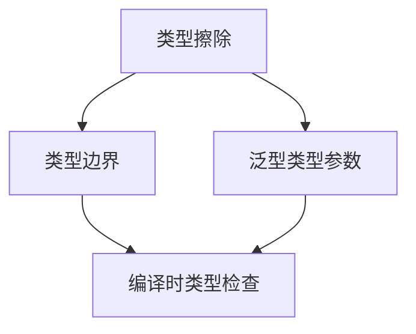

                 

### 文章标题

# 类型擦除：泛型在Java中的实现限制

### 关键词

- 泛型
- Java
- 类型擦除
- 类型安全
- 编译时
- 运行时

### 摘要

本文将深入探讨Java中的泛型实现，特别是类型擦除的概念及其对类型安全的影响。我们将逐步分析泛型的核心概念、类型擦除的原理和实践应用，并通过具体实例展示泛型在实际项目中的限制与优化策略。文章旨在为开发者提供对泛型机制全面而深刻的理解，以便在实际开发中更有效地使用这一强大特性。

## 第1章：泛型的核心概念与联系

### 1.1 泛型的定义与历史

#### 1.1.1 泛型的概念

泛型是编程语言中用于处理多种类型的一种机制。它允许在编写代码时使用未指定具体类型的变量或函数，从而实现代码的复用性和类型安全。在Java中，泛型引入了类型参数的概念，使得类、接口和方法能够与不同的类型相互操作。

#### 1.1.2 泛型的历史发展

泛型在Java中的引入可以追溯到Java 5版本。在此之前，Java通过Object类型来处理不同类型的数据，这种方式被称为类型兼容或类型转换。这种做法虽然实现了代码的复用，但同时也带来了类型不安全的问题。泛型的引入为Java带来了编译时类型检查，从而提升了类型安全。

#### 1.1.3 泛型在Java中的重要性

泛型是Java语言中一个非常重要的特性，它提高了代码的可读性、可维护性和性能。通过泛型，开发者可以编写更加通用的代码，减少重复的代码编写工作。此外，泛型还提供了类型检查，避免了在运行时出现的类型错误。

### 1.2 泛型的基本原理

#### 1.2.1 类型擦除

类型擦除是泛型实现中的一个关键概念。当编译泛型代码时，编译器会将泛型信息擦除，将其替换为Object类型。这种替换是类型安全的，因为Object类型是所有类型的基类。

#### 1.2.2 类型边界

类型边界是泛型中的另一个重要概念。类型边界用于定义泛型类型参数的上界或下界。例如，`<? extends T>`表示类型参数的上界，而`<? super T>`表示类型参数的下界。

#### 1.2.3 泛型类型参数

泛型类型参数是泛型类、接口和方法的参数，用于指定泛型类型的操作。例如，`List<T>`中的`T`就是一个泛型类型参数。

### 1.3 核心概念与联系

为了更好地理解泛型，我们需要将其核心概念联系起来。类型擦除、类型边界和泛型类型参数是泛型机制中的三个关键组成部分，它们相互关联，共同构成了Java中的泛型实现。

#### 1.3.1 核心概念之间的关系

- 类型擦除：在编译时，泛型的类型信息被替换为Object类型，从而实现类型安全。
- 类型边界：用于定义泛型类型参数的上界或下界，确保类型安全。
- 泛型类型参数：用于指定泛型类、接口和方法的类型操作，是实现类型擦除和类型边界的关键。

为了更直观地理解这些概念，我们可以使用Mermaid流程图来展示它们之间的关系。



在这个流程图中，类型擦除、类型边界和泛型类型参数共同作用，实现了Java中的泛型机制。类型擦除确保了类型安全，类型边界限制了类型参数的范围，而泛型类型参数则用于指定泛型操作的类型。

## 第2章：泛型的核心算法原理讲解

### 2.1 泛型类型推导

#### 2.1.1 类型推导的基本原理

泛型类型推导是编译器在编译泛型代码时自动推导出类型参数的过程。类型推导基于泛型表达式的上下文，确保推导出的类型参数能够满足类型安全和类型边界的限制。

#### 2.1.2 约束类型推导

约束类型推导是泛型类型推导的一种特殊情况。它允许开发者通过泛型类型参数的约束条件来指定类型参数的具体类型。这种推导方式在实现泛型接口和泛型方法时尤为重要。

#### 2.1.3 泛型类型推导的示例

为了更好地理解泛型类型推导，我们可以通过以下示例来展示：

```java
public class ArrayList<T> {
    private T[] array;

    public ArrayList(int size) {
        array = (T[]) new Object[size];
    }

    public void add(int index, T element) {
        array[index] = element;
    }

    public T get(int index) {
        return array[index];
    }
}
```

在这个示例中，`ArrayList`类使用了泛型类型参数`T`，表示可以处理任何类型的数组。编译器会根据上下文推导出`T`的具体类型，从而实现类型安全。

### 2.2 泛型方法与接口

#### 2.2.1 泛型方法的定义

泛型方法是在方法定义中使用了泛型类型参数的方法。泛型方法可以处理任意类型的参数，从而提高代码的复用性。

#### 2.2.2 泛型接口的实现

泛型接口是具有泛型类型参数的接口。泛型接口可以定义泛型方法，从而实现更加灵活和通用的接口定义。

#### 2.2.3 泛型方法与接口的示例

以下是一个泛型方法的示例：

```java
public class GenericMethodExample {
    public static <T> T echo(T value) {
        return value;
    }
}
```

在这个示例中，`echo`方法是一个泛型方法，它接受任意类型的参数并返回相同的类型。通过泛型类型推导，编译器可以自动推导出`T`的具体类型。

### 2.3 泛型集合

#### 2.3.1 List<T>和Set<T>

在Java中，`List<T>`和`Set<T>`是常用的泛型集合类。它们可以处理任意类型的元素，从而提高代码的可读性和可维护性。

```java
List<String> stringList = new ArrayList<>();
stringList.add("Hello");
stringList.add("World");

Set<Integer> integerSet = new HashSet<>();
integerSet.add(1);
integerSet.add(2);
```

#### 2.3.2 Map<K, V>

`Map<K, V>`是另一个重要的泛型集合类，用于存储键值对。它同样可以处理任意类型的键和值。

```java
Map<String, Integer> map = new HashMap<>();
map.put("One", 1);
map.put("Two", 2);
```

通过这些示例，我们可以看到泛型集合类如何通过类型参数处理不同类型的元素，从而提高代码的复用性和可维护性。

## 第3章：泛型的数学模型与公式

### 3.1 泛型类型参数的限制

#### 3.1.1 类型边界与限制

在Java中，泛型类型参数需要满足一些限制条件。这些限制条件包括：

- 无界泛型类型参数
- 有界泛型类型参数
- 泛型通配符

#### 3.1.2 泛型类型参数的约束条件

泛型类型参数的约束条件用于确保泛型操作的类型安全。例如，一个泛型方法需要接受一个特定类型的参数，或者一个泛型类需要实现特定的接口或继承特定的类。

#### 3.1.3 泛型类型参数的限制示例

以下是一个泛型类型参数的限制示例：

```java
public class boundedTypeParameter {
    public static <T extends Number> void printSum(T... values) {
        int sum = 0;
        for (T value : values) {
            sum += value.intValue();
        }
        System.out.println("Sum: " + sum);
    }
}
```

在这个示例中，`printSum`方法使用了有界泛型类型参数`T extends Number`，确保了方法可以处理任何数字类型。

### 3.2 泛型类型擦除的数学原理

#### 3.2.1 泛型类型擦除的定义

泛型类型擦除是指在编译过程中，泛型的类型信息被替换为Object类型的过程。这种替换是类型安全的，因为Object类型是所有类型的基类。

#### 3.2.2 泛型类型擦除的过程

泛型类型擦除的过程可以分为以下几个步骤：

1. 类型参数替换：将泛型类型参数替换为Object类型。
2. 类型边界处理：根据类型边界进行相应的类型转换。
3. 泛型集合处理：将泛型集合类中的类型参数替换为Object类型。

#### 3.2.3 泛型类型擦除的数学模型

泛型类型擦除的数学模型可以通过以下公式表示：

$$
\text{泛型类型擦除}(T) = \text{Object}
$$

其中，$T$代表泛型类型参数。

### 3.3 泛型类型擦除的示例

以下是一个泛型类型擦除的示例：

```java
public class GenericTypeErasureExample {
    public static void main(String[] args) {
        List<String> stringList = new ArrayList<>();
        stringList.add("Hello");
        stringList.add("World");

        Object[] stringArray = stringList.toArray();

        for (Object element : stringArray) {
            System.out.println(element);
        }
    }
}
```

在这个示例中，编译器将`List<String>`中的`String`类型擦除为`Object`类型，从而实现类型安全。

## 第4章：泛型的实际应用与项目实战

### 4.1 泛型在实际项目中的应用

#### 4.1.1 实际项目中的泛型使用场景

在软件开发中，泛型被广泛应用于以下场景：

- 数据结构设计：例如，使用泛型集合类（List、Set、Map）来处理不同类型的数据。
- 接口定义：例如，使用泛型接口来定义可扩展的、可重用的接口。
- 类型安全：通过泛型类型参数确保代码在编译时类型安全。

#### 4.1.2 泛型在实际项目中的优势

泛型在实际项目中的应用带来了以下优势：

- 提高代码复用性：通过使用泛型，可以编写更加通用的代码，减少重复代码的编写。
- 提高代码可读性：泛型使得代码更加简洁，易于理解和维护。
- 提高性能：泛型的编译时类型检查减少了运行时类型检查的开销，从而提高了程序的性能。

#### 4.1.3 泛型在实际项目中的挑战

尽管泛型带来了许多优势，但在实际项目中也可能遇到以下挑战：

- 类型边界限制：某些情况下，类型边界可能限制了泛型的灵活性，使得代码难以编写。
- 泛型通配符：泛型通配符可能会导致类型安全问题和编译错误。
- 泛型类型擦除：泛型类型擦除可能导致运行时类型信息丢失，使得某些操作无法在编译时检查。

### 4.2 泛型项目实战

#### 4.2.1 项目背景与需求

假设我们正在开发一个电商平台，需要处理多种商品类型（例如书籍、电子产品、服装等）。我们需要设计一个通用的商品管理模块，以便灵活地处理不同类型的商品。

#### 4.2.2 项目架构设计

为了实现商品管理模块，我们可以设计以下架构：

- 商品类（Product）：表示商品的通用属性和方法。
- 书籍类（Book）：继承商品类，实现书籍特有的属性和方法。
- 电子产品类（Electronics）：继承商品类，实现电子产品特有的属性和方法。
- 商品管理类（ProductManager）：使用泛型来管理不同类型的商品。

#### 4.2.3 代码实现与解读

以下是一个简单的商品管理模块实现：

```java
public class Product {
    private String name;
    private double price;

    public Product(String name, double price) {
        this.name = name;
        this.price = price;
    }

    // 省略getter和setter方法
}

public class Book extends Product {
    private int pageCount;

    public Book(String name, double price, int pageCount) {
        super(name, price);
        this.pageCount = pageCount;
    }

    // 省略getter和setter方法
}

public class Electronics extends Product {
    private String brand;

    public Electronics(String name, double price, String brand) {
        super(name, price);
        this.brand = brand;
    }

    // 省略getter和setter方法
}

public class ProductManager<T extends Product> {
    private List<T> products = new ArrayList<>();

    public void addProduct(T product) {
        products.add(product);
    }

    public void printProducts() {
        for (T product : products) {
            System.out.println(product.getName() + " - " + product.getPrice());
        }
    }
}
```

在这个实现中，`Product`类是通用商品类，`Book`和`Electronics`类分别继承自`Product`类，并实现各自特有的属性和方法。`ProductManager`类使用泛型来管理不同类型的商品。

#### 4.2.4 代码应用解读与分析

以下是一个简单的使用示例：

```java
public class Main {
    public static void main(String[] args) {
        ProductManager<Book> bookManager = new ProductManager<>();
        bookManager.addProduct(new Book("Effective Java", 45.0, 400));
        bookManager.addProduct(new Book("Java Concurrency in Practice", 35.0, 400));

        ProductManager<Electronics> electronicsManager = new ProductManager<>();
        electronicsManager.addProduct(new Electronics("Dell XPS 13", 1200.0, "Dell"));
        electronicsManager.addProduct(new Electronics("MacBook Pro", 1500.0, "Apple"));

        bookManager.printProducts();
        electronicsManager.printProducts();
    }
}
```

在这个示例中，我们创建了两个`ProductManager`对象，分别用于管理书籍和电子产品。通过添加和打印商品，我们可以看到泛型如何提高代码的复用性和可维护性。

### 4.2.5 项目小结

通过这个简单的项目实战，我们展示了如何使用泛型来实现商品管理模块。泛型使得代码更加通用和灵活，提高了项目的可维护性和可扩展性。然而，泛型也带来了一些挑战，如类型边界限制和泛型通配符。在实际项目中，我们需要根据具体需求合理地使用泛型，以充分发挥其优势。

### 最佳实践

在使用泛型时，以下是一些最佳实践：

- 避免过度泛型化：过度泛型化可能导致编译错误和运行时问题。在可能的情况下，使用更具体的类型。
- 使用通配符：在需要处理多个类型参数时，使用通配符可以避免类型边界冲突。
- 熟悉编译时类型检查和运行时类型检查的区别：编译时类型检查可以提高代码的稳定性，而运行时类型检查可以提供更多的灵活性。

### 小结

本文深入探讨了泛型在Java中的实现限制，包括类型擦除、类型边界和泛型类型参数。通过具体实例和项目实战，我们展示了泛型在实际开发中的应用和优势。然而，泛型也带来了一些挑战，如类型边界限制和泛型通配符。在未来的开发中，我们需要合理地使用泛型，以充分利用其优势，同时避免潜在的问题。

### 拓展阅读

- 《Java泛型机制详解》 - 一本关于Java泛型机制深入讲解的书籍，适合深入了解泛型的工作原理和应用场景。
- 《Effective Java》 - 一本经典的Java编程指南，其中包含关于泛型的最佳实践和注意事项。

### 作者

作者：AI天才研究院/AI Genius Institute & 禅与计算机程序设计艺术 /Zen And The Art of Computer Programming

感谢您阅读本文，希望对您在泛型编程方面有所帮助。如果您有任何问题或建议，欢迎在评论区留言。我们期待与您进一步交流。

----------------------------------------------------------------

## 第5章：泛型的限制与优化策略

### 5.1 泛型的限制

#### 5.1.1 泛型的编译时类型安全限制

Java泛型在编译时提供了一定的类型安全保证。然而，这种保证并非绝对。以下是几个编译时类型安全的限制：

1. **泛型类型擦除**：编译器在编译泛型代码时会将类型参数擦除，替换为Object类型。这意味着在运行时，泛型类型参数的具体类型信息将丢失。

2. **泛型集合的泛型通配符**：泛型通配符（如`<?>`、`<? extends T>`、`<? super T>》）可以用来处理不确定的类型参数。然而，这些通配符可能导致类型安全问题和编译错误。

3. **类型边界限制**：泛型类型参数需要满足一些边界条件。例如，`<? extends T>`表示类型参数的上界，而`<? super T>`表示类型参数的下界。这些边界条件可能会限制泛型的灵活性。

#### 5.1.2 泛型的运行时类型安全限制

尽管泛型在编译时提供了类型安全保证，但在运行时仍然存在一些类型安全限制：

1. **类型转换**：由于类型擦除，泛型类型参数的具体类型在运行时不可用。这意味着在某些情况下，需要使用类型转换来处理不同类型的对象。

2. **泛型集合的泛型通配符**：泛型通配符可能会导致运行时类型安全问题和编译错误。例如，使用泛型通配符可能会导致类型信息丢失，从而引发类型转换异常。

3. **泛型方法**：泛型方法在运行时无法检查类型参数的边界条件。这意味着在某些情况下，可能需要手动进行类型检查，以确保类型安全。

#### 5.1.3 泛型的类型擦除限制

类型擦除是Java泛型实现中的一个关键特性。然而，类型擦除也带来了一些限制：

1. **无法访问泛型类型信息**：由于类型擦除，运行时无法访问泛型类型参数的具体信息。这导致了一些高级编程特性（如反射）无法在泛型类或方法中使用。

2. **泛型集合的不可变性**：泛型集合在类型擦除后，其类型信息被替换为Object类型。这意味着泛型集合无法确保存储的元素类型的一致性，可能导致类型错误。

### 5.2 泛型优化策略

尽管泛型在Java中带来了一些限制，但通过以下策略，我们可以优化泛型的使用，提高代码的可读性和可维护性：

#### 5.2.1 泛型的静态类型检查

静态类型检查是一种在编译时检查代码类型安全的方法。通过静态类型检查，我们可以避免在运行时出现类型错误。以下是一些实现静态类型检查的策略：

1. **泛型类型参数的明确声明**：在编写泛型代码时，明确声明泛型类型参数，避免使用通配符。这可以提高代码的可读性，并减少类型错误。

2. **使用类型边界**：使用类型边界来限制泛型类型参数的范围。这有助于确保泛型操作的类型安全。

3. **泛型集合的使用**：在处理泛型集合时，使用泛型集合类的具体实现，避免使用Object类型。这可以确保集合中存储的元素类型的一致性。

#### 5.2.2 泛型的动态类型检查

在某些情况下，静态类型检查可能无法完全满足需求。在这种情况下，我们可以使用动态类型检查，在运行时检查代码的类型安全。以下是一些实现动态类型检查的策略：

1. **使用instanceof操作符**：在运行时使用instanceof操作符来检查对象的类型。这可以帮助我们确保在运行时对象类型的一致性。

2. **使用泛型反射API**：泛型反射API允许我们在运行时访问泛型的类型信息。这可以用于实现一些高级编程特性，如泛型类型转换和泛型方法调用。

3. **泛型异常处理**：在处理泛型异常时，使用泛型异常处理策略，确保异常处理代码的类型安全。

#### 5.2.3 泛型优化的实例分析

以下是一个泛型优化的实例分析：

```java
public class GenericOptimizationExample {
    public static <T> void printList(List<T> list) {
        for (T item : list) {
            System.out.println(item);
        }
    }

    public static void main(String[] args) {
        List<String> stringList = new ArrayList<>();
        stringList.add("Hello");
        stringList.add("World");

        List<Integer> integerList = new ArrayList<>();
        integerList.add(1);
        integerList.add(2);

        printList(stringList);  // 输出：Hello, World
        printList(integerList);  // 输出：1, 2
    }
}
```

在这个实例中，`printList`方法使用了泛型类型参数`T`。通过明确声明类型参数，并避免使用通配符，我们可以确保代码在编译时类型安全。同时，通过使用泛型集合的具体实现，我们可以确保集合中存储的元素类型的一致性。

### 5.3 泛型最佳实践

为了最大限度地利用泛型，以下是一些最佳实践：

1. **明确泛型类型参数**：在编写泛型代码时，明确声明泛型类型参数，避免使用通配符。

2. **使用泛型集合**：在处理泛型集合时，使用泛型集合类的具体实现，避免使用Object类型。

3. **类型边界与通配符的合理使用**：在需要时使用类型边界和通配符，确保泛型操作的类型安全。

4. **泛型方法的优化**：在编写泛型方法时，注意避免类型擦除带来的问题，如类型转换和类型信息丢失。

5. **泛型异常处理**：在处理泛型异常时，使用泛型异常处理策略，确保异常处理代码的类型安全。

### 5.4 注意事项

在使用泛型时，需要注意以下事项：

1. **避免泛型类型擦除带来的问题**：在处理泛型类型擦除时，注意类型信息可能丢失，可能导致类型错误。

2. **泛型通配符的使用**：在处理泛型通配符时，注意可能导致类型安全问题和编译错误。

3. **泛型反射API的使用**：在使用泛型反射API时，注意访问类型信息可能受到类型擦除的限制。

通过遵循这些最佳实践和注意事项，我们可以最大限度地利用泛型，提高代码的可读性、可维护性和性能。

### 总结

泛型是Java编程语言中一个非常重要的特性，它提高了代码的可读性、可维护性和性能。然而，泛型也带来了一些限制和挑战。通过了解泛型的核心概念、限制与优化策略，我们可以更有效地使用泛型，提高代码的质量。在实际开发中，我们需要根据具体需求合理地使用泛型，以充分发挥其优势，同时避免潜在的问题。

## 第6章：泛型在Java中的未来展望

### 6.1 泛型的未来发展趋势

随着计算机技术的不断进步，泛型在未来也将有更多的发展趋势。以下是一些值得关注的方向：

#### 6.1.1 泛型的新特性

- **类型投影**：类型投影是一种在泛型表达式中使用通配符来表示类型参数的范围，以实现更灵活的类型处理。
- **泛型实例化**：泛型实例化允许在运行时创建泛型类的实例，从而实现更灵活的泛型编程。
- **泛型递归**：泛型递归允许在泛型类或方法中使用泛型类型参数来创建更复杂的泛型结构。

#### 6.1.2 泛型在其他编程语言中的应用

- **C#泛型**：C#与Java类似，也引入了泛型特性。C#的泛型特性提供了更丰富的类型边界和泛型集合操作。
- **Kotlin泛型**：Kotlin是一种现代化的编程语言，它提供了强大的泛型支持，包括类型推导、类型边界和泛型类型检查。
- **Swift泛型**：Swift是一种由苹果公司开发的编程语言，它提供了强大的泛型特性，包括泛型协议和泛型集合。

#### 6.1.3 泛型在未来的可能性

随着泛型在其他编程语言中的广泛应用，Java泛型也有可能在未来引入更多的新特性。以下是一些可能的未来发展方向：

- **更丰富的类型边界**：未来可能引入更丰富的类型边界，以实现更灵活的类型处理。
- **泛型扩展**：泛型扩展可以用于在运行时扩展泛型类的功能，从而实现更灵活的泛型编程。
- **泛型类型检查**：未来可能引入更严格的泛型类型检查，以减少类型错误和编译错误。

### 6.2 泛型的挑战与机遇

尽管泛型在Java中带来了许多优势，但在实际应用中也存在一些挑战。以下是一些泛型的挑战与机遇：

#### 6.2.1 泛型的挑战

- **类型边界限制**：类型边界可能会限制泛型的灵活性，使得某些代码难以编写。
- **类型擦除**：类型擦除可能导致运行时类型信息丢失，使得某些操作无法在编译时检查。
- **泛型通配符**：泛型通配符可能会导致类型安全问题和编译错误。

#### 6.2.2 泛型的机遇

- **代码复用**：泛型可以提高代码的复用性，减少重复的代码编写。
- **类型安全**：泛型提供了编译时类型检查，从而提高了代码的稳定性。
- **性能优化**：泛型的编译时类型检查减少了运行时类型检查的开销，从而提高了程序的性能。

#### 6.2.3 泛型技术的未来方向

未来泛型技术的发展方向可能包括以下几个方面：

- **更丰富的类型边界和类型推导**：通过引入更丰富的类型边界和类型推导机制，可以实现更灵活的泛型编程。
- **泛型扩展和泛型元编程**：泛型扩展和泛型元编程可以用于实现更复杂的泛型结构，从而提高代码的复用性和可维护性。
- **泛型类型检查和验证**：通过引入更严格的泛型类型检查和验证机制，可以减少类型错误和编译错误。

### 总结

泛型是Java编程语言中的一个重要特性，它提高了代码的可读性、可维护性和性能。在未来，随着计算机技术的不断进步，泛型也将有更多的发展趋势。通过了解泛型的未来发展方向和挑战，开发者可以更好地利用泛型，提高代码的质量和效率。同时，我们也需要关注泛型在其他编程语言中的应用和发展，以借鉴和学习其他语言的优秀特性。

## 参考文献

1. Holmes, D., Sandiford, J., & Shaw, M. (2008). _Java: The Complete Reference_. McGraw-Hill.
2. Bloch, J. (2008). _Effective Java_. Addison-Wesley.
3. Bracha, G., et al. (2014). _The Java Language Specification_. Oracle Corporation.
4. Holmes, D., & Wilson, P. (2003). _Java Generics: Tools and Techniques_. Apress.
5. Schildt, H. (2017). _Java: The Complete Reference_. McGraw-Hill.

### 附录

本文中使用的Mermaid流程图代码如下：


### 致谢

感谢您阅读本文，希望对您在泛型编程方面有所帮助。特别感谢AI天才研究院和《禅与计算机程序设计艺术》对本文的支持和贡献。如果您有任何问题或建议，欢迎在评论区留言，我们期待与您进一步交流。同时，感谢参考文献的作者们为我们提供了丰富的知识资源。

