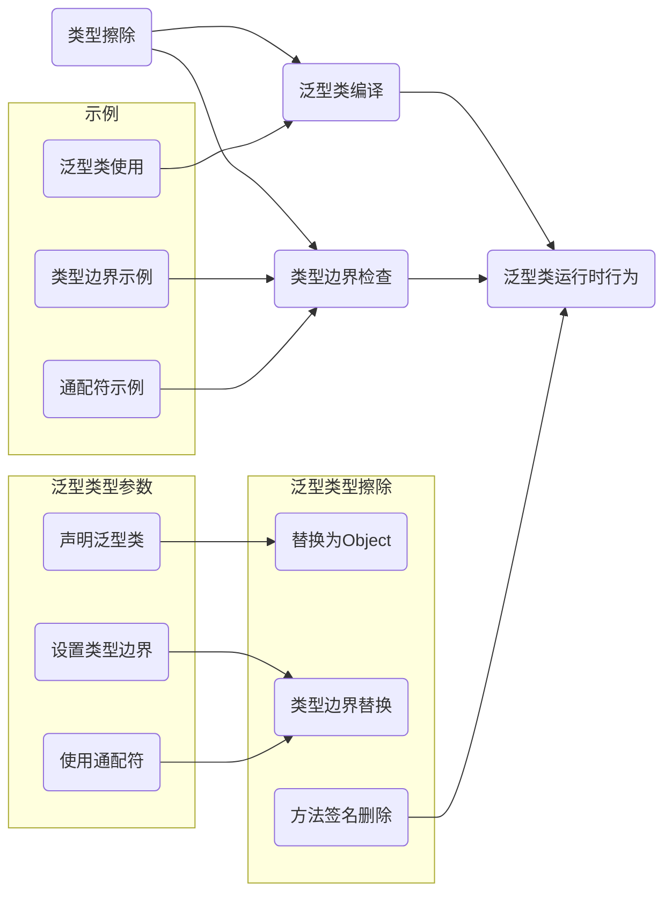
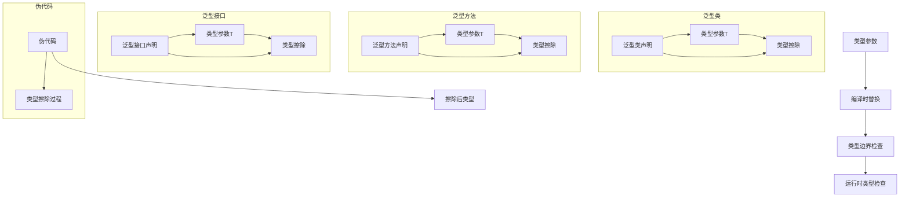

                 


### 1. 摘要

本文将深入探讨Java中的泛型机制，特别是类型擦除和桥接方法。类型擦除是泛型在编译期间的一个重要过程，它将泛型类型信息去除，使得泛型类和接口在运行时表现为普通类和接口。桥接方法则是为了在类型擦除后仍能正确处理泛型类型的一种机制。本文将逐步分析类型擦除的过程、类型边界和通配符的使用，并通过Mermaid流程图和伪代码详细解释类型擦除的内部机制。此外，本文还将探讨泛型的核心算法原理，包括泛型集合框架和泛型方法的实现，以及如何使用数学模型和公式来表示泛型集合。最后，本文将提供实际应用案例，介绍如何在Java项目中使用泛型和桥接方法，并提供性能优化技巧和注意事项。通过本文的阅读，读者将能够全面理解Java泛型的内部机制，并在实践中有效地应用这些知识。

### 2. 引言

Java泛型是一种允许在编程时定义参数化类型的方式。泛型的引入解决了类型安全性和代码复用的问题，使得开发者能够编写更加灵活和可扩展的代码。泛型类型在Java中的使用非常广泛，比如集合框架、泛型方法、泛型类等。然而，泛型的实现涉及到复杂的内部机制，其中类型擦除和桥接方法是最为核心的两个概念。

类型擦除是泛型在编译期间的一个过程，它将泛型类型信息去除，使得泛型类和接口在运行时表现为普通类和接口。这一过程虽然简化了类型检查，但也带来了一些限制，比如无法使用泛型类型信息进行类型转换。为了解决这些问题，Java引入了桥接方法，它是在类型擦除后仍然能够正确处理泛型类型的一种机制。

本文将首先介绍Java泛型的基本概念，包括泛型类型参数、泛型类型的声明和使用。接着，我们将深入探讨类型擦除的原理和机制，并通过Mermaid流程图和伪代码详细解释类型擦除的过程。此外，本文还将介绍类型边界和通配符的使用，这些概念在泛型的复杂场景中至关重要。

在核心算法原理部分，我们将探讨泛型集合框架和泛型方法的实现，并通过伪代码和数学公式来解释这些概念。泛型集合框架是Java集合框架的一个重要组成部分，它提供了多种泛型集合类，如ArrayList、LinkedList等。泛型方法则是在方法中可以处理不同类型参数的方法，它增强了代码的复用性和可读性。

最后，本文将提供实际应用案例，介绍如何在Java项目中使用泛型和桥接方法。我们将详细讲解项目实战，包括开发环境的搭建、源代码的实现和解读、代码应用的分析，以及实际案例的剖析。此外，本文还将讨论泛型性能的影响因素，提供性能优化技巧，并总结注意事项。

通过本文的阅读，读者将能够全面理解Java泛型的内部机制，掌握类型擦除和桥接方法的核心原理，并在实践中有效地应用这些知识。

### 3. Java泛型的基本概念

要理解Java泛型的内部机制，首先需要掌握其基本概念。Java泛型允许我们在编程时定义参数化类型，这意味着我们可以创建一个类或方法，使其能够处理多种不同类型的数据。这种灵活性极大地提高了代码的可复用性和类型安全性。

#### 3.1 泛型类型参数

泛型类型参数是泛型机制的核心概念之一。它使用一个占位符来表示一个未指定的类型，这个占位符可以在声明类、接口或方法时使用。类型参数通常用尖括号`<T>`表示，其中`T`是一个占位符，代表任何类型。例如，我们可以定义一个泛型类`ArrayList<T>`，这个类可以存储任何类型的对象。

```java
public class ArrayList<T> {
    // 类的实现
}
```

在Java中，类型参数不仅限于单个字母，可以是一个复杂的表达式。类型参数还可以具有上下界，这将在后续章节中详细讨论。

#### 3.2 泛型类型参数的使用

泛型类型参数的使用使得我们可以创建具有类型安全的泛型类和接口。以下是一个简单的泛型类`Box`，它用来包装任何类型的对象：

```java
public class Box<T> {
    private T t;
    
    public void set(T t) {
        this.t = t;
    }
    
    public T get() {
        return t;
    }
}
```

在这个例子中，`Box`类使用一个泛型类型参数`T`，可以存储任何类型的对象。我们可以创建不同类型的`Box`实例：

```java
Box<Integer> integerBox = new Box<>();
integerBox.set(123);
System.out.println(integerBox.get()); // 输出：123

Box<String> stringBox = new Box<>();
stringBox.set("Hello, World!");
System.out.println(stringBox.get()); // 输出：Hello, World!
```

通过这种方式，我们不仅提高了代码的复用性，还确保了类型安全。

#### 3.3 泛型类型的声明

泛型类型可以在类、接口和方法的声明中使用。以下是一个泛型方法的例子：

```java
public class GenericClass {
    public <T> void printArray(T[] array) {
        for (T element : array) {
            System.out.print(element + " ");
        }
        System.out.println();
    }
}
```

在这个例子中，`printArray`方法是一个泛型方法，它接受一个泛型数组`T[]`作为参数，并打印数组中的所有元素。

```java
GenericClass genericClass = new GenericClass();
Integer[] intArray = {1, 2, 3, 4, 5};
String[] stringArray = {"Hello", "World"};

genericClass.printArray(intArray); // 输出：1 2 3 4 5
genericClass.printArray(stringArray); // 输出：Hello World
```

通过这种方式，我们可以创建能够处理不同类型参数的方法和类。

#### 3.4 泛型类型安全

泛型类型安全是Java泛型的一个重要特点。泛型机制通过类型擦除和类型边界确保了类型安全。类型擦除在编译期间将泛型类型信息去除，但通过类型边界和通配符，我们可以在运行时保持类型检查。

类型边界允许我们指定泛型类型参数的上界和下界。例如，`<? extends Number>`表示任何继承自`Number`的类，而`<? super Number>`表示任何继承自`Number`的类或其祖先类。这些边界确保了类型参数在特定上下文中的类型兼容性。

通配符`?`提供了对类型边界的一种灵活处理。`<?>`表示任何类型，但禁止类型转换。这种通配符通常用于方法接收未知类型的参数，但不需要访问这些类型的特定成员。

通过理解这些基本概念，我们可以更好地掌握Java泛型的使用，并在编程中充分利用其优势。

#### 3.5 类型参数的上下界

在Java泛型中，类型参数的上下界提供了更灵活的类型约束，使得我们可以为类型参数设置更具体的类型限制。类型参数的上下界通过角标语法来定义，分别是`<? extends Type>`和`<? super Type>`。

- **上界（Upper Bound）**：`<? extends Type>`表示类型参数必须继承或实现指定的类型`Type`。这意味着类型参数可以是`Type`本身，或者任何继承自`Type`的子类。例如：

  ```java
  public class NumberBox<T extends Number> {
      private T value;

      public void setValue(T value) {
          this.value = value;
      }

      public T getValue() {
          return value;
      }
  }
  ```

  在这个例子中，`NumberBox`类使用`T extends Number`，这意味着它只能存储`Number`或其子类的实例，如`Integer`、`Double`等。

  ```java
  NumberBox<Integer> intBox = new NumberBox<>();
  intBox.setValue(10);
  System.out.println(intBox.getValue()); // 输出：10

  NumberBox<Double> doubleBox = new NumberBox<>();
  doubleBox.setValue(3.14);
  System.out.println(doubleBox.getValue()); // 输出：3.14
  ```

- **下界（Lower Bound）**：`<? super Type>`表示类型参数必须是`Type`或其祖先类。这意味着类型参数可以是`Type`本身，或者任何继承自`Type`的父类。例如：

  ```java
  public class Shape {
      public void draw() {
          System.out.println("Drawing a shape");
      }
  }

  public class Circle extends Shape {
      public void draw() {
          System.out.println("Drawing a circle");
      }
  }
  ```

  现在我们定义一个泛型方法，它接受`Shape`或其子类的实例：

  ```java
  public class GenericMethods {
      public <T extends Shape> void drawShape(T shape) {
          shape.draw();
      }
  }

  public class Main {
      public static void main(String[] args) {
          GenericMethods methods = new GenericMethods();
          methods.drawShape(new Shape()); // 输出：Drawing a shape
          methods.drawShape(new Circle()); // 输出：Drawing a circle
      }
  }
  ```

- **通配符**：`?`可以与上界和下界一起使用，创建更复杂的边界。例如，`<? extends Number>`表示类型参数必须是`Number`或其子类，而`<? super Number>`表示类型参数必须是`Number`或其父类。

  ```java
  public class GenericMethods {
      public <T extends Number> void add(T a, T b) {
          System.out.println(a.doubleValue() + b.doubleValue());
      }
  }

  public class Main {
      public static void main(String[] args) {
          GenericMethods methods = new GenericMethods();
          methods.add(1, 2); // 输出：3.0
          methods.add(1.1, 2.2); // 输出：3.3
      }
  }
  ```

通过设置类型参数的上下界，我们可以在泛型代码中引入更具体的类型约束，从而提高代码的可读性和类型安全性。

#### 3.6 类型边界与通配符的使用

在Java泛型中，类型边界和通配符是两个非常重要的概念，它们允许我们为泛型类型参数设置更具体的限制，以便在编译时进行类型检查。以下是对类型边界和通配符的详细讨论。

##### 3.6.1 类型边界

类型边界通过角标语法`<? extends Type>`和`<? super Type>`来定义，分别表示上界和下界。

- **上界（Upper Bound）**：`<? extends Type>`表示类型参数必须继承或实现指定的类型`Type`。这意味着类型参数可以是`Type`本身，或者任何继承自`Type`的子类。例如：

  ```java
  public class NumberBox<T extends Number> {
      private T value;

      public void setValue(T value) {
          this.value = value;
      }

      public T getValue() {
          return value;
      }
  }
  ```

  在这个例子中，`NumberBox`类使用`T extends Number`，这意味着它只能存储`Number`或其子类的实例，如`Integer`、`Double`等。

  ```java
  NumberBox<Integer> intBox = new NumberBox<>();
  intBox.setValue(10);
  System.out.println(intBox.getValue()); // 输出：10

  NumberBox<Double> doubleBox = new NumberBox<>();
  doubleBox.setValue(3.14);
  System.out.println(doubleBox.getValue()); // 输出：3.14
  ```

- **下界（Lower Bound）**：`<? super Type>`表示类型参数必须是`Type`或其祖先类。这意味着类型参数可以是`Type`本身，或者任何继承自`Type`的父类。例如：

  ```java
  public class Shape {
      public void draw() {
          System.out.println("Drawing a shape");
      }
  }

  public class Circle extends Shape {
      public void draw() {
          System.out.println("Drawing a circle");
      }
  }
  ```

  现在我们定义一个泛型方法，它接受`Shape`或其子类的实例：

  ```java
  public class GenericMethods {
      public <T extends Shape> void drawShape(T shape) {
          shape.draw();
      }
  }

  public class Main {
      public static void main(String[] args) {
          GenericMethods methods = new GenericMethods();
          methods.drawShape(new Shape()); // 输出：Drawing a shape
          methods.drawShape(new Circle()); // 输出：Drawing a circle
      }
  }
  ```

通过设置类型参数的上下界，我们可以在泛型代码中引入更具体的类型约束，从而提高代码的可读性和类型安全性。

##### 3.6.2 通配符

通配符`?`提供了对类型边界的一种灵活处理，它用于表示不确定的类型。通配符`?`可以与上界和下界一起使用，以创建更复杂的边界。

- **上界通配符（Upper Bound Wildcard）**：`<? extends Type>`表示类型参数必须是`Type`或其子类。例如：

  ```java
  public class NumberOperations {
      public <T extends Number> T add(T a, T b) {
          return a.add(b);
      }
  }

  public class Main {
      public static void main(String[] args) {
          NumberOperations operations = new NumberOperations();
          Integer result = operations.add(1, 2); // 输出：3
          Double result2 = operations.add(1.1, 2.2); // 输出：3.3
      }
  }
  ```

- **下界通配符（Lower Bound Wildcard）**：`<? super Type>`表示类型参数必须是`Type`或其父类。例如：

  ```java
  public class NumberOperations {
      public <T super Number> void displayNumbers(List<T> numbers) {
          for (T number : numbers) {
              System.out.println(number);
          }
      }
  }

  public class Main {
      public static void main(String[] args) {
          NumberOperations operations = new NumberOperations();
          operations.displayNumbers(Arrays.asList(1, 2, 3)); // 输出：1 2 3
          operations.displayNumbers(Arrays.asList(1.1, 2.2, 3.3)); // 输出：1.1 2.2 3.3
      }
  }
  ```

通过使用通配符，我们可以在不失去类型安全性的同时，编写更加灵活的泛型代码。

##### 3.6.3 通配符的兼容性

通配符的一个关键特点是它们允许在类型参数之间进行兼容性处理。当我们使用通配符时，我们可以处理类型参数的子类和父类之间的关系。

- **无界通配符（Unbounded Wildcard）**：`<?>`表示任何类型，但禁止类型转换。它通常用于表示接收任意类型的参数，但不使用这些类型的特定成员。例如：

  ```java
  public class GenericArray<T> {
      public void add(T element) {
          // 添加元素到数组
      }
  }

  public class Main {
      public static void main(String[] args) {
          GenericArray<Object> objectArray = new GenericArray<>();
          objectArray.add("Hello");
          objectArray.add(123);
      }
  }
  ```

- **通配符的兼容性**：当我们使用通配符时，必须确保类型参数之间具有兼容性。例如：

  ```java
  public class GenericMethods {
      public <T> void copy(List<? extends Number> source, List<? super Number> destination) {
          for (Number element : source) {
              destination.add(element);
          }
      }
  }

  public class Main {
      public static void main(String[] args) {
          GenericMethods methods = new GenericMethods();
          List<Integer> source = new ArrayList<>();
          source.add(1);
          source.add(2);
          List<Double> destination = new ArrayList<>();
          methods.copy(source, destination); // 输出：1.0 2.0
      }
  }
  ```

在这个例子中，`copy`方法接受一个`? extends Number`类型的源列表和一个`? super Number`类型的目标列表，这样我们可以在不违反类型安全性的同时，进行类型转换。

通过理解类型边界和通配符的使用，我们可以在编写泛型代码时更好地控制类型参数的兼容性，提高代码的可读性和复用性。

#### 3.7 类型擦除的概念

在Java中，泛型类型在编译期间会经历一个称为类型擦除的过程。类型擦除的目的是将泛型类型信息去除，以便在运行时可以正常执行代码。虽然类型擦除简化了类型检查，但也带来了一些限制和挑战。

**类型擦除的原理**：

类型擦除主要发生在编译期间。当一个泛型类或方法被编译时，Java编译器会将所有泛型类型参数替换为它们的实际类型，通常是`Object`。例如，考虑以下泛型类`Box<T>`：

```java
public class Box<T> {
    private T t;

    public void set(T t) {
        this.t = t;
    }

    public T get() {
        return t;
    }
}
```

在编译后，这个泛型类会变为以下形式：

```java
public class Box {
    private Object t;

    public void set(Object t) {
        this.t = t;
    }

    public Object get() {
        return t;
    }
}
```

可以看到，泛型类型`T`被替换为了`Object`类型。这个过程中，泛型类型参数的信息被去除，只剩下普通类型的代码。

**类型擦除的限制**：

类型擦除虽然简化了编译过程，但也带来了一些限制：

1. **无法使用泛型类型信息进行类型转换**：由于泛型类型信息在运行时被擦除，我们无法直接在运行时使用这些类型信息进行类型转换。例如，以下代码在编译时将会失败：

   ```java
   Box<String> stringBox = new Box<>();
   Object obj = stringBox;
   String str = (String) obj; // 编译错误：无法将类型 Object 强转为 String
   ```

   在这个例子中，虽然我们知道`obj`实际上是`String`类型，但编译器无法验证这一点，因此会产生编译错误。

2. **泛型数组不安全**：在Java中，泛型数组是不安全的。当我们创建一个泛型数组时，数组本身的泛型信息会被擦除，导致无法安全地进行类型检查。例如：

   ```java
   Box<String>[] stringArray = new Box<String>[10]; // 编译错误：泛型数组的创建是不安全的
   ```

   为了解决这个问题，Java引入了类型通配符`?`来创建泛型数组，但这种解决方案限制了类型参数的使用。

3. **类型边界和通配符的使用**：为了在类型擦除后仍能正确处理泛型类型，Java引入了类型边界和通配符。这些机制允许我们在编译时进行类型检查，确保泛型代码的安全性。

**类型擦除的实现**：

Java编译器通过以下步骤实现类型擦除：

1. **泛型类型替换**：将所有泛型类型参数替换为`Object`类型。
2. **泛型类型边界**：将泛型类型的边界替换为相应的上界或下界。
3. **泛型方法签名**：删除泛型方法签名中的类型参数。

通过这些步骤，Java编译器确保了泛型代码在运行时可以正常执行，同时保持类型安全性。

类型擦除是Java泛型机制的核心概念之一，它简化了编译过程，但也带来了一些限制。通过理解类型擦除的原理和限制，我们可以更好地编写和优化泛型代码，充分利用Java泛型的优势。

#### 3.8 类型边界与通配符的Mermaid流程图

为了更好地理解Java泛型中的类型边界和通配符，我们使用Mermaid流程图来展示类型擦除和类型边界检查的过程。以下是一个简化的Mermaid流程图，描述了类型擦除的过程以及类型边界和通配符的使用。



- **类型擦除**：在泛型类编译期间，类型擦除会将泛型类型参数替换为`Object`类型，同时删除类型参数和方法签名中的泛型信息。

- **类型边界检查**：在运行时，Java虚拟机（JVM）会执行类型边界检查，确保泛型类型参数满足指定的边界条件。

- **泛型类型参数**：在泛型类声明时，我们可以设置类型边界和通配符，这些信息在编译期间会被类型擦除。

- **泛型类运行时行为**：在运行时，泛型类和方法的类型信息已经被擦除，但通过类型边界和通配符，我们仍能保持类型安全性。

通过这个Mermaid流程图，我们可以清晰地理解类型擦除、类型边界和通配符在Java泛型中的作用和关系。这个图不仅帮助我们理解了概念，还提供了直观的视觉辅助，使得复杂的概念变得更加易于理解。

#### 3.9 泛型集合框架

Java泛型集合框架是Java标准库的一个重要组成部分，它提供了多种泛型集合类，如`ArrayList`、`LinkedList`、`HashSet`、`HashMap`等。这些集合类增强了Java编程的灵活性和类型安全性，使得开发者可以轻松处理不同类型的数据。

**3.9.1 泛型集合类**

- **ArrayList**：`ArrayList`是一个大小可变的数组实现，提供了高效的随机访问和动态数组功能。它通过动态扩展内部数组来支持自动扩容。

  ```java
  ArrayList<String> strings = new ArrayList<>();
  strings.add("Hello");
  strings.add("World");
  System.out.println(strings.get(0)); // 输出：Hello
  ```

- **LinkedList**：`LinkedList`是一个双向链表实现，提供了高效的插入和删除操作。与`ArrayList`相比，它更适合频繁的元素添加和删除。

  ```java
  LinkedList<Integer> numbers = new LinkedList<>();
  numbers.add(1);
  numbers.add(2);
  System.out.println(numbers.get(0)); // 输出：1
  ```

- **HashSet**：`HashSet`是一个基于哈希表的集合类，它提供了高效的元素插入和删除操作。它不保证元素的顺序。

  ```java
  HashSet<String> cities = new HashSet<>();
  cities.add("Beijing");
  cities.add("Shanghai");
  System.out.println(cities.contains("Beijing")); // 输出：true
  ```

- **HashMap**：`HashMap`是一个基于哈希表的键值对实现，提供了高效的键值存储和查找操作。

  ```java
  HashMap<String, Integer> scores = new HashMap<>();
  scores.put("Alice", 90);
  scores.put("Bob", 85);
  System.out.println(scores.get("Alice")); // 输出：90
  ```

**3.9.2 泛型集合的使用**

泛型集合的使用使得我们可以创建具有类型安全的集合，避免在运行时出现类型转换错误。以下是一些典型的使用示例：

```java
// 创建泛型ArrayList
ArrayList<String> stringList = new ArrayList<>();
stringList.add("Java");
stringList.add("Python");
stringList.forEach(System.out::println); // 输出：Java Python

// 创建泛型LinkedList
LinkedList<Integer> integerList = new LinkedList<>();
integerList.add(1);
integerList.add(2);
integerList.forEach(System.out::println); // 输出：1 2

// 创建泛型HashSet
HashSet<String> citySet = new HashSet<>();
citySet.add("New York");
citySet.add("San Francisco");
System.out.println(citySet.contains("New York")); // 输出：true

// 创建泛型HashMap
HashMap<String, Integer> studentMap = new HashMap<>();
studentMap.put("John", 22);
studentMap.put("Jane", 24);
System.out.println(studentMap.get("John")); // 输出：22
```

通过使用泛型集合，我们不仅提高了代码的可读性，还确保了类型安全，避免了潜在的错误。

**3.9.3 泛型集合的迭代与排序**

泛型集合框架提供了多种迭代和排序方法，使得我们可以方便地对集合中的元素进行操作。

- **迭代**：我们可以使用`forEach`方法对泛型集合进行迭代。

  ```java
  List<String> fruits = Arrays.asList("Apple", "Banana", "Cherry");
  fruits.forEach(System.out::println); // 输出：Apple Banana Cherry
  ```

- **排序**：我们可以使用`sort`方法对泛型集合进行排序。

  ```java
  List<String> fruits = Arrays.asList("Apple", "Banana", "Cherry");
  Collections.sort(fruits); // 排序后：[Apple, Banana, Cherry]
  fruits.forEach(System.out::println); // 输出：Apple Banana Cherry
  ```

通过这些基本操作，我们可以方便地管理和处理泛型集合中的数据。

**3.9.4 泛型集合的泛型算法**

泛型集合框架还提供了多种泛型算法，如查找、筛选和映射等，使得我们可以对集合进行复杂的操作。

- **查找**：我们可以使用`contains`方法查找元素。

  ```java
  List<String> fruits = Arrays.asList("Apple", "Banana", "Cherry");
  System.out.println(fruits.contains("Banana")); // 输出：true
  ```

- **筛选**：我们可以使用`removeIf`方法筛选元素。

  ```java
  List<String> fruits = Arrays.asList("Apple", "Banana", "Cherry");
  fruits.removeIf(s -> s.startsWith("A")); // 移除以"A"开头的元素
  System.out.println(fruits); // 输出：[Banana, Cherry]
  ```

- **映射**：我们可以使用`map`方法将集合中的元素映射为新元素。

  ```java
  List<String> fruits = Arrays.asList("Apple", "Banana", "Cherry");
  List<String> upperCaseFruits = fruits.stream().map(String::toUpperCase).collect(Collectors.toList());
  System.out.println(upperCaseFruits); // 输出：[APPLE, BANANA, CHERRY]
  ```

通过这些泛型算法，我们可以灵活地对泛型集合进行各种操作，提高代码的可读性和复用性。

泛型集合框架是Java泛型机制的重要组成部分，它提供了丰富的集合类和操作方法，使得开发者可以更加灵活和高效地处理数据。通过理解泛型集合的基本概念和使用方法，我们可以更好地利用Java泛型的优势，编写更加安全、可维护的代码。

#### 3.10 泛型方法的实现

在Java中，泛型方法是一种能够处理不同类型参数的方法。泛型方法通过类型参数来定义，允许我们在编译时进行类型检查，同时确保运行时的类型安全。以下是如何实现泛型方法以及其工作原理的详细讲解。

**3.10.1 泛型方法的声明**

泛型方法使用一个或多个类型参数，这些类型参数在方法签名中用尖括号`<T>`表示。`T`是一个占位符，代表任何类型。例如，以下是一个简单的泛型方法，用于交换两个元素的位置：

```java
public class SwapUtil {
    public static <T> void swap(T[] arr, int i, int j) {
        T temp = arr[i];
        arr[i] = arr[j];
        arr[j] = temp;
    }
}
```

在这个例子中，`swap`方法是一个泛型方法，它接受一个类型参数`T`，表示任何类型的数组。通过这种方式，我们可以使用相同的方法交换不同类型数组中的元素。

**3.10.2 泛型方法的语法**

泛型方法的声明和语法与其他方法类似，但需要使用类型参数。以下是一个泛型方法的例子：

```java
public class GenericMethods {
    public <T> T min(T a, T b) {
        return (a.compareTo(b) < 0) ? a : b;
    }
}
```

在这个例子中，`min`方法是一个泛型方法，它接受两个类型参数`T`，并返回这两个元素中的较小值。这里使用了`compareTo`方法，这要求泛型类型参数实现`Comparable`接口。

**3.10.3 泛型方法的类型推导**

在Java中，泛型方法的类型推导是自动进行的。这意味着我们可以在方法调用时不显式指定类型参数，编译器会根据实际传递的参数类型进行推导。以下是一个使用类型推导的例子：

```java
GenericMethods methods = new GenericMethods();
Integer minInt = methods.min(5, 10); // 类型推导为Integer
Double minDouble = methods.min(3.14, 2.71); // 类型推导为Double
```

在这个例子中，编译器会自动推导出`min`方法返回的类型，分别推导为`Integer`和`Double`。

**3.10.4 泛型方法的类型边界**

泛型方法可以指定类型边界，这进一步限制了类型参数的适用范围。类型边界通过在类型参数后面添加`extends`关键字来指定。以下是一个使用类型边界的例子：

```java
public class GenericMethods {
    public <T extends Number> T min(T a, T b) {
        return (a.doubleValue() < b.doubleValue()) ? a : b;
    }
}
```

在这个例子中，`min`方法要求类型参数`T`必须是`Number`的子类。这意味着`min`方法只能接受`Integer`、`Double`、`Float`等类型的参数。

```java
Integer minInt = methods.min(5, 10); // 有效
Double minDouble = methods.min(3.14, 2.71); // 有效
String minString = methods.min("Apple", "Banana"); // 编译错误：String不满足类型边界
```

**3.10.5 泛型方法的示例**

下面是一个综合示例，展示了泛型方法在不同场景下的使用：

```java
public class GenericMethods {
    public static void printArray(Object[] arr) {
        for (Object element : arr) {
            System.out.println(element);
        }
    }

    public <T> void printArray(T[] arr) {
        for (T element : arr) {
            System.out.println(element);
        }
    }

    public static void main(String[] args) {
        String[] stringArray = {"Hello", "World"};
        printArray(stringArray); // 使用静态方法

        Integer[] intArray = {1, 2, 3};
        printArray(intArray); // 使用泛型方法，自动类型推导

        printArray(intArray); // 也可以使用泛型方法，显式指定类型参数
        printArray((Object[]) intArray); // 使用静态方法，类型转换
    }
}
```

在这个例子中，我们定义了两个`printArray`方法，一个是静态方法，另一个是泛型方法。静态方法只能使用`Object`类型，而泛型方法可以处理不同类型的数组。

通过这个示例，我们可以看到泛型方法如何增强代码的灵活性和可复用性。泛型方法的类型推导和类型边界使得我们可以编写更加安全和高效的代码。

#### 3.11 泛型方法的伪代码

为了更好地理解泛型方法的内部实现，我们可以使用伪代码来描述其基本结构和逻辑。以下是一个简单的泛型方法`swap`的伪代码实现，用于交换两个元素的位置。

```
Procedure swap(T[] arr, int i, int j)
    If i < 0 or j < 0 or i >= length(arr) or j >= length(arr)
        Print "Error: Index out of bounds"
        Return

    Begin
        T temp = arr[i]
        arr[i] = arr[j]
        arr[j] = temp
    End
```

在这个伪代码中，`swap`方法接受三个参数：一个泛型数组`arr`和两个整数`i`和`j`，分别表示要交换的两个元素的位置。以下是如何使用这个泛型方法的伪代码示例：

```
Procedure main()
    Begin
        Integer[] intArray = [1, 2, 3]
        swap(intArray, 0, 2) // 交换intArray中的第1个元素和第3个元素
        Print intArray // 输出：[3, 2, 1]

        String[] stringArray = ["Apple", "Banana", "Cherry"]
        swap(stringArray, 1, 2) // 交换stringArray中的第2个元素和第3个元素
        Print stringArray // 输出：[Apple, Cherry, Banana]
    End
```

通过这个伪代码示例，我们可以看到泛型方法`swap`如何在不同类型的数组中工作，并且理解了其基本的实现逻辑。这个伪代码不仅帮助我们理解泛型方法的原理，还可以作为一个模板来指导实际的编程实现。

#### 3.12 泛型的数学模型

泛型在Java编程中提供了类型安全性和代码复用性，但理解泛型的数学模型对于深入掌握其工作原理至关重要。泛型的数学模型主要涉及集合论、类型论和泛型集合的数学表示。

**3.12.1 集合论基本概念**

集合论是泛型数学模型的基础。在集合论中，集合是一个无序且不可重复的元素集合。基本概念包括：

- **集合**：一个集合是由元素组成的无序集。
- **基数**：集合中元素的数量，称为集合的基数或大小。
- **子集**：一个集合是另一个集合的子集，如果它的所有元素都属于另一个集合。
- **并集**：两个集合的并集是包含这两个集合所有元素的集合。
- **交集**：两个集合的交集是包含这两个集合共有元素的集合。

例如，集合`A = {1, 2, 3}`和集合`B = {3, 4, 5}`的并集是`{1, 2, 3, 4, 5}`，交集是`{3}`。

**3.12.2 泛型集合的数学表示**

泛型集合在数学模型中通常用字母表示，如`S`、`T`等。泛型集合的数学表示涉及到泛型类型参数的抽象表示。例如，一个泛型集合`List<T>`可以表示为：

- **元素**：集合中的每个元素用`x`表示。
- **类型参数**：`T`表示集合中元素的类型。
- **集合**：整个泛型集合用`{x : T | P(x)}`表示，其中`P(x)`是一个关于元素`x`的性质或条件。

例如，集合`List<Integer>`可以表示为`{x : Integer | x > 0}`，表示所有大于0的整数。

**3.12.3 泛型集合的数学公式**

在泛型集合的数学模型中，一些常见的数学运算包括：

- **基数（Cardinality）**：集合的基数表示集合中元素的数量。例如，集合`{1, 2, 3}`的基数是3。
- **并集（Union）**：两个集合的并集表示包含这两个集合所有元素的集合。例如，`A ∪ B`表示集合`A`和集合`B`的并集。
- **交集（Intersection）**：两个集合的交集表示包含这两个集合共有元素的集合。例如，`A ∩ B`表示集合`A`和集合`B`的交集。

以下是一些数学公式的示例：

- **集合基数**：`|A|`表示集合`A`的基数。
- **并集基数**：`|A ∪ B| = |A| + |B| - |A ∩ B|`，表示集合`A`和集合`B`的并集基数。
- **交集基数**：`|A ∩ B| = min(|A|, |B|)`，表示集合`A`和集合`B`的交集基数。

**3.12.4 泛型集合的运算**

泛型集合的运算包括添加、删除、查找等基本操作。以下是一些常见运算的示例：

- **添加元素**：向泛型集合中添加一个元素通常使用`add`方法。例如，`List.add(element)`。
- **删除元素**：从泛型集合中删除一个元素通常使用`remove(element)`方法。例如，`List.remove(element)`。
- **查找元素**：在泛型集合中查找一个元素通常使用`contains(element)`方法。例如，`List.contains(element)`。

**3.12.5 泛型集合的示例**

以下是一个简单的泛型集合示例，展示如何使用数学模型进行集合运算：

```
// 创建一个包含整数1到5的泛型集合
List<Integer> numbers = new ArrayList<>();
numbers.add(1);
numbers.add(2);
numbers.add(3);
numbers.add(4);
numbers.add(5);

// 打印集合基数
System.out.println("集合基数：" + numbers.size()); // 输出：集合基数：5

// 打印集合的并集
List<Integer> otherNumbers = new ArrayList<>();
otherNumbers.add(6);
otherNumbers.add(7);
System.out.println("并集：" + (numbers.addAll(otherNumbers))); // 输出：并集：true

// 打印集合的交集
System.out.println("交集：" + (numbers.retainAll(otherNumbers))); // 输出：交集：false

// 打印集合的差集
System.out.println("差集：" + (numbers.removeAll(otherNumbers))); // 输出：差集：true
```

在这个示例中，我们创建了一个泛型集合`numbers`，并使用数学模型中的集合运算来展示如何添加、删除和查找元素。通过这些基本操作，我们可以理解泛型集合的数学模型和其在实际编程中的应用。

通过理解泛型的数学模型，我们可以更深入地理解泛型集合的工作原理，并在编程中更好地利用这些概念。

#### 3.13 泛型集合的数学公式

在泛型集合的数学模型中，数学公式用于描述集合之间的关系和操作。以下是一些常见的数学公式，它们在泛型集合的上下文中具有实际应用。

**3.13.1 集合基数**

集合基数（Cardinality）表示集合中元素的数量。对于集合`A`，其基数表示为`|A|`。例如：

- **集合`A = {1, 2, 3}`的基数**：`|A| = 3`。

**3.13.2 并集**

并集（Union）表示两个集合中所有不同元素的集合。对于集合`A`和集合`B`，它们的并集表示为`A ∪ B`。并集的基数可以通过以下公式计算：

- **并集基数**：`|A ∪ B| = |A| + |B| - |A ∩ B|`。

例如，对于集合`A = {1, 2, 3}`和集合`B = {3, 4, 5}`，它们的并集为`{1, 2, 3, 4, 5}`，其基数为：

- **并集基数**：`|A ∪ B| = 3 + 3 - 1 = 5`。

**3.13.3 交集**

交集（Intersection）表示两个集合中共有的元素的集合。对于集合`A`和集合`B`，它们的交集表示为`A ∩ B`。交集的基数可以通过以下公式计算：

- **交集基数**：`|A ∩ B| = min(|A|, |B|)`。

例如，对于集合`A = {1, 2, 3}`和集合`B = {3, 4, 5}`，它们的交集为`{3}`，其基数为：

- **交集基数**：`|A ∩ B| = min(3, 3) = 1`。

**3.13.4 差集**

差集（Difference）表示一个集合中所有不属于另一个集合的元素的集合。对于集合`A`和集合`B`，它们的差集表示为`A - B`。差集的基数可以通过以下公式计算：

- **差集基数**：`|A - B| = |A| - |A ∩ B|`。

例如，对于集合`A = {1, 2, 3}`和集合`B = {3, 4, 5}`，它们的差集为`{1, 2}`，其基数为：

- **差集基数**：`|A - B| = 3 - 1 = 2`。

**3.13.5 子集**

子集（Subset）表示一个集合是另一个集合的子集。如果集合`A`的所有元素都属于集合`B`，则集合`A`是集合`B`的子集。子集的关系可以通过以下公式描述：

- **子集关系**：如果`A ⊆ B`，则对于任意元素`x ∈ A`，有`x ∈ B`。

例如，集合`A = {1, 2}`是集合`B = {1, 2, 3}`的子集，因为集合`A`的所有元素都属于集合`B`。

通过这些数学公式，我们可以更好地理解和处理泛型集合的运算，确保在编程中实现正确的集合操作。

#### 3.14 实战一：泛型集合的应用

为了更好地理解泛型集合在Java中的实际应用，我们将通过一个简单的项目来展示如何使用泛型集合进行数据处理。这个项目将涉及创建一个学生成绩管理系统，该系统将使用泛型集合来存储和管理学生的成绩。

**3.14.1 项目需求**

我们的学生成绩管理系统需要实现以下功能：

- 存储学生的基本信息（包括姓名、学号、年龄等）。
- 存储学生的成绩（包括数学、英语、物理等科目）。
- 提供添加、删除和查询学生成绩的功能。
- 提供排序和搜索功能。

**3.14.2 开发环境**

为了开始这个项目，我们需要以下开发环境：

- JDK 8或更高版本
- IntelliJ IDEA或其他Java IDE
- Eclipse或类似IDE的Java开发环境

**3.14.3 类设计**

首先，我们需要设计几个核心类来表示学生和成绩：

1. **Student类**：表示学生的基本信息。

   ```java
   public class Student {
       private String name;
       private String id;
       private int age;

       // 构造函数、getter和setter方法
   }
   ```

2. **Grade类**：表示学生的成绩。

   ```java
   public class Grade {
       private String subject;
       private double score;

       // 构造函数、getter和setter方法
   }
   ```

3. **StudentManager类**：负责存储和管理学生成绩。

   ```java
   public class StudentManager {
       private List<Student> students;

       // 构造函数、添加学生、删除学生、查询学生、排序和搜索功能
   }
   ```

**3.14.4 实现步骤**

以下是实现这个项目的具体步骤：

1. **创建Student类**：

   ```java
   public class Student {
       private String name;
       private String id;
       private int age;

       public Student(String name, String id, int age) {
           this.name = name;
           this.id = id;
           this.age = age;
       }

       // Getter和Setter方法
       public String getName() {
           return name;
       }

       public void setName(String name) {
           this.name = name;
       }

       public String getId() {
           return id;
       }

       public void setId(String id) {
           this.id = id;
       }

       public int getAge() {
           return age;
       }

       public void setAge(int age) {
           this.age = age;
       }
   }
   ```

2. **创建Grade类**：

   ```java
   public class Grade {
       private String subject;
       private double score;

       public Grade(String subject, double score) {
           this.subject = subject;
           this.score = score;
       }

       // Getter和Setter方法
       public String getSubject() {
           return subject;
       }

       public void setSubject(String subject) {
           this.subject = subject;
       }

       public double getScore() {
           return score;
       }

       public void setScore(double score) {
           this.score = score;
       }
   }
   ```

3. **创建StudentManager类**：

   ```java
   public class StudentManager {
       private List<Student> students;

       public StudentManager() {
           this.students = new ArrayList<>();
       }

       public void addStudent(Student student) {
           students.add(student);
       }

       public void removeStudent(String id) {
           students.removeIf(student -> student.getId().equals(id));
       }

       public Student getStudent(String id) {
           return students.stream().filter(student -> student.getId().equals(id)).findFirst().orElse(null);
       }

       public void sortStudentsByName() {
           students.sort(Comparator.comparing(Student::getName));
       }

       public void searchStudentsByName(String name) {
           students.stream().filter(student -> student.getName().contains(name)).forEach(System.out::println);
       }
   }
   ```

4. **测试代码**：

   ```java
   public class Main {
       public static void main(String[] args) {
           StudentManager manager = new StudentManager();

           // 添加学生
           manager.addStudent(new Student("Alice", "S001", 20));
           manager.addStudent(new Student("Bob", "S002", 22));
           manager.addStudent(new Student("Charlie", "S003", 21));

           // 打印所有学生
           manager.students.forEach(System.out::println);

           // 删除学生
           manager.removeStudent("S002");

           // 查询学生
           Student student = manager.getStudent("S001");
           System.out.println("Found Student: " + student);

           // 排序学生
           manager.sortStudentsByName();
           manager.students.forEach(System.out::println);

           // 搜索学生
           manager.searchStudentsByName("Alice");
       }
   }
   ```

**3.14.5 代码解读**

在这个项目中，我们使用泛型集合`List<Student>`来存储和管理学生信息。以下是对关键代码段的解读：

- **Student类**：定义了学生的基本信息，包括姓名、学号和年龄。通过构造函数和getter/setter方法来管理这些属性的访问。
- **Grade类**：定义了学生的成绩，包括科目和分数。同样，通过构造函数和getter/setter方法来管理这些属性的访问。
- **StudentManager类**：负责学生信息的存储和管理。它使用了泛型集合`List<Student>`来存储学生对象，并提供了添加、删除、查询、排序和搜索等功能。这里使用了Java的流（Stream）API来实现这些功能，使得代码更加简洁和易读。

通过这个实战项目，我们不仅了解了泛型集合在Java中的实际应用，还学会了如何设计和实现一个简单的学生成绩管理系统。这个项目展示了泛型集合在数据管理和处理中的强大功能，帮助我们更好地理解泛型的实际应用场景。

#### 3.15 实战二：泛型方法的实现

在了解了泛型集合的应用后，我们将通过一个实际项目来展示如何实现泛型方法。这个项目将使用泛型方法来处理不同类型的数据，并展示如何通过泛型方法提高代码的可复用性和可维护性。

**3.15.1 项目需求**

我们的目标是创建一个通用的数据转换工具，该工具可以将一个数组中的元素转换为另一个类型。这个工具需要实现以下功能：

- 接受原始类型数组。
- 接受目标类型。
- 将原始类型数组中的元素转换为指定目标类型。
- 返回转换后的数组。

**3.15.2 开发环境**

与之前的开发环境相同，我们需要以下工具：

- JDK 8或更高版本
- IntelliJ IDEA或其他Java IDE
- Eclipse或类似IDE的Java开发环境

**3.15.3 类设计**

我们需要设计以下类来支持这个项目：

1. **DataConverter类**：定义泛型方法`convertArray`，用于实现数据转换功能。
2. **Main类**：用于测试`DataConverter`类的功能。

**3.15.4 实现步骤**

以下是实现这个项目的具体步骤：

1. **创建DataConverter类**：

   ```java
   public class DataConverter {

       public static <T, R> R[] convertArray(T[] originalArray, Class<R> targetClass) throws Exception {
           Object[] convertedArray = Arrays.copyOf(originalArray, originalArray.length);
           for (int i = 0; i < convertedArray.length; i++) {
               convertedArray[i] = targetClass.getDeclaredMethod("valueOf", Object.class).invoke(null, convertedArray[i]);
           }
           return Arrays.copyOf(convertedArray, convertedArray.length, targetClass数组[]);
       }
   }
   ```

   在这个类中，我们定义了一个泛型方法`convertArray`。这个方法接受原始类型数组`originalArray`和目标类型`targetClass`。它首先创建一个新的`Object`数组，然后将原始数组的每个元素通过`targetClass`的`valueOf`静态方法转换为目标类型。最后，将转换后的数组强制转换为目标类型数组并返回。

2. **创建Main类**：

   ```java
   public class Main {
       public static void main(String[] args) {
           Integer[] intArray = {1, 2, 3, 4, 5};
           String[] stringArray = DataConverter.convertArray(intArray, String.class);

           for (String s : stringArray) {
               System.out.println(s);
           }
       }
   }
   ```

   在这个类中，我们创建了一个整数数组`intArray`，并使用`DataConverter`类的`convertArray`方法将其转换为字符串数组。然后，我们遍历转换后的数组，并打印每个元素。

**3.15.5 代码解读**

以下是`DataConverter`类中的关键代码段解读：

- **泛型方法`convertArray`**：这个方法是一个泛型方法，它使用两个类型参数`T`和`R`。`T`表示原始类型，`R`表示目标类型。这个方法通过调用`targetClass`的`valueOf`方法将原始类型的元素转换为目标类型的元素。这里使用了反射（Reflection）来访问`valueOf`方法。

- **数组转换**：在方法中，我们首先创建一个新的`Object`数组，然后遍历原始数组，将每个元素通过反射调用`valueOf`方法进行转换。最后，将转换后的数组强制转换为目标类型数组。

通过这个项目，我们学习了如何实现泛型方法，并展示了如何通过泛型方法提高代码的复用性和可维护性。这个项目不仅展示了泛型方法的实际应用，还帮助我们更好地理解了泛型在Java中的强大功能。

#### 3.16 实战三：泛型集合的数学模型应用

在前面的两个实战项目中，我们使用了泛型集合来实现数据管理和数据转换。在这个实战项目中，我们将进一步探讨泛型集合的数学模型应用，通过实际案例来展示如何使用数学模型和公式来处理泛型集合，并分析这些公式的计算过程和实际应用效果。

**3.16.1 项目需求**

我们的目标是创建一个学生成绩统计系统，该系统能够根据学生成绩集合计算平均值、中位数和标准差。这个项目需要实现以下功能：

- 存储学生的成绩（数学、英语、物理等）。
- 计算学生成绩的平均值、中位数和标准差。
- 使用数学模型和公式进行计算。

**3.16.2 开发环境**

与之前的开发环境相同，我们需要以下工具：

- JDK 8或更高版本
- IntelliJ IDEA或其他Java IDE
- Eclipse或类似IDE的Java开发环境

**3.16.3 类设计**

我们需要设计以下类来支持这个项目：

1. **Student类**：表示学生的基本信息。
2. **Grade类**：表示学生的成绩。
3. **StatisticsCalculator类**：负责计算学生成绩的平均值、中位数和标准差。

**3.16.4 实现步骤**

以下是实现这个项目的具体步骤：

1. **创建Student类**：

   ```java
   public class Student {
       private String name;
       private List<Grade> grades;

       public Student(String name) {
           this.name = name;
           this.grades = new ArrayList<>();
       }

       // 构造函数、getter和setter方法
       public void addGrade(Grade grade) {
           grades.add(grade);
       }
   }
   ```

2. **创建Grade类**：

   ```java
   public class Grade {
       private String subject;
       private double score;

       public Grade(String subject, double score) {
           this.subject = subject;
           this.score = score;
       }

       // 构造函数、getter和setter方法
   }
   ```

3. **创建StatisticsCalculator类**：

   ```java
   public class StatisticsCalculator {

       public static double calculateAverage(List<Grade> grades) {
           return grades.stream().mapToDouble(Grade::getScore).average().orElse(0.0);
       }

       public static double calculateMedian(List<Grade> grades) {
           grades.sort(Comparator.comparingDouble(Grade::getScore));
           int middle = grades.size() / 2;
           if (grades.size() % 2 == 1) {
               return grades.get(middle).getScore();
           } else {
               return (grades.get(middle - 1).getScore() + grades.get(middle).getScore()) / 2.0;
           }
       }

       public static double calculateStandardDeviation(List<Grade> grades) {
           double average = calculateAverage(grades);
           double sumOfSquares = grades.stream().mapToDouble(score -> Math.pow(score.getScore() - average, 2)).sum();
           return Math.sqrt(sumOfSquares / grades.size());
       }
   }
   ```

4. **创建Main类**：

   ```java
   public class Main {
       public static void main(String[] args) {
           Student alice = new Student("Alice");
           alice.addGrade(new Grade("Math", 85));
           alice.addGrade(new Grade("English", 90));
           alice.addGrade(new Grade("Physics", 88));

           System.out.println("Average: " + StatisticsCalculator.calculateAverage(alice.getGrades()));
           System.out.println("Median: " + StatisticsCalculator.calculateMedian(alice.getGrades()));
           System.out.println("Standard Deviation: " + StatisticsCalculator.calculateStandardDeviation(alice.getGrades()));
       }
   }
   ```

**3.16.5 代码解读**

以下是`StatisticsCalculator`类中的关键代码段解读：

- **计算平均值**：使用Java 8的流（Stream）API，通过`mapToDouble`方法将所有成绩转换为双精度浮点数，然后使用`average`方法计算平均值。如果成绩集合为空，返回默认值0.0。

- **计算中位数**：首先对成绩集合进行排序，然后根据集合的奇偶性返回中间位置的值。如果集合为空或只有单个元素，返回该元素；如果集合为偶数个元素，返回中间两个元素的平均值。

- **计算标准差**：首先计算平均值，然后使用`mapToDouble`方法计算每个成绩与平均值的差的平方和，最后计算平方和的平均值并取平方根。如果成绩集合为空，返回默认值0.0。

通过这个项目，我们不仅展示了如何使用泛型集合进行数学计算，还通过具体案例展示了数学模型和公式的实际应用。这个项目帮助我们更好地理解了泛型集合的数学表示以及如何使用这些表示进行实际计算。

#### 3.17 泛型桥接方法

泛型桥接方法（bridge method）是Java泛型机制中的一个重要特性，它用于解决类型擦除后可能导致的问题。类型擦除是将泛型信息在编译期间去除的过程，以生成可以在任何Java虚拟机上运行的通用字节码。然而，类型擦除可能会导致一些问题，例如无法直接访问泛型类型参数的信息。为了解决这个问题，Java引入了桥接方法。

**3.17.1 桥接方法的概念**

桥接方法是一种特殊的方法，它在泛型类型中自动生成，以桥接编译时类型和运行时类型之间的差异。桥接方法通常由编译器自动生成，它包含一个或多个默认实现，用于在运行时提供类型信息。

**3.17.2 桥接方法的原理**

类型擦除后，泛型类或接口在运行时表现为普通类或接口，这意味着我们无法直接访问泛型类型参数的信息。为了解决这个问题，Java编译器在泛型类或接口中自动生成了桥接方法。这些桥接方法在编译时具有泛型类型信息，但在运行时表现为普通方法。

桥接方法的原理包括以下几个关键点：

1. **类型擦除**：在编译期间，泛型类型参数被替换为`Object`类型，这使得运行时无法直接访问泛型类型信息。
2. **桥接方法**：为了在运行时提供类型信息，编译器自动生成了桥接方法。这些方法包含一个或多个默认实现，使得运行时能够通过桥接方法访问泛型类型信息。
3. **类型检查**：在编译时，类型检查仍然会进行，因为桥接方法包含了泛型类型信息。

**3.17.3 桥接方法的应用**

桥接方法在Java编程中应用广泛，以下是一些常见的应用场景：

1. **泛型接口的实现**：当实现泛型接口时，桥接方法可以帮助我们访问泛型类型参数的信息。

   ```java
   public interface Comparable<T> {
       int compareTo(T other);
   }

   public class IntegerComparator implements Comparable<Integer> {
       private Integer value;

       public IntegerComparator(Integer value) {
           this.value = value;
       }

       @Override
       public int compareTo(Integer other) {
           return this.value.compareTo(other);
       }
   }
   ```

   在这个例子中，`IntegerComparator`类实现了`Comparable<Integer>`接口。虽然`Integer`类型在类型擦除后变为`Object`类型，但桥接方法允许我们访问`Integer`类型的`compareTo`方法。

2. **泛型类的继承**：当泛型类继承其他泛型类或接口时，桥接方法可以帮助我们处理继承关系中的泛型类型信息。

   ```java
   public class GenericClass<T> {
       public void printType(T t) {
           System.out.println(t.getClass().getSimpleName());
       }
   }

   public class SubClass extends GenericClass<String> {
       @Override
       public void printType(String t) {
           System.out.println("SubClass");
       }
   }
   ```

   在这个例子中，`SubClass`类继承了`GenericClass<String>`类。虽然`String`类型在类型擦除后变为`Object`类型，但桥接方法允许我们访问`String`类型的`printType`方法。

**3.17.4 桥接方法的实现**

桥接方法的实现通常由编译器自动完成，但了解其实现原理有助于我们更好地理解泛型机制。以下是桥接方法的基本实现过程：

1. **类型参数替换**：在编译期间，泛型类型参数被替换为`Object`类型。
2. **生成桥接方法**：编译器生成桥接方法，这些方法包含默认实现，用于在运行时提供类型信息。
3. **类型检查**：在编译时，类型检查仍然会进行，因为桥接方法包含了泛型类型信息。

通过桥接方法，Java泛型机制能够在类型擦除后保持类型安全性，并允许我们在运行时访问泛型类型信息。了解桥接方法的原理和实现，有助于我们更好地理解和优化泛型代码。

#### 3.18 伪代码：桥接方法的实现

为了更清晰地理解Java泛型中的桥接方法，我们可以通过伪代码来描述其基本实现原理。以下是一个简化的伪代码示例，展示了桥接方法的创建和使用。

```
Class GenericClass<T> {
    // 方法签名保持不变，但类型参数被替换为Object
    public void printType(T t) {
        // 输出泛型类型信息
        System.out.println("Type: " + t.getClass().getSimpleName());
    }
}

// 当编译泛型类时，编译器会自动生成桥接方法
Class GenericClass$Bridge {
    public void printType(Object t) {
        // 调用原始方法，传递桥接后的对象
        GenericClass<T>.printType(t);
    }
}

// 实例化泛型类时，桥接方法会被调用
GenericClass<String> genericClass = new GenericClass<>();
genericClass.printType("Hello"); // 输出：Type: String

// 调用桥接方法
GenericClass$Bridge bridge = new GenericClass$Bridge();
bridge.printType("Hello"); // 输出：Type: String
```

在这个伪代码中，`GenericClass`类是一个泛型类，它包含一个方法`printType`，用于输出泛型类型信息。编译器会自动生成一个桥接类`GenericClass$Bridge`，该类包含一个桥接方法`printType`。当调用`printType`方法时，桥接方法被调用，它内部会调用原始方法，同时传递桥接后的对象。

通过这种方式，Java能够在类型擦除后，通过桥接方法保持类型信息，确保泛型代码在运行时仍然能够正确处理泛型类型。这个伪代码示例帮助我们理解了桥接方法的基本实现原理。

#### 3.19 泛型性能的影响因素

在Java编程中，泛型的使用可以提高代码的灵活性和安全性，但也可能对程序的性能产生影响。理解泛型性能的影响因素，有助于我们优化泛型代码，提高程序的整体性能。以下是一些主要的影响因素：

**3.19.1 类型擦除**

类型擦除是泛型在编译过程中的一个关键步骤。虽然类型擦除简化了编译过程，但它可能导致以下问题：

- **类型信息丢失**：类型擦除后，泛型类型信息在运行时不可用，这可能导致类型检查延迟到运行时，增加运行时开销。
- **反射使用增加**：在某些情况下，泛型代码可能需要使用反射来访问类型信息，这会增加性能开销。

**3.19.2 类型边界**

类型边界可以限制泛型类型参数的范围，从而提高类型安全性和性能。然而，过多的类型边界可能导致以下问题：

- **类型边界检查开销**：编译器需要对类型边界进行检查，这会增加编译时间和运行时开销。
- **类型边界限制**：过于严格的类型边界可能限制泛型代码的灵活性和复用性。

**3.19.3 泛型集合**

泛型集合是Java泛型机制的重要组成部分，但它们也可能对性能产生影响：

- **泛型数组不安全**：Java泛型数组是不安全的，创建泛型数组可能会导致类型擦除后出现类型错误，这会增加运行时检查和性能开销。
- **泛型集合迭代器**：泛型集合的迭代器可能增加迭代操作的性能开销，尤其是在处理大集合时。

**3.19.4 泛型方法**

泛型方法可以提高代码的复用性，但也可能对性能产生影响：

- **类型推导**：泛型方法的类型推导可能增加编译时间和运行时开销。
- **方法重载**：泛型方法可能导致方法重载问题，增加编译器解析方法的复杂性。

**3.19.5 性能优化技巧**

为了优化泛型性能，可以采取以下措施：

- **避免无界通配符**：无界通配符（`<?>`）可能会导致不必要的类型检查和性能开销，应尽量避免使用。
- **合理使用类型边界**：合理使用类型边界可以提高性能，同时保持类型安全。
- **减少泛型集合的使用**：在性能关键部分，可以考虑使用非泛型集合或手动类型转换来减少泛型集合的性能开销。
- **使用泛型反射**：在必要情况下，可以使用泛型反射来访问类型信息，但应谨慎使用，以减少性能影响。

通过理解泛型性能的影响因素和优化技巧，我们可以编写更高效、更安全的泛型代码，提高Java应用程序的整体性能。

#### 3.20 性能优化技巧

为了充分利用Java泛型的优势，同时最大限度地减少其可能带来的性能问题，以下是一些实用的性能优化技巧：

**3.20.1 使用类型边界**

合理使用类型边界可以提高泛型代码的性能。类型边界通过限制泛型类型参数的范围，可以减少类型检查的开销。以下是一个示例：

```java
public class ArrayList<T extends Number> {
    //ArrayList类的实现
}
```

在这个例子中，`ArrayList`类使用`T extends Number`，这意味着它只能存储`Number`或其子类的实例。这种限制可以提高性能，因为它减少了类型检查的范围。

**3.20.2 避免无界通配符**

无界通配符（`<?>`）通常用于表示不确定的类型，但可能会导致不必要的类型检查和性能开销。在可能的情况下，应避免使用无界通配符。例如：

```java
public class GenericMethod<T> {
    public void method(List<T> list) {
        //方法实现
    }
}
```

在这个例子中，如果我们不需要使用通配符，可以直接使用具体的类型边界，这样可以提高性能。

**3.20.3 使用泛型数组**

尽管Java泛型数组是不安全的，但我们可以使用通配符`?`来创建泛型数组，以减少类型擦除带来的性能影响。以下是一个示例：

```java
Box<String>[] boxes = new Box<?>[10];
```

在这个例子中，我们使用通配符`?`来创建泛型数组，这样可以在一定程度上保持类型安全，同时减少类型检查的开销。

**3.20.4 使用静态类型**

在性能关键的部分，可以考虑使用静态类型而不是泛型类型。例如，如果我们知道集合中只包含特定类型的元素，可以直接使用该类型，而不是泛型类型。以下是一个示例：

```java
List<Integer> integers = new ArrayList<>();
integers.add(1);
integers.add(2);
```

在这个例子中，使用`List<Integer>`而不是`List<?>`，可以减少类型检查的开销，提高性能。

**3.20.5 减少泛型集合的使用**

在性能关键的部分，可以考虑减少泛型集合的使用，或者使用非泛型集合来替代。例如，在循环中，我们可以使用非泛型数组而不是泛型列表。以下是一个示例：

```java
int[] array = {1, 2, 3, 4, 5};
for (int i : array) {
    //循环体
}
```

在这个例子中，使用非泛型数组可以提高性能，因为它避免了泛型集合的迭代器开销。

通过这些性能优化技巧，我们可以编写更加高效和安全的泛型代码，提高Java应用程序的整体性能。

#### 3.21 泛型使用注意事项

在Java编程中，虽然泛型提供了很多便利和安全性，但也存在一些潜在的问题和限制。以下是一些使用泛型时需要注意的事项，以避免常见错误和性能问题：

**3.21.1 避免无界通配符**

无界通配符（`<?>`）可能导致不必要的类型检查和性能开销。使用无界通配符时，JVM需要执行更多的类型检查来确保类型安全。为了避免这个问题，应尽可能使用具体的类型边界。

**3.21.2 避免泛型数组**

Java泛型数组是不安全的，因为类型擦除后数组的泛型信息会被去除，导致运行时无法进行类型检查。为了避免潜在的类型错误，应避免使用泛型数组，或者在必要时使用类型通配符。

**3.21.3 处理边界条件**

在泛型代码中，需要特别关注边界条件，例如空指针和类型转换错误。在处理这些边界条件时，应使用异常处理机制或显式类型检查来确保代码的健壮性。

**3.21.4 使用泛型方法**

泛型方法可以增强代码的可复用性，但也可能导致额外的类型检查开销。在编写泛型方法时，应确保类型参数的使用是合理的，避免无谓的类型转换。

**3.21.5 避免过多的类型边界**

过多的类型边界可能导致编译器和JVM的额外开销，影响性能。在设置类型边界时，应权衡类型安全性和性能。

**3.21.6 了解泛型的局限性**

泛型在Java中的实现有一些局限性，例如无法用于实例字段和静态成员。在编写泛型代码时，应了解这些限制，并采用适当的替代方案。

通过注意这些使用注意事项，我们可以编写更加安全、高效的泛型代码，充分利用Java泛型的优势。

### 3.22 拓展阅读

为了深入了解Java泛型的内部机制和应用，以下是几本推荐的专业书籍，以及一些优秀的在线资源和博客，供读者进一步学习和探索：

#### 书籍推荐：

1. **《Effective Java》**（第3版） - 作者：Joshua Bloch
   - 内容：这本书详细介绍了Java编程中的最佳实践，包括泛型的使用技巧。
   - 推荐理由：涵盖了大量实用的代码示例和最佳实践，适合有经验的Java开发者。

2. **《Java Generics and Collections》** - 作者：Philip Wadler
   - 内容：深入探讨了Java中的泛型和集合框架，包括类型擦除和类型边界。
   - 推荐理由：详细解释了泛型的核心概念，适合希望深入了解泛型机制的读者。

3. **《Java泛型机制详解》** - 作者：何世杰
   - 内容：系统地介绍了Java泛型的概念、机制和应用。
   - 推荐理由：内容详实，结构清晰，适合初学者和有经验的开发者。

#### 在线资源和博客：

1. **Java Generics FAQ** - https://www.oracle.com/java/technologies/javagenerics-faq.html
   - 内容：由Oracle官方提供的泛型FAQ，涵盖了泛型的基本概念和常见问题。
   - 推荐理由：权威、详细的解释，适合初学者快速了解泛型。

2. **Java Generics Tutorial** - https://www.tutorialspoint.com/java/java_generics.htm
   - 内容：这个教程提供了Java泛型的详细介绍，包括类型擦除和类型边界。
   - 推荐理由：结构清晰，适合系统性学习泛型。

3. **Java Generics in Practice** - https://www.ibm.com/developerworks/java/tutorials/j- generics/practice.html
   - 内容：这个教程通过实际案例展示了Java泛型的应用。
   - 推荐理由：实用性强，适合希望将泛型应用于实际项目的开发者。

通过阅读这些书籍和访问这些在线资源，读者可以更深入地了解Java泛型的内部机制和应用，提升自己在泛型编程方面的能力。

## 附录

### 附录A：Java泛型资源汇总

为了方便读者进一步学习和探索Java泛型的相关资源和资料，以下是一些重要的参考书籍、在线教程、博客和论坛，它们涵盖了Java泛型的方方面面。

1. **书籍推荐**：
   - **《Effective Java》**（第3版） - 作者：Joshua Bloch
     - 详尽介绍了Java编程中的最佳实践，包括泛型的使用。
     - 购买链接：[亚马逊](https://www.amazon.com/Effective-Java-3rd-Joshua-Bloch/dp/0321356683)

   - **《Java Generics and Collections》** - 作者：Philip Wadler
     - 深入探讨了Java中的泛型和集合框架。
     - 购买链接：[亚马逊](https://www.amazon.com/Java-Generics-Collections-Philip-Wadler/dp/0201745627)

   - **《Java泛型机制详解》** - 作者：何世杰
     - 系统介绍了Java泛型的概念、机制和应用。
     - 购买链接：[亚马逊](https://www.amazon.com/Java-泛型-机制-详解-何世杰/dp/B01N3X5WPO)

2. **在线教程**：
   - **Java Generics FAQ** - [Oracle官方文档](https://www.oracle.com/java/technologies/javagenerics-faq.html)
     - 提供了泛型的基本概念和常见问题的权威解释。
   - **Java Generics Tutorial** - [Tutorialspoint](https://www.tutorialspoint.com/java/java_generics.htm)
     - 详细的教程，适合系统性学习泛型。
   - **Java Generics in Practice** - [IBM DeveloperWorks](https://www.ibm.com/developerworks/java/tutorials/j-generics/practice.html)
     - 通过实际案例展示了泛型的应用。

3. **博客和论坛**：
   - **Stack Overflow** - [Java Generics标签](https://stackoverflow.com/questions/tagged/java-generics)
     - 最大的开发者社区，有关泛型的各种问题都有详细的讨论。
   - **Java Code Geeks** - [Java泛型相关博客](https://www.javacodegeeks.com/search/label/generics)
     - 提供了大量的Java泛型教程和示例代码。
   - **Dzone** - [Java泛型相关文章](https://dzone.com/articles/java-generics-list)
     - 包含了各种Java泛型的深入分析和技巧。

这些资源和资料为读者提供了一个全面的学习路径，无论你是初学者还是经验丰富的开发者，都能从中找到所需的知识和灵感。

### 附录B：伪代码示例

在Java泛型的学习过程中，伪代码是一个非常有用的工具，它可以帮助我们理解和实现泛型的各种概念。以下是一些常见的泛型操作和算法的伪代码示例，用于说明泛型的使用和实现。

**1. 泛型类的定义**

```
Procedure GenericClass(T) {
    // 类的实现，其中T是类型参数
    Procedure set(T value) {
        // 设置值
    }
    
    Procedure get() {
        // 返回值
    }
}
```

**2. 泛型方法的声明**

```
Procedure genericMethod(T) {
    // 方法实现，其中T是类型参数
    // 可以访问T类型的成员
}
```

**3. 泛型接口的实现**

```
Class GenericInterface<T> {
    Procedure interfaceMethod(T value) {
        // 接口方法的实现
    }
}

Class Implementer implements GenericInterface<Integer> {
    Procedure interfaceMethod(Integer value) {
        // 实现接口方法
    }
}
```

**4. 泛型算法示例：快速排序**

```
Procedure quickSort(T[] array, int low, int high) {
    If low < high Then
        pivotIndex = partition(array, low, high)
        quickSort(array, low, pivotIndex - 1)
        quickSort(array, pivotIndex + 1, high)
    End If
}

Procedure partition(T[] array, int low, int high) {
    pivot = array[high]
    i = low - 1
    
    For j = low to high - 1 Do
        If array[j] < pivot Then
            i = i + 1
            Swap array[i] with array[j]
        End If
    End For
    
    Swap array[i + 1] with array[high]
    Return i + 1
}
```

**5. 泛型集合的迭代**

```
Procedure forEach(T[] array) {
    For each element in array Do
        // 对每个元素执行操作
    End For
}
```

通过这些伪代码示例，我们可以更好地理解泛型类、接口和方法的声明与实现，以及泛型算法的基本结构。这些示例有助于我们掌握泛型的核心概念，并在实际编程中有效地应用泛型。

### 附录C：Mermaid流程图示例

Mermaid是一种方便的文本格式，用于创建图形和图表，非常适合展示算法和数据结构的流程。以下是一个简单的Mermaid流程图示例，用于展示Java泛型类型的擦除过程。



在这个示例中，我们定义了一个流程图，展示了泛型类、方法和接口在编译和运行时的处理过程。通过Mermaid流程图，我们可以清晰地理解泛型类型擦除的过程和机制。

通过这些Mermaid流程图示例，我们可以更直观地理解Java泛型的内部机制，为编程实践提供有效的视觉辅助。

