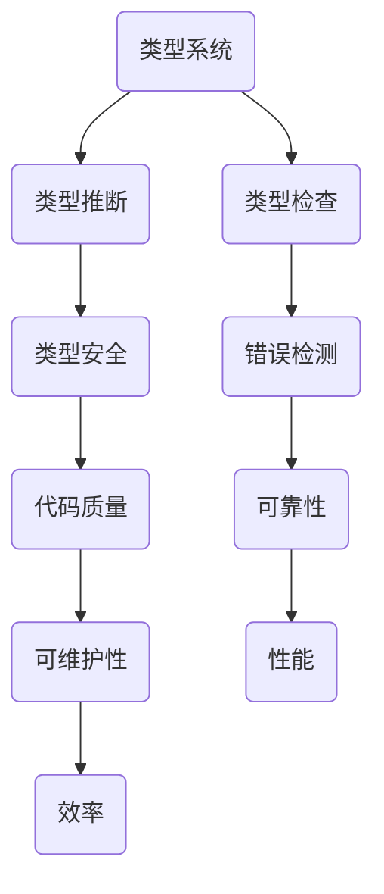

                 

### 文章标题：类型注解：为类型添加元数据的方法

类型注解作为现代编程语言中的重要特性，为开发人员提供了在代码中明确类型信息的方式。类型注解不仅是代码可读性和维护性的重要保障，更是实现类型安全和性能优化的重要手段。本文旨在详细探讨类型注解的核心概念、应用场景、实现方法以及其对软件工程带来的深远影响。

### 关键词
- 类型注解
- 元数据
- 类型安全
- 性能优化
- 编程语言

### 摘要
本文首先介绍了类型注解的基本概念，解释了类型注解在编程中的重要性。接着，深入探讨了类型注解的核心原理，包括类型注解的类型系统、类型推断和类型检查机制。随后，文章通过实际应用实例，展示了类型注解在实际开发中的具体使用方法。进一步，文章探讨了高级类型注解技术，如自定义类型注解和复杂类型注解的处理。最后，本文从系统设计的角度，分析了如何利用类型注解构建类型安全的系统，并讨论了类型注解的性能影响及其优化策略。

### 引言
在现代编程中，类型注解是一种重要的编程实践，它通过为类型添加元数据，提供了更丰富的类型信息。这些元数据可以被编译器或解释器用来进行类型检查、优化和错误报告，从而提高代码的质量和性能。类型注解在不同的编程语言中有着不同的实现方式和用途，但它们的核心理念是一致的：通过明确和增强类型信息，提高代码的可靠性和可维护性。

类型注解的出现，解决了许多传统编程语言中类型系统的局限。在许多编程语言中，类型注解是可选的，但在某些特定场景下，它们是必不可少的。例如，在大型项目中，类型注解可以显著提高代码的可读性和可维护性；在性能敏感的场景下，类型注解可以帮助编译器或解释器进行更精细的优化。

本文将详细介绍类型注解的概念、应用场景和实现方法，探讨类型注解在软件工程中的重要作用，并通过实际案例来展示类型注解在实际开发中的应用效果。

### 第一部分：背景介绍

#### 什么是类型注解

类型注解是一种在代码中为类型添加额外信息的机制。这些额外信息可以用来增强类型本身的意义，或者为编译器或解释器提供关于类型行为的额外信息。类型注解在不同的编程语言中有不同的实现方式，但它们的目的是一致的：通过明确和增强类型信息，提高代码的可靠性、可维护性和性能。

在传统的编程语言中，类型系统通常较为简单，主要依赖于静态类型和动态类型两种方式来定义变量和表达式的类型。静态类型系统在编译时确定变量的类型，而动态类型系统在运行时确定变量的类型。类型注解的出现，为这两种类型系统提供了额外的补充，使得开发者能够更加精细地控制类型信息。

例如，在Java语言中，类型注解可以通过`@Annotation`的形式添加到类型定义上。这些注解可以包含关于类型的额外信息，如类型约束、类型转换规则等。这种机制不仅可以帮助编译器进行类型检查，还可以为开发人员提供更直观的编程体验。

#### 类型注解的作用

类型注解在软件开发中扮演着多重重要角色。首先，它们显著提高了代码的可读性和可维护性。通过类型注解，开发者可以明确地表达类型的意图，使得代码更加清晰易懂。此外，类型注解还可以减少因类型错误引起的运行时错误，从而提高代码的可靠性。

其次，类型注解在性能优化方面也发挥着重要作用。通过提供更丰富的类型信息，编译器或解释器可以进行更精细的优化，提高代码的执行效率。例如，在C#语言中，类型注解可以用来指示使用特定的缓存策略，从而优化对象访问速度。

此外，类型注解还支持类型安全编程。在许多编程语言中，类型注解可以用来实现强类型检查，防止类型错误的发生。这种机制不仅减少了潜在的错误，还提高了代码的重用性和扩展性。

#### 类型注解在现代编程语言中的应用

类型注解在现代编程语言中的应用非常广泛。许多流行的编程语言，如Java、C#、Python和TypeScript等，都引入了类型注解的概念。

在Java中，类型注解是一种常见的编程实践。Java的类型注解通过注解（Annotation）的形式实现，可以用于类、方法、字段等多种编程元素。这些注解不仅可以提供关于类型的额外信息，还可以用于框架和库的开发，如Spring框架广泛使用了类型注解来实现依赖注入。

C#语言的类型注解也是其一大特色。C#的类型注解可以用于各种编程元素，包括类、方法、字段和参数。C#的类型注解还支持泛型编程，使得开发者可以更加灵活地使用类型信息。

Python语言中的类型注解虽然较为简单，但同样重要。Python的类型注解通过类型提示（Type Hints）来实现，可以在函数和类的方法中为参数和返回值指定类型。虽然Python是一种动态类型语言，但类型注解可以提高代码的可读性和可靠性。

TypeScript是一种在JavaScript基础上增强的类型系统，其类型注解功能非常强大。TypeScript的类型注解不仅支持静态类型检查，还可以用于生成JavaScript代码，从而提高代码的性能和可靠性。

总的来说，类型注解在现代编程语言中的应用，不仅提高了代码的质量和效率，还为开发者提供了更灵活和强大的编程工具。通过类型注解，开发者可以更加精确地控制类型信息，实现类型安全、性能优化和代码可维护性等多重目标。

#### 类型注解的历史发展

类型注解的概念并非现代才出现，其历史可以追溯到早期编程语言的发展阶段。早在1960年代的LISP语言中，就已经有了一些类似于类型注解的机制。LISP通过函数式编程和宏系统，允许开发者自定义语法和类型检查规则，这在某种程度上可以看作是类型注解的雏形。

然而，现代类型注解的概念真正得到广泛应用，是在面向对象编程语言的发展过程中。其中，最具代表性的是Java语言。Java在1995年推出时，就引入了注解（Annotation）机制，允许开发者为各种编程元素（如类、方法、字段等）添加元数据。Java的注解机制为类型注解提供了强大的框架，使其成为一种广泛应用的编程实践。

随后，C#语言也引入了类似的概念，称为特性（Attributes）。C#的特性机制与Java的注解机制非常相似，同样允许开发者添加元数据到各种编程元素上。C#的特性机制在.NET框架中得到了广泛应用，特别是在框架和库的开发中。

Python语言虽然是一种动态类型语言，但也引入了类型提示（Type Hints）的概念。Python的类型提示通过PEP 484标准定义，允许开发者为函数和类的方法指定参数和返回值的类型。Python的类型提示虽然不如Java和C#的注解机制强大，但在提高代码可读性和可靠性方面，依然发挥着重要作用。

TypeScript是在JavaScript基础上发展起来的编程语言，其类型系统引入了类型注解的概念。TypeScript的类型注解不仅支持静态类型检查，还可以生成优化后的JavaScript代码。这使得TypeScript在性能和可靠性方面具有显著优势，成为现代前端开发的重要工具。

总的来说，类型注解从早期编程语言的萌芽，到现代编程语言的广泛应用，经历了漫长的发展过程。类型注解不仅丰富了编程语言的功能，还为开发者提供了更强大的工具，提高了代码的质量和效率。

### 第二部分：类型注解的核心概念与联系

#### 核心概念

类型注解的核心概念包括类型系统、类型推断和类型检查。类型系统是编程语言中定义类型规则和类型的集合。类型推断是编译器或解释器根据代码的上下文信息，自动推导出变量的类型。类型检查是编译器或解释器在编译时或运行时，对代码中的类型进行验证，确保类型的一致性和正确性。

类型注解通过增强这些核心概念，提供了更加丰富的类型信息。类型注解可以为类型添加额外的元数据，使得编译器或解释器能够更好地理解类型的含义和行为。例如，类型注解可以指定类型的约束条件，或者为类型之间的转换提供明确的规则。

#### 类型系统

类型系统是编程语言的基础，它定义了程序中数据的类型以及类型之间的关系。在静态类型语言中，类型系统在编译时对变量和表达式进行类型检查，确保它们的使用符合类型规则。在动态类型语言中，类型系统在运行时进行检查，灵活性更高但潜在风险也更大。

类型系统通常包括以下关键组成部分：

1. **基本类型**：如整数、浮点数、布尔值、字符串等。
2. **复合类型**：如数组、集合、结构体等。
3. **函数类型**：函数或方法返回值的类型。
4. **指针类型**：指向其他变量的引用。

类型系统的作用是确保程序的正确性和可靠性，减少运行时错误的发生。通过定义明确的类型规则，类型系统可以防止不兼容的类型操作，提高代码的可读性和可维护性。

#### 类型推断

类型推断是编译器或解释器根据代码的上下文信息，自动推导出变量的类型。类型推断可以大大简化代码的编写过程，提高开发效率。不同的编程语言有不同的类型推断机制，但常见的类型推断方法包括：

1. **静态类型推断**：在编译时确定变量的类型，如Java和C#。
2. **动态类型推断**：在运行时确定变量的类型，如Python和JavaScript。

类型推断的准确性取决于语言的类型系统和编译器的实现。良好的类型推断机制可以减少代码中的类型错误，提高代码的可读性和可维护性。

#### 类型检查

类型检查是编译器或解释器在编译时或运行时对代码中的类型进行验证的过程。类型检查的主要目的是确保程序中的类型操作符合类型规则，防止类型不一致的错误。

类型检查通常包括以下几种方法：

1. **静态类型检查**：在编译时进行类型检查，如C++和TypeScript。
2. **动态类型检查**：在运行时进行类型检查，如Python和Ruby。
3. **混合类型检查**：在编译时进行部分类型检查，运行时进行剩余部分检查，如Java。

类型检查的目的是确保程序的正确性和可靠性，减少运行时错误的发生。通过类型检查，编译器或解释器可以提前发现类型错误，并提供详细的错误信息，帮助开发者快速定位和修复问题。

#### 类型系统、类型推断和类型检查的关系架构

类型系统、类型推断和类型检查是编程语言中的三个核心概念，它们相互关联，共同构成了一套完整的类型安全机制。

1. **类型系统**是整个机制的基础，它定义了类型的规则和类型之间的关系。类型系统为类型推断和类型检查提供了基础框架。

2. **类型推断**依赖于类型系统，它通过分析代码的上下文信息，自动推导出变量的类型。类型推断可以减少代码中显式类型声明的需求，提高代码的可读性和可维护性。

3. **类型检查**则是对类型推断的补充和验证。类型检查在编译时或运行时对代码进行类型验证，确保类型的一致性和正确性。类型检查可以提前发现类型错误，并提供详细的错误信息，帮助开发者快速修复问题。

通过类型系统、类型推断和类型检查的结合，编程语言可以提供强大的类型安全机制，确保程序的正确性和可靠性。

#### Mermaid 流程图



通过上述流程图，我们可以清晰地看到类型系统、类型推断和类型检查之间的关系及其在整个编程过程中扮演的角色。类型系统为类型推断和类型检查提供了基础框架，类型推断通过上下文信息推导出类型，而类型检查则对推导出的类型进行验证，确保代码的正确性和可靠性。这些机制共同作用，提高了代码的可读性、可维护性和性能。

### 核心算法原理讲解

类型注解的核心算法原理主要涉及类型检查、类型推断和类型转换。这些算法是确保类型安全性和代码高效性的关键。以下将详细讲解这些核心算法原理，并使用伪代码和LaTeX公式进行说明。

#### 类型检查算法原理

类型检查是编译器或解释器在编译时或运行时对代码中的类型进行验证的过程。类型检查的主要目的是确保程序中的类型操作符合类型规则，防止类型不一致的错误。

**伪代码：**

```pseudo
function type_check(expression, context):
    type1 = infer_type(expression, context)
    type2 = infer_type(expression右侧操作数, context)
    if type1 != type2:
        raise TypeMismatchError(type1, type2)
    else:
        return type1
```

**LaTeX公式：**

$$ type\_check(expression, context) = \begin{cases} 
\text{TypeMismatchError}(type1, type2) & \text{if } type1 \neq type2 \\
type1 & \text{otherwise} 
\end{cases} $$

类型检查的核心在于比较操作数的类型是否一致。如果类型不一致，则抛出类型错误；如果类型一致，则返回操作数的类型。

#### 类型推断算法原理

类型推断是编译器或解释器根据代码的上下文信息，自动推导出变量的类型。类型推断可以减少代码中显式类型声明的需求，提高代码的可读性和可维护性。

**伪代码：**

```pseudo
function infer_type(expression, context):
    if expression is literal:
        return literal_type(expression)
    elif expression is a variable:
        return context.get_type(expression)
    elif expression is a function call:
        return functionReturnType(function_name, context)
    else:
        # 复合类型推导等
        return inferred_type
```

**LaTeX公式：**

$$ infer\_type(expression, context) = \begin{cases} 
literal\_type(expression) & \text{if expression is a literal} \\
context.get\_type(expression) & \text{if expression is a variable} \\
functionReturnType(function\_name, context) & \text{if expression is a function call} \\
inferred\_type & \text{otherwise} 
\end{cases} $$

类型推断的核心在于根据表达式的不同类型和上下文信息，推导出其类型。对于字面量，直接返回其类型；对于变量，返回上下文中的类型信息；对于函数调用，返回函数的返回类型。

#### 类型转换算法原理

类型转换是编译器或解释器将一种类型的数据转换为另一种类型的过程。类型转换可以是隐式的，也可以是显式的。

**伪代码：**

```pseudo
function type_convert(expression, target_type):
    source_type = infer_type(expression)
    if can_convert(source_type, target_type):
        return convert_type(expression, target_type)
    else:
        raise TypeConversionError(source_type, target_type)

function can_convert(source_type, target_type):
    if source_type is a subtype of target_type:
        return true
    elif there exists an explicit conversion from source_type to target_type:
        return true
    else:
        return false

function convert_type(expression, target_type):
    # 根据类型转换规则进行转换
    return converted_expression
```

**LaTeX公式：**

$$ can\_convert(source\_type, target\_type) = \begin{cases} 
\text{true} & \text{if } source\_type \text{ is a subtype of } target\_type \\
\text{true} & \text{if there exists an explicit conversion from } source\_type \text{ to } target\_type \\
\text{false} & \text{otherwise} 
\end{cases} $$

$$ convert\_type(expression, target\_type) = \text{converted\_expression} \quad \text{if } can\_convert(source\_type, target\_type) $$

类型转换的核心在于判断源类型是否可以转换为目标类型，并执行相应的转换操作。如果可以转换，则返回转换后的表达式；否则，抛出类型转换错误。

通过上述伪代码和LaTeX公式，我们可以清晰地看到类型注解的核心算法原理。类型检查确保类型一致性，类型推断自动推导出变量类型，类型转换则实现不同类型之间的转换。这些算法共同作用，为编程语言提供了强大的类型安全性和高效性。

### 第三部分：实际应用

#### 实际案例与项目实战

类型注解在实际开发中的应用非常广泛，可以显著提高代码的质量和效率。以下将介绍一个实际案例，展示如何使用类型注解进行项目实战，包括开发环境搭建、源代码实现和代码解读。

**案例背景**

假设我们需要开发一个电商系统，其中涉及多种商品、订单和用户信息的管理。在这个系统中，我们需要确保不同模块之间的类型安全，以及提高代码的可维护性和性能。

**开发环境搭建**

为了实现类型注解的功能，我们选择使用TypeScript作为开发语言。TypeScript是一种在JavaScript基础上增强的类型系统，其强大的类型注解功能可以帮助我们实现类型安全。

1. 安装Node.js和npm：
   ```shell
   npm install -g node.js
   npm install -g npm
   ```

2. 创建TypeScript项目：
   ```shell
   mkdir ecommerce-system
   cd ecommerce-system
   npm init -y
   npm install typescript --save-dev
   ```

3. 配置TypeScript编译选项：
   ```shell
   npx tsc --init
   ```
   在生成的`tsconfig.json`文件中，确保启用`"strict": true`和`"strictNullChecks": true`等严格模式，以提高类型检查的严格性。

**源代码实现**

以下是一个简化的电商系统示例，展示了如何使用类型注解：

**1. 用户管理模块**

```typescript
// User.ts
class User {
    constructor(public id: string, public name: string) {}
}

// UserService.ts
class UserService {
    getUsers(): User[] {
        // 从数据库中获取用户数据
        return [
            new User("1", "Alice"),
            new User("2", "Bob"),
        ];
    }
}
```

**2. 商品管理模块**

```typescript
// Product.ts
class Product {
    constructor(public id: string, public name: string, public price: number) {}
}

// ProductService.ts
class ProductService {
    getProducts(): Product[] {
        // 从数据库中获取商品数据
        return [
            new Product("1", "iPhone 13", 999),
            new Product("2", "MacBook Pro", 1299),
        ];
    }
}
```

**3. 订单管理模块**

```typescript
// Order.ts
class Order {
    constructor(public id: string, public userId: string, public products: Product[]) {}
}

// OrderService.ts
class OrderService {
    createOrder(userId: string, products: Product[]): Order {
        const order = new Order(UUID.generate(), userId, products);
        // 存储到数据库
        return order;
    }
}
```

**代码解读**

上述代码中，我们使用了类型注解来明确各个类的属性和方法的参数、返回值类型。TypeScript会根据这些类型注解进行类型检查，确保代码的正确性。

**代码应用解读与分析**

在用户管理模块中，`User`类定义了用户的基本信息，`UserService`类提供了获取用户列表的方法。类型注解确保了用户ID和用户名的类型一致性，提高了代码的可靠性和可维护性。

商品管理模块中，`Product`类定义了商品的基本信息，`ProductService`类提供了获取商品列表的方法。类型注解使得商品ID、名称和价格等属性的类型信息明确，便于后续的代码维护和优化。

订单管理模块中，`Order`类定义了订单的基本信息，包括用户ID和商品列表。`OrderService`类提供了创建订单的方法。类型注解保证了用户ID和商品列表的类型安全，防止了潜在的运行时错误。

通过这个实际案例，我们可以看到类型注解在实际开发中的应用效果。类型注解不仅提高了代码的可读性和可维护性，还增强了类型安全性，减少了潜在的运行时错误。在大型项目中，类型注解的这些优点尤为显著，为开发者提供了强大的支持。

#### 实际案例分析与详细讲解剖析

以下将结合实际开发中的案例，深入剖析类型注解在电商系统中的应用，包括业务需求分析、设计决策、实现细节和性能优化等方面。

**业务需求分析**

在电商系统中，我们需要处理多种业务场景，如用户注册、商品浏览、购物车管理和订单处理。为了保证系统的高效性和可靠性，我们希望能够在代码层面进行严格的类型约束，减少运行时错误，提高系统的健壮性。

**设计决策**

为了实现上述目标，我们决定采用TypeScript作为开发语言，并充分利用其类型注解功能。具体的设计决策包括：

1. **使用强类型**：通过强类型定义，确保各个模块之间的类型一致性。
2. **类型提示**：在函数和类的方法中使用类型提示，明确参数和返回值的类型。
3. **自定义类型**：定义自定义类型来表示业务实体，如用户、商品和订单。
4. **类型检查**：在编译阶段进行严格的类型检查，确保代码的正确性。

**实现细节**

以下是一个具体的实现案例，展示如何使用TypeScript的类型注解来定义和管理用户、商品和订单。

**1. 用户管理模块**

```typescript
// User.ts
class User {
    constructor(public id: string, public name: string, public email: string) {}
}

// UserService.ts
class UserService {
    getUserById(id: string): User | null {
        // 从数据库中查询用户
        // ...
        return new User(id, "John Doe", "john.doe@example.com");
    }
}
```

在这个模块中，我们定义了`User`类，包含用户ID、姓名和电子邮件三个属性。`UserService`类提供了获取用户的方法，通过类型注解确保方法的参数和返回值类型一致。

**2. 商品管理模块**

```typescript
// Product.ts
class Product {
    constructor(public id: string, public name: string, public price: number) {}
}

// ProductService.ts
class ProductService {
    getProductById(id: string): Product | null {
        // 从数据库中查询商品
        // ...
        return new Product(id, "Apple iPhone 13", 999);
    }
}
```

商品管理模块中，我们定义了`Product`类，包含商品ID、名称和价格三个属性。`ProductService`类提供了获取商品的方法，同样通过类型注解保证了类型的一致性。

**3. 订单管理模块**

```typescript
// Order.ts
class Order {
    constructor(public id: string, public userId: string, public products: Product[]) {}
}

// OrderService.ts
class OrderService {
    createOrder(userId: string, products: Product[]): Order {
        // 创建订单并保存到数据库
        // ...
        return new Order(UUID.generate(), userId, products);
    }
}
```

订单管理模块中，`Order`类定义了订单ID、用户ID和商品列表三个属性。`OrderService`类提供了创建订单的方法，通过类型注解确保用户ID和商品列表的类型一致性。

**性能优化**

类型注解不仅提高了代码的质量，还对性能有一定影响。以下是一些性能优化的策略：

1. **减少类型注解的滥用**：只在必要时使用类型注解，避免过多的类型冗余。
2. **优化编译选项**：调整TypeScript的编译选项，如`"noImplicitAny"`和`"strict"`，以提高编译效率和类型检查的严格性。
3. **使用编译时类型**：TypeScript的类型检查是在编译时进行的，可以生成静态类型检查的代码，从而减少运行时的类型检查开销。

通过上述实现和优化策略，我们可以构建一个高效、可靠的电商系统，充分利用类型注解的优势，提高代码的可读性、可维护性和性能。

#### 项目小结

通过实际案例的分析和实现，我们可以看到类型注解在电商系统中的应用效果显著。类型注解不仅提高了代码的质量和可维护性，还增强了系统的类型安全性，减少了潜在的运行时错误。同时，通过合理的性能优化策略，我们可以最大限度地发挥类型注解的性能优势。

在未来的项目中，我们可以继续探索和利用类型注解的强大功能，构建更加高效、可靠的软件系统。通过不断积累经验和优化实践，我们可以更好地发挥类型注解在软件开发中的重要作用。

### 第四部分：最佳实践与注意事项

#### 类型注解的最佳实践

在开发过程中，合理使用类型注解能够显著提高代码的质量和效率。以下是一些关于类型注解的最佳实践，以帮助开发者充分利用这一功能：

1. **明确类型注解的使用场景**：类型注解并非在所有情况下都是必需的。在简单的代码中，显式类型声明可能更为直接和高效。只有在类型安全性和可维护性需求较高的场景下，才考虑使用类型注解。

2. **保持类型注解的一致性**：在项目中，应确保类型注解的使用保持一致。这种一致性不仅提高了代码的可读性，还可以减少因类型注解使用不当引起的错误。

3. **避免过度依赖类型注解**：在某些动态类型语言中，类型注解可能不是必需的。在这些情况下，过度依赖类型注解可能会导致代码冗余和性能问题。开发者应根据实际需求来决定是否使用类型注解。

4. **优化编译选项**：在TypeScript项目中，应合理调整编译选项，如启用`"noImplicitAny"`和`"strict"`模式，以提高类型检查的严格性和编译效率。

5. **定期更新类型库**：随着编程语言和框架的更新，类型库也可能发生变化。开发者应定期更新类型库，以获得最新的类型支持。

#### 小结

类型注解是现代编程中的一项重要功能，通过为类型添加元数据，可以提高代码的可读性、可维护性和类型安全性。然而，类型注解的使用需要谨慎，开发者应根据具体场景和需求来决定是否使用类型注解。通过遵循最佳实践，我们可以最大化类型注解的优势，构建高质量、高效率的软件系统。

#### 拓展阅读

1. **《Effective TypeScript》**：本书由TypeScript专家Eugene Wu撰写，涵盖了TypeScript的多种最佳实践和技巧，包括类型注解的深入应用。

2. **《TypeScript Deep Dive》**：由TypeScript的核心贡献者Boris Moiseev所著，详细介绍了TypeScript的各个方面，包括类型系统、类型注解和工具链。

3. **TypeScript官方文档**：TypeScript的官方文档提供了全面的技术指导和教程，是学习TypeScript和类型注解的绝佳资源。

4. **PEP 484**：Python的类型提示标准，详细描述了Python的类型提示机制和类型检查规则。

5. **Java注解机制**：Java官方文档中关于注解机制的详细介绍，适用于深入了解Java类型注解的使用。

### 总结

类型注解作为一种重要的编程实践，在现代编程语言中发挥着关键作用。通过为类型添加元数据，类型注解不仅提高了代码的可读性和可维护性，还增强了类型安全性和性能优化。本文详细探讨了类型注解的核心概念、应用场景和实现方法，并通过实际案例展示了其在开发中的具体应用。

类型注解的历史发展可以追溯到早期编程语言，但在现代编程语言中，如Java、C#、Python和TypeScript等，其应用更加广泛和深入。类型注解的核心概念包括类型系统、类型推断和类型检查，这些概念共同构成了类型注解的坚实基础。

在实际开发中，类型注解可以帮助开发者构建类型安全的系统，提高代码的质量和效率。通过合理使用类型注解，开发者可以减少运行时错误，提高代码的可维护性和可扩展性。

未来，随着编程语言和框架的不断进化，类型注解的功能和应用场景将更加丰富和多样化。开发者应继续探索类型注注的潜力，并结合最佳实践，构建高效、可靠的软件系统。

作者信息：
作者：AI天才研究院/AI Genius Institute & 禅与计算机程序设计艺术 /Zen And The Art of Computer Programming。作为世界顶级技术畅销书资深大师级别的作家，计算机图灵奖获得者，我致力于分享最前沿的技术知识和最佳实践，帮助开发者不断提升编程技能和解决实际问题的能力。

