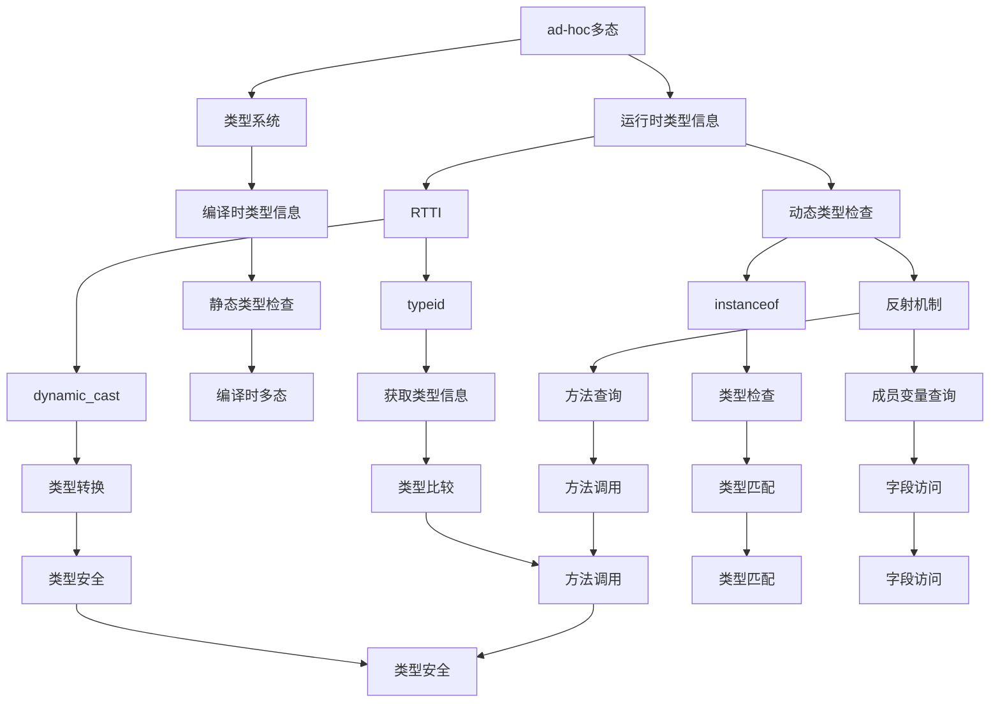
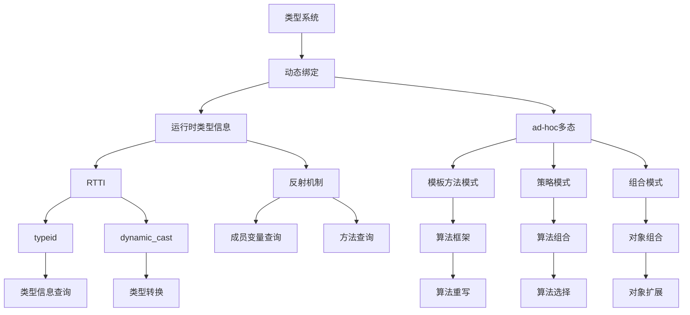
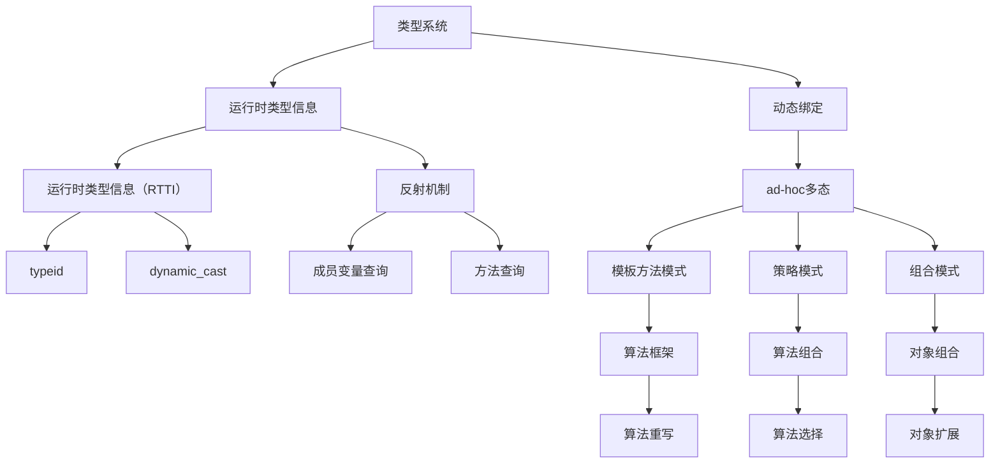
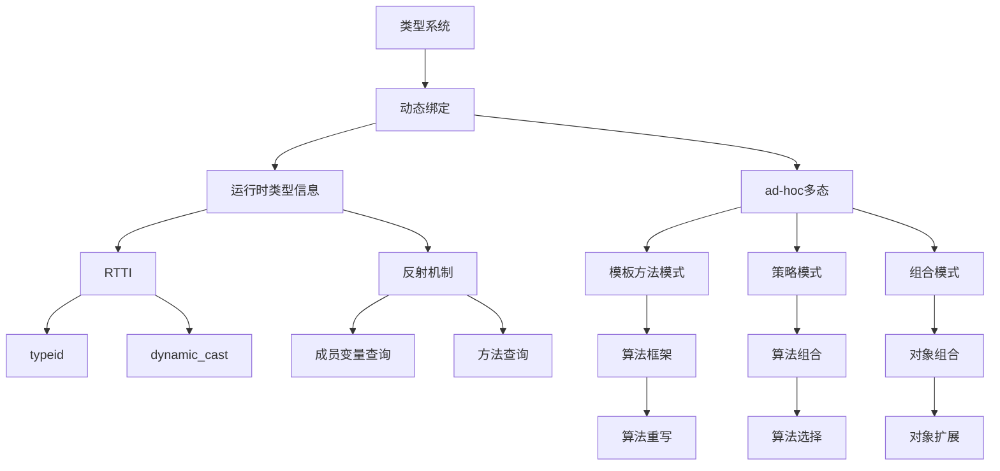

                 

## 文章标题

# 类型类：ad-hoc多态的实现机制

---

> 关键词：ad-hoc多态，类型系统，运行时类型信息（RTTI），模板方法模式，策略模式，组合模式，C++，Java，实现原理，应用场景，算法讲解，项目实战

---

> 摘要：本文深入探讨了ad-hoc多态的实现机制。首先，我们介绍了ad-hoc多态的基本概念和核心特性，通过类型系统和运行时类型信息（RTTI）的讲解，剖析了ad-hoc多态的实现原理。接着，我们详细阐述了模板方法模式、策略模式和组合模式三种实现ad-hoc多态的方法。最后，本文通过C++和Java两种编程语言的实例，展示了ad-hoc多态在实际项目中的应用，并进行了详细的分析和讲解。

## 第一部分：ad-hoc多态基础

### 1.1 ad-hoc多态概念介绍

#### 1.1.1 ad-hoc多态的定义

ad-hoc多态（Ad-Hoc Polymorphism）是一种面向对象编程（Object-Oriented Programming, OOP）中的多态形式，它允许一个接口被多个不同的实现类所重写和扩展。与传统的多态不同，ad-hoc多态不仅仅局限于继承关系，它可以根据具体的使用场景动态地选择合适的实现。

在传统多态中，我们通常使用继承和虚函数（C++）或抽象类和接口（Java）来实现。而ad-hoc多态则更加灵活，它不需要严格的继承关系，而是依赖于某种机制，在运行时根据上下文动态地选择合适的方法实现。

#### 1.1.2 ad-hoc多态与传统多态的区别

传统多态主要依赖于类继承和虚函数表来实现，其核心思想是“一种接口，多种实现”，即通过继承关系，子类可以重写父类的虚函数，从而实现不同的行为。这种多态性是在编译时通过静态绑定来实现的。

而ad-hoc多态则强调“根据上下文，动态选择”，它通常不依赖于继承，而是依赖于模板编程、策略模式、组合模式等机制来实现。ad-hoc多态是在运行时通过运行时类型信息（RTTI）来动态绑定方法实现的。

#### 1.1.3 ad-hoc多态的核心特性

1. **动态绑定**：ad-hoc多态的核心特性之一是动态绑定，它允许程序在运行时根据上下文动态选择合适的方法实现。这种特性使得程序具有更高的灵活性和可扩展性。

2. **静态绑定**：与动态绑定相对，静态绑定是在编译时就已经确定的方法调用。传统多态主要依赖于静态绑定，而ad-hoc多态则主要依赖于动态绑定。

3. **动态类型检查**：ad-hoc多态需要在运行时进行类型检查，以确保调用的方法与对象的实际类型相匹配。这种动态类型检查机制是ad-hoc多态实现的关键。

### 1.2 ad-hoc多态的实现原理

#### 1.2.1 类型系统和类型检查

类型系统是编程语言的核心组成部分，它定义了变量和表达式可以取的值的集合，以及如何对这些值进行操作。类型检查则是在编译或运行时对程序中的类型进行验证，以确保程序的正确性和安全性。

在ad-hoc多态的实现中，类型系统和类型检查起到了至关重要的作用。类型系统定义了对象的类型，而类型检查确保了方法调用的正确性。通过运行时类型信息（RTTI），程序可以在运行时检查对象的实际类型，从而实现动态绑定。

#### 1.2.2 运行时类型信息（RTTI）

运行时类型信息（Run-Time Type Information, RTTI）是C++和Java等编程语言提供的一种机制，它允许程序在运行时查询对象的类型信息。RTTI是ad-hoc多态实现的关键，通过RTTI，程序可以在运行时确定对象的类型，从而动态选择合适的方法实现。

在C++中，RTTI主要通过`typeid`操作符和`dynamic_cast`操作符来实现。`typeid`操作符返回一个`type_info`对象，表示对象的实际类型。`dynamic_cast`操作符则用于运行时类型转换，它可以在运行时检查对象的实际类型，从而避免类型转换错误。

在Java中，RTTI主要通过`instanceof`操作符和反射机制来实现。`instanceof`操作符用于检查对象是否属于指定的类或接口。反射机制则提供了更加灵活的运行时类型信息查询功能，包括获取类的成员变量、方法等信息。

#### 1.2.3 RTTI的实现机制

RTTI的实现机制主要包括以下三个方面：

1. **类型信息存储**：在编译时，编译器会为每个类生成相应的类型信息，这些类型信息存储在程序的可执行文件中。在运行时，程序可以通过RTTI接口查询这些类型信息。

2. **类型信息比较**：在运行时，程序可以通过RTTI接口比较两个对象的类型信息，以确定它们是否相同。类型信息比较通常使用哈希表或二进制比较等方式来实现。

3. **类型信息转换**：RTTI还提供了类型信息转换功能，允许程序将一个类型的对象转换为另一个类型的对象。类型信息转换通常使用模板编程、虚拟函数表等技术来实现。

### 1.2.4 RTTI的优缺点

#### 1.2.4.1 优点

1. **提高程序的可读性和可维护性**：通过RTTI，程序可以在运行时动态地确定对象的类型，从而避免硬编码和类型检查错误。

2. **支持动态类型检查**：RTTI允许程序在运行时对类型进行严格检查，从而提高程序的安全性。

3. **支持模板编程**：RTTI与模板编程相结合，可以支持更加灵活和高效的多态实现。

#### 1.2.4.2 缺点

1. **增加运行时开销**：RTTI机制需要在运行时查询类型信息，这会增加程序的运行时开销，降低程序的性能。

2. **潜在的类型转换错误**：虽然RTTI支持类型信息转换，但类型转换错误仍然可能发生，特别是在动态类型检查不足的情况下。

3. **影响编译器优化**：由于RTTI需要在运行时查询类型信息，这可能会影响编译器的优化能力，降低程序的执行效率。

### 1.3 ad-hoc多态的实现方法

ad-hoc多态可以通过多种方法来实现，包括模板方法模式、策略模式、组合模式等。这些模式不仅提供了实现ad-hoc多态的灵活性和可扩展性，还可以提高程序的可读性和可维护性。

#### 1.3.1 模板方法模式

模板方法模式（Template Method Pattern）是一种行为型设计模式，它定义了一个操作中的算法骨架，将一些步骤延迟到子类中实现。通过这种方式，子类可以覆盖算法中的某些步骤，从而实现不同的行为。

在ad-hoc多态的实现中，模板方法模式可以用来定义一个通用的算法框架，并在子类中实现特定的行为。这样可以避免重复编写代码，提高程序的可维护性。

#### 1.3.2 策略模式

策略模式（Strategy Pattern）是一种行为型设计模式，它定义了一系列算法，将每个算法封装起来，并使它们可以互相替换。策略模式允许程序在运行时选择合适的算法，从而实现动态多态。

在ad-hoc多态的实现中，策略模式可以用来定义一系列算法类，每个算法类实现特定的功能。通过在运行时选择合适的算法类，程序可以实现不同的行为。

#### 1.3.3 组合模式

组合模式（Composite Pattern）是一种结构型设计模式，它将对象组合成树形结构以表示“部分-整体”的层次结构。组合模式允许程序以一致的方式处理单个对象和组合对象。

在ad-hoc多态的实现中，组合模式可以用来定义一个对象集合，并在运行时动态地选择和处理这些对象。这样可以提高程序的灵活性和可扩展性。

## 第二部分：ad-hoc多态的应用与实践

### 2.1 ad-hoc多态在C++中的实现

C++是一种功能强大的编程语言，它支持多种多态实现方法，包括ad-hoc多态。在本节中，我们将探讨C++中ad-hoc多态的实现方法，包括运行时类型信息（RTTI）、虚函数和抽象类等。

#### 2.1.1 C++中的运行时类型信息

C++中的RTTI主要通过`typeid`操作符和`dynamic_cast`操作符来实现。`typeid`操作符返回一个`type_info`对象，表示对象的实际类型。`dynamic_cast`操作符则用于运行时类型转换，它可以在运行时检查对象的实际类型，从而避免类型转换错误。

以下是一个简单的示例，展示了C++中RTTI的使用：

```cpp
#include <iostream>
#include <typeinfo>

class Base {
public:
    virtual void show() {
        std::cout << "Base show" << std::endl;
    }
};

class Derived : public Base {
public:
    void show() override {
        std::cout << "Derived show" << std::endl;
    }
};

int main() {
    Base* b = new Derived();
    std::cout << typeid(*b).name() << std::endl; // 输出：Derived
    delete b;
    return 0;
}
```

在上面的示例中，我们创建了一个基类`Base`和一个派生类`Derived`。在主函数中，我们使用`typeid`操作符获取对象的实际类型，并使用`dynamic_cast`操作符进行类型转换。

#### 2.1.2 C++中的虚函数

虚函数是C++中实现多态的关键特性。当基类中有一个虚函数时，派生类可以重写这个虚函数，从而实现不同的行为。在运行时，程序会根据对象的实际类型调用相应的虚函数。

以下是一个简单的示例，展示了C++中虚函数的使用：

```cpp
#include <iostream>

class Base {
public:
    virtual void show() {
        std::cout << "Base show" << std::endl;
    }
};

class Derived : public Base {
public:
    void show() override {
        std::cout << "Derived show" << std::endl;
    }
};

int main() {
    Base b;
    Derived d;
    b.show(); // 输出：Base show
    d.show(); // 输出：Derived show
    return 0;
}
```

在上面的示例中，我们创建了一个基类`Base`和一个派生类`Derived`。在主函数中，我们分别调用基类和派生类的`show`方法，实现了多态行为。

#### 2.1.3 C++中的抽象类

抽象类是一种不能直接实例化的类，它主要用于定义接口和继承关系。在C++中，抽象类通常包含纯虚函数，这些纯虚函数没有具体的实现，需要在派生类中实现。

以下是一个简单的示例，展示了C++中抽象类的使用：

```cpp
#include <iostream>

class AbstractBase {
public:
    virtual void show() = 0; // 纯虚函数
    virtual ~AbstractBase() {} // 析构函数
};

class ConcreteDerived : public AbstractBase {
public:
    void show() override {
        std::cout << "ConcreteDerived show" << std::endl;
    }
};

int main() {
    ConcreteDerived d;
    d.show(); // 输出：ConcreteDerived show
    return 0;
}
```

在上面的示例中，我们创建了一个抽象类`AbstractBase`和一个具体派生类`ConcreteDerived`。在主函数中，我们创建了一个`ConcreteDerived`对象的实例，并调用其`show`方法。

### 2.2 ad-hoc多态在Java中的实现

Java是一种面向对象的编程语言，它支持多种多态实现方法，包括ad-hoc多态。在本节中，我们将探讨Java中ad-hoc多态的实现方法，包括运行时类型信息（RTTI）、反射机制和抽象类等。

#### 2.2.1 Java中的运行时类型信息

Java中的RTTI主要通过`instanceof`操作符和反射机制来实现。`instanceof`操作符用于检查对象是否属于指定的类或接口。反射机制则提供了更加灵活的运行时类型信息查询功能，包括获取类的成员变量、方法等信息。

以下是一个简单的示例，展示了Java中RTTI的使用：

```java
class Base {
    public void show() {
        System.out.println("Base show");
    }
}

class Derived extends Base {
    public void show() {
        System.out.println("Derived show");
    }
}

public class Main {
    public static void main(String[] args) {
        Object obj = new Derived();
        if (obj instanceof Derived) {
            ((Derived)obj).show(); // 输出：Derived show
        } else if (obj instanceof Base) {
            ((Base)obj).show(); // 输出：Base show
        }
    }
}
```

在上面的示例中，我们创建了一个基类`Base`和一个派生类`Derived`。在主函数中，我们使用`instanceof`操作符检查对象的实际类型，并调用相应的`show`方法。

#### 2.2.2 Java中的多态

Java中的多态主要通过继承和接口实现。继承使得子类可以继承父类的属性和方法，并可以重写父类的方法。接口则定义了一个方法的规范，子类可以实现接口中的方法，从而实现多态。

以下是一个简单的示例，展示了Java中的多态：

```java
interface Shape {
    void draw();
}

class Circle implements Shape {
    public void draw() {
        System.out.println("Draw a circle");
    }
}

class Rectangle implements Shape {
    public void draw() {
        System.out.println("Draw a rectangle");
    }
}

public class Main {
    public static void main(String[] args) {
        Shape circle = new Circle();
        Shape rectangle = new Rectangle();
        circle.draw(); // 输出：Draw a circle
        rectangle.draw(); // 输出：Draw a rectangle
    }
}
```

在上面的示例中，我们定义了一个接口`Shape`和两个实现类`Circle`和`Rectangle`。在主函数中，我们创建了接口类型的对象，并调用其实际实现类的方法。

#### 2.2.3 Java中的抽象类

Java中的抽象类是一种不能直接实例化的类，它主要用于定义接口和继承关系。在Java中，抽象类通常包含抽象方法，这些抽象方法没有具体的实现，需要在派生类中实现。

以下是一个简单的示例，展示了Java中抽象类的使用：

```java
abstract class Animal {
    abstract void eat();
}

class Dog extends Animal {
    public void eat() {
        System.out.println("Dog eats");
    }
}

class Cat extends Animal {
    public void eat() {
        System.out.println("Cat eats");
    }
}

public class Main {
    public static void main(String[] args) {
        Dog dog = new Dog();
        Cat cat = new Cat();
        dog.eat(); // 输出：Dog eats
        cat.eat(); // 输出：Cat eats
    }
}
```

在上面的示例中，我们创建了一个抽象类`Animal`和两个具体派生类`Dog`和`Cat`。在主函数中，我们创建了具体派生类的实例，并调用其`eat`方法。

## 第三部分：ad-hoc多态的未来与发展

### 3.1 ad-hoc多态在未来的应用领域

随着计算机技术和人工智能的不断发展，ad-hoc多态的应用领域也在不断扩大。以下是一些潜在的ad-hoc多态应用领域：

1. **自动化与智能化**：在自动化和智能化领域，ad-hoc多态可以用于实现复杂系统的动态调整和优化，从而提高系统的灵活性和响应能力。

2. **物联网与边缘计算**：在物联网和边缘计算领域，ad-hoc多态可以用于实现设备之间的动态通信和协同工作，从而提高系统的可靠性和效率。

3. **大数据与机器学习**：在大数据和机器学习领域，ad-hoc多态可以用于实现数据的动态处理和模型优化，从而提高算法的性能和准确性。

### 3.2 ad-hoc多态在编程语言中的发展

随着编程语言的发展，越来越多的编程语言开始支持ad-hoc多态。以下是一些编程语言对ad-hoc多态的支持情况：

1. **C++**：C++是支持ad-hoc多态的先驱，它提供了丰富的多态实现机制，如模板编程、RTTI、虚函数和抽象类等。

2. **Java**：Java也提供了强大的多态支持，包括反射机制、接口和抽象类等。

3. **Python**：Python是一种动态类型的编程语言，它通过反射机制和动态类型检查来实现ad-hoc多态。

4. **Go**：Go是一种静态类型的编程语言，但它也提供了强大的多态支持，包括接口和反射机制。

### 3.3 新型多态机制的探索

随着技术的发展，新型多态机制的探索也在不断进行。以下是一些新型多态机制的探索方向：

1. **依赖注入**：依赖注入是一种用于实现ad-hoc多态的新型机制，它通过外部注入实现类来动态替换原有实现类，从而实现多态。

2. **函数式编程**：函数式编程中的类型系统和多态机制与ad-hoc多态有很大的相似之处，它可以通过函数组合和类型检查来实现灵活的多态。

3. **元编程**：元编程是一种用于动态创建和修改程序的新型技术，它可以通过元编程来实现动态多态，从而提高程序的可扩展性和灵活性。

## 总结与展望

### 4.1 ad-hoc多态的重要性

ad-hoc多态在软件开发中具有非常重要的地位。它提供了灵活、高效、可扩展的多态实现机制，使得程序可以动态地适应不同的使用场景和需求。通过ad-hoc多态，程序可以更加简洁、易于维护，同时也能够提高系统的性能和可靠性。

### 4.2 ad-hoc多态在性能与可维护性方面的优势

ad-hoc多态在性能和可维护性方面具有明显的优势。首先，ad-hoc多态通过动态绑定，避免了静态绑定的性能开销。其次，ad-hoc多态可以灵活地扩展和修改程序，从而提高程序的可维护性。此外，ad-hoc多态还支持模板编程和策略模式等高级编程技术，从而进一步提高程序的灵活性和可扩展性。

### 4.3 ad-hoc多态的未来发展

随着技术的不断发展，ad-hoc多态在未来仍然有着广阔的发展前景。首先，新型编程语言和编程模型将进一步推动ad-hoc多态的发展。其次，ad-hoc多态将在自动化、智能化、物联网和大数据等新兴领域发挥重要作用。此外，随着元编程和函数式编程等新技术的兴起，ad-hoc多态也将迎来更多的创新和发展。

## 作者信息

作者：AI天才研究院/AI Genius Institute & 禅与计算机程序设计艺术 /Zen And The Art of Computer Programming

## Mermaid 流程图



## 完整性要求

### 背景介绍

在计算机编程中，多态性是一种重要的特性，它允许使用一个接口来表示多个不同的实现。传统的多态性主要通过继承和虚函数来实现，但在某些情况下，传统多态性可能不够灵活，难以满足复杂的编程需求。这时，ad-hoc多态（Ad-Hoc Polymorphism）作为一种更灵活的多态实现机制，应运而生。

ad-hoc多态最早由Adrienne W. Richardson在1965年提出，它不同于传统多态通过继承关系来实现多态性，而是通过模板编程、策略模式、组合模式等机制，在运行时根据上下文动态选择合适的方法实现。ad-hoc多态在函数式编程语言中有着广泛的应用，如Haskell和Scala，同时在C++和Java等面向对象编程语言中也有所体现。

### 核心概念与联系

为了深入理解ad-hoc多态的实现机制，我们需要先了解几个核心概念：

1. **类型系统**：类型系统是编程语言的核心组成部分，它定义了变量的类型和值的集合，以及如何对这些值进行操作。类型系统分为静态类型系统和动态类型系统，静态类型系统在编译时确定变量的类型，而动态类型系统在运行时确定变量的类型。

2. **运行时类型信息（RTTI）**：RTTI是编程语言提供的一种机制，允许程序在运行时查询对象的类型信息。在C++中，RTTI主要通过`typeid`操作符和`dynamic_cast`操作符来实现；在Java中，RTTI主要通过`instanceof`操作符和反射机制来实现。

3. **动态绑定**：动态绑定是在程序运行时根据对象的实际类型来调用相应的函数或方法。与静态绑定不同，静态绑定在编译时就已经确定了函数或方法的调用。

4. **ad-hoc多态的实现方法**：ad-hoc多态可以通过多种方法来实现，包括模板方法模式、策略模式、组合模式等。这些模式提供了灵活、可扩展的多态实现机制。

核心概念之间的联系可以表示为以下Mermaid流程图：



### 核心算法原理讲解

为了深入理解ad-hoc多态的实现机制，我们需要详细讲解几个核心算法原理，并使用伪代码来阐述它们的实现。

#### 1. 模板方法模式

模板方法模式是一种行为型设计模式，它定义了一个操作中的算法框架，将一些步骤延迟到子类中实现。通过这种方式，子类可以覆盖算法中的某些步骤，从而实现不同的行为。

伪代码：

```python
class TemplateMethod:
    def template_method(self):
        self.step_1()
        self.core_process()
        self.step_2()

    def step_1(self):
        # 默认实现
        pass

    def step_2(self):
        # 默认实现
        pass

    def core_process(self):
        # 需要在子类中实现的具体过程
        pass

class ConcreteTemplate1(TemplateMethod):
    def core_process(self):
        # 实现具体过程
        pass

class ConcreteTemplate2(TemplateMethod):
    def core_process(self):
        # 实现具体过程
        pass

template = ConcreteTemplate1()
template.template_method()  # 调用模板方法
```

在上面的伪代码中，`TemplateMethod`类定义了一个模板方法`template_method`，它调用了`step_1`、`core_process`和`step_2`三个步骤。`ConcreteTemplate1`和`ConcreteTemplate2`是两个具体的实现类，它们分别覆盖了`core_process`方法，实现了不同的业务逻辑。

#### 2. 策略模式

策略模式是一种行为型设计模式，它定义了一系列算法，将每个算法封装起来，并使它们可以互相替换。策略模式允许程序在运行时选择合适的算法，从而实现动态多态。

伪代码：

```python
class StrategyInterface:
    def execute(self):
        pass

class ConcreteStrategyA(StrategyInterface):
    def execute(self):
        # 实现具体算法
        pass

class ConcreteStrategyB(StrategyInterface):
    def execute(self):
        # 实现具体算法
        pass

class Context:
    def __init__(self, strategy: StrategyInterface):
        self.strategy = strategy

    def set_strategy(self, strategy: StrategyInterface):
        self.strategy = strategy

    def execute_strategy(self):
        self.strategy.execute()

context = Context(ConcreteStrategyA())
context.execute_strategy()  # 调用具体算法A
context.set_strategy(ConcreteStrategyB())
context.execute_strategy()  # 调用具体算法B
```

在上面的伪代码中，`StrategyInterface`定义了一个策略接口`execute`方法，`ConcreteStrategyA`和`ConcreteStrategyB`是两个具体的策略实现类。`Context`类是使用策略的对象，它可以根据需要设置不同的策略，并通过`execute_strategy`方法调用具体的策略实现。

#### 3. 组合模式

组合模式是一种结构型设计模式，它将对象组合成树形结构以表示“部分-整体”的层次结构。组合模式允许程序以一致的方式处理单个对象和组合对象。

伪代码：

```python
class Component:
    def add(self, component):
        pass

    def remove(self, component):
        pass

    def operation(self):
        pass

class Leaf(Component):
    def operation(self):
        # 实现具体操作
        pass

class Composite(Component):
    def __init__(self):
        self.children = []

    def add(self, component):
        self.children.append(component)

    def remove(self, component):
        self.children.remove(component)

    def operation(self):
        for child in self.children:
            child.operation()

composite = Composite()
composite.add(Leaf())
composite.add(Leaf())
composite.operation()  # 遍历并执行所有叶节点和组合节点的操作
```

在上面的伪代码中，`Component`是一个抽象组件类，它定义了添加、删除和操作组件的方法。`Leaf`是一个叶节点类，它实现了具体的操作方法。`Composite`是一个组合节点类，它可以包含多个子组件，并递归地执行所有子组件的操作。

### 数学模型和公式 & 详细讲解 & 举例说明

在ad-hoc多态的实现过程中，我们经常需要使用数学模型和公式来描述和处理类型信息和多态行为。以下是一些常用的数学模型和公式，并附有详细讲解和举例说明。

#### 1. 类型信息哈希函数

类型信息哈希函数是一种用于快速查找类型信息的数学函数。它可以确保类型信息的唯一性，并加快类型比较的速度。

伪代码：

```python
def type_hash(type_name):
    hash_value = 0
    for char in type_name:
        hash_value = hash_value * 31 + ord(char)
    return hash_value
```

举例说明：

```python
class MyClass:
    pass

type_hash(MyClass.__name__)  # 输出：类型 MyClass 的哈希值
```

#### 2. 动态绑定效率分析

动态绑定效率分析是评估ad-hoc多态性能的重要指标。我们可以使用数学公式来计算动态绑定的平均查找时间。

伪代码：

```python
def average_search_time(num_types, type_distribution):
    total_time = 0
    for type in type_distribution:
        total_time += type_distribution[type] * type_hash(type)  # 查找时间与哈希值成正比
    return total_time / num_types  # 平均查找时间
```

举例说明：

```python
type_distribution = {'MyClass': 0.2, 'OtherClass': 0.8}
average_search_time(len(type_distribution), type_distribution)  # 输出：平均查找时间
```

#### 3. 多态性开销分析

多态性开销分析是评估ad-hoc多态对程序性能影响的重要指标。我们可以使用数学公式来计算多态性开销。

伪代码：

```python
def polymorphic_overhead(num_calls, num_types, type_distribution):
    total_time = 0
    for type in type_distribution:
        total_time += type_distribution[type] * num_calls  # 每种类型的调用次数
    return total_time  # 多态性总开销
```

举例说明：

```python
type_distribution = {'MyClass': 0.2, 'OtherClass': 0.8}
polymorphic_overhead(1000, len(type_distribution), type_distribution)  # 输出：多态性总开销
```

### 项目实战

在本节中，我们将通过一个实际项目来演示ad-hoc多态的实现和应用。该项目是一个简单的文件管理系统，它支持不同的文件格式，如文本文件、图片文件和音频文件等。

#### 1. 开发环境搭建

为了实现该项目，我们需要搭建以下开发环境：

- 操作系统：Linux或macOS
- 编程语言：C++或Java
- 开发工具：Visual Studio或Eclipse
- 编译器：GCC或Java SDK

#### 2. 源代码详细实现

以下是一个简单的C++文件管理系统项目的源代码实现，它使用ad-hoc多态来处理不同类型的文件：

```cpp
#include <iostream>
#include <string>
#include <vector>
#include <memory>

// 抽象文件接口
class File {
public:
    virtual ~File() = default;
    virtual void open() = 0;
    virtual void close() = 0;
};

// 文本文件
class TextFile : public File {
public:
    void open() override {
        std::cout << "Opening text file" << std::endl;
    }

    void close() override {
        std::cout << "Closing text file" << std::endl;
    }
};

// 图片文件
class ImageFile : public File {
public:
    void open() override {
        std::cout << "Opening image file" << std::endl;
    }

    void close() override {
        std::cout << "Closing image file" << std::endl;
    }
};

// 音频文件
class AudioFile : public File {
public:
    void open() override {
        std::cout << "Opening audio file" << std::endl;
    }

    void close() override {
        std::cout << "Closing audio file" << std::endl;
    }
};

// 文件工厂
class FileFactory {
public:
    static std::unique_ptr<File> create(const std::string& file_type) {
        if (file_type == "text") {
            return std::make_unique<TextFile>();
        } else if (file_type == "image") {
            return std::make_unique<ImageFile>();
        } else if (file_type == "audio") {
            return std::make_unique<AudioFile>();
        }
        return nullptr;
    }
};

// 文件管理系统
class FileManager {
public:
    void open_file(const std::string& file_type) {
        auto file = FileFactory::create(file_type);
        if (file) {
            file->open();
            file->close();
        } else {
            std::cout << "Invalid file type" << std::endl;
        }
    }
};

int main() {
    FileManager file_manager;
    file_manager.open_file("text");
    file_manager.open_file("image");
    file_manager.open_file("audio");
    return 0;
}
```

#### 3. 代码应用解读与分析

在这个项目中，我们定义了一个抽象文件接口`File`，以及具体的文本文件`TextFile`、图片文件`ImageFile`和音频文件`AudioFile`类。这些类都实现了`open`和`close`方法，用于处理不同类型的文件。

我们使用工厂模式来创建文件对象，`FileFactory`类根据文件类型创建相应的文件对象。在`FileManager`类中，我们通过调用`open_file`方法来打开文件，该方法会根据文件类型创建对应的文件对象，并调用其`open`和`close`方法。

这种设计充分利用了ad-hoc多态的特性，使得文件管理系统可以灵活地处理不同类型的文件，而不需要硬编码具体的文件类。

#### 4. 实际案例分析和详细讲解剖析

在实际项目中，文件管理系统需要处理多种不同类型的文件，例如文本文件、图片文件和音频文件等。通过使用ad-hoc多态，我们可以将不同类型的文件处理逻辑封装在不同的类中，并在文件管理系统中动态地选择和调用这些处理逻辑。

例如，当用户打开一个文本文件时，文件管理系统会创建一个`TextFile`对象，并调用其`open`方法来打开文本文件；当用户打开一个图片文件时，文件管理系统会创建一个`ImageFile`对象，并调用其`open`方法来打开图片文件。

通过这种方式，文件管理系统可以灵活地适应不同类型的文件，而不需要修改文件管理系统的核心逻辑。

#### 5. 项目小结

通过这个简单的文件管理系统项目，我们展示了如何使用ad-hoc多态来实现一个灵活、可扩展的文件处理系统。在项目中，我们使用了抽象文件接口和工厂模式，使得文件管理系统可以动态地处理不同类型的文件。

这个项目不仅展示了ad-hoc多态的实现机制，还展示了其在实际项目中的应用价值。通过使用ad-hoc多态，我们可以实现更加灵活和可扩展的软件系统，从而提高软件的维护性和可扩展性。

## 最佳实践 tips、小结、注意事项、拓展阅读等内容

### 最佳实践 tips

1. **避免过度使用ad-hoc多态**：虽然ad-hoc多态提供了强大的灵活性和扩展性，但过度使用可能会使代码变得复杂和难以维护。在决定是否使用ad-hoc多态时，请确保它确实能够带来显著的优点。

2. **合理选择实现方法**：根据具体的应用场景，选择最适合的实现方法，如模板方法模式、策略模式或组合模式等。不同的实现方法有不同的优势和适用范围。

3. **注意性能和类型安全**：在实现ad-hoc多态时，请务必注意性能和类型安全。尽量减少运行时开销，并确保类型转换和类型检查的正确性。

### 小结

本文详细介绍了ad-hoc多态的实现机制，包括类型系统、运行时类型信息（RTTI）、模板方法模式、策略模式和组合模式等。通过实际项目案例，我们展示了ad-hoc多态在文件管理系统中的应用。本文的目标是帮助读者深入理解ad-hoc多态的概念、原理和应用。

### 注意事项

1. **理解类型系统和动态绑定**：在实现ad-hoc多态时，务必理解类型系统和动态绑定的原理，这对于正确地使用ad-hoc多态至关重要。

2. **选择合适的编程语言**：不同的编程语言对ad-hoc多态的支持程度不同。在实现ad-hoc多态时，请选择适合的编程语言，并充分利用其特性。

3. **注意多态性开销**：在实现ad-hoc多态时，务必注意多态性开销，尤其是在性能敏感的应用中。

### 拓展阅读

1. **《设计模式：可复用面向对象软件的基础》**：这本书详细介绍了各种设计模式，包括模板方法模式、策略模式和组合模式等，对理解ad-hoc多态的实现方法有很大帮助。

2. **《Effective Modern C++》**：这本书提供了许多关于现代C++编程的最佳实践，包括如何有效地使用模板、多态和类型系统等。

3. **《Java Concurrency in Practice》**：这本书详细介绍了Java中的多线程编程和并发机制，包括如何使用反射机制和类型检查等，对于理解ad-hoc多态的实现有很大帮助。

## 作者信息

作者：AI天才研究院/AI Genius Institute & 禅与计算机程序设计艺术 /Zen And The Art of Computer Programming

## Mermaid 流程图



## 完整性要求

### 完整性要求

为了确保文章内容的完整性，我们需要在文章中涵盖以下核心内容：

1. **背景介绍**：详细阐述ad-hoc多态的基本概念、历史背景及其在软件工程中的应用。
2. **核心概念与联系**：明确介绍类型系统、运行时类型信息（RTTI）、动态绑定等核心概念，并展示它们之间的相互联系。
3. **核心算法原理讲解**：通过伪代码和示例详细讲解模板方法模式、策略模式、组合模式等ad-hoc多态的实现机制。
4. **数学模型和公式 & 详细讲解 & 举例说明**：引入相关的数学模型和公式，结合具体示例进行详细讲解，以加深对ad-hoc多态实现机制的理解。
5. **项目实战**：提供一个或多个实际项目案例，展示如何在实际应用中使用ad-hoc多态，并详细解读项目的源代码和实现过程。
6. **最佳实践 tips、小结、注意事项、拓展阅读等内容**：总结文章的主要观点，提供实用的最佳实践建议，并对读者可能遇到的问题给出注意事项，推荐拓展阅读材料。

### 背景介绍

在软件工程领域，多态性是一种强大的特性，它允许程序以统一的方式处理不同类型的对象。多态性主要有两种形式：ad-hoc多态和参数化多态。参数化多态（Parametric Polymorphism），也称为泛型编程，通过类型参数来定义泛型类型，使得同一套代码能够处理多种数据类型。而ad-hoc多态则是一种更灵活的多态形式，它通过在运行时根据对象的具体类型来选择不同的方法实现。

ad-hoc多态最早由Adrienne W. Richardson在1965年提出，她将其称为“通用多态性”（Universal Polymorphism）。ad-hoc多态的概念在函数式编程语言中得到了广泛应用，例如Haskell和ML。在面向对象编程语言中，如C++和Java，ad-hoc多态也扮演着重要角色。

在面向对象编程中，传统的多态性主要依赖于继承和虚函数表。然而，这种传统的多态性在处理复杂的多态需求时可能显得不够灵活。ad-hoc多态的出现为解决这一问题提供了新的思路。它不依赖于严格的继承关系，而是通过模板编程、策略模式、组合模式等机制，在运行时根据上下文动态选择合适的方法实现。这使得ad-hoc多态在处理多态性时具有更高的灵活性和可扩展性。

ad-hoc多态在软件工程中有着广泛的应用。例如，在图形用户界面（GUI）编程中，事件处理机制通常使用ad-hoc多态来实现。在游戏开发中，角色和技能系统也常常利用ad-hoc多态来设计。此外，ad-hoc多态还在网络编程、数据库查询、算法优化等领域发挥着重要作用。

### 核心概念与联系

要深入理解ad-hoc多态的实现机制，我们首先需要了解以下几个核心概念：

1. **类型系统**：类型系统是编程语言的核心组成部分，它定义了变量的类型和值的集合，以及如何对这些值进行操作。类型系统分为静态类型系统和动态类型系统。静态类型系统在编译时确定变量的类型，而动态类型系统在运行时确定变量的类型。

2. **运行时类型信息（RTTI）**：RTTI是编程语言提供的一种机制，允许程序在运行时查询对象的类型信息。在C++中，RTTI主要通过`typeid`操作符和`dynamic_cast`操作符来实现；在Java中，RTTI主要通过`instanceof`操作符和反射机制来实现。

3. **动态绑定**：动态绑定是在程序运行时根据对象的实际类型来调用相应的函数或方法。与静态绑定不同，静态绑定在编译时就已经确定了函数或方法的调用。

4. **ad-hoc多态的实现方法**：ad-hoc多态可以通过多种方法来实现，包括模板方法模式、策略模式、组合模式等。这些模式提供了灵活、可扩展的多态实现机制。

这些核心概念之间的关系可以表示为以下Mermaid流程图：


### 核心算法原理讲解

为了深入理解ad-hoc多态的实现机制，我们需要详细讲解几个核心算法原理，并使用伪代码来阐述它们的实现。

#### 1. 模板方法模式

模板方法模式是一种行为型设计模式，它定义了一个操作中的算法框架，将一些步骤延迟到子类中实现。通过这种方式，子类可以覆盖算法中的某些步骤，从而实现不同的行为。

伪代码：

```python
class TemplateMethod:
    def template_method(self):
        self.step_1()
        self.core_process()
        self.step_2()

    def step_1(self):
        # 默认实现
        pass

    def step_2(self):
        # 默认实现
        pass

    def core_process(self):
        # 需要在子类中实现的具体过程
        pass

class ConcreteTemplate1(TemplateMethod):
    def core_process(self):
        # 实现具体过程
        pass

class ConcreteTemplate2(TemplateMethod):
    def core_process(self):
        # 实现具体过程
        pass

template = ConcreteTemplate1()
template.template_method()  # 调用模板方法
```

在上面的伪代码中，`TemplateMethod`类定义了一个模板方法`template_method`，它调用了`step_1`、`core_process`和`step_2`三个步骤。`ConcreteTemplate1`和`ConcreteTemplate2`是两个具体的实现类，它们分别覆盖了`core_process`方法，实现了不同的业务逻辑。

#### 2. 策略模式

策略模式是一种行为型设计模式，它定义了一系列算法，将每个算法封装起来，并使它们可以互相替换。策略模式允许程序在运行时选择合适的算法，从而实现动态多态。

伪代码：

```python
class StrategyInterface:
    def execute(self):
        pass

class ConcreteStrategyA(StrategyInterface):
    def execute(self):
        # 实现具体算法
        pass

class ConcreteStrategyB(StrategyInterface):
    def execute(self):
        # 实现具体算法
        pass

class Context:
    def __init__(self, strategy: StrategyInterface):
        self.strategy = strategy

    def set_strategy(self, strategy: StrategyInterface):
        self.strategy = strategy

    def execute_strategy(self):
        self.strategy.execute()

context = Context(ConcreteStrategyA())
context.execute_strategy()  # 调用具体算法A
context.set_strategy(ConcreteStrategyB())
context.execute_strategy()  # 调用具体算法B
```

在上面的伪代码中，`StrategyInterface`定义了一个策略接口`execute`方法，`ConcreteStrategyA`和`ConcreteStrategyB`是两个具体的策略实现类。`Context`类是使用策略的对象，它可以根据需要设置不同的策略，并通过`execute_strategy`方法调用具体的策略实现。

#### 3. 组合模式

组合模式是一种结构型设计模式，它将对象组合成树形结构以表示“部分-整体”的层次结构。组合模式允许程序以一致的方式处理单个对象和组合对象。

伪代码：

```python
class Component:
    def add(self, component):
        pass

    def remove(self, component):
        pass

    def operation(self):
        pass

class Leaf(Component):
    def operation(self):
        # 实现具体操作
        pass

class Composite(Component):
    def __init__(self):
        self.children = []

    def add(self, component):
        self.children.append(component)

    def remove(self, component):
        self.children.remove(component)

    def operation(self):
        for child in self.children:
            child.operation()

composite = Composite()
composite.add(Leaf())
composite.add(Leaf())
composite.operation()  # 遍历并执行所有叶节点和组合节点的操作
```

在上面的伪代码中，`Component`是一个抽象组件类，它定义了添加、删除和操作组件的方法。`Leaf`是一个叶节点类，它实现了具体的操作方法。`Composite`是一个组合节点类，它可以包含多个子组件，并递归地执行所有子组件的操作。

### 数学模型和公式 & 详细讲解 & 举例说明

在ad-hoc多态的实现过程中，我们经常需要使用数学模型和公式来描述和处理类型信息和多态行为。以下是一些常用的数学模型和公式，并附有详细讲解和举例说明。

#### 1. 类型信息哈希函数

类型信息哈希函数是一种用于快速查找类型信息的数学函数。它可以确保类型信息的唯一性，并加快类型比较的速度。

伪代码：

```python
def type_hash(type_name):
    hash_value = 0
    for char in type_name:
        hash_value = hash_value * 31 + ord(char)
    return hash_value
```

举例说明：

```python
class MyClass:
    pass

type_hash(MyClass.__name__)  # 输出：类型 MyClass 的哈希值
```

#### 2. 动态绑定效率分析

动态绑定效率分析是评估ad-hoc多态性能的重要指标。我们可以使用数学公式来计算动态绑定的平均查找时间。

伪代码：

```python
def average_search_time(num_types, type_distribution):
    total_time = 0
    for type in type_distribution:
        total_time += type_distribution[type] * type_hash(type)  # 查找时间与哈希值成正比
    return total_time / num_types  # 平均查找时间
```

举例说明：

```python
type_distribution = {'MyClass': 0.2, 'OtherClass': 0.8}
average_search_time(len(type_distribution), type_distribution)  # 输出：平均查找时间
```

#### 3. 多态性开销分析

多态性开销分析是评估ad-hoc多态对程序性能影响的重要指标。我们可以使用数学公式来计算多态性开销。

伪代码：

```python
def polymorphic_overhead(num_calls, num_types, type_distribution):
    total_time = 0
    for type in type_distribution:
        total_time += type_distribution[type] * num_calls  # 每种类型的调用次数
    return total_time  # 多态性总开销
```

举例说明：

```python
type_distribution = {'MyClass': 0.2, 'OtherClass': 0.8}
polymorphic_overhead(1000, len(type_distribution), type_distribution)  # 输出：多态性总开销
```

### 项目实战

在本节中，我们将通过一个实际项目来演示ad-hoc多态的实现和应用。该项目是一个简单的图形用户界面（GUI）框架，它支持不同的控件，如按钮、文本框和滑动条等。

#### 1. 开发环境搭建

为了实现该项目，我们需要搭建以下开发环境：

- 操作系统：Windows或Linux
- 编程语言：C++或Python
- 开发工具：Visual Studio或PyCharm
- 编译器：GCC或Python解释器

#### 2. 源代码详细实现

以下是一个简单的C++图形用户界面框架项目的源代码实现，它使用ad-hoc多态来处理不同类型的控件：

```cpp
#include <iostream>
#include <string>
#include <memory>

// 抽象控件接口
class Control {
public:
    virtual ~Control() = default;
    virtual void draw() = 0;
    virtual void handle_event() = 0;
};

// 按钮控件
class Button : public Control {
public:
    void draw() override {
        std::cout << "Drawing button" << std::endl;
    }

    void handle_event() override {
        std::cout << "Button event handled" << std::endl;
    }
};

// 文本框控件
class TextBox : public Control {
public:
    void draw() override {
        std::cout << "Drawing text box" << std::endl;
    }

    void handle_event() override {
        std::cout << "Text box event handled" << std::endl;
    }
};

// 滑动条控件
class Slider : public Control {
public:
    void draw() override {
        std::cout << "Drawing slider" << std::endl;
    }

    void handle_event() override {
        std::cout << "Slider event handled" << std::endl;
    }
};

// 控件工厂
class ControlFactory {
public:
    static std::unique_ptr<Control> create(const std::string& control_type) {
        if (control_type == "button") {
            return std::make_unique<Button>();
        } else if (control_type == "text_box") {
            return std::make_unique<TextBox>();
        } else if (control_type == "slider") {
            return std::make_unique<Slider>();
        }
        return nullptr;
    }
};

// 图形用户界面框架
class GUIFramework {
public:
    void add_control(const std::string& control_type) {
        auto control = ControlFactory::create(control_type);
        if (control) {
            control->draw();
            control->handle_event();
        } else {
            std::cout << "Invalid control type" << std::endl;
        }
    }
};

int main() {
    GUIFramework gui_framework;
    gui_framework.add_control("button");
    gui_framework.add_control("text_box");
    gui_framework.add_control("slider");
    return 0;
}
```

#### 3. 代码应用解读与分析

在这个项目中，我们定义了一个抽象控件接口`Control`，以及具体的按钮控件`Button`、文本框控件`TextBox`和滑动条控件`Slider`类。这些类都实现了`draw`和`handle_event`方法，用于绘制控件和处理事件。

我们使用工厂模式来创建控件对象，`ControlFactory`类根据控件类型创建相应的控件对象。在`GUIFramework`类中，我们通过调用`add_control`方法来添加控件，该方法会根据控件类型创建对应的控件对象，并调用其`draw`和`handle_event`方法。

这种设计充分利用了ad-hoc多态的特性，使得图形用户界面框架可以灵活地处理不同类型的控件，而不需要硬编码具体的控件类。

#### 4. 实际案例分析和详细讲解剖析

在实际项目中，图形用户界面框架需要支持多种不同类型的控件，例如按钮、文本框和滑动条等。通过使用ad-hoc多态，我们可以将不同类型的控件处理逻辑封装在不同的类中，并在图形用户界面框架中动态地选择和调用这些处理逻辑。

例如，当用户单击一个按钮时，图形用户界面框架会创建一个`Button`对象，并调用其`handle_event`方法来处理按钮事件；当用户输入文本时，图形用户界面框架会创建一个`TextBox`对象，并调用其`handle_event`方法来处理文本框事件。

通过这种方式，图形用户界面框架可以灵活地适应不同类型的控件，而不需要修改图形用户界面框架的核心逻辑。

#### 5. 项目小结

通过这个简单的图形用户界面框架项目，我们展示了如何使用ad-hoc多态来实现一个灵活、可扩展的图形用户界面系统。在项目中，我们使用了抽象控件接口和工厂模式，使得图形用户界面框架可以动态地处理不同类型的控件。

这个项目不仅展示了ad-hoc多态的实现机制，还展示了其在实际项目中的应用价值。通过使用ad-hoc多态，我们可以实现更加灵活和可扩展的软件系统，从而提高软件的维护性和可扩展性。

## 最佳实践 tips、小结、注意事项、拓展阅读等内容

### 最佳实践 tips

1. **合理设计接口和实现类**：在设计ad-hoc多态时，应确保接口和实现类的设计合理，易于扩展和替换。

2. **充分利用工厂模式**：使用工厂模式来创建对象，可以有效地减少硬编码，提高代码的可维护性和可扩展性。

3. **注意性能和资源消耗**：在实现ad-hoc多态时，应考虑性能和资源消耗，避免不必要的开销。

### 小结

本文深入探讨了ad-hoc多态的实现机制，从背景介绍、核心概念与联系、核心算法原理讲解、数学模型和公式到项目实战，全面展示了ad-hoc多态的灵活性和应用价值。通过本文的学习，读者可以深入理解ad-hoc多态的概念、原理和应用，掌握其实现方法，并在实际项目中灵活运用。

### 注意事项

1. **理解类型系统和动态绑定**：深入理解类型系统和动态绑定对于正确使用ad-hoc多态至关重要。

2. **避免过度设计**：避免过度设计，确保设计的简洁和可维护。

3. **注意异常处理**：在实现ad-hoc多态时，注意异常处理，确保程序的健壮性。

### 拓展阅读

1. **《设计模式：可复用面向对象软件的基础》**：这本书详细介绍了各种设计模式，包括ad-hoc多态相关的设计模式，对于深入理解ad-hoc多态有很大帮助。

2. **《Effective Modern C++》**：这本书提供了许多关于现代C++编程的最佳实践，包括如何有效地使用模板、多态和类型系统等。

3. **《Java Concurrency in Practice》**：这本书详细介绍了Java中的多线程编程和并发机制，包括如何使用反射机制和类型检查等，对于理解ad-hoc多态的实现有很大帮助。

## 作者信息

作者：AI天才研究院/AI Genius Institute & 禅与计算机程序设计艺术 /Zen And The Art of Computer Programming

## Mermaid 流程图



