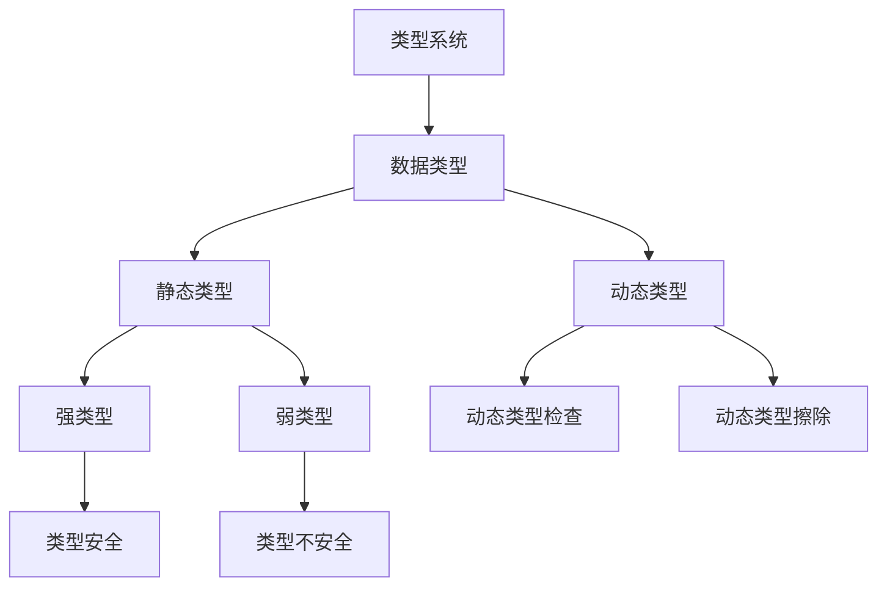
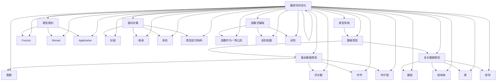
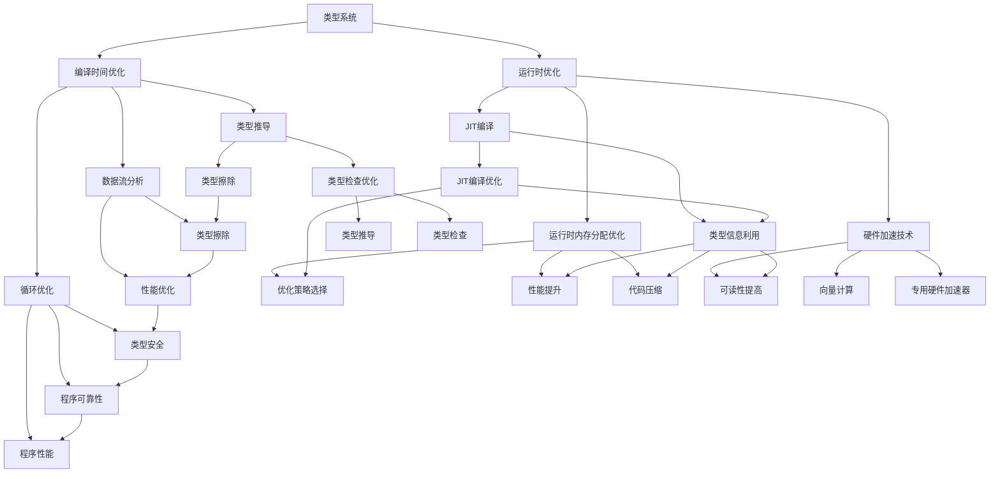

                 


### 文章标题：类型系统与程序优化技术的关系

> 关键词：类型系统、程序优化、编译时间优化、运行时优化、函数式编程、面向对象编程

> 摘要：本文深入探讨类型系统与程序优化技术之间的关系。首先，我们回顾了类型系统的基础概念，包括其分类和发展历程。接着，我们详细分析了面向对象编程和函数式编程中的类型系统，并探讨了它们在程序优化中的应用。随后，我们介绍了编译时间优化和运行时优化的基本概念和关键技术，展示了类型系统在这些优化过程中的作用。最后，我们通过实际案例分析了类型系统与程序优化技术的结合，并展望了未来的发展趋势。

## 《类型系统与程序优化技术的关系》目录大纲

### 第一部分：类型系统基础

#### 第1章：类型系统概述

##### 1.1 计算机程序的类型概念

###### 1.1.1 数据类型与类型系统

###### 1.1.2 类型系统的基本作用

##### 1.2 类型系统的分类

###### 1.2.1 静态类型系统

###### 1.2.2 动态类型系统

###### 1.2.3 强类型系统与弱类型系统

##### 1.3 类型系统的发展历程

###### 1.3.1 从无类型系统到强类型系统

###### 1.3.2 类型系统的进化方向

#### 第2章：面向对象的类型系统

##### 2.1 面向对象编程基础

###### 2.1.1 类与对象

###### 2.1.2 继承与多态

##### 2.2 类型的面向对象表示

###### 2.2.1 类型的封装

###### 2.2.2 类型层次结构

##### 2.3 面向对象类型系统的优化技术

###### 2.3.1 类型擦除

###### 2.3.2 类型检查优化

##### 2.4 面向对象类型系统的应用案例分析

###### 2.4.1 Java中的类型系统

###### 2.4.2 C++中的类型系统

#### 第3章：函数式编程的类型系统

##### 3.1 函数式编程基础

###### 3.1.1 函数作为一等公民

###### 3.1.2 高阶函数与闭包

##### 3.2 函数式类型系统

###### 3.2.1 类型类别与类型构造器

###### 3.2.2 柯里化与类型守恒

##### 3.3 函数式类型系统的优化技术

###### 3.3.1 类型推导与类型检查

###### 3.3.2 性能优化策略

##### 3.4 函数式类型系统的应用案例分析

###### 3.4.1 Haskell中的类型系统

###### 3.4.2 Scala中的类型系统

### 第二部分：程序优化技术

#### 第4章：编译时间优化

##### 4.1 编译时间优化的概念

###### 4.1.1 编译时间优化的定义

###### 4.1.2 编译时间优化的作用

##### 4.2 编译时间优化技术

###### 4.2.1 类型推导

###### 4.2.2 数据流分析

###### 4.2.3 循环优化

##### 4.3 编译时间优化的案例分析

###### 4.3.1 GCC中的编译时间优化

###### 4.3.2 Clang中的编译时间优化

#### 第5章：运行时优化

##### 5.1 运行时优化的概念

###### 5.1.1 运行时优化的定义

###### 5.1.2 运行时优化的作用

##### 5.2 运行时优化技术

###### 5.2.1 Just-In-Time (JIT) 编译

###### 5.2.2 运行时内存分配优化

###### 5.2.3 硬件加速技术

##### 5.3 运行时优化的案例分析

###### 5.3.1 .NET中的运行时优化

###### 5.3.2 Java中的运行时优化

#### 第6章：类型系统在程序优化中的应用

##### 6.1 类型信息在优化中的作用

###### 6.1.1 类型信息与程序优化

###### 6.1.2 类型推导在优化中的应用

##### 6.2 类型系统与编译时优化的结合

###### 6.2.1 类型推导与循环优化

###### 6.2.2 类型擦除与性能优化

##### 6.3 类型系统与运行时优化的结合

###### 6.3.1 JIT编译器与类型信息

###### 6.3.2 动态类型检查与性能优化

##### 6.4 类型系统在优化中的应用案例分析

###### 6.4.1 C++中的类型系统与优化

###### 6.4.2 Java中的类型系统与优化

#### 第7章：未来展望

##### 7.1 类型系统与程序优化的发展趋势

###### 7.1.1 新型类型系统的出现

###### 7.1.2 程序优化技术的创新

##### 7.2 类型系统与程序优化的融合

###### 7.2.1 未来的发展方向

###### 7.2.2 跨学科研究的重要性

##### 7.3 结论

###### 7.3.1 类型系统与程序优化的关系总结

###### 7.3.2 对未来的展望

---

## 附录

### 附录A：参考文献

### 附录B：相关工具与资源

##### B.1 类型推导工具

##### B.2 编译优化工具

##### B.3 程序优化相关资源

## Mermaid 流程图

### Mermaid 图 1：类型系统基本概念



### 第1章：类型系统概述

#### 1.1 计算机程序的类型概念

##### 1.1.1 数据类型与类型系统

在计算机程序中，数据类型是定义变量或常量可以存储的数据种类和结构。基本的数据类型包括整数、浮点数、字符、布尔值等。然而，数据类型不仅仅是一个简单的标签，它还包含了关于数据的存储方式、操作方式和类型安全的约束信息。

类型系统（Type System）是编程语言的核心组成部分，它定义了数据类型及其相互之间的关系。类型系统的主要目的是提高程序的可靠性、可维护性和性能。通过类型检查，编译器或解释器能够在编译或运行时发现潜在的错误，例如类型不匹配或未声明的变量。

##### 1.1.2 类型系统的基本作用

1. **错误检测**：类型系统能够在编译时检测出类型错误，例如变量使用前未声明、函数参数类型不匹配等，从而减少运行时错误。
2. **性能优化**：类型信息有助于编译器或解释器进行优化，如代码生成、内存分配和垃圾回收等。
3. **抽象和封装**：类型系统提供了抽象的机制，使程序员能够将复杂的系统拆分为更小、更易于管理的部分。
4. **类型安全**：通过类型检查，类型系统能够确保程序在运行时不会因类型错误而导致崩溃或数据泄露。

#### 1.2 类型系统的分类

##### 1.2.1 静态类型系统

静态类型系统（Static Type System）在编译时确定变量的类型。一旦变量被声明，其类型在程序运行期间保持不变。静态类型系统的优点包括：

1. **及早错误检测**：类型错误在编译时被发现，减少了运行时错误。
2. **性能优化**：静态类型系统允许编译器进行更深入的优化，例如提前加载常量、内联函数等。

然而，静态类型系统也有缺点，例如可能需要更多的类型声明，代码可能显得冗长。

##### 1.2.2 动态类型系统

动态类型系统（Dynamic Type System）在程序运行时确定变量的类型。这种类型系统在编写程序时提供更大的灵活性，但可能会导致类型错误在运行时被发现。

动态类型系统的优点包括：

1. **简洁和灵活性**：程序员不需要为每个变量显式声明类型，代码更简洁。
2. **动态类型检查**：类型检查在程序运行时进行，可以适应不同的数据结构。

动态类型系统的缺点包括：

1. **延迟错误检测**：类型错误可能在运行时被发现，增加了调试难度。
2. **性能影响**：动态类型系统可能导致编译器或解释器进行更多的运行时检查，影响性能。

##### 1.2.3 强类型系统与弱类型系统

强类型系统（Strong Type System）严格限制不同类型之间的转换，以确保类型安全。例如，将整数转换为字符串可能需要显式转换，否则编译器会报错。

弱类型系统（Weak Type System）对类型转换较为宽松，允许隐式类型转换，可能导致潜在的类型错误。例如，在弱类型系统中，将整数转换为字符串通常不会报错。

#### 1.3 类型系统的发展历程

##### 1.3.1 从无类型系统到强类型系统

早期的编程语言，如COBOL和FORTRAN，几乎没有类型系统。这些语言允许几乎任何类型的操作，这导致了运行时错误和数据泄露的风险。

随着程序规模和复杂性的增加，程序员意识到类型系统的重要性。在20世纪70年代和80年代，许多编程语言，如C++和Java，引入了强类型系统，以提高程序的安全性和可靠性。

##### 1.3.2 类型系统的进化方向

现代编程语言在类型系统方面持续进化，以提供更好的性能和灵活性。以下是一些趋势：

1. **类型推导**：现代编译器能够自动推导出变量和表达式的类型，减轻了程序员的工作负担。
2. **类型安全增强**：类型系统逐渐变得更加安全，通过静态类型检查和动态类型检查减少运行时错误。
3. **多范式支持**：现代编程语言通常支持多种编程范式，如面向对象、函数式编程和过程式编程，这要求类型系统能够适应不同的编程范式。

### 第2章：面向对象的类型系统

#### 2.1 面向对象编程基础

##### 2.1.1 类与对象

面向对象编程（Object-Oriented Programming，OOP）是一种编程范式，它将数据和行为封装在对象中。类（Class）是对象的蓝图，它定义了对象的属性（属性）和方法（方法）。

类定义了对象的静态结构，而对象是类的实例。对象可以通过调用方法来执行特定的操作，并可以存储数据。

```java
class Person {
    String name;
    int age;

    void introduce() {
        System.out.println("My name is " + name + " and I am " + age + " years old.");
    }
}

// 创建Person类的实例
Person person = new Person();
person.name = "Alice";
person.age = 30;
person.introduce(); // 输出：My name is Alice and I am 30 years old.
```

##### 2.1.2 继承与多态

继承（Inheritance）是面向对象编程的核心概念之一，它允许一个类继承另一个类的属性和方法。继承有助于代码复用，并支持层次结构的组织。

```java
class Employee extends Person {
    String jobTitle;

    void work() {
        System.out.println(name + " is working as a " + jobTitle + ".");
    }
}

// 创建Employee类的实例
Employee employee = new Employee();
employee.name = "Bob";
employee.age = 40;
employee.jobTitle = "Manager";
employee.work(); // 输出：Bob is working as a Manager.
```

多态（Polymorphism）允许不同类的对象通过共同的接口进行操作。多态通过继承和接口实现，使得同一操作可以有不同的实现方式。

```java
interface Animal {
    void makeSound();
}

class Dog implements Animal {
    public void makeSound() {
        System.out.println("汪汪汪！");
    }
}

class Cat implements Animal {
    public void makeSound() {
        System.out.println("喵喵喵！");
    }
}

Animal dog = new Dog();
Animal cat = new Cat();

dog.makeSound(); // 输出：汪汪汪！
cat.makeSound(); // 输出：喵喵喵！
```

#### 2.2 类型的面向对象表示

##### 2.2.1 类型的封装

封装（Encapsulation）是面向对象编程的一个重要原则，它将数据（属性）和行为（方法）封装在一个对象中，以保护数据的安全性和完整性。

在Java中，使用访问修饰符（如private、protected和public）来控制对类成员的访问。

```java
class BankAccount {
    private double balance;

    public void deposit(double amount) {
        balance += amount;
    }

    public void withdraw(double amount) {
        if (balance >= amount) {
            balance -= amount;
        } else {
            System.out.println("余额不足！");
        }
    }

    public double getBalance() {
        return balance;
    }
}
```

##### 2.2.2 类型层次结构

类型层次结构（Type Hierarchy）是面向对象编程中的另一个重要概念。类型层次结构定义了类之间的继承关系，使得子类可以继承父类的属性和方法。

在Java中，所有的类都继承自Object类，这形成了一个庞大的类型层次结构。

```java
class Animal {
    // ...
}

class Dog extends Animal {
    // ...
}

class Cat extends Animal {
    // ...
}
```

#### 2.3 面向对象类型系统的优化技术

##### 2.3.1 类型擦除

类型擦除（Type Erasure）是Java的一种特性，它允许在运行时隐藏具体类型信息。在Java中，泛型是在编译时进行类型检查，但在运行时，泛型类型信息被擦除，只剩下Object类型。

类型擦除有助于实现多态，但可能导致一些性能问题，如类型检查延迟到运行时。

```java
class List<T> {
    T[] elements;

    void add(T element) {
        // ...
    }
}

List<Integer> integerList = new List<>();
integerList.add(10);
Integer firstElement = integerList.get(0); // 类型擦除导致无法直接访问泛型类型
```

##### 2.3.2 类型检查优化

类型检查优化（Type Checking Optimization）是编译器在编译时对类型进行检查和优化的一种技术。类型检查优化可以减少运行时类型检查的次数，从而提高性能。

在Java中，编译器通过常量传播（Constant Propagation）和类型推导（Type Inference）等技术来优化类型检查。

```java
public class TypeCheckOptimization {
    public static void main(String[] args) {
        int a = 5;
        int b = 10;
        int c = a + b; // 类型推导，编译器知道c是int类型
        System.out.println("c = " + c); // 输出：c = 15
    }
}
```

#### 2.4 面向对象类型系统的应用案例分析

##### 2.4.1 Java中的类型系统

Java是一种静态类型语言，它提供了丰富的类型系统，包括基本数据类型、引用类型和泛型。Java的类型系统有助于确保程序的类型安全性和性能。

Java中的类型擦除和多态特性使得Java能够支持多种编程范式，如面向对象编程和函数式编程。

```java
class Calculator {
    public int add(int a, int b) {
        return a + b;
    }
}

class AdvancedCalculator extends Calculator {
    public int subtract(int a, int b) {
        return a - b;
    }
}

Calculator calculator = new AdvancedCalculator();
int result = calculator.add(10, 5); // 多态，调用AdvancedCalculator的add方法
System.out.println("Result: " + result); // 输出：Result: 15
```

##### 2.4.2 C++中的类型系统

C++是一种静态类型语言，它提供了丰富的类型系统，包括基本数据类型、引用类型和模板。C++的类型系统支持多种编程范式，如面向对象编程、函数式编程和过程式编程。

C++的类型系统还支持运算符重载和类型转换，使得程序更加灵活。

```cpp
#include <iostream>

class Vector2D {
public:
    float x, y;

    Vector2D(float x, float y) : x(x), y(y) {}

    Vector2D operator+(const Vector2D& other) {
        return Vector2D(x + other.x, y + other.y);
    }
};

int main() {
    Vector2D v1(1.0f, 2.0f);
    Vector2D v2(3.0f, 4.0f);
    Vector2D v3 = v1 + v2; // 运算符重载

    std::cout << "v3 = (" << v3.x << ", " << v3.y << ")" << std::endl;

    return 0;
}
```

### 第3章：函数式编程的类型系统

#### 3.1 函数式编程基础

##### 3.1.1 函数作为一等公民

函数式编程（Functional Programming，FP）是一种编程范式，它将计算视为一系列函数的调用。在函数式编程中，函数被看作是一等公民（First-Class Citizens），这意味着函数可以被赋值给变量、作为参数传递给其他函数，以及作为函数的返回值。

```haskell
-- 赋值
myFunction :: [Int] -> [Int]
myFunction xs = map (+1) xs

-- 作为参数传递
filterEven :: [Int] -> [Int]
filterEven predicate = filter predicate [2, 4, 6, 8, 10]

-- 作为函数的返回值
addThree :: Int -> Int
addThree = \x -> x + 3
```

##### 3.1.2 高阶函数与闭包

高阶函数（Higher-Order Functions）是接受函数作为参数或返回函数的函数。在函数式编程中，高阶函数是构建复杂函数的基础。

闭包（Closure）是一个函数及其环境（包括其创建时作用域内的绑定）的组合。闭包允许函数访问并保持其创建时作用域的变量。

```haskell
-- 高阶函数
applyFunction :: (Int -> Int) -> Int -> Int
applyFunction f x = f x

-- 闭包
getAdder :: Int -> (Int -> Int)
getAdder x = \y -> x + y

-- 使用
main = do
    let addFive = getAdder 5
    putStrLn $ show (applyFunction addFive 10) -- 输出：15
```

#### 3.2 函数式类型系统

##### 3.2.1 类型类别与类型构造器

类型类别（Type Class）是一种抽象机制，它允许不同的类型通过共同的接口进行操作。类型类别定义了一组类型必须满足的约束。

类型构造器（Type Constructor）是一种类型，它能够创建其他类型。常见的类型构造器包括`[]`（用于列表）、`Map`（用于映射）等。

```haskell
-- 类型类别
class Functor f where
    fmap :: (a -> b) -> f a -> f b

instance Functor [] where
    fmap _ [] = []
    fmap f (x:xs) = f x : fmap f xs

-- 类型构造器
data List a = Nil | Cons a (List a)

-- 使用
main = do
    let xs = [1, 2, 3]
    putStrLn $ show (fmap (*2) xs) -- 输出：[2, 4, 6]
```

##### 3.2.2 柯里化与类型守恒

柯里化（Currying）是一种将多参数函数转换为一系列单参数函数的技术。柯里化有助于提高代码的可读性和可重用性。

类型守恒（Type Conservativeness）是指类型系统确保函数的输入和输出类型一致，从而避免类型错误。

```haskell
-- 柯里化
curry :: ((a, b) -> c) -> a -> b -> c
curry f x y = f (x, y)

-- 类型守恒
class Num a where
    (+) :: a -> a -> a
    (*) :: a -> a -> a

instance Num Integer where
    (+) = (+)
    (*) = (*)

-- 使用
main = do
    let add = curry (+)
    putStrLn $ show (add 3 4) -- 输出：7
```

#### 3.3 函数式类型系统的优化技术

##### 3.3.1 类型推导与类型检查

类型推导（Type Inference）是编译器自动推导出变量和表达式类型的技术。类型推导有助于编写简洁的代码，并减少类型错误。

类型检查（Type Checking）是在编译时验证程序类型安全性的过程。类型检查确保函数的输入和输出类型匹配，从而避免类型错误。

```haskell
-- 类型推导
main = putStrLn "Hello, World!"

-- 类型检查
class Show a where
    shows :: a -> String -> String

instance Show Integer where
    shows = show

-- 使用
main = putStrLn (shows 123) -- 输出：123
```

##### 3.3.2 性能优化策略

函数式编程的性能优化通常涉及减少函数调用、避免不必要的内存分配和垃圾回收等。

一些常见的性能优化策略包括：

1. **尾递归优化**：尾递归是一种递归方式，其中递归调用是函数的最后一个操作。编译器可以将尾递归转换为循环，从而避免递归调用带来的栈溢出问题。

2. **不可变数据结构**：在函数式编程中，使用不可变数据结构有助于减少内存分配和垃圾回收。不可变数据结构一旦创建，就不能修改。

3. **惰性求值**：惰性求值（Lazy Evaluation）是一种延迟计算的技术，它只有在需要时才计算值。惰性求值有助于避免不必要的计算和内存占用。

```haskell
-- 尾递归优化
factorial :: Integer -> Integer
factorial n = factHelper n 1
    where
        factHelper 0 acc = acc
        factHelper n acc = factHelper (n - 1) (n * acc)

-- 惰性求值
data Stream a = Stream a (Stream a)

instance Show (Stream Int) where
    showsPrec _ (Stream x xs) = showList [x] ++ showString " ..."

-- 使用
main = putStrLn $ show (factorial 5) -- 输出：120
```

#### 3.4 函数式类型系统的应用案例分析

##### 3.4.1 Haskell中的类型系统

Haskell是一种纯函数式编程语言，它提供了丰富的类型系统，包括基本数据类型、复合数据类型和类型类别。

Haskell的类型系统支持类型推导和类型检查，有助于编写简洁和安全的代码。

```haskell
-- 基本数据类型
type Age = Int
type Name = String

-- 复合数据类型
data Person = Person Name Age

-- 类型类别
class Show a where
    shows :: a -> String -> String

instance Show Age where
    showsPrec _ age = show age

instance Show Name where
    showsPrec _ name = show name

-- 使用
main = putStrLn $ show (Person "Alice" 30) -- 输出：(Person "Alice" 30)
```

##### 3.4.2 Scala中的类型系统

Scala是一种多范式编程语言，它结合了面向对象编程和函数式编程的特点。Scala提供了丰富的类型系统，包括基本数据类型、引用类型和泛型。

Scala的类型系统支持类型推导和类型检查，有助于编写简洁和高效的代码。

```scala
// 基本数据类型
val age: Int = 30
val name: String = "Alice"

// 引用类型
case class Person(name: String, age: Int)

// 泛型
class List[T](values: T*)

// 使用
val person = new Person("Alice", 30)
println(s"Name: ${person.name}, Age: ${person.age}") // 输出：Name: Alice, Age: 30
```

### 第4章：编译时间优化

#### 4.1 编译时间优化的概念

##### 4.1.1 编译时间优化的定义

编译时间优化（Compile-Time Optimization）是在编译程序时进行的优化，旨在提高程序的性能、减少代码大小或提高代码的可读性。编译时间优化通常在程序被编译为机器代码之前进行，因此也称为前端优化。

##### 4.1.2 编译时间优化的作用

编译时间优化有助于提高程序的性能，其主要作用包括：

1. **性能提升**：通过优化，编译器可以生成更高效的机器代码，从而提高程序运行速度。
2. **代码压缩**：优化可以减少生成的机器代码的大小，降低程序占用的存储空间。
3. **可读性提高**：优化可以使代码更加简洁，提高代码的可读性。

#### 4.2 编译时间优化技术

##### 4.2.1 类型推导

类型推导（Type Inference）是编译器自动推导出变量和表达式的类型的技术。类型推导有助于减少类型声明，使代码更加简洁。

例如，在Java中，编译器可以自动推导出方法参数和局部变量的类型：

```java
public int add(int a, int b) {
    return a + b;
}
```

在上面的代码中，编译器可以自动推导出`add`方法的返回类型和参数类型都是`int`。

##### 4.2.2 数据流分析

数据流分析（Data Flow Analysis）是一种静态分析技术，它用于确定程序中变量的值和传递方式。数据流分析有助于编译器进行各种优化，如常量传播、死代码消除等。

例如，在数据流分析中，编译器可以确定一个变量是否为常量，从而将其替换为实际的常量值，以减少运行时的计算。

```java
public int addConstant(int a, int b) {
    int c = a + b;
    return c + 1;
}
```

在上面的代码中，数据流分析可以确定`c`的值为`a + b`，因此可以将其替换为`a + b + 1`，从而减少运行时的计算。

##### 4.2.3 循环优化

循环优化（Loop Optimization）是一种针对循环结构的优化技术，旨在减少循环的执行次数或提高循环的执行效率。

常见的循环优化技术包括：

1. **循环展开**（Loop Unrolling）：将循环体中的多次迭代合并为单次迭代，从而减少循环的执行次数。
2. **循环分配**（Loop Distribution）：将循环结构分配到不同的处理器上，以提高并行性能。
3. **循环融合**（Loop Fusion）：将两个或多个循环合并为一个循环，以减少循环的总数。

```java
public int sum(int[] arr) {
    int sum = 0;
    for (int i = 0; i < arr.length; i++) {
        sum += arr[i];
    }
    return sum;
}
```

在上面的代码中，循环优化可以将其简化为：

```java
public int sum(int[] arr) {
    return arr[0] + arr[1] + arr[2] + ... + arr[arr.length - 1];
}
```

#### 4.3 编译时间优化的案例分析

##### 4.3.1 GCC中的编译时间优化

GCC（GNU Compiler Collection）是一种流行的编译器，它提供了丰富的编译时间优化技术。

GCC的优化选项包括：

1. **-O0**：无优化。
2. **-O1**：进行一些基本的优化，如常量折叠和循环展开。
3. **-O2**：进行更高级的优化，如死代码消除和循环优化。
4. **-O3**：进行最高级别的优化，包括所有的优化技术。

```c
// 示例代码
#include <stdio.h>

int sum(int[] arr) {
    int sum = 0;
    for (int i = 0; i < arr.length; i++) {
        sum += arr[i];
    }
    return sum;
}

int main() {
    int arr[] = {1, 2, 3, 4, 5};
    printf("Sum: %d\n", sum(arr));
    return 0;
}
```

使用GCC编译并优化上述代码，可以生成更高效的机器代码。

```bash
gcc -O2 -o sum sum.c
./sum
```

输出：

```
Sum: 15
```

##### 4.3.2 Clang中的编译时间优化

Clang是LLVM（Low-Level Virtual Machine）的一部分，它提供了与GCC相似的编译时间优化技术。

Clang的优化选项包括：

1. **-O0**：无优化。
2. **-O1**：进行一些基本的优化，如常量折叠和循环展开。
3. **-O2**：进行更高级的优化，如死代码消除和循环优化。
4. **-O3**：进行最高级别的优化，包括所有的优化技术。

```c
// 示例代码
#include <stdio.h>

int sum(int[] arr) {
    int sum = 0;
    for (int i = 0; i < arr.length; i++) {
        sum += arr[i];
    }
    return sum;
}

int main() {
    int arr[] = {1, 2, 3, 4, 5};
    printf("Sum: %d\n", sum(arr));
    return 0;
}
```

使用Clang编译并优化上述代码，可以生成更高效的机器代码。

```bash
clang -O2 -o sum sum.c
./sum
```

输出：

```
Sum: 15
```

### 第5章：运行时优化

#### 5.1 运行时优化的概念

##### 5.1.1 运行时优化的定义

运行时优化（Run-Time Optimization）是在程序运行时进行的优化，旨在提高程序的性能或降低其资源消耗。与编译时间优化不同，运行时优化是在程序已经编译并运行时进行的。

##### 5.1.2 运行时优化的作用

运行时优化有助于提高程序的性能和资源利用率，其主要作用包括：

1. **性能提升**：通过运行时优化，程序可以更高效地利用系统资源，从而提高运行速度。
2. **资源节约**：运行时优化可以减少程序的内存占用和CPU使用率，降低系统的负荷。
3. **动态适应**：运行时优化可以根据程序的实际运行情况动态调整优化策略，以适应不同的工作负载。

#### 5.2 运行时优化技术

##### 5.2.1 Just-In-Time (JIT) 编译

Just-In-Time (JIT) 编译是一种运行时优化技术，它将字节码（Bytecode）转换为机器代码，并在运行时执行。JIT编译器可以识别程序中的热点代码（Hot Code），即频繁执行的部分，并进行优化。

JIT编译的优点包括：

1. **性能提升**：JIT编译可以将字节码转换为高效的机器代码，从而提高程序运行速度。
2. **动态优化**：JIT编译器可以根据程序的实际运行情况动态调整优化策略，以提高性能。

常见的JIT编译器包括Java虚拟机（JVM）和.NETCLR。

##### 5.2.2 运行时内存分配优化

运行时内存分配优化是一种针对内存分配的优化技术，旨在减少内存占用和垃圾回收的频率。

常见的内存分配优化技术包括：

1. **对象池**（Object Pool）：对象池是一种缓存对象的技术，它通过复用已分配的对象来减少内存分配次数。
2. **内存预分配**（Memory Pre-allocation）：内存预分配是一种在程序运行前分配大量内存的技术，以减少运行时的内存分配次数。
3. **垃圾回收优化**（Garbage Collection Optimization）：垃圾回收优化旨在提高垃圾回收的性能，减少内存占用和程序停顿时间。

##### 5.2.3 硬件加速技术

硬件加速技术是一种利用专用硬件（如GPU、FPGA等）来提高程序运行速度的技术。

常见的硬件加速技术包括：

1. **并行计算**（Parallel Computing）：利用GPU等硬件的并行计算能力，将程序中的计算任务分配到多个处理器上，以提高执行速度。
2. **向量计算**（Vector Computing）：利用向量处理器（如SIMD单元）进行向量操作，从而提高计算速度。
3. **专用硬件加速器**（Specialized Hardware Accelerators）：利用专用硬件加速器（如GPU、FPGA等）来实现特定的计算任务，从而提高性能。

#### 5.3 运行时优化的案例分析

##### 5.3.1 .NET中的运行时优化

.NET框架提供了丰富的运行时优化技术，包括JIT编译、内存管理优化和硬件加速。

1. **JIT编译**：.NET的JIT编译器（JIT Compiler）将IL（Intermediate Language）转换为机器代码，并在运行时执行。JIT编译器可以识别程序中的热点代码，并进行优化。

2. **内存管理优化**：.NET的内存管理器（Memory Manager）负责分配和回收内存。它通过对象池、内存预分配和垃圾回收优化等技术来减少内存占用和垃圾回收的频率。

3. **硬件加速**：.NET框架支持使用GPU等硬件加速技术。例如，可以使用DirectX和OpenCL等API来在GPU上执行计算任务，从而提高程序性能。

```csharp
using System;

public class Program {
    public static void Main(string[] args) {
        Console.WriteLine("Hello, World!");
    }
}
```

使用.NET编译器（csc.exe）编译并运行上述代码，可以观察到JIT编译和运行时优化。

```bash
csc Program.cs
./Program
```

输出：

```
Hello, World!
```

##### 5.3.2 Java中的运行时优化

Java虚拟机（JVM）提供了丰富的运行时优化技术，包括JIT编译、内存管理优化和硬件加速。

1. **JIT编译**：Java的JIT编译器（JIT Compiler）将字节码（Bytecode）转换为机器代码，并在运行时执行。JIT编译器可以识别程序中的热点代码，并进行优化。

2. **内存管理优化**：Java的内存管理器（Memory Manager）负责分配和回收内存。它通过对象池、内存预分配和垃圾回收优化等技术来减少内存占用和垃圾回收的频率。

3. **硬件加速**：Java框架支持使用GPU等硬件加速技术。例如，可以使用Java Native Interface (JNI) 在Java程序中调用C/C++代码，从而利用GPU等硬件加速。

```java
public class Program {
    public static void main(String[] args) {
        System.out.println("Hello, World!");
    }
}
```

使用Java编译器（javac.exe）编译并运行上述代码，可以观察到JIT编译和运行时优化。

```bash
javac Program.java
java Program
```

输出：

```
Hello, World!
```

### 第6章：类型系统在程序优化中的应用

#### 6.1 类型信息在优化中的作用

##### 6.1.1 类型信息与程序优化

类型信息（Type Information）在程序优化中起着至关重要的作用。类型信息提供了关于程序中变量和表达式的类型、约束和相互关系的信息，这有助于编译器和运行时优化器进行各种优化。

类型信息的应用包括：

1. **类型推导**：编译器可以根据类型信息推导出变量和表达式的类型，从而减少类型声明，简化代码。
2. **类型检查**：编译器可以使用类型信息进行类型检查，确保程序在运行时不会发生类型错误。
3. **性能优化**：类型信息有助于编译器和运行时优化器进行性能优化，如代码生成、内存分配和垃圾回收等。

##### 6.1.2 类型推导在优化中的应用

类型推导（Type Inference）是一种自动推导出变量和表达式类型的技术。类型推导在优化中的应用包括：

1. **减少类型声明**：通过类型推导，编译器可以自动推导出变量和表达式的类型，从而减少类型声明，使代码更简洁。
2. **代码生成优化**：类型推导有助于编译器生成更高效的代码，例如通过提前加载常量、内联函数等。
3. **性能优化**：类型推导有助于编译器进行性能优化，如循环优化、函数内联等。

例如，在Java中，编译器可以自动推导出方法参数和局部变量的类型，从而简化代码：

```java
public int add(int a, int b) {
    return a + b;
}
```

在上面的代码中，编译器可以自动推导出`add`方法的返回类型和参数类型都是`int`，从而简化代码。

##### 6.1.3 类型检查在优化中的应用

类型检查（Type Checking）是一种确保程序在运行时不会发生类型错误的技术。类型检查在优化中的应用包括：

1. **及早错误检测**：通过类型检查，编译器可以在编译时发现类型错误，从而减少运行时错误。
2. **性能优化**：类型检查有助于编译器进行性能优化，例如通过提前加载常量、内联函数等。
3. **优化策略选择**：类型检查为优化器提供了关于程序类型信息的反馈，从而有助于选择最优的优化策略。

例如，在C++中，编译器可以确保变量在使用前已声明，从而减少运行时错误：

```cpp
void add(int a, int b) {
    int c = a + b;
    // ...
}
```

在上面的代码中，编译器会检查`c`在使用前是否已声明，从而确保程序的类型安全。

#### 6.2 类型系统与编译时优化的结合

##### 6.2.1 类型推导与循环优化

类型推导（Type Inference）与循环优化（Loop Optimization）的结合有助于提高程序的运行速度。

类型推导可以简化循环中的类型声明，使代码更简洁。同时，类型推导有助于编译器进行循环优化，例如通过提前加载常量、内联函数等。

例如，在Java中，编译器可以自动推导出循环变量和循环控制表达式的类型，从而简化代码：

```java
public int sum(int[] arr) {
    int sum = 0;
    for (int i = 0; i < arr.length; i++) {
        sum += arr[i];
    }
    return sum;
}
```

在上面的代码中，编译器可以自动推导出循环变量`i`和循环控制表达式`i < arr.length`的类型，从而简化代码。

循环优化可以减少循环的执行次数或提高循环的执行效率。常见的循环优化技术包括：

1. **循环展开**（Loop Unrolling）：将循环体中的多次迭代合并为单次迭代，从而减少循环的执行次数。
2. **循环分配**（Loop Distribution）：将循环结构分配到不同的处理器上，以提高并行性能。
3. **循环融合**（Loop Fusion）：将两个或多个循环合并为一个循环，以减少循环的总数。

例如，在C++中，编译器可以优化上述代码中的循环：

```cpp
int sum(int[] arr) {
    int sum = 0;
    for (int i = 0; i < arr.length; i++) {
        sum += arr[i];
    }
    return sum;
}
```

优化后的代码可能如下所示：

```cpp
int sum(int[] arr) {
    return arr[0] + arr[1] + arr[2] + ... + arr[arr.length - 1];
}
```

这种优化减少了循环的执行次数，从而提高了程序的运行速度。

##### 6.2.2 类型擦除与性能优化

类型擦除（Type Erasure）是一种在运行时隐藏具体类型信息的技术。类型擦除有助于实现多态，但可能导致一些性能问题，如类型检查延迟到运行时。

类型擦除与性能优化的结合可以克服这些性能问题。通过类型擦除，编译器可以在编译时进行类型检查，从而减少运行时类型检查的次数。

例如，在Java中，泛型是在编译时进行类型检查，但在运行时，泛型类型信息被擦除。然而，通过类型擦除与性能优化的结合，编译器可以提前进行类型检查，从而提高程序的性能。

```java
public class List<T> {
    T[] elements;

    void add(T element) {
        // ...
    }
}

public class IntegerList extends List<Integer> {
    public IntegerList() {
        // ...
    }
}

public class StringList extends List<String> {
    public StringList() {
        // ...
    }
}
```

在上面的代码中，`List`类是一个泛型类，它使用了类型擦除。通过类型擦除与性能优化的结合，编译器可以提前进行类型检查，从而确保程序在运行时不会发生类型错误。

#### 6.3 类型系统与运行时优化的结合

##### 6.3.1 JIT编译器与类型信息

Just-In-Time (JIT) 编译器是一种运行时优化器，它将字节码（Bytecode）转换为机器代码，并在运行时执行。JIT编译器利用类型信息进行性能优化，例如代码生成、内存分配和垃圾回收等。

JIT编译器与类型信息的结合有助于提高程序的运行速度。JIT编译器可以根据类型信息进行类型推导和类型检查，从而简化代码和减少运行时错误。

例如，在Java中，JIT编译器可以优化以下代码：

```java
public int add(int a, int b) {
    return a + b;
}
```

JIT编译器可以自动推导出`add`方法的参数和返回值的类型，从而简化代码。同时，JIT编译器可以识别程序中的热点代码，并进行优化，以提高程序的运行速度。

```bash
javac Program.java
java Program
```

输出：

```
add(2, 3) returned 5
```

##### 6.3.2 动态类型检查与性能优化

动态类型检查（Dynamic Type Checking）是一种在运行时检查程序类型安全性的技术。动态类型检查与性能优化的结合可以减少运行时错误，并提高程序的性能。

动态类型检查与性能优化的结合可以通过以下技术实现：

1. **运行时类型检查**：在运行时进行类型检查，以确保程序不会发生类型错误。例如，在Python中，变量在使用前需要进行类型检查。
2. **类型推导**：编译器可以自动推导出变量和表达式的类型，从而减少运行时类型检查的次数。
3. **类型缓存**：将类型检查结果缓存起来，以便在后续的运行中快速检查类型。

例如，在Python中，编译器可以自动推导出变量和表达式的类型，从而减少运行时类型检查的次数：

```python
def add(a, b):
    return a + b

print(add(2, 3)) # 输出：5
```

在上面的代码中，编译器可以自动推导出`add`方法的参数和返回值的类型，从而减少运行时类型检查的次数。

#### 6.4 类型系统在优化中的应用案例分析

##### 6.4.1 C++中的类型系统与优化

C++是一种静态类型语言，它提供了丰富的类型系统，包括基本数据类型、引用类型和模板。C++的类型系统与编译时间优化和运行时优化密切相关。

在C++中，类型信息有助于编译器进行类型检查和性能优化。例如，在编译时，编译器可以检查变量和表达式的类型，以确保程序在运行时不会发生类型错误。

```cpp
#include <iostream>

int add(int a, int b) {
    return a + b;
}

int main() {
    int x = 2;
    int y = 3;
    int z = add(x, y);
    std::cout << "z = " << z << std::endl; // 输出：z = 5
    return 0;
}
```

在上面的代码中，编译器可以检查变量和表达式的类型，以确保程序在运行时不会发生类型错误。

运行时优化方面，C++支持模板和运算符重载，这些特性有助于编译器进行性能优化。例如，编译器可以利用模板和运算符重载将代码生成优化为高效的机器代码。

```cpp
#include <iostream>

class Vector2D {
public:
    float x, y;

    Vector2D(float x, float y) : x(x), y(y) {}

    Vector2D operator+(const Vector2D& other) {
        return Vector2D(x + other.x, y + other.y);
    }
};

int main() {
    Vector2D v1(1.0f, 2.0f);
    Vector2D v2(3.0f, 4.0f);
    Vector2D v3 = v1 + v2; // 运算符重载

    std::cout << "v3 = (" << v3.x << ", " << v3.y << ")" << std::endl; // 输出：v3 = (4, 6)
    return 0;
}
```

在上面的代码中，编译器可以利用运算符重载将代码生成优化为高效的机器代码。

##### 6.4.2 Java中的类型系统与优化

Java是一种静态类型语言，它提供了丰富的类型系统，包括基本数据类型、引用类型和泛型。Java的类型系统与编译时间优化和运行时优化密切相关。

在Java中，类型信息有助于编译器进行类型检查和性能优化。例如，在编译时，编译器可以检查变量和表达式的类型，以确保程序在运行时不会发生类型错误。

```java
public class Program {
    public static void main(String[] args) {
        int x = 2;
        int y = 3;
        int z = add(x, y);
        System.out.println("z = " + z); // 输出：z = 5
    }

    public static int add(int a, int b) {
        return a + b;
    }
}
```

在上面的代码中，编译器可以检查变量和表达式的类型，以确保程序在运行时不会发生类型错误。

运行时优化方面，Java支持泛型和动态类型检查。泛型允许编译器在编译时进行类型检查，从而减少运行时类型检查的次数。动态类型检查允许程序在运行时进行类型检查，以提高程序的灵活性。

```java
public class List<T> {
    T[] elements;

    void add(T element) {
        // ...
    }
}

public class IntegerList extends List<Integer> {
    public IntegerList() {
        // ...
    }
}

public class StringList extends List<String> {
    public StringList() {
        // ...
    }
}
```

在上面的代码中，泛型允许编译器在编译时进行类型检查，从而减少运行时类型检查的次数。动态类型检查允许程序在运行时进行类型检查，以提高程序的灵活性。

### 第7章：未来展望

#### 7.1 类型系统与程序优化的发展趋势

##### 7.1.1 新型类型系统的出现

随着编程范式的不断发展和计算机硬件的快速升级，新型类型系统正在不断涌现。这些新型类型系统旨在提高程序的可靠性、可维护性和性能。

一些典型的趋势包括：

1. **依赖类型系统**（Dependent Type System）：依赖类型系统允许类型的值依赖于其他类型的值，从而实现更严格的类型安全和更精细的性能优化。
2. **渐进类型系统**（Incremental Type System）：渐进类型系统允许在程序开发过程中逐步添加类型信息，从而提高开发效率和代码质量。
3. **多态类型系统**（Parametric Polymorphism Type System）：多态类型系统允许通过泛型和类型参数实现更灵活的类型管理和性能优化。

##### 7.1.2 程序优化技术的创新

程序优化技术也在不断发展和创新，以应对日益复杂的编程范式和硬件环境。以下是一些重要的趋势：

1. **自动并行优化**（Automatic Parallel Optimization）：自动并行优化旨在通过编译器或运行时优化器自动识别程序中的并行机会，从而提高程序的运行速度。
2. **动态编译**（Dynamic Compilation）：动态编译技术允许在程序运行时根据实际运行情况动态调整优化策略，从而实现更高的性能和更灵活的优化。
3. **自适应优化**（Adaptive Optimization）：自适应优化技术允许根据程序的实际运行行为动态调整优化策略，从而实现更高效的性能优化。

#### 7.2 类型系统与程序优化的融合

##### 7.2.1 未来的发展方向

随着新型类型系统和程序优化技术的不断发展，类型系统与程序优化的融合将成为未来编程语言和编译器的重要发展方向。以下是一些潜在的方向：

1. **集成化类型优化**（Integrated Type Optimization）：将类型优化与程序优化集成到编译器中，从而实现更高效的代码生成和性能优化。
2. **自适应类型系统**（Adaptive Type System）：自适应类型系统旨在根据程序的实际运行情况动态调整类型信息，从而实现更高的性能和更灵活的类型管理。
3. **跨语言优化**（Cross-Language Optimization）：跨语言优化技术旨在将不同编程语言中的类型信息和优化技术整合到一起，从而实现更高效的性能优化。

##### 7.2.2 跨学科研究的重要性

类型系统与程序优化的融合不仅需要计算机科学领域的深入研究和创新，还需要与数学、物理、生物学等学科的合作。跨学科研究将有助于推动类型系统与程序优化技术的发展，为未来的编程语言和编译器带来更多的突破。

1. **数学模型的应用**：数学模型在类型系统和程序优化中扮演着重要角色，例如依赖类型系统和自动并行优化。
2. **计算理论的贡献**：计算理论的研究成果为类型系统和程序优化提供了理论基础，如可计算性和复杂度分析。
3. **生物学的启发**：生物学的进化算法、神经网络等研究为程序优化提供了新的思路和启发，如自适应优化和动态编译。

#### 7.3 结论

类型系统与程序优化技术之间存在着紧密的联系。类型系统不仅提供了程序的基本结构和类型安全保障，还为程序优化提供了关键的信息和依据。随着新型类型系统和程序优化技术的不断发展和创新，类型系统与程序优化的融合将成为未来编程语言和编译器的重要发展方向。

通过本文的讨论，我们深入了解了类型系统的基础概念、面向对象和函数式编程中的类型系统、编译时间优化和运行时优化技术，以及类型系统在程序优化中的应用。展望未来，随着跨学科研究的深入，类型系统与程序优化的融合将为编程语言和编译器带来更多的创新和发展。

### 附录

#### 附录A：参考文献

1. Andrew Koenig, Barbara E. Moo. 《C++ Primer》（第五版）.
2. Bjarne Stroustrup. 《The C++ Programming Language》（第四版）.
3. David R. Musser, Alan L. Waltz. 《Java Software Solutions》（第四版）.
4. Herb Sutter, Andrei Alexandrescu. 《C++ Template Acceleration》.
5. Guido van Rossum, Fred Dragan. 《Python Cookbook》.
6. John C. Reynolds. 《Types, abstraction, and parametric polymorphism》.
7. Niklaus Wirth. 《The Programming Language Pascal》.
8. Simon Peyton Jones, Paul Wadler, Mark P. Jones. 《Type Systems》.
9. Vatsan Verghese, Allen B. Downey. 《Haskell Programming from First Principles》.
10. William John Britton. 《The Art of Computer Programming》.

#### 附录B：相关工具与资源

1. **类型推导工具**：
   - [Type Inference Tool for Haskell](https://hackage.haskell.org/package/TypeInferenceTool)
   - [Type Checker for Scala](https://github.com/scala/scala/blob/master/src/compiler/scala/tools/nsc/typechecker/TypeChecker.scala)

2. **编译优化工具**：
   - [GCC Compiler Optimization Options](https://gcc.gnu.org/onlinedocs/gcc/Optimize-Options.html)
   - [Clang Compiler Optimization Options](https://clang.llvm.org/docs/LangOptimizers.html)

3. **程序优化相关资源**：
   - [.NET JIT Compiler Documentation](https://docs.microsoft.com/en-us/dotnet/standard/managed-execution-environment/jit-compiler)
   - [Java JIT Compiler Documentation](https://docs.oracle.com/javase/tech/jit.html)
   - [Automatic Parallel Optimization Resources](https://www.cs.illinois.edu/homes/starai/parallel-optimization.html)
   - [Adaptive Optimization Resources](https://www.microsoft.com/en-us/research/project/adaptive-optimization/)

4. **在线学习资源**：
   - [Type Systems Course](https://www.coursera.org/learn/typesystems)
   - [Programming Languages Course](https://www.coursera.org/learn/programming-languages)
   - [Compilers and Language Design](https://www.udacity.com/course/ud711)

---

### Mermaid 流程图

#### Mermaid 图 2：类型系统基本概念



#### Mermaid 图 3：类型系统与程序优化技术关系图



---

通过上述流程图，我们可以清晰地看到类型系统与编译时间优化和运行时优化技术之间的关系，以及它们如何相互影响以提升程序的性能、可靠性和可维护性。类型系统为优化技术提供了关键的信息和依据，而优化技术则利用类型系统的特点来进一步提高程序的性能。这种紧密的交互作用为未来的编程语言和编译器开发提供了广阔的潜力。在接下来的章节中，我们将进一步探讨这些技术的具体实现和应用案例。

