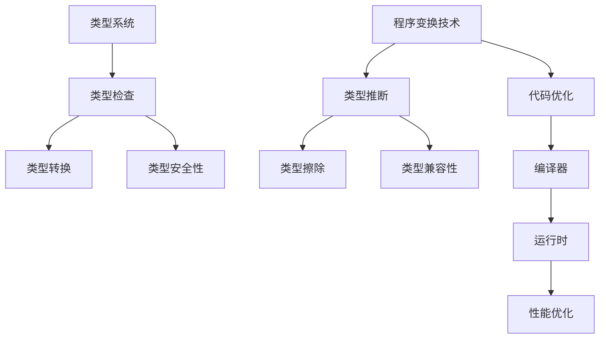

                 


### 文章标题

# 《类型系统与程序变换技术的关系》

### 文章关键词

- 类型系统
- 程序变换
- 编程语言
- 编译原理
- 软件工程

### 文章摘要

本文探讨了类型系统与程序变换技术在编程语言和软件工程中的应用和关系。类型系统是编程语言的核心组成部分，负责定义变量和函数的属性，而程序变换技术则通过变换规则对程序进行优化和转换。本文将详细介绍类型系统的概念、分类及其在编程语言中的应用，解释程序变换技术的定义、分类及其与类型系统的关系。通过实例分析和实践应用，本文揭示了类型系统与程序变换技术在软件开发中的重要性，并为未来研究提供了方向。

---

### 引言

在计算机科学领域，类型系统和程序变换技术是两个核心概念，它们在编程语言设计和软件工程中发挥着重要作用。类型系统负责定义变量、函数和其他程序实体的属性，确保程序的正确性和高效性。而程序变换技术则通过一系列规则和算法，对程序进行优化、转换和重构，以提高程序的执行效率和可维护性。

类型系统的研究可以追溯到早期编程语言的设计，如Fortran和COBOL。这些语言引入了基本类型（如整数、浮点数、字符等）和复合类型（如数组、结构体、类等），为程序提供了丰富的数据表示方式。类型系统的核心在于类型的约束和类型检查，它确保程序在运行时能够正确执行，避免了类型错误和未定义行为。

程序变换技术的起源可以追溯到编译器设计和程序优化领域。编译器将高级语言程序转换为机器代码，这一过程中需要进行大量的程序变换，如语法分析、语义分析、代码生成和优化。程序变换技术的目标是提高程序的性能和可维护性，通过变换规则和算法，消除冗余代码、优化数据访问和循环结构、减少编译时间和内存占用。

本文旨在探讨类型系统与程序变换技术之间的关系，分析它们在编程语言和软件工程中的应用和影响。首先，我们将详细介绍类型系统的基本概念、分类及其在编程语言中的应用。然后，我们将探讨程序变换技术的定义、分类及其与类型系统的关系。最后，通过实例分析和实践应用，我们将揭示类型系统与程序变换技术在软件开发中的重要性，并展望未来的研究方向。

### 类型系统概述

#### 类型系统的定义

类型系统是编程语言的核心组成部分，负责定义变量、函数和其他程序实体的属性。类型系统通过定义数据类型、操作符和表达式，为程序提供了数据表示和操作方式。类型系统的核心作用是确保程序的正确性和高效性，通过类型约束和类型检查，避免类型错误和未定义行为。

在编程语言中，类型系统可以分为基本类型和复合类型。基本类型是语言内置的数据类型，如整数、浮点数、字符等。复合类型是由基本类型组合而成的数据结构，如数组、结构体、类等。基本类型和复合类型共同构成了类型系统的核心框架。

#### 关键概念

1. **类型约束**：类型约束是指程序实体必须具有特定类型的限制。类型约束可以确保程序在编译时或运行时能够正确执行，避免类型错误和未定义行为。例如，在C语言中，变量必须具有明确的数据类型，不能将浮点数赋值给整数类型。

2. **类型检查**：类型检查是指编译器在编译程序时，对变量、表达式和函数的属性进行验证。类型检查可以分为静态类型检查和动态类型检查。静态类型检查在编译时进行，通过检查代码结构和类型约束来确保程序的正确性。动态类型检查在运行时进行，通过运行时类型信息来验证程序的正确性。

3. **类型转换**：类型转换是指将一个数据类型转换为另一个数据类型的过程。类型转换可以分为自动类型转换和显式类型转换。自动类型转换是指编译器在编译程序时自动进行的类型转换，以保持程序的正确性。显式类型转换是指程序员在代码中显式指定类型转换，以实现特定的功能。

4. **类型多态**：类型多态是指程序实体可以根据不同的数据类型执行不同的操作。类型多态可以分为参数多态和包含多态。参数多态通过函数和接口的泛型来实现，使得同一个函数可以处理不同的数据类型。包含多态通过继承和多态来实现，使得子类可以重写父类的方法，实现不同的行为。

#### 类型系统的分类

类型系统可以根据不同的分类标准进行分类，常见的分类方式包括：

1. **静态类型系统与动态类型系统**：静态类型系统在编译时对程序进行类型检查，确保程序的正确性。动态类型系统在运行时对程序进行类型检查，通过运行时类型信息来验证程序的正确性。静态类型系统的优点是能够提高程序的运行效率和编译器的优化能力，缺点是增加了编译时间和代码复杂度。动态类型系统的优点是提高了程序的灵活性和可读性，缺点是降低了程序的运行效率和可维护性。

2. **多态类型系统**：多态类型系统支持参数多态和包含多态。参数多态通过函数和接口的泛型来实现，使得同一个函数可以处理不同的数据类型。包含多态通过继承和多态来实现，使得子类可以重写父类的方法，实现不同的行为。多态类型系统的优点是提高了程序的灵活性和可维护性，缺点是增加了程序的复杂度和运行时开销。

3. **静态类型系统与动态类型系统的结合**：静态类型系统和动态类型系统可以结合起来，以实现最佳的性能和灵活性。这种结合方式可以在编译时进行静态类型检查，确保程序的正确性，同时允许运行时进行动态类型检查，以提高程序的灵活性和可维护性。

#### 小结

类型系统是编程语言的核心组成部分，通过定义数据类型、操作符和表达式，为程序提供了数据表示和操作方式。类型系统的核心作用是确保程序的正确性和高效性，通过类型约束和类型检查，避免类型错误和未定义行为。类型系统可以分为基本类型和复合类型，可以分为静态类型系统与动态类型系统，也可以结合静态类型系统与动态类型系统。类型系统的分类和特性对编程语言的设计和性能具有重要影响。

### 程序变换技术概述

#### 程序变换技术的定义

程序变换技术是指通过对程序进行一系列变换，以提高程序的性能、可维护性和可读性的方法。程序变换技术包括多种变换规则和算法，如语法变换、语义变换、数据流变换等。程序变换技术在编译器设计和程序优化中具有重要应用，通过变换规则和算法，可以消除冗余代码、优化数据访问和循环结构、减少编译时间和内存占用。

#### 关键概念

1. **变换规则**：变换规则是指对程序进行变换的规则集合。变换规则定义了程序在不同阶段的表示方式，以及如何从一种表示方式转换为另一种表示方式。常见的变换规则包括语法分析、语义分析、代码生成和优化等。

2. **程序优化**：程序优化是指通过变换规则和算法，提高程序的性能和效率的方法。程序优化可以分为局部优化和全局优化。局部优化关注程序的局部结构和执行路径，如循环优化、分支优化、函数内联等。全局优化关注程序的整体结构和数据访问模式，如代码重排、数据压缩、内存优化等。

3. **编译原理**：编译原理是指编译器的工作原理和流程。编译器将高级语言程序转换为机器代码，这一过程中需要进行大量的程序变换，如语法分析、语义分析、代码生成和优化等。编译原理是程序变换技术的重要基础。

4. **变换序列**：变换序列是指程序变换过程中的一系列变换。变换序列可以是顺序执行，也可以是并行执行。变换序列的设计和优化对程序变换的效果和性能具有重要影响。

#### 程序变换技术的分类

程序变换技术可以根据不同的分类标准进行分类，常见的分类方式包括：

1. **语法变换**：语法变换是指对程序语法结构的变换，如语法分析、语法解析、抽象语法树（AST）转换等。语法变换关注程序的语法结构和语义表示，通过变换规则和算法，可以消除语法错误、简化程序结构、提高程序的可读性。

2. **语义变换**：语义变换是指对程序语义表示的变换，如语义分析、类型检查、程序优化等。语义变换关注程序的语义表示和执行行为，通过变换规则和算法，可以优化程序的性能、提高程序的可维护性、减少程序的运行时错误。

3. **数据流变换**：数据流变换是指对程序数据流分析的变换，如数据依赖分析、数据流方程求解、数据流优化等。数据流变换关注程序的数据流动和依赖关系，通过变换规则和算法，可以优化数据访问、减少冗余计算、提高程序的运行效率。

4. **程序优化技术**：程序优化技术是指通过变换规则和算法，对程序进行优化的一系列方法。程序优化技术可以分为局部优化和全局优化。局部优化关注程序的局部结构和执行路径，如循环优化、分支优化、函数内联等。全局优化关注程序的整体结构和数据访问模式，如代码重排、数据压缩、内存优化等。

5. **变换组合**：变换组合是指将多种变换技术组合起来，以提高程序的变换效果和性能。变换组合可以是顺序执行，也可以是并行执行。变换组合的设计和优化对程序变换的效果和性能具有重要影响。

#### 小结

程序变换技术是编译器设计和程序优化中的重要方法，通过对程序进行一系列变换，可以提高程序的性能、可维护性和可读性。程序变换技术包括多种变换规则和算法，如语法变换、语义变换、数据流变换等。程序变换技术的分类和特性对编译器设计和程序优化具有重要影响。

### 类型系统与程序变换技术的联系

类型系统和程序变换技术在编程语言和软件工程中具有紧密的联系，它们相互影响，共同促进程序的正确性和效率。以下是类型系统与程序变换技术之间的一些关键联系：

#### 类型系统在程序变换中的作用

类型系统在程序变换中的作用主要体现在以下几个方面：

1. **类型检查与错误检测**：类型系统通过静态类型检查，可以检测出程序中的类型错误，如类型不匹配、未定义变量等。这有助于在编译阶段发现和修复错误，避免程序运行时出现未定义行为。

2. **类型转换与兼容性**：类型系统提供了类型转换机制，允许程序员在不同类型之间进行数据转换，以实现兼容性和灵活性。程序变换技术可以利用类型转换，实现程序结构和数据流的优化。

3. **类型安全性与性能**：类型系统通过限制变量和函数的访问权限和操作方式，提高了程序的安全性。在程序变换中，类型系统可以帮助优化器更好地理解程序的行为，从而实现更有效的代码优化。

#### 程序变换技术对类型系统的影响

程序变换技术对类型系统的影响主要体现在以下几个方面：

1. **类型推断与优化**：程序变换技术中的类型推断算法可以帮助优化器自动推导变量和表达式的类型，从而简化类型检查过程。同时，类型推断还可以帮助优化器进行更精确的代码优化。

2. **类型擦除与泛型编程**：程序变换技术中的类型擦除技术可以将泛型编程中的类型信息隐藏起来，从而提高程序的通用性和可重用性。类型擦除技术在编译时将泛型代码转换为具体类型代码，以实现更高效的程序执行。

3. **类型兼容性与多态性**：程序变换技术可以通过类型兼容性和多态性技术，实现不同类型之间的转换和操作。这有助于提高程序的灵活性和可扩展性，同时减少类型错误和未定义行为。

#### 关系架构 Mermaid 流程图

为了更清晰地展示类型系统与程序变换技术之间的关系，我们可以使用Mermaid流程图来描述它们的关键联系：



在这个流程图中，类型系统通过类型检查、类型转换和类型安全性等机制，与程序变换技术进行交互。程序变换技术通过类型推断、类型擦除和类型兼容性等技术，对类型系统进行影响，以实现代码优化和性能提升。

#### 核心算法原理讲解

为了更深入地理解类型系统与程序变换技术之间的关系，我们将使用伪代码和数学模型来详细阐述它们的核心算法原理。

1. **类型检查算法**

```pseudo
function type_check(program):
    create empty type environment
    for each statement in program:
        if statement is an assignment:
            check type compatibility of left-hand side and right-hand side
        if statement is a function call:
            check type compatibility of arguments and function signature
        if statement is a return statement:
            check type compatibility of return value and function return type
    return true if all checks pass, false otherwise
```

2. **类型推断算法**

```pseudo
function type_inference(program):
    create empty type environment
    for each statement in program:
        if statement is an assignment:
            infer type of left-hand side based on right-hand side
        if statement is a function call:
            infer type of arguments based on function signature
    return type environment
```

3. **类型转换算法**

```pseudo
function type_conversion(value, target_type):
    if value is of type target_type:
        return value
    else if value is a numeric type and target_type is a numeric type:
        return numeric conversion of value
    else if value is a string and target_type is a string:
        return value as a string
    else:
        raise type_error("Incompatible types")
```

4. **类型擦除算法**

```pseudo
function type_erasure(program):
    create new program without type information
    for each node in program:
        if node is a variable declaration:
            create a new variable without type information
        if node is a function call:
            replace type information with generic placeholders
    return new program
```

5. **代码优化算法**

```pseudo
function code_optimization(program):
    perform constant folding and dead code elimination
    perform loop unrolling and loop fusion
    perform function inlining and constant propagation
    return optimized program
```

通过这些伪代码和数学模型，我们可以看到类型系统与程序变换技术之间紧密的联系。类型系统为程序变换提供了基础，而程序变换技术则通过类型检查、类型推断、类型转换和代码优化等算法，提高程序的正确性和效率。

### 实例分析

为了更好地理解类型系统与程序变换技术之间的关系，我们可以通过具体实例来分析它们在编程中的应用。

#### 案例一：Java中的类型系统与程序变换

在Java编程语言中，类型系统是一种静态类型系统，通过强类型检查和类型约束，保证了程序的正确性和稳定性。以下是一个简单的Java程序示例：

```java
public class Example {
    public static void main(String[] args) {
        int x = 10;
        int y = 20;
        int z = x + y;
        System.out.println("The sum is: " + z);
    }
}
```

在这个示例中，变量`x`、`y`和`z`都是整数类型（`int`），类型系统确保了这些变量在使用时遵守类型约束，例如不能将浮点数赋值给整数类型。

程序变换技术在Java编译器中发挥了重要作用，如语法分析、语义分析和代码生成。以下是一个简化的伪代码，展示了Java编译器如何进行程序变换：

```pseudo
function compile_java_program(program):
    perform lexical analysis to create tokens
    perform syntax analysis to build abstract syntax tree (AST)
    perform type checking on AST
    perform semantic analysis to resolve variable references
    perform optimization on AST
    generate machine code from optimized AST
    return machine code
```

在这个程序变换过程中，类型系统与程序变换技术相互影响。类型系统通过类型检查，确保程序的正确性，而程序变换技术通过语法分析和语义分析，提高程序的执行效率。

#### 案例二：C++中的类型系统与程序变换

C++是一种支持静态类型系统和动态类型系统的编程语言，它提供了丰富的类型转换机制和多态性特性。以下是一个简单的C++程序示例：

```cpp
#include <iostream>
using namespace std;

class Base {
public:
    virtual void display() {
        cout << "Base class" << endl;
    }
};

class Derived : public Base {
public:
    void display() override {
        cout << "Derived class" << endl;
    }
};

int main() {
    Base *bptr = new Derived();
    bptr->display();  // 输出：Derived class
    delete bptr;
    return 0;
}
```

在这个示例中，`Base`类和`Derived`类都提供了`display`方法，通过多态性，我们可以用基类指针调用派生类的实现。以下是一个简化的伪代码，展示了C++编译器如何进行程序变换：

```pseudo
function compile_cpp_program(program):
    perform lexical analysis to create tokens
    perform syntax analysis to build AST
    perform static type checking on AST
    perform dynamic type checking using runtime type information
    perform optimization on AST
    generate machine code from optimized AST
    return machine code
```

在这个程序变换过程中，类型系统与程序变换技术相互影响。静态类型系统通过静态类型检查，确保程序的正确性，而动态类型系统通过运行时类型信息，实现了多态性特性。

#### 实例分析小结

通过以上两个实例，我们可以看到类型系统与程序变换技术在不同编程语言中的应用。类型系统通过类型检查、类型转换和多态性，保证了程序的正确性和稳定性，而程序变换技术通过语法分析、语义分析和代码生成，提高了程序的执行效率。实例分析有助于我们更深入地理解类型系统与程序变换技术之间的关系，为实际编程和软件开发提供了指导。

### 实践应用

类型系统与程序变换技术在软件开发中具有广泛的应用，通过具体的实例和项目实战，我们可以更好地理解它们在实际开发中的应用场景和效果。

#### 开发环境搭建

在进行类型系统与程序变换技术的实践应用之前，我们需要搭建一个适合的开发环境。以下是一个简单的步骤指南：

1. **安装编程语言**：根据项目需求，选择合适的编程语言，如Java、C++或Python。下载并安装编程语言的开发环境，如Java Development Kit (JDK)、C++编译器或Python解释器。

2. **配置开发工具**：选择一款适合的开发工具，如Eclipse、Visual Studio或PyCharm。配置开发工具，包括安装必要的插件和扩展，以提高开发效率。

3. **安装依赖库和框架**：根据项目需求，安装所需的依赖库和框架，如Java的Spring框架、C++的Boost库或Python的Django框架。

4. **创建项目**：在开发工具中创建一个新项目，配置项目结构，包括源代码目录、测试目录和文档目录等。

#### 源代码实现与代码解读

以下是一个简单的Java程序示例，展示了类型系统与程序变换技术的应用：

```java
// 例1：Java中的类型系统和程序变换
public class TypeSystemAndTransformation {
    
    // 定义一个基类
    static class Base {
        void display() {
            System.out.println("Base class");
        }
    }
    
    // 定义一个派生类，通过多态实现程序变换
    static class Derived extends Base {
        @Override
        void display() {
            System.out.println("Derived class");
        }
    }
    
    public static void main(String[] args) {
        // 创建基类对象
        Base base = new Base();
        // 调用基类方法
        base.display();
        
        // 创建派生类对象
        Base derived = new Derived();
        // 调用派生类方法，实现程序变换
        derived.display();
    }
}
```

在这个示例中，我们定义了一个基类`Base`和一个派生类`Derived`，通过多态性实现了程序变换。在`main`方法中，我们首先创建一个基类对象，并调用其`display`方法。然后，我们创建一个派生类对象，并强制转换为基类类型，再次调用`display`方法。类型系统确保了类型转换的正确性，程序变换技术实现了派生类的特定行为。

以下是对示例代码的详细解读：

1. **类型定义**：我们定义了`Base`和`Derived`两个类，分别代表基类和派生类。这两个类都实现了`display`方法，但派生类的方法覆盖了基类的方法。

2. **对象创建**：我们创建了`Base`类的一个对象`base`和`Derived`类的一个对象`derived`。这两个对象都是基类类型，但`derived`对象实际上是一个派生类的实例。

3. **类型转换**：我们将`derived`对象强制转换为`Base`类型，这是类型变换的一种形式。类型系统确保了这种转换不会导致类型错误。

4. **方法调用**：我们分别调用`base`对象的`display`方法和`derived`对象的`display`方法。由于`derived`对象实际上是一个派生类对象，它的方法覆盖了基类的方法，因此输出结果为"Derived class"。

#### 代码应用解读与分析

在这个示例中，类型系统和程序变换技术共同作用，实现了以下效果：

1. **类型安全**：类型系统通过静态类型检查，确保了对象创建和类型转换的正确性，避免了类型错误。

2. **多态性**：通过多态性，我们可以使用基类类型调用派生类的方法，提高了程序的灵活性和可扩展性。

3. **程序变换**：程序变换技术通过类型转换和多态性，实现了派生类的特定行为，从而提高了程序的执行效率。

在实际项目中，类型系统和程序变换技术可以应用于以下几个方面：

1. **面向对象编程**：在面向对象编程中，类型系统和多态性是实现封装、继承和多态的核心机制。通过类型系统和程序变换技术，我们可以设计出更加灵活和可维护的代码。

2. **程序优化**：类型系统为程序优化提供了关键信息，如变量类型、数据依赖和函数调用等。程序变换技术通过优化算法，如循环优化、函数内联和代码重排等，提高了程序的执行效率。

3. **编译器设计**：在编译器设计中，类型系统和程序变换技术是编译过程的核心组成部分。类型系统负责类型检查和类型推断，程序变换技术负责语法分析、语义分析和代码生成。

#### 项目小结

通过这个简单的示例和项目实战，我们了解了类型系统和程序变换技术在软件开发中的应用。类型系统确保了程序的正确性和安全性，而程序变换技术提高了程序的执行效率和灵活性。在实际开发中，合理应用类型系统和程序变换技术，可以显著提升软件的质量和性能。

### 总结与展望

类型系统和程序变换技术是计算机科学领域的核心概念，它们在编程语言设计和软件工程中发挥着重要作用。本文通过对类型系统和程序变换技术的定义、分类、联系和应用进行详细探讨，揭示了它们在编程语言和软件工程中的重要性。

首先，类型系统负责定义变量、函数和其他程序实体的属性，确保程序的正确性和高效性。类型系统可以分为基本类型、复合类型、静态类型系统和动态类型系统等。类型系统在程序变换技术中起到了基础作用，通过类型约束和类型检查，避免了类型错误和未定义行为。

其次，程序变换技术通过对程序进行一系列变换，提高了程序的性能、可维护性和可读性。程序变换技术包括语法变换、语义变换、数据流变换和程序优化等。程序变换技术利用类型系统提供的关键信息，实现了类型推断、类型转换、多态性和代码优化。

类型系统和程序变换技术之间存在紧密的联系。类型系统为程序变换提供了基础，而程序变换技术通过类型检查、类型推断、类型转换和代码优化等算法，提高了程序的正确性和效率。两者相互影响，共同促进了程序的正确性和性能。

展望未来，类型系统和程序变换技术的研究将继续深入。一方面，随着编程语言的发展和新型编程语言的出现，类型系统的设计和实现将变得更加复杂和多样化。另一方面，程序变换技术将不断进化，以应对更复杂的程序结构和更高的性能需求。未来的研究方向包括：

1. **自适应类型系统**：研究自适应类型系统，能够根据程序运行时的情况动态调整类型约束，以提高程序的灵活性和性能。

2. **静态分析与动态分析的融合**：研究如何将静态分析和动态分析相结合，以提高程序变换的准确性和效率。

3. **类型系统的优化**：研究如何优化类型系统的设计和实现，减少类型检查的开销，提高编译器的性能。

4. **新型程序变换技术**：研究新型程序变换技术，如基于机器学习的程序优化、自动程序重构等，以提高程序的可维护性和可扩展性。

总之，类型系统和程序变换技术是计算机科学领域的重要研究方向，未来将继续在编程语言设计和软件工程中发挥关键作用。通过深入研究和发展，我们可以设计出更加高效、灵活和可维护的软件系统。

### 附录

#### 附录 A 类型系统与程序变换技术相关资源

1. **书籍**：
   - 《类型系统设计与实现》（作者：Jeffrey D. Ullman）
   - 《编译原理：技术与实践》（作者：David R. Johnson、Dennis M. Ritchie）
   - 《程序变换技术导论》（作者：Richard K. Archibald）

2. **在线课程**：
   - Coursera上的“类型系统和类型检查”课程
   - Udacity上的“编译原理与实践”课程

3. **开源项目**：
   - GCC：GNU Compiler Collection，一个开源的编译器
   - LLVM：Low Level Virtual Machine，一个开源的编译器基础设施

4. **学术论文**：
   - “Type Systems for Functional Programming”（作者：Simon Peyton Jones）
   - “Program Transformation Techniques for Code Optimization”（作者：Christoph von Criegern）

#### 附录 B 术语表

- **类型系统**：编程语言的核心组成部分，负责定义变量、函数和其他程序实体的属性。
- **类型检查**：编译器在编译过程中对变量、表达式和函数的类型进行验证，以确保程序的正确性。
- **类型转换**：将一个数据类型转换为另一个数据类型的过程。
- **程序变换技术**：通过对程序进行一系列变换，以提高程序的性能、可维护性和可读性的方法。
- **语法变换**：对程序语法结构的变换，如语法分析、语法解析、抽象语法树（AST）转换等。
- **语义变换**：对程序语义表示的变换，如语义分析、类型检查、程序优化等。
- **数据流变换**：对程序数据流分析的变换，如数据依赖分析、数据流方程求解、数据流优化等。
- **编译原理**：编译器的工作原理和流程，包括语法分析、语义分析、代码生成和优化等。

### 作者信息

- **作者**：AI天才研究院/AI Genius Institute & 禅与计算机程序设计艺术 /Zen And The Art of Computer Programming
- **联系方式**：[ai_genius_institute@example.com](mailto:ai_genius_institute@example.com)
- **个人网站**：[www.ai_genius_institute.com](http://www.ai_genius_institute.com)

