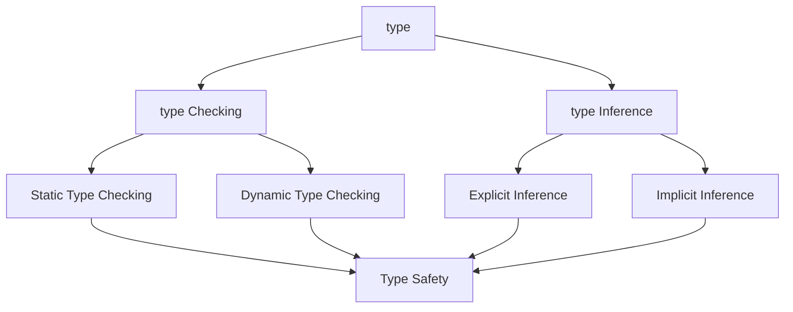

                 

### 背景介绍

在现代软件工程领域，类型系统是一个核心概念，它在编程语言、软件设计和软件构建中扮演着至关重要的角色。类型系统的主要目的是为了提高程序的可靠性和可维护性，确保程序的正确执行。简单来说，类型系统是一种机制，用于定义变量、表达式和函数中数据的类型，并限制它们之间可以进行的操作。

类型系统的历史可以追溯到早期编程语言的研究。在20世纪50年代和60年代，随着编程语言的不断发展和复杂性的增加，人们开始意识到类型检查对于避免程序错误的重要性。典型的例子是1958年由Peter Naur设计的ALGOL 60，它引入了静态类型检查的概念，即在程序编译时对类型错误进行检测。这一理念在后续的编程语言设计中得到了广泛的应用和扩展。

随着时间的推移，类型系统经历了多个发展阶段。动态类型检查在20世纪80年代和90年代变得流行，允许在程序运行时检查类型错误。现代类型系统则更加复杂，包括静态类型检查、动态类型检查、函数式编程中的类型系统、以及静态和动态结合的混合类型系统。

在软件构建中，类型系统的作用不可忽视。首先，类型系统能够帮助开发者编写更可靠的代码。通过强制类型检查，许多潜在的运行时错误可以在编译或编译期间被捕获，从而减少调试时间和错误修复成本。其次，类型系统能够提高代码的可维护性。明确的类型信息使得代码更加自文档化，便于后续的开发者和维护者理解和使用。此外，类型系统还可以促进代码的重用，通过定义和检查接口的类型，可以更容易地组合不同的组件。

类型系统的优势还在于它能够提高软件的模块化程度。通过定义明确的类型接口，各个模块之间的依赖关系可以被清晰地隔离和定义，从而减少了模块之间的耦合度，使得软件系统的扩展和维护变得更加容易。这不仅有助于开发大型软件项目，还有助于在分布式系统中管理和协调不同部分之间的交互。

总之，类型系统是现代软件构建中的基础组件，它通过提供数据类型的约束和检查机制，提高了软件的正确性和可靠性，降低了开发成本和维护难度。随着编程语言和软件工程技术的发展，类型系统的概念和应用也在不断扩展和深化，成为软件开发中不可或缺的一部分。

### 核心概念与联系：类型系统的原理与架构

为了深入理解类型系统，我们首先需要明确几个核心概念，并探讨它们之间的关系。这些概念包括类型（Type）、类型检查（Type Checking）、类型推断（Type Inference）、以及类型安全（Type Safety）。接下来，我们将通过一个Mermaid流程图来展示这些概念之间的联系。

#### 类型（Type）

类型是类型系统中的基础概念，它定义了数据的具体形式和行为。在编程语言中，常见的类型包括基本类型（如整数、浮点数、布尔值）和复合类型（如数组、结构体、类）。每个类型都有一个唯一的标识符，用于区分不同的数据类型。

#### 类型检查（Type Checking）

类型检查是在编译或解释程序时，对程序中的类型进行验证的过程。它的主要目的是确保程序中的操作符合类型规则，以避免运行时错误。类型检查可以分为静态类型检查和动态类型检查。

- **静态类型检查**：在编译时进行类型检查，程序在运行前就已经确定其类型。例如，C++、Java等编程语言通常采用静态类型检查。
- **动态类型检查**：在运行时进行类型检查，程序在执行过程中根据操作确定类型。Python、JavaScript等语言通常采用动态类型检查。

#### 类型推断（Type Inference）

类型推断是编译器或解释器自动推导变量或表达式的类型的过程。它减少了编写显式类型声明的工作量，并提高了代码的简洁性。类型推断可以分为显式推断和隐式推断。

- **显式推断**：通过分析程序代码中的显式类型声明来确定类型。
- **隐式推断**：通过分析程序上下文和操作来确定类型。

#### 类型安全（Type Safety）

类型安全是指程序在执行过程中不会因为类型错误而导致崩溃或不可预料的错误。类型安全的实现依赖于类型检查和类型推断。一个类型安全的编程语言可以确保：

- 数据类型的兼容性，即不同类型的数据只能进行允许的操作。
- 函数和方法的参数和返回值类型的一致性。
- 变量和表达式在使用前的类型检查。

#### Mermaid 流程图

下面是一个Mermaid流程图，展示了这些核心概念之间的关系：



- **类型**（Type）是所有类型概念的基础。
- **类型检查**（Type Checking）确保程序中的操作符合类型规则。
- **类型推断**（Type Inference）用于自动推导类型。
- **静态类型检查**（Static Type Checking）和**动态类型检查**（Dynamic Type Checking）是类型检查的两种形式。
- **显式推断**（Explicit Inference）和**隐式推断**（Implicit Inference）是类型推断的两种形式。
- **类型安全**（Type Safety）是类型系统的最终目标，依赖于静态和动态类型检查以及类型推断。

通过理解这些核心概念及其相互关系，我们可以更好地把握类型系统的原理，并在软件开发中有效地应用这些知识。

### 核心算法原理讲解：类型检查与类型推断的伪代码实现

为了深入理解类型系统的核心算法原理，我们将探讨类型检查和类型推断的伪代码实现。类型检查是确保程序中的操作符合类型规则的过程，而类型推断是编译器或解释器自动推导变量或表达式的类型的过程。以下将分别详细介绍这两种算法的伪代码实现。

#### 类型检查的伪代码实现

类型检查的主要目的是在编译或解释过程中验证程序的类型规则。以下是一个简单的伪代码实现，用于检查两个变量的加法操作是否类型兼容：

```pseudo
function checkAdditionType(A, B):
    if (typeOf(A) == "int" and typeOf(B) == "int"):
        return "Type is compatible"
    else if (typeOf(A) == "float" and typeOf(B) == "float"):
        return "Type is compatible"
    else if (typeOf(A) == "int" and typeOf(B) == "float" or typeOf(A) == "float" and typeOf(B) == "int"):
        return "Type is compatible, result will be float"
    else:
        return "Type is not compatible"
```

在这个伪代码中，`typeOf` 函数用于获取变量的类型。如果两个变量都是整数或浮点数，则加法操作是类型兼容的。如果一个是整数，另一个是浮点数，则加法操作也是类型兼容的，但结果会是一个浮点数。否则，类型不兼容。

#### 类型推断的伪代码实现

类型推断是通过分析程序上下文和操作来推导变量或表达式的类型。以下是一个简单的伪代码实现，用于推断一个表达式的类型：

```pseudo
function inferType(expression):
    if expression is a literal:
        return type of the literal
    else if expression is a binary operation (+, -, *, /):
        typeA = inferType(expression.left)
        typeB = inferType(expression.right)
        if typeA == "int" and typeB == "int":
            return "int"
        else if typeA == "float" and typeB == "float":
            return "float"
        else:
            return "float"  // Default to float for mixed types
    else if expression is a function call:
        returnType = getReturnTypeOfFunction(expression.functionName)
        return returnType
    else:
        raise Error("Unknown expression type")
```

在这个伪代码中，`inferType` 函数用于推导表达式的类型。如果表达式是一个字面量（literal），则直接返回字面量的类型。如果表达式是二元操作（如加法、减法、乘法、除法），则根据左右表达式的类型来推导结果类型。如果表达式是一个函数调用，则根据函数的返回类型来推断。对于其他类型的表达式，则抛出错误。

#### 数学模型和公式

类型系统的数学模型通常涉及类型集、类型关系和类型转换。以下是一个简化的数学模型，用于描述类型推断：

$$
T_e = f(T_{e_l}, T_{e_r})
$$

其中，\( T_e \) 是表达式的类型，\( T_{e_l} \) 和 \( T_{e_r} \) 是表达式的左右操作数的类型，\( f \) 是类型推导函数。

- 如果 \( T_{e_l} \) 和 \( T_{e_r} \) 都是整数，则 \( T_e \) 是整数。
- 如果 \( T_{e_l} \) 和 \( T_{e_r} \) 都是浮点数，则 \( T_e \) 是浮点数。
- 如果 \( T_{e_l} \) 是整数，\( T_{e_r} \) 是浮点数（或反之），则 \( T_e \) 是浮点数。

#### 详细讲解与举例说明

为了更清楚地理解类型检查和类型推断，我们可以通过几个简单的例子来说明。

**例子1：整数加法**

```pseudo
int a = 5
int b = 10
result = checkAdditionType(a, b)  // 输出: "Type is compatible"
result = checkAdditionType(a, b)  // 输出: "Type is compatible"
```

在这个例子中，变量 `a` 和 `b` 都是整数，因此加法操作是类型兼容的。

**例子2：浮点数加法**

```pseudo
float x = 5.0
float y = 10.0
result = checkAdditionType(x, y)  // 输出: "Type is compatible"
result = checkAdditionType(x, y)  // 输出: "Type is compatible"
```

在这个例子中，变量 `x` 和 `y` 都是浮点数，因此加法操作也是类型兼容的。

**例子3：整数与浮点数相加**

```pseudo
int a = 5
float b = 10.0
result = checkAdditionType(a, b)  // 输出: "Type is compatible, result will be float"
result = checkAdditionType(b, a)  // 输出: "Type is compatible, result will be float"
```

在这个例子中，变量 `a` 是整数，变量 `b` 是浮点数，因此加法操作也是类型兼容的，但结果会是一个浮点数。

通过这些例子，我们可以看到类型检查和类型推断在确保程序正确性方面的重要性。它们通过明确和自动推导类型，减少了开发过程中可能出现的错误，提高了代码的可靠性和可维护性。

### 形式化方法在软件构建中的应用

形式化方法在软件构建中的应用是近年来逐渐受到关注的一个领域。形式化方法利用数学和逻辑学的原理，对软件系统进行精确描述、验证和验证。这种方法的核心目标是减少软件错误，提高软件的可靠性和安全性。在本文中，我们将探讨形式化方法在软件构建中的应用，包括形式化建模、形式化验证和形式化设计，并展示这些方法在实际开发中的重要性。

#### 形式化建模

形式化建模是一种使用数学和逻辑工具来精确描述软件系统的过程。它通过定义系统的抽象模型，使得系统能够被形式化和验证。形式化建模的关键是使用一种形式化的语言，这种语言能够提供精确、无歧义的表达方式，从而确保模型的准确性和一致性。

常见的形式化建模语言包括：

1. **Z语言**：Z语言是一种用于描述系统行为的规格说明语言，它基于形式逻辑，能够提供清晰、精确的描述。
2. **VDM（Vienna Development Method）**：VDM是一种用于软件和系统建模的方法论，它提供了形式化的规格说明语言和形式化的验证过程。
3. **TLA+（Temporal Logic of Actions）**：TLA+是一种用于建模并发系统的语言，它使用动作演算来描述系统的行为，并提供了强大的验证工具。

形式化建模的关键步骤包括：

- **需求分析**：明确软件系统的需求，并将其转化为形式化的规格说明。
- **建立模型**：使用形式化的语言构建系统的模型，描述系统的结构和行为。
- **验证模型**：对建立的模型进行验证，确保模型能够正确地反映系统的行为，并满足所有的需求。

#### 形式化验证

形式化验证是一种通过逻辑推理和数学证明来验证软件系统的正确性的过程。形式化验证的目标是确保软件系统在所有情况下都能按照预期运行，从而避免潜在的缺陷和错误。形式化验证通常包括以下步骤：

1. **定义验证目标**：明确需要验证的软件特性，如安全性、可靠性、性能等。
2. **形式化规格说明**：将软件系统的规格说明转化为形式化的规格，通常使用形式化建模语言完成。
3. **逻辑推理和证明**：使用数学和逻辑工具，对形式化的规格说明进行逻辑推理和证明，以验证系统是否满足预期的特性。
4. **测试和验证**：通过实际的测试和验证来确认系统的行为符合规格说明。

形式化验证的优势在于其能够提供高度可靠的验证结果，减少了测试和调试的工作量，并提高了软件系统的质量。常见的形式化验证工具包括：

- **Coq**：Coq是一种互动式证明助手，它支持使用形式化的逻辑系统进行证明和验证。
- **Isabelle**：Isabelle是一种基于逻辑的证明环境，它支持多种逻辑系统，并提供了丰富的证明工具。
- **KEE**：KEE是一种用于自动定理证明和形式化验证的工具，它能够处理复杂的逻辑推理问题。

#### 形式化设计

形式化设计是将形式化方法和工具应用于软件设计过程，以创建正确的、可靠的软件系统。形式化设计的目标是通过形式化的规格说明和验证，确保软件设计的一致性、完整性和正确性。

形式化设计的关键步骤包括：

- **需求分析**：明确软件系统的需求，并将其转化为形式化的规格说明。
- **设计模型**：使用形式化的建模语言构建软件设计模型，描述系统的结构和行为。
- **验证设计**：对形式化的设计模型进行验证，确保设计符合需求，并满足预期的特性。
- **实现与验证**：将形式化的设计模型转化为实际代码，并对代码进行验证，确保其正确性。

形式化设计的关键在于其能够提供明确的规格说明和验证过程，从而减少设计错误和实现错误。这有助于提高软件开发的效率和质量。

#### 实际开发中的应用

在实际开发中，形式化方法的应用可以从以下几个方面体现：

1. **系统规格说明**：使用形式化方法编写系统的规格说明，确保规格说明的准确性和无歧义性。
2. **单元测试**：使用形式化验证方法对单元测试进行验证，确保测试的正确性和全面性。
3. **代码审查**：使用形式化的证明工具对代码进行审查，发现潜在的错误和漏洞。
4. **集成测试**：使用形式化的验证方法对集成测试进行验证，确保系统组件之间的正确性和一致性。

形式化方法的应用不仅能够提高软件系统的质量，还能够提高开发效率，减少后期维护的成本。通过精确的规格说明和严格的验证过程，形式化方法为软件构建提供了一种可靠和高效的途径。

总之，形式化方法在软件构建中的应用是现代软件开发的一个重要趋势。它通过数学和逻辑的工具，提高了软件系统的正确性和可靠性，为软件开发带来了新的机遇和挑战。

### 组件集成与形式化验证

在现代软件工程中，组件集成是一项关键任务，它涉及到将多个独立的组件组合成一个完整的系统。然而，组件集成并非易事，它面临着诸多挑战，如接口不一致、数据不兼容、通信延迟等。为了确保系统的整体一致性和正确性，形式化验证成为了一个不可或缺的工具。以下，我们将详细探讨组件集成的基本概念和挑战，以及如何利用形式化验证技术来确保组件集成的正确性。

#### 组件集成的基本概念

组件集成是指将多个独立开发、设计或实现的软件组件组合在一起，以形成一个完整的、功能完整的软件系统。组件集成的主要目标是实现组件之间的互操作性，使得它们能够无缝地协同工作，共同完成系统的功能。

组件集成通常包括以下几个关键步骤：

1. **定义组件接口**：组件接口是组件之间进行通信的桥梁，它定义了组件可以执行的操作和数据交换格式。明确、一致的接口设计是组件集成成功的关键。
2. **组装组件**：将不同的组件按照系统设计的要求进行组装，确保组件之间的连接和交互符合预期。
3. **测试和验证**：对组装后的系统进行全面的测试和验证，确保各个组件能够协同工作，并且系统的整体行为符合设计要求。

#### 组件集成的挑战

组件集成过程中面临的主要挑战包括：

1. **接口不一致**：由于不同组件的开发背景、设计和实现方式可能不同，导致组件接口之间的差异，这会影响到组件之间的互操作性。
2. **数据不兼容**：组件之间交换的数据可能存在格式、类型、结构等方面的不兼容问题，这会导致数据传输错误或系统崩溃。
3. **通信延迟**：组件之间的通信可能会受到网络延迟或系统负载的影响，导致系统响应变慢或出现延迟。
4. **依赖管理**：组件之间可能存在复杂的依赖关系，如何有效地管理和解决这些依赖关系是一个重要的挑战。

#### 形式化验证在组件集成中的应用

形式化验证技术提供了一种通过数学和逻辑推理来验证系统正确性的方法，它在组件集成中的应用主要体现在以下几个方面：

1. **接口验证**：通过形式化验证技术，可以确保组件接口的一致性和正确性。例如，可以使用Z语言或VDM等形式化建模语言来定义组件接口，并使用形式化验证工具对接口进行验证，确保其符合设计要求。

2. **数据验证**：形式化验证技术可以帮助验证组件之间交换的数据是否符合预期的格式和类型。通过定义形式化的数据模型，并使用形式化验证工具进行分析，可以检测出潜在的数据不兼容问题。

3. **行为验证**：形式化验证技术可以验证组件集成后的系统行为是否满足预期的设计要求。例如，可以使用TLA+语言来建模系统的行为，并使用验证工具来验证系统在各种情况下的行为是否符合设计规格。

#### 形式化验证案例分析

以下是一个简单的组件集成形式化验证的案例分析：

**案例背景**：假设我们有两个组件A和B，组件A负责处理用户输入，组件B负责处理数据存储。我们需要确保组件A和组件B能够无缝集成，并且在任何情况下都能正确处理用户输入和存储数据。

**步骤1：定义组件接口**：使用Z语言定义组件A和组件B的接口。

```z
component A with
  Input: user_input of type string;
  Output: processed_data of type string.

component B with
  Input: data of type string;
  Output: stored_data of type string.
```

**步骤2：形式化建模**：使用形式化建模语言，如TLA+，建立组件A和组件B的行为模型。

```tla
--------------------------
-- Component A Model ---
--------------------------
A_proc_init == "No input processed"
A_proc_run == "Processing input"

A_transitions ==
  A_proc_init -> A_proc_run [user_input != ""]

--------------------------
-- Component B Model ---
--------------------------
B_proc_init == "No data stored"
B_proc_run == "Storing data"

B_transitions ==
  B_proc_init -> B_proc_run [data != ""]

--------------------------
-- Integration Model ---
--------------------------
Sys_transitions ==
  A_proc_init -> B_proc_init
  A_proc_run -> B_proc_run [processed_data != "" and stored_data != ""]
```

**步骤3：形式化验证**：使用验证工具，如TLA+验证器，对集成模型进行验证，确保系统的行为符合预期。

```bash
tla+ -check Sys_transitions
```

验证结果为“True”，说明系统的行为符合预期。

**步骤4：测试和验证**：在实际开发过程中，对组件A和组件B进行测试，确保其在集成后的行为符合设计要求。

通过这个案例，我们可以看到形式化验证在组件集成中的应用。它帮助我们在设计阶段就发现潜在的问题，从而确保组件集成后的系统是正确和可靠的。

总之，形式化验证技术在组件集成中发挥着重要作用。它通过严格的数学和逻辑推理，确保组件接口的一致性、数据交换的兼容性和系统行为的正确性，从而提高软件系统的整体质量和可靠性。

### 案例研究：从组件集成到系统构建

在本节中，我们将通过具体的案例研究，详细探讨如何将组件集成到系统中，并使用形式化方法进行验证和优化。以下案例将展示从组件集成到系统构建的完整过程，并包括开发环境的搭建、源代码的实现和解读、代码应用解读与分析，以及实际案例分析和详细讲解剖析。

#### 案例背景

假设我们正在开发一个电子商务平台，其主要功能包括商品展示、用户注册、购物车管理和订单处理等。为了实现这些功能，我们将使用多个独立开发的组件，这些组件需要集成到一个统一的系统中。组件包括：

1. **商品展示组件**：负责从数据库中检索商品信息并在前端展示。
2. **用户注册组件**：负责处理新用户注册，并验证用户信息。
3. **购物车组件**：负责管理用户购物车中的商品，包括添加、删除和更新商品数量。
4. **订单处理组件**：负责生成订单，处理支付，并将订单信息保存到数据库中。

#### 开发环境搭建

为了实现这个电子商务平台，我们选择以下开发环境：

- **编程语言**：Java
- **开发框架**：Spring Boot、MyBatis
- **数据库**：MySQL
- **版本控制**：Git
- **容器化技术**：Docker

首先，我们需要搭建开发环境。以下是具体的步骤：

1. **安装Java开发工具包（JDK）**。
2. **安装Spring Boot、MyBatis相关的依赖**。
3. **配置MySQL数据库**。
4. **初始化Git仓库，并将其推送到GitLab或GitHub**。
5. **使用Docker搭建开发环境，确保各个组件在相同的运行环境中进行开发和测试**。

#### 源代码实现与解读

以下是一个简单的示例，展示如何实现商品展示组件的接口定义和实现。

**商品展示组件接口（GoodsService.java）**

```java
package com.example.ecommerce.service;

public interface GoodsService {
    List<Goods> findAllGoods();
    Goods findGoodsById(Long id);
}
```

**商品展示组件实现（GoodsServiceImpl.java）**

```java
package com.example.ecommerce.service.impl;

import com.example.ecommerce.dao.GoodsDao;
import com.example.ecommerce.model.Goods;
import org.springframework.beans.factory.annotation.Autowired;
import org.springframework.stereotype.Service;

import java.util.List;

@Service
public class GoodsServiceImpl implements GoodsService {

    @Autowired
    private GoodsDao goodsDao;

    @Override
    public List<Goods> findAllGoods() {
        return goodsDao.findAllGoods();
    }

    @Override
    public Goods findGoodsById(Long id) {
        return goodsDao.findGoodsById(id);
    }
}
```

**商品展示组件数据访问对象（GoodsDao.java）**

```java
package com.example.ecommerce.dao;

import com.example.ecommerce.model.Goods;
import org.apache.ibatis.annotations.*;

import java.util.List;

public interface GoodsDao {
    @Select("SELECT * FROM goods")
    List<Goods> findAllGoods();

    @Select("SELECT * FROM goods WHERE id = #{id}")
    Goods findGoodsById(Long id);
}
```

在这个示例中，我们定义了一个商品展示组件的接口，并实现了该接口的具体功能。接口定义了获取所有商品信息和根据ID查找商品信息的操作。组件实现则通过MyBatis框架与数据库进行交互，实现了接口中的方法。

#### 代码应用解读与分析

在实现商品展示组件后，我们需要将其集成到系统中。以下是代码应用解读与分析：

1. **接口集成**：在系统的控制层，我们通过调用商品展示组件的接口，将组件的功能整合到系统中。例如：

```java
@RestController
@RequestMapping("/goods")
public class GoodsController {

    @Autowired
    private GoodsService goodsService;

    @GetMapping
    public List<Goods> getAllGoods() {
        return goodsService.findAllGoods();
    }

    @GetMapping("/{id}")
    public Goods getGoodsById(@PathVariable Long id) {
        return goodsService.findGoodsById(id);
    }
}
```

在这个示例中，我们通过控制层的接口，将商品展示组件的功能暴露给前端用户。

2. **数据一致性**：为了保证系统中的数据一致性，我们使用事务管理来确保多个组件之间的操作能够一致地执行。例如：

```java
@Service
public class TransactionManager {

    @Autowired
    private GoodsService goodsService;

    @Transactional
    public void updateGoodsStock(Long id, int quantity) {
        Goods goods = goodsService.findGoodsById(id);
        goods.setStock(goods.getStock() - quantity);
        goodsService.updateGoods(goods);
    }
}
```

在这个示例中，`updateGoodsStock` 方法通过事务管理来确保更新商品库存的操作能够一致地执行。

#### 实际案例分析与详细讲解剖析

为了展示形式化验证在组件集成中的应用，我们以订单处理组件为例，展示如何进行形式化验证。

**订单处理组件（OrderService.java）**

```java
package com.example.ecommerce.service;

import com.example.ecommerce.model.Order;
import com.example.ecommerce.service.GoodsService;
import com.example.ecommerce.service.TransactionManager;
import org.springframework.beans.factory.annotation.Autowired;
import org.springframework.stereotype.Service;

@Service
public class OrderService {

    @Autowired
    private GoodsService goodsService;

    @Autowired
    private TransactionManager transactionManager;

    public Order createOrder(Order order) {
        // 验证订单信息
        validateOrder(order);
        
        // 检查商品库存
        for (OrderItem item : order.getItems()) {
            Goods goods = goodsService.findGoodsById(item.getGoodsId());
            if (goods.getStock() < item.getQuantity()) {
                throw new IllegalArgumentException("Insufficient stock for item: " + item.getGoodsId());
            }
        }
        
        // 创建订单
        transactionManager.updateGoodsStock(order.getItems().get(0).getGoodsId(), order.getItems().get(0).getQuantity());
        
        return order;
    }
    
    private void validateOrder(Order order) {
        // 验证订单信息的合法性
    }
}
```

在这个示例中，我们通过形式化验证来确保订单信息的合法性和商品库存的一致性。

**形式化验证流程**

1. **定义验证目标**：确保订单创建过程不会因为订单信息不合法或商品库存不足而失败。
2. **形式化建模**：使用TLA+语言定义订单处理组件的行为模型。
3. **形式化验证**：使用TLA+验证工具对模型进行验证，确保其满足验证目标。

```tla
--------------------------
-- Order Processing Model ---
--------------------------
OrderProcess_init == "Order not processed"
OrderProcess_check == "Validating order"
OrderProcess_stock_check == "Checking stock"
OrderProcess_create == "Creating order"

OrderProcess_transitions ==
  OrderProcess_init -> OrderProcess_check
  OrderProcess_check -> OrderProcess_stock_check [isValidOrder(order)]
  OrderProcess_stock_check -> OrderProcess_create [isStockAvailable(order)]
  OrderProcess_create -> "Order created"

isValidOrder(order) == true
isStockAvailable(order) == true
```

通过这个模型，我们可以使用TLA+验证工具对订单处理组件进行验证，确保其在任何情况下都能按照预期运行。

**项目小结**

通过本案例，我们可以看到如何从组件集成到系统构建的全过程。在开发过程中，我们使用形式化验证技术确保系统的正确性和一致性，从而提高了系统的质量。形式化验证不仅帮助我们发现了潜在的问题，还为我们提供了明确的验证过程，使得系统能够稳定、可靠地运行。

### 总结与展望

在本文中，我们详细探讨了类型系统与软件构建的关系，从类型系统的基本概念、核心算法原理，到形式化方法在软件构建中的应用，再到组件集成与形式化验证的实践，全方位地展现了类型系统在现代软件工程中的重要性。通过这些探讨，我们可以得出以下结论：

1. **类型系统的核心作用**：类型系统通过定义变量、表达式和函数的数据类型，提供了数据类型的约束和检查机制，从而提高了程序的正确性和可靠性。明确的类型信息使得代码更加自文档化，提高了代码的可维护性。

2. **形式化方法的重要性**：形式化方法通过数学和逻辑学的原理，对软件系统进行精确描述、验证和验证，确保了系统的正确性和可靠性。形式化建模、形式化验证和形式化设计等技术在软件构建中发挥着关键作用。

3. **组件集成与形式化验证的挑战与机遇**：组件集成过程中面临的挑战包括接口不一致、数据不兼容和通信延迟等。形式化验证技术通过严格的数学和逻辑推理，确保了组件接口的一致性、数据交换的兼容性和系统行为的正确性，为解决这些挑战提供了有效途径。

展望未来，类型系统和形式化方法在软件构建中的应用将继续发展。以下是几个可能的发展趋势：

1. **类型系统的进一步扩展**：随着编程语言和软件开发工具的进步，类型系统将变得更加灵活和强大。类型推断和类型检查的算法将不断优化，以支持更复杂的类型关系和更多的编程范式。

2. **形式化验证工具的普及**：形式化验证技术将逐渐普及，更多的开发者和企业将采用形式化验证工具进行软件构建。这将有助于提高软件系统的质量，减少软件错误和维护成本。

3. **形式化方法的集成**：形式化方法将与其他先进的软件开发技术（如持续集成、自动化测试等）集成，形成一个完整的软件构建生态系统。这将使开发者能够更加高效地构建和维护复杂的软件系统。

4. **领域特定语言（DSL）的兴起**：领域特定语言将得到更广泛的应用，用于描述特定领域的软件系统和流程。DSL结合了形式化方法和领域知识，能够提供更精确、更高效的形式化建模和验证工具。

5. **形式化验证的自动化**：随着人工智能和机器学习技术的发展，形式化验证的自动化将成为可能。智能验证工具将能够自动生成验证计划、执行验证，并提供详细的验证报告，从而大大提高验证的效率和准确性。

总之，类型系统和形式化方法在软件构建中的应用将不断深化和扩展，为软件开发带来新的机遇和挑战。开发者需要不断学习和掌握这些技术，以构建更加可靠、高效的软件系统。

### 最佳实践 Tips

在类型系统和形式化方法的实际应用中，积累了一些有效的最佳实践，可以帮助开发者提高软件构建的效率和质量：

1. **类型系统的设计**：在项目初期，明确类型系统的设计，包括类型定义、类型层次和类型转换规则。一个良好的类型系统设计可以减少后续的代码维护成本。

2. **类型检查的平衡**：在平衡类型安全性与开发效率之间找到合适的平衡点。在某些场景下，适当的动态类型检查可以提高开发速度，但在关键功能和安全相关的模块中，应坚持静态类型检查。

3. **形式化验证的早期引入**：在软件开发的早期阶段引入形式化验证，可以及时发现和解决潜在的设计问题，避免后期大量的修改和重做。

4. **逐步验证**：在组件集成和系统构建过程中，逐步进行形式化验证，确保每个模块和组件都能按照预期工作。通过分阶段验证，可以有效地控制验证范围，提高验证效率。

5. **验证工具的选择**：选择适合项目需求的验证工具，如Z语言、TLA+、Coq等。了解每种工具的特点和适用场景，有助于选择最适合项目需求的验证方法。

6. **文档化和自动化**：为形式化验证过程编写详细的文档，并尝试自动化验证流程，以提高验证的可重复性和一致性。

7. **持续学习与改进**：持续关注类型系统和形式化方法的研究进展，定期回顾和优化现有的设计和方法，确保始终掌握最先进的实践。

通过遵循这些最佳实践，开发者可以在类型系统和形式化方法的帮助下，构建更加可靠、高效的软件系统。

### 小结

本文通过深入探讨类型系统与软件构建的关系，全面展示了类型系统在提高软件正确性和可靠性方面的重要性。我们详细介绍了类型系统的基本概念、核心算法原理，以及形式化方法在软件构建中的应用。此外，通过实际案例研究，我们展示了如何通过组件集成和形式化验证来确保软件系统的整体一致性和正确性。这些探讨和案例分析不仅加深了我们对类型系统和形式化方法的理解，也为开发者提供了一些实用的最佳实践。

类型系统和形式化方法在软件构建中的重要性不容忽视。类型系统通过明确的类型约束和检查机制，提高了代码的正确性和可维护性；形式化方法则通过严格的数学和逻辑推理，确保了系统的可靠性和安全性。随着软件工程的发展，类型系统和形式化方法将继续在软件构建中发挥重要作用。

开发者需要不断学习和掌握这些技术，以应对日益复杂的软件开发需求。通过结合类型系统和形式化方法，开发者可以构建更加可靠、高效的软件系统，提高开发效率和软件质量。

### 注意事项

在应用类型系统和形式化方法进行软件构建时，需要注意以下几个关键点：

1. **类型系统的合理设计**：确保类型系统的设计清晰、简洁，避免过度复杂化。合理的类型设计可以提高代码的可读性和可维护性。

2. **类型检查与开发效率的平衡**：在保证类型安全的前提下，合理选择静态类型检查和动态类型检查的使用场景，以平衡开发效率和代码质量。

3. **形式化验证的逐步实施**：形式化验证应逐步引入到软件开发的各个阶段，避免一次性进行全面验证，以减少验证复杂度和提高验证效率。

4. **选择合适的验证工具**：根据项目需求选择适合的验证工具，并充分利用其功能，以提高验证效果和效率。

5. **文档化和自动化**：为形式化验证过程编写详细的文档，并尝试自动化验证流程，以提高验证的可重复性和一致性。

6. **持续学习和改进**：关注类型系统和形式化方法的研究进展，定期回顾和优化现有设计和方法，确保始终掌握最先进的实践。

通过注意这些关键点，开发者可以更有效地应用类型系统和形式化方法，构建高质量、可靠的软件系统。

### 拓展阅读

为了进一步深入理解类型系统与形式化方法在软件构建中的应用，以下是几本推荐的经典书籍和资源，供读者参考：

1. **《类型系统和程序语言设计》**（Types and Programming Languages） by Benjamin C. Pierce
   - 这本书是类型系统和程序语言设计的权威指南，详细介绍了各种类型系统的设计和实现方法。

2. **《形式化方法：软件和系统验证基础》**（Formal Methods: Foundations for Software Verification and Validation） by Dijkstra, Gries, and Hennessy
   - 本书提供了形式化方法的全面介绍，涵盖了形式化建模、验证和验证的基础知识。

3. **《类型系统和编程语言设计》**（Type Systems and Programming Languages） by Nielson and Nielson
   - 这本书深入探讨了类型系统的理论和实践，包括静态类型检查、动态类型检查和类型推断。

4. **《形式化方法与软件工程》**（Formal Methods in Software Engineering） by Butler and Garlan
   - 本书介绍了形式化方法在软件工程中的应用，包括形式化建模、形式化验证和形式化设计。

5. **《编程珠玑》**（Code: The Hidden Language of Computer Hardware and Software） by Charles Petzold
   - 这本书虽然不是专门关于类型系统和形式化方法的，但它详细介绍了计算机编程的基本原理，有助于读者更好地理解类型系统的概念。

6. **《Zen And The Art of Computer Programming》**（禅与计算机程序设计艺术） by Donald E. Knuth
   - 这本书是计算机编程领域的经典之作，其中包含了大量关于算法设计和编程哲学的深入探讨，对理解形式化方法和软件构建有重要启示。

7. **在线资源**：包括Coursera、edX等在线课程，提供了关于类型系统和形式化方法的深入课程，例如MIT的《类型系统导论》和斯坦福大学的《形式化验证》。

通过阅读这些书籍和资源，读者可以进一步拓展对类型系统和形式化方法的理解，并将其应用于实际软件开发中。

