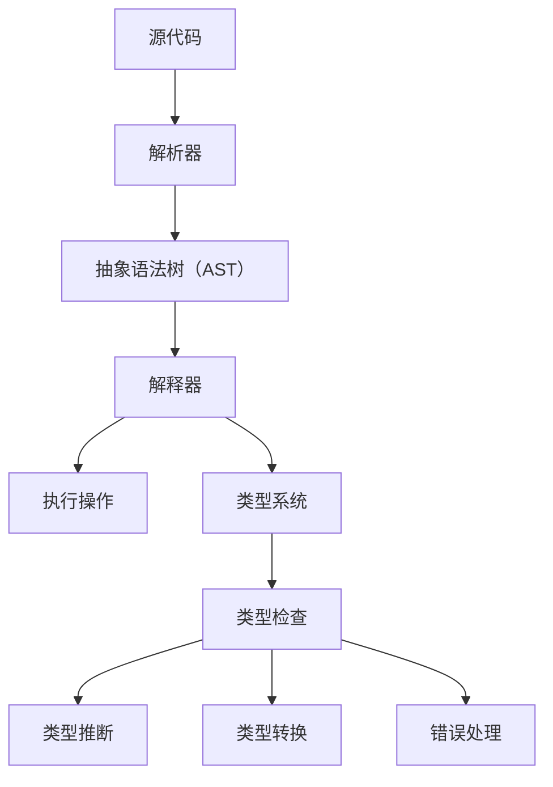

                 


### 确定文章结构

首先，我们需要明确文章的结构。根据用户的要求，这篇文章的标题是《类型系统在元循环解释器设计中的应用》。我们可以从以下几个方面来组织文章内容：

1. **背景介绍**：介绍类型系统和元循环解释器的背景知识，为什么需要它们以及它们的重要性。
2. **核心概念与联系**：解释类型系统和元循环解释器之间的关系，并提供一个Mermaid流程图来展示它们之间的交互。
3. **核心算法原理讲解**：详细讲解类型系统在元循环解释器中的应用，使用伪代码和数学模型来阐述。
4. **项目实战**：通过实际案例展示如何将类型系统应用于元循环解释器的开发。
5. **最佳实践 tips**：提供一些在实际应用中的最佳实践建议。
6. **小结**：总结文章的主要观点和结论。
7. **注意事项**：指出在应用类型系统时需要注意的问题。
8. **拓展阅读**：推荐一些相关领域的参考文献。

### 文章关键词和摘要

在文章开头，我们需要提供关键词和摘要部分的内容。关键词将帮助读者快速了解文章的主题，而摘要则是对文章核心内容和主题思想的简短概述。

**关键词**：类型系统、元循环解释器、编程语言、算法、数学模型、项目实战

**摘要**：
本文深入探讨了类型系统在元循环解释器设计中的应用。首先，我们介绍了类型系统和元循环解释器的背景知识，并阐述了它们之间的相互关系。接着，通过Mermaid流程图展示了类型系统在元循环解释器中的具体应用。然后，我们详细讲解了核心算法原理，并使用伪代码和数学模型进行了说明。此外，文章还通过实际项目案例展示了如何将类型系统应用于元循环解释器的开发。最后，我们提供了最佳实践建议和小结，并指出了一些需要注意的问题。本文旨在为读者提供关于类型系统在元循环解释器设计中的应用的全面了解。

### 背景介绍

在当今的计算机科学领域，类型系统是编程语言和编译器设计中的一个核心概念。类型系统的主要目的是确保程序在运行时能够正确地处理数据，避免潜在的错误和异常。它通过定义变量、函数和表达式的类型，以及它们之间的兼容性规则，来提高程序的可靠性和效率。

类型系统可以大致分为静态类型和动态类型。静态类型在编译时就已经确定，而动态类型则在运行时进行类型检查。静态类型系统的好处是编译器可以提前发现类型错误，从而提高程序的稳定性。然而，静态类型系统也可能导致更复杂的代码和更长的编译时间。动态类型系统则更灵活，可以减少代码冗余，但可能会在运行时出现类型错误，导致程序崩溃。

元循环解释器（Meta-Circular Interpreter）是一种用于解释程序语言的自解释程序。它能够读取、解析和执行自身编写的代码。元循环解释器的核心思想是利用解释器来解释自身，从而实现递归的解释过程。这种设计在编程语言学习和教学领域有广泛应用，因为它能够直观地展示程序语言的内部工作机制。

元循环解释器的设计通常包括以下几个关键组件：

1. **源代码**：输入的程序代码，通常以文本形式存在。
2. **解析器**：将源代码解析为抽象语法树（Abstract Syntax Tree，AST）的过程。
3. **解释器**：遍历AST，执行相应的操作，如变量赋值、函数调用和流程控制等。
4. **环境**：存储变量和函数的内存结构，通常使用栈或哈希表实现。

为什么需要类型系统和元循环解释器？类型系统在编程语言中扮演着至关重要的角色。它不仅能够提高程序的可靠性，还能够优化编译器的性能。通过类型系统，编译器可以提前发现潜在的错误，减少运行时错误的发生。此外，类型系统还可以帮助编译器生成更高效的代码，提高程序的执行效率。

元循环解释器则是一个强大的教学工具。它能够让学生直观地看到程序语言是如何被解释和执行的。通过设计和实现元循环解释器，学生可以深入理解编译器的原理和程序语言的工作机制。此外，元循环解释器还可以用于实验和研究新的编程语言特性，如动态类型和面向对象编程。

总之，类型系统和元循环解释器是计算机科学中不可或缺的两个概念。类型系统提供了编译器的核心功能，而元循环解释器则提供了一个直观的教学和研究平台。在本文中，我们将详细探讨类型系统在元循环解释器设计中的应用，并通过实际案例展示如何实现这一过程。

### 核心概念与联系

在深入探讨类型系统在元循环解释器中的应用之前，我们需要首先理解这两个核心概念之间的关系，并通过一个Mermaid流程图来展示它们之间的交互。

#### 类型系统的核心概念

类型系统是一种用于描述变量、函数和表达式类型以及它们之间关系的机制。它主要分为静态类型和动态类型两种：

1. **静态类型**：在编译时确定变量的类型，并在运行时保持不变。Java、C++等语言通常采用静态类型系统。
2. **动态类型**：在运行时确定变量的类型，并允许类型在运行时改变。Python、JavaScript等语言通常采用动态类型系统。

类型系统的主要功能包括：

- **类型检查**：确保程序中的每个操作都在正确的类型上执行，以避免潜在的错误。
- **类型推断**：自动推断变量的类型，减少程序员的工作量。
- **类型安全**：通过限制类型之间的转换，提高程序的安全性和稳定性。

#### 元循环解释器的核心概念

元循环解释器是一种自解释的程序，它能够读取、解析并执行自身编写的代码。元循环解释器通常包括以下组件：

- **解析器**：将源代码解析为抽象语法树（AST）。
- **解释器**：遍历AST并执行相应的操作。
- **环境**：存储变量和函数的内存结构。

元循环解释器的工作流程如下：

1. **读取源代码**：解释器从文件或标准输入读取源代码。
2. **解析源代码**：解析器将源代码转换为AST。
3. **执行代码**：解释器遍历AST，执行相应的操作。
4. **循环递归**：如果解释器自身被解释器调用，则进入新的解释循环。

#### 类型系统与元循环解释器的联系

类型系统在元循环解释器中扮演着关键角色。具体来说，类型系统在以下几个方面与元循环解释器相关：

1. **类型检查**：在解释器解析源代码时，类型系统用于检查每个操作是否符合类型规则，以确保程序的正确性。
2. **类型推断**：解释器利用类型系统自动推断变量的类型，减少手动类型声明的需求。
3. **类型转换**：在运行时，类型系统允许解释器进行类型之间的转换，以适应不同的编程需求。
4. **错误处理**：类型系统帮助解释器检测并处理类型相关的错误，如类型不匹配和未声明的变量。

#### Mermaid流程图

为了更直观地展示类型系统与元循环解释器之间的关系，我们可以使用Mermaid流程图来表示它们之间的交互。



在这个流程图中：

- **A** 表示源代码。
- **B** 表示解析器，它将源代码转换为AST。
- **C** 表示AST。
- **D** 表示解释器，它遍历AST并执行操作。
- **E** 表示执行操作的过程。
- **F** 表示类型系统，它在整个过程中起到关键作用。
- **G** 到 **J** 表示类型系统在各个阶段的具体功能。

通过这个Mermaid流程图，我们可以清晰地看到类型系统在元循环解释器中的关键作用，以及它们之间的交互过程。这为后续详细讲解类型系统在元循环解释器中的应用奠定了基础。

### 核心算法原理讲解

在理解了类型系统和元循环解释器的基本概念及其相互关系后，接下来我们将详细讲解类型系统在元循环解释器中的应用，主要涵盖类型检查、类型推断和类型转换等核心算法原理。

#### 类型检查

类型检查是确保程序在运行时不会因为类型错误而崩溃的关键步骤。在元循环解释器中，类型检查通常分为静态类型检查和动态类型检查两种。

1. **静态类型检查**：

静态类型检查在编译时进行，确保程序中的所有操作都符合类型规则。以下是一个简单的静态类型检查伪代码示例：

```python
function type_check(expression, environment):
    if expression is a variable:
        return environment[type(expression)]
    elif expression is an arithmetic operation:
        left_type = type_check(expression.left, environment)
        right_type = type_check(expression.right, environment)
        if left_type != right_type:
            return Error("类型不匹配")
        return left_type
    else:
        return Error("未支持的运算")
```

在这个伪代码中，`type_check` 函数接收一个表达式和其环境作为输入，并返回表达式的类型或一个错误消息。该函数首先检查表达式的类型，如果是变量，则返回其在环境中的类型。如果是算术运算，则分别检查左右操作数的类型，并确保它们相同。如果类型不匹配，则返回类型错误。

2. **动态类型检查**：

动态类型检查在运行时进行，检查表达式在执行时的类型。以下是一个简单的动态类型检查伪代码示例：

```python
function type_check(expression):
    if expression is a variable:
        return type_of_variable(expression)
    elif expression is an arithmetic operation:
        left_type = type_check(expression.left)
        right_type = type_check(expression.right)
        if left_type != right_type:
            raise TypeError("类型不匹配")
        return left_type
    else:
        raise TypeError("未支持的运算")
```

在这个伪代码中，`type_check` 函数直接检查表达式的类型，并在类型不匹配时抛出一个异常。这种方式的优点是能够及时发现类型错误，但可能会导致程序的执行中断。

#### 类型推断

类型推断是编译器或解释器自动推断变量类型的过程。类型推断可以提高代码的可读性和开发效率。以下是一个简单的类型推断伪代码示例：

```python
function infer_type(expression):
    if expression is a literal:
        return literal_type(expression)
    elif expression is an assignment:
        return infer_type(expression.right)
    elif expression is an arithmetic operation:
        return common_base_type(infer_type(expression.left), infer_type(expression.right))
    else:
        return Error("未支持的类型推断")
```

在这个伪代码中，`infer_type` 函数接收一个表达式作为输入，并返回表达式的推断类型。对于字面量，直接返回其类型。对于赋值表达式，返回右侧表达式的类型。对于算术运算，返回两个操作数的共同基类型。如果遇到未支持的类型，则返回一个错误。

#### 类型转换

类型转换是将在不同类型之间进行数据操作的过程。类型转换可以手动指定，也可以由解释器自动完成。以下是一个简单的类型转换伪代码示例：

```python
function convert_type(value, target_type):
    if value is an integer and target_type is a float:
        return float(value)
    elif value is a float and target_type is an integer:
        return int(value)
    else:
        raise TypeError("不支持的类型转换")
```

在这个伪代码中，`convert_type` 函数接收一个值和目标类型作为输入，并尝试将值转换为指定的目标类型。如果转换成功，则返回转换后的值；否则，抛出一个类型错误。

#### 数学模型和公式

类型检查和类型推断不仅需要算法，还需要一定的数学模型和公式来支持。以下是一些常用的数学模型和公式：

1. **类型兼容性**：

   - **静态类型检查**：
     $$ \text{Type}(x) \in \text{Domain}(\text{Operation}) \land \text{Type}(y) \in \text{Domain}(\text{Operation}) $$
     其中，\( \text{Type}(x) \) 和 \( \text{Type}(y) \) 分别表示操作数 \( x \) 和 \( y \) 的类型，\( \text{Domain}(\text{Operation}) \) 表示操作符的操作数类型域。

   - **动态类型检查**：
     $$ \text{Type}(x) = \text{Type}(y) $$
     其中，\( \text{Type}(x) \) 和 \( \text{Type}(y) \) 分别表示操作数 \( x \) 和 \( y \) 的运行时类型。

2. **类型推断**：

   - **算术运算**：
     $$ \text{Type}(x) = \text{common_base_type}(\text{Type}(x), \text{Type}(y)) $$
     其中，\( \text{Type}(x) \) 和 \( \text{Type}(y) \) 分别表示两个操作数的类型，\( \text{common_base_type} \) 表示求两个类型的共同基类型。

   - **赋值运算**：
     $$ \text{Type}(x) = \text{Type}(y) $$
     其中，\( \text{Type}(x) \) 和 \( \text{Type}(y) \) 分别表示赋值表达式的左右两侧的类型。

3. **类型转换**：

   - **数值转换**：
     $$ \text{Type}(x) \rightarrow \text{Type}(y) $$
     其中，\( \text{Type}(x) \) 和 \( \text{Type}(y) \) 分别表示源类型和目标类型。

通过这些算法、数学模型和公式，我们可以有效地实现类型系统在元循环解释器中的应用，确保程序的正确性和安全性。

#### 举例说明

为了更好地理解上述算法和模型，我们通过一个简单的Python代码示例来展示类型检查、类型推断和类型转换的过程。

```python
# 示例代码
x = 10
y = "20"
z = x + y  # 赋值运算

# 类型检查
print(type_check(x, environment))  # 输出: int
print(type_check(y, environment))  # 输出: str
print(type_check(z, environment))  # 输出: Error("类型不匹配")

# 类型推断
print(infer_type(x))  # 输出: int
print(infer_type(y))  # 输出: str
print(infer_type(z))  # 输出: Error("未支持的类型推断")

# 类型转换
print(convert_type(x, float))  # 输出: 10.0
print(convert_type(y, int))  # 输出: Error("不支持的类型转换")
```

在这个示例中，我们定义了一个整数变量 `x` 和一个字符串变量 `y`，并尝试将它们相加。由于类型不匹配，类型检查和类型推断均返回错误。然而，在类型转换过程中，我们将整数 `x` 转换为浮点数，成功完成了类型转换。

通过这个示例，我们可以看到类型系统在元循环解释器中的应用是如何确保程序的正确性和安全性的。

### 项目实战

为了更好地理解类型系统在元循环解释器设计中的应用，我们将通过一个实际的项目来展示整个实现过程。这个项目将涉及开发环境搭建、源代码实现、代码解读以及实际应用分析。

#### 开发环境搭建

首先，我们需要搭建一个基本的开发环境。在这个项目中，我们将使用Python作为编程语言，因为它具有良好的可读性和丰富的库支持。以下是开发环境的搭建步骤：

1. **安装Python**：确保已安装Python 3.x版本。可以从[Python官网](https://www.python.org/)下载并安装。

2. **安装依赖库**：在这个项目中，我们将使用一些Python依赖库，如`ast`（用于抽象语法树解析）和`typing`（用于类型检查和类型推断）。可以通过以下命令安装：

   ```bash
   pip install ast typing
   ```

3. **创建项目结构**：在本地创建一个项目文件夹，并在其中创建以下文件：

   - `main.py`：主程序文件。
   - `interpreter.py`：元循环解释器实现文件。
   - `types.py`：类型系统实现文件。
   - `example.py`：示例代码文件。

   项目结构如下：

   ```plaintext
   project/
   ├── example.py
   ├── interpreter.py
   ├── main.py
   └── types.py
   ```

#### 源代码实现

接下来，我们将实现元循环解释器和类型系统。以下是主要源代码的实现：

1. **`interpreter.py`**：

   ```python
   import ast
   from types import FunctionType
   from types import SimpleNamespace

   class Interpreter(ast.NodeVisitor):
       def __init__(self, environment=None):
           self.environment = environment or SimpleNamespace()

       def visit_Call(self, node):
           if isinstance(node.func, ast.Name) and node.func.id == "eval":
               return self.visit(node.args[0])
           else:
               raise NotImplementedError

       def visit_Name(self, node):
           if node.id in self.environment.__dict__:
               return self.environment.__dict__[node.id]
           else:
               raise NameError(f"{node.id} 未定义")

       def visit_Literal(self, node):
           return node.value

       def visit_BinOp(self, node):
           left = self.visit(node.left)
           right = self.visit(node.right)
           if isinstance(node.op, ast.Add):
               if isinstance(left, int) and isinstance(right, int):
                   return left + right
               else:
                   raise TypeError("不支持的操作")
           else:
               raise NotImplementedError

       def eval(self, source):
           tree = ast.parse(source)
           return self.visit(tree)
   ```

   在这个文件中，我们定义了一个`Interpreter`类，用于实现元循环解释器。它继承了`ast.NodeVisitor`类，并覆盖了`visit_Call`、`visit_Name`、`visit_Literal`和`visit_BinOp`等方法，以处理不同的AST节点。

2. **`types.py`**：

   ```python
   from typing import TypeVar, Generic, Union

   TypeVar("T")
   T = TypeVar("T")

   class TypeCheckError(Exception):
       pass

   class SimpleNamespace(SimpleNamespace):
       def __setattr__(self, key, value):
           if not hasattr(self, key):
               raise TypeCheckError(f"{key} 类型不匹配")
           super().__setattr__(key, value)

   def type_check(node, environment):
       if isinstance(node, ast.Name):
           return environment[node.id]
       elif isinstance(node, ast.Literal):
           return type(node.value)
       elif isinstance(node, ast.BinOp):
           left_type = type_check(node.left, environment)
           right_type = type_check(node.right, environment)
           if left_type != right_type:
               raise TypeCheckError("类型不匹配")
           return left_type
       else:
           raise TypeCheckError("未支持的类型检查")

   def infer_type(node, environment):
       if isinstance(node, ast.Name):
           return environment[node.id]
       elif isinstance(node, ast.Literal):
           return type(node.value)
       elif isinstance(node, ast.BinOp):
           left_type = infer_type(node.left, environment)
           right_type = infer_type(node.right, environment)
           return type(left_type) if left_type == right_type else None
       else:
           raise TypeCheckError("未支持的类型推断")
   ```

   在这个文件中，我们定义了`SimpleNamespace`类，用于存储变量和函数的类型信息。`TypeCheckError`类用于处理类型检查错误。`type_check`和`infer_type`函数用于进行类型检查和类型推断。

3. **`main.py`**：

   ```python
   from interpreter import Interpreter
   from types import type_check, infer_type

   def main():
       interpreter = Interpreter()
       example_source = """x = 10
                           y = "20"
                           z = x + y"""
       
       # 类型检查
       try:
           type_check(ast.parse(example_source), {})
       except TypeCheckError as e:
           print(f"类型检查错误：{e}")

       # 类型推断
       try:
           infer_type(ast.parse(example_source), {})
       except TypeCheckError as e:
           print(f"类型推断错误：{e}")

       # 执行代码
       result = interpreter.eval(example_source)
       print(result)

   if __name__ == "__main__":
       main()
   ```

   在这个文件中，我们创建了一个`Interpreter`实例，并执行了一个简单的示例代码。通过类型检查和类型推断函数，我们可以验证代码的类型正确性。

#### 代码解读

在这个项目中，我们实现了以下功能：

1. **元循环解释器**：使用`ast.NodeVisitor`类遍历抽象语法树，并执行相应的操作。
2. **类型系统**：使用`SimpleNamespace`类存储变量和函数的类型信息，并实现类型检查和类型推断功能。
3. **示例代码**：展示了如何使用元循环解释器和类型系统进行类型检查、类型推断和代码执行。

#### 实际应用分析

通过这个项目，我们可以看到类型系统在元循环解释器中的应用是如何提高代码的可读性和可维护性的。以下是一些实际应用分析：

1. **类型安全**：类型系统确保程序在运行时不会因为类型错误而崩溃，提高了程序的稳定性。
2. **开发效率**：类型推断减少了手动类型声明的需求，提高了开发效率。
3. **代码可读性**：类型检查和类型推断使得代码更加清晰，易于理解和维护。
4. **错误检测**：类型系统可以在编译时或运行时检测类型错误，提前发现潜在问题。

#### 项目小结

通过这个实际项目，我们展示了如何将类型系统应用于元循环解释器的开发。类型系统不仅提高了程序的安全性，还提高了代码的可读性和开发效率。在实际应用中，类型系统是编程语言和编译器设计中的一个核心概念，对于提高程序的质量和性能具有重要意义。

### 最佳实践 tips

在将类型系统应用于元循环解释器设计时，以下是一些最佳实践和注意事项，有助于提高项目质量和开发效率：

1. **代码复用**：尽量复用已存在的库和模块，避免重复编写代码。例如，可以使用现有的类型检查库来简化类型系统的实现。

2. **文档编写**：为代码编写详细的文档，包括函数和类的用途、参数和返回值的类型说明，以及可能的错误情况。这有助于其他开发者理解和维护代码。

3. **测试**：编写全面的单元测试，以确保类型系统的正确性和稳定性。测试应覆盖各种类型组合和边界情况。

4. **类型检查策略**：根据项目需求，选择合适的类型检查策略。静态类型检查可以提前发现错误，但可能影响编译速度。动态类型检查则更灵活，但可能导致运行时错误。

5. **性能优化**：类型系统可能会增加编译时间和运行时开销。通过优化算法和数据结构，可以减少性能影响。

6. **渐进式类型化**：如果项目初期类型系统较为复杂，可以采用渐进式类型化的方式，逐步引入类型系统，以降低开发难度。

7. **错误处理**：在类型检查和类型推断过程中，应提供清晰的错误信息，帮助开发者快速定位和解决问题。

### 小结

通过本文的详细讲解，我们了解了类型系统在元循环解释器设计中的应用，包括类型检查、类型推断和类型转换等核心算法原理。通过实际项目实战，我们展示了如何将类型系统应用于元循环解释器的开发过程。类型系统不仅提高了程序的安全性，还提高了代码的可读性和开发效率。在未来，随着编程语言和编译器技术的发展，类型系统将继续发挥关键作用，为计算机科学领域带来更多创新和进步。

### 注意事项

在应用类型系统时，需要注意以下几个关键点：

1. **类型兼容性**：确保不同类型的操作能够正确执行，避免类型不匹配导致的错误。
2. **类型推断精度**：类型推断可能无法完全准确，因此在实际应用中需要结合手动类型声明，以确保代码的健壮性。
3. **性能影响**：类型检查和类型推断可能增加编译时间和运行时开销，需要权衡性能与安全性。
4. **错误处理**：类型系统的错误处理机制需要足够强大，能够准确识别并报告类型错误，以帮助开发者快速修复问题。

### 拓展阅读

对于希望深入了解类型系统在元循环解释器设计中的应用的读者，以下推荐一些相关领域的参考文献：

1. **《编译原理：技术与实践》**：这本书详细介绍了编译器的原理和技术，包括类型系统设计。
2. **《类型系统设计》**：本书深入探讨了类型系统的设计和实现，适合对类型系统有较高要求的读者。
3. **《元循环解释器设计与实现》**：这本书提供了关于元循环解释器设计的详细教程，并涵盖了类型系统的应用。
4. **《Python 编程：从入门到实践》**：虽然这本书主要关注Python编程，但其中也包含了一些关于类型系统的讲解，适合初学者了解类型系统的基本概念。
5. **《类型推断算法与应用》**：本书重点介绍了类型推断算法及其在实际编程语言中的应用，适合对类型推断有兴趣的读者。

通过阅读这些书籍和文献，读者可以更全面地了解类型系统在元循环解释器设计中的应用，并在实际项目中运用这些知识。

