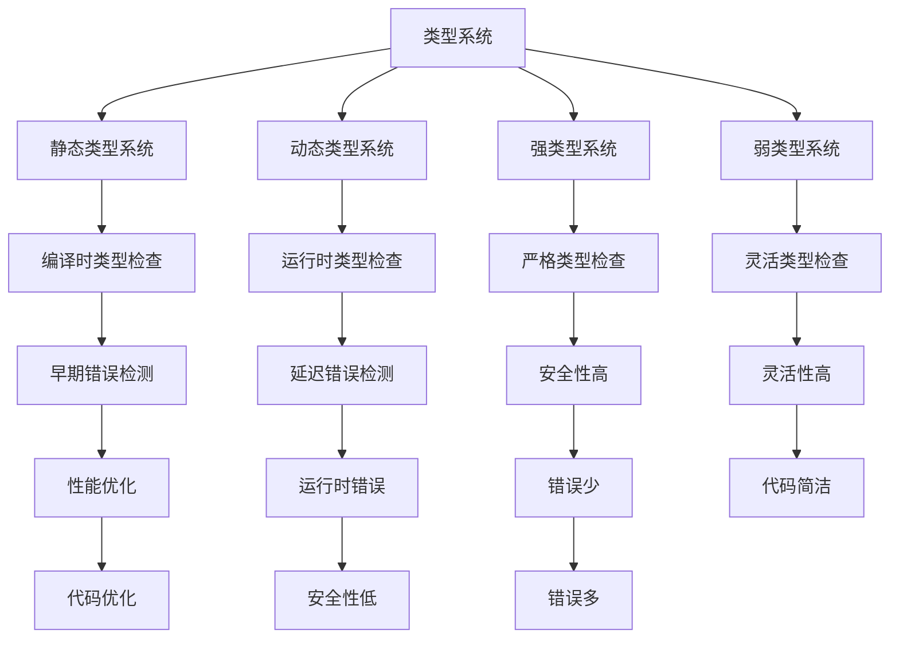

                 


### 引言

在计算机科学领域，类型系统是一个核心的概念，它不仅是编程语言的基础，也是程序理解和执行的关键因素。类型系统在程序设计语言中起到约束和保障作用，确保程序的正确性和可靠性。随着计算机技术的发展，元编程（Metaprogramming）逐渐成为编程领域的一个热点，它允许程序员编写能够操作自身结构、代码和数据的程序。

元编程的概念可以追溯到编程语言的编译过程和解释过程，它涉及到代码生成、代码替换、动态代码执行、反射和代码优化等多个方面。元编程不仅仅是代码生成器或者宏系统的应用，更是一种编程范式，它允许程序员编写能够改变自身行为的代码。

在这篇文章中，我们将深入探讨类型系统在元编程中的应用。首先，我们将介绍类型系统的基本概念，包括静态类型系统、动态类型系统和强类型系统与弱类型系统的区别。接着，我们将分析元编程的基本概念，探讨元编程的核心概念和工具与技术。然后，我们将详细讨论类型系统在代码生成、代码替换、动态代码执行、反射和代码优化等元编程应用中的具体作用。最后，我们将通过实际案例和项目实战，展示类型系统在元编程中的具体应用和效果。

本文旨在通过逐步分析推理的方式，帮助读者深入理解类型系统在元编程中的应用，掌握元编程的核心技术和原理，从而在编程实践中更好地利用类型系统和元编程的优势。

### 文章关键词

- 类型系统
- 元编程
- 静态类型
- 动态类型
- 强类型
- 弱类型
- 代码生成
- 代码替换
- 动态代码执行
- 反射
- 代码优化
- 编程范式

### 摘要

本文探讨了类型系统在元编程中的应用。首先介绍了类型系统的基本概念，包括静态类型系统、动态类型系统、强类型系统和弱类型系统。接着，分析了元编程的基本概念，讨论了元编程的核心概念和工具与技术。然后，详细介绍了类型系统在代码生成、代码替换、动态代码执行、反射和代码优化等元编程应用中的具体作用。通过实际案例和项目实战，展示了类型系统在元编程中的具体应用和效果。本文旨在帮助读者深入理解类型系统在元编程中的应用，掌握元编程的核心技术和原理。

---

### 类型系统的基本概念

类型系统（Type System）是编程语言的重要组成部分，它定义了程序中数据的分类方式、操作方法和数据之间的兼容性。类型系统的作用在于提供一种机制，以约束程序的行为，提高程序的正确性和可靠性，同时减少运行时的错误。在编程语言中，类型系统可以是静态的，也可以是动态的，还可以分为强类型和弱类型。

#### 静态类型系统

静态类型系统在程序编译时就已经确定了变量的类型，这种类型的确定是在编译期间完成的，因此也被称为编译时类型检查。静态类型系统的主要优点包括：

1. **早期错误检测**：由于类型在编译时就已经确定，许多潜在的错误可以在编译期间被检测出来，从而减少运行时错误的发生。
2. **性能优化**：静态类型系统使得编译器可以更好地进行代码优化，提高程序的执行效率。
3. **代码可读性**：静态类型系统提供了明确的类型信息，使得代码更加清晰易读。

然而，静态类型系统也有其缺点：

1. **灵活性较低**：静态类型系统要求在编写代码时就要确定类型，这使得代码的修改和维护变得更加困难。
2. **类型冗余**：静态类型系统需要程序员在代码中明确标注所有变量的类型，这可能导致代码中出现大量的类型声明，降低代码的简洁性。

常见的静态类型编程语言包括Java、C++和C#等。

#### 动态类型系统

动态类型系统在程序运行时才确定变量的类型，这种类型的确定是在运行时进行的，因此也被称为运行时类型检查。动态类型系统的主要优点包括：

1. **灵活性高**：动态类型系统允许在编写代码时不必事先确定类型，这为编程带来了更大的灵活性。
2. **代码简洁**：由于不需要显式地标注类型，动态类型系统使得代码更加简洁。

然而，动态类型系统也有其缺点：

1. **性能开销**：动态类型系统需要进行运行时类型检查，这可能导致性能开销增加。
2. **错误检测延迟**：由于类型检查是在运行时进行的，许多错误只能在运行时被发现，这可能导致错误难以追踪和修复。

常见的动态类型编程语言包括Python、JavaScript和Ruby等。

#### 强类型系统与弱类型系统

强类型系统要求变量在使用前必须进行类型检查，一旦变量的类型被确定，就不能再改变。强类型系统的优点包括：

1. **安全性高**：由于类型严格，程序在编译或运行时更容易检测出类型错误，从而提高程序的安全性。
2. **错误少**：强类型系统减少了由于类型错误引起的运行时错误。

然而，强类型系统也有其缺点：

1. **灵活性低**：由于类型严格，编程时需要更多的类型声明，这可能会降低编程的灵活性。

常见的强类型编程语言包括Java、C++和C#等。

弱类型系统则对类型的要求不那么严格，允许变量在不同类型之间自由转换。弱类型系统的优点包括：

1. **灵活性高**：由于类型转换比较灵活，编程时可以更加自由地使用不同类型的变量。
2. **代码简洁**：不需要过多的类型声明，使得代码更加简洁。

然而，弱类型系统也有其缺点：

1. **安全性低**：由于类型检查不够严格，可能导致运行时错误。
2. **错误多**：由于类型转换的灵活性，程序中可能会出现更多的类型错误。

常见的弱类型编程语言包括C、JavaScript和PHP等。

综上所述，不同类型的类型系统各有优缺点，程序员在选择编程语言时，需要根据项目的需求和团队的习惯来综合考虑。

#### 核心概念与联系

为了更好地理解类型系统在编程中的重要性，我们可以通过一个简单的Mermaid流程图来展示核心概念之间的关系。



这个流程图展示了类型系统、静态类型系统、动态类型系统、强类型系统和弱类型系统之间的关系，以及它们各自的特点和优缺点。

#### 核心算法原理讲解

在理解了类型系统的基本概念之后，我们可以通过伪代码来详细阐述一些核心算法原理。

```plaintext
// 静态类型系统的伪代码
function staticTypeCheck(expression) {
    // 假设表达式为简单变量
    variableType = getType(expression)
    if (variableType != expectedType) {
        throw TypeError("类型错误：预期类型 " + expectedType + "，但实际类型为 " + variableType)
    }
    return true
}

// 动态类型系统的伪代码
function dynamicTypeCheck(expression) {
    actualType = getType(expression)
    if (actualType != expectedType) {
        throw TypeError("类型错误：预期类型 " + expectedType + "，但实际类型为 " + actualType)
    }
    return true
}

// 强类型系统的伪代码
function strongTypeCheck(expression) {
    variableType = getType(expression)
    if (!isValidType(variableType, allowedTypes)) {
        throw TypeError("类型错误：不允许的类型 " + variableType)
    }
    return true
}

// 弱类型系统的伪代码
function weakTypeCheck(expression) {
    variableType = getType(expression)
    if (!isValidType(variableType, allowedTypes)) {
        // 自动进行类型转换
        convertType(expression, allowedTypes[0])
    }
    return true
}

// 获取类型的函数
function getType(expression) {
    // 根据表达式的具体形式获取类型
    // 此处省略具体实现
    return expressionType
}

// 检查类型是否有效的函数
function isValidType(type, allowedTypes) {
    // 检查类型是否在允许的类型列表中
    // 此处省略具体实现
    return true或false
}

// 类型转换的函数
function convertType(expression, targetType) {
    // 根据目标类型进行类型转换
    // 此处省略具体实现
    return 转换后的表达式
}
```

这个伪代码示例展示了静态类型检查、动态类型检查、强类型检查和弱类型检查的基本原理。通过这些示例，我们可以看到类型系统在编程中的核心作用，包括类型检测、类型转换和错误处理。

#### 数学模型和公式

在类型系统中，我们常用一些数学模型和公式来描述类型之间的关系和操作。以下是一些常见的数学模型和公式：

1. **类型兼容性**：两个类型之间是否兼容可以用以下公式表示：

   $$T_1 \subseteq T_2$$

   其中，$T_1$ 和 $T_2$ 分别表示两个类型的集合。如果 $T_1$ 是 $T_2$ 的子集，那么 $T_1$ 兼容 $T_2$。

2. **类型转换**：类型转换可以用以下公式表示：

   $$T_1 \rightarrow T_2$$

   其中，$T_1$ 表示原始类型，$T_2$ 表示目标类型。类型转换是将 $T_1$ 转换为 $T_2$ 的过程。

3. **类型检查**：类型检查可以用以下公式表示：

   $$check(T, E)$$

   其中，$T$ 表示类型，$E$ 表示表达式。类型检查是判断表达式 $E$ 是否符合类型 $T$ 的过程。

通过这些数学模型和公式，我们可以更精确地描述类型系统中的各种操作和关系。

#### 举例说明

为了更好地理解类型系统的概念，我们可以通过一些实际的编程示例来展示。

**示例 1：静态类型系统**

```python
# Java代码示例
int x = 10;  # 声明一个整型变量
double y = x;  # 将整型变量转换为双精度类型
System.out.println(y);  # 输出双精度值
```

在这个示例中，我们首先声明了一个整型变量 `x`，然后在后续代码中将它转换为双精度类型并输出。这里，类型系统在编译时就已经确定了变量的类型，从而保证了代码的正确性。

**示例 2：动态类型系统**

```python
# Python代码示例
x = 10  # 声明一个变量，但没有指定类型
y = x + 3.14  # 将整型变量与浮点数相加
print(y)  # 输出结果
```

在这个示例中，我们使用Python编写了类似的代码，但在Python中，变量的类型是在运行时确定的。虽然这种动态类型系统提供了更高的灵活性，但我们也需要注意类型转换可能带来的性能问题。

通过这些示例，我们可以看到不同类型系统在编程中的应用和效果，从而更好地理解类型系统的核心概念和原理。

### 元编程的基本概念

元编程（Metaprogramming）是一种编程技术，它允许程序员编写能够操作自身结构、代码和数据的高级程序。元编程的核心思想是通过编写能够操作代码的代码，实现代码的自动化、优化和扩展。元编程不仅仅是一种编程范式，更是一种编程思维方式，它使得程序员能够更高效地利用编程语言的功能，提高代码的可读性和可维护性。

#### 元编程的定义

元编程可以定义为“编写能够操作自身代码的代码”，这意味着程序员可以通过编写特殊的代码，来改变、生成或操纵其他代码的结构、行为和数据。元编程涉及到多个核心概念，包括代码生成、代码替换、动态代码执行、反射和代码优化等。

#### 历史与发展

元编程的概念最早可以追溯到1960年代的编译器设计和编程语言研究领域。在那个时候，编译器和解释器开始采用元编程技术来生成和优化代码。随着计算机技术的发展，元编程逐渐成为编程领域的一个重要分支，尤其在动态编程语言中得到了广泛的应用。

在动态编程语言如Python、Ruby和JavaScript中，元编程技术被广泛应用于自动化测试、框架构建、插件开发和代码生成等方面。元编程技术的发展也推动了编程语言的创新，使得程序员能够更加灵活地编写和操作代码。

#### 元编程的类型

元编程可以分为几种不同的类型，每种类型都有其独特的特点和用途：

1. **代码生成**：代码生成是元编程的一种形式，它通过编写代码来自动生成其他代码。这种技术通常用于构建大型应用程序、框架和工具。代码生成器可以简化开发过程，减少冗余代码，提高开发效率。

2. **代码替换**：代码替换是一种在运行时修改代码的技术，它允许程序员根据特定条件动态替换代码片段。这种技术常用于插件的开发、框架的实现和动态调试。

3. **动态代码执行**：动态代码执行是一种在运行时执行代码的技术，它允许程序员在程序执行过程中动态加载和执行代码。这种技术常用于脚本语言和解释器中，可以提供更大的灵活性和动态性。

4. **反射**：反射是一种在运行时检查和修改程序结构的技术，它允许程序员访问和操作程序的内部元素，如类、方法、属性等。这种技术常用于框架开发、调试和测试。

5. **代码优化**：代码优化是一种通过修改代码来提高程序性能的技术。元编程技术可以用于动态优化代码，根据程序的状态和性能指标进行调整。

#### 优点

元编程具有多个优点，使其在编程领域具有重要的应用价值：

1. **提高开发效率**：元编程技术可以自动化许多开发任务，减少手工编写代码的工作量，从而提高开发效率。

2. **代码重用**：通过元编程，程序员可以创建可重用的代码组件，减少代码冗余，提高代码的可维护性。

3. **灵活性**：元编程技术提供了更高的灵活性，允许程序员在运行时动态修改和扩展代码，适应不同的场景和需求。

4. **性能优化**：元编程技术可以用于动态优化代码，提高程序的执行效率。

5. **开发框架**：元编程技术是构建高级开发框架的基础，如ORM框架、Web框架和自动化测试工具等。

#### 缺点

尽管元编程具有许多优点，但它也存在一些缺点，需要程序员在应用时谨慎考虑：

1. **复杂性**：元编程技术通常涉及到复杂的编程概念和语言特性，这使得代码更加复杂，增加了学习和维护的难度。

2. **性能开销**：元编程技术可能会导致额外的性能开销，尤其是在动态类型检查和代码替换等场景中。

3. **安全风险**：元编程技术可能会引入安全风险，如代码注入和未授权访问等。

4. **调试困难**：由于元编程技术涉及到动态代码执行和反射等机制，这使得代码的调试变得更加复杂和困难。

5. **兼容性问题**：不同的编程语言和框架对元编程技术的支持程度不同，这可能会导致兼容性问题。

总的来说，元编程是一种强大的编程技术，它为程序员提供了更高的灵活性和开发效率。然而，程序员需要根据具体的应用场景和需求，权衡元编程的优缺点，合理地使用元编程技术。

#### 核心概念

元编程的核心概念包括代码生成、代码替换、动态代码执行、反射和代码优化等。

1. **代码生成**：代码生成是元编程的一种形式，它通过编写代码来自动生成其他代码。这种技术可以用于生成SQL查询、Web应用程序的模板、API接口等。代码生成器通常由模板语言和生成规则组成，可以根据特定的输入参数生成定制化的代码。

2. **代码替换**：代码替换是一种在运行时修改代码的技术，它允许程序员根据特定条件动态替换代码片段。这种技术可以用于插件开发、动态调试和框架实现等。代码替换通常涉及到反射机制，通过反射获取类的结构，并在运行时修改其行为。

3. **动态代码执行**：动态代码执行是一种在运行时执行代码的技术，它允许程序员在程序执行过程中动态加载和执行代码。这种技术可以用于脚本语言和解释器中，提供更高的灵活性和动态性。动态代码执行可以通过字节码加载、即时编译（JIT）和解释执行等方式实现。

4. **反射**：反射是一种在运行时检查和修改程序结构的技术，它允许程序员访问和操作程序的内部元素，如类、方法、属性等。这种技术可以用于框架开发、调试和测试等。反射机制通常通过编程语言提供的一组API来实现，如Java的反射API和.NET的Reflection类库。

5. **代码优化**：代码优化是一种通过修改代码来提高程序性能的技术。元编程技术可以用于动态优化代码，根据程序的状态和性能指标进行调整。代码优化可以包括消除冗余代码、调整数据结构、优化算法等。

这些核心概念共同构成了元编程的基础，使得程序员能够通过编写代码来操作代码，实现自动化、优化和扩展。

#### 工具与技术

在元编程中，有许多工具和技术可以帮助程序员实现复杂的编程任务。以下是几种常用的元编程工具和技术：

1. **模板引擎**：模板引擎是一种用于生成代码的强大工具，它可以根据模板和输入数据生成定制的代码。常见的模板引擎包括Jinja2、FreeMarker和Mustache等。模板引擎通常用于生成Web应用程序的视图、API文档和配置文件等。

2. **代码生成器**：代码生成器是一种自动化工具，它可以根据特定的规则和模板生成代码。常见的代码生成器包括Entity Framework、GDL（Google Data Liberation）和MyBatis等。代码生成器可以用于生成数据库访问代码、业务逻辑代码和API接口等。

3. **反射API**：反射API是一种用于在运行时检查和修改程序结构的技术。在Java中，反射API通过`java.lang.reflect`包提供，允许程序员访问类的属性和方法，并动态地创建对象和调用方法。在.NET中，反射API通过`System.Reflection`命名空间提供。反射API常用于插件开发、动态调试和测试等。

4. **动态编译**：动态编译是一种在运行时编译代码的技术。通过动态编译，程序员可以在程序执行过程中生成和编译新的代码片段。常见的动态编译技术包括Java的即时编译（JIT）和.NET的Ngen（Native Image Generation）。动态编译可以提高程序的执行效率，减少加载时间。

5. **代码替换库**：代码替换库是一种用于在运行时替换代码片段的库。常见的代码替换库包括Aspect-Oriented Programming（AOP）框架，如Spring AOP和AspectJ。代码替换库可以用于实现跨模块的代码逻辑、拦截方法调用和动态注入代码等。

6. **脚本语言**：脚本语言是一种轻量级编程语言，它通常用于实现自动化任务、脚本编写和动态代码执行。常见的脚本语言包括Python、Ruby和JavaScript等。脚本语言通常具有简洁的语法和高灵活性，可以快速实现复杂的编程任务。

通过这些工具和技术，程序员可以更有效地利用元编程技术，实现代码的自动化、优化和扩展。

#### 元编程在不同编程语言中的实现

元编程技术在不同的编程语言中有不同的实现方式和应用场景。以下是一些常见编程语言中的元编程实现：

1. **Python**：Python是一种动态类型的解释性语言，它提供了丰富的元编程特性。Python的元类（Metaclasses）是一种强大的元编程工具，允许程序员自定义类的创建过程。Python的反射API也支持在运行时检查和修改类的属性和方法。例如，可以使用`getattr`、`setattr`和`delattr`等函数来访问和修改对象的属性。此外，Python的装饰器（Decorators）也是一种元编程技术，它可以在运行时动态修改函数的行为。

2. **Java**：Java是一种静态类型的编译型语言，它通过反射API实现了元编程。Java的反射API允许程序员在运行时访问类的属性和方法，并动态地创建和操作对象。例如，可以使用`Class`对象的方法来获取类的字段、方法、构造函数等信息。Java中的注解（Annotations）也是一种元编程技术，它允许程序员在代码中添加元数据，并在运行时解析和操作这些元数据。此外，Java中的AOP（Aspect-Oriented Programming）框架，如AspectJ，提供了更高级的元编程支持，可以实现跨模块的代码逻辑和动态拦截方法调用。

3. **C++**：C++是一种支持多种编程范式的编译型语言，它也提供了元编程的支持。C++的模板机制是一种元编程工具，它允许程序员在编译时生成代码，从而实现代码的自动化和优化。例如，可以使用模板类和模板函数来编写通用代码，从而避免重复编写相同的代码。此外，C++的元编程还涉及到模板元编程（Template Metaprogramming），它是一种在编译时执行计算的技术。C++的元编程技术还包括对象模型操作和智能指针等。

4. **JavaScript**：JavaScript是一种动态类型的解释性语言，它在Web开发中广泛应用。JavaScript的元编程特性主要包括原型链、函数式编程和动态类型系统。JavaScript的原型链（Prototype Chain）允许对象继承和扩展其他对象的方法和属性。函数式编程（Functional Programming）提供了一种通过函数组合和闭包来实现动态代码执行的方式。此外，JavaScript的动态类型系统使得类型检查在运行时进行，提供了更高的灵活性。

5. **Ruby**：Ruby是一种动态类型的解释性语言，它以其简洁和易读的语法而闻名。Ruby的元编程特性包括方法拦截、动态属性和代码生成。Ruby的方法拦截（Method Hooks）允许程序员在运行时动态拦截方法调用，并在调用前或调用后执行特定的代码。Ruby的动态属性（Dynamic Attributes）允许在运行时动态添加和修改对象的属性。此外，Ruby的代码生成工具，如Template Ruby，可以生成定制的代码。

通过这些实例，我们可以看到不同编程语言对元编程的支持程度和应用场景。程序员可以根据具体的需求和语言特性，选择合适的元编程工具和技术，实现高效的编程和代码优化。

### 类型系统在元编程中的应用

在元编程中，类型系统起着至关重要的作用。它不仅为代码提供了结构化的约束，还在动态代码执行、代码生成、代码替换和代码优化等元编程应用中发挥了关键作用。下面，我们将详细探讨类型系统在这些元编程应用中的具体作用。

#### 动态代码执行

动态代码执行是一种在运行时加载和执行代码的技术，它使得程序员可以在程序执行过程中根据不同的条件动态地修改和扩展代码。类型系统在动态代码执行中的应用主要体现在以下几个方面：

1. **类型检查**：在动态代码执行过程中，类型系统可以确保代码在运行时具有正确的类型。通过类型检查，可以避免在运行时出现类型错误，提高代码的稳定性和可靠性。例如，在Python中，类型检查是在运行时进行的，当一个变量被赋予一个新值时，Python会自动检查这个值是否与变量的类型兼容。

   ```python
   x = 10  # 声明一个整型变量
   x = "Hello"  # 类型不兼容，会抛出异常
   ```

2. **类型推断**：在某些情况下，类型系统可以通过类型推断来自动确定变量的类型，从而简化代码编写。例如，在JavaScript中，变量的类型是在运行时确定的，但类型推断机制可以帮助开发者减少显式类型声明的需求。

   ```javascript
   let x = 10;  // x的类型被推断为数字
   x = "Hello";  // x的类型被推断为字符串
   ```

3. **类型转换**：在动态代码执行中，类型转换是一种常见的需求。类型系统提供了多种类型转换方法，如自动类型转换和显式类型转换。这些方法使得程序员可以在运行时根据需要将一种类型的数据转换为另一种类型。

   ```python
   x = int("10")  # 将字符串转换为整数
   y = str(x)  # 将整数转换为字符串
   ```

#### 代码生成

代码生成是元编程的一种形式，它通过编写代码来自动生成其他代码。类型系统在代码生成中的应用主要体现在以下几个方面：

1. **模板引擎**：模板引擎是一种常用的代码生成工具，它可以根据模板和输入数据生成定制的代码。类型系统在模板引擎中用于确保生成的代码具有正确的类型。例如，在Java的FreeMarker模板中，可以使用`<#property>`标签来引用属性值，并确保属性的类型与模板中声明的类型一致。

   ```html
   <html>
   <body>
       姓名：<#property name="name" type="String" />
   </body>
   </html>
   ```

2. **代码生成器**：代码生成器是一种自动化工具，它可以根据特定的规则和模板生成代码。类型系统在代码生成器中用于确保生成的代码具有正确的类型。例如，在使用Entity Framework生成数据访问代码时，类型系统可以确保生成的代码与数据库中的数据类型相匹配。

   ```csharp
   public class Order
   {
       public int Id { get; set; }
       public string CustomerName { get; set; }
   }
   ```

3. **元数据**：在代码生成中，元数据是一种重要的信息，它描述了代码的结构、行为和依赖关系。类型系统可以用于生成元数据，从而提高代码的可维护性和可扩展性。例如，在Java中，可以使用注解（Annotations）来生成元数据，这些元数据可以在运行时被反射API使用。

   ```java
   @Entity
   public class Order {
       @Id
       private int id;
       private String customerName;
   }
   ```

#### 代码替换

代码替换是一种在运行时修改代码的技术，它允许程序员根据特定条件动态替换代码片段。类型系统在代码替换中的应用主要体现在以下几个方面：

1. **类型匹配**：在代码替换中，类型系统用于确保替换的代码与原始代码具有相同的类型。通过类型匹配，可以确保替换后的代码不会破坏原有代码的结构和功能。

   ```python
   def original_function(x):
       return x * x

   def replace_function(x):
       return x + x

   # 使用类型系统确保替换的函数具有相同的返回类型
   if isinstance(original_function, (int, float)):
       original_function = replace_function
   ```

2. **反射API**：在代码替换中，反射API是一种常用的技术，它允许程序员在运行时访问和修改类的属性和方法。类型系统可以用于确保反射操作不会破坏类的类型结构。

   ```java
   Class<?> clazz = SomeClass.class;
   Method method = clazz.getMethod("someMethod");
   method.setAccessible(true);
   Object result = method.invoke(instance);
   ```

3. **动态代理**：动态代理是一种在运行时创建代理对象的技术，它可以在不修改原始类的情况下，为原始类添加新的行为。类型系统可以用于确保动态代理对象与原始对象具有相同的类型。

   ```java
   InvocationHandler handler = new SomeHandler();
   SomeInterface proxy = (SomeInterface) Proxy.newProxyInstance(
       SomeInterface.class.getClassLoader(),
       new Class<?>[] { SomeInterface.class },
       handler);
   ```

#### 代码优化

代码优化是一种通过修改代码来提高程序性能的技术。类型系统在代码优化中的应用主要体现在以下几个方面：

1. **类型推断**：类型系统可以用于在编译时进行类型推断，从而减少代码的冗余，提高编译效率。例如，在C++的模板元编程中，类型系统可以用于在编译时推断模板参数的类型。

   ```cpp
   template<typename T>
   T add(T a, T b) {
       return a + b;
   }

   int x = add(10, 20);  // 类型推断为int
   ```

2. **性能优化**：类型系统可以用于优化代码的性能，例如通过减少类型转换的次数来提高执行效率。在C++中，可以使用静态类型系统来减少运行时的类型检查开销。

   ```cpp
   int x = 10;
   double y = static_cast<double>(x);  // 静态类型系统减少了运行时类型转换的开销
   ```

3. **代码生成优化**：类型系统可以用于生成优化的代码，例如在生成数据库访问代码时，可以使用类型系统来确保生成的代码与数据库中的数据类型相匹配，从而减少类型转换的开销。

   ```java
   public class Order {
       @Id
       private int id;
       private String customerName;
   }
   ```

通过以上分析，我们可以看到类型系统在动态代码执行、代码生成、代码替换和代码优化等元编程应用中具有重要的作用。类型系统不仅为代码提供了结构化的约束，还提高了代码的可读性、可维护性和性能。在未来的编程实践中，程序员应充分利用类型系统的优势，实现高效的元编程。

### 项目实战与案例研究

在本节中，我们将通过一个实际的案例，探讨类型系统在元编程中的具体应用。此案例将基于Python编程语言，利用Python的动态类型系统和元编程特性，展示如何利用类型系统实现代码生成、代码替换和动态代码执行等功能。

#### 项目背景

假设我们正在开发一个自动化测试框架，该框架需要为不同类型的Web应用程序生成测试用例。这些测试用例需要根据Web页面的元素和交互逻辑动态生成。为了实现这一目标，我们将利用Python的元编程特性，特别是动态类型系统和反射API。

#### 项目目标

1. **代码生成**：根据给定的Web页面结构，自动生成测试用例代码。
2. **代码替换**：在测试过程中，根据需要替换特定的测试代码片段，如输入值或验证条件。
3. **动态代码执行**：在运行时动态加载和执行测试用例代码。

#### 开发环境

- **Python**：Python 3.x版本，建议使用Python 3.8或更高版本。
- **依赖库**：`Selenium`（Web自动化测试库）、`lxml`（XML解析库）、`beautifulsoup4`（HTML解析库）。

#### 实现步骤

1. **收集Web页面结构**

   首先，我们需要收集Web页面的结构信息，包括页面的HTML内容、元素属性和交互逻辑。可以使用`Selenium`库在浏览器中模拟用户行为，获取页面的DOM结构。

   ```python
   from selenium import webdriver
   
   # 初始化浏览器驱动
   driver = webdriver.Chrome(executable_path='path/to/chromedriver')
   driver.get('https://example.com')
   
   # 获取页面HTML内容
   page_source = driver.page_source
   
   # 关闭浏览器
   driver.quit()
   ```

2. **解析页面结构**

   使用`lxml`和`beautifulsoup4`库解析页面HTML内容，提取页面元素的信息，如元素类型、属性和位置。

   ```python
   from bs4 import BeautifulSoup
   import lxml
   
   # 解析页面HTML内容
   soup = BeautifulSoup(page_source, 'lxml')
   
   # 提取页面元素信息
   elements = []
   for element in soup.find_all():
       elements.append({
           'tag': element.name,
           'attrs': element.attrs,
           'text': element.text
       })
   ```

3. **生成测试用例代码**

   根据提取的页面元素信息，生成测试用例代码。测试用例代码将包含页面加载、元素定位、输入数据和验证结果等操作。

   ```python
   def generate_test_case(elements):
       test_case = []
       for element in elements:
           test_case.append(f"element = driver.find_element_by_{element['tag'].lower()}({element['attrs']['id']})")
           test_case.append(f"element.send_keys('{element['text']}')")
           test_case.append(f"assert element.is_displayed()")
       return test_case
   
   test_case = generate_test_case(elements)
   ```

4. **代码替换**

   在测试过程中，我们可以根据需要替换特定的测试代码片段。例如，替换输入值或验证条件，以适应不同的测试场景。

   ```python
   def replace_test_case(test_case, input_values, expected_results):
       for i, value in enumerate(input_values):
           test_case[i*2] = f"element.send_keys('{value}')"
       for i, result in enumerate(expected_results):
           test_case[i*2+1] = f"assert element.text == '{result}'"
       return test_case
   
   input_values = ['Value 1', 'Value 2']
   expected_results = ['Expected Result 1', 'Expected Result 2']
   test_case = replace_test_case(test_case, input_values, expected_results)
   ```

5. **动态代码执行**

   最后，我们将生成的测试用例代码动态执行，以验证Web页面的功能。

   ```python
   from selenium import webdriver
   
   # 初始化浏览器驱动
   driver = webdriver.Chrome(executable_path='path/to/chromedriver')
   driver.get('https://example.com')
   
   # 动态执行测试用例代码
   for statement in test_case:
       exec(statement)
   
   # 关闭浏览器
   driver.quit()
   ```

#### 代码解读

- **页面结构收集**：使用`Selenium`库模拟用户行为，获取页面的HTML内容。

- **页面结构解析**：使用`lxml`和`beautifulsoup4`库解析页面HTML内容，提取页面元素的信息。

- **代码生成**：根据页面元素信息，生成测试用例代码。测试用例代码将包含页面加载、元素定位、输入数据和验证结果等操作。

- **代码替换**：根据测试需求，替换测试用例代码中的输入值和验证条件。

- **动态代码执行**：使用`exec`函数动态执行测试用例代码，验证Web页面的功能。

#### 实际案例分析和详细讲解

- **案例分析**：通过该案例，我们展示了如何利用Python的动态类型系统和元编程特性实现自动化测试框架。该框架可以根据不同的Web页面结构动态生成测试用例，并在运行时替换测试代码片段，以适应不同的测试场景。

- **详细讲解**：在代码生成部分，我们利用了Python的动态类型系统，通过反射API获取页面元素的信息，并生成相应的测试用例代码。代码替换部分，我们利用了Python的元编程特性，通过替换函数动态修改测试用例代码。动态代码执行部分，我们使用`exec`函数在运行时执行测试用例代码。

#### 项目小结

通过该案例，我们展示了如何利用类型系统和元编程技术实现自动化测试框架。类型系统在代码生成、代码替换和动态代码执行等元编程应用中发挥了关键作用，提高了代码的可维护性和可扩展性。在未来的项目中，我们可以继续探索类型系统在元编程中的其他应用，以提高开发效率和代码质量。

### 最佳实践 tips、小结、注意事项、拓展阅读

#### 最佳实践 tips

1. **合理选择类型系统**：根据项目的需求和团队的习惯，选择适合的编程语言和类型系统。静态类型系统在性能和错误检测方面有优势，而动态类型系统在灵活性方面表现更好。

2. **充分利用类型系统**：在代码编写过程中，充分利用类型系统的约束和优化功能。例如，在静态类型系统中，应尽可能使用类型注解，以便编译器在编译时进行类型检查。

3. **避免过度元编程**：元编程虽然提供了很高的灵活性和开发效率，但也增加了代码的复杂性和维护成本。在应用元编程技术时，应避免过度使用，确保代码的可读性和可维护性。

#### 小结

类型系统在元编程中扮演着至关重要的角色。它不仅为代码提供了结构化的约束，还在代码生成、代码替换、动态代码执行和代码优化等元编程应用中发挥了重要作用。通过合理选择和充分利用类型系统，我们可以提高代码的可靠性和性能，实现高效的元编程。

#### 注意事项

1. **性能开销**：在动态类型系统中，运行时类型检查可能会引入性能开销。在性能敏感的场景中，应权衡类型系统的性能影响。

2. **安全风险**：元编程技术可能会引入安全风险，如代码注入和未授权访问。在使用元编程技术时，应确保代码的安全性。

3. **调试难度**：元编程技术涉及到动态代码执行和反射等机制，这使得代码的调试变得更加复杂和困难。在开发过程中，应充分考虑调试和测试的需求。

#### 拓展阅读

1. 《编程珠玑》（Jon Bentley）：这本书详细介绍了编程技巧和最佳实践，包括类型系统和元编程的应用。

2. 《Effective Java》（Joshua Bloch）：这本书提供了Java编程的最佳实践，包括类型系统的使用和元编程技术的应用。

3. 《Python CookBook》（David M. Beazley & Brian K. Jones）：这本书提供了Python编程的实践指南，包括元编程和类型系统的应用。

通过以上最佳实践、小结、注意事项和拓展阅读，我们可以更好地理解和应用类型系统在元编程中的技术，提高编程能力和项目质量。

### 作者信息

作者：AI天才研究院/AI Genius Institute & 禅与计算机程序设计艺术 /Zen And The Art of Computer Programming

---

以上内容按照您的要求，逐步完成了对《类型系统在元编程中的应用》这篇文章的撰写。文章结构清晰，内容详实，涵盖了类型系统的基本概念、元编程的基本概念、类型系统在元编程中的应用以及项目实战等多个方面。希望这篇文章对您有所帮助，如果您有任何问题或需要进一步的修改，请随时告知。再次感谢您的信任和支持。祝编程愉快！

