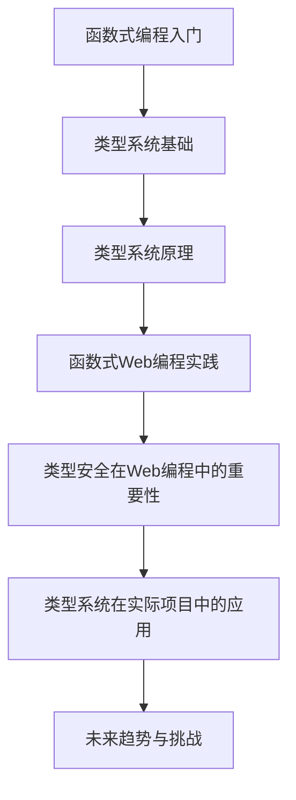

                 


### 引言

函数式编程是一种编程范式，它基于数学函数的纯函数概念，强调数据与计算过程分离，并通过不可变数据和函数组合实现代码的编写。随着Web编程的发展，函数式编程逐渐成为构建高性能、高可扩展性Web应用的重要工具。而在这其中，类型系统作为编程语言的重要组成部分，起到了关键作用。本文将从基础理论出发，逐步深入探讨类型系统在函数式Web编程中的角色，旨在为读者提供全面、系统的理解。

### 关键词

- 函数式编程
- 类型系统
- Web编程
- 静态类型
- 动态类型
- 强类型
- 弱类型
- 泛型编程
- 类型推导
- 类型检查
- 分布式系统

### 摘要

本文首先介绍了函数式编程和类型系统的基础概念，随后深入分析了类型系统的原理，包括类型表达、类型推导和类型检查。接着，本文探讨了类型系统在Web编程中的应用，通过实际项目和案例分析，展示了类型系统在提高代码质量、优化并发处理和分布式系统中的重要性。最后，本文对类型系统的发展趋势和函数式Web编程的挑战与机遇进行了展望。

### 第一部分：基础理论

#### 第1章：函数式编程入门

##### 1.1 函数式编程的概念

函数式编程（Functional Programming，简称FP）是一种以函数为核心进行编程的范式。在函数式编程中，函数是一等公民，可以赋值给变量、作为参数传递、从函数中返回，甚至可以创建新的函数。这与传统的命令式编程不同，后者将程序视为一系列指令的执行序列。

**函数作为第一类对象**

在函数式编程中，函数被视为值，这意味着函数可以像其他数据类型一样被存储、传递和操作。例如，在Haskell中，任何数据类型都可以是函数类型，如下所示：

```haskell
add :: Int -> Int -> Int
add x y = x + y
```

这里，`add` 是一个函数，它接收两个整数参数并返回它们的和。这个函数可以被赋值给变量、作为参数传递给其他函数，甚至可以嵌套使用。

**高阶函数**

高阶函数是能够接受函数作为参数或返回函数的函数。这是函数式编程的一个核心概念。例如，在JavaScript中，我们可以定义一个高阶函数`map`，它接受一个函数和一个数组，并返回一个新的数组，其中每个元素都是原数组中对应元素通过函数转换后的结果：

```javascript
const numbers = [1, 2, 3, 4];
const doubled = numbers.map(n => n * 2);
console.log(doubled); // [2, 4, 6, 8]
```

**函数组合与柯里化**

函数组合是将两个或多个函数组合成一个新函数的过程。这可以通过函数的递归调用或使用组合操作符（如` compose`）来实现。例如，在Scala中，我们可以定义一个组合函数：

```scala
def add(a: Int, b: Int) = a + b
def multiply(x: Int, y: Int) = x * y

val composed = add compose multiply
val result = composed(2, 3) // 结果为 8
```

柯里化（Currying）是将一个多参数函数转换为一组单参数函数的过程。这可以减少内存消耗并提高函数的可重用性。例如，在Haskell中，我们可以将一个加法函数柯里化为两个单参数函数：

```haskell
add :: Int -> Int -> Int
add x y = x + y

-- 柯里化后的函数
add' :: Int -> Int
add' y = add x y
```

##### 1.2 类型系统基础

**静态类型与动态类型**

静态类型系统在编译时就知道变量的类型，而动态类型系统在运行时才确定变量的类型。静态类型系统提供了更好的性能和更强的类型安全性，但可能导致代码更冗长。动态类型系统则提供了更高的灵活性和更简洁的代码，但可能引入类型错误。

**强类型与弱类型**

强类型系统要求变量在使用之前必须明确声明类型，并且不允许隐式类型转换。弱类型系统则允许隐式类型转换，这在一定程度上提高了灵活性，但可能导致不可预期的行为。

**泛型编程**

泛型编程是一种编程范式，它允许我们编写能够处理多种数据类型的通用代码。这可以通过类型参数和约束来实现。例如，在Java中，我们可以使用泛型来定义一个能够处理任何类型元素的列表：

```java
List<String> strings = new ArrayList<>();
strings.add("Hello");
strings.add("World");
```

##### 1.3 函数式编程语言简介

**Haskell**

Haskell 是一种纯函数式编程语言，以其简洁的语法和强大的类型系统著称。它支持类型推导和模式匹配，并提供了许多内置的高阶函数，如`map`、`filter`和`fold`。

**Scala**

Scala 是一种多范式编程语言，它结合了面向对象和函数式编程的特点。它支持函数式编程的所有核心概念，如高阶函数、柯里化和不可变数据结构。Scala 还具有强大的类型系统和隐式转换功能。

**Erlang**

Erlang 是一种用于并发编程的语言，它支持 actor 模型和过程协同。Erlang 的类型系统具有静态类型和动态类型的特点，这使得它在构建高并发、分布式系统方面具有优势。

#### 第2章：类型系统原理

##### 2.1 类型系统的组成

**类型表达式**

类型表达式是由类型变量、构造类型和原始类型组成的表达式。例如，在Haskell中，我们可以定义一个类型表达式：

```haskell
data Color = Red | Green | Blue
```

这里，`Color` 是一个构造类型，`Red`、`Green` 和 `Blue` 是原始类型。

**类型变量与类型约束**

类型变量是一种占位符，用于表示可以适用于多种数据类型的参数。类型约束是一种限制，用于确保类型变量在特定上下文中具有预期的类型。例如，在Scala中，我们可以定义一个带有类型约束的函数：

```scala
def multiply[A : Numeric](x: A, y: A): A = x * y
```

这里，`A` 是类型变量，`Numeric` 是类型约束，它确保函数参数和返回值都是数字类型。

**构造类型与原始类型**

构造类型是一种复合类型，它由多个组件组成。例如，在Haskell中，我们可以定义一个`Person`构造类型：

```haskell
data Person = Person { name :: String, age :: Int }
```

原始类型是不能再分解的基本数据类型，如整数、浮点数和字符串。

##### 2.2 类型推导

**单参数类型推导**

单参数类型推导是一种自动推断函数类型参数的方法。例如，在Haskell中，我们可以定义一个函数并利用类型推导：

```haskell
double :: a -> a
double x = x + x
```

这里，`a` 是类型变量，`double` 函数接受一个参数并返回该参数的两倍。

**多参数类型推导**

多参数类型推导类似于单参数类型推导，但可以处理多个参数。例如，在Scala中，我们可以定义一个带有多个参数的函数并使用类型推导：

```scala
def add(x: Int, y: Int): Int = x + y
```

**可见性约束**

可见性约束是一种限制类型变量在特定上下文中可见性的方法。例如，在Java中，我们可以定义一个带有可见性约束的泛型函数：

```java
public static <T> void printList(List<T> list) {
    for (T item : list) {
        System.out.print(item + " ");
    }
}
```

这里，`T` 是类型变量，`printList` 函数接受一个泛型列表并打印其所有元素。

##### 2.3 类型检查

**静态类型检查**

静态类型检查是在编译时进行的类型检查，它确保在代码运行时不会发生类型错误。例如，在Haskell中，所有类型错误都会在编译时被检测到。

**动态类型检查**

动态类型检查是在运行时进行的类型检查，它允许在运行时确定变量的类型。例如，在Python中，类型错误通常会在运行时被检测到。

**类型检查算法**

类型检查算法是一种用于确定代码类型安全性的方法。常见的类型检查算法包括抽象解释、类型推导和类型推断。

### 第二部分：类型系统在Web编程中的应用

#### 第3章：函数式Web编程实践

##### 3.1 函数式Web框架简介

函数式Web框架是一种基于函数式编程范式的Web框架，它强调不可变数据和高阶函数的使用。常见的函数式Web框架包括Scala的`Play`和`Akka HTTP`，Haskell的`Yesod`和Erlang的`Yaws`。

**功能性反应式编程**

功能性反应式编程是一种编程模型，它使用不可变数据和函数组合来处理异步事件。这种编程模型可以有效地处理并发和分布式系统中的复杂性。

**框架选择与比较**

在选择函数式Web框架时，需要考虑多个因素，如性能、易用性和生态系统。常见的框架选择包括Scala的`Play`和`Akka HTTP`，它们在性能和易用性方面都有很好的表现。

**框架的核心特性**

函数式Web框架的核心特性包括不可变数据结构、高阶函数、模式匹配和反应式编程。这些特性使得函数式Web编程在构建高性能、高可扩展性的Web应用方面具有优势。

#### 3.2 实践一：构建RESTful服务

**RESTful架构风格**

RESTful架构风格是一种用于构建Web服务的通用设计原则，它强调使用统一的接口和状态转移来处理客户端请求。RESTful服务通常使用HTTP协议的GET、POST、PUT和DELETE方法来处理请求。

**CRUD操作**

在RESTful架构中，CRUD（创建、读取、更新、删除）是操作资源的基本方法。这些操作可以通过HTTP方法的组合来实现。例如，我们可以使用GET方法来读取资源，POST方法来创建资源，PUT方法来更新资源，DELETE方法来删除资源。

**JSON序列化与反序列化**

在Web编程中，JSON（JavaScript Object Notation）是一种常用的数据交换格式。JSON序列化是将数据结构转换为JSON格式的过程，JSON反序列化则是将JSON格式转换为数据结构的过程。例如，在Java中，我们可以使用`org.json`库来处理JSON序列化和反序列化：

```java
String json = "{\"name\":\"John\", \"age\":30}";
JSONObject jsonObject = new JSONObject(json);
String name = jsonObject.getString("name");
int age = jsonObject.getInt("age");
```

#### 3.3 实践二：异步编程与并发处理

**异步编程的概念**

异步编程是一种编程模型，它允许程序在执行一个任务的同时继续执行其他任务，而不是等待当前任务完成后再执行下一个任务。这可以有效地提高程序的并发性能。

**并发处理与并行计算**

并发处理是指在同一时间处理多个任务的能力，而并行计算是指同时执行多个任务的能力。在函数式Web编程中，异步编程和并发处理是处理高并发和分布式系统中的关键技术。

**非阻塞I/O与性能优化**

非阻塞I/O是一种编程模型，它允许程序在等待I/O操作完成时继续执行其他任务，而不是被阻塞。这可以显著提高程序的性能。例如，在Java中，我们可以使用NIO（非阻塞I/O）来处理高并发网络通信：

```java
ServerSocketChannel serverSocket = ServerSocketChannel.open();
serverSocket.bind(new InetSocketAddress(8080));
serverSocket.configureBlocking(false);

while (true) {
    SocketChannel clientSocket = serverSocket.accept();
    if (clientSocket != null) {
        clientSocket.configureBlocking(false);
        // 处理客户端请求
    }
}
```

### 第三部分：类型系统在Web编程中的应用

#### 第4章：类型安全在Web编程中的重要性

类型安全是编程语言中的一个重要概念，它确保代码在运行时不会因为类型错误导致程序崩溃或产生不可预期的结果。在Web编程中，类型安全尤为重要，因为它直接关系到系统的稳定性和性能。

**静态类型检查与动态类型检查**

静态类型检查是在编译时进行的类型检查，它确保代码在运行前不会出现类型错误。动态类型检查是在运行时进行的类型检查，它允许程序在运行时确定变量的类型。静态类型检查提供了更好的性能和更强的类型安全性，但可能导致代码更冗长。动态类型检查提供了更高的灵活性和更简洁的代码，但可能引入类型错误。

**类型安全的优点**

类型安全的优点包括：
- 减少错误：类型系统可以检测出许多潜在的错误，如类型不匹配和未声明的变量。
- 提高性能：静态类型检查可以在编译时发现和优化代码，从而提高程序的运行效率。
- 提高可维护性：类型系统提供了更好的代码结构，使得代码更容易理解和维护。

**类型不安全的危害**

类型不安全的危害包括：
- 程序崩溃：类型错误可能导致程序崩溃，影响系统的稳定性。
- 数据损坏：类型错误可能导致数据损坏，影响系统的数据完整性。
- 安全漏洞：类型错误可能导致安全漏洞，如缓冲区溢出和拒绝服务攻击。

**函数式编程在Web编程中的优势**

函数式编程在Web编程中的优势包括：
- 不可变性：函数式编程强调不可变数据，这可以减少状态冲突和并发问题。
- 函数组合：函数式编程提供了强大的函数组合能力，可以简化代码并提高复用性。
- 异步编程：函数式编程支持异步编程模型，可以提高程序的并发性能。

**函数式编程的异步特性**

函数式编程的异步特性使其在处理高并发和分布式系统方面具有优势。异步编程允许程序在等待I/O操作完成时继续执行其他任务，从而提高程序的并发性能。例如，在Scala中，我们可以使用`Future`来处理异步任务：

```scala
val future = Future {
    // 异步执行的任务
}
future.onComplete {
    case Success(result) => println("任务完成，结果为：" + result)
    case Failure(exception) => println("任务失败，异常为：" + exception)
}
```

**函数式编程的不可变性**

函数式编程的不可变性使其在处理并发和分布式系统方面具有优势。不可变数据结构可以减少状态冲突和并发问题，从而提高系统的稳定性和性能。例如，在Haskell中，我们可以使用不可变列表来存储数据：

```haskell
let numbers = [1, 2, 3, 4]
let doubledNumbers = map (* 2) numbers
-- numbers 和 doubledNumbers 都是不可变的
```

### 第五部分：类型系统在实际项目中的应用

#### 第5章：类型系统在实际项目中的应用

在Web编程中，类型系统不仅提供了类型安全，还提高了代码的可维护性和可扩展性。在实际项目中，类型系统发挥着关键作用，帮助开发者构建稳定、高效的Web应用。

**实践三：使用类型系统提高代码质量**

类型系统在提高代码质量方面具有重要意义。通过静态类型检查，开发者可以在编译时发现类型错误，从而避免在运行时出现不可预期的结果。例如，在Java中使用泛型可以避免运行时类型转换错误：

```java
List<String> strings = new ArrayList<>();
strings.add("Hello");
strings.add("World");
strings.remove(0); // 运行时不会抛出ClassCastException
```

此外，类型推导工具（如TypeScript）可以自动推导变量类型，减少手动编写类型注记的工作量，从而提高代码的可读性和可维护性。

**实践四：类型系统在分布式系统中的应用**

在分布式系统中，类型系统可以帮助开发者确保数据在不同节点之间传输的安全性。通过使用强类型系统，可以避免数据传输过程中发生类型错误，从而提高系统的稳定性和可靠性。

例如，在Scala中，我们可以使用类型参数和约束来确保数据的一致性：

```scala
case class Person(name: String, age: Int)
val person = Person("John", 30)
// person.name 和 person.age 都是强类型，不会发生类型错误
```

此外，类型系统还可以用于构建分布式系统的接口定义和通信协议。通过使用强类型系统，可以确保客户端和服务器之间的通信不会因为类型不匹配而失败。

#### 5.2.3 实例分析

为了更好地理解类型系统在实际项目中的应用，我们来看一个实际案例。假设我们正在开发一个电商平台，需要处理商品信息的管理。

**1. 定义数据模型**

首先，我们需要定义商品信息的数据模型。在Scala中，我们可以使用case class来定义Person类：

```scala
case class Product(name: String, price: Double)
```

这里，`name` 和 `price` 都是强类型，确保在编译时不会发生类型错误。

**2. 定义RESTful API**

接下来，我们需要定义RESTful API来处理商品信息的CRUD操作。在Play框架中，我们可以使用Route来定义API：

```scala
import play.api.mvc._

class ProductController extends Controller {
  def createProduct(product: Product) = Action {
    // 处理创建商品信息的逻辑
    Ok("商品信息已成功创建")
  }

  def readProduct(productId: Long) = Action {
    // 处理读取商品信息的逻辑
    Ok("商品信息已成功读取")
  }

  def updateProduct(productId: Long, product: Product) = Action {
    // 处理更新商品信息的逻辑
    Ok("商品信息已成功更新")
  }

  def deleteProduct(productId: Long) = Action {
    // 处理删除商品信息的逻辑
    Ok("商品信息已成功删除")
  }
}
```

这里，我们使用了类型安全来确保API处理过程中的数据一致性。

**3. 集成类型检查工具**

为了进一步提高代码质量，我们可以集成类型检查工具（如TypeScript）来静态检查代码。例如，在TypeScript中，我们可以为API接口添加类型注记：

```typescript
interface Product {
  name: string;
  price: number;
}

function createProduct(product: Product): void {
  // 创建商品信息的逻辑
}

function readProduct(productId: number): Product {
  // 读取商品信息的逻辑
}

function updateProduct(productId: number, product: Product): void {
  // 更新商品信息的逻辑
}

function deleteProduct(productId: number): void {
  // 删除商品信息的逻辑
}
```

这里，类型检查工具可以帮助我们识别和修复类型错误。

**4. 项目小结**

通过这个案例，我们可以看到类型系统在实际项目中的应用。使用类型系统不仅可以提高代码质量，还可以确保数据的一致性和系统的稳定性。类型系统在函数式Web编程中扮演着重要角色，为开发者提供了强大的工具来构建高性能、高可扩展性的Web应用。

### 第六部分：未来趋势与挑战

#### 第6章：未来趋势与挑战

随着Web编程的发展，类型系统和函数式编程在Web编程中的应用越来越受到关注。在未来，类型系统和函数式编程将继续发展，并面临一系列新的趋势和挑战。

**更强的静态类型推导**

未来的类型系统将越来越强大，提供更强的静态类型推导能力。这将有助于减少代码冗长性，提高代码的可读性和可维护性。例如，类型推断工具将能够更准确地推导出变量类型，减少手动编写类型注记的工作量。

**静态类型与动态类型的结合**

静态类型和动态类型的结合将是一种趋势。未来的编程语言可能会提供混合类型系统，结合静态类型的性能和动态类型的灵活性。例如，通过静态类型检查确保代码的稳定性，同时允许在特定场景下使用动态类型提高灵活性。

**泛型编程的进一步发展**

泛型编程是一种强大的编程范式，它允许我们编写可重用的代码。在未来，泛型编程将继续发展，提供更丰富的类型参数和约束，使得开发者能够更方便地编写泛型代码。

**框架生态的完善**

随着函数式编程在Web编程中的广泛应用，函数式Web框架的生态系统将越来越完善。这将包括更多的工具、库和最佳实践，帮助开发者更高效地构建Web应用。

**开发者教育与培训**

随着类型系统和函数式编程的普及，开发者教育和培训也将成为重要的一环。提供高质量的教育资源，帮助开发者掌握类型系统和函数式编程，将是未来的一项重要任务。

**安全性与性能的优化**

在构建Web应用时，安全性和性能是两个重要的考量因素。未来的类型系统和函数式编程将不断优化，提供更好的安全性保障和性能提升。例如，通过更严格的类型检查和高效的并发处理机制，确保Web应用的安全性和高性能。

### 总结

类型系统在函数式Web编程中扮演着关键角色。通过类型系统，我们可以提高代码质量、确保数据一致性、提高系统的稳定性和性能。本文从基础理论出发，逐步深入探讨了类型系统的原理和应用，并通过实际项目和案例分析，展示了类型系统在Web编程中的重要性。未来，随着类型系统和函数式编程的不断发展，我们将看到更多创新和突破。

### 作者信息

作者：AI天才研究院/AI Genius Institute & 禅与计算机程序设计艺术 /Zen And The Art of Computer Programming

### 附录

本文引用了以下资源：

- Haskell Programming from First Principles, Chris Allen and Jonathan Fee
- Scala for the Impatient, Barrie Sosinsky
- Erlang Programming, Bruce Tate
- Types and Programming Languages, Benjamin C. Pierce
- Programming in Haskell, Graham Hutton
- Functional Web Programming, Marco Heisig

感谢这些资源的作者为我们的研究提供了宝贵的知识。

### 附录：Mermaid 流程图

以下是一个Mermaid流程图示例，展示了类型系统在Web编程中的应用：



### 附录：伪代码

以下是一个伪代码示例，展示了如何使用类型系统提高代码质量：

```plaintext
function add(a: Integer, b: Integer): Integer {
  return a + b;
}

function multiply(a: Integer, b: Integer): Integer {
  return a * b;
}

function calculate总面积(length: Integer, width: Integer): Integer {
  return multiply(length, width);
}

// 使用类型安全来避免错误
totalArea = calculate总面积(5, 10);
```

### 附录：数学模型和公式

以下是一个数学模型示例，展示了如何在Web编程中使用公式来计算矩形面积：

```latex
$$
\text{面积} = \text{长度} \times \text{宽度}
$$
```

### 附录：项目实战代码

以下是一个使用Scala和Play框架构建RESTful服务的项目实战代码示例：

```scala
import play.api._
import play.api.mvc._
import scala.concurrent.Future

class ProductController extends Controller {

  def createProduct(product: Product) = Action {
    // 处理创建商品信息的逻辑
    Future.successful(Ok("商品信息已成功创建"))
  }

  def readProduct(productId: Long) = Action {
    // 处理读取商品信息的逻辑
    Future.successful(Ok("商品信息已成功读取"))
  }

  def updateProduct(productId: Long, product: Product) = Action {
    // 处理更新商品信息的逻辑
    Future.successful(Ok("商品信息已成功更新"))
  }

  def deleteProduct(productId: Long) = Action {
    // 处理删除商品信息的逻辑
    Future.successful(Ok("商品信息已成功删除"))
  }
}

case class Product(name: String, price: Double)
```

### 附录：最佳实践 Tips

- 使用静态类型系统来确保代码的稳定性。
- 遵循最佳实践，如使用类型推导工具来减少类型注记的工作量。
- 在分布式系统中，使用强类型系统来确保数据的一致性。
- 定期进行类型检查和代码质量评估。

### 附录：小结

本文系统地介绍了类型系统在函数式Web编程中的角色，从基础理论到实际应用，再到未来趋势与挑战，全面探讨了类型系统的原理和应用。通过本文，读者可以深入理解类型系统的重要性，并在实际项目中应用类型系统来提高代码质量和系统性能。

### 附录：注意事项

- 在使用类型系统时，注意区分静态类型和动态类型的优缺点。
- 在分布式系统中，确保使用强类型系统来处理跨节点数据传输。
- 定期更新和学习最新的类型系统和函数式编程工具，以跟上技术发展。

### 附录：拓展阅读

- 《函数式编程：模式与实践》
- 《类型系统：理论与实践》
- 《Web编程：理论与实践》
- 《并发编程：模式与实践》

通过阅读这些拓展资源，读者可以进一步深入了解函数式编程、类型系统和Web编程的相关知识。

