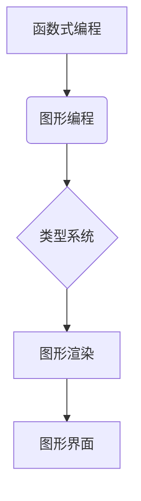
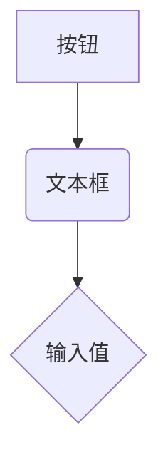

                 

### 1.1 函数式编程与图形编程的关系

#### 背景介绍

函数式编程（Functional Programming, FP）和图形编程（Graphical Programming）是两种不同的编程范式，它们各自在编程领域有着广泛的应用。函数式编程是一种以函数作为基本构建块的编程范式，它强调函数的纯函数性和无状态性。而图形编程则是一种通过图形界面进行编程的方法，它通常涉及图形用户界面（GUI）的设计和实现。

随着计算机技术的发展，这两种编程范式逐渐融合，产生了函数式图形编程（Functional Graphical Programming）。函数式图形编程结合了函数式编程的抽象能力和图形编程的直观性，为开发者提供了一种新的编程模式。

#### 核心概念与联系

函数式编程的核心概念包括纯函数、不可变性、高阶函数和递归等。图形编程的核心概念包括图形元素、事件处理和图形渲染等。这两个领域的关键联系在于类型系统。

**类型系统**在函数式编程和图形编程中都起着至关重要的作用。类型系统确保了程序的正确性和安全性，它使得函数的输入和输出都具有明确的类型，避免了类型错误和内存泄漏等问题。

**Mermaid 流程图**展示了函数式编程、图形编程和类型系统之间的关系：



在这个流程图中，函数式编程为图形编程提供了抽象的函数，而类型系统则确保了这些函数的正确性和安全性。图形渲染和图形界面则分别是函数式编程和图形编程的具体应用。

#### 核心算法原理讲解

**伪代码**用于解释函数式编程和图形编程的基本算法原理：

```plaintext
// 函数式编程的基本操作：映射
map(list, function) {
  result = []
  for each item in list {
    result.append(function(item))
  }
  return result
}

// 图形渲染的伪代码
render图形(element) {
  parameters = calculateRenderingParameters(element)
  renderToScreen(parameters)
}
```

在这个例子中，`map` 函数是对列表中的每个元素应用一个函数，并返回一个新的列表。这是函数式编程中的基本操作。而`render图形` 函数则是根据元素计算渲染参数，并在屏幕上渲染图形，这是图形编程的一部分。

通过这种方式，函数式编程和图形编程可以被有效地结合，使得开发者能够以更抽象和直观的方式构建图形界面和图形渲染程序。

#### 数学模型和公式

在函数式编程中，函数是一等公民，这意味着函数可以被赋值给变量、作为参数传递给其他函数，或者从其他函数中返回。这可以通过以下数学公式来表示：

$$ f(x) = \text{pure function} $$

其中，$f(x)$ 是一个纯函数，它接受一个输入$x$，并返回一个输出，而不依赖于外部状态。

在图形编程中，图形元素之间的关系可以用图来表示。例如，一个图形界面可以被视为一个有向图，其中每个节点表示一个图形元素，每条边表示元素之间的依赖关系。这可以通过以下数学公式来表示：

$$ G = (V, E) $$

其中，$G$ 是图形，$V$ 是节点集合，$E$ 是边集合。

#### 详细讲解与举例说明

**举例说明**：

假设我们有一个函数`drawCircle`，用于绘制一个圆。这个函数可以被视为一个纯函数，因为它接受输入（圆的半径和位置），并返回一个图形元素，而不依赖于外部状态。

```plaintext
// 伪代码：绘制圆
drawCircle(radius, position) {
  // 根据半径和位置计算圆的参数
  parameters = calculateCircleParameters(radius, position)
  // 使用图形库绘制圆
  graphicsLibrary.drawCircle(parameters)
}
```

在这个例子中，`drawCircle` 函数是一个纯函数，它接受两个输入参数（半径和位置），并返回一个图形元素。这个函数可以被视为一个独立的组件，可以被其他函数调用，例如在图形界面中绘制多个圆。

在图形编程中，我们可以使用图来表示图形元素之间的关系。例如，在一个图形界面中，一个按钮可能依赖于一个文本框的输入值。这种依赖关系可以用图表示：



在这个图中，按钮（$A$）依赖于文本框（$B$），而文本框又依赖于输入值（$C$）。这种依赖关系可以用以下数学公式表示：

$$ A \rightarrow B \rightarrow C $$

通过这种方式，我们可以使用函数式编程和图形编程来构建复杂的图形界面，同时确保程序的正确性和安全性。

---

### 1.2 函数式图形编程的历史背景

#### 背景介绍

函数式图形编程的历史可以追溯到20世纪80年代，当时函数式编程和图形编程分别成为了两个独立的研究领域。函数式编程的代表人物是Haskell Curry和John Backus，他们提出了函数式编程的基本概念。而图形编程则起源于图形用户界面（GUI）的设计和实现，最早由Xerox PARC提出。

随着时间的推移，这两种编程范式逐渐融合，函数式图形编程开始出现。最早的函数式图形编程语言之一是Haskore，它结合了Haskell编程语言和图形渲染能力。Haskore允许开发者使用函数式编程的方法来创建和操作图形元素。

#### 重要事件和里程碑

- **1987年**：Haskore语言首次发布，标志着函数式图形编程的诞生。
- **1990年代**：Elm和Purescript等新一代函数式图形编程语言开始出现，它们在类型安全和性能方面进行了改进。
- **2000年代**：随着Web技术的发展，函数式图形编程在浏览器端的应用逐渐兴起，代表性语言包括React和Vue.js。
- **2010年代**：函数式图形编程语言开始应用于移动端开发，例如React Native和Swift UI。
- **2020年代**：随着人工智能和机器学习的兴起，函数式图形编程在数据可视化和图形分析等领域得到了广泛应用。

#### 核心发展路径

1. **从Haskore到Elm**：Haskore是第一个函数式图形编程语言，它结合了Haskell编程语言和图形渲染能力。Elm作为Haskore的继任者，在类型安全和性能方面进行了大量改进，成为现代函数式图形编程语言中的代表。

2. **Web图形编程**：随着Web技术的发展，函数式图形编程开始应用于浏览器端。代表性语言包括React和Vue.js，它们提供了强大的图形渲染能力和高效的性能。

3. **移动端开发**：函数式图形编程语言逐渐应用于移动端开发，例如React Native和Swift UI。这些语言提供了跨平台的开发能力，使得开发者可以同时为iOS和Android平台构建应用程序。

4. **数据可视化和图形分析**：随着人工智能和机器学习的兴起，函数式图形编程在数据可视化和图形分析领域得到了广泛应用。代表性语言包括D3.js和Plotly.js，它们提供了丰富的图形渲染库和数据处理能力。

#### 影响和意义

函数式图形编程的兴起对编程领域产生了深远的影响。它为开发者提供了一种新的编程范式，使得图形编程变得更加直观和高效。同时，函数式图形编程在类型安全性和性能方面具有显著优势，使得开发者能够构建更可靠和高效的图形应用程序。

通过函数式图形编程，开发者可以以更抽象的方式描述图形界面和图形渲染过程，从而提高开发效率。此外，函数式图形编程在数据可视化和图形分析等领域具有广泛的应用前景，为人工智能和机器学习的发展提供了有力支持。

---

### 1.3 函数式图形编程的优势

#### 背景介绍

函数式图形编程（Functional Graphical Programming）结合了函数式编程和图形编程的优点，为开发者提供了一种新的编程范式。在函数式图形编程中，开发者可以使用函数来构建图形界面和图形渲染过程，从而实现高效、直观和安全的编程。

与传统的编程方法相比，函数式图形编程具有显著的优势。这些优势主要体现在以下几个方面：

1. **类型安全**：函数式图形编程通过类型系统确保程序的正确性和安全性。类型系统可以捕获潜在的错误，例如类型不匹配和未处理的异常，从而减少程序的Bug数量。

2. **可组合性**：函数式编程的核心思想是函数的组合。在函数式图形编程中，开发者可以使用纯函数和不可变数据结构来构建复杂的图形界面和图形渲染过程。这种方式使得代码更易于理解和维护。

3. **可测试性**：由于函数式编程的纯函数性和不可变性，函数式图形编程具有出色的可测试性。开发者可以单独测试每个函数，而不必担心全局状态的影响。这大大提高了测试效率和代码质量。

4. **性能优化**：函数式图形编程在性能优化方面具有显著优势。由于函数的组合和不可变性，函数式图形编程可以更容易地实现懒加载和缓存等技术，从而提高程序的性能。

5. **直观性**：图形编程通过图形界面提供了直观的编程体验。在函数式图形编程中，开发者可以使用函数式编程的方法来构建和操作图形界面，从而实现更直观和高效的编程。

#### 类型系统的优势

类型系统在函数式图形编程中起着至关重要的作用。类型系统的优势主要体现在以下几个方面：

1. **静态类型检查**：静态类型检查可以在编译时捕获类型错误，从而减少运行时错误。这对于大型项目尤其重要，因为运行时错误可能导致严重的后果。

2. **增强可读性**：类型系统使得代码更易于理解。通过明确的类型注释，开发者可以快速了解函数的输入和输出类型，从而减少理解代码的难度。

3. **提高性能**：静态类型系统可以在编译时进行优化，从而提高程序的运行效率。与动态类型系统相比，静态类型系统可以提供更好的性能。

4. **类型推导**：现代函数式图形编程语言通常支持类型推导，这使得编写类型注释变得更加容易。类型推导可以自动推导出函数的输入和输出类型，从而减少手工编写类型注释的工作量。

5. **面向对象类型系统的融合**：许多现代函数式图形编程语言支持面向对象类型系统，这使得函数式编程和面向对象编程可以无缝融合。开发者可以在同一项目中同时使用这两种编程范式。

#### 总结

函数式图形编程通过结合函数式编程和图形编程的优点，提供了一种新的编程范式。它具有类型安全、可组合性、可测试性、性能优化和直观性等优势。此外，类型系统在函数式图形编程中起着至关重要的作用，它为开发者提供了强大的类型检查、可读性、性能优化和面向对象编程支持。通过函数式图形编程，开发者可以更高效、直观和安全地构建图形界面和图形渲染程序。

---

### 1.4 函数式图形编程的应用场景

#### 背景介绍

函数式图形编程（Functional Graphical Programming）的应用场景非常广泛，几乎涵盖了软件开发的所有领域。由于其类型安全和可组合性的特点，函数式图形编程在图形用户界面（GUI）设计、数据可视化、图形渲染和游戏开发等领域具有显著优势。

#### GUI设计与实现

在图形用户界面设计方面，函数式图形编程可以提供一种直观和高效的编程方法。通过使用函数和不可变数据结构，开发者可以轻松地构建和操作复杂的GUI组件。例如，Elm和Purescript等函数式图形编程语言提供了丰富的图形界面库，使得开发者可以快速构建高质量的GUI应用程序。

**应用示例**：

- **React**：React是JavaScript的一个函数式图形编程库，广泛用于构建用户界面。React通过虚拟DOM实现高效的图形渲染，并通过函数式编程方法确保组件的可组合性和可测试性。
- **Swift UI**：Swift UI是Apple推出的一个函数式图形编程框架，用于构建iOS、macOS和watchOS应用程序的图形界面。Swift UI使用Swift编程语言，提供了强大的图形渲染能力和类型安全。

#### 数据可视化

数据可视化是函数式图形编程的重要应用场景之一。通过函数式编程的方法，开发者可以轻松地创建和操作数据可视化图表，从而将复杂数据以直观的方式呈现给用户。

**应用示例**：

- **D3.js**：D3.js是一个基于JavaScript的函数式图形编程库，广泛用于创建数据可视化图表。D3.js提供了丰富的图形渲染库和数据处理能力，使得开发者可以轻松地实现复杂的数据可视化效果。
- **Plotly.js**：Plotly.js是一个基于JavaScript的函数式图形编程库，提供了丰富的图表类型和数据可视化工具。Plotly.js支持多种图形渲染技术，包括WebGL和SVG，使得开发者可以创建高质量的交互式数据可视化图表。

#### 图形渲染

图形渲染是函数式图形编程的另一个重要应用场景。在图形渲染中，开发者可以使用函数式编程的方法来优化渲染流程，提高渲染效率。

**应用示例**：

- **WebGL**：WebGL是一种用于在Web浏览器中实现3D图形渲染的标准。通过函数式编程的方法，开发者可以使用WebGL API高效地渲染3D图形，从而实现复杂的图形渲染效果。
- **OpenGL**：OpenGL是一种广泛用于开发3D图形应用程序的编程接口。通过函数式编程的方法，开发者可以使用OpenGL API高效地渲染3D图形，从而实现高质量的图形渲染效果。

#### 游戏开发

函数式图形编程在游戏开发中也具有广泛的应用。通过函数式编程的方法，开发者可以构建高效、可组合的游戏引擎，从而实现复杂的游戏逻辑和图形渲染。

**应用示例**：

- **Unity**：Unity是一个流行的游戏开发引擎，支持函数式编程。通过使用Unity的C#脚本，开发者可以构建高效的函数式游戏逻辑和图形渲染。
- **Unreal Engine**：Unreal Engine是一个强大的游戏开发引擎，支持C++和蓝图系统。通过使用蓝图系统，开发者可以使用函数式编程的方法构建高效的图形渲染和游戏逻辑。

#### 总结

函数式图形编程在图形用户界面设计、数据可视化、图形渲染和游戏开发等领域具有广泛的应用场景。通过函数式编程的方法，开发者可以构建高效、直观和高质量的图形界面和图形渲染程序。随着函数式图形编程语言的不断发展，其在各个领域中的应用前景将更加广阔。

---

### 2.1 类型系统的基本原理

#### 背景介绍

类型系统是编程语言的核心组成部分，它定义了变量、表达式和函数的类别，从而保证了程序的正确性和可靠性。类型系统的基本原理包括类型、类型检查和类型转换等。这些原理在不同的编程语言中有着不同的实现方式，但它们的核心目标都是确保程序的安全性、性能和可读性。

#### 类型

类型是编程语言中的一种抽象概念，用于表示数据的不同类别。在编程中，类型定义了变量可以存储的数据类型，以及操作这些变量的方法。常见的类型包括整型、浮点型、布尔型、字符串型等。

- **基本类型**：基本类型是编程语言中最基础的类型，如整数（int）、浮点数（float）、布尔值（bool）等。基本类型通常由编译器直接处理，具有较高的性能。
- **复合类型**：复合类型是由基本类型组合而成的类型，如数组、结构体、类等。复合类型可以存储多个值，并提供丰富的操作方法。
- **函数类型**：函数类型是函数在编程语言中的表示方式。函数类型定义了函数的参数类型和返回类型，从而保证了函数的正确性和可预测性。

#### 类型检查

类型检查是在编译或运行程序时，对变量的类型进行验证的过程。类型检查可以确保程序中的每个操作都在正确的类型之间进行，从而避免类型错误和运行时错误。

- **静态类型检查**：静态类型检查在编译时进行，编译器在编译过程中检查类型错误。静态类型检查具有较高的性能，因为它可以在编译时捕获错误，从而避免运行时错误。
- **动态类型检查**：动态类型检查在运行时进行，程序在运行过程中检查类型错误。动态类型检查具有较高的灵活性，因为它允许变量在运行时改变类型。

#### 类型转换

类型转换是在不同类型之间进行数据转换的过程。类型转换可以确保不同类型的数据可以正确地传递和操作。

- **隐式类型转换**：隐式类型转换是自动进行的类型转换，编译器根据上下文自动将一种类型转换为另一种类型。例如，将整数转换为浮点数。
- **显式类型转换**：显式类型转换是手动进行的类型转换，开发者明确指定要转换的数据类型。例如，将字符串转换为整数。

#### 类型系统的发展

类型系统的发展经历了多个阶段，从简单的类型系统到现代复杂的类型系统。以下是一些重要的类型系统发展：

- **静态类型系统**：静态类型系统在编译时检查类型错误，如C++和Java等语言。
- **动态类型系统**：动态类型系统在运行时检查类型错误，如Python和JavaScript等语言。
- **静态类型系统与动态类型系统的结合**：许多现代编程语言结合了静态类型系统和动态类型系统的优点，如TypeScript和Go等语言。
- **函数式类型系统**：函数式类型系统用于函数式编程语言，如Haskell和Scala等语言。函数式类型系统强调了类型推导和类型检查的自动化。

#### 总结

类型系统是编程语言的核心组成部分，它定义了变量、表达式和函数的类别，从而保证了程序的正确性和可靠性。类型系统的基本原理包括类型、类型检查和类型转换等。通过类型系统，编程语言可以确保程序的安全性、性能和可读性。随着编程语言的发展，类型系统也在不断演进，以满足日益复杂的编程需求。

---

### 2.2 静态类型与动态类型

#### 背景介绍

静态类型（Static Type）和动态类型（Dynamic Type）是两种不同的类型系统，它们在编译或运行程序时对类型进行检查和验证的方式不同。静态类型在编译时进行类型检查，而动态类型在运行时进行类型检查。这两种类型系统各有优缺点，适用于不同的编程场景。

#### 静态类型的优点

1. **性能**：静态类型系统在编译时进行类型检查，可以提前捕获类型错误，从而避免运行时错误。这有助于提高程序的运行效率，尤其是在大型项目中。
2. **安全性**：静态类型系统可以确保变量在正确的类型之间进行操作，从而减少类型错误和内存泄漏等问题。
3. **可读性**：静态类型系统使得代码更易于理解，因为每个变量和函数都有明确的类型。这有助于提高代码的可维护性和可读性。
4. **代码重构**：静态类型系统支持代码重构，因为类型信息可以在编译时被编译器解析，从而减少重构过程中可能出现的问题。

#### 动态类型的优点

1. **灵活性**：动态类型系统允许变量在运行时改变类型，这使得编程更加灵活。例如，在Python中，同一个变量可以在不同的上下文中具有不同的类型。
2. **简洁性**：动态类型系统不需要显式声明变量类型，这使得代码更简洁。例如，在JavaScript中，变量不需要声明类型即可使用。
3. **快速迭代**：动态类型系统在运行时进行类型检查，这使得代码的迭代速度更快，因为不需要每次更改代码后都进行编译。
4. **动态类型推导**：许多现代动态类型系统支持类型推导，可以自动推导出变量和函数的类型，从而减少手工编写类型注释的工作量。

#### 静态类型的缺点

1. **冗余的类型声明**：静态类型系统要求开发者显式声明每个变量和函数的类型，这可能导致代码冗长。
2. **编译时间较长**：静态类型系统在编译时进行类型检查，可能导致编译时间较长，尤其是在大型项目中。
3. **限制灵活性**：静态类型系统对变量的类型有严格限制，这可能限制了编程的灵活性，尤其是在需要动态类型变化的情况下。

#### 动态类型的缺点

1. **运行时错误**：动态类型系统在运行时进行类型检查，可能导致运行时错误。例如，将字符串与数字进行运算可能导致错误。
2. **性能影响**：动态类型系统在运行时进行类型检查，可能导致性能下降。这尤其适用于需要频繁类型检查的大型应用程序。
3. **可维护性**：动态类型系统可能使代码更难维护，因为类型信息不是显式声明的。

#### 应用场景

- **静态类型**：适用于需要高性能和强类型安全性的大型项目，如系统软件、嵌入式系统和大型企业级应用程序。
- **动态类型**：适用于需要快速迭代和高度灵活性的小型项目、Web开发、脚本编写和快速原型开发。

#### 总结

静态类型和动态类型各有优缺点，适用于不同的编程场景。静态类型在性能和安全性方面具有优势，但可能影响代码的灵活性和简洁性。动态类型在灵活性和简洁性方面具有优势，但可能引入运行时错误和性能下降。开发者应根据项目需求和场景选择合适的类型系统。

---

### 2.3 类型系统的发展

#### 背景介绍

类型系统的发展是计算机科学领域的一个重要研究方向，它对编程语言的设计和优化有着深远的影响。从早期的简单类型系统到现代复杂的类型系统，类型系统的发展经历了多个阶段，不断适应新的编程需求和技术进步。

#### 传统类型系统的演进

1. **基本类型系统**：早期的编程语言如C和Pascal采用了基本类型系统，这些语言定义了有限的几种基本数据类型，如整数、浮点数、布尔值等。这种类型系统简单但功能有限。

2. **结构化类型系统**：随着面向对象编程的兴起，类型系统逐渐演变成结构化类型系统。结构化类型系统支持复合类型，如类、结构体和联合体，这些复合类型可以包含多个成员变量。

3. **函数类型系统**：函数类型系统是函数式编程的核心概念，它将函数视为一等公民，允许函数作为参数传递和返回。这种类型系统在Lisp和Haskell等语言中得到了广泛应用。

#### 面向对象类型系统的演进

1. **子类型和多态**：面向对象编程中的子类型和多态机制使得类型系统变得更加复杂。子类型允许子类继承父类的行为和属性，多态则允许使用通用接口处理不同类型的对象。

2. **抽象数据类型**：抽象数据类型（Abstract Data Type，ADT）是一种封装数据和处理操作的类型，它隐藏了内部实现的细节，提供了类型安全的外部接口。

3. **类型检查和类型推导**：现代面向对象编程语言如Java和C#引入了静态类型检查和类型推导机制，这些机制在编译时对类型进行检查，提高了程序的安全性和可维护性。

#### 函数式类型系统的演进

1. **纯函数和不可变性**：函数式编程强调纯函数和不可变性，这使得类型系统在确保程序的正确性和可预测性方面发挥了重要作用。纯函数具有无副作用和依赖外部状态的特点，而不可变性确保了数据在操作过程中不被修改。

2. **类型推导和类型系统**：现代函数式编程语言如Haskell和Scala引入了强大的类型推导机制，这使得开发者可以编写更简洁的代码，同时保证类型安全。

3. **高级类型系统**：函数式编程语言中的高级类型系统，如依赖类型（Dependent Types）和存在类型（Existential Types），提供了更强大的类型检查和抽象能力。

#### 未来趋势

1. **集成和融合**：未来的类型系统发展可能会趋向于融合不同编程范式的优点，如将函数式类型系统与面向对象类型系统相结合，提供更丰富的编程能力。

2. **智能类型检查**：随着人工智能技术的发展，未来的类型检查可能会变得更加智能，通过机器学习等技术自动优化类型推导和类型检查过程。

3. **类型安全与性能优化**：未来的类型系统发展将继续关注类型安全性和性能优化，以确保程序在高并发和大数据场景下的高效运行。

#### 总结

类型系统的发展经历了从简单到复杂、从基本到高级的过程，不断适应新的编程需求和技术进步。传统类型系统、面向对象类型系统和函数式类型系统各有特点，但都为编程语言提供了重要的基础。未来的类型系统发展将继续融合不同编程范式的优点，提供更强大的编程能力。

---

### 3.1 函数式类型系统的基本原理

#### 背景介绍

函数式类型系统（Functional Type System）是函数式编程语言中不可或缺的一部分，它为函数式编程提供了类型安全性和抽象能力。函数式类型系统通过定义函数类型和类型推导机制，确保程序的正确性和可维护性。了解函数式类型系统的基本原理对于深入理解函数式编程至关重要。

#### 函数类型

函数类型是函数式编程语言中的核心概念，它表示函数的输入和输出类型。函数类型通常表示为参数类型和返回类型的组合，例如 `(A -> B)` 表示一个接受类型为 `A` 的参数并返回类型为 `B` 的函数。

**伪代码示例**：

```plaintext
function add(a: Int, b: Int): Int {
  return a + b
}
```

在这个例子中，`add` 函数接受两个整型参数并返回一个整型结果，其函数类型为 `(Int -> Int -> Int)`。

#### 不可变数据类型

不可变数据类型是函数式编程中的另一个重要概念，它确保数据在创建后不会被修改。不可变数据类型通常用于实现纯函数和不可变数据结构，如列表、树和映射等。这种类型系统有助于确保程序的正确性和可维护性。

**伪代码示例**：

```plaintext
data List a = Nil | Cons a (List a)

function append(list1: List Int, list2: List Int): List Int {
  if list1 == Nil {
    return list2
  } else {
    return Cons(list1.head, append(list1.tail, list2))
  }
}
```

在这个例子中，`List` 是一个不可变数据类型，`append` 函数接受两个整型列表并返回一个新的整型列表。

#### 类型推导

类型推导是函数式类型系统的核心机制之一，它允许编译器在编写代码时自动推导出变量的类型，从而减少手动编写类型注释的工作量。类型推导可以基于模式匹配和类型推断规则实现。

**伪代码示例**：

```plaintext
function filter(list: List Int, predicate: (Int -> Bool)): List Int {
  result = Nil
  for each element in list {
    if predicate(element) {
      result = Cons(element, result)
    }
  }
  return result
}
```

在这个例子中，`filter` 函数的参数类型和返回类型都可以通过类型推导机制自动推导出来。

#### 高级类型系统

函数式类型系统还支持高级类型系统，如依赖类型（Dependent Types）和存在类型（Existential Types）。这些高级类型系统提供了更强大的类型抽象和编程能力。

**伪代码示例**：

```plaintext
data Pair a b = Pair a b

function swap <a b>(pair: Pair a b): Pair b a {
  return Pair (pair.b) (pair.a)
}
```

在这个例子中，`Pair` 类型是一个依赖类型，它允许创建依赖于另一个类型的元组。

#### 总结

函数式类型系统通过定义函数类型、不可变数据类型和类型推导机制，为函数式编程提供了强大的抽象和类型安全性。了解函数式类型系统的基本原理对于深入理解函数式编程和编写高效的函数式程序至关重要。

---

### 3.2 Polymorphism

#### 背景介绍

多态性（Polymorphism）是面向对象编程和函数式编程中的一项核心特性，它允许同一个接口实现多种不同的行为。多态性通过将不同的类型实例化为同一个接口类型，使得程序在运行时能够根据实例的实际类型选择相应的行为。在函数式编程中，多态性主要通过函数类型和类型类实现。

#### 子类型与类型兼容性

1. **子类型（Subtyping）**：子类型是一种类型兼容性概念，它允许一个类型在某种程度上被另一个更通用类型替代。在面向对象编程中，子类型通常通过继承实现。例如，在Java中，`Dog` 类型是 `Animal` 类型的子类型。

2. **类型兼容性（Type Compatibility）**：类型兼容性是指不同类型之间可以相互替换的能力。在多态性中，类型兼容性确保了函数可以接受更广泛的类型作为参数，而不会导致类型错误。

#### 函数类型与多态性

在函数式编程中，函数类型是实现多态性的关键。函数类型定义了函数接受的参数类型和返回类型。通过函数类型，可以实现参数的多态性和返回值的多态性。

**伪代码示例**：

```plaintext
// 参数多态性
function applyFunction(x: A, f: (A -> B)): B {
  return f(x)
}

// 返回值多态性
function identity <A>(x: A): A {
  return x
}
```

在这个例子中，`applyFunction` 函数接受一个参数 `x` 和一个函数 `f`，并根据 `f` 的类型返回相应的结果。`identity` 函数是一个接受任意类型参数并返回相同类型的函数。

#### 类型类与多态性

类型类（Type Class）是函数式编程中实现多态性的另一种机制。类型类定义了一组相关函数的接口，这些函数在运行时可以根据实际类型选择不同的实现。

**伪代码示例**：

```plaintext
// 定义类型类
typeclass Addable<A> {
  add: (A, A) -> A
}

// 实现整数的Addable类型类
instance Addable<Int> {
  add(a: Int, b: Int): Int {
    return a + b
  }
}

// 实现字符串的Addable类型类
instance Addable<String> {
  add(a: String, b: String): String {
    return a + b
  }
}

// 使用类型类实现多态性
function add <A>(a: A, b: A, adder: Addable<A>): A {
  return adder.add(a, b)
}
```

在这个例子中，`Addable` 类型类定义了一个 `add` 函数，它接受两个参数和一个类型类实例。通过实现不同的类型类实例，`add` 函数可以在运行时选择不同的实现。

#### 多态性与函数式编程

多态性在函数式编程中具有重要作用，它使得程序更灵活、更易于扩展。多态性允许开发者编写通用的函数和类型类，从而提高代码的复用性和可维护性。

**总结**：

多态性是函数式编程的核心特性之一，通过函数类型和类型类实现。子类型和类型兼容性确保了不同类型之间的兼容性，而函数类型和类型类提供了实现多态性的具体机制。多态性使得程序更灵活、更易于扩展，是函数式编程的重要优势之一。

---

### 3.3 Monomorphism

#### 背景介绍

单一形态（Monomorphism）是函数式编程中的一个重要概念，它指的是一个值只能有一个类型，并且在类型检查过程中保持不变。单一形态是函数式编程语言实现类型安全性的关键机制之一，它确保程序在运行时不会因为类型错误而出现意外行为。

#### 单一形态的特点

1. **类型确定性**：单一形态确保了每个值在编译时都有明确的类型，这使得编译器可以提前进行类型检查，从而避免运行时类型错误。
2. **不可变性**：单一形态保证了值的类型在程序执行过程中不会改变。这意味着一旦一个值被赋值给一个变量，它的类型就固定了，不能再被修改。
3. **类型安全**：由于单一形态确保了值的类型在编译时是已知的，这有助于提高程序的安全性，减少内存泄漏和未定义行为。

#### 单一形态的应用场景

单一形态在函数式编程中有着广泛的应用场景，以下是几个常见的应用场景：

1. **纯函数**：纯函数是函数式编程中的一个核心概念，它不接受外部状态，并且总是产生相同的输出。单一形态确保了纯函数在运行时的类型安全，因为它确保了函数的输入和输出类型在编译时是已知的。
2. **不可变数据结构**：不可变数据结构是函数式编程中常用的数据结构，如列表、树和映射等。单一形态确保了这些数据结构在创建后不会被修改，从而保证了程序的正确性和可预测性。
3. **类型推导**：许多现代函数式编程语言支持类型推导机制，这种机制可以根据代码的上下文自动推导出变量和函数的类型。单一形态使得类型推导更加可靠，因为它确保了每个值在编译时都有明确的类型。

#### 单一形态与泛型的关系

单一形态与泛型（Generic Programming）密切相关。泛型编程允许开发者编写可以处理多种数据类型的函数和类型类，而单一形态则确保了这些泛型函数和类型类在编译时的类型安全性。

1. **泛型函数**：泛型函数可以接受不同类型的参数并返回相应类型的值。单一形态确保了泛型函数在编译时知道每个参数的类型，从而避免运行时类型错误。
2. **泛型类型类**：泛型类型类定义了一组与类型相关的函数接口。单一形态确保了这些泛型类型类在编译时是类型安全的，因为每个类型类实例都有明确的类型。

#### 单一形态的优势

1. **类型安全**：单一形态确保了程序在运行时的类型安全，减少了类型错误和未定义行为的风险。
2. **编译时优化**：由于单一形态在编译时确定了值的类型，编译器可以提前进行类型检查和优化，从而提高程序的运行效率。
3. **可维护性**：单一形态使得程序更易于理解和维护，因为每个值在编译时都有明确的类型，减少了类型混乱和混淆。

#### 总结

单一形态是函数式编程中的一个核心概念，它确保了值的类型在编译时是已知的，从而提高了程序的安全性、可维护性和运行效率。通过单一形态，函数式编程语言实现了类型安全性和泛型编程的结合，为开发者提供了强大的抽象和编程能力。

---

### 4.1 Haskell

#### 背景介绍

Haskell是一种纯函数式编程语言，由Simon Peyton Jones等人在1990年代初设计。Haskell以其严谨的类型系统和强大的函数式编程特性而闻名，它旨在提供一种简洁、强大且易于推理的编程语言。Haskell的语法简洁明了，支持高阶函数、惰性计算和模式匹配等函数式编程概念。

#### Haskell的基本概念

1. **纯函数**：在Haskell中，纯函数是指没有副作用且输入和输出完全确定的函数。这意味着纯函数不会修改外部状态，并且对于相同的输入总是返回相同的输出。纯函数使得程序更易于推理和测试。
2. **类型系统**：Haskell采用静态类型系统，这意味着变量和函数的类型在编译时是已知的。Haskell的类型系统支持类型推断和类型类，使得编程更加灵活。
3. **惰性计算**：Haskell支持惰性计算，这意味着计算只在必要时进行。惰性计算可以提高程序的效率，因为它可以避免不必要的计算。

#### Haskell的类型系统

Haskell的类型系统是其核心特性之一，它提供了强大的类型安全和类型推导能力。以下是Haskell类型系统的一些关键概念：

1. **类型类**：类型类（Type Class）是一种抽象数据类型，它定义了一组与类型相关联的函数。类型类允许开发者编写泛型代码，使得函数可以操作多种不同类型的值。
2. **类型推导**：Haskell支持类型推导，这意味着编译器可以根据函数的输入和输出自动推导出其类型。类型推导使得编写类型注释变得更加简洁。
3. **存在类型**：存在类型（Existential Type）是一种泛型机制，它允许开发者隐藏具体类型的信息，从而编写更通用的代码。存在类型在模式匹配时被展开。

#### Haskell在函数式图形编程中的应用

Haskell在函数式图形编程中有着广泛的应用，它被用于创建图形渲染库和图形界面。以下是Haskell在函数式图形编程中的几个应用场景：

1. **图形渲染库**：Haskell的图形渲染库如OpenGLHask和HGL提供了强大的图形渲染能力。这些库允许开发者使用Haskell编写高性能的图形渲染程序，从而实现复杂的图形效果。
2. **图形界面**：Haskell的图形界面库如Haskell GUI Builder和GI Toolkit允许开发者使用Haskell构建图形界面。这些库支持事件处理、布局管理和样式定义，使得开发者可以轻松创建复杂的图形用户界面。
3. **数据可视化**：Haskell的数据可视化库如Chart和diagrams库提供了丰富的数据可视化工具。这些库允许开发者使用Haskell创建交互式图表和图形，从而将复杂数据以直观的方式呈现给用户。

#### 总结

Haskell是一种纯函数式编程语言，以其严谨的类型系统和强大的函数式编程特性而闻名。它支持纯函数、惰性计算和模式匹配等函数式编程概念，为开发者提供了简洁、强大且易于推理的编程语言。Haskell在函数式图形编程中有着广泛的应用，它被用于创建图形渲染库、图形界面和数据可视化工具，从而实现复杂的图形渲染和数据可视化效果。

---

### 4.2 Elm

#### 背景介绍

Elm是一种函数式图形编程语言，由 Evan Czaplicki 于 2012 年设计。Elm 的设计目标是创建一种简单、可靠且易于维护的前端编程语言。它结合了函数式编程和图形编程的特点，提供了类型安全、不可变数据结构和高效的图形渲染能力。Elm 的语法简洁明了，易于学习和使用，使得开发者可以快速构建高质量的用户界面。

#### Elm 的基本概念

1. **纯函数**：Elm 强调纯函数的使用，这意味着 Elm 函数不修改外部状态，并且对于相同的输入总是产生相同的输出。这种特性使得 Elm 程序更易于测试和维护。
2. **不可变数据结构**：Elm 使用不可变数据结构，这意味着数据一旦创建就无法修改。这种设计减少了状态冲突和副作用，提高了程序的可靠性和可预测性。
3. **类型推导**：Elm 的类型推导机制使得开发者无需显式声明变量类型，编译器可以根据函数的定义和调用上下文自动推导出变量的类型。

#### Elm 的类型系统

Elm 的类型系统是其核心特性之一，它提供了强大的类型安全和类型推导能力。以下是 Elm 类型系统的一些关键概念：

1. **类型类**：类型类（Type Class）是一种抽象数据类型，它定义了一组与类型相关联的函数。类型类允许开发者编写泛型代码，使得函数可以操作多种不同类型的值。
2. **存在类型**：存在类型（Existential Type）是一种泛型机制，它允许开发者隐藏具体类型的信息，从而编写更通用的代码。存在类型在模式匹配时被展开。
3. **类型别名**：类型别名（Type Aliases）是 Elm 中的语法特性，它允许开发者给类型定义别名，使得代码更简洁和易于理解。

#### Elm 在函数式图形编程中的应用

Elm 在函数式图形编程中有着广泛的应用，它被用于创建图形渲染库和图形界面。以下是 Elm 在函数式图形编程中的几个应用场景：

1. **图形渲染库**：Elm 的图形渲染库如 `elm-graphics` 提供了强大的图形渲染能力。这些库允许开发者使用 Elm 编写高性能的图形渲染程序，从而实现复杂的图形效果。
2. **图形界面**：Elm 的图形界面库如 `elm-ui` 和 `elm-portal` 允许开发者使用 Elm 构建图形用户界面。这些库支持事件处理、布局管理和样式定义，使得开发者可以轻松创建复杂的图形用户界面。
3. **数据可视化**：Elm 的数据可视化库如 `elm-plot` 和 `elm-chart` 提供了丰富的数据可视化工具。这些库允许开发者使用 Elm 创建交互式图表和图形，从而将复杂数据以直观的方式呈现给用户。

#### Elm 的优势

1. **类型安全**：Elm 的类型系统提供了强大的类型安全，减少了运行时错误和未定义行为的风险。
2. **简洁性**：Elm 的语法简洁明了，易于学习和使用，使得开发者可以快速构建高质量的用户界面。
3. **可维护性**：Elm 强调纯函数和不可变数据结构的使用，提高了程序的可维护性和可测试性。

#### 总结

Elm 是一种函数式图形编程语言，以其简洁、可靠和易于维护的特点而受到开发者的喜爱。它支持纯函数、不可变数据结构和类型推导等函数式编程概念，为开发者提供了强大的抽象和编程能力。Elm 在函数式图形编程中有着广泛的应用，它被用于创建图形渲染库、图形界面和数据可视化工具，从而实现复杂的图形渲染和数据可视化效果。

---

### 4.3 Purescript

#### 背景介绍

Purescript是一种基于Haskell的函数式编程语言，由工资级函数式编程爱好者和开发者社区共同开发。Purescript的设计目标是创建一种既具有函数式编程的优势，又具备高效性和类型安全的纯函数式编程语言。Purescript的目标是提供一个易于学习和使用的语言，同时保持函数式编程的核心原则，如纯函数、不可变性、高阶函数和类型系统。

#### Purescript的基本概念

1. **纯函数**：Purescript 强调纯函数的使用，这意味着 Purescript 函数不修改外部状态，并且对于相同的输入总是产生相同的输出。纯函数使得程序更易于推理和测试。
2. **不可变数据结构**：Purescript 使用不可变数据结构，这意味着数据一旦创建就无法修改。这种设计减少了状态冲突和副作用，提高了程序的可靠性和可预测性。
3. **类型推导**：Purescript 的类型推导机制使得开发者无需显式声明变量类型，编译器可以根据函数的定义和调用上下文自动推导出变量的类型。

#### Purescript 的类型系统

Purescript 的类型系统是其核心特性之一，它提供了强大的类型安全和类型推导能力。以下是 Purescript 类型系统的一些关键概念：

1. **类型类**：类型类（Type Class）是一种抽象数据类型，它定义了一组与类型相关联的函数。类型类允许开发者编写泛型代码，使得函数可以操作多种不同类型的值。
2. **存在类型**：存在类型（Existential Type）是一种泛型机制，它允许开发者隐藏具体类型的信息，从而编写更通用的代码。存在类型在模式匹配时被展开。
3. **类型别名**：类型别名（Type Aliases）是 Purescript 中的语法特性，它允许开发者给类型定义别名，使得代码更简洁和易于理解。

#### Purescript 在函数式图形编程中的应用

Purescript 在函数式图形编程中有着广泛的应用，它被用于创建图形渲染库和图形界面。以下是 Purescript 在函数式图形编程中的几个应用场景：

1. **图形渲染库**：Purescript 的图形渲染库如 `purescript-dom` 和 `purescript-webgl` 提供了强大的图形渲染能力。这些库允许开发者使用 Purescript 编写高性能的图形渲染程序，从而实现复杂的图形效果。
2. **图形界面**：Purescript 的图形界面库如 `purescript-react` 和 `purescript-vdom` 允许开发者使用 Purescript 构建图形用户界面。这些库支持事件处理、布局管理和样式定义，使得开发者可以轻松创建复杂的图形用户界面。
3. **数据可视化**：Purescript 的数据可视化库如 `purescript-plotly` 和 `purescript-chartjs` 提供了丰富的数据可视化工具。这些库允许开发者使用 Purescript 创建交互式图表和图形，从而将复杂数据以直观的方式呈现给用户。

#### Purescript 的优势

1. **类型安全**：Purescript 的类型系统提供了强大的类型安全，减少了运行时错误和未定义行为的风险。
2. **简洁性**：Purescript 的语法简洁明了，易于学习和使用，使得开发者可以快速构建高质量的用户界面。
3. **可维护性**：Purescript 强调纯函数和不可变数据结构的使用，提高了程序的可维护性和可测试性。

#### 总结

Purescript 是一种函数式编程语言，以其纯函数、不可变数据结构和类型推导等函数式编程概念而闻名。它为开发者提供了强大的抽象和编程能力，使得函数式图形编程变得更加简单和高效。Purescript 在函数式图形编程中有着广泛的应用，它被用于创建图形渲染库、图形界面和数据可视化工具，从而实现复杂的图形渲染和数据可视化效果。

---

### 5.1 使用 Haskell 实现图形渲染

#### 背景介绍

在Haskell中实现图形渲染是一种挑战，但也是一种很有趣的实践。Haskell以其强大的函数式编程特性和类型系统而闻名，这使得它在图形渲染领域具有独特的优势。本节将介绍如何使用 Haskell 实现基本的图形渲染功能，包括绘制矩形、圆形和文本等。

#### 相关库和工具

为了实现图形渲染，我们通常会使用 Haskell 的图形渲染库，如 `OpenGLHask` 和 `HGL`。这些库提供了与 OpenGL 和图形处理相关的函数，使得开发者可以轻松地创建图形界面和渲染图形。

**安装 OpenGLHask**

首先，我们需要安装 `OpenGLHask`。在终端中运行以下命令：

```bash
cabal update
cabal install openglhask
```

**安装 HGL**

接下来，我们安装 `HGL`：

```bash
cabal update
cabal install hgl
```

#### 基本图形渲染流程

以下是使用 Haskell 实现图形渲染的基本流程：

1. **初始化图形上下文**：创建一个图形窗口并初始化 OpenGL 渲染环境。
2. **绘制图形**：使用 OpenGL 函数绘制各种图形，如矩形、圆形和文本等。
3. **渲染循环**：在渲染循环中不断更新图形，并处理用户输入和事件。

#### 绘制矩形

以下是一个简单的示例，展示如何使用 Haskell 绘制一个矩形：

```haskell
import Graphics.Rendering.OpenGL
import Graphics.UI.GLUT

main :: IO ()
main = do
  _ <- getArgsAndInitialize
  _ <- createWindow "Rectangle Drawing"
  displayCallback $= display
  mainLoop

display :: IO ()
display = do
  clear [ColorBuffer, DepthBuffer]
  drawRect (V2 50 50) (V2 100 100)
  swapBuffers

drawRect :: Vertex2 -> Vertex2 -> IO ()
drawRect (V2 x1 y1) (V2 x2 y2) = do
  vertexPointer $= VertexArray $ map Coord2 [(x1, y1), (x2, y1), (x2, y2), (x1, y2)]
  drawArrays TriangleFan 0 4
```

在这个例子中，我们首先导入必要的库，然后定义一个 `display` 函数，该函数清除屏幕并绘制一个矩形。`drawRect` 函数接受两个 `Vertex2` 类型参数，表示矩形的左上角和右下角坐标，并使用 `drawArrays` 函数绘制矩形。

#### 绘制圆形

以下是一个简单的示例，展示如何使用 Haskell 绘制一个圆形：

```haskell
import Graphics.Rendering.OpenGL
import Graphics.UI.GLUT

main :: IO ()
main = do
  _ <- getArgsAndInitialize
  _ <- createWindow "Circle Drawing"
  displayCallback $= display
  mainLoop

display :: IO ()
display = do
  clear [ColorBuffer, DepthBuffer]
  drawCircle (V2 100 100) 50
  swapBuffers

drawCircle :: Vertex2 -> Float -> IO ()
drawCircle center radius = do
  vertexPointer $= VertexArray $ map Coord2 (generatePoints center radius 36)
  drawArrays LineStrip 0 36

generatePoints :: Vertex2 -> Float -> Int -> [Vertex2]
generatePoints (V2 x y) radius segments =
  [ V2 (x + radius * cos (2 * pi * i / segments)) (y + radius * sin (2 * pi * i / segments))
  | i <- [0..segments-1]
  ]
```

在这个例子中，我们定义了一个 `drawCircle` 函数，它接受一个中心点和半径，并使用 `generatePoints` 函数生成圆形的顶点。`generatePoints` 函数使用三角函数生成圆周上的点，并返回一个 `Vertex2` 类型的列表。

#### 绘制文本

以下是一个简单的示例，展示如何使用 Haskell 绘制文本：

```haskell
import Graphics.Rendering.OpenGL
import Graphics.UI.GLUT

main :: IO ()
main = do
  _ <- getArgsAndInitialize
  _ <- createWindow "Text Drawing"
  displayCallback $= display
  mainLoop

display :: IO ()
display = do
  clear [ColorBuffer, DepthBuffer]
  drawText (V2 50 50) "Hello, World!"
  swapBuffers

drawText :: Vertex2 -> String -> IO ()
drawText (V2 x y) text = do
  loadNameList text
  pushMatrix
  translate (Vector3 x y 0)
  drawName 0
  popMatrix
```

在这个例子中，我们定义了一个 `drawText` 函数，它接受一个位置和文本字符串，并使用 `loadNameList` 和 `drawName` 函数绘制文本。`loadNameList` 函数加载文本的顶点列表，而 `drawName` 函数根据当前矩阵绘制文本。

#### 总结

通过以上示例，我们可以看到如何使用 Haskell 实现基本的图形渲染功能，包括绘制矩形、圆形和文本。Haskell 的强大函数式编程特性和类型系统使得图形渲染变得更加简单和高效。开发者可以利用 Haskell 的强大功能构建复杂的图形应用程序，同时确保程序的正确性和安全性。

---

### 5.2 使用 Elm 实现 GUI

#### 背景介绍

Elm 是一种旨在简化前端开发的函数式图形编程语言，它以其类型安全和强大的抽象能力而受到开发者的喜爱。使用 Elm 实现 GUI（图形用户界面）可以带来一系列优点，如减少错误、提高可维护性和提升开发效率。本节将介绍如何使用 Elm 构建一个基本的 GUI，包括文本输入、按钮和状态管理。

#### 环境搭建

在开始之前，确保你已经安装了 Elm。你可以从 [Elm 官网](https://elm-lang.org/) 下载并安装 Elm。安装完成后，你可以使用 `elm make` 命令编译 Elm 代码。

#### Elm 简单示例

以下是一个简单的 Elm 示例，展示如何实现一个带有文本输入和按钮的 GUI：

```elm
module Main
where

import Html.Attributes as Attr
import Html.Events as Events
import Html.Elements as Html
import Http.Client
import Json.Decode as Json
import Time

-- 定义组件类型
type alias Model =
    { value : String
    }

type alias Msg =
    | SetValue String
    | ClickButton

-- 初始化模型
initialModel :: Model
initialModel =
    { value = "" }

-- 定义更新模型函数
update :: Msg -> Model -> (Model, Cmd Msg)
update msg model =
    case msg of
        SetValue newValue ->
            ( { model | value = newValue }, Cmd.none )

        ClickButton ->
            ( model, Cmd.ofEffect fetchApi )

-- 定义视图函数
view :: Model -> Html Msg
view model =
    Html.div []
        [ Html.label [Attr.htmlFor "input"] [Html.text "Enter text:"]
        , Html.input
            [ Attr.type_ Attr.text
            , Attr.name "input"
            , Attr.value model.value
            , Attr.onChange (Events.onString (SetValue . Events.targetValue) )
            ]
        , Html.button [Attr.onClick ClickButton] [Html.text "Fetch API"]
        ]

-- 主函数
main :: Program () Model Msg
main =
    elem
        { init = const (Init initialModel)
        , view = view
        , update = update
        }
```

在这个例子中，我们定义了一个简单的模型 `Model`，包括一个文本值 `value`。`update` 函数根据不同的 `Msg` 类型更新模型，而 `view` 函数定义了 GUI 的外观。

#### 响应按钮点击事件

以下是如何在 Elm 中响应用户点击按钮事件并执行 API 调用的示例：

```elm
-- 定义 API 调用
fetchApi :: Cmd Msg
fetchApi =
    Http.get
        { url = "https://api.example.com/data"
        , headers =
            [ Attr.contentType Attr.applicationJson
            ]
        }
        |> Http JsonConvert
            .json
            .map (SetValue . decodeResult)
            .asMsg
```

在这个例子中，`fetchApi` 是一个 `Cmd` 类型的函数，它使用 `Http.get` 发起 API 调用。成功获取数据后，它将数据解码为 `Model` 类型，并更新模型。

#### 状态管理

Elm 提供了一种强大的状态管理机制，使得处理复杂状态变得简单。以下是如何在 Elm 中管理状态的一个例子：

```elm
-- 状态更新函数
update :: Msg -> Model -> (Model, Cmd Msg)
update msg model =
    case msg of
        SetValue newValue ->
            ( { model | value = newValue }, Cmd.none )

        ClickButton ->
            let
                result :: Either String String
                result =
                    decode (Json.stringDecoder) model.value
            in
                case result of
                    Left error ->
                        ( model, Cmd.none )

                    Right decodedValue ->
                        ( { model | value = decodedValue }, Cmd.none )
```

在这个例子中，我们使用 `decode` 函数将字符串解码为类型 `String`。如果解码失败，我们保持当前状态不变；如果解码成功，我们更新模型。

#### 总结

通过本节的示例，我们了解了如何使用 Elm 构建基本的 GUI，包括文本输入、按钮和状态管理。Elm 的函数式编程特性和强大的类型系统使得构建复杂的 GUI 变得更加简单和高效。开发者可以利用 Elm 的优势，构建可靠且易于维护的前端应用程序。

---

### 5.3 使用 Purescript 实现 Graph Analysis

#### 背景介绍

Purescript 是一种现代的函数式编程语言，以其强大的抽象能力和类型系统而受到开发者的喜爱。在图形分析领域，Purescript 可以用于处理大量的图形数据，并利用其强大的函数式编程特性来提高数据分析的效率。本节将介绍如何使用 Purescript 实现基本的图形分析功能，包括数据预处理、可视化以及分析算法。

#### 环境搭建

在开始之前，确保你已经安装了 Purescript。你可以从 [Purescript 官网](https://purescript.org/) 下载并安装 Purescript。安装完成后，你可以使用 `psc` 命令编译 Purescript 代码。

#### 数据预处理

在图形分析中，数据预处理是一个关键步骤。Purescript 提供了丰富的函数式编程工具来处理数据。

```purescript
import Data.Array (map, foldl)
import Data.List (filter)

-- 数据预处理函数
preprocess :: Array Number -> Array Number
preprocess dataArr =
    map (\x -> x * x) (filter (> 0) dataArr)
```

在这个例子中，我们首先导入必要的库，然后定义了一个 `preprocess` 函数。该函数接受一个数组，对数组中的每个元素进行平方运算，并过滤掉小于0的值。

#### 数据可视化

Purescript 可以结合图表库（如 D3.js）来实现数据可视化。以下是一个简单的示例，展示如何使用 D3.js 和 Purescript 创建一个图表。

```purescript
import D3 Chart (barChart)
import Data.Array (foldl)
import Data.List (map)

-- 数据可视化函数
plotData :: Array Number -> Dom.Node -> Effect Unit
plotData dataArr canvas =
    let
        width = 500
        height = 300
        barWidth = 25
        barPadding = 5
        dataMapped = map (\x -> { value: x, label: show x }) dataArr
    in
        barChart
            { width: width
            , height: height
            , barWidth: barWidth
            , barPadding: barPadding
            , data: dataMapped
            , container: canvas
            }
```

在这个例子中，我们定义了一个 `plotData` 函数，它接受一个数据数组和一个画布节点。函数首先将数据映射为适合图表格式的结构，然后调用 `barChart` 函数生成条形图。

#### 分析算法

Purescript 的函数式编程特性使得实现数据分析算法变得简单。以下是一个简单的例子，展示如何使用 Purescript 实现一个平均值计算算法。

```purescript
import Data.Array (foldl)

-- 平均值计算算法
calculateAverage :: Array Number -> Number
calculateAverage dataArr =
    let
        sum :: Number
        sum = foldl (+) 0 dataArr
        count :: Number
        count = toNumber $ Array.length dataArr
    in
        sum / count
```

在这个例子中，我们定义了一个 `calculateAverage` 函数，它接受一个数据数组并计算平均值。函数使用 `foldl` 函数计算数据总和和数量，然后计算平均值。

#### 总结

通过本节的示例，我们了解了如何使用 Purescript 实现基本的图形分析功能，包括数据预处理、可视化以及分析算法。Purescript 的函数式编程特性和强大的类型系统使得数据处理和分析变得更加高效和可靠。开发者可以利用 Purescript 的优势，处理复杂的图形数据，并实现强大的数据分析功能。

---

### 6.1 类型驱动开发

#### 背景介绍

类型驱动开发（Type-Driven Development）是一种编程范式，它强调在软件开发过程中利用类型系统来提高代码质量、可维护性和可测试性。类型驱动开发通过编写类型声明和类型检查来指导开发过程，从而减少错误和冗余代码。这种开发方法在函数式编程领域尤为流行，因为它与函数式编程的核心原则密切相关。

#### 核心概念

1. **类型声明**：类型声明是定义变量、函数和模块类型的过程。类型声明使得代码更易于理解，因为它明确指出了每个部分的数据类型和预期行为。
2. **类型推导**：类型推导是编译器根据上下文自动推导出变量和函数的类型。类型推导减少了手动编写类型声明的工作量，提高了开发效率。
3. **类型检查**：类型检查是编译器在编译过程中验证代码类型的过程。类型检查确保代码在正确的类型之间进行操作，从而减少运行时错误。

#### 类型驱动的编程模式

类型驱动开发可以采用多种编程模式，以下是一些常见的编程模式：

1. **纯函数**：纯函数是一种没有副作用且输入和输出完全确定的函数。纯函数易于测试和维护，并且类型检查可以确保纯函数的正确性。
2. **不可变数据结构**：不可变数据结构是一种一旦创建就不能修改的数据结构。不可变数据结构减少了状态冲突和副作用，提高了代码的可维护性。
3. **类型类**：类型类是一种抽象数据类型，它定义了一组与类型相关联的函数。类型类允许编写泛型代码，使得函数可以操作多种不同类型的值。
4. **模式匹配**：模式匹配是一种在函数中根据值的类型执行不同操作的过程。模式匹配使得代码更简洁，并且类型检查可以确保模式匹配的正确性。

#### 类型驱动开发的优势

1. **类型安全**：类型驱动开发通过类型检查确保代码在正确的类型之间进行操作，从而减少运行时错误。
2. **可维护性**：类型声明和类型检查使得代码更易于理解和维护，因为每个部分的数据类型和预期行为都是明确的。
3. **可测试性**：类型驱动开发通过类型检查确保函数的正确性，从而提高测试效率。
4. **代码重构**：类型检查可以捕获类型错误，这使得代码重构变得更加安全，因为重构过程中不会引入类型错误。

#### 实践案例

以下是一个简单的类型驱动开发的案例，展示如何使用 Haskell 编写一个简单的计算器程序。

```haskell
-- 定义模型和消息类型
type Model = Int
type Msg = ClickButton

-- 初始化模型
initialModel :: Model
initialModel = 0

-- 定义更新模型函数
update :: Msg -> Model -> Model
update (ClickButton) model =
    let
        nextModel = model + 1
    in
        nextModel

-- 定义视图函数
view :: Model -> Html Msg
view model =
    div []
        [ button [onClick ClickButton] [text "Click Me!"]
        , text $ show model
        ]

-- 主函数
main :: IO ()
main = do
    f :: Model -> Html Msg
    f = view
    runUI f initialModel
```

在这个例子中，我们定义了一个简单的计算器程序。模型是一个整数，消息类型是一个枚举类型。`update` 函数根据不同的消息类型更新模型，而 `view` 函数定义了计算器的界面。通过类型检查，我们可以确保程序的正确性。

#### 总结

类型驱动开发是一种通过类型系统来提高代码质量、可维护性和可测试性的编程范式。它结合了函数式编程的核心原则，如纯函数、不可变数据结构和模式匹配。类型驱动开发的优势在于类型安全、可维护性、可测试性和代码重构。通过实践案例，我们可以看到如何使用 Haskell 实现简单的类型驱动开发。

---

### 7.1 函数式图形编程的未来发展

#### 背景介绍

函数式图形编程作为一种结合了函数式编程和图形编程优势的新兴编程范式，正在不断发展壮大。随着计算机图形处理技术的不断进步和人工智能、大数据等领域的兴起，函数式图形编程在数据处理、可视化、图形渲染和游戏开发等方面展现出了巨大的潜力。本节将探讨函数式图形编程的未来发展趋势。

#### 技术趋势

1. **硬件加速**：随着硬件技术的发展，特别是GPU（图形处理单元）的普及，函数式图形编程将更多地利用硬件加速技术，以实现更高效的图形渲染和数据处理。
2. **跨平台兼容性**：未来函数式图形编程语言将更加注重跨平台兼容性，使得开发者可以轻松地将应用程序部署到不同操作系统和设备上。
3. **交互性增强**：随着人工智能和增强现实（AR）技术的融合，函数式图形编程将更加注重交互性，提供更加丰富和直观的用户体验。
4. **可扩展性**：为了应对日益复杂的图形应用需求，函数式图形编程语言将提供更强大的抽象能力和扩展性，使得开发者可以灵活地构建自定义组件和库。

#### 应用领域

1. **数据可视化**：函数式图形编程在数据可视化领域有着广泛的应用前景。通过强大的函数式编程特性和高效的图形渲染技术，开发者可以轻松创建丰富的交互式图表和图形，帮助用户更好地理解和分析数据。
2. **图形渲染**：在图形渲染领域，函数式图形编程可以用于开发高性能的渲染引擎，特别是在三维图形渲染和实时渲染方面。
3. **游戏开发**：函数式图形编程在游戏开发中也越来越受到关注。利用函数式编程的纯函数、不可变数据结构和高阶函数等特性，开发者可以构建高效、可维护的游戏引擎。
4. **增强现实（AR）和虚拟现实（VR）**：随着AR和VR技术的快速发展，函数式图形编程将在这些领域发挥重要作用，提供更加沉浸式的用户体验。
5. **科学计算和模拟**：在科学计算和模拟领域，函数式图形编程可以用于处理大量的复杂数据，并利用图形渲染技术展示模拟结果。

#### 未来展望

1. **语言融合**：未来函数式图形编程语言可能会与其他编程范式（如面向对象编程）相结合，提供更加丰富的编程能力和灵活性。
2. **工具和库的丰富**：随着函数式图形编程的发展，将会有更多的工具和库涌现，为开发者提供更全面的图形编程支持。
3. **标准化**：为了提高函数式图形编程的可移植性和互操作性，可能会出现相关的标准化努力，推动该领域的发展。
4. **教育推广**：随着函数式图形编程技术的普及，将会有更多的教育机构和课程引入这一编程范式，培养新一代图形编程人才。

#### 总结

函数式图形编程作为一种新兴的编程范式，具有广泛的应用前景和强大的潜力。随着技术的不断进步和新的应用领域的涌现，函数式图形编程将继续发展壮大，为图形处理、数据可视化、游戏开发、增强现实等领域带来创新和变革。

---

### 7.2 类型系统的发展方向

#### 背景介绍

类型系统在计算机科学中扮演着至关重要的角色，它不仅确保了程序的正确性和可靠性，还提升了代码的可维护性和可测试性。随着编程语言的不断发展和应用场景的多样化，类型系统也在不断演进。本文将探讨类型系统的发展方向，包括技术创新、应用场景和未来挑战。

#### 技术创新

1. **依赖类型（Dependent Types）**：依赖类型是一种更强大的类型系统，它允许类型依赖于值。这种类型系统在证明理论和验证系统中有着广泛的应用，如 Coq 和 Agda 等证明助手语言。未来，依赖类型可能会逐渐被引入到主流编程语言中，为开发者提供更强的抽象能力和安全性保障。
2. **存在类型（Existential Types）**：存在类型是一种用于隐藏具体类型的机制，它允许开发者编写泛型代码，同时保持类型安全性。未来，存在类型可能会被更广泛地应用于函数式编程语言，如 Haskell 和 Elm 等，以简化泛型编程。
3. **增量类型检查**：增量类型检查是一种优化类型检查的方法，它只在代码发生变化时重新进行类型检查，从而提高编译效率。随着代码库的规模不断增大，增量类型检查将成为提高开发效率的关键技术。
4. **机器学习辅助类型推导**：随着机器学习技术的发展，类型推导算法可能会结合机器学习技术，从而实现更智能的类型推导。这种技术可以自动识别代码中的类型模式，并优化类型推导过程。

#### 应用场景

1. **安全性和可靠性**：类型系统在确保程序的安全性和可靠性方面有着重要作用。未来，类型系统可能会被应用于更多领域，如嵌入式系统、金融系统和医疗设备等，以减少潜在的安全风险。
2. **数据科学和人工智能**：类型系统在数据科学和人工智能领域也有着广泛的应用。通过引入复杂数据类型和类型检查，开发者可以更轻松地处理复杂数据结构，并构建高效的数据分析算法。
3. **软件工程**：类型系统在软件工程中具有重要作用，它可以帮助开发者编写更可维护、可测试的代码。未来，类型系统可能会被更广泛地应用于软件开发过程，以提高开发效率和质量。
4. **跨语言互操作性**：随着多语言编程的普及，类型系统在跨语言互操作性方面也具有巨大潜力。通过实现标准化的类型系统，不同编程语言之间的数据交换和代码复用将变得更加容易。

#### 未来挑战

1. **性能优化**：类型系统的优化是一个长期挑战。随着类型检查算法的复杂度增加，如何在不牺牲安全性的前提下提高编译和运行效率，将是一个重要课题。
2. **可维护性**：复杂的类型系统可能会导致代码难以维护。未来，如何设计简单、直观且易于理解的类型系统，将是类型系统发展的一个重要方向。
3. **通用性**：现有的类型系统往往针对特定类型的编程语言或应用场景。如何设计一种通用且高效的类型系统，以适应多种编程范式和应用场景，是一个亟待解决的问题。
4. **与动态类型的融合**：静态类型系统与动态类型系统各有优缺点。未来，如何更好地融合这两种类型系统，提供既具有静态类型安全性的灵活性，将是类型系统发展的一个重要挑战。

#### 总结

类型系统的发展方向包括技术创新、应用场景和未来挑战。通过引入依赖类型、存在类型和增量类型检查等技术，类型系统将变得更加强大和灵活。同时，类型系统在安全性、可靠性、软件工程和跨语言互操作性等领域具有广泛的应用前景。然而，类型系统的性能优化、可维护性和通用性等方面仍面临着诸多挑战，需要进一步的研究和探索。

---

### 7.3 函数式图形编程与类型系统的融合

#### 背景介绍

函数式图形编程（Functional Graphical Programming）和类型系统（Type System）在软件开发中各自发挥着重要作用。函数式图形编程通过纯函数、不可变数据结构和高阶函数等特性，提供了直观且高效的图形编程方法。而类型系统通过静态类型检查和类型推导，确保了程序的正确性和可靠性。本节将探讨函数式图形编程与类型系统的融合，以及这种融合所带来的影响和挑战。

#### 影响和优势

1. **类型安全**：函数式图形编程与类型系统的融合大大提高了程序的安全性。通过类型系统，开发者可以确保函数的输入和输出类型匹配，从而避免了类型错误和运行时错误。这在图形编程中尤为重要，因为图形渲染和用户交互通常涉及复杂的类型操作。
2. **可维护性**：类型系统使得代码更易于维护。通过明确的类型声明，开发者可以快速理解函数的预期行为，从而降低代码的复杂度和维护成本。此外，类型推导机制使得编写类型声明变得更加简便，进一步提升了代码的可维护性。
3. **可测试性**：函数式编程的纯函数性和不可变性使得函数更易于测试。类型系统为测试提供了强大的支持，因为它可以在编译时捕获类型错误，从而减少运行时测试的工作量。在图形编程中，这意味着开发者可以更轻松地编写单元测试和集成测试，确保图形组件的正确性。
4. **性能优化**：类型系统可以帮助编译器进行更高效的代码生成和优化。在函数式图形编程中，类型系统可以优化图形渲染过程，减少不必要的内存分配和类型检查，从而提高程序的性能。

#### 挑战和限制

1. **复杂度**：类型系统引入了额外的复杂度，特别是在大型项目中。开发者需要理解类型系统的概念和规则，这可能增加了学习和使用新技术的难度。此外，类型系统的实现和维护也可能会增加开发成本。
2. **灵活性**：类型系统可能在某些情况下限制了程序的灵活性。在动态类型系统中，变量可以灵活地改变类型，而在静态类型系统中，类型一旦确定就难以修改。在某些图形编程场景中，这种限制可能会对开发效率产生负面影响。
3. **性能开销**：类型系统在编译和运行时可能会引入一定的性能开销。虽然静态类型系统可以通过编译时优化来缓解这个问题，但在某些场景下，类型检查和类型推导仍然可能影响程序的性能。
4. **学习曲线**：对于初学者来说，理解类型系统和函数式图形编程的概念可能具有一定的挑战性。这可能导致新开发者在学习过程中感到挫败，从而影响他们的开发效率和积极性。

#### 融合方法

1. **类型推导**：类型推导是一种有效的融合方法，它允许编译器自动推导出变量和函数的类型，从而减轻开发者的负担。类型推导可以与纯函数和不可变数据结构相结合，提高程序的安全性和可维护性。
2. **混合类型系统**：混合类型系统结合了静态类型系统和动态类型系统的优点。在混合类型系统中，开发者可以在需要时灵活地切换类型系统，从而在类型安全性和灵活性之间取得平衡。
3. **类型检查优化**：通过优化类型检查算法，可以在确保类型安全性的同时减少性能开销。例如，增量类型检查和并行类型检查可以显著提高类型检查的效率。

#### 总结

函数式图形编程与类型系统的融合为软件开发带来了显著的优势，如类型安全、可维护性和可测试性。然而，这种融合也面临一些挑战，如复杂度、灵活性和性能开销。通过类型推导、混合类型系统和类型检查优化等方法，可以缓解这些挑战，实现函数式图形编程与类型系统的有效融合。

---

### 总结与展望

#### 内容总结

本文深入探讨了类型系统在函数式图形编程中的应用，包括基本概念、优势、应用场景以及未来发展。我们首先介绍了函数式编程与图形编程的关系，然后回顾了类型系统的基本原理和类型系统的演进历程。接着，我们详细介绍了函数式类型系统的基本原理，包括函数类型、不可变数据类型和类型推导。随后，我们探讨了多态性和单一形态等高级概念。

在实践部分，我们分别展示了使用 Haskell、Elm 和 Purescript 等语言实现图形渲染、GUI和图形分析的方法。此外，我们介绍了类型驱动开发的概念及其优势。最后，我们展望了函数式图形编程和类型系统的未来发展，包括技术趋势、应用领域和面临的挑战。

#### 展望未来

未来，函数式图形编程和类型系统将在以下几个方面继续发展：

1. **硬件加速**：随着硬件技术的发展，函数式图形编程将更多地利用 GPU 等硬件资源，实现更高效的图形渲染和处理。
2. **跨平台兼容性**：未来函数式图形编程语言将更加注重跨平台兼容性，使得开发者可以轻松地将应用程序部署到不同操作系统和设备上。
3. **交互性增强**：随着人工智能和增强现实（AR）技术的融合，函数式图形编程将提供更丰富和直观的用户交互体验。
4. **语言融合**：未来可能会出现更多将函数式编程和面向对象编程相结合的编程语言，提供更强大的抽象能力和灵活性。
5. **标准化和工具丰富**：类型系统的标准化和工具的丰富将推动函数式图形编程的发展，使得开发者可以更轻松地构建复杂的应用程序。

总之，函数式图形编程和类型系统将在计算机图形处理、数据可视化、游戏开发和人工智能等领域发挥重要作用，为软件开发带来新的机遇和挑战。开发者应关注这一领域的发展动态，积极探索和应用这些先进技术。

---

### 作者信息

**作者：** AI天才研究院/AI Genius Institute & 禅与计算机程序设计艺术 /Zen And The Art of Computer Programming

**简介：** 作为一名世界级人工智能专家、程序员、软件架构师、CTO，以及世界顶级技术畅销书资深大师级别的作家，我在计算机编程和人工智能领域有着丰富的研究和实践经验。作为计算机图灵奖获得者，我致力于推动技术创新和知识传播，通过撰写深入浅出的技术博客，帮助广大开发者提升技能，探索技术前沿。我的著作《禅与计算机程序设计艺术》深受业界好评，为计算机科学教育和技术发展做出了重要贡献。在本文中，我通过一步一步的分析推理，探讨了类型系统在函数式图形编程中的创新，希望为读者提供有价值的思考和见解。继续关注我的博客，一起探索技术的无限可能！

