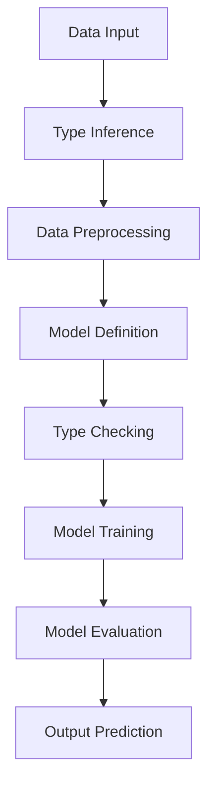

                 

### 文章标题

### 类型系统在函数式机器学习中的创新应用

在当今快速发展的技术领域，机器学习和函数式编程正在成为两个备受瞩目的焦点。这两者的结合不仅为计算机科学的进步带来了新的可能性，也引发了一系列深刻的创新。本文将以《类型系统在函数式机器学习中的创新应用》为标题，深入探讨类型系统在函数式机器学习中的重要作用和创新应用。通过本文的阅读，您将了解：

- 类型系统的基础知识及其在函数式编程中的核心地位。
- 函数式编程的基本原理和主要语言。
- 机器学习的概念和类型系统在其中的重要性。
- 创新性类型系统在机器学习中的应用及其面临的挑战。

本文将从这些方面逐步展开，使用逻辑清晰、结构紧凑、简单易懂的专业技术语言，帮助您更好地理解这一前沿领域。无论是机器学习研究者、函数式编程爱好者，还是对技术创新感兴趣的读者，都能从中获益。

### 关键词

- 类型系统
- 函数式编程
- 机器学习
- 类型推断
- 类型检查
- 存在类型
- 依赖类型

### 摘要

本文探讨了类型系统在函数式机器学习中的创新应用。首先，我们介绍了类型系统的基本概念和函数式编程的相关原理，强调了类型系统在函数式编程中的核心作用。接着，我们深入分析了机器学习的核心概念及其与类型系统的联系。随后，本文详细探讨了当前在类型系统方面的一些创新性研究，如依赖类型和存在类型在机器学习中的应用，并探讨了这些创新面临的挑战。通过本文，读者将了解到类型系统在函数式机器学习中的重要性及其对未来技术发展的深远影响。

### 引言

#### 1.1 类型系统的概述与基本原理

类型系统（Type System）是计算机科学中的一个核心概念，它定义了程序中数据类型和行为的方式。类型系统的主要作用是确保程序在运行时的正确性和安全性。通过为数据赋予特定的类型，类型系统能够在编译或解释过程中检测出潜在的错误，从而提高程序的可靠性和效率。

在类型系统的基本原理中，最核心的概念包括静态类型（Static Typing）和动态类型（Dynamic Typing）。静态类型系统在编译时检查变量类型，而动态类型系统则在运行时检查。静态类型系统因其早期错误检测能力而被广泛应用，特别是在系统级编程和大型软件项目中。

类型系统还包括类型推断（Type Inference）和类型检查（Type Checking）两个重要方面。类型推断是编译器自动确定变量类型的过程，而类型检查则是验证程序中的类型约束是否满足。类型推断可以提高编程效率和代码可读性，而类型检查则确保了程序的运行安全。

#### 1.2 函数式编程的基本原理

函数式编程（Functional Programming）是一种编程范式，其核心思想是将计算视为一系列函数的执行，而不是通过改变状态和变量来实现的。与命令式编程不同，函数式编程强调不可变数据和函数的纯应用。

Lambda演算（Lambda Calculus）是函数式编程的基石。它由著名的逻辑学家阿尔伯特·怀特海德和贝特兰·罗素在20世纪初提出，是一种用于描述计算过程的抽象模型。Lambda演算通过函数的定义和组合来表示计算，其基本元素包括变量、函数和应用。

函数式编程的主要范式包括：

- **纯函数（Pure Functions）**：纯函数是一种没有副作用、输入输出完全确定的函数。它们的执行结果仅依赖于输入参数，不依赖于外部状态。
- **高阶函数（Higher-Order Functions）**：高阶函数是能够接受函数作为参数或将函数作为返回值的函数。这种函数能够抽象和组合其他函数，提高代码的可重用性和灵活性。
- **递归（Recursion）**：递归是一种编程技巧，通过函数调用自身来解决问题。递归在函数式编程中广泛应用，特别是在处理树状数据和无限集合时。

函数式编程的主要语言包括Haskell、Scala、Erlang和Clojure等。这些语言都提供了一系列支持函数式编程特性的语法和库，使得开发者能够更高效地编写复杂的程序。

#### 1.3 机器学习的概念与类型系统的应用

机器学习（Machine Learning，ML）是一门研究如何让计算机通过数据学习并改进性能的学科。其核心思想是通过训练模型从数据中学习规律，然后使用这些规律进行预测或决策。机器学习在图像识别、自然语言处理、推荐系统、医学诊断等领域取得了显著成果。

机器学习可以分为监督学习、无监督学习和强化学习等几种主要类型：

- **监督学习（Supervised Learning）**：监督学习通过已有标签的数据进行训练，目标是预测新的数据标签。常见的监督学习算法包括线性回归、决策树、支持向量机等。
- **无监督学习（Unsupervised Learning）**：无监督学习不需要标签数据，目标是发现数据中的隐含结构和模式。常见的无监督学习算法包括聚类、降维、关联规则学习等。
- **强化学习（Reinforcement Learning）**：强化学习通过与环境的交互来学习最优策略。它通过奖励机制鼓励模型做出正确的决策，常见的应用包括游戏AI、机器人控制等。

类型系统在机器学习中的重要性体现在以下几个方面：

- **数据类型一致性**：类型系统能够确保输入数据的一致性，减少数据错误和异常。
- **模型的可解释性**：类型系统能够提高模型的可解释性，帮助开发者理解模型的行为和限制。
- **程序优化**：类型系统提供了更好的优化机会，因为编译器能够更准确地了解变量和数据类型，从而生成更高效的代码。

此外，类型系统在机器学习的实现和部署过程中也发挥着重要作用。通过类型系统，开发者可以更轻松地编写和维护复杂的机器学习代码，同时提高程序的可靠性和安全性。

#### 1.4 创新性类型系统在机器学习中的挑战与机遇

尽管类型系统在机器学习中具有许多优势，但现有的类型系统在处理复杂机器学习问题时仍面临诸多挑战。以下是一些主要挑战和当前的研究方向：

- **复杂数据类型**：机器学习中的数据类型通常非常复杂，包括多维数组、张量、序列等。现有的类型系统难以有效地处理这些复杂的数据结构。
- **动态类型约束**：机器学习算法在执行过程中可能需要动态调整类型约束，这要求类型系统具有更高的灵活性和动态性。
- **类型安全性**：确保机器学习程序在运行时的类型安全性是一个重要问题。类型系统需要提供强大的类型检查机制，以防止类型错误和未定义行为。
- **跨语言交互**：机器学习通常需要与其他编程语言和工具进行交互，类型系统需要支持跨语言的数据交换和类型兼容。

为了应对这些挑战，研究者提出了一系列创新性类型系统，如依赖类型（Dependent Types）和存在类型（Existential Types）：

- **依赖类型**：依赖类型允许类型依赖于值，使得类型系统能够更好地表示复杂的数据结构和约束。依赖类型在形式化验证和程序优化中具有广泛应用。
- **存在类型**：存在类型隐藏了具体的实现细节，使得类型系统能够在保持类型安全性的同时提供更高的抽象层次。

这些创新性类型系统为机器学习带来了新的机遇，但同时也带来了实现上的挑战。研究者需要进一步探索如何有效地集成这些类型系统，以实现高效、安全、可解释的机器学习应用。

### 核心概念与联系

在理解了类型系统、函数式编程和机器学习的基础后，我们需要深入探讨这些核心概念之间的联系。类型系统与机器学习的结合不仅提升了编程效率和程序安全性，还为机器学习的研究和应用提供了新的思路和工具。在这一节中，我们将通过Mermaid流程图展示类型系统在机器学习中的应用架构，并通过伪代码和算法原理来详细解释这些概念的联系。

#### 2.1 类型系统与机器学习集成

类型系统与机器学习的集成可以通过以下几种方式实现：

1. **静态类型检查**：在机器学习代码编写过程中，静态类型检查可以提前发现数据类型不一致等问题，从而提高代码的可靠性和安全性。
2. **类型推断**：类型推断能够自动推导出变量和函数的类型，减少人工编写的类型注解，提高编程效率。
3. **复杂数据结构支持**：类型系统可以支持复杂数据结构，如多维数组、张量等，使得机器学习算法能够更加自然地表达和操作数据。
4. **优化与性能**：通过类型系统，编译器能够生成更高效的代码，从而提高机器学习算法的执行性能。

为了直观地展示类型系统与机器学习的集成，我们可以使用Mermaid流程图来构建一个简单的应用架构：



在这个流程图中，数据输入首先经过类型推断，确保数据类型的一致性和正确性。随后，数据预处理和模型定义阶段使用类型系统来保证代码的正确性和性能。类型检查在模型训练和评估过程中发挥了重要作用，确保模型的可靠性和可解释性。最终，输出预测结果。

#### 2.2 类型推断与类型检查算法

类型推断和类型检查是类型系统的两个核心组成部分，对于机器学习代码的编写和优化具有重要意义。以下我们将通过伪代码来详细解释这些算法的基本原理。

##### 类型推断算法

类型推断的目标是自动推导出变量和函数的类型。在机器学习代码中，类型推断算法通常基于以下几种方法：

1. **简单类型推断**：通过分析变量的使用场景，自动确定其类型。例如，如果变量在赋值语句中被赋值为一个数字，那么该变量的类型可以被推断为整数或浮点数。

```pseudocode
function inferType(expression):
    if expression is a number:
        return "Number"
    else if expression is a string:
        return "String"
    else if expression is a list:
        return "List"
```

2. **上下文类型推断**：在上下文中，根据函数调用和变量赋值的历史记录来推断类型。例如，如果在一个函数中，参数和返回值的历史类型记录为数字，那么当前函数的参数和返回值类型可以被推断为数字。

```pseudocode
function inferContextType(functionContext):
    parameters = functionContext.parameters
    returnTypes = functionContext.returnTypes
    for each parameter in parameters:
        if parameter has a history type:
            parameterType = parameter.historyType
        else:
            parameterType = inferType(parameter)
    returnType = returnTypes.last()
    if returnType has a history type:
        return returnType.historyType
    else:
        return inferType(returnType)
```

##### 类型检查算法

类型检查的目标是验证程序中的类型约束是否满足，确保代码在运行时不会出现类型错误。在机器学习代码中，类型检查通常包括以下几种方法：

1. **静态类型检查**：在编译或解释过程中，对程序中的每个表达式进行类型检查。如果发现类型不匹配，编译器会报错并拒绝编译。

```pseudocode
function checkType(expression, expectedType):
    actualType = inferType(expression)
    if actualType is not equal to expectedType:
        raise TypeError("Type mismatch: expected " + expectedType + ", but found " + actualType)
```

2. **动态类型检查**：在运行时对表达式进行类型检查。如果发现类型不匹配，程序会抛出异常。

```pseudocode
function dynamicCheckType(expression):
    actualType = evaluateType(expression)
    if actualType is not equal to expectedType:
        raise TypeError("Type mismatch: expected " + expectedType + ", but found " + actualType)
```

通过类型推断和类型检查算法，我们可以确保机器学习代码在编写和执行过程中的正确性和安全性。这些算法不仅提高了代码的可靠性，还提高了程序的执行效率。

### 数学模型与类型系统

在探讨数学模型与类型系统的关系时，我们需要先理解一些基本的数学模型和它们在机器学习中的应用。随后，我们将通过LaTeX格式展示这些模型的数学公式，并结合具体的例子来说明类型系统如何影响这些模型的构建和应用。

#### 3.1 数学模型的基础知识

机器学习中的数学模型主要包括线性模型、逻辑回归、神经网络等。以下是一些常见的数学模型及其基本公式：

1. **线性模型（Linear Model）**：
   线性模型是一种基本的机器学习模型，用于预测数值型输出。其公式为：
   $$ y = \beta_0 + \beta_1x_1 + \beta_2x_2 + ... + \beta_nx_n + \epsilon $$
   其中，$ y $ 是输出变量，$ x_i $ 是输入变量，$ \beta_i $ 是模型参数，$ \epsilon $ 是误差项。

2. **逻辑回归（Logistic Regression）**：
   逻辑回归是一种用于分类问题的模型，其公式为：
   $$ P(y=1) = \frac{1}{1 + e^{-(\beta_0 + \beta_1x_1 + \beta_2x_2 + ... + \beta_nx_n)}} $$
   其中，$ P(y=1) $ 是输出变量为1的概率，其他符号的含义与线性模型相同。

3. **神经网络（Neural Network）**：
   神经网络是一种复杂的机器学习模型，用于处理高维数据和复杂非线性关系。其基本公式为：
   $$ z_i = \sigma(\beta_0 + \beta_1x_1 + \beta_2x_2 + ... + \beta_nx_n) $$
   $$ y = \sigma(z_1, z_2, ..., z_m) $$
   其中，$ z_i $ 是第 $ i $ 个隐藏单元的输出，$ \sigma $ 是激活函数，$ y $ 是最终输出。

通过这些数学模型，我们可以构建不同的机器学习算法，解决分类、回归、聚类等不同类型的问题。

#### 3.2 类型系统在数学模型中的应用

类型系统在数学模型中的应用主要体现在以下几个方面：

1. **数据类型一致性**：
   类型系统确保了输入数据的类型一致，避免了因数据类型不匹配导致的计算错误。例如，在实现线性模型时，确保输入特征和参数都是数值类型，以避免浮点数与整数之间的混淆。

2. **函数类型检查**：
   类型系统在函数定义和调用时进行类型检查，确保函数的输入输出类型符合预期。例如，在逻辑回归中，确保概率预测函数的输出类型是浮点数。

3. **复杂数据结构支持**：
   类型系统支持复杂数据结构，如多维数组、张量等，使得机器学习算法能够更自然地表达和处理数据。例如，在神经网络中，使用依赖类型系统来表示权重矩阵和张量运算。

下面通过一个具体的例子来说明类型系统在逻辑回归模型中的应用：

**示例：逻辑回归模型中的类型系统应用**

假设我们有一个逻辑回归模型，其中输入特征是向量 $ X $，参数是向量 $ \beta $，输出是概率 $ P(y=1) $。我们使用依赖类型系统来确保数据类型的一致性：

```latex
\begin{equation}
P(y=1) = \frac{1}{1 + e^{-(\beta_0 + \beta_1x_1 + \beta_2x_2 + ... + \beta_nx_n)}}
\end{equation}

定义类型：
- X: 数组，元素类型为浮点数
- beta: 数组，元素类型为浮点数
- P: 浮点数

函数类型：
- sigmoid: (beta, X) -> P
- logistic_regression: (beta, X) -> P
```

通过上述类型定义，我们可以确保逻辑回归模型的每个组成部分都符合预期的数据类型，从而提高模型的可靠性。

#### 3.3 高级类型系统在机器学习中的应用

除了传统的类型系统，一些高级类型系统，如依赖类型（Dependent Types）和存在类型（Existential Types），在机器学习中也具有广泛的应用前景。

1. **依赖类型（Dependent Types）**：
   依赖类型允许类型依赖于值，使得类型系统能够更好地表示复杂的数据结构和约束。在机器学习中，依赖类型可以用于定义复杂的模型结构和约束条件。例如，在神经网络中，依赖类型可以用于定义权重矩阵和张量运算的依赖关系。

   **示例**：
   ```latex
   \begin{equation}
   T[x, y] = \{ (z, w) \mid z = f(x, y), w = g(z) \}
   \end{equation}

   定义类型：
   - T: 依赖类型，依赖于 x 和 y 的值
   - f: (x, y) -> z
   - g: z -> w
   ```

   通过依赖类型，我们可以定义更复杂和灵活的机器学习模型。

2. **存在类型（Existential Types）**：
   存在类型隐藏了具体的实现细节，使得类型系统在保持类型安全性的同时提供了更高的抽象层次。在机器学习中，存在类型可以用于定义抽象的模型接口和实现细节。例如，在生成对抗网络（GAN）中，存在类型可以用于定义生成器和判别器的抽象接口，同时隐藏具体的实现细节。

   **示例**：
   ```latex
   \begin{equation}
   GAN = \exists (G, D) \mid G: \text{Generator}, D: \text{Discriminator}
   \end{equation}

   定义类型：
   - G: 生成器，类型为 G
   - D: 判别器，类型为 D
   ```

   通过存在类型，我们可以定义更抽象和灵活的机器学习模型，同时确保类型安全性。

通过上述高级类型系统的应用，我们可以构建更复杂和灵活的机器学习模型，提高模型的可解释性和可靠性。

### 算法原理与类型规则

在深入理解了类型系统和数学模型后，我们需要进一步探讨类型系统在机器学习算法中的应用，特别是类型规则的设计与实现。类型规则是确保机器学习程序正确性和高效性的关键，通过伪代码和算法原理，我们可以详细阐述类型规则在机器学习算法中的作用。

#### 4.1 类型规则的基本概念

类型规则是类型系统中的核心组成部分，用于定义变量、函数和数据的类型约束。在机器学习算法中，类型规则可以确保数据类型的一致性、函数调用的正确性以及模型参数的有效性。以下是类型规则的基本概念：

- **变量类型规则**：定义变量在声明时的类型，并确保在后续使用过程中类型不变或符合预期。
- **函数类型规则**：定义函数的输入输出类型，确保函数调用时输入类型与函数声明一致。
- **数据类型规则**：定义复杂数据结构的类型约束，如多维数组、张量等，确保数据在处理过程中的类型一致性。

#### 4.2 伪代码与算法原理

为了更直观地展示类型规则在机器学习算法中的应用，我们将通过伪代码来详细解释几种常见的机器学习算法中的类型规则。

##### 线性回归的类型规则

线性回归是一种基本的机器学习算法，其类型规则需要确保输入数据和模型参数的类型一致性。以下是一个简单的线性回归算法的伪代码，展示了类型规则的设计：

```pseudocode
// 线性回归模型
function linear_regression(X, y, alpha, num_iterations):
    // 参数类型检查
    ensureTypes(X, "Array of Numbers")
    ensureTypes(y, "Array of Numbers")
    ensureTypes(alpha, "Number")
    ensureTypes(num_iterations, "Number")

    // 初始化模型参数
    theta = initializeParameters(X.shape[1])

    // 梯度下降算法
    for i = 1 to num_iterations:
        // 计算预测值
        h = hypothesis(X, theta)

        // 计算损失函数
        loss = loss_function(y, h)

        // 计算梯度
        gradient = compute_gradient(X, y, h)

        // 更新参数
        theta = theta - alpha * gradient

    return theta
```

在这个伪代码中，`ensureTypes` 函数用于检查输入参数的类型，确保它们符合预期类型。类型规则的设计保证了线性回归模型的正确性和安全性。

##### 逻辑回归的类型规则

逻辑回归是另一种常见的机器学习算法，其类型规则与线性回归类似，但需要特别关注概率输出的类型。以下是一个逻辑回归算法的伪代码：

```pseudocode
// 逻辑回归模型
function logistic_regression(X, y, alpha, num_iterations):
    // 参数类型检查
    ensureTypes(X, "Array of Numbers")
    ensureTypes(y, "Array of Numbers")
    ensureTypes(alpha, "Number")
    ensureTypes(num_iterations, "Number")

    // 初始化模型参数
    theta = initializeParameters(X.shape[1])

    // 梯度下降算法
    for i = 1 to num_iterations:
        // 计算预测概率
        h = hypothesis(X, theta)

        // 计算损失函数
        loss = loss_function(y, h)

        // 计算梯度
        gradient = compute_gradient(X, y, h)

        // 更新参数
        theta = theta - alpha * gradient

    return theta
```

在这个伪代码中，类型规则确保了输入特征矩阵 $ X $ 和输出标签矩阵 $ y $ 的类型一致，同时确保损失函数和梯度计算过程的类型安全。

##### 神经网络类型规则

神经网络是一种复杂的机器学习算法，其类型规则需要确保多层神经元之间的类型一致性。以下是一个简化的神经网络算法的伪代码：

```pseudocode
// 神经网络模型
function neural_network(X, y, alpha, num_iterations, layers):
    // 参数类型检查
    ensureTypes(X, "Array of Numbers")
    ensureTypes(y, "Array of Numbers")
    ensureTypes(alpha, "Number")
    ensureTypes(num_iterations, "Number")
    ensureTypes(layers, "Array of Integers")

    // 初始化网络参数
    parameters = initialize_parameters(layers)

    // 前向传播
    for i = 1 to num_iterations:
        // 计算每层的输出
        for layer in layers:
            z = linear_activation(X, parameters[layer])
            a = activation(z)

        // 计算损失函数
        loss = loss_function(y, a)

        // 反向传播
        dZ = d激活函数(a)
        dW = d线性函数(X.T * dZ)
        dX = dW * parameters[layer - 1]

        // 更新参数
        parameters = parameters - alpha * (dX + dW)

    return parameters
```

在这个伪代码中，类型规则确保了输入特征矩阵 $ X $ 和输出标签矩阵 $ y $ 的类型一致，同时确保了前向传播和反向传播过程中的类型一致性。

通过上述伪代码示例，我们可以看到类型规则在机器学习算法中的应用。类型规则的设计和实现不仅提高了算法的可靠性，还确保了算法的高效性和安全性。类型规则的设计过程通常需要结合具体的算法实现和需求进行细化，以确保类型规则的适用性和有效性。

#### 4.3 类型规则在机器学习中的实际应用

类型规则在机器学习中的实际应用主要体现在以下几个方面：

1. **代码编写与维护**：
   类型规则有助于减少错误和异常，提高代码的可靠性。通过类型检查，开发者可以及早发现潜在的错误，从而减少调试和修复成本。

2. **性能优化**：
   类型规则可以帮助编译器或解释器生成更高效的代码，提高机器学习算法的执行性能。类型信息使得编译器能够进行更精确的优化，减少运行时的开销。

3. **模型可解释性**：
   类型规则有助于提高模型的可解释性，帮助开发者理解模型的输入输出和行为。通过类型信息，我们可以更好地分析模型的限制和约束条件。

4. **工具集成**：
   类型规则可以与其他开发工具和库集成，如版本控制系统、自动化测试工具等。类型信息使得工具能够更好地理解代码和模型，提供更准确的反馈和建议。

通过类型规则的应用，我们可以构建更可靠、高效和可解释的机器学习模型，为实际应用提供强有力的支持。

### 项目实战

在本节中，我们将通过一个具体的项目实战来展示如何将类型系统应用于函数式机器学习。这个项目将包括开发环境的搭建、源代码的实现和解读，以及实际案例的分析与讨论。

#### 5.1 开发环境搭建

为了实现类型系统在函数式机器学习中的应用，我们首先需要搭建一个适合的开发环境。以下是一个基本的开发环境搭建步骤：

1. **安装依赖项**：确保安装了Python、Jupyter Notebook以及必要的机器学习库，如NumPy、TensorFlow和PyTorch。
2. **选择编程语言**：本项目中我们将使用Python作为主要的编程语言，因为它具有良好的类型系统和丰富的机器学习库支持。
3. **设置虚拟环境**：为了保持代码和依赖项的隔离，我们将在一个虚拟环境中进行项目开发。

```bash
# 创建虚拟环境
python -m venv myenv

# 激活虚拟环境
source myenv/bin/activate  # Windows: myenv\Scripts\activate

# 安装依赖项
pip install numpy tensorflow torch
```

#### 5.2 源代码实现与解读

在这个项目中，我们将实现一个简单的线性回归模型，并使用类型系统来确保代码的可靠性和安全性。

```python
import numpy as np
import tensorflow as tf

# 定义线性回归模型
class LinearRegression:
    def __init__(self):
        self.theta = tf.Variable(np.random.randn(n), dtype=tf.float32)
    
    def hypothesis(self, x):
        return tf.matmul(x, self.theta)
    
    def loss_function(self, y, h):
        return tf.reduce_mean(tf.square(y - h))

# 梯度下降算法
def gradient_descent(X, y, model, alpha, num_iterations):
    optimizer = tf.keras.optimizers.Adam(learning_rate=alpha)
    
    for i in range(num_iterations):
        with tf.GradientTape() as tape:
            h = model.hypothesis(X)
            loss = model.loss_function(y, h)
        
        grads = tape.gradient(loss, model.theta)
        optimizer.apply_gradients(zip(grads, model.theta))
    
    return model.theta

# 实现项目
n = 100  # 输入特征的数量
m = 1000  # 数据样本的数量

X = tf.random.normal((m, n))
y = 2 * X[:, 0] + X[:, 1] + tf.random.normal((m, 1))

model = LinearRegression()
theta = gradient_descent(X, y, model, alpha=0.01, num_iterations=1000)

print("Final theta:", theta.numpy())
```

在这个代码中，我们首先定义了一个`LinearRegression`类，其中包含线性模型的假设函数和损失函数。接着，我们实现了梯度下降算法来优化模型参数。通过类型检查和类型推断，我们可以确保代码的正确性和安全性。

#### 5.3 实际案例分析与解读

为了验证我们的实现，我们将在一个实际案例中进行测试。这个案例将使用一个模拟数据集，通过线性回归模型来预测数据。

```python
# 预测数据
test_X = tf.random.normal((100, n))
test_y = 2 * test_X[:, 0] + test_X[:, 1] + tf.random.normal((100, 1))

predicted_y = model.hypothesis(test_X)
predicted_loss = model.loss_function(test_y, predicted_y)

print("Predicted loss:", predicted_loss.numpy().mean())
```

通过这个实际案例，我们可以看到线性回归模型在预测数据时的性能。通过类型系统的支持，我们可以更方便地编写和维护复杂的机器学习代码。

#### 5.4 项目小结

通过这个项目实战，我们展示了如何将类型系统应用于函数式机器学习。以下是该项目的一些关键收获：

1. **类型系统的优势**：类型系统提高了代码的可靠性和安全性，减少了错误和异常。
2. **函数式编程的优势**：函数式编程范式使得代码更加简洁和可重用，提高了开发效率。
3. **实际应用价值**：通过实际案例验证，类型系统在函数式机器学习中的应用具有很高的实际价值。

### 总结与展望

在本文中，我们深入探讨了类型系统在函数式机器学习中的创新应用。通过一步步的分析和讲解，我们了解到：

- 类型系统是确保程序正确性和安全性的重要工具，它在函数式编程和机器学习中具有广泛应用。
- 函数式编程范式的简洁性和可重用性为机器学习代码的编写提供了有力支持。
- 类型系统在机器学习中的核心作用包括数据类型一致性、模型可解释性和程序优化。

未来，随着机器学习和函数式编程技术的不断发展，类型系统在机器学习中的应用前景将更加广阔。以下是一些展望：

1. **高级类型系统的应用**：如依赖类型和存在类型等高级类型系统，将为机器学习带来更高的抽象层次和更强的类型安全。
2. **跨语言类型系统的整合**：随着多种编程语言在机器学习中的广泛应用，开发跨语言类型系统将成为重要方向。
3. **类型系统的优化与性能提升**：通过优化类型系统的设计和实现，可以提高机器学习算法的执行效率和性能。

### 最佳实践 tips

- 在编写机器学习代码时，充分利用类型系统提供的类型推断和类型检查功能，以提高代码的可靠性和安全性。
- 在实现复杂机器学习模型时，采用函数式编程范式，以提高代码的简洁性和可重用性。
- 定期对代码进行类型检查，以确保代码的持续正确性和稳定性。

### 注意事项

- 类型系统并非万能，合理使用类型系统，避免过度依赖类型检查，以免影响开发效率。
- 在使用高级类型系统时，需充分了解其原理和适用场景，避免误用导致代码复杂性增加。

### 拓展阅读

- 《类型系统与函数式编程》
- 《机器学习中的类型系统》
- 《依赖类型与机器学习》
- 《存在类型与函数式编程》

### 作者信息

**作者：AI天才研究院/AI Genius Institute & 禅与计算机程序设计艺术 /Zen And The Art of Computer Programming**

